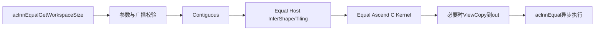
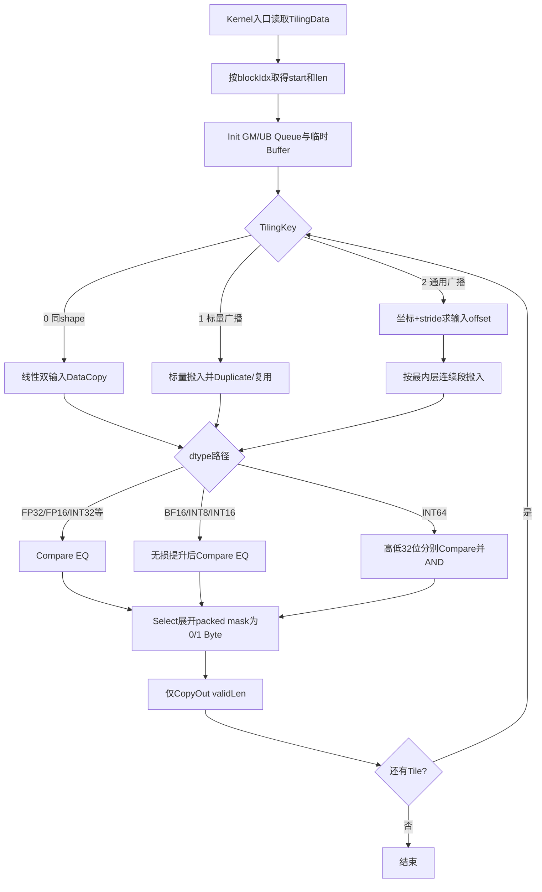

# Equal（aclnnEqual）算子设计文档

## 一、需求背景

### 1.1 需求来源

本需求来源于 2026 年昇腾算子社区任务。任务要求参考 CANN 内置 `Equal` TBE 实现，采用 Ascend C aclnn 算子工程化方式实现 `aclnnEqual`，覆盖任务书规定的全部数据类型、ND 格式、广播、特殊浮点值和确定性计算，并将原实现中的非逻辑值判等路径改为与 CPU `==` 一致的逻辑值比较。

计算公式为：

$$
out_i = (self_i == other_i) ? \mathrm{True} : \mathrm{False}
$$

其中，`self`、`other` 先按 NumPy 广播规则扩展到公共 shape，再逐元素比较；输出为独立 BOOL Tensor。

### 1.2 背景介绍

#### 1.2.1 Equal 算子实现优化

本项目以任务指定 CANN 版本中的内置 TBE 实现为行为和性能基线。开发、验收环境中的参考文件如下：

| 组件 | 文件路径 | 用途 |
|---|---|---|
| TBE Kernel | `/usr/local/Ascend/ascend-toolkit/latest/opp/built-in/op_impl/ai_core/tbe/impl/ops_legacy/dynamic/equal.py` | `Equal` 动态 shape 实现、广播分类及计算路径 |
| 算子原型 | `/usr/local/Ascend/ascend-toolkit/latest/opp/built-in/op_proto/inc/math_ops.h` 中的 `REG_OP(Equal)` | 输入、输出、dtype、format 和 shape 推导声明 |
| 算子信息库 | `/usr/local/Ascend/ascend-toolkit/latest/opp/built-in/op_impl/ai_core/tbe/kernel/config/ascend910b/ops_legacy/equal.json` | Ascend 910B/A2 Kernel 二进制及 dtype/format 配置 |
| ACLNN 接口 | 任务书中的 `aclnnEqualGetWorkspaceSize`、`aclnnEqual` | 本项目必须保持的两段式外部接口 |


优化目标不是改变 aclnn 的输入输出定义，而是将 TBE 的部分数学变换/位级判等路径替换为显式的逻辑值比较，保证：

- `+0.0 == -0.0` 为 True；
- 任意 NaN 与任意值（包括自身）比较均为 False；
- 同号无穷大相等，异号无穷大不等；
- 整数、BOOL 按其逻辑数值精确比较；
- 相同输入重复执行得到完全一致的 BOOL 输出。

#### 1.2.2 Equal 算子现状分析

##### 1.2.2.1 TBE 算子支持的数据类型和数据格式

参数规格如下：

| 参数 | 类别 | dtype | format | shape/value | 约束 |
|---|---|---|---|---|---|
| self | 输入 | FLOAT16、FLOAT、INT8、INT16、INT32、INT64、BOOL、BFLOAT16 | ND | 任意合法维度；浮点值可含 NaN、±0、±Inf | 与 other dtype 相同，shape 可广播 |
| other | 输入 | FLOAT16、FLOAT、INT8、INT16、INT32、INT64、BOOL、BFLOAT16 | ND | 任意合法维度 | 与 self dtype 相同，shape 可广播 |
| out | 独立输出 | BOOL | ND | shape 为广播公共 shape，值为 True/False | dtype 和 shape 必须精确匹配 |

##### 1.2.2.2 TBE 算子实现描述

`equal.py` 包含外层注册入口 `equal()`、主计算函数 `equal_compute()` 和直接比较辅助函数 `equal_compute_with_cmp()`。按源码执行顺序，外层入口依次完成以下操作：

1. 读取 `x`、`y` dtype 并转为小写；源码将 UINT32 归一化为 INT32 后再参与校验。
2. 使用源码 `check_list` 校验 dtype，并校验两输入 dtype 相同。
3. 使用 `classify(..., Mode.ELEWISE_WITH_BROADCAST)` 对动态广播场景分类。
4. 遍历每个分类结果；在 compute 上下文内调用 `variable_shape`，创建两个 placeholder，再调用 `equal_compute()`。
5. 对每个分类结果执行 `auto_schedule`，依次收集 schedule 和 tensor list。
6. 构造包含 `name`、`tensor_list`、`bool_storage_as_1bit=False` 的 config，最后统一调用 `tbe.build()`。

`equal_compute()` 先调用 `broadcast_shapes()` 求对齐后的两输入 shape 和公共广播 shape，再严格按源码条件选择以下路径：

1. **硬件比较路径**：当芯片支持 16 位块、dtype 属于芯片支持的 `type_range`，或 INT32 支持 `vcmp` 时，先广播两输入，再执行 `tbe.vcmp(x, y, "eq", mode="bool")`，输出逐元素 BOOL。
   - `check_support_block_size_16()` 为 True 时，先把两输入转为 FLOAT16，再调用 `equal_compute_with_cmp()`。
   - 否则根据 `is_v200()` 设置直接比较集合：V200 为 `{INT64, UINT64, FLOAT32, FLOAT16}`，非 V200 为 `{INT64, UINT64}`。
   - dtype 落入集合时调用 `equal_compute_with_cmp()`；INT32 还会通过 `api_check_support(vcmp, int32)` 独立判断是否走该路径。
2. **数学变换路径**：不满足直接比较条件时，根据原始 dtype 选择常量和计算精度。
   - FLOAT32：`eps=2^-126`、主缩放 `2^50`、附加缩放 `2^26`、偏移 `-1`。
   - 其他 dtype：`eps=2^-24`、主缩放 `2^12`、偏移 `-1`。
   - INT8/UINT8 先转 FLOAT16；随后广播两输入，执行 `vsub`。
   - 若当前 dtype 支持 `vabs`，直接取绝对值；否则先转 FLOAT32 再取绝对值。
   - 依次执行 `vmins(eps)`、两次 `vmuls(main_scale)`；FLOAT32 再执行一次 `vmuls(2^26)`；随后执行 `vadds(-1)`、`vabs`，最后 Cast 为 INT8/BOOL。
3. **直接比较辅助函数**：`equal_compute_with_cmp()` 只做两输入广播和 `tbe.vcmp(..., "eq", mode="bool")`，没有数学近似步骤。
4. **输出存储**：构建阶段设置 `bool_storage_as_1bit=False`，因此外部输出按每元素 1 Byte 的 BOOL 形式存储。

数学变换路径可概括为：

$$
r=\left|\operatorname{scale}(\min(|x-y|,\epsilon))-1\right|
$$

它依赖减法、绝对值、最小值和缩放对特殊浮点值的传播行为，不等价于 IEEE 754 `==`，尤其 NaN 可能得到与 CPU 不一致的结果。因此 Ascend C 版本不复用该近似数学链，而使用 `Compare(EQ)` 或等价的精确整数比较。

##### 1.2.2.3 TBE 算子实现流程图

下图按 `equal.py` 的函数边界和语句顺序展开，保留外层分类循环、全部能力判断、dtype 分支、常量分支、`vabs` 回退分支以及最终构建配置。节点名称与上一节源码步骤一一对应。

```mermaid
flowchart TD
    subgraph ENTRY["equal()：注册入口与动态分类"]
        E1["读取 x_dtype、y_dtype 并 lower"]
        E2{"dtype == uint32?"}
        E3["uint32 归一化为 int32"]
        E4["按 check_list 校验 x/y dtype"]
        E5{"x_dtype == y_dtype?"}
        E6["不一致则参数校验报错"]
        E7["classify([x,y], ELEWISE_WITH_BROADCAST)"]
        E8["初始化 schedules、tensors"]
        E9["遍历每组分类结果"]
        E10["进入 te.op.compute 上下文"]
        E11["variable_shape 得到动态 shape"]
        E12["创建 x、y placeholder"]

        E1 --> E2
        E2 -->|是| E3 --> E4
        E2 -->|否| E4
        E4 --> E5
        E5 -->|否| E6
        E5 -->|是| E7 --> E8 --> E9 --> E10 --> E11 --> E12
    end

    subgraph COMPUTE["equal_compute()：公共 shape 与路径选择"]
        C1["broadcast_shapes 得到 shape_x、shape_y、shape_broad"]
        C2{"check_support_block_size_16()?"}
        C3["Cast x、y 为 float16"]
        C4{"is_v200()?"}
        C5["type_range = int64,uint64,float32,float16"]
        C6["type_range = int64,uint64"]
        C7{"x_dtype in type_range?"}
        C8{"x_dtype == int32 且 vcmp(int32) 可用?"}
        C9{"x_dtype == float32?"}
        C10["常量: eps=2^-126, scale1=2^50, scale2=2^26, offset=-1"]
        C11["常量: eps=2^-24, scale1=2^12, offset=-1"]
        C12{"x_dtype 为 int8 或 uint8?"}
        C13["Cast x、y 为 float16"]
        C14["tbe.broadcast x、y 到 shape_broad"]
        C15["tbe.vsub: diff = x - y"]
        C16{"vabs 支持 diff.dtype?"}
        C17["tbe.vabs(diff)"]
        C18["Cast diff 为 float32"]
        C19["tbe.vabs(float32 diff)"]
        C20["tbe.vmins(abs_diff, eps)"]
        C21["第一次 tbe.vmuls(scale1)"]
        C22["第二次 tbe.vmuls(scale1)"]
        C23{"原始 x_dtype == float32?"}
        C24["tbe.vmuls(scale2=2^26)"]
        C25["tbe.vadds(offset=-1)"]
        C26["tbe.vabs，映射为 0/1"]
        C27["Cast 结果为 int8"]

        C1 --> C2
        C2 -->|是| C3
        C2 -->|否| C4
        C4 -->|是| C5 --> C7
        C4 -->|否| C6 --> C7
        C7 -->|否| C8
        C8 -->|否| C9
        C9 -->|是| C10 --> C12
        C9 -->|否| C11 --> C12
        C12 -->|是| C13 --> C14
        C12 -->|否| C14
        C14 --> C15 --> C16
        C16 -->|是| C17 --> C20
        C16 -->|否| C18 --> C19 --> C20
        C20 --> C21 --> C22 --> C23
        C23 -->|是| C24 --> C25
        C23 -->|否| C25
        C25 --> C26 --> C27
    end

    subgraph CMP["equal_compute_with_cmp()：直接比较辅助函数"]
        V1["tbe.broadcast x、y 到 shape_broad"]
        V2["tbe.vcmp(x,y,'eq',mode='bool')"]
        V1 --> V2
    end

    subgraph BUILD["equal()：调度与构建"]
        B1["离开 compute 上下文，得到 res"]
        B2["auto_schedule(res)"]
        B3["追加 schedule 与 [x,y,res] tensor"]
        B4{"还有分类结果?"}
        B5["config: name、tensor_list、bool_storage_as_1bit=False"]
        B6["tbe.build(schedules, config)"]
        B7["输出每元素 1 Byte BOOL"]
        B1 --> B2 --> B3 --> B4
        B4 -->|否| B5 --> B6 --> B7
    end

    E12 --> C1
    C3 -->|Cast后调用比较函数| V1
    C7 -->|是| V1
    C8 -->|是| V1
    V2 --> B1
    C27 --> B1
    B4 -->|是| E9
```



## 二、需求分析

### 2.1 外部组件依赖

| 依赖 | 作用 | 约束 |
|---|---|---|
| CANN 算子开源仓指定版本 | 编译、部署、ACLNN/OPP 运行环境 | 编译与验收必须使用同一大版本 |
| ACL Runtime | Stream、Device 内存及 Kernel 调度 | 使用 aclnn 两段式接口，不新增外部 ABI |
| Atlas A2/A3 硬件环境 | 精度、性能和确定性验证 | TBE 与 Ascend C 必须在同机同频配置下对比 |
| AscendOpTest | 泛化精度与性能验收 | 使用任务提供用例并补齐全场景用例 |

不依赖额外第三方开源库，不引入网络服务、文件系统或随机数依赖。

### 2.2 内部适配模块

| 内部模块 | 适配内容 |
|---|---|
| aclnn/opdev | 参数校验、Executor、Contiguous、ViewCopy、两段式接口 |
| op_host | `equal_def.cpp`、`equal_infershape.cpp`、`equal_tiling.cpp`：原型注册、广播 shape 推导、Tiling 和平台信息查询 |
| op_kernel | `equal.cpp`、`equal.h`、`equal_tiling_data.h`、`equal_tiling_key.h`：Kernel、队列/UB 管理和模板参数 |
| op_api | `aclnn_equal.cpp/.h`、`equal.cpp/.h`：参数校验、Executor、Contiguous、ViewCopy 和 Kernel 下发 |
| build/package | `CMakeLists.txt`、A2/A3 SoC 配置、算子包生成与部署 |
| tests/examples/docs | Host/Kernel UT、ST、ACLNN 示例、接口 README 与自测说明 |

算子落位于 `experimental/math/equal`，按仓库规范组织 `op_api/`、`op_host/`、`op_kernel/`、`tests/`、`examples/` 和 `docs/`。

### 2.3 需求模块设计

#### 2.3.1 Ascend C 算子原型

对外接口严格采用任务书定义：

```cpp
aclnnStatus aclnnEqualGetWorkspaceSize(
    const aclTensor *self,
    const aclTensor *other,
    aclTensor *out,
    uint64_t *workspaceSize,
    aclOpExecutor **executor);

aclnnStatus aclnnEqual(
    void *workspace,
    uint64_t workspaceSize,
    aclOpExecutor *executor,
    aclrtStream stream);
```

第一段接口完成以下工作：

1. 校验 `self`、`other`、`out`、`workspaceSize`、`executor` 非空；
2. 校验输入 dtype 相同且属于任务规定的 8 种 dtype；
3. 校验输入 format 为 ND，shape 满足广播规则；
4. 推导公共 shape，校验 `out` 为 BOOL 且 shape 完全一致；
5. 对非连续输入执行 `Contiguous`，为非连续输出安排 `ViewCopy`；
6. 任一输入为空且广播结果为空时返回成功，不向 Executor 加入 `Equal` Kernel；非空 Tensor 将 `Equal` 加入执行队列；
7. 返回实际 workspace 大小和 Executor。

第二段接口调用统一执行框架，在传入 Stream 上异步执行。Kernel 本身不申请 Global Workspace；`workspaceSize` 仅可能来自 Contiguous/ViewCopy 等框架节点。

#### 2.3.2 Ascend C 算子相关约束及相对 TBE 差异

| 项目 | TBE/历史行为 | Ascend C 目标行为 | 原因 |
|---|---|---|---|
| 浮点相等 | 部分 dtype 走数学变换或非逻辑路径 | IEEE 逻辑 `Compare(EQ)` | 满足任务对 ±0、NaN、±Inf 的明确要求 |
| dtype | TBE 信息库与 Python 校验口径不一致 | 仅任务规定的 8 种，新增 INT16，不支持 UINT8/UINT64 | 任务书是本次对外合同 |
| 输入 dtype | `equal.py` 校验两输入 dtype 完全相同 | self/other 必须完全相同 | 与 TBE 及任务书一致 |
| format | ND | ND | 完全对齐 |
| 广播 | 支持 | 支持同 shape、标量和通用双向广播 | 完全对齐任务要求 |
| 输出 | 每元素 BOOL | 每元素 BOOL（0/1 Byte） | 保持接口和存储语义 |

除任务书明确不要求的 UINT8/UINT64 外，不缺失任何任务要求的 TBE 功能。算子不支持 dtype 自动提升、不支持非 ND 私有格式、不接受广播不兼容 shape，也不允许 out dtype/shape 与推导结果不一致。

## 三、需求详细设计

### 3.1 使能方式

算子通过 ACLNN 直调框架使能。调用者必须先调用 `aclnnEqualGetWorkspaceSize` 获取 workspace 和 Executor，再调用 `aclnnEqual` 执行。Host 注册 OpType `Equal`，A2/A3 配置均启用 AICore；不新增属性，不通过环境变量切换语义，不使用随机或原子累加。

### 3.2 需求总体设计

整体调用链为：



#### 3.2.1 Host 侧设计

##### 3.2.1.1 分核策略

将广播后的输出逻辑展平为长度 `N` 的一维序列。为兼顾 BOOL 输出的 32 Byte DMA 对齐，定义一个分核单位含 `A=32` 个输出元素：

$$
U=\left\lceil\frac{N}{A}\right\rceil,\qquad
C=\min(C_{AIV}, U)
$$

其中 `C_AIV` 由 `PlatformAscendC::GetCoreNumAiv()` 获取；若接口返回 0，则回退到平台可用核数。令：

$$
q=\left\lfloor\frac{U}{C}\right\rfloor,\qquad r=U\bmod C
$$

前 `r` 个核各处理 `q+1` 个单位，其余核各处理 `q` 个单位。第 `b` 个核的起始单位和逻辑数据量为：

$$
startUnit_b=bq+\min(b,r)
$$

$$
start_b=32\times startUnit_b
$$

定义指示函数 `I(condition)`：条件成立取 1，否则取 0，则：

$$
len_b=\min\left(32\times(q+I(b<r)),\ N-start_b\right)
$$

该策略保证：大 shape 尽量满核；核间工作量最多相差 32 个元素；只有全局最后一个有效核可能处理非 32 元素尾块；不会访问 `N` 以外的 GM。`N=0` 已在 ACLNN 参数处理阶段返回，不进入 InferShape/Tiling/Kernel 下发流程，因此不会产生非法 BlockDim。

##### 3.2.1.2 数据分块和内存优化策略

Host 从平台获取 UB 总量 `M_UB`，扣除系统保留区 `M_reserve`，按 dtype 对队列及临时 Tensor 的实际占用计算单 Tile 元素数。设：

- 双缓冲数 `B=2`；
- 输入元素字节数 `S=sizeof(T)`；
- 输出 BOOL 每元素 1 Byte；
- Tile 有效元素数为 `L`；
- `A(x)=32×ceil(x/32)` 表示按 32 Byte 向上对齐；
- Compare packed mask 占用 `M_mask(L)=A(ceil(L/8))` Byte；
- Tile 长度优先按 256 元素对齐，以同时满足 BOOL DMA 和 Compare mask 的整块处理要求。

输入、输出双缓冲队列占用为：

$$
M_{queue}(T,L)=B\times\left(2\times A(SL)+A(L)\right)
$$

各 dtype 临时 LocalMemory 按实际计算链预留如下。表内为保守上界，允许复用已出队且后续不再读取的输入 LocalTensor，但 Tiling 不能依赖该复用来突破上界。

| dtype 路径 | 临时 LocalMemory `M_tmp(T,L)` | 内容 |
|---|---:|---|
| FLOAT | `M_mask(L)+A(2L)` | EQ mask、FLOAT→HALF→BOOL 的 HALF 临时 Tensor |
| FLOAT16 | `M_mask(L)+A(2L)` | EQ mask、Select 的 HALF 结果 |
| BFLOAT16 | `M_mask(L)+2×A(4L)+A(2L)` | 两个 FP32 提升 Tensor、EQ mask、HALF 输出临时 Tensor |
| INT8 | `M_mask(L)+2×A(2L)` | 两个 INT16 提升 Tensor和 EQ mask；Select 复用一个提升 Tensor |
| INT16 | `M_mask(L)+2×A(4L)+A(2L)` | 两个 INT32 提升 Tensor、EQ mask、HALF 输出临时 Tensor |
| INT32 | `M_mask(L)+A(2L)` | EQ mask、HALF 输出临时 Tensor |
| INT64 | `2×M_mask(L)+A(2L)` | 高/低 32 位 EQ mask；AND 复用其中一个 mask；HALF 输出临时 Tensor |
| BOOL | `M_mask(L)+2×A(2L)` | 两个 INT16 提升 Tensor和 EQ mask；Select 复用一个提升 Tensor |

UB 约束和 Tile 选择公式为：

$$
M_{total}(T,L)=M_{reserve}+M_{queue}(T,L)+M_{tmp}(T,L)\le M_{UB}
$$

$$
tileLen=\max\{L\mid L\equiv0\pmod{256},\ M_{total}(T,L)\le M_{UB}\}
$$

若 UB 无法容纳 256 个元素，则改取满足约束的最大 32 元素倍数；不足 32 元素的全局尾块仍分配一个 32 元素对齐的 LocalTensor，仅通过 `validLen` 控制有效计算和写回。Host/Kernel UT 对每种 dtype 验证 `M_total≤M_UB`、首尾 Tile 和最小 UB 边界。

同 shape 快路径按连续一维 Tile 双缓冲流水执行 `CopyIn → Compute → CopyOut`。通用广播路径先右对齐输入 shape，计算：

$$
outDim_d=\max(selfDim_d,otherDim_d)
$$

对每个输入构造广播 stride：若该维输入长度为 1 且输出长度大于 1，则 stride 为 0；否则为连续 ND stride。输出线性下标 `p` 对应输入地址：

$$
offset_{in}(p)=\sum_{d=0}^{R-1}coord_d(p)\times stride_{in,d}
$$

Host 合并广播模式和连续性相同的相邻维，减少 Kernel 除法、取模次数。Kernel 以最内层连续段为搬运单元：连续输入使用批量 DataCopy，标量广播使用 Duplicate，其他广播按连续段循环搬运，避免将完整广播 Tensor 物化到 GM。尾块使用支持 padding 的搬运接口或显式 mask，严禁越界读写。

TilingData 包含：`totalLength`、`tileLength`、`rank`、`tilingKey`、`usedCoreNum`、大小核单位数、合并后的 `outShape[8]`、`selfStride[8]`、`otherStride[8]`。ACLNN Host 对 self、other、out 统一执行最大 8 维校验；0D 标量以及 1D～8D Tensor 均属于支持范围。

##### 3.2.1.3 TilingKey 规划策略

| TilingKey | 设置条件 | Kernel 路径 |
|---|---|---|
| 0：NO_BROADCAST | `self.shape == other.shape == out.shape` | 纯线性连续快路径 |
| 1：SCALAR_BROADCAST | 至少一个输入元素数为 1，且存在广播 | 标量一次搬入/寄存，另一输入连续处理 |
| 2：GENERAL_BROADCAST | 可广播但不属于以上两类 | stride 地址映射与连续段搬运 |

空 Tensor 在 ACLNN 层直接返回，不设置 TilingKey。dtype 已由编译期模板实例化，不重复编码进 TilingKey。A2/A3 使用相同语义 Key，不增加平台相关分支。

Host Tiling 流程为：获取平台信息 → 校验 dtype/shape → 广播推导及维度合并 → 选择 TilingKey → 计算 UB Tile → 计算分核参数 → 填充 TilingData → 设置 BlockDim 和 Workspace（Kernel 为 0）。

#### 3.2.2 Kernel 侧设计

##### 3.2.2.1 Kernel 侧实现描述

Kernel 由 `Init` 和 `Process` 两阶段组成；`Process` 对每个 Tile 执行 `CopyIn`、`Compute`、`CopyOut`。所有 dtype 最终均产生每元素 0 或 1 的 `int8_t`/BOOL 数据。

各 dtype 的精确实现如下：

| dtype | 比较实现 | 精确性说明 |
|---|---|---|
| FLOAT | 原生 `Compare(..., CMPMODE::EQ)` | 遵循 IEEE：±0 相等，NaN 不等，Inf 按符号比较 |
| FLOAT16 | 原生 `Compare(..., CMPMODE::EQ)` | 遵循 IEEE 浮点相等语义 |
| BFLOAT16 | 无损提升 FLOAT 后 Compare EQ | BF16 到 FP32 为精确扩展，特殊值语义保持 |
| INT8 | 无损提升 INT16 后 Compare EQ | 全值域精确 |
| INT16 | 无损提升 INT32 后 Compare EQ | 全值域精确 |
| INT32 | 原生 Compare EQ | 全值域精确 |
| INT64 | 将每元素重解释为两个 INT32 字，分别 EQ，再对两个结果 AND | 整数数值相等当且仅当 64 位表示完全相同，不经浮点转换 |
| BOOL | 将 BOOL Byte 无损提升 INT16 后 Compare EQ | 合法 BOOL Tensor 的 0/1 语义精确 |

DAV Compare 类接口产生 packed 1-bit mask 时，使用 `Select(mask, one, zero)` 将其展开，再 Cast/写入每元素 1 Byte 的 BOOL。不能把 packed mask 直接拷贝到 out，也不能通过减法绝对值替代比较。

广播路径中，第一个 Tile 根据 `start_b` 解出多维坐标，后续沿最内层连续段增量更新坐标和两个输入 offset，避免每个元素完整执行除法/取模。对 stride 为 0 的维复用数据；对两个标量直接比较一次后 Duplicate 整个输出 Tile。Tile 尾部只计算 `validLen`，CopyOut 仅写有效元素。

该算子无规约、无原子操作、无跨核依赖。每个输出元素只有唯一写核，执行顺序不影响结果，因此天然满足确定性要求。

##### 3.2.2.2 Ascend C 实现流程图



##### 3.2.2.3 Ascend C 与 TBE 流程差异及原因

| 差异点 | TBE | Ascend C | 原因 |
|---|---|---|---|
| 核心判等 | `vcmp` 与数学变换并存 | 统一逻辑 EQ；INT64 用等价整数精确实现 | 修复特殊值和精度语义 |
| 广播实现 | DSL `tbe.broadcast` 由编译器调度 | Host stride 推导，Kernel 连续段映射 | Ascend C 显式管理数据搬运且避免 GM 物化 |
| BOOL 生成 | 构建配置 `bool_storage_as_1bit=False` | Compare mask 经 Select 展开为 Byte BOOL | 保持 ACLNN 输出布局 |
| INT8/BF16 | TBE 依据能力分支走直接比较或数学链 | 仅做无损提升后比较 | 消除近似和溢出风险 |
| INT16 | TBE 信息库未声明 | 无损提升 INT32 后比较 | 满足任务书新增 dtype 要求 |
| INT64 | TBE 路径受芯片能力分支影响 | 双 32 位精确比较 | A2/A3 上不依赖不确定的 64 位向量比较支持 |
| 调度 | DSL 自动调度 | 显式分核、UB Tile、双缓冲 | 获得可控性能和内存边界 |

虽然底层实现流程不同，除任务明确要求修正的比较语义和任务明确裁剪的 dtype 外，外部 shape、广播和 BOOL 输出行为保持一致。

### 3.3 支持硬件

| 硬件 | 支持情况 | 验证要求 |
|---|---|---|
| Atlas A2 训练系列产品 | 支持 | 功能、精度、性能、确定性全量验证 |
| Atlas A3 系列产品 | 支持 | 功能、精度、性能、确定性全量验证 |

### 3.4 算子约束限制

1. `self` 与 `other` dtype 必须相同，仅支持 FLOAT16、FLOAT、INT8、INT16、INT32、INT64、BOOL、BFLOAT16。
2. 输入和输出仅支持 ND；输出只能是 BOOL。
3. 两输入 shape 必须满足从尾维对齐的广播规则；out shape 必须等于广播公共 shape。
4. 不支持 dtype 自动提升，不支持任务范围外的 UINT8、UINT64、DOUBLE、COMPLEX 等类型。
5. self、other、out 最大 8 维；支持 0D 标量以及 1D～8D Tensor。广播结果为空时由 ACLNN 层直接返回成功。
6. Kernel 不需要额外 Global Workspace；非连续 Tensor 可能由 ACLNN 框架引入 workspace。

## 四、特性交叉分析

| 特性 | 交叉影响 | 设计结论/验证点 |
|---|---|---|
| 广播 × dtype | 不同元素宽度影响 UB、连续段长度和地址计算 | 8 种 dtype 分别覆盖同 shape、单边广播、双边广播、标量广播 |
| 广播 × 性能 | 通用地址计算可能降低带宽利用率 | 同 shape 独立快路径；相邻维合并；连续段批量搬运 |
| 特殊值 × 提升 | BF16/FP16 提升后需保持 NaN/Inf/±0 | 仅做精确拓宽，不做减法；逐项与 CPU 比较 |
| INT64 × 精度 | 转 FP32/FP16 会丢失低位 | 双 32 位比较，覆盖仅低位不同、极值和负数 |
| BOOL × 存储 | DAV Compare 输出 packed mask | Select 展开为每元素 1 Byte，验证输出文件大小和值域 |
| 非连续 Tensor × ACLNN | Kernel 仅处理连续 ND | aclnn 前置 Contiguous、后置 ViewCopy |
| 空 Tensor × 分核 | `N=0` 不能设置非法 blockDim | Host no-op，workspace/executor 正常返回 |
| 动态 shape × Tiling | 每次 shape 可能不同 | Runtime 广播推导和 Tiling，不缓存错误 shape 参数 |
| 多核 × 确定性 | 核间任务顺序不同 | 输出区间互斥，无原子、无规约，结果确定 |
| A2 × A3 | UB/核数可能不同 | 运行时查询平台参数，语义路径一致，分别实测 |
| 安全 × 泛化 | 维度乘积、offset 可能溢出 | Host 使用 64 位安全乘法并校验；Kernel offset 使用 64 位 |

异常路径需覆盖空指针、非法 dtype、dtype 不同、不可广播、out dtype 错误、out shape 错误、超过框架 rank 上限和 shape 元素数溢出，并返回明确的 ACLNN 参数错误，不得静默截断。

## 五、可维可测分析

### 5.1 精度标准/性能标准

#### 5.1.1 精度标准

BOOL 输出不存在容忍空间，所有元素必须与 CPU 参考实现完全一致：

| 输入 dtype | rtol | atol | required_matched_ratio | max_abs_error_limit |
|---|---:|---:|---:|---:|
| FLOAT16 | 0 | 0 | 1.0 | 0 |
| BFLOAT16 | 0 | 0 | 1.0 | 0 |
| FLOAT | 0 | 0 | 1.0 | 0 |
| INT8/INT16/INT32/INT64/BOOL | 0 | 0 | 1.0 | 0 |

同时满足 AscendOpTest 默认阈值。参考实现使用 CPU/PyTorch 或 NumPy 的逐元素 `==`，不得用二进制位比较生成 golden。

最低测试矩阵如下：

| 类别 | 必测内容 |
|---|---|
| dtype | 8 种支持 dtype 全覆盖 |
| shape | 0D 标量、1D～8D、含维度 1、奇数尾块、广播结果为空的 Tensor |
| 广播 | 同 shape、self 广播、other 广播、双边广播、标量广播 |
| 浮点边界 | `+0/-0`、NaN/NaN、NaN/普通值、`+Inf/+Inf`、`-Inf/-Inf`、异号 Inf、subnormal、最大最小有限值 |
| 整数边界 | 各 dtype min/max、0、-1；INT64 高 32 位相同低位不同及反向场景 |
| 输出分布 | 全 True、全 False、True/False 混合 |
| 布局 | 连续输入输出；ACLNN 支持范围内的非连续输入/输出 |
| 确定性 | 相同输入至少重复执行 10 次，逐 Byte 一致 |
| 异常 | 空指针、dtype 不同/不支持、不可广播、out dtype/shape 错误 |

随机数据按任务书比例生成：80% 来自 `(-100,100)` 均匀分布，20% 注入 ±0、NaN、±Inf 等边界值；固定随机种子并记录 case 参数、CANN 版本、设备型号和命令，保证可复现。

#### 5.1.2 性能标准

设计目标为 Ascend C 性能不低于 TBE，即同场景 Ascend C 单算子耗时不高于 TBE；任务验收硬门槛为所有核参与场景下性能不低于 TBE 的 95%。使用 msprof/AscendOpTest，在相同硬件、频率、CANN 版本、输入数据和预热条件下，各 case 至少执行 100 次，去除预热后取中位数，并同时记录均值、P50、P90、BlockDim 和 Kernel 数量。

| dtype | shape | 场景 | 验收方式 |
|---|---|---|---|
| FLOAT16 | [1024, 4096] | 全核大 shape | Ascend C ≥ TBE 95% |
| FLOAT16 | [4096, 4096] | 全核大 shape | Ascend C ≥ TBE 95% |
| FLOAT | [1024, 4096] | 全核大 shape | Ascend C ≥ TBE 95% |
| INT32 | [1024, 4096] | 全核大 shape | Ascend C ≥ TBE 95% |
| FLOAT16 | [256, 256] | 小 shape | 直接对比；若 <10us 且差异约 3us，提供仿真图和流水分析 |

另补充标量广播和通用广播的大 shape 性能 case，用于观察地址计算开销，但任务规定的 95% 硬门槛以“所有核参与场景”为准。性能不达标时从 GM 带宽、搬运连续性、UB 利用率、Compare/Select 指令流水、标量复用和 Kernel 数量定位，禁止以放宽精度换性能。

#### 5.1.3 可维护、可定位和自测交付

- Host 对失败参数输出算子名、dtype 和 shape 日志；Kernel 不打印正常路径日志。
- 为 InferShape、TilingKey、大小核分配、Tile 尾块和 dtype 路径编写 UT。
- 使用任务提供的 `equal_testCase`，补齐 INT16、BOOL、特殊值、标量广播、全 True/False、非法参数和指定性能 shape。
- 自测 README 写明环境准备、构建、部署、精度测试、性能采集和汇总命令；自测报告包含用例参数、精度结果及截图、性能数据及截图。
- 验收提交个人仓链接、分支、算子目录并邀请 `Ascend-CANN` 为开发者；代码目录提供符合仓库规范的 README。

### 5.2 兼容性分析

1. **接口兼容**：保持任务定义的 `aclnnEqualGetWorkspaceSize`/`aclnnEqual` 函数名、参数顺序和两段式调用方式，不破坏 ACLNN ABI。
2. **数据兼容**：输入/输出均为 ND，out 为广播 shape 的 Byte BOOL；模型无需修改输出解释方式。
3. **语义兼容**：普通有限值结果与 TBE 一致；±0、NaN 等原先与 CPU 不一致的结果按任务要求修正，这属于明确的行为变更而非回归。
4. **硬件兼容**：A2/A3 使用运行时平台参数，不写死核数和 UB 大小；两个平台分别构建、部署和验证。
5. **版本兼容**：仅承诺算子开源仓指定 CANN 版本；若升级 CANN，需重新核验 Compare/Select、搬运对齐、原型文件位置和信息库 schema。
