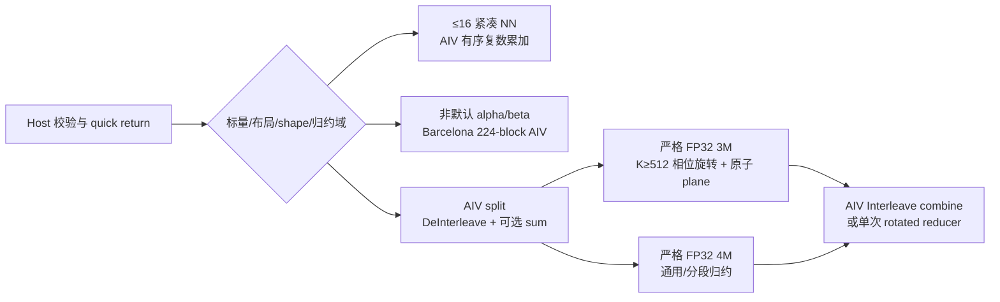
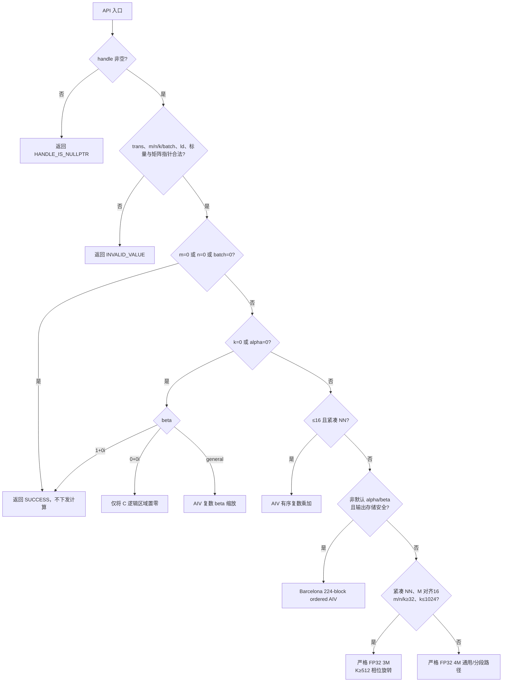

# aclblasCgemmStridedBatched 算子设计文档


## 一、需求背景

### 1.1 需求来源

社区任务《8月社区任务-aclblasCgemmStridedBatched算子开发（950）》要求在 Ascend 950PR 上使用 Ascend C 开发单精度复数跨步批量矩阵乘算子 `aclblasCgemmStridedBatched`，完成公共接口、Host 编排、Device Kernel、功能/精度/性能测试、算子 README、设计文档及自测报告，并在验收后向 [ops-blas](https://gitcode.com/cann/ops-blas) 提交 PR。

### 1.2 背景介绍

#### 1.2.1 算子目标

算子对一批规格一致、地址按固定步长分布的复数矩阵执行

$$
C_i = \alpha\,op(A_i)op(B_i) + \beta C_i,\qquad i=0,1,\ldots,batchCount-1,
$$

其中

$$
A_i=A+i\cdot strideA,\quad
B_i=B+i\cdot strideB,\quad
C_i=C+i\cdot strideC.
$$

矩阵采用列主序，stride 以 `aclblasComplex` 元素个数计。`strideA/strideB=0` 表示输入矩阵在 batch 间广播；`strideC=0 && batchCount>1` 或任意两个输出矩阵重叠时行为未定义。

本次设计目标如下：

1. 新增公共 API `aclblasCgemmStridedBatched`，接口参数顺序与 cuBLAS 对标接口一致，不增加 950PR 私有接口。
2. 支持 COMPLEX64、列主序、`N/T/C` 全组合、padded leading dimension、非紧凑 stride 以及 A/B 零 stride 广播。
3. 正确实现复数 `alpha` / `beta`，特别区分普通转置 `T` 与共轭转置 `C`。
4. 覆盖零维 quick return、`k=0`、`alpha=(0,0)`、`beta=(0,0)/(1,0)/general` 以及完整非法参数检查。
5. 精度满足任务书 COMPLEX64 分量级标准；`alpha=(0,0)` 路径按任务书执行 EXACT 校验。
6. 在 Ascend 950PR 上对任务书 3 个性能点完成预热后 60 次 ACL event 计时。当前实现已通过附件脚本实际采用的 40% 性能门槛；任务书正文时延表与严格 FP32 峰值之间的口径冲突单独保留为验收风险，不混用两套结论。

#### 1.2.2 基线来源说明

| 基线层次 | 直接路径或来源 | 作用 |
| --- | --- | --- |
| 任务语义与验收口径 | `aclblasCgemmStridedBatched_Atlas950PR_task_doc.md` | 公共签名、边界语义、精度阈值、3 个硬性能点和交付要求 |
| 实数 StridedBatched 工程基线 | `blas/gemm_strided_batched/` | 复用 arch35 构建接入、句柄/stream 约定、实数接口 README 与参数校验习惯 |
| 复数 Batched 计算基线 | `blas/gemm_batched/arch35/` | 复用 complex deinterleave、严格 FP32 实数 Cube GEMM、复数 combine 内核与 tiling 数据结构 |
| 公共 API 基线 | `include/cann_ops_blas.h`、`include/cann_ops_blas_common.h` | 句柄、状态码、`aclblasOperation_t` 和 `aclblasComplex` 定义 |
| 测试基线 | `test/gemm_strided_batched/`、任务附件 `test_cases/` | CSV 驱动、GTest 结构、cblas golden、1200 条候选用例与验收规则 |
| 前期性能探索 | 工作区 `ascblas/experiments/cgemm_950_cube_probe/` | 验证 950PR Cube、复数拆分、batch 全局任务队列和精度/性能风险；不作为当前 ops-blas 实现的正式成绩 |
| 前代 950 correctness 实现 | `ascblas/tests/ascblasCgemmStrideBatched/ascblasCgemmStrideBatched_950.cce` | 借鉴逐 K 复数累加与 128 B cache-line 输出归属；不复制 A2/C220 intrinsic 或旧 ABI |

当前仓已有 `aclblasSgemmStridedBatched` 和 `aclblasCgemmBatched`，但没有 `aclblasCgemmStridedBatched`。因此，本设计不重写已经验证过的严格 FP32 实数 Cube 主核，而是在 StridedBatched 入口上补齐 stride 定址、workspace 与分层 dispatch，并复用 CgemmBatched 的复数拆分与合并能力。对共享 `gemm_batched` tiling/kernel 的扩展属于 StridedBatched 的内部复用；最终共享 `aclblasCgemmBatched` 回归 `166/166`、既有 `aclblasSgemmStridedBatched` 回归 `67/67`，未发现兼容性回退。

#### 1.2.3 现状分析

当前分支采用**按数值域和布局分层的严格 FP32 实现**：



该路径有以下阶段性特点：

1. `m/n/k≤16` 的紧凑 NN 场景使用 AIV 按 K 顺序执行复数乘加，并让每个 block 独占完整 128 B 输出 cache line；该路径用于保持 Inf/NaN 与 cblas 的复数语义。
2. 任意非默认标量且 A/B/C stride 非负、C batch 存储安全不重叠时，使用 ordered AIV 复现 OpenBLAS 0.3.18 Barcelona 的四 product stream、224 K block、尾块平衡、alpha/beta 应用顺序和 odd-N/micro-M 尾部累加顺序。
3. 常用紧凑 NN 且 `m/n/k≥32、k≤1024` 时使用严格 FP32 3M；A/B split 后三个实数乘法合并到一个 Cube 任务池。`k≥512` 使用相位旋转公式，首个 K chunk 覆盖写三张 product plane、后续 chunk 原子累加，最终只执行一次 AIV reducer。
4. 转置/共轭、padding、广播、深 K 以及其他默认标量一般场景使用 4M；有限深归约按 224 K block 分段并平衡最后两块。紧凑 3M 使用 base+stride 定址，通用路径在绑定 stream 上由 AIV kernel 初始化设备指针数组。
5. split/combine 使用 C310 原生 `DeInterleave`/`Interleave`；全部 Cube 计算关闭 HF32。`k=0` 或 `alpha=0` 进入独立缩放路径，不读取 A/B。

修正生成器后，1200 个 case 的矩阵分布为 uniform/normal 各 600 个，随机 alpha/beta 各自为 uniform/normal 各 315 个。最终真实混合分布完整回归为 `1200/1200`；正式 O2 平均耗时为 `209.338/826.094/2971.580 us`，三点继续通过附件 40% 阈值。原始日志分别为 `/home/chenyun/cgemm_sb_barcelona_full_1200_20260826.log` 与 `/home/chenyun/cgemm_sb_barcelona_final_benchmark_20260826.log`。

## 二、需求分析

### 2.1 外部组件依赖

运行时不新增第三方依赖，复用 ops-blas 与 CANN 提供的能力：

| 依赖 | 用途 | 约束 |
| --- | --- | --- |
| CANN asc-devkit / Ascend C | 编译 arch35 Host 与 Device 代码 | `ASC_DEVKIT_MAJOR >= 9 && ASC_DEVKIT_MINOR >= 1` |
| ACL Runtime | handle 绑定 stream、workspace 分配、异步 memset、event 计时 | CANN 9.1.0，Ascend 950PR |
| ops-blas 公共件 | handle、workspace、日志、状态码、Host 工具函数 | 不修改既有公共语义 |
| cblas / OpenBLAS（仅测试） | 逐 batch 调用 `cblas_cgemm` 生成 golden | 不进入算子运行时依赖 |
| GTest（仅测试） | CSV 参数化功能与异常用例 | 版本与仓库测试宏兼容性需在复现环境中明确 |

### 2.2 内部适配模块

| 模块 | 文件 | 设计职责 | 当前状态 |
| --- | --- | --- | --- |
| 公共接口 | `include/cann_ops_blas.h` | 新增统一 `aclblasCgemmStridedBatched` 声明 | 已编码并完成目标构建 |
| Complex Host 编排 | `blas/gemm_strided_batched/arch35/cgemm_strided_batched_host.cpp` | 参数校验、quick return、workspace 规划、分层 dispatch | 已编码并完成 950PR 全量验证 |
| Strided 专用 Kernel | `blas/gemm_strided_batched/arch35/gemm_strided_batched_kernel.cpp` | 指针初始化、紧凑小 NN 有序路径 | 已编码并定向验证 |
| 共享声明与 tiling | `gemm_strided_batched_kernel.h`、`gemm_strided_batched_tiling_data.h` | 统一 Host/Device workspace 槽位和 tiling 协议 | 已编码，目标构建与 diff check 通过 |
| 共享 Complex Kernel | `blas/gemm_batched/arch35/gemm_batched_kernel.cpp` | split/sum、3M/4M real GEMM、combine/interleave | 已扩展；最新库共享回归 166/166 |
| 功能/精度测试 | `test/gemm_strided_batched/cgemm_strided_batched/arch35/` | 1200 条 complex CSV、cblas golden、分量误差、异常参数 | 已接入；真实混合分布 1200/1200 |
| 性能测试 | 独立 ACL event benchmark | 5 次预热、60 样本，输出 us 与两种 FLOPS 口径 | 已接入；最终三点通过附件阈值 |
| 算子 README | `blas/gemm_strided_batched/README.md` | 复数接口、产品支持、约束和示例 | 已补充并完成复现信息检查 |

### 2.3 算子接口原型

#### 2.3.1 接口定义

```cpp
aclblasStatus_t aclblasCgemmStridedBatched(
    aclblasHandle_t handle,
    aclblasOperation_t transA,
    aclblasOperation_t transB,
    int m,
    int n,
    int k,
    const aclblasComplex* alpha,
    const aclblasComplex* A,
    int lda,
    int64_t strideA,
    const aclblasComplex* B,
    int ldb,
    int64_t strideB,
    const aclblasComplex* beta,
    aclblasComplex* C,
    int ldc,
    int64_t strideC,
    int batchCount);
```

#### 2.3.2 接口入参说明

| 名称 | 类别/位置 | 类型 | 语义与约束 |
| --- | --- | --- | --- |
| `handle` | 输入，Host | `aclblasHandle_t` | 有效 ops-blas 句柄，携带 stream；空指针返回 `ACLBLAS_STATUS_HANDLE_IS_NULLPTR` |
| `transA` | 属性，Host | `aclblasOperation_t` | `N/T/C`，分别表示原矩阵、转置、共轭转置；非法枚举返回 `INVALID_VALUE` |
| `transB` | 属性，Host | `aclblasOperation_t` | 语义同 `transA` |
| `m/n/k` | 输入，Host | `int` | 均须非负；定义 `op(A)`、`op(B)`、C 的逻辑维度 |
| `alpha` | 输入，Host | `const aclblasComplex*` | 全 batch 共用的复数标量，不可为空 |
| `A` | 输入，Device | `const aclblasComplex*` | batch 0 的列主序首地址；有效计算且 `k>0` 时不可为空 |
| `lda` | 输入，Host | `int` | `transA=N` 时 `>=max(1,m)`，否则 `>=max(1,k)` |
| `strideA` | 输入，Host | `int64_t` | 相邻 A 的复数元素偏移；0 表示广播；不做地址范围校验 |
| `B` | 输入，Device | `const aclblasComplex*` | batch 0 的列主序首地址；有效计算且 `k>0` 时不可为空 |
| `ldb` | 输入，Host | `int` | `transB=N` 时 `>=max(1,k)`，否则 `>=max(1,n)` |
| `strideB` | 输入，Host | `int64_t` | 相邻 B 的复数元素偏移；0 表示广播；不做地址范围校验 |
| `beta` | 输入，Host | `const aclblasComplex*` | 全 batch 共用的复数标量，不可为空；为 0 时不读取 C 旧值 |
| `C` | 输入/输出，Device | `aclblasComplex*` | batch 0 的列主序输出首地址，原地覆写 |
| `ldc` | 输入，Host | `int` | `>=max(1,m)` |
| `strideC` | 输入，Host | `int64_t` | 相邻 C 的复数元素偏移；输出重叠行为未定义 |
| `batchCount` | 输入，Host | `int` | 非负；0 为合法 no-op |
| 返回值 | 输出 | `aclblasStatus_t` | 成功、参数非法、handle 为空、workspace 分配失败或执行失败等 |

`beta=(0,0)` 的含义是“不读取 C 的旧内容”，而不是“不需要输出地址”。当前实现对所有非空输出都要求 C 为可写非空指针。任务书 `2.4 的异常行为栏仅写明 `beta != 0` 时 C 为空报错，与输出语义存在歧义；该点需在最终评审前与任务方确认并统一测试预期。

#### 2.3.3 设计范围与约束

| 类别 | 约束项 | 约束内容 |
| --- | --- | --- |
| dtype | 输入/输出 | 仅 COMPLEX64；`aclblasComplex` 为两个 FP32 分量 |
| 布局 | 矩阵存储 | Column-Major，以 lda/ldb/ldc 表达列间距 |
| 操作 | 转置 | A/B 均支持 `N/T/C`，共 9 种组合 |
| batch | stride | stride 单位为复数元素；A/B 支持 0 广播；C 不支持有定义的广播 |
| shape | 动态参数 | m/n/k/batchCount 均为运行时参数，不要求 dynamic shape 编译机制 |
| 输出 | 原地语义 | C 旧值在 `beta!=0` 时参与计算，输出写回同一地址 |
| 异步 | stream | 所有 Device 阶段下发到 handle 绑定的 stream；调用方在读回前同步 |
| 产品 | arch35 | Ascend 950PR；当前 arch35 构建同时面向 950DT，950DT 结果待测 |
| CANN | 版本 | asc-devkit 9.1 及以上 |
| workspace | 上限 | 受 ops-blas handle 最大 2 GiB workspace 限制；不足时返回分配失败 |

## 三、需求详细设计

### 3.1 使能方式

本算子采用 ops-blas 句柄式 Kernel 直调模式，通过公共头文件 `cann_ops_blas.h` 调用：

1. `aclblasCreate` 创建 handle；
2. `aclblasSetStream` 绑定 ACL stream；
3. 准备 Device 侧交错复数 A/B/C 与 Host 侧 `alpha/beta`；
4. 调用 `aclblasCgemmStridedBatched`；
5. 读回结果前同步 stream。

| 上层调用 | 状态 |
| --- | --- |
| C/C++ 公共句柄接口 | 支持（950PR 已验证） |
| 950PR arch35 Ascend C Kernel 直调 | 支持（950PR 已验证） |
| 950PR 私有平行 API | 不提供 |

### 3.2 需求总体设计

#### 3.2.1 Host 校验与路径分发

Host 入口按固定顺序完成校验与分发：



参数检查使用 `size_t` 安全乘加计算 workspace，并检查 Cube 总任务数是否超过 `UINT32_MAX`。stride 本身不做上下界检查，因为仅凭接口参数无法判断调用方分配的真实显存边界；越界责任由调用方承担。

#### 3.2.2 Stream 内指针数组初始化与 stride/broadcast

复用的 CgemmBatched kernel 接收 Device 侧指针数组，而 StridedBatched API 接收单一基址和 stride。为连接两者，`cgemm_sb_init_pointers_kernel` 在 handle stream 上构造 13 组指针：

| 槽位 | 内容 |
| --- | --- |
| A / B / C | 每个 batch 的原始交错复数地址 |
| Ar / Ai / As / Br / Bi / Bs | 每个 batch 的实部、虚部及 3M 和平面地址 |
| T1 / T2 / T3 / T4 | 四个实数 GEMM 临时结果地址 |

对于 batch `i`：

$$
pA_i=A+i\cdot strideA,\quad pB_i=B+i\cdot strideB,\quad pC_i=C+i\cdot strideC.
$$

当 `strideA=0` 或 `strideB=0` 时，所有对应输入指针以及 planar workspace 指针均指向 batch 0，仅拆分一次输入并在全部 batch GEMM 中复用。C 指针始终按 `strideC` 生成，不主动检测重叠。

采用 Device kernel 而不是 Host 构造后同步 memcpy 的原因是：handle workspace 会被连续异步 API 调用复用，指针初始化必须与后续 split/GEMM/combine 在同一 stream 上严格排序，才能避免前一调用尚未消费完指针数组时被后一调用覆盖。该保证只覆盖同一 handle、同一绑定 stream 的顺序调用；多 stream 并发应使用独立 handle，最终并发契约待仓库规范确认。

#### 3.2.3 复数拆分、转置与共轭

输入以 `[real, imag, real, imag, ...]` 交错存储。AIV split kernel 使用 C310 原生 `DeInterleave` 将偶数分量写入实部平面、奇数分量写入虚部平面；3M 同时生成 `real+imag` 平面：

$$
A= A_r+jA_i,\qquad B=B_r+jB_i.
$$

物理矩阵范围由操作类型决定：

| 矩阵 | N 时物理范围 | T/C 时物理范围 |
| --- | --- | --- |
| A | `m × k`，列距 lda | `k × m`，列距 lda |
| B | `k × n`，列距 ldb | `n × k`，列距 ldb |

通用 deinterleave 保留 lda/ldb，因此 padded leading dimension 不需要额外 pack。紧凑 3M 快路径把 A、B 两个 split 合为一次 launch，并把 B 的首个逻辑 tile 做循环偏移，使两个矩阵共享一个连续 tile 池、减少尾波。`ACLBLAS_OP_C` 与 `T` 的区别在此阶段完成：对 C 操作对应的虚部平面乘以 `-1`，随后实数 Cube GEMM 对 T/C 都按转置处理，即

$$
X^H=X_r^T-jX_i^T.
$$

#### 3.2.4 严格 FP32 3M/4M Cube 主计算

性能域使用严格 FP32 3M。`k<512` 保留普通 Gauss 形式：

$$
\begin{aligned}
T_1 &= op(A_r)op(B_r),\\
T_2 &= op(A_i)op(B_i),\\
T_3 &= op(A_r+A_i)op(B_r+B_i),\\
P_r &= T_1-T_2,\\
P_i &= T_3-T_1-T_2.
\end{aligned}
$$

`k≥512` 改用相位旋转 3M：

$$
\begin{aligned}
T_1 &= op(A_i)op(B_r),\\
T_2 &= op(A_r)op(B_i),\\
T_3 &= op(A_r-A_i)op(B_r+B_i),\\
P_r &= T_3+T_1-T_2,\\
P_i &= T_1+T_2.
\end{aligned}
$$

启用条件为默认标量 `alpha=(1,0)、beta=(0,0)`、紧凑 N/N、M 按 16 对齐、`m/n/k≥32` 且 `k≤1024`。三个 product 不分别 launch，而是编码为 `3×totalTasks` 的统一逻辑任务池；设备端按逻辑 product 选择平面，即使逻辑 block 数大于物理 Cube Core 数也由 runtime 分波执行。任务书 `256^3×32` 保留一次完整 K 归约。相位旋转路径的首个 K chunk 覆盖写 T1/T2/T3，后续 chunk 由 Cube 原子累加到同一组三张 plane，最终只启动一次 AIV reducer。`k=512` 采用平衡 `171/172/169`；`k=1024、batchCount≥8` 采用 `224/224/224/176/176`，batch 更小时使用 171 基准分块。Cube 内层 `tileKChunk=48`，M/N tile 由波数代价模型选择。

其余场景使用 4M：

$$
\begin{aligned}
T_1 &= op(A_r)op(B_r),\\
T_2 &= op(A_i)op(B_i),\\
T_3 &= op(A_r)op(B_i),\\
T_4 &= op(A_i)op(B_r),\\
P_r &= T_1-T_2,\\
P_i &= T_3+T_4.
\end{aligned}
$$

4M 的四次实数 GEMM 复用 `gemm_batched_gemm_kernel_do` 并显式关闭 HF32。默认标量的转置/共轭、padding、广播或深 K 场景使用 224 K block，并在尾部不足两个 block 时按 4 元素 unroll 对最后两块做平衡；每个 chunk 先生成复数部分和，再通过 `beta=1` 累加到 C，控制完整实数 dot 相减造成的消去误差。Host 根据 m/n、K、batch 和可用 Cube Core，以“任务波数 ×（单任务体积 + 实测 launch 等效开销）”选择 mBlocks/nBlocks。

每个 real product 的基础任务空间为

$$
totalTasks=batchCount\times mBlocks\times nBlocks.
$$

设备端以全局任务编号消费任务，避免“一个 batch 一个 kernel”的启动开销，也让小矩阵的多个 batch 共同填满 Cube Core。实数 kernel 内部按 row-major 处理，因此 Host 利用

$$
C^T=op(B)^T op(A)^T
$$

交换 A/B 及 m/n 分块元数据，在不显式转置整矩阵的情况下保持外部列主序语义。

#### 3.2.5 Complex alpha/beta 合并与写回

AIV combine kernel 读取 T1~T4，先得到 `P=P_r+jP_i`，再逐元素计算：

$$
\begin{aligned}
C_r' &= \alpha_rP_r-\alpha_iP_i+\beta_rC_r-\beta_iC_i,\\
C_i' &= \alpha_rP_i+\alpha_iP_r+\beta_rC_i+\beta_iC_r.
\end{aligned}
$$

当 `beta=(0,0)` 时不读取 C 旧值；否则读取原 C 的实部/虚部。结果通过 C310 原生 `Interleave` 恢复交错 complex64 格式，只写逻辑 `m×n` 区域，不改写 ldc padding。`Interleave` 的参与元素数向上补齐到 8 个 FP32，使第二目标地址保持 32 B 对齐，但 GM 写回仍使用真实元素数。AIV 核数按总逻辑元素量估算，约每 16384 个元素申请一个核，并受可用核数上限约束。

相位旋转 3M 的 identity reducer 只读取原子累加完成后的 T1/T2/T3 各一次，并直接写出 `P_r/P_i`；不再为每个 K chunk 启动 combine，也不保留 TwoSum 或额外第四乘法。`256^3×32` 保持普通 Gauss 的单次 identity combine。

紧凑 NN 且 `m/n/k≤16` 时不进入 planar/Cube 路径。AIV 按 K 顺序执行复数乘加，以 16 个 complex（128 B）为输出所有权单元；若任一输出分量为 NaN，则规范化为 complex NaN，以匹配 cblas 对溢出复数的结果分类。

对任意非默认 alpha/beta，只要 stride 非负且 C batch 物理存储互不重叠，ordered AIV 直接访问原始列主序矩阵。它复现 OpenBLAS 0.3.18 Barcelona 的四 product stream、224 宽 Q block、最后两块平衡、每 block 乘 alpha 后累加、beta*C 只计算一次，以及 odd-N 最终列/M micro-tail 的偶奇 accumulator 合并顺序。20 个原随机标量失败点在该路径上与 device reference 的 `maxAbsErr=0`。

#### 3.2.6 Quick return 与仅缩放路径

| 条件 | 处理方式 | A/B 读取 | C 读取 |
| --- | --- | --- | --- |
| `m=0 || n=0 || batchCount=0` | 直接返回成功 | 否 | 否 |
| `k=0 || alpha=(0,0)` 且 `beta=(1,0)` | 直接返回成功 | 否 | 否 |
| 同上且 `beta=(0,0)` | 对每个 batch 的 C 逻辑列执行异步 memset | 否 | 否 |
| 同上且 beta 为 general complex | 复用 combine kernel，以同一零平面作为 T1~T4 | 否 | 是 |

`ldc==m` 时，置零路径每个 batch 只需一次连续 memset；存在 padding 时逐列 memset，避免覆盖 padding。`alpha=0` 的 EXACT 用例覆盖 `beta=0/1/general`、padding 和多 batch，并已纳入 1200 条回归。

#### 3.2.7 Workspace 规划与生命周期

设备 workspace 由 handle 管理或由用户通过 `aclblasSetWorkspace` 注入。指针数组按 64 B 对齐，临时输出行距为 `align16(m)`。定义：

$$
\begin{aligned}
u_A &= (strideA=0?1:batchCount),\\
u_B &= (strideB=0?1:batchCount),\\
c_A &= (transA=N?k:m),\\
c_B &= (transB=N?n:k),\\
L_T &= align16(m),\\
P &= align64(8\cdot batchCount).
\end{aligned}
$$

指针区共有 13 个 slot。4M 和 3M 主路径所需字节数分别为

$$
\begin{aligned}
W_{4M}&=13P+8u_A\,lda\,c_A+8u_B\,ldb\,c_B
       +16\,batchCount\,L_T\,n,\\
W_{3M}&=13P+12u_A\,lda\,c_A+12u_B\,ldb\,c_B
       +12\,batchCount\,L_T\,n.
\end{aligned}
$$

3M 为 A/B 各保留实部、虚部、和三个 FP32 平面，并保留三个结果平面；4M 为 A/B 各两个平面和四个结果平面。广播会把对应 A/B 平面从 `batchCount` 份降到 1 份；≤16 有序路径不申请该 planar workspace。

按紧凑 N/N、非广播计算，任务书 3 个性能点的规划值和运行时观测如下。`requested inputs + workspace` 是 A/B/C 请求字节数与 3M workspace 精确公式之和；运行时峰值是 benchmark 在 stream 建立后、handle 创建前取基线，再对 handle、输入、warmup 和有效采样后的 `aclrtGetMemInfo(ACL_HBM_MEM)` 快照取最大差值：

| case | shape × batch | 3M workspace 规划值 | requested inputs + workspace | 运行时峰值 HBM delta |
| --- | ---: | ---: | ---: | ---: |
| 1 | `256³ × 32` | 72.003 MiB | 120.003 MiB | 154.000 MiB |
| 2 | `512³ × 16` | 144.002 MiB | 240.002 MiB | 274.000 MiB |
| 3 | `1024³ × 8` | 288.001 MiB | 480.001 MiB | 514.000 MiB |

三个观测峰值比输入加规划 workspace 高约 34 MiB。handle 创建时会先申请 32 MiB 默认 workspace；性能点首次 warmup 扩容到 72/144/288 MiB 时，ACL allocator 的释放缓存和分配粒度仍计入设备空闲显存差值，因此该额外驻留与实现的九个 FP32 plane 规划不矛盾。原始日志：`/home/chenyun/cgemm_sb_barcelona_final_benchmark_20260826.log`。

若 library workspace 不足，`EnsureDefaultWorkspace` 会同步当前 handle stream 后按增长策略重分配；用户注入的 workspace 不会被库扩容，空间不足返回 `ACLBLAS_STATUS_ALLOC_FAILED`。因此正式性能测试必须先 warmup，使 workspace 扩容不进入有效采样区间，并在自测报告中记录实际峰值显存。

#### 3.2.8 性能设计、备选方案与决策门禁

性能点均走严格 FP32 3M。最近一次 O2 记录使用 5 次预热、60 个 ACL event 样本；标准复数吞吐按 `8MNK`，实际 3M 实数工作量按 `6MNK` 计算：

| case | 平均耗时 | 中位耗时 | 标准 complex TFLOPS | 实际 3M real TFLOPS | 相对 23.6544 real 峰值 |
| --- | ---: | ---: | ---: | ---: | ---: |
| `256³ × 32` | 209.338 us | 209.149 us | 20.5169 | 15.3877 | 65.05% |
| `512³ × 16` | 826.094 us | 826.023 us | 20.7965 | 15.5974 | 65.94% |
| `1024³ × 8` | 2971.580 us | 2971.375 us | 23.1256 | 17.3442 | 73.32% |

附件 `verify_performance.py` 实际采用 GPU baseline `/0.4`，对应 227.1725/841.865/3269.7375 us；当前三点均通过，余量约 7.85%/1.87%/9.12%。任务书正文表格另列 36.35/134.70/523.16 us，分别隐含约 118.2/127.5/131.3 标准 complex TFLOPS；当前仍慢约 5.76×/6.13×/5.68×。该正文口径与本机严格 FP32 3M 可实现峰值不相容，因此两套门槛始终分栏报告。原始日志为 `/home/chenyun/cgemm_sb_barcelona_final_benchmark_20260826.log`。

`k=512、batchCount>=16` 的 `256/256` 两块候选曾把 512 benchmark 降到 `787.194 us`，但同一硬性能正确性 case `TC_PF_1002` 的 real `maxAbsErr=0.012695`，未过精度门禁，因此最终仍使用 q171；恢复后 PF1002 通过且平均时延复测为 `826.225 us`。

前期独立探针提供了两条约束证据：严格 FP32 实数 Cube 的本机工程峰值约 23.65 TFLOPS；直接启用 HF32 的 `256³×32` 抽检匹配率约 91.8%、最大绝对误差约 `2.13e-3`，未满足 99% 匹配率。因此 HF32 不能在没有精度补偿和全量验收前作为默认路径。该数据来自独立探索代码，只用于架构决策，不等同于本算子正式成绩。

| 方案 | 优点 | 风险/代价 | 当前决策 |
| --- | --- | --- | --- |
| AIV 逐元素复数点积 | 语义直接，可保持小 shape 特殊值顺序 | 大 shape 吞吐不可接受 | 仅用于 ≤16 紧凑 NN |
| 严格 FP32 4M + 全 batch 队列 | 误差路径清晰，N/T/C、padding、broadcast 易闭环 | 四次 Cube，带宽和 workspace 较大 | 通用与高精度兜底 |
| 严格 FP32 3M（普通/相位旋转） | Cube 乘法由 4 次降为 3 次；性能点收益明确 | 和/差平面增加 workspace；分块顺序影响精度 | 用于已验证的紧凑默认标量 NN；`k≥512` 使用相位旋转与单次延迟归约 |
| HF32 / 混合精度 | Cube 吞吐更高 | 已有探针不满足精度；需要补偿算法且可能增加乘法/带宽 | 默认禁用，待研究 |
| AIC/AIV 融合分块流水 | 理论上可隐藏 split/combine | 巨型 mixed launch 出现 T1/T2 数据竞争；ready flag 自旋因未来 wave 未调度而死锁；分段尾块的 AIV 标量 GM 路径不成立 | 原型均已移除，不进入当前 PR |

最终性能架构已通过以下门禁；后续替换仍须保持：

1. 1200 条精度/边界用例全部满足任务书判定，`alpha=0` EXACT 单独通过；
2. 3 个性能点预热后有效采样大于 50 次，同时报告附件 40% 门槛和正文硬表；
3. N/T/C、stride gap、广播和 padded LD 不因快路径产生语义分叉；
4. workspace 峰值、首次扩容和稳态复用行为有可复现记录；
5. 不使用 shape 特判绕过精度测试，不将辅助脚本的倍率公式代替任务书硬时延表。

### 3.3 支持硬件

| 支持的芯片版本 | 涉及勾选 | 验证状态 |
| --- | --- | --- |
| Ascend 950PR | √ | 开发与验证目标 |
| Ascend 950DT | arch35 构建路径可覆盖 | 待测，不作为本任务验收设备 |
| Atlas A2/A3 | × | 本实现不进入对应产品线 |

### 3.4 算子约束限制

1. 仅支持 `aclblasComplex`（COMPLEX64），实部和虚部均为 FP32。
2. A/B/C 均为列主序；仅支持由 lda/ldb/ldc 与 stride 表达的布局，不支持额外非连续 view。
3. `transA/transB` 仅允许 `N/T/C`；C 为共轭转置，不能按普通 T 处理。
4. m/n/k/batchCount 必须非负，leading dimension 必须满足 BLAS 最小值。
5. stride 以复数元素计，不做显存范围检查；调用方必须保证地址有效。
6. `strideA/strideB=0` 为广播；`strideC=0 && batchCount>1` 及任意输出重叠均为未定义行为。
7. `beta=0` 时不读取 C 旧值，但非空逻辑输出仍需要可写 C 地址；该解释待任务方确认。
8. handle 内 workspace 上限为 2 GiB；超出或用户 workspace 不足时返回分配失败。
9. 当前实现以同一 handle、同一绑定 stream 的顺序调用为并发安全边界；跨 stream 并发建议使用独立 handle。
10. 算子异步返回；Host 读回或释放相关 Device 数据前必须同步对应 stream。

## 四、特性交叉分析

| 交叉维度 | 设计关注点 | 应对策略与验证要求 |
| --- | --- | --- |
| `transA × transB` | 9 组组合，T/C 在复数下不等价 | deinterleave 对 C 的虚部取负；cblas golden 正交覆盖 9 组 |
| shape × tile | 小矩阵固定开销，大矩阵分块利用率，尾块非对齐 | batch×分块全局任务队列；覆盖 1、质数、2 的幂±1、非对齐和 2048 上界候选 |
| LD padding × trans | 物理行数随 N/T/C 改变，错误 LD 会错列 | 按物理 shape 拆分并保留 ld；测试最小 LD 与多个 padding |
| stride gap × batch | batch 起址非紧凑，可能越过 padding/gap | stream 内按元素 stride 生成指针；首尾 batch 均做 golden 校验 |
| A/B 广播 × batch | 重复拆分浪费带宽和 workspace | `uniqueBatch=1`，所有 real GEMM 指针复用同一 planar 矩阵 |
| C stride × 输出重叠 | 重叠会产生并发写竞争 | 文档明确未定义，不生成重叠正向用例 |
| alpha/beta × quick return | 0/1/general 对输入读取和精确性不同 | 独立 no-op、memset、scale、主路径；验证未初始化 C 的 beta=0 场景 |
| `k=0` × A/B nullptr | 不应读取矩阵 | 仅缩放路径；A/B 空指针合法性按任务书条件验证 |
| Inf/NaN × complex combine | Cube 归约顺序与 cblas 的特殊值分类可能不同 | ≤16 紧凑 NN 使用有序复数路径并规范化 complex NaN；FL097/098/099 已通过 |
| workspace × 大 batch | 3M/4M planar 临时区随 batch 线性增长 | 溢出安全计算、2 GiB 上限、广播减量；分别使用 3M/4M 公式报告 |
| 连续异步调用 × workspace 复用 | 后一调用可能覆盖前一调用指针数组 | 指针初始化和消费者全部在同一 stream 排序 |
| 首次调用 × 性能采样 | workspace 扩容会同步并污染耗时 | warmup 后再采样 >50 次；同时报告首次与稳态（正式验收用稳态） |
| 精度模式 × 性能 | HF32 提速但当前探针未达精度 | 默认 strict FP32；任何混合精度快路径必须先过完整精度门禁 |

## 五、可维可测分析

### 5.1 验收标准与验证方式

| 验收项 | 标准 | 验证方式 | 当前状态 |
| --- | --- | --- | --- |
| 公共接口 | 签名加入 `include/cann_ops_blas.h`，无 950 私有 API | 编译、符号导出、头文件调用样例 | ABI 参数顺序与任务书一致；O2 `nm/readelf` 确认导出公共 C 符号 |
| 功能 | 列主序、N/T/C、LD/stride/broadcast、alpha/beta 语义正确 | CSV GTest + 逐 batch `cblas_cgemm` golden | 真实混合分布 1200/1200 |
| 边界与异常 | quick return、仅缩放、空指针、非法枚举/维度/LD 返回正确状态 | 独立负向/边界用例，检查返回码及 C 是否保持/缩放 | 已纳入最终 1200 条并通过 |
| 精度 | rtol=`2^-10`、atol=`2^-16`、matched ratio≥0.99、max abs≤`1e-2` 或 32 ULP | 实部/虚部分别全矩阵比对 | 真实混合分布 1200/1200；原 21 个失败点全部关闭 |
| alpha=0 | `C=beta*C` 按任务书 EXACT | beta=0/1/general，覆盖 padding 与多 batch | 215 条 FIXED 语义随最终全量通过 |
| 性能 case 1 | `256³×32 NN` | ACL event，5 warmup + 60 samples | 209.338 us，通过附件阈值 |
| 性能 case 2 | `512³×16 NN` | 同上 | 826.094 us，通过附件阈值 |
| 性能 case 3 | `1024³×8 NN` | 同上 | 2971.580 us，通过附件阈值 |
| 内存 | 交付报告包含 workspace/峰值显存 | 公式核对 + 运行时采集，至少覆盖 3 个性能点 | 规划值 72.003/144.002/288.001 MiB；运行时峰值 delta 154/274/514 MiB |
| 工程质量 | 格式、静态检查、构建、测试 README、无无关改动 | PR diff review、仓库构建与复现检查 | 单算子 O2 测试/benchmark、符号、`git diff --check`、`#pragma once` 及 clang-format 16 改动范围检查通过；legacy whole-file 策略待维护者确认 |

性能统一按标准复数 GEMM 口径计算：

$$
TFLOPS=\frac{8mnk\cdot batchCount}{time_{us}\cdot 10^6}.
$$

标准 complex TFLOPS 只用于 BLAS 工作量报告。3M 的硬件实际工作量为 `6mnk×batchCount`，因此相对 23.6544 TFLOPS 严格实数峰值的效率必须用 3M real TFLOPS 计算，不能用标准 complex TFLOPS 直接相除。附件倍率门槛与正文硬表不一致，两者均使用 ACL event 微秒结果单独比较并保留原始日志。

### 5.2 验证矩阵

任务附件合计提供 1200 条功能、精度、性能和内存候选。修正后矩阵用例确定性分成 uniform/normal 各 600 个；标量分布的 570 个语义敏感 case 保持 `FIXED`，其余 630 个分成两组各 315，使 alpha/beta 各自都有 315 个 uniform 和 315 个 normal case。Host 审计为 `cases=1200 fixed=570 fixed_alpha_zero=215 alpha_uniform=315 alpha_normal=315 beta_uniform=315 beta_normal=315 invalid=0`。最终设备回归 `/home/chenyun/cgemm_sb_barcelona_full_1200_20260826.log` 为 `1200/1200`、0 失败、GTest wall time `1050577 ms`。

| 验证项 | 典型场景 | 规模/组合 | 验证产出 |
| --- | --- | --- | --- |
| L0 基础 | 4×4×4，batch=2 | 9 组 N/T/C | 全矩阵 real/imag golden |
| 尺寸扫描 | 1、质数、2 的幂±1、非对齐、2048 | 方阵及 batch=4 | 精度与越界检查 |
| 非方阵 | 宽/窄 M/N/K | 至少 16 组、多个转置 | 全矩阵 golden |
| batch 扫描 | 1、3/5/7、2 的幂、1024 | 小矩阵到中矩阵 | 首尾及全 batch 校验 |
| 标量 | 0、1、-1、纯虚数、general、大值 | alpha/beta 交叉 | 主路径与 quick return |
| leading dimension | 最小合法值、+padding | N/T/C | padding 哨兵不被错误改写 |
| stride | 紧凑、gap +1/+16、更大显式 gap | 多 batch | 每 batch 起址与 gap 哨兵 |
| broadcast | A=0、B=0、A/B 双 0 | 多 batch | 每 batch golden 与 workspace 减量 |
| 数据分布 | 矩阵 uniform/normal 各 50%；随机标量两种分布各 50% | 实虚独立、alpha/beta 独立确定性随机流 | 矩阵 600/600；随机 alpha/beta 各 315/315；设备全量通过 |
| 特殊值 | 全零、交替、极值、Inf、NaN | 独立用例 | 传播规则与 golden |
| quick return | m/n/batch=0、k=0、alpha=0 | beta=0/1/general | 返回码、是否读取/改写输入 |
| 非法参数 | null handle/scalar/matrix、非法 enum、负维度/批、非法 LD | 每类独立 | 精确状态码 |
| 硬性能 | 任务书 3 个 N/N case | alpha=1、beta=0 | avg us、TFLOPS、原始 event 日志 |
| 泛化性能 | 小尺寸大 batch、矩形、转置、广播 | 任务附件 PF 扩展集 | 瓶颈分类，不替代 3 个硬门槛 |
| 内存 | 最大 workspace、广播前后、用户 workspace 不足 | 硬性能点与边界 shape | 峰值、公式、失败码 |

测试数据使用固定随机种子并记录生成命令。cblas golden 按 batch 逐次调用 `cblas_cgemm`，strideA/B=0 时复用相同输入起址；只比较 C 的逻辑 `m×n` 区域，同时用哨兵检查 padding/gap 未被越界写入。

### 5.3 兼容性与可维护性分析

1. **公共 ABI**：仅新增函数声明和实现，不修改已有 `aclblasSgemmStridedBatched`、`aclblasCgemmBatched` 的签名与行为。
2. **产品隔离**：实现放在 `blas/gemm_strided_batched/arch35/`，沿用 asc-devkit 9.1 编译门禁，不污染 arch22 等产品线。
3. **共享能力**：split/sum、real GEMM、combine 复用 `gemm_batched/arch35`；共享 Host/Device workspace 槽位用单一 enum 定义，避免偏移协议漂移。最新公共 kernel 已通过共享 `cgemm_batched` 166/166 与既有实数 StridedBatched 67/67 回归。
4. **异步语义**：指针初始化改为 stream-ordered Device kernel，避免 Host 指针数组 memcpy 引入隐式同步和 workspace 复用竞态。
5. **错误可诊断**：Host 参数、workspace 溢出、核心数和 ACL 调用失败均通过 ops-blas 日志与明确状态码暴露；性能阶段可用 ACL event 和 msprof 分离 pointer-init、split、Cube 与 combine。
6. **已知耦合**：StridedBatched Host 直接调用 GemmBatched arch35 内核 launcher。链接边界、头文件归属和新增 tiling 字段的零初始化路径已完成 diff review；单算子 O2 裁剪构建及共享 `aclblasCgemmBatched` 166/166 回归均通过，未发现遗漏符号或已有接口回退。
7. **测试环境**：远端 openEuler 的 OpenBLAS/GTest 安装路径与仓库默认查找规则不同，复现 README 已给出显式依赖路径。公共 CMake 改动仅扩大 arch35 host 文件正则以接入 `cgemm_strided_batched_` 前缀，并把 cgemm 测试名加入低 devkit 跳过清单，属于本算子构建所需范围。
8. **架构决策记录**：3M 只在已验证的紧凑默认标量域启用；非默认标量采用 Barcelona ordered AIV，4M 与小尺寸有序路径是显式兜底。失败的 TwoSum、第四乘法和 mixed 同步原型不保留死代码，原因和验证证据记录在本文及 `progress.md`。

### 5.4 PR 交付件状态

1. ops-blas 主体代码已完成：公共 API、arch35 Host/Kernel/tiling、相位旋转 3M 和 Barcelona ordered AIV 均在开发分支工作树中，并已完成 950PR 验证。
2. 自测代码已完成接入：`test/gemm_strided_batched/cgemm_strided_batched/arch35/` 下包含 GTest、1200 条 CSV、cblas golden、ACL event benchmark 与 HBM 采集；真实混合分布最终回归 1200/1200。
3. 算子 README 已完成：包含产品支持表、接口原型、参数/约束、示例、构建与复现步骤；测试 README 记录精度和内存口径。
4. 最终 real/imag 精度、3 个性能点 ACL event、双性能门槛、峰值显存、共享 166 例、既有实数 67 例和 1200 条全量证据均已保留在 `progress.md` 所列日志中。
5. 本设计文档已按最终实现与设备证据回填；cann-competitions 设计文档 PR 尚未创建。
6. 代码位于个人 fork 的 `feat/aclblas-cgemm-strided-batched-950` 分支工作树；commit 和 PR 尚未创建，legacy whole-file 格式策略、冲突性能口径和 950DT 实测仍待外部确认。
