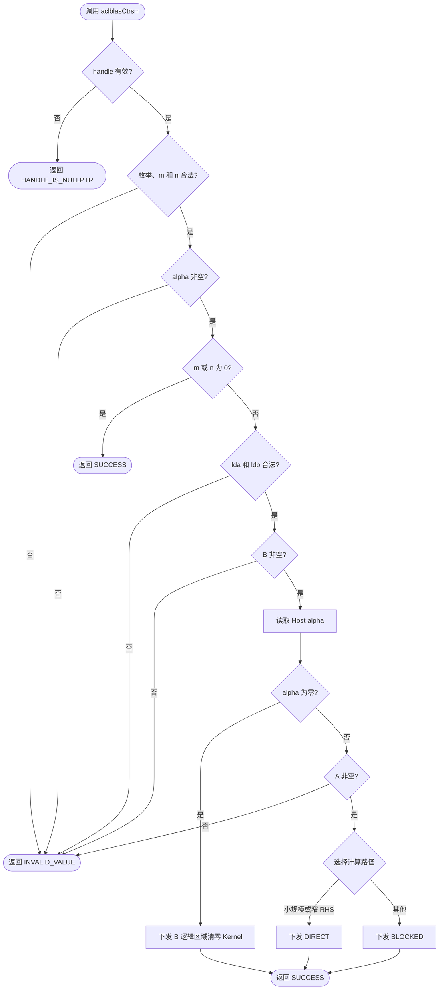
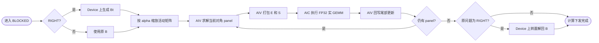
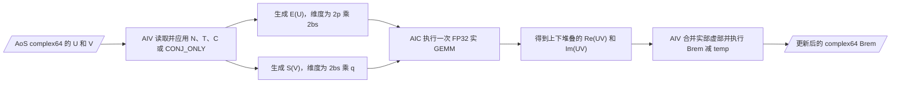

# aclblasCtrsm 算子设计文档

> 本文档仅覆盖设计阶段。文中所有性能路径、阈值和资源预算均为实现方案或待实测校准项，不包含编译、精度、性能或设备实验结论。

# 需求背景（required）

## 需求来源

本需求来自 2026 年 8 月 CANN 社区任务 `aclblasCtrsm` 算子开发。任务要求在 `cann/ops-blas` 仓库中，面向昇腾 950PR，以 Ascend C Kernel 直调方式实现单精度复数三角矩阵方程求解，并通过 `aclblasHandle_t` 当前 stream 异步执行。

设计依据与冻结基线如下：

| 项目 | 基线 |
| --- | --- |
| 任务输入 | `aclblasCtrsm_Atlas950PR_task_doc.md` 及配套 `test_cases/` |
| 社区文档模板 | `cann-competitions/04_tasks/01_community-task-2026/resources/design_template.md` |
| 目标实现仓 | `cann/ops-blas` |
| 源码基线 | `7eae2328a65753bf55cffc489253eb434ea3317e` |
| 同族实现事实源 | `blas/trsm/arch35/` 下现有 `aclblasStrsm` Host、SIMT 与分块 Cube 实现 |
| 设计检查表 | CANNBot `a08c49706e35a400d7c77e0875bc7c72a3a79012` 的 `npu-arch`、`ascendc-tiling-design`、`ascendc-blaze-best-practice` 与 direct-invoke 设计约束 |
| 目标硬件 / 架构 | Ascend 950PR / DAV_3510（`arch35`） |
| CANN 版本 | 9.1.0 |
| 数据类型 / 布局 | `aclblasComplex`（complex64）/ Column Major |

设计以任务书为接口与验收真值，以当前 `ops-blas` 源码为工程事实源；CANNBot 仅用于补充架构、Tiling、Buffer 和验证边界检查，不替代任务书。

## 背景介绍

TRSM（Triangular Solve Matrix）是 BLAS Level 3 基础算子，用于求解系数矩阵位于左侧或右侧的多右端三角线性系统。其三角维度存在严格的前代或回代依赖，而不同右端之间相互独立。CTRSM 在此基础上增加 complex64 乘、减、除及共轭转置语义。

`ops-blas` 已有 `aclblasStrsm` 的 arch35 实现：小规模使用 AIV SIMT 直接求解，大规模使用“对角块求解 + AIC Cube 尾部 GEMM 更新”的分块方案，并包含 RIGHT 路径转置归一化、handle workspace 和 stream 下发设施。`aclblasCtrsm` 采用同一分层思路，但必须独立解决以下复数差异：

1. `ACLBLAS_OP_C` 是共轭转置，不能与普通转置合并；
2. complex64 AoS 数据不能直接当作 FP32 实矩阵送入 Cube；
3. 对角除法需避免直接计算 `dr²+di²` 带来的额外溢出/下溢风险；
4. RIGHT + OP_C 转换为 LEFT 问题时会产生内部“只共轭、不转置”模式；
5. `diag=UNIT` 时物理对角即使为 NaN 也不得读取。

# 需求分析（required）

## 需求描述

在 `include/cann_ops_blas.h` 中新增公共接口 `aclblasCtrsm`，在 `blas/trsm/arch35/` 实现其 Host 调度与 Device Kernel。接口语义、参数顺序、列主序解释、原地输出和异常行为与任务书指定的 cuBLAS/Netlib CTRSM 口径一致；不创建 950PR 私有平行接口。

## 算子原型

```cpp
aclblasStatus_t aclblasCtrsm(
    aclblasHandle_t handle,
    aclblasSideMode_t side,
    aclblasFillMode_t uplo,
    aclblasOperation_t trans,
    aclblasDiagType_t diag,
    int m,
    int n,
    const aclblasComplex* alpha,
    const aclblasComplex* A,
    int lda,
    aclblasComplex* B,
    int ldb);
```

该原型与 `cublasCtrsm` 逐参数对应，整数维参数沿用仓内 `aclblasStrsm` 的 `int` 类型。`alpha` 位于 Host，`A/B` 位于 Device，`B` 同时是输入右端矩阵与输出解。

## 参数与语义

| 参数 | 位置 / 方向 | 类型与合法值 | Shape / 约束 | 异常行为 |
| --- | --- | --- | --- | --- |
| `handle` | Host / 输入 | 有效 `aclblasHandle_t` | 携带当前 stream 与 workspace | 空指针返回 `ACLBLAS_STATUS_HANDLE_IS_NULLPTR` |
| `side` | Host / 属性 | `LEFT(141)`、`RIGHT(142)` | 决定 A 位于 X 左侧或右侧 | 其他值返回 `ACLBLAS_STATUS_INVALID_VALUE` |
| `uplo` | Host / 属性 | `UPPER(121)`、`LOWER(122)` | 只引用指定三角 | 其他值返回 `ACLBLAS_STATUS_INVALID_VALUE` |
| `trans` | Host / 属性 | `OP_N(111)`、`OP_T(112)`、`OP_C(113)` | 分别表示 A、Aᵀ、Aᴴ | 其他值返回 `ACLBLAS_STATUS_INVALID_VALUE` |
| `diag` | Host / 属性 | `NON_UNIT(131)`、`UNIT(132)` | UNIT 时对角恒为 1 且不得读取 | 其他值返回 `ACLBLAS_STATUS_INVALID_VALUE` |
| `m` | Host / 输入 | `int`，`m >= 0` | B 的行数；LEFT 时为 A 的阶数 | 负值返回 `ACLBLAS_STATUS_INVALID_VALUE` |
| `n` | Host / 输入 | `int`，`n >= 0` | B 的列数；RIGHT 时为 A 的阶数 | 负值返回 `ACLBLAS_STATUS_INVALID_VALUE` |
| `alpha` | Host / 输入 | `const aclblasComplex*` | 单个 complex64 | 空指针返回 `ACLBLAS_STATUS_INVALID_VALUE` |
| `A` | Device / 只读 | `const aclblasComplex*` | LEFT：逻辑 `m×m`；RIGHT：逻辑 `n×n` | 非空计算且 alpha 非零时为空返回 `ACLBLAS_STATUS_INVALID_VALUE` |
| `lda` | Host / 输入 | `int` | 非空计算时 `lda >= max(1, side==LEFT ? m : n)` | 不满足时返回 `ACLBLAS_STATUS_INVALID_VALUE` |
| `B` | Device / 输入输出 | `aclblasComplex*` | 逻辑 `m×n`，原地覆写为 X | `m>0 && n>0` 时为空返回 `ACLBLAS_STATUS_INVALID_VALUE` |
| `ldb` | Host / 输入 | `int` | 非空计算时 `ldb >= max(1,m)` | 不满足时返回 `ACLBLAS_STATUS_INVALID_VALUE` |

列主序地址为：

```text
A(row, col) = A[col * lda + row]
B(row, col) = B[col * ldb + row]
```

只更新 B 的逻辑区域 `[0,m)×[0,n)`；`ldb-m` 对应的 padding 行不改写。A 的非活动三角不读取。

## 数学语义

```text
side = LEFT : op(A) · X = alpha · B
side = RIGHT: X · op(A) = alpha · B

op(A) = A      , trans = OP_N
op(A) = Aᵀ     , trans = OP_T
op(A) = Aᴴ     , trans = OP_C
```

`side=LEFT` 时 A 的阶数为 m，`side=RIGHT` 时 A 的阶数为 n。接口返回后 X 原地保存在 B 中。

## 需求拆解与范围

| 模块 | 设计范围 |
| --- | --- |
| 公共 API | 增加 `aclblasCtrsm` 声明，复用既有 handle、枚举、状态码和 `aclblasComplex` |
| Host | 校验、特殊路径、算法选择、Tiling、workspace、同 stream 顺序下发 |
| Device | alpha 清零、SIMT 直接求解、对角 panel 求解、复数打包、FP32 Cube 更新、结果回写 |
| 构建与说明 | 接入 `blas/trsm/arch35/` 现有收集规则，后续更新 `blas/trsm/README.md` |
| 后续测试 | 复用任务提供的 CSV 与 cblas golden；本文只定义验证计划，不执行实验 |

不在本任务范围内：batched、broadcast、任意二维 stride、反向传播、奇异性/近奇异性检测、跨卡及其他数据类型。

## 代码架构选型

CTRSM 既不是纯逐元素算子，也不是一次独立 GEMM。方案选择由两段组成：

| 子问题 | 选型 | 原因 |
| --- | --- | --- |
| 小规模 / 窄 RHS 及对角 panel | AIV SIMT，FP32 complex | 三角依赖强；线程合作归约，RHS 间并行；无需布局 workspace |
| 大规模尾部更新 | AIC Cube，FP32 实 GEMM | 更新已转化为矩阵乘；用实数嵌入表达复数乘，复用现有 Strsm tensor_api 数据流 |
| 打包、转置、缩放、减法 | AIV SIMT / RegBase 辅助 Kernel | 规则搬运与复数 AoS/实数矩阵布局转换 |

整体是同一 stream 上的多 Kernel 分块流水，不采用单个 `__mix__` Kernel。这样以 Kernel 边界表达 panel 依赖，AIV 与 AIC 各自独占输出阶段，避免跨核 flag 协议和多 writer 风险。

# 详细设计（required）

## 算子分析

### 复数基础运算

对 `x=xr+i·xi`、`y=yr+i·yi`：

```text
x · y = (xr·yr - xi·yi) + i·(xr·yi + xi·yr)
conj(x) = xr - i·xi
```

对角除法使用比例缩放形式，避免无条件形成 `yr²+yi²`：

```text
if |yr| >= |yi|:
    r = yi / yr
    d = yr + yi * r
    x / y = ((xr + xi*r) / d) + i*((xi - xr*r) / d)
else:
    r = yr / yi
    d = yi + yr * r
    x / y = ((xr*r + xi) / d) + i*((xi*r - xr) / d)
```

`diag=NON_UNIT` 时调用方保证对角非零；算子不额外检测 `d==0`。`diag=UNIT` 时直接采用 `(1,0)`，整个求解过程不得读取物理对角。

### 有效三角与求解方向

令 `effectiveUpper = (trans==OP_N) ? (uplo==UPPER) : (uplo==LOWER)`。LEFT 对 effective lower 做前代、对 effective upper 做回代；RIGHT 的方向相反。

| side | uplo | trans | op(A) 的有效三角 | 主索引方向 |
| --- | --- | --- | --- | --- |
| LEFT | UPPER | N | 上三角 | `k=m-1 → 0` |
| LEFT | LOWER | N | 下三角 | `k=0 → m-1` |
| LEFT | UPPER | T/C | 下三角 | `k=0 → m-1` |
| LEFT | LOWER | T/C | 上三角 | `k=m-1 → 0` |
| RIGHT | UPPER | N | 上三角 | `k=0 → n-1` |
| RIGHT | LOWER | N | 下三角 | `k=n-1 → 0` |
| RIGHT | UPPER | T/C | 下三角 | `k=n-1 → 0` |
| RIGHT | LOWER | T/C | 上三角 | `k=0 → n-1` |

`OP_T` 和 `OP_C` 的方向相同，但元素读取不同：`OP_C` 在转置寻址后还需将虚部取反。

### RIGHT 归一化

大规模 RIGHT 路径在 Device 上生成 `Bt=Bᵀ`，将右侧问题转换为 LEFT：

```text
X · op(A) = alpha · B
op(A)ᵀ · Xᵀ = alpha · Bᵀ
```

| 原 trans | 转换后对 A 的内部操作 | 说明 |
| --- | --- | --- |
| `OP_N` | `OP_T` | Aᵀ |
| `OP_T` | `OP_N` | A |
| `OP_C` | `CONJ_ONLY` | `conj(A)`，只共轭不转置 |

`CONJ_ONLY` 仅是 Tiling / Kernel 内部模式，不进入公共枚举。求解完成后执行普通转置 `B=(Xᵀ)ᵀ`，不对 B 做共轭。转换前后 `alpha` 不变。

### 分块 TRSM

先执行一次 `B = alpha·B`，随后按 effective triangle 的依赖方向遍历大小为 `bs` 的对角 panel。每一步包括：

```text
1. Dp · Xp = Bp                    // AIV complex panel solve
2. Brem = Brem - U · Xp            // LEFT trailing update
```

其中 `Dp` 为 op(A) 的当前对角块，`U` 为当前已解 panel 与未解区域之间的非对角块。RIGHT 已转换为 LEFT，因此共用同一分块主流程。

### 复数尾部更新的 FP32 实数嵌入

对复矩阵 `U=Ur+iUi`（`p×bs`）和 `V=Vr+iVi`（`bs×q`），构造：

```text
E(U) = [ Ur  -Ui ]    shape = (2p) × (2bs)
       [ Ui   Ur ]

S(V) = [ Vr ]         shape = (2bs) × q
       [ Vi ]

E(U) · S(V) = [ Re(UV) ]
                [ Im(UV) ]         shape = (2p) × q
```

因此一次 FP32 实 GEMM 即可得到一块复数更新结果。AIV 负责从 AoS complex64 读取、应用 N/T/C/CONJ_ONLY 和符号、生成 `E(U)` / `S(V)`；AIC 只消费 FP32 实矩阵；AIV 再将输出上下两半分别作为实部、虚部执行 `Brem -= temp`。全路径不降为 FP16，不使用三乘法复数技巧，避免为减少 MMAD 次数改变误差路径。

当前 `blas/gemm/arch35/gemm_host.cpp` 已给出“四次实 GEMM + AIV 合并”的 complex64 算术事实源，但其实现包含 Host 侧 D2H/H2D 拆分，不适合作为异步 CTRSM 的 panel 更新。本文选择实数块嵌入，原因与边界如下：

| 方案 | AIC 次数 / 临时结果 | 取舍 |
| --- | --- | --- |
| 四次实 GEMM | 4 次 / 4 个 `p×q` | 复数公式直观，但每个 panel/chunk 的 launch 与临时输出更多 |
| 实数块嵌入（选定） | 1 次 / 1 个 `2p×q` | 复制 U 的实数布局，但减少 AIC launch 与结果块数量，且仍只使用现有 FP32 MMAD |

打包和合并全部在 Device 上完成，禁止沿用现有 Cgemm 的 Host D2H/H2D 拆分。若实现阶段发现块嵌入的固定归约次序不能满足任务精度阈值，应先更新本文档并重新评审，再切换算术路径；不得在实现中保留未评审的隐式分支。

## 总体流程



图 1：Host 校验、零维 / alpha-zero 语义和算法分派。所有 Device 操作提交到 handle 当前 stream；合法零维不读取 A/B，不申请 workspace，不下发 Kernel。

### Host 侧校验顺序

为同时满足错误码、no-op 和不引用语义，校验顺序固定如下：

1. `handle`；
2. `side/uplo/trans/diag` 枚举和 `m/n >= 0`；
3. `alpha != nullptr`；
4. `m==0 || n==0` 时返回 SUCCESS，不检查 lda/ldb，不读取 A/B，不申请 workspace，不下发 Kernel；
5. 非空计算检查 `lda >= max(1,order)` 与 `ldb >= max(1,m)`，其中 `order=(side==LEFT?m:n)`；
6. 检查 `B != nullptr`，再读取 Host `alpha`；
7. `alpha==(0,0)` 时仅下发逻辑区域清零 Kernel，不检查、不读取 A；
8. 其余情况检查 `A != nullptr`，计算 Tiling / workspace 并下发求解流程。

所有元素数、字节数和 GM 偏移先扩宽为 `uint64_t/size_t` 再乘加；任何溢出、workspace 扩容失败或平台资源查询失败均返回仓库已有的可诊断状态码，且不继续下发后续 Kernel。

### 路径选择

令：

```text
order = (side == LEFT ? m : n)
rhs   = (side == LEFT ? n : m)
```

初始调度规则沿用 Strsm 的规模分层，并为极窄 RHS 保留直接路径：

| 条件 | 路径 |
| --- | --- |
| `m==0 || n==0` | Host quick return |
| `alpha==(0,0)` | ZERO_ALPHA |
| `rhs<=4` | DIRECT |
| `order<=128 && rhs<256` | DIRECT |
| 其他 | BLOCKED |

`128/256/4` 是首版确定性阈值，不是性能结论。后续只能依据 950PR 同机 profile / benchmark 调整，并同步更新本文档；不得按单个 case 的输入值写死专用分支。

### 工程落点

计划文件如下；本文阶段不创建这些实现或测试文件：

```text
include/cann_ops_blas.h                      # 增加 aclblasCtrsm 声明

blas/trsm/arch35/
  ctrsm_host.cpp                             # 校验、调度、workspace、launch
  ctrsm_kernel.cpp                           # ZERO / transpose / direct / panel
  ctrsm_blocked_kernel.cpp                   # pack、FP32 real GEMM、unpack-axpy
  ctrsm_tiling_data.h                        # Host / Device 共用 POD

test/trsm/ctrsm/
  CMakeLists.txt
  ctrsm_param.h
  ctrsm_golden.h
  arch35/ctrsm_test.cpp
  arch35/ctrsm_test.csv
  arch35/README.md
```

新增 Ctrsm 源文件，不在 Strsm 内层模板中叠加 complex 分支，避免扩大已有实数接口回归面；可复用无状态的 checked-size、handle workspace 和平台查询辅助函数。

## Tiling 与多核设计

### DIRECT 路径

LEFT 按 B 列分配独立 RHS，RIGHT 按 B 行分配独立 RHS。`coreNum=min(aivCoreNum,rhs)`，按商和余数分配连续工作项，每核任务数最多差 1。单个 RHS 内三角主索引串行推进，SIMT 线程并行计算已解区间的 complex dot，并在每个 pivot 后同步。

```text
numThreads = 2^ceil(log2(min(order,64)))，下限 8，上限 64
```

当 dot 长度不大于线程数时允许 thread 0 串行累加，避免短归约的同步开销；较长 dot 每线程累加一段实部/虚部，再做树形归约。每个 RHS 只有 thread 0 写当前 pivot，下一 pivot 在 block 内同步后开始。

DIRECT 每次缓存最多 `128×128` 个 complex64 A 元素：

| Buffer | 字节数 | 用途 |
| --- | ---: | --- |
| `aBlockUb` | `128×128×8 = 131072` | 当前三角块的 AoS complex64，UNIT 对角用常量填入 |
| `partialReal` | `64×4 = 256` | dot 实部部分和 |
| `partialImag` | `64×4 = 256` | dot 虚部部分和 |
| 其他标量 / 对齐 | 实现期逐项核算 | 索引、同步与 ABI 余量 |

典型 DAV_3510 UB 为 248 KiB，上述主体约 128.5 KiB，保留充足余量。实际实现仍以目标版本平台查询和编译器分配报告为准，不把 248 KiB 写成跨产品常量。

### BLOCKED 路径

首版 `panelBs=128`；尾 panel 取 `min(128,order-panelStart)`。若 `order<=64` 但因大量 RHS 进入 BLOCKED，可取 64。panel 之间严格串行，同一 panel 内的 RHS 并行。



图 2：每个 panel 先由 AIV 求解，再由 AIV 打包、AIC 更新、AIV 回写；同 stream Kernel 顺序构成跨阶段依赖，不需要跨 Kernel 的自定义 flag。

尾部更新按 RHS 列分 chunk。令未解行数为 `p`，当前 panel 大小为 `bs`，本次 RHS chunk 为 `q`，则 update workspace 为：

```text
aPackBytes = align32(4 * p  * bs * sizeof(float))
bPackBytes = align32(2 * bs * q  * sizeof(float))
tempBytes  = align32(2 * p  * q  * sizeof(float))
updateBytes = aPackBytes + bPackBytes + tempBytes
```

`E(U)` 对同一 panel 的所有 RHS chunk 复用；`q` 在满足 AIC tile 数和 16 列对齐偏好的前提下尽量增大。首版将 update scratch 的偏好上限设为 64 MiB，并计算：

```text
qCap = floor((64MiB - aPackBytes) / (8 * (bs + p)))
q    = min(rhsRemaining, max(1, alignDown(qCap,16)))
```

最后一个 chunk 使用真实 q。若 `aPackBytes` 已超过偏好上限，仍允许按 `q=1` 的正确性路径申请所需空间；64 MiB 只是 chunk 策略，不是接口规格或硬件上限。

### AIC GEMM Tiling

复数嵌入后的实 GEMM 维度是 `(2p)×q×(2bs)`。按当前 Strsm AIC 路径的 source-backed 模式设计：

1. AIC tile 在 M/N 候选 `{256,128,64,32,16}` 中选择；优先保证 tile 数不少于可用 AIC 数，再扩大 tile 面积；
2. K 以 `{128,64,32,16,8}` 分块，满足 L1 双缓冲容量与 FP32 C0 对齐；
3. 通过 `GetAicCoreCount/GetAivCoreCount` 或仓库等价接口取得实际核数，不硬编码 28/32；
4. L1 双缓冲必须满足 `2×(A_tile+B_tile)+headroom <= L1`；
5. L0A/L0B ping-pong，L0C FP32 累加；每个输出 tile 只由一个 AIC 写入 temp；
6. M/N/K 尾块均使用真实范围，不要求用户 shape 对齐。

候选 tile 必须在 Host 侧用目标平台查询值完成逐项容量校验。令 `m0=alignUp(tileM,16)`、`n0=alignUp(tileN,16)`、`k0=alignUp(tileKChunk,8)`，首版预算式为：

```text
aL1Bytes  = m0 * k0 * sizeof(float)
bL1Bytes  = k0 * n0 * sizeof(float)
aL0Bytes  = m0 * k0 * sizeof(float)
bL0Bytes  = k0 * n0 * sizeof(float)
cL0Bytes  = m0 * n0 * sizeof(float)

2 * (aL1Bytes + bL1Bytes) + l1Headroom <= queriedL1Bytes
2 * aL0Bytes                           <= queriedL0ABytes
2 * bL0Bytes                           <= queriedL0BBytes
cL0Bytes                               <= queriedL0CBytes
```

系数 2 对应 L1、L0A、L0B ping-pong；L0C 单缓冲跨 K chunk 累加。`l1Headroom` 覆盖地址队列、对齐和编译器额外分配，初选不超过可查询 L1 的 90%；最终数值以 arch35 编译报告为准。若某候选不满足任一式则降级到下一候选，全部候选均失败时返回可诊断错误，不使用越界 Tiling。

所选 `CopyGM2L1`、`CopyL12L0A/B`、`Mmad`、`CopyL0C2GM` 数据流均可在基线 `strsm_blocked_kernel.cpp` 中找到；Ctrsm 只改变其输入为 `E(U)` / `S(V)` 与逻辑维度，不假设不存在的原生 complex MMAD。

### RIGHT workspace

BLOCKED RIGHT 额外需要 Bt：

```text
btBytes = align32(n * m * sizeof(aclblasComplex))
totalWorkspace = btBytes + maxStep(updateBytes)
```

转置 Kernel 只搬运逻辑 `m×n` 元素，不读取或写入 B padding。Bt 的 leading dimension 为 `max(1,n)`。workspace 按 32 字节对齐分段，使用 handle 提供的 workspace；不足时走仓库默认 workspace 扩容机制，不在每个 panel 内 `malloc/free`。

### TilingData

| 结构 | 核心字段 | 用途 |
| --- | --- | --- |
| `CtrsmTilingData` | `side,uplo,trans,diag,m,n,lda,ldb,alphaReal,alphaImag,numThreads,coreNum,perCoreRhs,remainder` | DIRECT / ZERO |
| `CtrsmPanelTilingData` | `uplo,internalOp,diag,order,rhs,lda,ldb,panelStart,panelSize` | panel 求解 |
| `CtrsmPackTilingData` | `internalOp,p,bs,q,lda,ldb,srcOffsets,dstStrides` | 生成 `E(U)` / `S(V)` |
| `CtrsmGemmTilingData` | `m,n,k,lda,ldb,ldc,tileM,tileN,tileKChunk` | AIC 实 GEMM |
| `CtrsmAxpyTilingData` | `p,q,ldb,tempStride,bOffset` | temp complex → B 原地减法 |

所有结构为 Host / Device 共用、固定宽度、trivially-copyable POD；布尔状态用明确的 `uint32_t` 枚举，禁止 Host 与 Device 各自维护不同字段解释。

## Kernel 设计

### DIRECT / panel 求解伪代码

```text
scale active B by alpha exactly once
for rhs assigned to this core:
    for panel in dependency order:
        load only the active triangle of A panel
        if diag == UNIT: write (1,0) to UB diagonal without reading GM
        for pivot in dependency order:
            (sumR,sumI) = parallel_complex_dot(active A row/col, solved B range)
            value = B[pivot] - (sumR,sumI)
            if diag == NON_UNIT: value = scaled_complex_div(value, diag)
            thread 0 stores value
            block_sync()
```

所有 GM 索引用 64 位中间值。OP_N 读取 `A[col*lda+row]`；OP_T/C 读取 `A[row*lda+col]`；OP_C 和 CONJ_ONLY 对读取值的虚部取负。读区间由 effective triangle 决定，不允许为了连续搬运扩大到非活动三角。

### 复数打包与更新



图 3：AIV 将 complex64 AoS 变换为两块实矩阵，AIC 执行一次实 GEMM，AIV 将上下半区合并为 complex64 更新量。

打包和回写 Kernel 采用二维逻辑 tile，每个输出元素只有一个 writer。完整对齐块使用批量搬运；非 32 字节对齐的尾段使用支持 padding 的搬运接口或受保护的 SIMT 标量路径。任何 UB padding 都不得进入有效 GEMM 范围，任何 GM 对齐扩张都不得触及 A 的非活动三角或 B 的 padding。

### ZERO_ALPHA

`alpha==(0,0)` 时启动 AIV-only 清零 Kernel：按 B 列切分，仅写每列前 m 个 complex64 为 `(0,0)`，保持 `[m,ldb)` padding 不变。该 Kernel 的参数列表不包含 A，保证实现层面无法误读 A。

### 同步与生命周期

| 边界 | 同步设计 |
| --- | --- |
| Host 阶段间 | 同一 stream 上 scale → panel → pack → GEMM → axpy 顺序下发 |
| SIMT pivot | 每次归约及 thread 0 写回后 block 内同步 |
| AIC L1/L0 | 使用与基线 Strsm 相同的双缓冲 HardEvent 配对，循环结束完整 drain |
| workspace 复用 | 后一 Kernel 仅在同 stream 前一 Kernel 完成后消费 / 覆盖对应区 |
| 多 stream | 状态与 workspace 归属 handle；不使用进程级可变全局 scratch |

## 支持硬件

| 芯片版本 | 支持状态 |
| --- | --- |
| Ascend 950PR（DAV_3510 / arch35） | 支持，本任务唯一验收目标 |
| 其他产品 | 本任务不声明支持；公共 API 仍保持产品线共享 |

## 算子约束限制

| 约束 | 说明 |
| --- | --- |
| 数据类型 | 仅 complex64，布局以 `aclblasComplex{float real,float imag}` 为准 |
| 存储 | A/B 为 Column Major；仅支持 lda/ldb 表达的列间 padding |
| 原地 | B 被 X 覆写；A 与 B 的重叠不在支持范围 |
| 三角引用 | 只读 uplo 指定三角；UNIT 模式不读对角 |
| 零维 | 合法 no-op，不访问 A/B，不分配 workspace，不下发 Kernel |
| alpha 为零 | A 不引用，B 逻辑区域清零 |
| 奇异性 | 不检测；NON_UNIT 的对角非零由调用方保证 |
| 异步 | 成功表示已提交；Host 读回前须同步相应 stream |
| 确定性 | 同一输入、Tiling、设备和软件版本下固定归约树；不承诺跨版本 bit-exact |

# 可维可测分析

## 精度标准 / 性能标准

### 精度

golden 使用 cblas / Netlib CTRSM，比较 B 的全部逻辑 `m×n` 区域，实部、虚部分别按 FLOAT32 判定：

| 指标 | 阈值 |
| --- | ---: |
| `rtol` | `2^-10 ≈ 9.765625e-4` |
| `atol` | `2^-16 ≈ 1.525879e-5` |
| `required_matched_ratio` | `0.99` |
| `max_abs_error_limit` | `1e-2` 或标准规定的 `32×ULP` 分支 |

逐分量通过条件为 `|actual-golden| <= atol + rtol×|golden|`。NaN/Inf 用例另做类别和 Inf 符号一致性检查，不能让 NaN 比较被计为普通通过。B padding 和前后 guard 不参与数值误差统计，但必须保持不变。

### 性能目标

任务书给出的强制上限为：

| case | m | n | side | uplo | trans | diag | 平均单次耗时上限 |
| --- | ---: | ---: | --- | --- | --- | --- | ---: |
| 1 | 256 | 256 | LEFT | UPPER | N | NON_UNIT | 266.06 us |
| 2 | 512 | 512 | LEFT | LOWER | N | NON_UNIT | 558.60 us |
| 3 | 1024 | 1024 | RIGHT | UPPER | T | NON_UNIT | 1488.72 us |

配套 `gpu_baseline.csv` 对相同三组参数还记录了 106.424 / 223.440 / 595.487 us 的参考值。后续自验同时报告“任务书上限”和“配套基线”，以较严格值作为内部目标；本文不把这些参考值写成已达到结果。

性能测量须预先完成 workspace 扩容和 warmup，有效采样超过 50 次并取平均；计时覆盖 Device 执行，不含 H2D/D2H、输入生成、CPU golden 和结果比对。

## 验证计划（未执行）

任务附件含 1200 条 CSV：1000 条精度 / 异常用例和 200 条性能 / 内存用例。后续实现阶段按以下维度核验：

| 类别 | 覆盖点 |
| --- | --- |
| 枚举 | `2 side × 2 uplo × 3 trans × 2 diag = 24` 组全覆盖 |
| Shape | 0、1、小质数、2 的幂、±1、非对齐、宽 / 窄、最大预算内规模 |
| 标量 | `(0,0)`、`(1,0)`、`(-1,0)`、纯虚、一般复数、大值 |
| leading dimension | 最小合法值与 `+4/+8/+16` padding；确认 padding / guard 不变 |
| 读取边界 | 非活动三角填 NaN；UNIT 对角填 NaN；预期有效输出不受污染 |
| 负向 | 空 handle / alpha / A / B，非法枚举，负维度，非法 lda/ldb |
| RIGHT 转换 | N→T、T→N、C→CONJ_ONLY 分别穿刺，验证 alpha 不共轭 |
| 分块边界 | 64/128、panel±1、rhs chunk±1、AIC tile±1、DIRECT/BLOCKED 分界 |
| 工作空间 | checked-size 溢出、用户 workspace、默认扩容、多 stream 隔离 |
| 重复性 | 同一 context 连续 launch，比较公开输出并检查无陈旧 workspace 污染 |

参数错误期望：handle 空返回 `HANDLE_IS_NULLPTR`；其余任务书列出的非法参数返回 `INVALID_VALUE`。合法零维必须在 A/B 指针检查之前成功返回；alpha-zero 非空计算仍要求 B 有效，但 A 可为空。

## 静态设计核验

按 CANNBot 设计检查表完成的静态核对如下；“静态通过”不代表设备验证：

| 检查项 | 结论 |
| --- | --- |
| 公共原型、Column Major、24 组枚举、特殊语义 | 已与任务书逐项对齐 |
| 950PR 架构与核数 / UB 取值 | 不硬编码 SKU 核数；容量示例与运行时真值分离 |
| 多核唯一 writer | DIRECT 按 RHS 独占；AIC temp tile 与 AIV axpy 均按不相交区域切分 |
| UB / workspace 预算 | 已给公式、复用范围、对齐与溢出要求 |
| Cube 能力来源 | 只采用当前 Strsm 已存在的 FP32 tensor_api 数据流；现有 Cgemm 仅作为 complex64 实虚公式参照，不沿用其 Host 拆分 |
| OP_C / RIGHT | 显式保留 CONJ_ONLY，避免把 `(Aᴴ)ᵀ` 错写为 A |
| 同步闭合 | Kernel 边界顺序 + Kernel 内事件 / block 同步，要求最终 drain |
| 实验状态 | 未编译、未跑精度、未跑性能，所有动态阈值待后续设备数据校准 |

## 兼容性分析

`aclblasCtrsm` 是新增公共 API，不修改现有 `aclblasStrsm` 签名和行为。新增实现位于 `blas/trsm/arch35/`，通过已有 handle stream / workspace 机制执行。内部 `CONJ_ONLY`、路径枚举和 TilingData 均不暴露 ABI；公共枚举和值域继续来自 `cann_ops_blas_common.h`。

## 风险与对策

| 风险 | 影响 | 对策 |
| --- | --- | --- |
| 三角依赖限制并行度 | 小 rhs 大 order 时 AIC 利用率低 | 极窄 RHS 走 DIRECT；其余使用 panel + Cube 更新，阈值用实测校准 |
| complex 实数嵌入布局错误 | 实虚部、转置或符号整体错误 | 对 `E(U)` / `S(V)` 增加中间态 golden；OP_C 与 CONJ_ONLY 独立穿刺 |
| panel 内复数除法误差 | 病态对角放大误差 | 使用比例缩放除法；测试输入按任务书 boost 对角；不虚构奇异检测 |
| workspace 随大 shape 增长 | 扩容失败或占用过大 | RHS chunk 限制 update scratch；64 位 checked-size；按 handle 复用 |
| Kernel launch 数量 | 小中规模被调度开销主导 | DIRECT 覆盖小规模；pack / axpy 可在不改变公式前提下合并，须经实测决定 |
| Strsm 源码继续演进 | 设计与实现基线漂移 | 开发前重取 upstream，逐项复核 Host 校验、AIC API 和 workspace 合同 |

# 参考资料

1. 任务附件：`aclblasCtrsm_Atlas950PR_task_doc.md`、`test_cases/README.md`、`ctrsm_test.csv`、`gpu_baseline.csv`。
2. CANN 社区设计模板：<https://gitcode.com/cann/cann-competitions/blob/master/04_tasks/01_community-task-2026/resources/design_template.md>。
3. ops-blas：<https://gitcode.com/cann/ops-blas>，重点参考 `include/cann_ops_blas.h`、`include/cann_ops_blas_common.h` 与 `blas/trsm/arch35/`。
4. cuBLAS `cublasCtrsm`：<https://docs.nvidia.com/cuda/cublas/index.html#cublas-t-trsm>。
5. Netlib BLAS `ctrsm`：<https://www.netlib.org/blas/ctrsm.f>。
6. 生态算子开源精度标准：<https://gitcode.com/cann/opbase/blob/master/docs/zh/ops_precision_standard/experimental_standard.md>。
7. CANNBot Skills：<https://gitcode.com/cann/cannbot-skills>。
