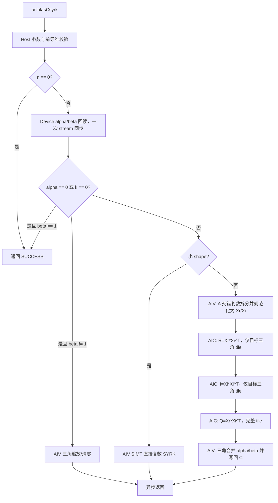

# aclblasCsyrk 算子设计文档

| 项目 | 内容 |
| --- | --- |
| 算子名称 | `aclblasCsyrk` |
| 任务编号 | 8 月社区任务 25 |
| 目标硬件 | Ascend 950PR（arch35） |
| 软件版本 | CANN 9.1.0 |
| 开发方式 | Ascend C Kernel 直调 |
| 数据类型 | COMPLEX64（实部、虚部均为 FP32） |
| 对齐基线 | cuBLAS `cublasCsyrk`、Netlib BLAS `csyrk` |
| 合入仓及目录 | `ops-blas`，`blas/syrk/arch35/` |
| 文档状态 | 设计方案，待编码及 950PR 实测 |

# 1. 需求背景（required）

## 1.1 需求来源

本需求来源于 CANN 社区任务《8月社区任务-aclblasCsyrk 算子开发（950）》。任务要求在 Ascend 950PR 上，基于 `ops-blas` 工程使用 Ascend C 实现单精度复数对称秩-k 更新接口，并完成公共 API、Host 参数校验、Device Kernel、测试工程、算子 README 和自测报告。

接口语义对齐 cuBLAS `cublasCsyrk` 和 Netlib BLAS `csyrk`。本算子计算普通复数对称更新，不是 Hermitian 更新，因此所有转置都不取共轭，输出对角元素的虚部也不强制为零。

## 1.2 背景介绍

`aclblasCsyrk` 属于 BLAS Level 3 算子，计算：

$$
C \leftarrow \alpha\,op(A)op(A)^T + \beta C.
$$

其中：

- `trans = ACLBLAS_OP_N` 时，`op(A)=A`，A 的逻辑形状为 `n x k`；
- `trans = ACLBLAS_OP_T` 时，`op(A)=A^T`，A 的物理形状为 `k x n`；
- `trans = ACLBLAS_OP_C` 时，按 `ACLBLAS_OP_T` 等价处理，不执行共轭；
- C 为 `n x n` 复数对称矩阵，仅 `uplo` 指定的三角区域被读取和更新；
- A、C 均按列主序存储，`lda`、`ldc` 以复数元素为单位；
- `alpha`、`beta`、A、C 位于 Device 内存，维数与枚举位于 Host。

当前 `ops-blas` 公共头文件尚无 `aclblasCsyrk` 声明。本任务必须在 `include/cann_ops_blas.h` 增加公共接口，不新增 950PR 私有平行 API。

# 2. 需求分析（required）

## 2.1 接口定义

```cpp
aclblasStatus_t aclblasCsyrk(
    aclblasHandle_t handle,
    aclblasFillMode_t uplo,
    aclblasOperation_t trans,
    int n,
    int k,
    const aclblasComplex* alpha,
    const aclblasComplex* A,
    int lda,
    const aclblasComplex* beta,
    aclblasComplex* C,
    int ldc);
```

`aclblasComplex` 以 `include/cann_ops_blas_common.h` 中的定义为准，其内存表示为两个连续 FP32 分量。接口通过 `handle` 取得绑定的 stream；除读取 Device 标量以判定同步返回值所需的分支外，所有 Device 计算均按该 stream 顺序执行。

## 2.2 参数与约束

| 参数 | 位置 | 类型 | 约束和语义 |
| --- | --- | --- | --- |
| `handle` | Host | `aclblasHandle_t` | 必须是有效句柄；空指针返回 `ACLBLAS_STATUS_HANDLE_IS_NULLPTR` |
| `uplo` | Host | 枚举 | 仅支持 `ACLBLAS_UPPER`、`ACLBLAS_LOWER`；非法值返回 `ACLBLAS_STATUS_INVALID_ENUM` |
| `trans` | Host | 枚举 | 支持 `OP_N/OP_T/OP_C`；`OP_C` 按无共轭 `OP_T` 执行；非法值返回 `ACLBLAS_STATUS_INVALID_ENUM` |
| `n` | Host | `int` | `n >= 0`；`n=0` 为合法 no-op |
| `k` | Host | `int` | `k >= 0`；`k=0` 时不读取 A，只处理 beta 路径 |
| `alpha` | Device | `const aclblasComplex*` | 非空，复数乘数 |
| `A` | Device | `const aclblasComplex*` | `n>0 && k>0` 时非空；列主序，只读 |
| `lda` | Host | `int` | N：`lda >= max(1,n)`；T/C：`lda >= max(1,k)` |
| `beta` | Device | `const aclblasComplex*` | 非空，复数乘数 |
| `C` | Device | `aclblasComplex*` | `n x n` 列主序矩阵，原地更新指定三角 |
| `ldc` | Host | `int` | `ldc >= max(1,n)` |

本批次不支持超出 `lda/ldc` 语义的任意非连续视图，不涉及 broadcast，不返回视图，不要求固定的跨核归约顺序。

## 2.3 功能边界

### 2.3.1 对称而非厄米特

对任意复矩阵 X，本算子使用普通转置 `X^T`，不使用共轭转置 `X^H`。因此：

- `OP_C` 不对虚部取反；
- C 的隐含三角由 `C(i,j)=C(j,i)` 定义，而不是 `C(i,j)=conj(C(j,i))`；
- 对角元素虚部按普通复数值参与 alpha/beta 运算；
- Kernel 不执行 HERK 类算子的对角虚部清零步骤。

### 2.3.2 三角引用

- `UPPER`：仅当 `row <= col` 时读取和写回 C；
- `LOWER`：仅当 `row >= col` 时读取和写回 C；
- 未指定三角不得用于 beta 累加，也不得被写回；
- `beta=(0,0)` 时不读取有效三角中的旧 C，避免 NaN/Inf 无意义传播。

### 2.3.3 quick return 和退化路径

复数零表示 `(0,0)`，复数一表示 `(1,0)`。

| 条件 | 行为 |
| --- | --- |
| `n == 0` | 直接返回成功，不读取标量和矩阵，不启动 Kernel |
| `(alpha == 0 || k == 0) && beta == 1` | 返回成功，C 保持不变 |
| `(alpha == 0 || k == 0) && beta == 0` | 仅将指定三角置为复数零 |
| `(alpha == 0 || k == 0) && beta != 0/1` | 仅对指定三角执行复数 `C=beta*C` |
| 其他 | 执行完整 SYRK 计算 |

任务书将 alpha/beta 定义为 Device 指针，同时要求根据标量值同步返回错误码和选择 quick return。基线实现计划在 handle stream 上异步复制两个复数标量到 Host，并合并为一次 stream 同步；读取完成后再进入上述分支。该同步是当前 ABI 下保证分支与空指针语义确定性的代价，后续若公共框架提供 Device 标量分支协议，可切换为全异步控制路径。

## 2.4 需求拆解

1. 在 `include/cann_ops_blas.h` 增加接口声明，参数顺序和整数口径与任务书完全一致。
2. 支持 COMPLEX64、列主序、UPPER/LOWER、N/T/C 全组合。
3. 正确实现普通复数对称语义，不引入共轭和对角虚部清零。
4. 支持紧凑和 padded `lda/ldc`，覆盖运行时 n/k 和非对齐尾块。
5. 实现稳定的参数检查、错误码、零维和复数标量快速路径。
6. 小尺寸使用低启动开销路径，中大尺寸使用 AIC Cube 主路径。
7. 只计算/写回有效三角，降低无效计算和 GM 流量。
8. 完成任务附件 1000 条精度用例和 200 条性能/内存用例，并满足 3 个正式性能点。

# 3. 详细设计（required）

## 3.1 数学拆解

令逻辑矩阵：

$$
X=op(A)=X_r+iX_i.
$$

则：

$$
XX^T=(X_rX_r^T-X_iX_i^T)+i(X_rX_i^T+X_iX_r^T).
$$

定义三个 FP32 中间结果：

$$
R=X_rX_r^T,\qquad I=X_iX_i^T,\qquad Q=X_rX_i^T.
$$

由于 `X_iX_r^T=Q^T`，最终乘积为：

$$
P_r=R-I,\qquad P_i=Q+Q^T.
$$

该拆解只需要两个对称实数乘积和一个普通实数乘积。R、I 只计算目标三角，Q 计算完整矩阵供 `Q(i,j)+Q(j,i)` 使用，实数乘加总量等价于两个完整 GEMM，避免通用复数 GEMM 的四路全矩阵计算。

设 `alpha=ar+i*ai`、`beta=br+i*bi`、旧 C 为 `Cr+i*Ci`，epilogue 为：

```text
tmpReal = R - I
tmpImag = Q + transpose(Q)
outReal = ar*tmpReal - ai*tmpImag + br*Cr - bi*Ci
outImag = ar*tmpImag + ai*tmpReal + br*Ci + bi*Cr
```

所有中间乘积和累加使用 FP32，关闭可能改变验收精度口径的 HF32 快速模式。

## 3.2 总体架构



小尺寸阈值由 `n*n*k`、有效 tile 数和启动开销共同决定，先使用具名常量提供初值，再依据 950PR shape 扫描统一调整，不对三个验收 shape 写专用分支。

## 3.3 Host 侧设计

### 3.3.1 参数校验顺序

为使错误码稳定，Host 按以下顺序处理：

1. 检查 `handle`；
2. 检查 `uplo/trans` 枚举；
3. 检查 `n/k` 非负；
4. `n==0` 时直接返回成功；
5. 检查 `lda/ldc`；
6. 检查 alpha/beta 指针，以及 `k>0` 时的 A 指针；
7. 在绑定 stream 上读取 alpha/beta，完成一次同步；
8. 根据标量值检查 C 指针并选择 quick return、scale 或完整计算路径；
9. 对 workspace 字节数执行 checked arithmetic 后申请默认 workspace；
10. 生成 tiling 并按同一 stream 下发 Kernel。

非法枚举按任务书返回 `ACLBLAS_STATUS_INVALID_ENUM`。附件生成器当前把非法枚举期望写成 `INVALID_VALUE`，接入测试工程时应统一为任务书规定的状态码。

### 3.3.2 路由策略

| 路径 | 建议条件 | 目的 |
| --- | --- | --- |
| NO-OP | `n=0` 或退化条件且 `beta=1` | 不申请 workspace、不启动计算 Kernel |
| SCALE | `alpha=0` 或 `k=0` | 仅处理 C 的有效三角 |
| SMALL | tile 数不足以有效使用 AIC，或工作量小于调优阈值 | 单次 AIV Kernel，降低多阶段启动开销 |
| CUBE | 其余中大尺寸 | AIV 拆分 + AIC 三路矩阵乘 + AIV 合并 |

SMALL 路径直接按列主序和 `lda/ldc` 寻址，不申请矩阵 workspace。CUBE 路径把 `OP_T/OP_C` 在拆分阶段规范化为逻辑 `X(n,k)`，后续 AIC 无需感知原始 trans。

### 3.3.3 Tiling 数据

Host 按阶段生成独立 tiling，避免无关字段耦合。

拆分阶段核心字段：

```text
n, k, lda, transMode
totalElements, usedAivCoreNum
xRealOffset, xImagOffset
```

AIC 阶段核心字段：

```text
n, k, baseM, baseN, baseK
tileRows, tileCols, triangularMode
usedAicCoreNum
leftOffset, rightOffset, outputOffset, outputLdc
```

合并阶段核心字段：

```text
n, ldc, tempLdc, uploMode
alphaReal, alphaImag, betaReal, betaImag
skipProduct, betaMode
rOffset, iOffset, qOffset
totalTriangleElements, usedAivCoreNum
```

AIC 默认从 `baseM/baseN/baseK=128/128/128` 起调，边界维按 Cube 基础粒度对齐，实际有效长度单独传递。最终块型以 950PR 的 L1/L0/带宽实测为准。

### 3.3.4 三角 tile 编号

对 `tileCount=ceil(n/baseN)`，R/I 只调度：

```text
UPPER: tileRow <= tileCol
LOWER: tileRow >= tileCol
```

Host 传入有效三角 tile 总数，Kernel 将一维任务号映射为 `(tileRow,tileCol)`，再按 `blockIdx` 做 grid-stride 遍历。Q 阶段调度完整二维 tile 网格。对角 tile 在合并阶段逐元素施加三角 mask，确保不写未引用半边。

### 3.3.5 Workspace 规划

CUBE 路径使用 handle 默认 workspace，所有平面起点按仓内要求对齐：

```text
| Xr | Xi | R | I | Q |
```

其中：

```text
xPlaneBytes    = Align(n*k*sizeof(float))
tempLdc        = AlignUp(n, 16)
resultPlaneBytes = Align(tempLdc*n*sizeof(float))
workspaceBytes = 2*xPlaneBytes + 3*resultPlaneBytes
```

R/I 的未计算三角不会被读取。Q 保存完整矩阵。以 `n=k=2048` 为例，主体 workspace 约 80 MiB；workspace 无法取得时返回仓内统一的分配失败状态码。所有乘法、加法和对齐运算使用 `size_t/uint64_t` 并检查溢出。

## 3.4 Kernel 侧设计

### 3.4.1 AIV 小尺寸直接路径

每个 SIMT 线程负责一个目标三角元素 `(row,col)`，按 K 维顺序累加：

```text
trans=N   : a = A(row,p), b = A(col,p)
trans=T/C : a = A(p,row), b = A(p,col)
acc += a*b
```

`OP_C` 与 T 使用同一寻址，不对 b 取共轭。归约后执行复数 alpha/beta 融合并只写目标元素。该路径支持 padding 和任意非对齐 n/k，无 GM 中间矩阵。

### 3.4.2 AIV 拆分与布局规范化

拆分 Kernel 以逻辑索引 `(row,p)` 遍历 `X(n,k)`：

```text
N   : src = row + p*lda
T/C : src = p + row*lda
dst = row + p*n
```

从 AoS COMPLEX64 读取 real/imag，分别写入紧凑列主序 Xr/Xi 平面。连续且对齐的 N 路径优先使用批量搬运和 `DeInterleave`；T/C 或尾块使用转置 tile/SIMT 回退。两条实现写出相同布局，AIC 路径保持统一。

### 3.4.3 AIC 三路矩阵乘

AIC Kernel 复用同一 FP32 矩阵乘模板，通过输入平面和任务模式实例化三次：

| 阶段 | 左矩阵 | 右矩阵 | 计算 tile |
| --- | --- | --- | --- |
| R | Xr | Xr，转置读取 | 仅 uplo 三角 |
| I | Xi | Xi，转置读取 | 仅 uplo 三角 |
| Q | Xr | Xi，转置读取 | 完整矩阵 |

每个 AIC 任务处理一个输出 tile，K 维分块搬入 L1/L0A/L0B，在 FP32 L0C 中累加后通过 Fixpipe 写入对应结果平面。L1/L0 使用 ping-pong 缓冲和事件同步；尾 M/N/K 使用有效长度，不读取逻辑范围外的 padding。

R/I 的对称性只用于减少 tile 数，不从未初始化的镜像三角读取。Q 必须完整计算，因为目标三角的每个元素需要 `Q(row,col)` 和 `Q(col,row)`。

### 3.4.4 AIV epilogue

合并 Kernel 直接遍历 `n*(n+1)/2` 个有效元素，并映射到 `(row,col)`。它执行：

1. 读取同位置的 R、I；
2. 读取 Q 的 `(row,col)` 与 `(col,row)`；
3. 得到乘积的实部和虚部；
4. 融合复数 alpha；
5. beta 非零时读取旧 C 并融合，beta 为零时跳过读取；
6. 以列主序地址 `row+col*ldc` 写回实部和虚部。

读取旧 C 时先把实部和虚部同时保存到寄存器，再写任一分量，避免原地复数 beta 乘法被提前写回破坏。

### 3.4.5 缩放路径

退化路径不读取 A、不申请矩阵 workspace：

- `beta=(1,0)`：Host 直接返回；
- `beta=(0,0)`：AIV 只向目标三角写零，不读取旧 C；
- 其他 beta：AIV 读取目标三角，完成复数乘法后原地写回。

## 3.5 工程文件规划

```text
include/cann_ops_blas.h
blas/syrk/
├── README.md
└── arch35/
    ├── csyrk_host.cpp
    ├── csyrk_kernel.cpp
    ├── csyrk_kernel.h
    └── csyrk_tiling_data.h
test/syrk/csyrk/
├── CMakeLists.txt
├── README.md
├── csyrk_golden.h
├── csyrk_param.h
└── arch35/
    ├── csyrk_npu_wrapper.h
    ├── csyrk_test.cpp
    └── csyrk_test.csv
```

若仓内同族 `ssyrk` 已提供可复用的 Host 校验、三角 tile 编号或 FP32 SYRK 主核，应优先复用公共实现，通过类型/epilogue 模板扩展 COMPLEX64，避免复制一套行为分叉的框架。

## 3.6 性能优化方案

1. **减少矩阵乘数量**：利用 `Q^T` 关系，将四路复数 GEMM 化为两个三角实数乘积加一个完整实数乘积。
2. **三角 tile 裁剪**：R/I 仅调度有效三角，避免约一半 Cube 计算和结果写回。
3. **布局一次规范化**：拆分阶段统一 N/T/C 布局，AIC 主核保持连续、规则的访问模式。
4. **复数拆分向量化**：紧凑 N 路径使用批量搬运和 DeInterleave，降低标量地址计算开销。
5. **K 维双缓冲**：L1/L0 面板 ping-pong，覆盖搬运与 MMAD 的等待。
6. **融合 epilogue**：在一次 AIV 遍历中完成 R-I、Q+Q^T、alpha/beta 和三角写回。
7. **标量快路径**：alpha=0、k=0、beta=0/1 时跳过无关阶段和旧 C 读取。
8. **小 shape 单 Kernel**：避免拆分、三路 AIC 和合并的多次启动成本。
9. **核数自适应**：使用平台实际 AIC/AIV 核数，并按有效 tile/元素数限制启动核数。
10. **统一阈值调优**：根据完整 shape 扫描调整路径阈值，不针对正式性能点硬编码。

# 4. 可维可测分析

## 4.1 精度标准

golden 使用 cblas/Netlib `csyrk` 生成。`OP_C` 在 golden 侧映射为普通转置；仅比对 `uplo` 指定三角，实部、虚部分别按 FLOAT32 标准判定。

| dtype | rtol | atol | required matched ratio | max absolute error |
| --- | ---: | ---: | ---: | ---: |
| COMPLEX64（分量级） | `2^-10` | `2^-16` | 0.99 | `1e-2` 或 `32*ULP` |

逐分量通过条件为 `abs(actual-golden) <= atol + rtol*abs(golden)`。自测报告需同时记录 matched ratio、最大绝对误差和实部/虚部结果。

## 4.2 性能标准

正式性能验收在 Ascend 950PR 上先 warmup，再有效采样超过 50 次并取平均。三个正式门禁如下：

| case | n | k | uplo | trans | 平均耗时上限（us） |
| --- | ---: | ---: | --- | --- | ---: |
| 1 | 512 | 512 | UPPER | N | 126.27 |
| 2 | 1024 | 1024 | UPPER | N | 382.66 |
| 3 | 2048 | 2048 | UPPER | N | 1970.08 |

附件 CSV 还包含 LOWER/T、UPPER/C 和混合矩形等参考性能点；这些用于回归和调优，正式门禁以任务书上述三点为准。应使用 ACL event 或 msprof 采集 Device 执行时间，不能用包含数据准备、cblas golden 和比对的整段 GTest 墙钟时间代替 Kernel 时间。

## 4.3 自测范围

任务附件提供 1200 条可复现用例：1000 条精度用例和 200 条性能/内存用例。测试接入应覆盖：

- UPPER/LOWER 与 N/T/C 的 6 组正交组合；
- n/k 为 0、1、质数、2 的幂、2 的幂 ±1 和大规模值；
- n != k 的宽/窄矩形；
- 紧凑及 padded `lda/ldc`；
- alpha/beta 为 0、1、负数、纯虚数、一般复数和大值；
- A/C 的均匀、正态、零、交替、极值、Inf、NaN 数据；
- 空 handle/alpha/beta/A/C、非法枚举、负维度和非法前导维；
- 未引用三角保持不变，beta=0 时旧 C 不被读取；
- 3 个正式性能点及完整 shape 扫描。

附件生成器当前对普通随机矩阵以均匀分布为主，接入 `ops-blas` 测试工程时需补充 50% 正态分布生成能力，满足任务书的输入分布要求。

## 4.4 兼容性分析

本任务新增公共接口，不修改既有 `aclblasSsyrk`、`aclblasCherk` 或其他 BLAS API 的参数和语义。实现目录与实数 SYRK 同属 `blas/syrk/arch35/`，公共构建文件只增加 Csyrk 源文件和产品门控。回归至少包括：

- 既有 ssyrk arch35 编译和用例；
- 公共头文件 C/C++ 编译兼容性；
- 同一 handle/stream 上连续调用不同 BLAS 算子的顺序性；
- 默认 workspace 扩容后其他算子的使用；
- 950PR 目标构建不影响非 arch35 产品。

## 4.5 风险与应对

| 风险 | 影响 | 应对措施 |
| --- | --- | --- |
| Device 标量需要 Host 判定分支 | 引入一次 stream 同步，影响小 shape 延迟 | 合并 alpha/beta D2H 和一次同步；小 shape 实测后评估 Device 控制协议 |
| 任务书的 `C==nullptr && beta==0` 描述与输出语义存在歧义 | 参数测试预期可能不一致 | 设计评审时确认；测试与最终实现统一，以评审结论更新任务书 |
| 三路中间结果占用 workspace | 大 n 时内存压力增加 | checked arithmetic；后续评估 R/I 直接融合或分块复用结果区 |
| FP32 长 K 累加误差 | 大规模 case 可能触及误差上限 | 关闭 HF32；必要时按 K 分段并在 AIV 中固定顺序汇总 |
| Inf/NaN 与乘加重排 | 与 cblas 传播行为可能有差异 | 对特殊值定向用例分析；必要时为小 shape/特殊路径保留顺序累加 |
| 只计算三角的 tile 映射错误 | 漏算、越界或修改另一三角 | 对角/尾块独立测试，初始化未引用三角为哨兵并逐位校验 |

# 5. 交付与验收

最终交付包括：

1. 本设计文档及评审结论；
2. `ops-blas` 中的公共 API、Host、Kernel、构建配置和算子 README；
3. `test/syrk/csyrk/arch35/` 下的 CSV、cblas golden、GTest 和复现说明；
4. 包含全部用例参数、精度、性能、内存数据和截图的自测报告；
5. 个人代码仓、分支、算子目录和待验收 PR 地址。

# 6. 参考资料

1. [ops-blas 开源仓](https://gitcode.com/cann/ops-blas)
2. [cuBLAS SYRK 接口说明](https://docs.nvidia.com/cuda/cublas/index.html#cublas-t-syrk)
3. [Netlib CSYRK 参考实现](https://www.netlib.org/blas/csyrk.f)
4. [生态算子开源精度标准](https://gitcode.com/cann/opbase/blob/master/docs/zh/ops_precision_standard/experimental_standard.md)
5. [Ascend C 算子开发文档](https://www.hiascend.com/document/detail/zh/CANNCommunityEdition/850/opdevg/Ascendcopdevg/atlas_ascendc_map_10_0002.html)
