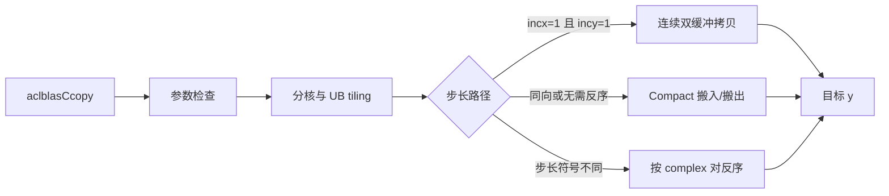

# aclblasCcopy 算子设计文档

本文档描述 Ascend 950PR（DAV 3510，对应正式主仓的 `arch35`）平台上
`aclblasCcopy` 的接口、
Host 侧处理、Ascend C Kernel、连续与步长拷贝、bit-exact 验证及性能
优化方案。设计以任务书为验收依据，交付结构遵循
`ops-blas/experimental` 当前样例，算法设计复用现有 `aclblasScopy`
的数据搬运策略。

| 项目 | 内容 |
| --- | --- |
| 文档状态 | 草案 |
| 目标仓库 | `cann/ops-blas` |
| 验收目录 | `experimental/aclblasCcopy/` |
| Host 目录 | `experimental/aclblasCcopy/op_host/` |
| Kernel 目录 | `experimental/aclblasCcopy/op_kernel/` |
| 测试目录 | `experimental/aclblasCcopy/test/` |
| 编译架构 | `--npu-arch=dav-3510` |
| 适配硬件 | Ascend 950PR |
| CANN 版本 | 9.1.0 |
| 数据类型 | `COMPLEX64` |

## 需求背景（required）

本节说明任务来源、Ccopy 的功能和现有同族代码基础。本任务是在标准
`ops-blas` API 下新增 Ascend 950PR 的 complex64 向量拷贝实现。

### 需求来源

参考 cuBLAS `cublasCcopy` 和 Netlib BLAS `ccopy` 的参数及语义，使用
Ascend C 在 Ascend 950PR 上实现 `aclblasCcopy`。本次验收代码放入
`experimental/aclblasCcopy/`，并按 `op_host/`、`op_kernel/` 和 `test/`
组织；目录中不建立 `arch35/` 子目录。架构信息由 CMake 的
`--npu-arch=dav-3510` 表达。验收后的正式主仓迁移不在本设计交付范围内。

### 背景介绍

Ccopy 属于 BLAS Level 1 操作。它将源复数向量的 `n` 个逻辑元素复制
到目标向量：

```text
y[iy] = x[ix], i = 0, 1, ..., n-1
ix = startX + i * incx
iy = startY + i * incy
```

当步长为负数时，逻辑起点位于物理缓冲区的高地址端：

```text
startX = incx > 0 ? 0 : (n - 1) * abs(incx)
startY = incy > 0 ? 0 : (n - 1) * abs(incy)
```

`aclblasComplex` 由两个 `float32` 分量组成，每个逻辑元素占 8 字节。
Ccopy 不执行数值运算，必须逐位复制实部和虚部，并保持目标步长空洞内的
原数据不变。

### 现有实现分析

`ops-blas` 已提供 Ascend 950PR 的 `aclblasScopy`，其中包含以下可复用
设计：

- 按 AIV Core 数均匀分配逻辑元素；
- 连续场景使用 `DataCopy` 和双缓冲 Prime-Pump-Drain；
- 非连续场景使用 Compact 模式搬入和搬出；
- 通过逻辑到物理地址映射支持正负步长；
- 通过 `DataCopyPad` 处理非 32 字节对齐尾块。

Ccopy 与 Scopy 的差异是单个逻辑元素包含一对不可拆分的 32 位数据。
实现必须以 8 字节 complex 元素为粒度分核、重排和写回，不能把实部与
虚部分配给不同 Core，也不能经过浮点计算指令。

## 需求分析（required）

本节将任务书要求拆分为接口、异常行为、数据搬运、精度和性能要求，作为
实现及评审基线。

### 需求描述

实现与 `cublasCcopy` 核心语义一致的异步 complex64 向量拷贝接口，
支持正负 `incx/incy`，连续和非连续地址，以及未对齐起始地址。有效目标
元素必须 bit-exact，目标步长空洞不得被修改。

### 需求拆解

实现需要满足以下要求：

1. 复用仓库已有的 `aclblasCcopy` 公共声明。
2. 支持 `n >= 0`，其中 `n=0` 为 quick return。
3. 支持非零的正负 `incx` 和 `incy`。
4. 以 8 字节为一个 complex64 逻辑元素执行纯数据搬移。
5. 有效目标元素与 golden 逐位相等，包括 NaN payload、Inf 和符号零。
6. 只写 `y` 的逻辑位置，不污染非连续写间隙。
7. 使用 handle 绑定的 stream 异步下发，不主动同步 stream。
8. 连续性能路径覆盖百万到千万级 complex64 元素。
9. 参考 `test/copy/scopy/` 的测试语义，并按 `experimental` 样例组织独立
   测试可执行程序和数据脚本。

### 接口定义

接口声明已经存在，不新增 950PR 私有 API。接口定义如下：

```cpp
aclblasStatus_t aclblasCcopy(
    aclblasHandle_t handle,
    int n,
    const aclblasComplex* x,
    int incx,
    aclblasComplex* y,
    int incy);
```

### 参数规格

下表定义接口参数及异常行为。

| 参数 | 类型 | 含义 | 约束与异常行为 |
| --- | --- | --- | --- |
| `handle` | `aclblasHandle_t` | ops-blas 上下文及 stream | 空指针返回 `ACLBLAS_STATUS_HANDLE_IS_NULLPTR` |
| `n` | `int` | 逻辑元素数量 | `n < 0` 返回 `ACLBLAS_STATUS_INVALID_VALUE`；`n=0` 返回成功 |
| `x` | `const aclblasComplex*` | 源向量 | `n>0` 时为空返回 `ACLBLAS_STATUS_INVALID_VALUE` |
| `incx` | `int` | 源向量步长 | 为 0 时返回 `ACLBLAS_STATUS_INVALID_VALUE` |
| `y` | `aclblasComplex*` | 目标向量 | `n>0` 时为空返回 `ACLBLAS_STATUS_INVALID_VALUE` |
| `incy` | `int` | 目标向量步长 | 为 0 时返回 `ACLBLAS_STATUS_INVALID_VALUE` |

### 参数检查顺序

Host 侧沿用 `arch35` Scopy 的 quick-return 语义：

1. 检查 `n < 0`；
2. 当 `n == 0` 时返回 `ACLBLAS_STATUS_SUCCESS`，不访问其他参数；
3. 检查 `handle`；
4. 检查 `x` 和 `y`；
5. 检查 `incx != 0` 和 `incy != 0`；
6. 获取 AIV Core 数并生成 tiling；
7. 在 handle 绑定的 stream 上下发 Kernel。

### 地址计算安全

负步长的绝对值和物理跨度不能直接在 32 位有符号整数中计算，因为
`INT_MIN` 取反会溢出。Host 与 Kernel 使用以下形式：

```cpp
uint64_t absInc = inc >= 0
    ? static_cast<uint64_t>(inc)
    : static_cast<uint64_t>(-static_cast<int64_t>(inc));

uint64_t physicalLength =
    static_cast<uint64_t>(n - 1) * absInc + 1ULL;
```

所有 GM 字节偏移使用 `uint64_t`。

## 详细设计（required）

本节定义 Host tiling、分核、UB 管理、连续快速路径、非连续 Compact
路径以及异号步长重排方案。

### 算子分析

#### 数据表示

仓库中的 `aclblasComplex` 定义如下：

```cpp
typedef struct aclblasComplex {
    float real;
    float imag;
} aclblasComplex;
```

Kernel 把 complex64 看作两个连续的 32 位原始字，而不是参与计算的
浮点数。连续路径可以将 `n` 个 complex 元素视为 `2*n` 个 `uint32_t`
或 `float` 执行 DataCopy，但分核边界和尾块必须保持 8 字节对齐。

#### bit-exact 要求

实现不执行 Cast、Add、Mul 或其他数值指令。每个元素的 64 位数据按原始
比特复制，因此以下值均保持不变：

- 普通有限值；
- `+0.0` 和 `-0.0`；
- `+Inf` 和 `-Inf`；
- NaN 的符号位、quiet/signaling 位和 payload。

测试不能只用浮点容差比较，还必须对实部和虚部对应的 `uint32_t` 位模式
执行相等判断。

### 总体架构

Host 侧只负责检查和切分。Kernel 根据步长组合选择连续、同向 Compact
或反向重排路径，并直接写入目标向量，不需要额外输出 workspace。



### Host 侧设计

#### 验收文件结构

验收代码按 `experimental` 样例拆分 Host 与 Kernel，不建立架构子目录：

```text
experimental/aclblasCcopy/
├── CMakeLists.txt
├── README.md
├── run.sh
├── op_host/
│   ├── ccopy_host.cpp
│   └── ccopy_kernel_do.h
├── op_kernel/
│   ├── ccopy_kernel.cpp
│   └── ccopy_tiling_data.h
└── test/
    ├── CMakeLists.txt
    ├── ccopy_test.cpp
    └── data/
        ├── ccopy_test.csv
        ├── gpu_baseline.csv
        ├── gen_csv.py
        ├── verify_accuracy.py
        └── verify_performance.py
```

验收工程通过独立 CMake 将 `op_host/ccopy_host.cpp` 与
`op_kernel/ccopy_kernel.cpp` 纳入 `dav-3510` 目标，只需保证目录、构建
和测试组织与 `experimental` 当前格式一致。

#### TilingData

建议定义独立结构，字段含义与 Scopy 保持一致，但所有数量以 complex
逻辑元素为单位：

```cpp
struct CcopyTilingData {
    uint32_t totalN;
    uint32_t perCoreN;
    uint32_t extraBlockCores;
    uint32_t tailElements;
    uint32_t tileSize;
    int32_t incx;
    int32_t incy;
    uint32_t copyMode;
};
```

`copyMode` 建议定义为：

```text
0：incx=1 且 incy=1，连续性能路径
1：源和目标物理方向相同，无需 tile 内反序
2：源和目标物理方向不同，需要按 complex 对反序
```

#### 分核策略

一个 32 字节硬件搬运块包含 4 个 complex64 元素，因此分核基准为：

```text
COMPLEX_PER_BLOCK = 32 / sizeof(aclblasComplex) = 4
```

Host 侧将 `n` 分配到 `min(n, aivCoreNum)` 个 Core：

1. `perCoreN` 向下对齐到 4 个 complex 元素；
2. 多余的完整 32 字节块依次分给前部 Core；
3. 最后不足 4 个 complex 元素的尾块交给最后一个有效 Core；
4. 每个 Core 根据 tiling 自行计算逻辑起点和元素数。

小规模输入需要通过 profiling 调整有效 Core 数，避免 Kernel 启动和空核
成本超过拷贝时间。

#### UB 切分

Host 通过平台接口读取 UB 容量，不硬编码 950PR UB 大小。连续路径只需要
双缓冲输入/输出绑定队列：

```text
2 * tileSize * sizeof(aclblasComplex) + safetyMargin <= ubSize
```

非连续及反序路径还需要一个 complex 临时 Tensor。`tileSize` 向下对齐到
4 个 complex 元素，并满足 Compact 模式单次 block 数限制。

### Kernel 侧设计

#### 连续快速路径

当 `incx=1 && incy=1` 时，源和目标都是连续 complex64 数组。Kernel
采用与 Scopy 一致的 Prime-Pump-Drain 双缓冲：

1. Prime：MTE2 将第一个 tile 从 GM 搬入 UB；
2. Pump：MTE2 读取当前 tile，同时 MTE3 写出上一 tile；
3. Drain：MTE3 写出最后一个完整 tile；
4. Tail：使用 DataCopyPad 处理不足 32 字节的尾部。

完整 tile 只执行 DataCopy，不进入 Vector 计算流水。单个 Core 的起点、
长度和 tile 大小都按 complex 边界切分，避免实部和虚部分离。

#### 非连续 Compact 路径

当任一绝对步长不为 1 时，使用 Compact 搬运模式。每个 block 只搬运一个
complex 元素：

```text
blockCount = 当前 tile 的 complex 元素数
blockLen   = 8 字节
srcStride  = (abs(incx) - 1) * 8 字节
dstStride  = (abs(incy) - 1) * 8 字节
```

Compact 写回只覆盖每个目标 complex 的 8 字节，`incy` 形成的间隙不会
被写入。若硬件接口的 stride 字段存在上限，Kernel 按最大合法 block 数
和 stride 范围进一步分批；非常规大步长使用逐元素兜底路径。

#### 负步长与反序

每个 Core 按逻辑区间 `[logicalOffset, logicalOffset + dataCount)` 工作。
某个 tile 在源或目标缓冲区中的最低物理地址为：

```text
inc > 0：base = logicalOffset * abs(inc)
inc < 0：base = (n - logicalOffset - dataCount) * abs(inc)
```

当 `incx` 和 `incy` 同号时，从各自最低地址按相同物理方向搬运即可保持
逻辑映射。当二者符号不同，Kernel 必须把 tile 内 complex 元素反序：

```text
dst[i].real = src[dataCount - 1 - i].real
dst[i].imag = src[dataCount - 1 - i].imag
```

反序以两个 `uint32_t` 为一组执行，不能分别反转所有实部和所有虚部。
功能优先路径可使用标量 `SetValue/GetValue`；若 profiling 表明需要优化，
再使用支持 8 字节元素的 Gather 或生成成对偏移表。

#### 未对齐地址和尾块

附件用例包含 x/y 起始地址偏移。Kernel 对完整对齐部分使用 DataCopy，
对未对齐起点、末尾或不足 32 字节部分使用 DataCopyPad/扩展搬运参数。
写回长度必须等于真实有效字节数，不能用 padding 写入 y 的边界之外。

#### Kernel 入口

Kernel 使用 AIV-only 模式，结构如下：

```cpp
extern "C" __global__ __aicore__ void ccopy_kernel(
    GM_ADDR x,
    GM_ADDR y,
    GM_ADDR workspace,
    CcopyTilingData tiling);
```

`workspace` 首版可不使用并传入 `nullptr`。如果后续采用 Host 预生成反序
偏移表，可复用 handle workspace，但不得为每次调用执行 malloc/free 或
stream 同步。

### 支持硬件

本设计的目标平台如下。

| 支持的芯片版本 | 支持状态 |
| --- | --- |
| Ascend 950PR | 支持并执行性能验收 |

### 算子约束限制

实现遵循以下限制：

1. `x` 和 `y` 是由 `incx/incy` 描述的一维逻辑向量。
2. 除步长外，不支持额外的 view、broadcast 或 leading dimension。
3. 目标步长空洞必须保留调用前的原始数据。
4. 不保证源和目标缓冲区部分重叠时的 memmove 语义。
5. 调用方在读取 y 前负责同步 handle 绑定的 stream。
6. `n=0` 时不读取 x，也不写入 y。

## 性能优化方案

本节以任务书的 `incx=incy=1` 大规模场景为主，目标是让 MTE2 读取与
MTE3 写入充分重叠，并减少 Kernel 内指令和分支。

### 性能目标

任务书给出的正式验收目标如下：

| case | n | incx | incy | 最大平均耗时 |
| --- | ---: | ---: | ---: | ---: |
| 1 | 1,048,576 | 1 | 1 | 2.08 μs |
| 2 | 4,194,304 | 1 | 1 | 3.79 μs |
| 3 | 16,777,216 | 1 | 1 | 10.83 μs |

性能测试需要先 warmup，再有效采样超过 50 次并取平均值。

### 优化措施

实现按以下顺序优化：

1. 对连续路径使用无计算的 MTE2→UB→MTE3 搬运流水。
2. 使用双缓冲 Prime-Pump-Drain 重叠读写。
3. 根据实际 AIV Core 数平均分配大向量，并将分核边界对齐到 32 字节。
4. 尽量使用大 tile 降低循环、队列和尾块处理次数。
5. 将连续路径与 Compact/反序路径完全分开，避免性能循环内判断步长。
6. 避免 Host 侧 workspace 初始化、malloc/free 和 stream 同步。
7. 使用 profiler 分别检查 MTE2、MTE3、Core 间负载和 Kernel 启动开销。

### 性能风险及应对

主要风险和处理方式如下。

| 风险 | 影响 | 应对方案 |
| --- | --- | --- |
| complex 分核边界错误 | 实虚部错位 | 所有计数先以 complex 为单位，搬运时再乘 8 字节 |
| MTE2/MTE3 未有效重叠 | 连续路径带宽不足 | 使用绑定队列双缓冲并通过 profiler 验证流水 |
| Core 数过多 | 小尺寸启动成本升高 | 按规模选择有效 Core 数 |
| tile 过小 | 循环和队列开销增加 | 基于实际 UB 容量最大化连续 tile |
| 非连续写覆盖空洞 | 功能验收失败 | Compact blockLen 固定为 8 字节并执行哨兵检查 |
| 异号步长反转单个 float | 实虚部配对错误 | 始终按 8 字节 complex 对执行反序 |

## 可维可测分析

本节定义 bit-exact、异常、功能和性能测试，使结果可以复现和定位。

### 精度标准/性能标准

Ccopy 是纯数据搬移，实际验收必须比通用 FLOAT32 容差更严格：

| 验收项 | 标准 | 来源 |
| --- | --- | --- |
| 有效 y 元素 | 与 golden 实部、虚部逐位相等 | 任务书 |
| 最大绝对误差 | 0 | 任务附件测试说明 |
| y 步长空洞 | 与执行前哨兵数据逐位相等 | 任务书 |
| 性能 | 按 taskbook 和 package 两种口径分别判定并报告 | 任务书、任务附件 |

### 功能测试设计

测试语义参考正式主仓 `test/copy/scopy/`。`ccopy_test.cpp` 使用 C++
GTest 加载任务附件 `ccopy_test.csv`，并新增 complex64 填充、bitwise
golden 比较和 y 空洞保护检查。`verify_accuracy.py` 构建并运行除 PF 外
的用例。性能测试同时保留附件流程和独立 benchmark：附件流程用于覆盖
PF 用例，独立 benchmark 用于获取可作为微秒级门禁的 Kernel 耗时。
任务附件包含 1200 条用例，测试文件统一放在 `test/` 与 `test/data/`：

| 类别 | 数量 | 主要覆盖内容 |
| --- | ---: | --- |
| L0 基础 | 8 | 小尺寸及 `±1/±2` 基础步长 |
| L1 尺寸 | 38 | 1 至 1,048,576 的质数、边界和非对齐尺寸 |
| L2 步长 | 36 | `incx × incy` 的 `±1/±2/±3` 全组合 |
| L5 填充 | 12 | 随机、零、交替、极端值、Inf 和 NaN |
| L5b 对齐 | 5 | x/y 非对齐起始地址组合 |
| L6 边界 | 7 | no-op、空指针、零步长和负维度 |
| EX 扩展 | 894 | 尺寸、步长、填充和对齐组合 |
| PF 性能 | 200 | 连续访存规模扫描 |

任务书“自测要求”第 4 项出现 `alpha=(0,0)`、非方阵、`lda` 和 padding
等描述，与一维 Ccopy 接口不一致，属于通用模板内容。本文按任务书第 2
章算子定义以及附件 CSV/README 组织测试，不设置 alpha、矩阵 shape、lda
或矩阵 padding 用例；Ccopy 的等价内存保护场景由 y 步长空洞和未对齐
地址用例覆盖。

### 关键专项用例

除附件用例外，实现阶段重点检查以下场景：

- `n=0` 且 `handle/x/y=nullptr` 的 quick return；
- `n=1/2/3/4/5` 的 32 字节块边界；
- `incx/incy` 的四种符号组合；
- `incx=3, incy=-2` 等异号且绝对值不同的组合；
- y 使用固定哨兵填充，验证所有步长空洞不变；
- 实部或虚部分别包含 `-0.0`、Inf 和不同 NaN payload；
- x/y 起始地址分别偏移 4、8、12 字节；
- `incx` 或 `incy` 为 `INT_MIN` 时地址绝对值计算不发生有符号溢出；
- 超大 n 下分核总数、尾块和物理跨度计算正确。

### 异常测试

异常状态按下表验证。

| 场景 | 预期结果 |
| --- | --- |
| `n < 0` | `ACLBLAS_STATUS_INVALID_VALUE` |
| `n == 0` | `ACLBLAS_STATUS_SUCCESS` |
| `handle == nullptr && n > 0` | `ACLBLAS_STATUS_HANDLE_IS_NULLPTR` |
| `x == nullptr && n > 0` | `ACLBLAS_STATUS_INVALID_VALUE` |
| `y == nullptr && n > 0` | `ACLBLAS_STATUS_INVALID_VALUE` |
| `incx == 0` | `ACLBLAS_STATUS_INVALID_VALUE` |
| `incy == 0` | `ACLBLAS_STATUS_INVALID_VALUE` |

### 性能测试方法

性能测试在 Ascend 950PR 上进行：

1. 固定 CANN 9.1.0 和设备运行环境；
2. 使用 `incx=incy=1` 且无地址偏移的数据；
3. 对独立 benchmark 预热 20 次，再执行 100 次有效采样并取平均值；
4. 使用 NPU device event 或 profiler 获取 Kernel 平均耗时；
5. 分别记录 `taskbook` 和 `package` 口径所需规模的结果；
6. 保存参数、原始日志、profiling 截图和两套口径的最终结论到自测报告。

当前附件性能脚本读取 GTest 输出中的毫秒级墙钟时间，计时范围可能包含
内存分配、H2D/D2H、golden 计算和结果比对耗时；小尺寸还可能因为时间取整
为 0 ms。因此，附件脚本用于功能和流程覆盖，独立 benchmark 才用于微秒级
Kernel 性能结论。

### 任务书与附件性能口径一致性

任务书和当前附件在性能规模、基线覆盖范围和判定公式上存在不一致：

| 来源 | 三个主要性能规模 |
| --- | --- |
| 正式任务书 | 1,048,576；4,194,304；16,777,216，按绝对耗时上限判定 |
| 附件 README/CSV | 1,048,576；2,097,152；4,194,304，按附件公式判定 |
| `gpu_baseline.csv` | 覆盖 1～4M，不包含 16M baseline |

附件公式为 `GPU_us / NPU_us >= 0.4`，等价于
`NPU_us <= GPU_us / 0.4`。该方向与任务书中接近
`NPU_us <= GPU_us * 0.4` 的绝对阈值存在明显差异，必须在报告中单独列出，
不能默认为同一个标准。

任务书口径和附件口径分别测试、分别报告；在维护者确认前，不合并成单一
PASS/FAIL 结论。

- `taskbook` 口径：按任务书的 1M / 4M / 16M 及绝对耗时上限判定；
- `package` 口径：按附件 CSV、GPU baseline 和附件公式逐点判定；
- 16M 在 `package` 口径下因缺少 GPU baseline，标记为 `NO_REF`，仅作为
  大尺寸诊断结果；
- 最终验收结论以任务维护者书面确认的口径为准。

测试工程需要同时保留任务书要求的 `n=16,777,216` 用例和附件要求的
性能用例，并向任务维护者确认最终基线；不得把任一组规模直接当作唯一的
正式验收规模。

### 兼容性分析

`aclblasCcopy` 声明已经存在，本任务只新增 Ascend 950PR 实现，不修改
参数顺序、公共类型或其他产品实现。Host 侧状态码和 quick-return 行为
与同架构 `aclblasScopy` 保持一致。

## 交付文件规划

完成开发后，验收提交预期新增或修改以下文件：

```text
experimental/aclblasCcopy/CMakeLists.txt
experimental/aclblasCcopy/README.md
experimental/aclblasCcopy/run.sh
experimental/aclblasCcopy/op_host/ccopy_host.cpp
experimental/aclblasCcopy/op_host/ccopy_kernel_do.h
experimental/aclblasCcopy/op_kernel/ccopy_kernel.cpp
experimental/aclblasCcopy/op_kernel/ccopy_tiling_data.h
experimental/aclblasCcopy/test/CMakeLists.txt
experimental/aclblasCcopy/test/ccopy_test.cpp
experimental/aclblasCcopy/test/data/ccopy_test.csv
experimental/aclblasCcopy/test/data/gpu_baseline.csv
experimental/aclblasCcopy/test/data/gen_csv.py
experimental/aclblasCcopy/test/data/verify_accuracy.py
experimental/aclblasCcopy/test/data/verify_performance.py
```

性能报告或测试日志可放入 `docs/`。本次交付不包含
`blas/copy/arch35/`、`test/copy/ccopy/arch35/` 等正式合入目录；这些
目录由验收后的主仓合并流程处理。

## 风险与待确认项

设计评审阶段需要确认以下事项：

1. 任务书与附件的性能规模、基线覆盖范围和判定公式存在不一致，最终验收采用哪套口径。
2. Ascend 950PR Compact 搬运对 8 字节 blockLen 和 stride 的具体上限。
3. complex64 未对齐地址场景允许的最小对齐粒度。
4. 异号步长路径是否有可直接复用的 64 位 Gather/反序 API。
5. Ccopy 是否需要对 `x==y && incx==incy` 增加 Host no-op 优化。

## 参考资料

本文档参考以下任务和公开资料：

- [aclblasCcopy 社区任务](https://www.hiascend.com/activities/task-center/details/dde5f05e944c40f99b6794c82a5c46a4)
- [CANN 社区任务 2026](https://gitcode.com/cann/cann-ops-competitions/tree/master/04_tasks/01_community-task-2026)
- [cann-ops-competitions Pull Requests](https://gitcode.com/cann/cann-ops-competitions/pulls)
- [ops-blas 开源仓](https://gitcode.com/cann/ops-blas)
- [cuBLAS COPY 文档](https://docs.nvidia.com/cuda/cublas/index.html#cublas-t-copy)
- [Netlib ccopy 参考实现](https://www.netlib.org/blas/ccopy.f)
- [Ascend C 算子开发文档](https://www.hiascend.com/document/detail/zh/CANNCommunityEdition/850/opdevg/Ascendcopdevg/atlas_ascendc_map_10_0002.html)
- [生态算子开源精度标准](https://gitcode.com/cann/opbase/blob/master/docs/zh/ops_precision_standard/experimental_standard.md)
- [Experimental 提交目录判定流程](../../operator-design-guides/experimental-submission-layout-assessment.md)
- [算子 Design 文档标准](../../operator-design-guides/operator-design-document-standard.md)

## 修订记录

本文档在设计评审和实现验证过程中持续更新。

| 版本 | 日期 | 修改人 | 修改说明 |
| --- | --- | --- | --- |
| 0.1 | 2026-08-26 | 待填写 | 初始设计草案 |
| 0.2 | 2026-08-27 | 待填写 | 交付目录改为 experimental 验收格式 |
| 0.3 | 2026-08-27 | 待填写 | 简化验收接口与交付范围描述 |
| 0.4 | 2026-08-27 | 待填写 | 补充 CSV/GTest 测试交付及模板条款说明 |
