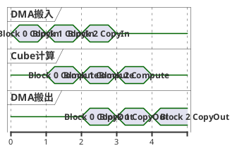

# 需求背景（required）

## 需求来源

参考cuBLAS库中的cublasCgemm接口，在昇腾NPU（Ascend 950PR）上基于Ascend C编程语言实现功能一致的单精度复数通用矩阵乘算子aclblasCgemm，并提交至ops-blas开源仓。

## 背景介绍

### aclblasCgemm算子实现

CGEMM（Complex General Matrix Multiply）是BLAS Level-3中最核心的复数矩阵乘运算，广泛应用于信号处理、量子计算、电磁仿真、频域分析等科学计算领域。

计算公式：

$$C = \alpha \cdot op(A) \cdot op(B) + \beta \cdot C$$

其中：
- α、β为单精度复数标量（complex64）
- A、B、C为单精度复数矩阵，列主序（Column-Major）存储
- op(A)为m×k矩阵，op(B)为k×n矩阵，C为m×n矩阵

### aclblasCgemm算子功能分析

通过对cuBLAS cublasCgemm接口进行分析，需要支持如下能力：

| 参数 | 参数含义 | 数据类型 | 支持数据类型 | 约束 |
| --- | --- | --- | --- | --- |
| handle | 库上下文句柄 | handle | aclblasHandle_t | 非空 |
| transa | 矩阵A操作类型 | enum | N/T/C | 必选 |
| transb | 矩阵B操作类型 | enum | N/T/C | 必选 |
| m | op(A)和C的行数 | int | int32 | ≥0 |
| n | op(B)和C的列数 | int | int32 | ≥0 |
| k | op(A)列数/op(B)行数 | int | int32 | ≥0 |
| alpha | 复数标量乘数 | scalar | complex64 | 非空指针 |
| A | 输入矩阵A | tensor | complex64 | Device内存 |
| lda | 矩阵A前导维度 | int | int32 | 满足约束 |
| B | 输入矩阵B | tensor | complex64 | Device内存 |
| ldb | 矩阵B前导维度 | int | int32 | 满足约束 |
| beta | 复数标量乘数 | scalar | complex64 | 非空指针 |
| C | 输入输出矩阵C | tensor | complex64 | Device内存,原地覆写 |
| ldc | 矩阵C前导维度 | int | int32 | ≥max(1,m) |

转置语义：
- transa=ACLBLAS_OP_N：op(A) = A
- transa=ACLBLAS_OP_T：op(A) = A^T（转置）
- transa=ACLBLAS_OP_C：op(A) = A^H（共轭转置）
- transb对op(B)语义相同

### aclblasCgemm算子现状分析

当前ops-blas开源仓已在`include/cann_ops_blas.h`第402行声明了aclblasCgemm接口，但尚未提供Ascend 950PR（arch35）平台的Ascend C实现。

本次开发目标：在`blas/gemm/arch35/`目录下实现该算子的kernel直调版本，通过handle绑定stream直调NPU kernel。

# 需求分析（required）

## 需求描述

使用Ascend C编程语言实现aclblasCgemm算子，支持complex64数据类型，实现单精度复数通用矩阵乘功能，与cuBLAS cublasCgemm核心功能和参数语义完全对齐。

## 需求拆解

1. 支持complex64数据类型（实部/虚部各float32）
2. 支持transa/transb = N/T/C三种操作模式
3. 支持列主序（Column-Major）存储
4. 支持前导维度padding（lda/ldb/ldc）
5. 实现边界行为：m=0或n=0时no-op，k=0或alpha=(0,0)时执行C=beta*C
6. 实现完整参数合法性校验
7. 精度满足生态算子开源精度标准（rtol=9.77e-4, atol=1.53e-5, matched_ratio≥0.99）
8. 性能达到任务书要求的标杆耗时
## 使能方式
使能路径说明：

1. **接口声明**：使用 ops-blas 仓 `include/cann_ops_blas.h` 第 402 行已有声明，与 aclblasSgemm 共用同一头文件，禁止定义 950PR 私有接口。

2. **算子实现目录**：`blas/gemm/arch35/`，包含以下文件：
   - `gemm_host.cpp`：Host 侧入口，参数校验、Tiling 计算、Kernel Launch
   - `gemm_kernel.cpp`：Device 侧 Kernel 实现
   - `gemm_kernel.h`：Kernel 头文件
   - `gemm_tiling_data.h`：Tiling 数据结构定义

3. **测试代码目录**：`test/gemm/cgemm/arch35/`，包含：
   - `gemm_test.cpp`：GTest 测试入口
   - `gemm_test.csv`：测试用例参数描述文件
   - `gemm_npu_wrapper.h`：NPU 调用封装

4. **编译集成**：通过 ops-blas 仓 `build.sh` 统一构建，CMake 工程自动识别 arch35 目标平台。

5. **调用流程**：
   ```
   用户代码 → #include "cann_ops_blas.h"
            → aclblasCreate(&handle)
            → aclblasSetStream(handle, stream)
            → aclblasCgemm(handle, transa, transb, m, n, k, &alpha, A, lda, B, ldb, &beta, C, ldc)
            → aclrtSynchronizeStream(stream)
            → aclblasDestroy(handle)
   ```

6. **环境依赖**：
   - 硬件：Ascend 950PR
   - CANN版本：9.1.0
   - asc-devkit ≥ 9.1（Cube kernel 使用 tensor_api）

# 详细设计（required）

## 算子分析

### 数学公式

$$C = \alpha \cdot op(A) \cdot op(B) + \beta \cdot C$$

其中复数乘法展开：

设 $\alpha = (\alpha_r, \alpha_i)$，对于复数矩阵元素 $a = (a_r, a_i)$，$b = (b_r, b_i)$：

$$a \times b = (a_r \cdot b_r - a_i \cdot b_i,\ a_r \cdot b_i + a_i \cdot b_r)$$

共轭转置时：

$$\overline{a} = (a_r, -a_i)$$

### 支持数据类型

complex64（实部float32 + 虚部float32）

### 支持形状

- op(A)：m × k
- op(B)：k × n
- C：m × n

列主序存储，实际内存布局：
- transa=N时，A的物理shape为lda×k（lda≥max(1,m)）
- transa=T/C时，A的物理shape为lda×m（lda≥max(1,k)）
- transb=N时，B的物理shape为ldb×n（ldb≥max(1,k)）
- transb=T/C时，B的物理shape为ldb×k（ldb≥max(1,n)）
- C的物理shape为ldc×n（ldc≥max(1,m)）

### 支持参数组合

transa(N/T/C) × transb(N/T/C) = 9种组合全覆盖

## 算子实现

### 实现方案

#### 整体架构

采用Ascend C kernel直调方式，基于ops-blas工程框架：


#### 复数矩阵乘拆解策略

复数矩阵乘无法直接使用Cube单元的实数MatMul指令，需要拆解为实数运算：

设 $A = A_r + j \cdot A_i$，$B = B_r + j \cdot B_i$，则：

$$op(A) \times op(B) = (A_r \cdot B_r - A_i \cdot B_i) + j \cdot (A_r \cdot B_i + A_i \cdot B_r)$$

即一次复数GEMM可拆解为4次实数GEMM + 2次加减法，最终输出：

$$C_r^{new} = \alpha_r (A_r B_r - A_i B_i) - \alpha_i (A_r B_i + A_i B_r) + \beta_r C_r - \beta_i C_i$$

$$C_i^{new} = \alpha_r (A_r B_i + A_i B_r) + \alpha_i (A_r B_r - A_i B_i) + \beta_r C_i + \beta_i C_r$$

对于转置/共轭转置的处理：
- transa=N：直接使用A_r和A_i
- transa=T：使用A_r^T和A_i^T
- transa=C：使用A_r^T和(-A_i)^T（共轭后转置）

#### 3.2.1 host侧设计

##### 1. 参数检查

按优先级顺序检查：

1. handle为nullptr → 返回ACLBLAS_STATUS_HANDLE_IS_NULLPTR
2. transa/transb不在{N,T,C}枚举中 → 返回ACLBLAS_STATUS_INVALID_ENUM
3. m<0、n<0、k<0 → 返回ACLBLAS_STATUS_INVALID_VALUE
4. alpha为nullptr或beta为nullptr → 返回ACLBLAS_STATUS_INVALID_VALUE
5. lda/ldb/ldc不满足前导维度约束 → 返回ACLBLAS_STATUS_INVALID_VALUE
6. k>0时A/B/C为nullptr → 返回ACLBLAS_STATUS_INVALID_VALUE

##### 2. Quick Return逻辑

对齐Netlib cgemm参考实现：

- m=0或n=0：直接返回ACLBLAS_STATUS_SUCCESS
- k=0或alpha=(0,0)：执行C=beta*C路径
  - beta=(0,0)：将C置零
  - beta=(1,0)：C不变，直接返回
  - 其他beta值：逐元素执行复数缩放

##### 3. Tiling策略

基于Ascend 950PR的Cube单元特性进行矩阵分块：

分块维度选择：
- M方向分块大小（tileM）：根据L1 Buffer容量和数据类型确定
- N方向分块大小（tileN）：根据L1 Buffer容量和数据类型确定
- K方向分块大小（tileK）：根据L0A/L0B容量确定

考虑因素：
- complex64每个元素占8字节（2×float32）
- 实部/虚部分离存储后每个分量占4字节
- 需要同时容纳A_r、A_i、B_r、B_i的分块数据
- Cube计算需要满足对齐要求（16字节对齐）

##### 4. 分核策略

采用M×N方向二维分核：

- 将输出矩阵C按tileM×tileN分块
- 根据AI Core数量将分块均匀分配到各Core
- 每个Core负责计算C矩阵的若干个输出分块
- K方向在Core内串行累加

##### 5. 数据布局转换

输入为列主序复数交织存储（real, imag, real, imag, ...），需要：


#### 3.2.2 kernel侧设计

Kernel分为Init和Process两个阶段。

##### 1. Init阶段

- 获取Tiling参数
- 计算当前Core负责的输出分块范围
- 初始化Local Memory指针

##### 2. Process阶段

Process包含CopyIn、Compute、CopyOut三个步骤，采用多级流水线并行。

##### 3. CopyIn阶段

从Global Memory搬运数据到Local Memory：

- 读取A矩阵的实部和虚部分块（解交织）
- 读取B矩阵的实部和虚部分块（解交织）
- 读取C矩阵的实部和虚部分块（用于beta缩放）
- 处理列主序+前导维度padding的非连续内存访问

##### 4. Compute阶段

执行复数矩阵乘核心计算：


##### 5. 转置与共轭处理

| transa | A_r来源 | A_i来源 |
| --- | --- | --- |
| N | A实部（原序） | A虚部（原序） |
| T | A实部（转置） | A虚部（转置） |
| C | A实部（转置） | -A虚部（转置） |

transb对B的处理逻辑相同。

转置操作可在数据搬入时通过调整寻址模式实现，共轭操作通过对虚部取反实现。

##### 6. CopyOut阶段

将计算结果从Local Memory写回Global Memory：

- 将实部和虚部交织为complex64格式
- 按列主序写入C矩阵对应位置
- 处理前导维度ldc的stride

##### 7. 流水线优化

采用Double Buffer策略：



- 当前分块计算的同时，预取下一分块数据
- 计算结果写回的同时，启动下一分块计算
- 充分利用数据搬运单元和Cube计算单元的并行能力

## 支持硬件

| 支持的芯片版本 | 涉及勾选 |
| --- | --- |
| Ascend 950PR | √ |

## 算子约束限制

1. 仅支持complex64（单精度复数）数据类型。
2. 矩阵存储格式为列主序（Column-Major），与cuBLAS一致。
3. transa/transb仅支持N（不转置）、T（转置）、C（共轭转置）三种模式。
4. 前导维度须满足约束：transa=N时lda≥max(1,m)，transa=T/C时lda≥max(1,k)；transb=N时ldb≥max(1,k)，transb=T/C时ldb≥max(1,n)；ldc≥max(1,m)。
5. 算子通过handle绑定stream异步执行，读回Device结果前须同步stream。
6. 依赖asc-devkit≥9.1（ASC_DEVKIT_MAJOR≥9且ASC_DEVKIT_MINOR>0）。
7. C矩阵为原地覆写输出，不返回视图。
8. 当beta=(0,0)时，C矩阵无需在调用前初始化。
9. 不支持非连续Tensor（超出lda/ldb/ldc语义的非连续内存访问）。
10. 不要求确定性计算。

# 可维可测分析

## 精度标准/性能标准

| 验收标准 | 描述 | 标准来源 |
| --- | --- | --- |
| 精度标准 | 实部/虚部分别按FLOAT32比对：rtol=9.77e-4, atol=1.53e-5, matched_ratio≥0.99, max_abs_error≤1e-2；golden由cblas_cgemm生成 | 生态算子开源精度标准 |
| 性能标准 | 256³≤5.80us, 512³≤10.93us, 1024³≤66.16us（warmup后>50次有效采样平均） | 任务书要求 |

## 兼容性分析

本次为新增Ascend 950PR（arch35）平台实现，不涉及历史版本兼容性问题。

接口定义使用ops-blas仓`include/cann_ops_blas.h`中已有声明（第402行），与其他产品线共用同一aclblasCgemm API，无需定义私有接口，便于用户从cuBLAS迁移适配。
