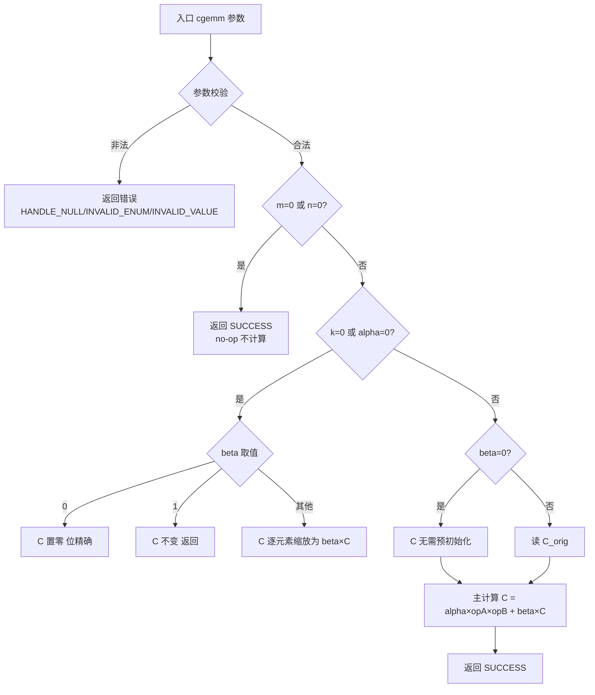
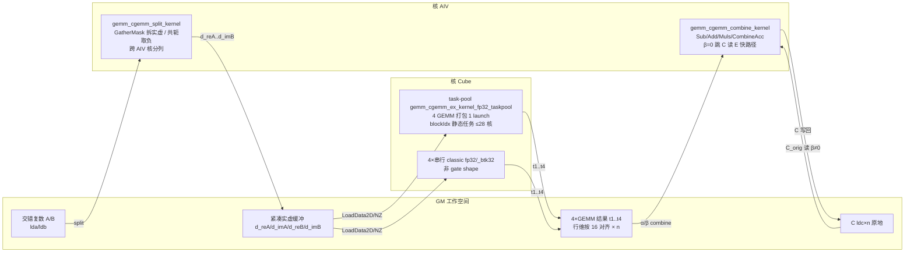

# aclblasCgemm 算子设计文档（Ascend 950PR / arch35）

# 一、需求背景

## 1.1 需求来源

通过昇腾社区任务完成开源仓算子贡献：在 Ascend 950PR（arch35）上用 Ascend C 开发单精度复数（complex64）通用矩阵乘算子 `aclblasCgemm`，对标 NVIDIA cuBLAS `cublasCgemm`，验收通过后合入昇腾算子开源仓 ops-blas（`blas/gemm/arch35/`，测试合入 `test/gemm/cgemm/arch35/`）。

## 1.2 背景介绍

### 1.2.1 aclblasCgemm 算子实现优化（定位 / 参考实现路径 / 现状）

**算子定位**：`aclblasCgemm` 是 ops-blas 库中的句柄式 BLAS Level-3 复数矩阵乘接口，签名与 ops-blas 仓 `include/cann_ops_blas.h` L402–405 既有声明逐参数一致（禁止定义 950PR 私有平行接口）。计算语义与 cuBLAS `cublasCgemm` / Netlib `cgemm` 对齐：

```
C = alpha * op(A) * op(B) + beta * C
```

其中 `alpha/beta` 为单精度复数标量，A/B/C 为单精度复数矩阵，列主序（Column-Major）存储；`op(A)` 为 m×k、`op(B)` 为 k×n、C 为 m×n。`transa/transb ∈ {ACLBLAS_OP_N, ACLBLAS_OP_T, ACLBLAS_OP_C}`，复数下 **T（仅转置）与 C（共轭转置）语义不同**，是正确性关键。

**参考实现路径（含文件名）**：

| 参考对象 | 路径 | 用途 |
|---|---|---|
| 接口标杆 cuBLAS | https://docs.nvidia.com/cuda/cublas/index.html（`cublasCgemm`，cublas-t-gemm） | 参数序列/语义对标 |
| 语义标杆 Netlib | https://www.netlib.org/blas/cgemm.f（`cgemm` 参考实现源码） | quick-return / C=beta*C 语义对照 |
| 接口声明 | ops-blas `include/cann_ops_blas.h`（`aclblasCgemm` 声明，L402–405） | 逐参数一致 |
| 复数类型 | ops-blas `include/cann_ops_blas_common.h`（`aclblasComplex`：实/虚各 float32） | 数据类型 |
| 开发框架 | ops-blas `blas/gemm/arch35/`（`gemm_host.cpp`/`gemm_kernel.cpp`/`gemm_kernel.h`/`gemm_tiling_data.h`） | 工程载体（上游 4 文件集） |

**现状与技术债（设计必须修正）**：仓内既有 Cgemm 参考实现将 A/B **从 Device 拷回 Host** 做实/虚拆分、再经 PCIe 拷回 Device 的 4 个实数缓冲区——该 D2H+H2D 往返在 1024³ 下约 1.3~3ms，超 413.52us 红线数倍。本设计将实/虚拆分下沉到**设备端 AIV kernel**，中间数据全留 Device GM，消除 Host 往返。Cube GEMM 用自研 classic BlockMmad kernel（fp32，融入 `gemm_kernel.cpp`），不依赖 Sgemm 的 te:: 路径（te:: 回退已移除）。需 asc-devkit ≥ 9.1（`ASC_DEVKIT_GE_9_1` 守卫编译）。

### 1.2.2 标杆算子现状分析

#### 1.2.2.1 标杆算子支持的数据类型和数据格式

对标基线 = cuBLAS `cublasCgemm`（语义参考 Netlib `cgemm`），与 ops-blas 仓信息一致：

| 参数 | 类型 | 数据格式 | 说明 |
|---|---|---|---|
| alpha/beta | cuComplex（单精度复数，实/虚各 float32） | Host 标量指针 | = ops-blas `aclblasComplex` |
| A/B/C | cuComplex | **列主序**（Column-Major），ND | A/B 只读，C 原地读写 |
| op(A)/op(B) | — | transa/transb ∈ {N, T, C}（C=共轭转置） | 9 种组合 |

本方 `aclblasCgemm` 与之一一对应：COMPLEX64（实/虚各 float32）、列主序、9 种 N/T/C 组合、`C = alpha·op(A)·op(B) + beta·C`、C 原地覆写。

#### 1.2.2.2 标杆算子实现描述

标杆 = Netlib `cgemm` 参考实现（`cgemm.f`）+ cuBLAS 语义。其核心流程与语义（本算子逐条对齐）：

1. **参数校验**：非法参数（负维度、非法 lda/ldb/ldc、空指针）返回错误（cuBLAS/ops-blas 状态码）。
2. **quick-return**：
   - `m==0` 或 `n==0`：合法 no-op，直接返回（不计算）；
   - `k==0` 或 `alpha==(0,0)`：跳过矩阵乘，执行 `C = beta*C`（beta=(0,0) 置零；beta=(1,0) 不变；其他逐元素复数缩放）；
   - `beta==(0,0)`：C 无需在调用前初始化。
3. **主计算**：对每列 j、每行 i 做 `C(i,j) = alpha·Σ_k A(i,k)·B(k,j) + beta·C(i,j)` 的复数乘加累加；复数下实/虚部分别累加。

本算子对照：校验路径、quick-return 三分支（memset/直接返回/AIV scale kernel）、主路径 4 实数 GEMM + combine 施加 α/β，语义与 `cgemm.f` 一致（详见 §3.2.2.3 差异说明——本算子对主计算做等效分解，边界/quick-return 逐条对齐）。

#### 1.2.2.3 标杆算子实现流程图

标杆（Netlib `cgemm` 参考 + cuBLAS 语义）流程：



---

# 二、需求分析

## 2.1 外部组件依赖

| 依赖 | 用途 | 说明 |
|---|---|---|
| CANN 9.1.0 + asc-devkit ≥ 9.1 | kernel 编译/运行环境 | arch35 Cube kernel 需 `ASC_DEVKIT_GE_9_1`（`ASC_DEVKIT_MAJOR ≥ 9 且 MINOR > 0`） |
| cblas（Netlib BLAS 复数实现 `cblas_cgemm`） | **精度 golden 生成（测试侧）** | 任务书 §3.1 明确"随测试工程提供，无其他三方软件依赖" |

算子本体运行无第三方依赖；golden 仅测试比对使用。

## 2.2 内部适配模块

| 模块 | 适配内容 |
|---|---|
| `include/cann_ops_blas.h` | 复用既有 `aclblasCgemm` 声明（L402–405），不新增/不私有化 |
| `include/cann_ops_blas_common.h` | 复用 `aclblasComplex`（COMPLEX64）、错误码枚举 |
| `blas/gemm/arch35/` | host `gemm_host.cpp` + kernel `gemm_kernel.cpp`（含 split/classic cube/task-pool/combine/scale kernel）+ `gemm_kernel.h` + `gemm_tiling_data.h`（`GemmTilingData`/`CgemmGemmExTilingData`）；与上游一致仅此 4 文件 |
| handle/stream 基础设施 | `_aclblas_handle`、EffectiveWorkspace、`GetAicCoreCount`/`GetAivCoreCount` |
| test 框架 | `test/gemm`（CsvDriven GTest + `test/frame` golden/fill/verify）；`test/gemm/cgemm/arch35/gemm_test.csv` |

## 2.3 需求模块设计

### 2.3.1 Ascend C 算子原型（与标杆对齐）

除任务书不要求适配的部分（非连续 Tensor、broadcast、dynamic shape 等，见 2.3.2）外，与标杆 `cublasCgemm` 逐参数对齐：

```cpp
aclblasStatus_t aclblasCgemm(
    aclblasHandle_t handle, aclblasOperation_t transa, aclblasOperation_t transb,
    int m, int n, int k, const aclblasComplex* alpha, const aclblasComplex* A, int lda,
    const aclblasComplex* B, int ldb, const aclblasComplex* beta, aclblasComplex* C, int ldc);
```

（handle 及参数顺序与 `cublasCgemm` 一一对应，无需额外映射说明。）

### 2.3.2 Ascend C 算子相关约束（与标杆相比缺失）

| 项 | 标杆（cuBLAS 复数 GEMM 家族） | 本算子 | 说明 |
|---|---|---|---|
| 数据类型 | cublasCgemm 仅单精度复数；cuBLAS 另有 double/half 复数接口 | **仅 COMPLEX64（单精度复数）** | 任务书范围仅 complex64 |
| 批处理/stride | cuBLAS 有 `cublasCgemmBatched`/`StridedBatched` | **不支持（单次 cgemm）** | 任务书不要求（task-pool 为单次调用内部 4-GEMM 打包，非 batched API） |
| 内存排布 | cuBLAS 列主序 | 仅列主序 ND，不支持超出 lda/ldb/ldc 语义的非连续访问 | 任务书 §2.5 不要求非连续 |
| 广播/dynamic shape | GEMM 无广播；shape 运行时入参 | 不涉及广播；无 dynamic shape | 与标杆一致 |
| Inf/NaN | 标准 IEEE 传播 | 不特判，IEEE 自然传播（不崩溃） | 对齐 |

---

# 三、需求详细设计

## 3.1 调用方式

**Kernel 直调**（任务书 §2.2）：`aclblasCgemm` 为句柄式 BLAS 接口，经 handle 绑定 stream，host 侧参数校验 + tiling 后以 `<<<blocks, nullptr, stream>>>` 直接调起自研 NPU kernel；非 ACLNN、非 PyTorch 框架路径。异步执行：host 不主动同步，读回 Device 结果前由上层 `aclrtSynchronizeStream` 保证。

## 3.2 需求总体设计

### 3.2.0 算法与数学公式（4-GEMM 分解）

复数矩阵乘分解为 4 个实数 FP32 GEMM。令

```
A = Ar + i·Ai    （op(A) = op(Ar) + i·op(Ai)，A^H 情形下 op(Ai) 取负）
B = Br + i·Bi    （op(B) = op(Br) + i·op(Bi)）
C = Cr + i·Ci
```

复数乘积 `op(A)·op(B)` 的实部/虚部为：

```
Re(AB) = op(Ar)·op(Br) − op(Ai)·op(Bi)
Im(AB) = op(Ar)·op(Bi) + op(Ai)·op(Br)
```

令 4 个实数 GEMM 输出为 t1…t4：

```
t1 = op(ReA) · op(ReB)
t2 = op(ImA) · op(ImB)
t3 = op(ReA) · op(ImB)
t4 = op(ImA) · op(ReB)
```

则 `AB_real = t1 − t2`、`AB_imag = t3 + t4`，最终输出：

```
C = alpha · (AB_real + i·AB_imag) + beta · C
  = (ar·AB_real − ai·AB_imag + br·Cr − bi·Ci)
    + i·(ar·AB_imag + ai·AB_real + br·Ci + bi·Cr)
```

**转置/共轭语义映射**：

| 复数操作 | Re 分量 | Im 分量 | Cube 转置标志 | 拆分 kernel 动作 |
|---|---|---|---|---|
| transa = N | op(Ar) = Ar | op(Ai) = Ai | isTransA = 0 | 原样拆出 |
| transa = T | op(Ar) = Arᵀ | op(Ai) = Aiᵀ | isTransA = 1 | 原样拆出（转置由 Cube 布局处理） |
| transa = C | op(Ar) = Arᵀ | op(Ai) = −Aiᵀ | isTransA = 1 | 拆出后 **虚部取负**（共轭） |

transb 同理。T 与 C 的唯一区别是拆分阶段对虚部取负；9 种组合共用同一套 t1…t4 + combine 流程。

> 选 4-GEMM 而非 3-GEMM（Karatsuba 型 `P3=(ReA+ImA)(ReB+ImB)`）：4-GEMM 每结果分量仅由 2 个实数 GEMM 相减/相加构成，为标准实数 GEMM 前向误差界；3-GEMM 的 `Im = P3 − P1 − P2` 有两次大数相消，误差放大，对 k 较大（测试集最大 k≈13363）时相对误差逼近 rtol=2⁻¹⁰ 红线，故不采用。

**本方数据类型**：alpha/beta/A/B/C 均 COMPLEX64（`aclblasComplex`，实/虚各 float32）；Cube 计算中间量 FP32（L0C FP32 累加）。**支持形状**：m/n/k 非负整数运行时入参（lda/ldb/ldc 满足任务书 §2.4 约束）；列主序 ND；m=0/n=0 为 no-op，k=0/alpha=(0,0) 走 `C=beta*C`。

### 3.2.1 host 侧设计

host 负责：参数校验 → quick-return 判定 → 工作空间规划 → 多核切分（tiling）→ kernel 调度。全部 kernel 挂 `handle->stream` 异步执行，host 不同步、不搬数。

**参数校验（错误码全路径，顺序固定）**：

```
handle == nullptr                       → ACLBLAS_STATUS_HANDLE_IS_NULLPTR
transa ∉ {N,T,C}                        → ACLBLAS_STATUS_INVALID_ENUM
transb ∉ {N,T,C}                        → ACLBLAS_STATUS_INVALID_ENUM
m < 0 || n < 0 || k < 0                 → ACLBLAS_STATUS_INVALID_VALUE
isTransA = (transa != N)；isTransB = (transb != N)
ldaMin = isTransA ? max(1,k) : max(1,m)； lda < ldaMin  → INVALID_VALUE
ldbMin = isTransB ? max(1,n) : max(1,k)； ldb < ldbMin  → INVALID_VALUE
ldc < max(1,m)                          → INVALID_VALUE
alpha == nullptr || beta == nullptr     → INVALID_VALUE
k>0：A/B == nullptr                     → INVALID_VALUE
C == nullptr                            → INVALID_VALUE（C 为输出，全路径须非空，对齐 cuBLAS）
```

校验通过后 `m==0 || n==0` 直接返回 SUCCESS（no-op，不启动 kernel；校验先于 no-op，对齐 Netlib validate-then-return）。

**quick-return 分支（k==0 或 alpha==(0,0)）→ C = beta*C，全部设备端原地**：

| beta | 处理 |
|---|---|
| (0,0) | `aclrtMemset` 将 C 的 `ldc×n` 个复数元素（`ldc*n*sizeof(aclblasComplex)` 字节）置零，位精确 |
| (1,0) | 直接返回 SUCCESS，C 不变（位精确） |
| 其他 | 启动 AIV `gemm_scale_kernel_fp32`（`isComplex=1`）逐元素复数乘，对齐参考 `cgemm` elementwise 语义 |

**工作空间规划（Device GM）**——4 个拆分输出 + 4 个 GEMM 结果：

| 缓冲 | 形状 | 字节数 |
|---|---|---|
| d_reA / d_imA | 紧凑，逻辑 m×k(N)/k×m(T,C)，前导维 `reLda`=m(N)/k(T,C) | `m*k*4` 各一份 |
| d_reB / d_imB | 紧凑，逻辑 k×n(N)/n×k(T,C)，前导维 `reLdb`=k(N)/n(T,C) | `k*n*4` 各一份 |
| d_t1…d_t4 | m×n，行维对齐 `GEMM_FRACTAL(=16)` | `CeilAlign(m,16)*n*4` 各一份 |

```
workspace = m*k*4 + m*k*4 + k*n*4 + k*n*4 + 4 * (CeilAlign(m,16)*n*4)
```

经 `CheckEffectiveWorkspaceSize` 校验由 handle EffectiveWorkspace 提供，不足返回 `ACLBLAS_STATUS_EXECUTION_FAILED`。A/B 实虚缓冲用**紧凑前导维**（`reLda/reLdb`），按 m·k 与 k·n 分别计大小，与 lda/ldb padding 解耦（非方形不复用同尺寸，避免越界覆盖 t 缓冲）。

#### 3.2.1.1 分核策略

cgemm 4 个实数 GEMM 由自研 classic BlockMmad cube kernel 承担，host 用 `CgemmGemmExTilingData` tiling：

- `CalcCgemmMultiCorePartition` 在 m×n tile 网格上枚举 `mb×nb ≤ cubeCoreNum` 组合，取**利用率最高**的 `mb×nb` 为 `mBlocks×nBlocks`，`usedCoreNum = mb*nb`；`CalcCgemmPerCoreWorkload` 对齐出 `singleCoreM/singleCoreN`。
- **跨 GEMM 任务池（默认）**：`LaunchCgemmGemmExTaskPoolKernel` 把 4 个同 shape fp32 GEMM 合成 `batchCount=4`，`totalTasks = 4×mBlocks×nBlocks` 用 blockIdx 静态任务循环分 ≤28 核（256³ 单 GEMM 仅 16/28 核 → 填核 652→**503us** ×1.29）。门控 `UseCgemmTaskPoolPath`：big-tile m,n≥128 且 %128==0（k 不限）；非 gate shape 或 env `ACLBLAS_CGEMM_TASKPOOL=0` 回退 4 次串行 classic。

#### 3.2.1.2 数据分块和内存优化策略

**tile 自适应**（`LaunchCgemmGemmExKernel` 按 shape 选基块）：

| 基块 | 启用条件 | 说明 |
|---|---|---|
| 32×8×16（小 tile） | 默认 | 全 shape（含小/非对齐）精度稳 |
| 32×32×128（大 tile BK32） | m、n **均 ≥128 且均为 128 倍数** | BK 16→32 使 kIdx 次数减半、标量分发减半（GEMM 311→**163us** ×1.91）；K 修 `curK` 尾后**非对齐 K 一并 BK32**（k%32 门控移除，LoadData2D k 维按运行时 `curK`）；BK16 大 tile 变体已移除 |

**内存容量核算（arch35）**：L1=32KB（A1/B1 半区 16KB）、L0A=4KB、L0B=16KB、CO1=16KB、L0C=256KB。

- B tile：BN128×BK32×4B = **16KB = L1 B1 半区整容**（BK64 → 32KB 超半区不可行）；L0B 16KB 容纳单 BK32 块。
- A tile：BM32×BK32×4B = 4KB = L0A 整容；L1 A 半区 16KB 双缓冲流水。
- 输出 C tile 经 Fixpipe 从 L0C 写回 GM（前导维 `tempLdc = CeilAlign(m,16)`）；L0C 256KB 可容 ≤16 个 32×32 fp32 输出块。
- AIV split/combine：UB 队列双缓冲 + `GatherMask` 向量化（每 256B repeat 持 32 复数对）；combine `COMBINE_TILE` 大块跨列。

**workspace 计算公式**见上（`m*k*4×2 + k*n*4×2 + 4×CeilAlign(m,16)*n*4`）。

**列主序适配**：host 在 tiling 阶段做 A↔B、M↔N、`reLda↔reLdb`、isTransA↔isTransB 的 swap（与 gemm_ex 约定一致），kernel 以转置视角执行，等价于计算 $C^T = op(B)^T·op(A)^T$。

**tiling 参数下发**：Cube 路径写 `CgemmGemmExTilingData`（m/n/k、lda/ldb/ldc、usedCoreNum/mBlocks/nBlocks/singleCoreM/singleCoreN、baseM/baseN/baseK/c0Size、isTransA/isTransB、batchCount）；AIV split/combine 用 `GemmTilingData`（含 reLda/reLdb、isConjA/isConjB、alphaReal/alphaImag/betaReal/betaImag、hasBeta）。

#### 3.2.1.3 tilingKey 规划策略

本算子**无编译期 tilingKey 分派**：cube kernel 由宏 `CGEMM_GEMM_CUBE_KERNEL`/`CGEMM_GEMM_TASKPOOL_KERNEL` 按 tile 几何（BM×BK×BN）实例化为离散 3 种（32×8×16 / 32×32×128 / task-pool），host 在运行时按 m/n shape + 核数**门控选择** kernel 实例（小 tile / 大 tile BK32 / task-pool 打包 / 4 串行），并把全部 tiling 参数随 `CgemmGemmExTilingData` **运行时下发**。即"shape 门控 + 运行时 tiling 下发"替代编译期 tilingKey，kernel 侧单一 `__global__` 入口读 tiling 结构体即可。

**kernel 调度顺序**（同一 stream 顺序提交，异步流水）：

```
1. gemm_cgemm_split_kernel      A/B（交错复数）→ d_reA/d_imA/d_reB/d_imB（共轭取负）
2a. [task-pool 默认] gemm_cgemm_ex_kernel_fp32_taskpool    4 GEMM（t1..t4）打包 1 次 launch，≤28 核
2b. [非 gate shape / ACLBLAS_CGEMM_TASKPOOL=0] gemm_cgemm_ex_kernel_fp32(_btk32) ×4 串行
3. gemm_cgemm_combine_kernel    C = alpha·(t1−t2, t3+t4) + beta·C（β=0 跳 C_orig 读）
```

Cube GEMM 以实际 `isTransA/isTransB` 语义执行（split 后实/虚缓冲为 BLAS 物理布局，转置由 Cube NZ 布局 + col-major swap 处理，9 组合统一路径）。

> 性能红线考量：全程无 D2H/H2D；split/combine 为 AIV、Cube 为 AIC，同一 stream 天然并行流水。256³ 已收敛（AIV split/combine 向量化 + BK32 + task-pool 填核 + E β=0 特化），整路径 ~**0.615ms**；剩余 Cube scalar 墙（LoadData/Mmad 每 kIdx 标量）受 L1=32KB 结构上限约束，无可用杠杆。

**异步与 stream**：依赖 `aclblasSetStream` 绑定；host 不主动同步，读回前 `aclrtSynchronizeStream` 由上层保证。

### 3.2.2 kernel 侧设计

总体：`Init`（按 blockIdx/taskId 划分核内 tile）→ `Process`（Split → 4×Cube（task-pool 打包或串行 classic）→ Combine → CopyOut）。kernel 族：split / classic cube（fp32/_btk32）/ task-pool cube / combine / scale。

#### 3.2.2.1 kernel 侧实现描述

**(1) AIV 拆分 kernel `gemm_cgemm_split_kernel`**：交错复数 → 实/虚 FP32 缓冲；T/C 下虚部取负（共轭）。A、B 独立，物理形状/前导维：

| 矩阵 | trans | 物理形状 | 读前导维 | 写前导维（紧凑） |
|---|---|---|---|---|
| A | N | m×k | lda | reLda=m |
| A | T/C | k×m | lda | reLda=k |
| B | N | k×n | ldb | reLdb=k |
| B | T/C | n×k | ldb | reLdb=n |

- 输出紧凑前导维、不保留 A/B padding；**不转置**（转置交给 Cube）。
- N 布局 + 紧凑前导维走 **tight 线性快路径**（整块连续流大块跨核）；否则按物理列分核、列内切块。
- 拆对 **`GatherMask` 向量化**（re/im 各一次 V-pipe），共轭 `Muls(im,-1)`。

```
for (col,row) tile 或 tight 线性块:                     # 每块 ≤ SPLIT_TILE 元素
    DataCopyPad(buf, gm[col*lda + row])                # 交错复数对（读按原前导维）
    GatherMask(re, buf, 1)   # 第 1 个 float（实部）
    GatherMask(im, buf, 2)   # 第 2 个 float（虚部）
    if conj: Muls(im, im, -1.0f)                       # OP_C 虚部取负
    DataCopyPad(gm_re[col*reLda + row], re)
    DataCopyPad(gm_im[col*reLda + row], im)
```

**(2) Cube GEMM kernel（自研 classic BlockMmad，`gemm_cgemm_ex_kernel_fp32` 系列 + task pool）**：由宏按 tile 几何实例化 `gemm_cgemm_ex_kernel_fp32`(32×8×16)、`_btk32`(32×32×128 大 tile 默认)、`_taskpool`(32×32×128 跨 GEMM 任务池)。单 GEMM 实例各算 t1…t4 之一；task-pool 一次 launch 内按 (batchIdx,mBlock,nBlock) 解码任务、一个 block 依次算完 4 个 GEMM 的对应块。

- 数据通路（单 tile）：GM→L1（`LoadData2D`，NZ 布局、C0=8）→ L0A/L0B（`LoadData` 按 kIdx 分块）→ `Mmad`（FP32，L0C 累加，首 kIdx init / 末 kIdx final）→ Fixpipe 写回 GM（`WriteCgemmFixpipeBlock`）。
- 尾块：m/n/k 非对齐按 `curM/curK/curN` 取实际尺寸（**K 修复**：LoadData2D k 维用运行时 `curK` 而非编译期 BASE_K，修 BK32 对非 32 倍数 K 装载 bug；task-pool 与 classic 共用同一套 curK 逻辑）。
- a/b 映射：列主序 swap 后 kernel a 槽=几何 B、b 槽=几何 A；task-pool host 传 `(d_reB,d_imB,d_reA,d_imA)`，kernel 按 gemmIdx 在 {ReB,ImB}×{ReA,ImA} 切换得 t1..t4（g0:ReB·ReA→t1, g1:ImB·ImA→t2, g2:ImB·ReA→t3, g3:ReB·ImA→t4）。

**(3) AIV 合并 kernel `gemm_cgemm_combine_kernel`**：读 t1…t4（行维 `tempLdc=CeilAlign(m,16)`）与 C_orig（交错复数）：

```
ab_r = t1 − t2 ;  ab_i = t3 + t4
out_r = ar·ab_r − ai·ab_i + br·c_r − bi·c_i
out_i = ar·ab_i + ai·ab_r + br·c_i + bi·c_r
```

- **E 快路径**：`beta==(0,0)` 跳 C_orig 读 + 2 GatherMask + 4 β CombineAcc（`hasC` 门控），combine 78.7→**56.5us**。**α 运算恒保留**（含 `ai_·ab_i` −0 交叉项）——A=EXTREME/INF 使 `d2=t3+t4` 溢出 Inf 时，−0·Inf 交叉项是 IEEE NaN 传播承重项，删除会改 NaN 传播致 TC_FL_337/338 回归（曾实测 1024/2048，故回退为仅 β=0 跳 C 安全版）。
- 向量化：`tempLdc==ldc==m` 走 tight 跨列快路径（COMBINE_TILE 大块），否则逐列切块；VECOUT 队列 `Sub/Add/Muls/CombineAcc/Interleave`，尾元素标量，序列与旧标量循环一致 → **bit-identical**。

**(4) quick-return AIV scale kernel `gemm_scale_kernel_fp32`**（复用，`isComplex=1`）：`C=beta*C` 原地，`out_r=br·in_r−bi·in_i`、`out_i=br·in_i+bi·in_r`；仅 beta 非 (0,0)/(1,0) 时启动。

**误差控制小结**：仅实数乘加 + 2 次加减组合；L0C FP32 累加使 k 维长累加误差上界 ~ γ_k = k·u/(1−k·u)（u=2⁻²⁴），最坏相对误差 ≈ γ_k + O(2u) + |α/β| 组合误差；测试集最大 k≈13363：γ_k≈8e-4 < rtol=9.77e-4（margin ~1.2×）。t1−t2 相消属 FP32 GEMM 固有，非实现缺陷。

#### 3.2.2.2 Ascend C 实现流程图



> 说明：主路径为 split → **task-pool（1 launch 算完 4 GEMM）**→ combine，同一 stream 顺序流水；非 gate shape 或 env 回退走 4×串行 classic 分支。全程无 D2H/H2D。

#### 3.2.2.3 Ascend C 实现流程图与标杆流程图的差异点和原因

| # | 差异点 | 原因 |
|---|---|---|
| 1 | **主计算用 4 实数 GEMM 分解**（split→t1..t4→combine），标杆 Netlib 直接按复数乘加 | Cube 单元无原生复数矩阵乘，必须分解为实数 GEMM；4-GEMM 保标准误差界（见 3.2.0 论证） |
| 2 | **实/虚拆分在设备端 AIV kernel**，标杆在通用循环内直接访问复元素 | 消除 D2H/H2D 往返（仓内历史实现技术债，见 1.2.1）；拆后 4 个实数 GEMM 可由 Cube 高效执行 |
| 3 | **α/β 由独立 AIV combine kernel 施加**（含 E β=0 跳 C 快路径），标杆在每元素乘加内联 α/β | combine 聚合 t1..t4 差异（t1−t2, t3+t4）并写回 C，一次 AIV 遍历完成；β=0 跳 C 读对齐 cuBLAS"β=0 时 C 无需初始化" |
| 4 | **4 GEMM 打包一次 launch（task-pool）填 ≤28 核** | 256³ 单 GEMM 仅 16/28 核 → 打包填核 ~×1.29；性能实现差异，结果逐位不变 |
| 5 | 边界/quick-return（m/n=0、k=0/α=0→C=βC、β=0 免初始化、错误码）**与标杆逐条一致** | 无差异——1.2.2.2 / 3.2.1 显式对齐 cgemm.f 语义 |
| 6 | 转置/共轭：T 由 Cube NZ 布局 + col-major swap 处理，C 额外在 split 虚部取负 | 复数下 T 与 C 语义不同（任务书 §2.1）；拆分阶段取负 + Cube 布局统一 9 组合 |

### 3.3 支持硬件

| 支持的芯片版本 | 涉及勾选 |
| --- | --- |
| Ascend 950PR（arch35，Ascend V350） | √ |

> 环境：CANN 9.1.0；Cube kernel 依赖 asc-devkit ≥ 9.1（`ASC_DEVKIT_GE_9_1` 守卫编译）。

### 3.4 算子约束限制

1. 仅支持 COMPLEX64（`aclblasComplex`，实/虚各 float32）；实数分量按 FP32 计算。
2. 仅列主序 ND；不涉及广播；不要求非连续 Tensor。
3. m/n/k 为非负整数运行时入参；m=0 或 n=0 为 no-op；k=0 或 alpha=(0,0) 执行 `C=beta*C`（alpha=0 位精确）。
4. C 原地覆写，不返回视图。
5. 异步执行：依赖 handle 绑定 stream；读回前须同步。
6. 确定性不要求（非 bit-exact；alpha=(0,0) 除外）。
7. Inf/NaN 不特判，IEEE FP32 自然传播，不崩溃、对齐 cuBLAS。

---

# 四、特性交叉分析

**不涉及**：本算子为单 BLAS Level-3 接口（`aclblasCgemm`），无多算子/多特性交叉耦合；复数分解的 4 实数 GEMM、AIV split/combine、Cube task-pool 均为该算子内部实现细节，不与其他算子共享状态。唯一与仓内共享的是复用既有 FP32 Sgemm 基础设施（`gemm_kernel_fp32`/`CalGemmTilingData`/`GemmTilingData`），且本算子自研 classic kernel 与之并行共存、互不影响（见 §5.2 兼容性）。

---

# 五、可维可测分析

## 5.1 精度规格/性能标准

| 验收标准 | 描述 | 标准来源 |
|---|---|---|
| 精度标准 | COMPLEX64 实/虚部分别按 FLOAT32 判定：rtol=2⁻¹⁰（9.77e-4）、atol=2⁻¹⁶（1.53e-5）、matched_ratio≥0.99、max_abs_error≤1e-2 或 32×ULP；逐元素满足 `|actual−golden| ≤ atol + rtol·|golden|`；golden 由 cblas（Netlib `cblas_cgemm`）生成，全矩阵比对 | 任务书 §3.2 + 生态算子开源精度标准 |
| 性能标准 | warmup + 有效采样 >50 次取平均（Avg time, us）；case 256/512/1024（NN, alpha=(1,0), beta=(0,0)）≤ 36.25 / 68.29 / 413.52；TC_PF 全量由 `verify_performance.py` 关联 `gpu_baseline.csv` | 任务书 §3.3 |

**内存占用**：任务书 §3.4 标注"不涉及"；Device workspace 见 §3.2.1 公式（`m*k*4×2 + k*n*4×2 + 4×CeilAlign(m,16)*n*4`），自测报告据此填报。

## 5.2 兼容性分析

1. **接口兼容**：复用 `include/cann_ops_blas.h` L402–405 既有声明，参数序列与 `cublasCgemm` 一一对应，多产品线共用，不定义 950PR 私有平行接口；类型复用 `cann_ops_blas_common.h` 的 `aclblasComplex`。
2. **仓内兼容**：cgemm 用自研 classic BlockMmad cube kernel（含 task pool）+ AIV split/combine/scale，与上游一致融入 `blas/gemm/arch35/` 四文件（未新增文件）；不影响既有 Sgemm 路径（`gemm_kernel_fp32`/`CalGemmTilingData` 仍供 Sgemm 用）。
3. **测试兼容**：测试代码合入 `test/gemm/cgemm/arch35/`（含 CSV）；1200 条用例列格式与仓内 `test/gemm/gemm_param.h` 解析严格对齐；`verify_accuracy.py` 自动排除 TC_PF、`verify_performance.py` 关联 `gpu_baseline.csv`。
4. **可测性**：9 转置组合覆盖 T/C 区分；L6 边界覆盖 handle_null/空指针/非法枚举/非法前导维/负维度；L5 填充覆盖 Inf/NaN；TC_PF 覆盖性能标杆；alpha=(0,0) EXACT 用例校验位精确分支；回归工具链 `test_cases/verify_regression.sh`（分层 smoke/full + 基线 diff）。

## 5.3 风险与缓解（设计层面）

| 风险 | 影响 | 等级 | 缓解 |
|---|---|---|---|
| 256³ 性能红线 36.25us（4M 架构） | 性能 FAIL | 高 | 已 A/B 收敛：AIV split/combine 向量化 + BK32（311→163us ×1.91）+ task-pool 填核（652→503us ×1.29）+ E（combine 78.7→56.5us），整路径 ~**0.615ms**；剩余 Cube scalar 墙（LoadData/Mmad 每 kIdx 标量）受 L1=32KB 结构上限约束，②③⑥ 已 A/B 证伪 → **结构性不可达** |
| host 侧往返历史实现超红线 | 性能 FAIL | 高 | 拆分下沉设备端，消除 D2H/H2D（见 §1.2.1） |
| t1−t2 相消放大相对误差 | 精度（大 k 边缘） | 中 | 4-GEMM 标准误差界 + L0C FP32 累加 + 全量回归 52 FAIL=基线零回归 |
| C=beta*C 位精确（EXACT） | 精度 FAIL | 低 | beta (0,0)/(1,0) 走 memset/no-op 天然位精确；通用 beta 走 scale kernel 满足 FP32 阈值即可 |
| 非方形/前导维 padding workspace 越界 | 内存错误 | 低 | A/B 实虚缓冲按 m·k/k·n 分别计算 + 紧凑前导维，与 lda/ldb padding 解耦 |
| 性能标杆口径歧义（2048 附加 case） | 验收口径 | 低 | 以任务书 3 条为硬性门槛（R7），与验收方确认 |

---

**附：设计文档自查（对照任务方 CheckList）**

| CheckList 节 | 本文档位置 | 状态 |
|---|---|---|
| PR：提交位置/标题/CLA+构建 | —（PR 流程项） | ⏳ 待 PR 时执行：标题【社区任务】aclblasCgemm算子设计文档 |
| 1.1 需求来源 | §1.1 | ✓ |
| 1.2.1 实现优化（参考路径含文件名） | §1.2.1（表格） | ✓ |
| 1.2.2.1 标杆数据类型/格式 | §1.2.2.1 | ✓ |
| 1.2.2.2 标杆实现描述 | §1.2.2.2 | ✓ |
| 1.2.2.3 标杆流程图 | §1.2.2.3 | ✓ |
| 2.1 外部组件依赖 | §2.1 | ✓ |
| 2.2 内部适配模块 | §2.2 | ✓ |
| 2.3.1 算子原型 | §2.3.1 | ✓ |
| 2.3.1 相关约束（与标杆缺失） | §2.3.2 | ✓ |
| 3.1 调用方式 | §3.1 | ✓ |
| 3.2.1.1 分核策略 | §3.2.1.1 | ✓ |
| 3.2.1.2 数据分块和内存优化（含公式） | §3.2.1.2 | ✓ |
| 3.2.1.3 tilingKey 规划 | §3.2.1.3 | ✓ |
| 3.2.2.1 kernel 实现描述 | §3.2.2.1 | ✓ |
| 3.2.2.2 Ascend C 实现流程图 | §3.2.2.2 | ✓ |
| 3.2.2.3 与标杆差异点和原因 | §3.2.2.3 | ✓ |
| 3.3 支持硬件 | §3.3 | ✓ |
| 3.4 算子约束限制 | §3.4 | ✓ |
| 四 特性交叉分析 | §四 | ✓（不涉及） |
| 5.1 精度/性能标准 | §5.1 | ✓ |
| 5.2 兼容性分析 | §5.2 | ✓ |
