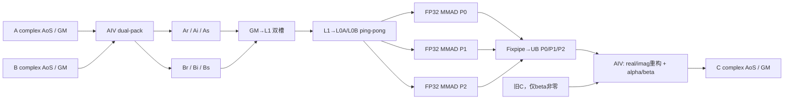
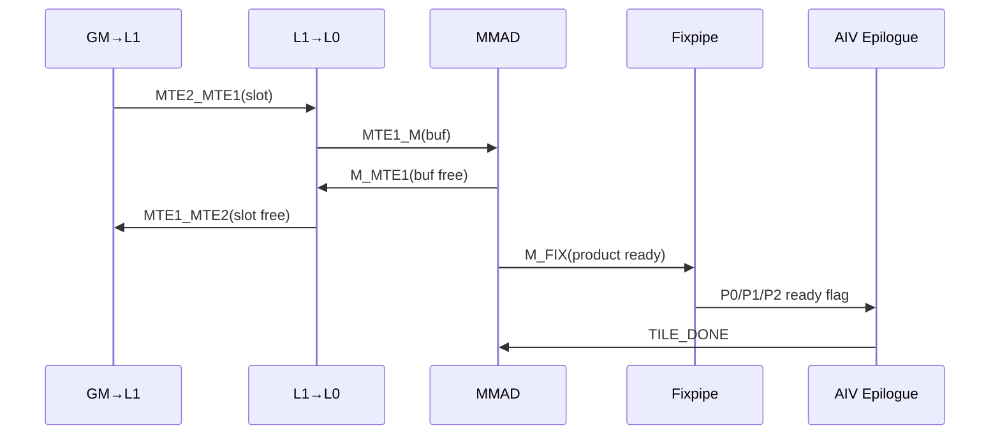

# 需求背景（required）

## 需求来源

本需求来源于 CANN 社区任务 2026 的 Ascend 950PR `aclblasCgemm` 算子开发任务。任务要求基于 `cann/ops-blas` 工程，在 `blas/gemm/arch35/` 目录使用 Ascend C kernel 直调方式实现单精度复数通用矩阵乘，并沿用 `include/cann_ops_blas.h` 中已有的公共接口：

```cpp
aclblasStatus_t aclblasCgemm(
    aclblasHandle_t handle,
    aclblasOperation_t transa,
    aclblasOperation_t transb,
    int m,
    int n,
    int k,
    const aclblasComplex* alpha,
    const aclblasComplex* A,
    int lda,
    const aclblasComplex* B,
    int ldb,
    const aclblasComplex* beta,
    aclblasComplex* C,
    int ldc);
```

适配环境为 Ascend 950PR、CANN 9.1.0、asc-devkit 9.1 及以上。算子语义对齐 cuBLAS `cublasCgemm`，边界行为参考 Netlib `cgemm`。

本文档按照 CANN 社区任务算子设计文档模板编写。实现文件为：

- `blas/gemm/arch35/cgemm_950_host.cpp`：参数校验、路径选择、工作区规划、分核和 Kernel 直调；
- `blas/gemm/arch35/cgemm_950_kernel.cpp`：设备端复数拆包、FP32 Cube 计算、Fixpipe 和复数后处理；
- `blas/gemm/arch35/cgemm_950_kernel.h`：Kernel 调用声明；
- `blas/gemm/arch35/cgemm_950_tiling_data.h`：Host 与 Kernel 之间的 POD tiling 数据结构。

## 背景介绍

### aclblasCgemm 算子功能

`aclblasCgemm` 计算列主序单精度复数矩阵乘：

$$
C \leftarrow \alpha\,op(A)op(B)+\beta C
$$

其中：

- $op(A)\in\{A,A^T,A^H\}$，逻辑形状为 $m\times k$；
- $op(B)\in\{B,B^T,B^H\}$，逻辑形状为 $k\times n$；
- $C$ 的逻辑形状为 $m\times n$；
- `N` 表示不转置，`T` 表示转置，`C` 表示共轭转置；
- `aclblasComplex` 由两个 `float32` 分量组成，物理存储为 AoS：`[real, imag]`。

### 任务要求与现有能力分析

| 参数 | 参数含义 | 类型 | 支持范围 | 关键约束 |
| --- | --- | --- | --- | --- |
| handle | BLAS 上下文及 stream | Host scalar | 有效 `aclblasHandle_t` | 不可为空 |
| transa/transb | A/B 操作类型 | enum | N/T/C | 其他值返回 `INVALID_ENUM` |
| m/n/k | 逻辑矩阵维度 | int32 | 非负运行时值 | m=0 或 n=0 合法 no-op |
| alpha/beta | 复数缩放系数 | COMPLEX64 scalar | float32 全集 | 指针不可为空 |
| A/B | 输入矩阵 | COMPLEX64 tensor | 列主序 | 支持合法 lda/ldb padding |
| C | 输入输出矩阵 | COMPLEX64 tensor | 列主序 | 原地覆盖，支持合法 ldc padding |

传统复数 GEMM 可拆成四次实数 GEMM：

$$
\begin{aligned}
C_r &= A_rB_r-A_iB_i \\
C_i &= A_rB_i+A_iB_r
\end{aligned}
$$

该方法语义直接但需要四组 FP32 Cube 乘加以及四张中间输出。早期 2M 展开路径虽然减少 Kernel 数，但两个实数 GEMM 的输出宽度为 $2m$，实际实数 FMA 仍为 $4mnk$。本实现的主性能路径采用 Gauss complex-3M，把 Cube 主体降低为三次实数 GEMM：

$$
\begin{aligned}
P_0 &= A_rB_r \\
P_1 &= A_iB_i \\
P_2 &= (A_r+A_i)(B_r+B_i) \\
C_r &= P_0-P_1 \\
C_i &= P_2-P_0-P_1
\end{aligned}
$$

与 4M/2M 相比，3M 将实数矩阵乘主体从 $4mnk$ 降到 $3mnk$，理论上减少 25% Cube 乘加；代价是增加 A/B 和式、第三平面打包以及后处理加减。因此性能设计的重点不只是算法次数，还包括 AoS 拆包、GM 工作区读写、L1/L0 流水和不同尺寸下的 AIC 波次利用率。

# 需求分析

## 需求描述

在 Ascend 950PR 上使用 Ascend C 实现功能完整、异步执行、精度满足 COMPLEX64 标准且在官方性能用例上达到目标的 `aclblasCgemm`。实现需要满足以下目标：

1. 公共 API 签名、状态码、列主序和 N/T/C 语义与任务书一致；
2. 覆盖一般复数 `alpha`、`beta`、leading dimension padding、非对齐尺寸、空矩阵和特殊浮点值；
3. 所有实数 GEMM 使用原生 FP32 MMAD，不使用 HF32/TF32 降精度模式；
4. 通过 handle 绑定的 stream 异步启动，不在正常计算路径执行 D2H/H2D 或 Host 侧归约；
5. 以官方 1000 条精度用例和 200 条性能用例作为完整测试集合；
6. 对性能候选的工作区、tiling 或设备执行错误直接返回失败，不以低效 4M 路径掩盖性能路径缺陷。

## 需求拆解

1. **接口与参数处理**
   - 校验 handle、操作枚举、维度、指针和 lda/ldb/ldc；
   - 实现 `m=0`、`n=0`、`k=0`、`alpha=0` 的 quick return/scale 语义；
   - 保证 `beta=0` 时不读取旧 C。
2. **全布局支持**
   - 覆盖 transA×transB 的 9 种组合；
   - T 只转置，C 在转置基础上对虚部取反；
   - 将列主序 AoS 输入转换成 Cube 适合的 FP32 平面和 ND/DN 视图。
3. **高效复数算法**
   - 性能主路径使用 true FP32 complex-3M；
   - 通用标量和小尺寸保留功能完整的 3M/4M 路径；
   - 禁止使用 HF32 换取速度。
4. **数据移动优化**
   - 合并多列 AoS 的 GM→UB 搬运；
   - 在 UB 内批量拆分 real/imag/sum；
   - A/B 双路 pack 共用一次 AIV-only launch；
   - 大矩阵仅沿 K 分片，避免 M/N panel 引起重复打包。
5. **Cube 流水优化**
   - 使用 128×128、96×128、64×128 三类 tile；
   - L1 双槽预取、L0A/L0B ping-pong；
   - P0/P1/P2 顺序复用单个 L0C；
   - Fixpipe 直接输出到各自 UB 平面，不写三张 GM 中间结果。
6. **并行与调度优化**
   - 使用 MIX `1 AIC : 2 AIV`；
   - 二维 tile grid-stride 分核；
   - Host 根据 AIC 波次数选择 64/96/128 行 tile，避免小矩阵宽 tile 欠占用。
7. **精度与性能验证**
   - 先执行定向 identity/历史风险用例，再执行 1000 条精度硬门禁；
   - 精度通过后使用 ACL Event 测量 200 条性能用例；
   - 使用 phase profile 区分 launch、pack、Cube+Fixpipe、epilogue。

# 详细设计（required）

## 算子分析

### 数学公式

设：

$$
A=A_r+iA_i,\quad B=B_r+iB_i,\quad C=C_r+iC_i
$$

主路径使用三乘法公式：

$$
\begin{aligned}
P_0 &= op(B_r)^{T}\,op(A_r)^{T} \\
P_1 &= op(B_i)^{T}\,op(A_i)^{T} \\
P_2 &= op(B_r+B_i)^{T}\,op(A_r+A_i)^{T}
\end{aligned}
$$

由于输出按 $C^T$ 的行主序视图计算，其物理顺序与原列主序 C 完全一致，无需额外输出转置。后处理为：

$$
\begin{aligned}
R &= P_0-P_1 \\
I &= P_2-(P_0+P_1) \\
Z &= \alpha(R+iI)+\beta C
\end{aligned}
$$

宽块性能路径只在任务性能标量 `alpha=(1,0)`、`beta=(0,0)` 下启用。若 K 被切成多个不相交 slab，则第 0 个 slab 覆盖 C，后续 slab按同一 stream 顺序执行并计算：

$$
C \leftarrow C + Z_{slab}
$$

从而不需要 atomic、不需要额外 GM reduction buffer，也不会并行改变同一 K slab 内的 FP32 MMAD 归约顺序。一般复数 alpha/beta 由完整 3M 或通用 4M 后处理一次完成。

### 计算量分析

| 方案 | 实数 GEMM 主体 | GM 中间输出 | 适用范围 |
| --- | ---: | ---: | --- |
| 通用 4M | $4mnk$ 个实数 FMA | 4 张实数输出 | 完整功能保底与诊断 |
| 展开 2M | 两个 $n\times k$ 乘 $k\times 2m$，等价 $4mnk$ | 可融合到 UB | 已验证的历史快速路径 |
| true 3M | $3mnk$ 个实数 FMA | 0，P0/P1/P2 落 UB | 当前主性能路径 |

按常用 complex GEMM 有效工作量 $8mnk$ FLOP 统计，任务书三条典型目标分别约为 23.14、98.23、129.84 effective TFLOPS。该口径用于与复杂数标杆比较，不等同于芯片 FP32 实数峰值口径。

### 支持数据类型

| 对象 | 数据类型 | 计算模式 |
| --- | --- | --- |
| A/B/C | COMPLEX64 | AoS，每元素 2×float32 |
| alpha/beta | COMPLEX64 | Host 复数标量 |
| Pack 平面 | float32 | real、imag、real+imag |
| Cube 输入/累加/输出 | float32 | 原生 FP32 MMAD、FP32 L0C、FP32 Fixpipe |


### 支持形状

- m、n、k 为运行时整数，合法范围为非负；
- 支持方阵和非方阵、2 的幂、质数及非对齐尺寸；
- 支持合法 lda/ldb/ldc padding；
- 支持 N/T/C 九种布局组合；
- m=0 或 n=0 时直接成功返回；
- k=0 或 alpha=0 时执行 `C=beta*C`；
- 不涉及广播；
- 不支持超出 BLAS leading-dimension 语义的任意 stride/view。

## 算子实现

### 实现方案

整体数据流如下：



#### 3.2.1 host侧设计：

##### 1. 参数校验与 quick return

`ValidateCgemm` 在任何 Kernel 启动前完成：

1. handle 为空返回 `ACLBLAS_STATUS_HANDLE_IS_NULLPTR`；
2. transa/transb 不在 N/T/C 中返回 `ACLBLAS_STATUS_INVALID_ENUM`；
3. m/n/k 为负、leading dimension 不满足约束或必需指针为空时返回 `ACLBLAS_STATUS_INVALID_VALUE`；
4. m=0 或 n=0 直接返回成功；
5. k=0 或 alpha=(0,0) 调用 AIV scale Kernel：beta=0 置零，beta=1 不启动计算，其他 beta 原地缩放 C。

配置只在进程首次调用时通过函数局部静态对象读取一次，避免 `getenv` 和字符串解析进入性能循环。

##### 2. 路径选择

`fused3m` 性能模式满足 `m≥16、n≥16、k≥8、m×n>4096` 时进入 true-3M 调度：

1. 将 M 向上对齐到 32、N 向上对齐到 16、K 向上对齐到 8；
2. 计算 legacy64、wide96、wide128 的输出 tile 数和 AIC 波次数；
3. 宽 tile 只有在关键 MMAD wave 工作量不超过 legacy64 的 110% 时才被选择；
4. wide128 优先，其次 wide96，否则 legacy64；
5. wide96/wide128 还要求 alpha=(1,0)、beta=(0,0)；一般标量走完整 legacy3M；
6. 显式选择 fused3m 后，如果工作区或 tiling 失败，直接返回 `EXECUTION_FAILED`，不转入 4M 慢路径隐藏问题。

波次代价模型为：

$$
wave(tile)=\left\lceil\frac{\lceil n/B_M\rceil\lceil m/128\rceil}{N_{AIC}}\right\rceil B_M
$$

其中 $B_M\in\{64,96,128\}$。例如 512³ 在 64×128 下可用 32 个 tile 填满一波；改成 128 或 96 会只产生 16/24 个 tile，因此 Host 保留 legacy64，避免宽块造成 2 倍/1.5 倍单波次退化。

##### 3. K-panel 工作区策略

宽块路径保持完整 M/N，仅沿 K 分片。对当前 K slab：

$$
Workspace = 3\cdot M_pK_p\cdot4 + Align + 3\cdot N_pK_p\cdot4
$$

其中三张 A 平面为 Ar/Ai/As，三张 B 平面为 Br/Bi/Bs，As=Ar+Ai、Bs=Br+Bi。A 区和 B 区之间按 512 Byte 对齐。

`ChooseTrue3mKPanel` 先尝试完整 K；若超过调用者工作区，则按：

$$
K_{panel}\le\frac{WorkspaceBytes}{3\cdot4\cdot(M_p+N_p)}
$$

估算，并向下取 64 的整数倍，再用精确对齐公式复核。该策略使每个逻辑 A/B 元素在一次 API 调用中只 pack 一次，避免旧 M/N panel 策略对同一 B 重复打包。

##### 4. A/B 双路 Pack 分核

Host 按两侧工作量：

$$
W_A=dstCols_A\cdot dstLd_A,\quad
W_B=dstCols_B\cdot dstLd_B
$$

比例分配 AIV 核，并保证 A/B 至少各分配 1 个核、核数不超过各自列数。A 和 B 使用一次 `cgemm_dual_pack_kernel` 启动，两个不重叠核区分别处理 A/B，减少串行 launch。

##### 5. N/T/C 地址与布局

K slab 的源地址按实际列主序物理布局计算：

| 输入 | N 地址偏移 | T/C 地址偏移 | Pack 后 Cube GM 视图 |
| --- | --- | --- | --- |
| A | `kOffset*lda` | `kOffset` | ND 或 DN |
| B | `kOffset` | `kOffset*ldb` | ND 或 DN |

当操作类型为 C 时，pack 阶段对虚部取反，然后再生成 sum 平面。这样 T/C 共用同一 Cube 主体，不需要输出转置 Kernel。

##### 6. 分核策略

宽块输出任务数：

$$
tasks=\left\lceil\frac{n}{B_M}\right\rceil
      \left\lceil\frac{m}{128}\right\rceil
$$

逻辑 MIX 核数：

$$
usedCoreNum=\min(N_{AIC},\lfloor N_{AIV}/2\rfloor,tasks)
$$

Kernel 内以 grid-stride 方式分配二维 tile：`task = logicCore + q*usedCoreNum`，避免 Host 维护每核数组，也能让非整除任务自然均衡。

##### 7. tiling 数据设计

`Cgemm3mTilingData` 为按值传入 Kernel 的 POD，主要字段如下：

| 字段 | 含义 |
| --- | --- |
| m/n/k | 当前逻辑维度；K-panel 时 k 为当前 paddedK |
| paddedM/N/K | Cube 物理对齐维度 |
| ldc | C 的列主序 leading dimension |
| usedCoreNum | 实际 MIX 逻辑核数 |
| hasBeta | 是否读取并累加旧 C；后续 K slab 为 1 |
| leftTransposed/rightTransposed | B/A 平面在 GM 中采用 ND 或 DN 视图 |
| profileStage | full、pack、Cube 或 launch-only 性能分段 |
| tileMode | 0=64×128，1=128×128，2=96×128 |
| aImagOffset/aSumOffset | A 三平面相对偏移 |
| bImagOffset/bSumOffset | B 三平面相对偏移 |
| alpha/beta | legacy3M 的一般复数后处理参数 |

本工程使用 Kernel 直调，不依赖传统算子框架的 tiling key 注册。`tileMode`、转置标志和 `profileStage` 承担等价的编译变体/运行时分派作用；实际宽块类型由模板实例在入口处静态选择，核心循环中不进行每元素分支。

##### 8. 数据检测

- Host 在 launch 前精确检查工作区高水位；
- Kernel 通过 `static_assert` 检查 UB/L1/L0A/L0B/L0C 容量；
- 诊断模式可检查 pack 平面和四组实数乘积，但包含同步和 D2H，只用于定位问题，不进入正常路径和性能测试；
- 性能路径标签和环境配置写入 benchmark CSV，禁止不同配置断点续写到同一结果文件。

#### 3.2.2 kernel侧设计：

##### 1. Pack Kernel

Pack 负责把 complex AoS 转成三张 FP32 平面并完成 padding：

```text
[r0,i0,r1,i1,...] -> real=[r0,r1,...]
                       imag=[i0,i1,...]
                       sum =[r0+i0,r1+i1,...]
```

主要优化如下：

1. 使用二维 `DataCopyPad` 一次收集多个物理列；
2. 每列 UB 槽按 32 complex 对齐，显式处理非 32 Byte 源块在 UB 的 padding，避免把物理槽误认为紧凑数组；
3. 使用 retained-output `GatherMask` 批量拆分 real/imag；
4. 4096 complex 批次各用一次 real/imag Gather，repeat=128；8192 批次显式拆成两个 4096，避免 `uint8_t repeat` 溢出；
5. 使用向量 Add 生成 sum 平面；
6. 三张平面以二维写回 GM，padding 区预先清零，保证 K/M/N 尾块不会读取未定义值。

##### 2. Cube Kernel

`cgemm_true3m_kernel` 使用 `__mix__(1,2)`。AIC 与两个 AIV 的逻辑核号通过 `AIV blockIdx/2` 对齐。

每个输出 tile 执行三个 product：

- pair0：Br × Ar，得到 P0；
- pair1：Bi × Ai，得到 P1；
- pair2：Bs × As，得到 P2。

每个 product 内 K 以 64 为 micro tile：

1. GM→L1 使用两个 slot；
2. 消费当前 slot 时提前装载下一个 K chunk；
3. L1→L0A/L0B 使用两个 32 KiB 地址槽 ping-pong；
4. 第一个 K chunk 设置 `cmatrixInitVal=true`，后续 chunk 在同一 L0C 累加；
5. product 完整归约后 Fixpipe 到独立 UB 平面；
6. P0/P1/P2 顺序复用同一个 L0C，避免同时占用三份累加器。

同步关系如下：



##### 3. AIV Epilogue

两个 AIV 各处理输出 tile 的一半 M 列。P0/P1 到达后先计算：

```text
sum  = P0 + P1
real = P0 - P1
imag = P2 - sum
```

随后将 real/imag 合并为 AoS 并通过 MTE3 写回 C 的有效矩形。对于后续 K slab，P2 和 sum 在完成 imag 后已经失效，Kernel 复用这两块 UB 读取旧 C 并执行原位累加，因此不增加 UB 高水位和 GM reduction buffer。尾块只写有效行列，padding 不写入用户 C。

##### 4. 片上资源规划

| Kernel | UB | L1 | L0A | L0B | L0C | 说明 |
| --- | ---: | ---: | ---: | ---: | ---: | --- |
| wide128×128 | 192 KiB | 128 KiB | 64 KiB | 64 KiB | 64 KiB | P0/P1/P2/sum/AoS=32/32/32/32/64 KiB |
| wide96×128 | 144 KiB | 112 KiB | 56 KiB | 64 KiB | 48 KiB | 用于补偿 AIC 波次数 |
| legacy64×128 | 160 KiB | ≤400 KiB | ≤48 KiB | 64 KiB | 96 KiB | 三份 L0C 的精度已验证路径 |

wide128 的 UB 恰好使用 192 KiB，因此所有区域使用编译期固定偏移并通过静态断言约束，禁止再隐式增加临时张量。L1/L0 的双槽用于流水重叠，不表示同一 product 的数据复制两份到 GM。

##### 5. 数据移动收益

相对旧的 M/N panel + 64×128 true-3M 规划，针对官方 200 条性能形状的静态重放结果为：

| 指标 | 变化 |
| --- | ---: |
| Kernel launch 总数 | 5048 → 1214，减少 76.0% |
| Pack GM 读取 | 减少 65.8% |
| Pack GM 写入 | 减少 65.7% |
| Cube GM→L1 | 减少 35.9% |
| 路由分布 | wide128 131 条、wide96 14 条、legacy64 55 条 |

这些数值来自与 Host 路由一致的静态数据流审计，用于证明重构确实减少搬运和启动；它们不是设备性能验收结论。

## 支持硬件

| 支持的芯片版本 | 涉及勾选 |
| --- | --- |
| Ascend 950PR（arch35/dav-3510） | √ |

软件约束：CANN 9.1.0，asc-devkit 9.1 及以上，Cube 路径依赖 arch35 `tensor_api`。

## 算子约束限制

| 约束项 | 内容 |
| --- | --- |
| 输入输出类型 | 仅 COMPLEX64，实部/虚部均为 float32 |
| 存储布局 | A/B/C 均为列主序 AoS；支持 lda/ldb/ldc，不支持任意 stride view |
| 转置 | transa/transb 支持 N/T/C，C 为共轭转置 |
| 广播 | 不涉及 |
| 原地语义 | C 原地覆写；A/B/C 不应以未定义重叠方式别名 |
| 异步语义 | 所有正常 Kernel 在 handle stream 上异步排队；API 内不主动同步 |
| 精度模式 | 仅 FP32 MMAD，不使用 HF32/TF32 |
| 工作区 | 使用 handle 提供的工作区；当前测试配置为 32 MiB，Host 在启动前检查实际需求 |
| 宽块范围 | wide96/wide128 仅用于 alpha=(1,0)、beta=(0,0)；其他标量使用完整 3M/通用路径 |
| 空 Tensor | m=0 或 n=0 合法 no-op；k=0 或 alpha=0 执行 C=beta*C |
| 性能模式 | `fused3m` 为显式、精度门控的性能模式；错误不以慢速 4M 自动兜底 |

# 可维可测分析

## 精度标准/性能标准

| 验收标准 | 描述（不涉及说明原因） | 标准来源 |
| --- | --- | --- |
| 精度标准 | COMPLEX64 实部/虚部分别按 FLOAT32：rtol=2^-10，atol=2^-16，matched ratio≥0.99，max abs error≤1e-2 或 32×ULP | 任务书及生态算子开源精度标准 |
| 特殊精度 | alpha=(0,0) 时 C=beta*C；任务书要求相应 exact 用例位精确 | 任务书 |
| 性能标准 | Ascend 950PR，warmup 后有效采样>50次，平均耗时不高于对应标杆 | 任务书及官方性能 CSV |

任务书列出的三条典型性能目标：

| m | n | k | transA | transB | alpha | beta | 目标 Avg time |
| ---: | ---: | ---: | --- | --- | --- | --- | ---: |
| 256 | 256 | 256 | N | N | (1,0) | (0,0) | 5.80 us |
| 512 | 512 | 512 | N | N | (1,0) | (0,0) | 10.93 us |
| 1024 | 1024 | 1024 | N | N | (1,0) | (0,0) | 66.16 us |

### 测试覆盖

官方测试集合共 1200 条：1000 条精度用例和 200 条性能用例。

| 类别 | 数量 | 覆盖内容 |
| --- | ---: | --- |
| TC_L0 | 18 | 9 种转置组合、小尺寸 |
| TC_SQ | 225 | 1～8000 的方阵尺寸扫描 |
| TC_AB | 72 | alpha/beta 特殊值 |
| TC_RC | 24 | 非方阵、宽/窄/深矩形 |
| TC_LD | 12 | lda/ldb/ldc padding |
| TC_FL | 6 | 均匀、全零、极值、Inf、NaN |
| TC_CV | 72 | 中等尺寸全转置覆盖 |
| TC_ED | 28 | quick return、空指针、非法枚举和非法维度 |
| TC_EX | 543 | 扩展尺寸、标量和 leading dimension 组合 |
| TC_PF | 200 | 典型方阵、九转置、不规则大矩阵和矩形性能 |

### 测试方法

1. 使用 ops-blas GTest 加载官方 `gemm_test.csv`；
2. golden 由 Netlib/cblas `cgemm` 生成；
3. 精度测试排除 TC_PF，必须得到恰好 `PASS=1000 FAIL=0`；
4. 性能使用 `cgemm_case_bench` 预分配输入和工作区，采用 ACL Event 计时；
5. 每条性能用例 warmup 后采样至少 51 次；
6. phase profile 分别测量 launch-only、pack、Cube cumulative、full，并由差值得到各阶段耗时；
7. 性能 CSV 按 case、转置、形状类别和路径统计 PASS/FAIL、目标比和最坏 required speedup。


### 可复现命令

先执行当前重构的定向精度和 matched performance 门禁：

```bash
cd /workspace/cgemm
source /usr/local/Ascend/ascend-toolkit/set_env.sh
set -o pipefail
bash submission/tools/validate_true3m_memory_refactor.sh \
  /workspace/ascend-work/ops-blas 0 \
  |& tee submission/validate_true3m_memory_refactor.log
```

定向门禁通过后执行全部 200 条性能用例：

```bash
cd /workspace/cgemm
set -o pipefail
bash submission/tools/benchmark_fused3m_all.sh \
  /workspace/ascend-work/ops-blas 0 fused3m \
  |& tee submission/benchmark_fused3m_widekpanel1.log
```


## 兼容性分析

1. **API 兼容性**：复用 `include/cann_ops_blas.h` 中已有 `aclblasCgemm` 声明，不新增 950PR 私有平行接口；
2. **语义兼容性**：参数顺序、列主序、N/T/C、alpha/beta 和状态码与任务书一致；
3. **工程兼容性**：代码仅增加在 `blas/gemm/arch35/`，通过产品宏保护，不改变其他架构实现；
4. **stream 兼容性**：使用 handle 已绑定 stream，保持 ops-blas 异步调用模型；
5. **数值兼容性**：所有 Cube 计算固定为 FP32，未引入 HF32；3M 改变浮点运算结合顺序，但以官方 FLOAT32 容差和 1000 条用例门禁控制；
6. **工作区兼容性**：Host 根据调用方实际工作区动态选择 K-panel，并在启动前检查高水位；
7. **维护兼容性**：旧 2M/4M 代码作为独立功能和诊断路径保留，true-3M 显式路径的错误不会被慢速路径静默覆盖。

参考资料：

1. [CANN 社区任务设计文档模板](https://raw.gitcode.com/cann/cann-ops-competitions/raw/master/04_tasks/01_community-task-2026/resources/design_template.md)
2. `aclblasCgemm_Atlas950PR_task_doc.md`
3. [cann/ops-blas](https://gitcode.com/cann/ops-blas)
4. [Netlib CGEMM](https://www.netlib.org/blas/cgemm.f)
5. [cuBLAS GEMM API](https://docs.nvidia.com/cuda/cublas/index.html#cublas-t-gemm)
6. [生态算子开源精度标准](https://gitcode.com/cann/opbase/blob/master/docs/zh/ops_precision_standard/experimental_standard.md)
