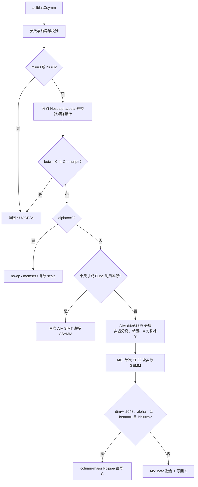

# aclblasCsymm 算子设计文档

# 需求背景（required）

## 需求来源

本需求来源于《aclblasCsymm 算子开发任务书》。任务要求在 Ascend 950PR、CANN 9.1.0 环境中，基于 `ops-blas` 工程使用 Ascend C Kernel 直调方式实现单精度复数对称矩阵乘接口 `aclblasCsymm`，并完成精度、性能和边界场景验证。

接口语义对齐 cuBLAS `cublasCsymm` 和 Netlib BLAS `csymm`，实现：

- `side = ACLBLAS_SIDE_LEFT`：$C \leftarrow \alpha A B + \beta C$；
- `side = ACLBLAS_SIDE_RIGHT`：$C \leftarrow \alpha B A + \beta C$。

其中 $A$ 为复数对称矩阵，满足 $A=A^T$。该关系不包含共轭，与 Hermitian 矩阵的 $A=A^H$ 不同。

## 背景介绍

### aclblasCsymm 功能背景

`aclblasCsymm` 是 BLAS Level 3 算子，输入、输出和标量均为单精度复数。矩阵采用列主序存储，`uplo` 指定 $A$ 的有效三角区域，另一半矩阵由普通转置关系隐含。对角元素的虚部作为普通数值参与计算，不置零、不取共轭。

`aclblasComplex` 在 `include/cann_ops_blas_common.h` 中定义为两个相邻的 FP32 分量：

```cpp
typedef struct aclblasComplex {
    float real;
    float imag;
} aclblasComplex;
```

因此 COMPLEX64 矩阵在 GM 中按 `[real, imag, real, imag, ...]` 交错存储。

# 需求分析（required）

## 需求描述

新增以下公共接口，声明位于 `include/cann_ops_blas.h`：

```cpp
aclblasStatus_t aclblasCsymm(
    aclblasHandle_t handle,
    aclblasSideMode_t side,
    aclblasFillMode_t uplo,
    int m, int n,
    const aclblasComplex* alpha,
    const aclblasComplex* A, int lda,
    const aclblasComplex* B, int ldb,
    const aclblasComplex* beta,
    aclblasComplex* C, int ldc);
```

接口通过 `handle` 获取已绑定的 stream，Kernel 按该 stream 异步下发。调用方在读取 Device 输出前负责同步 stream。

## 接口约束

| 参数 | 存储位置 | 数据类型 | 约束与语义 |
| --- | --- | --- | --- |
| `handle` | Host | `aclblasHandle_t` | 必须是有效句柄；空指针返回 `ACLBLAS_STATUS_HANDLE_IS_NULLPTR` |
| `side` | Host | 枚举 | 仅支持 `ACLBLAS_SIDE_LEFT`、`ACLBLAS_SIDE_RIGHT`；非法值返回 `ACLBLAS_STATUS_INVALID_ENUM` |
| `uplo` | Host | 枚举 | 仅支持 `ACLBLAS_UPPER`、`ACLBLAS_LOWER`；非法值返回 `ACLBLAS_STATUS_INVALID_ENUM` |
| `m`、`n` | Host | `int` | 必须大于等于 0；任一为 0 时合法 no-op |
| `alpha`、`beta` | Host | COMPLEX64 标量指针 | 非零维场景不可为空；本批次仅支持 Host 标量指针 |
| `A` | Device | COMPLEX64 | `side=LEFT` 时逻辑形状为 `m×m`，`side=RIGHT` 时为 `n×n`；只读取 `uplo` 指定三角 |
| `B` | Device | COMPLEX64 | 逻辑形状为 `m×n`，列主序 |
| `C` | Device | COMPLEX64 | 逻辑形状为 `m×n`，列主序，原地更新 |
| `lda` | Host | `int` | `side=LEFT` 时 `lda >= max(1,m)`；`side=RIGHT` 时 `lda >= max(1,n)` |
| `ldb`、`ldc` | Host | `int` | 分别满足 `ldb >= max(1,m)`、`ldc >= max(1,m)` |

本任务不支持超出 `lda/ldb/ldc` 语义的任意非连续视图，不涉及 broadcast，不返回视图，不要求确定性归约顺序。

## 特殊值和边界语义

参数检查和快速返回按以下顺序执行：

1. 检查 `handle`、`side`、`uplo`、`m`、`n`。
2. `m == 0 || n == 0` 时立即返回成功，不访问矩阵、标量或前导维。
3. 检查 `lda`、`ldb`、`ldc` 和 `alpha`、`beta`。
4. 从 Host 读取 `alpha`、`beta`，再检查非零维场景的 `A`、`B`。根据任务书参数表，即使 `alpha=(0,0)`，`A`、`B` 为空仍返回 `ACLBLAS_STATUS_INVALID_VALUE`。
5. `beta != (0,0)` 时 `C` 为空返回 `ACLBLAS_STATUS_INVALID_VALUE`；按任务书约定，`beta == (0,0)` 且 `C == nullptr` 时允许直接返回成功且不下发 Kernel。
6. `alpha=(0,0)` 且 `beta=(1,0)` 时快速返回，`C` 保持不变。
7. `alpha=(0,0)` 时只执行 $C\leftarrow\beta C$；其中 `beta=(0,0)` 时将 `C` 置零。

上述顺序以任务书为准。测试代码中非法 `side/uplo` 的期望状态应使用 `ACLBLAS_STATUS_INVALID_ENUM`。

## 需求拆解

1. 新增公共 API，并保证参数顺序、`int` 维数口径与任务书一致。
2. 支持 COMPLEX64、列主序、LEFT/RIGHT、UPPER/LOWER 全组合。
3. 对称取值只做转置，不做共轭；对角虚部原样参与计算。
4. 支持 `lda/ldb/ldc` padding 和任意非负运行时 `m/n`。
5. 提供零维、alpha/beta 特殊值和空指针快速路径。
6. 适配 Ascend 950PR，采用 AIV 与 AIC 协同的全 Device 流水。
7. 精度满足 COMPLEX64 分量级 FP32 标准。
8. 三个指定性能 case 的平均单次耗时不高于任务书标杆。

# 详细设计（required）

## 算子分析

### 数学公式

记：

$$
A=A_r+iA_i,\quad B=B_r+iB_i,\quad C=C_r+iC_i
$$

矩阵乘积 $P$ 为：

$$
P=A B\quad(LEFT),\qquad P=B A\quad(RIGHT)
$$

主路径采用 FP32 块实数展开。对任意复矩阵乘积 $P=XY$，构造：

$$
L_{2i,:}=[X_r(i,:),-X_i(i,:)],\qquad
L_{2i+1,:}=[X_i(i,:),X_r(i,:)]
$$

以及：

$$
R=\begin{bmatrix}Y_r\\Y_i\end{bmatrix}
$$

则一次 FP32 Cube GEMM 的输出满足：

$$
(LR)_{2i,j}=P_r(i,j),\qquad (LR)_{2i+1,j}=P_i(i,j)
$$

LEFT 取 $X=A,Y=B$，RIGHT 取 $X=B,Y=A$。Cube 先计算未缩放的复数乘积，epilogue 再融合 alpha 和 beta。该顺序避免把 alpha 的逐元素舍入误差带入长 K 归约，也与 CBLAS 的标量融合顺序更接近。

设 `alpha=(ar,ai)`、`beta=(br,bi)`，非直写路径的 epilogue 计算：

$$
C'_r=ar\cdot P_r-ai\cdot P_i+br\cdot C_r-bi\cdot C_i
$$

$$
C'_i=ar\cdot P_i+ai\cdot P_r+br\cdot C_i+bi\cdot C_r
$$

所有乘法和累加均使用 FP32。

### 对称矩阵寻址

列主序元素 `(row, col)` 的物理索引为 `col * ld + row`。对 $A(i,k)$：

```text
UPPER: i <= k 时读取 k*lda+i，否则读取 i*lda+k
LOWER: i >= k 时读取 k*lda+i，否则读取 i*lda+k
```

从隐含三角取值时只交换行列索引，不对虚部取负。`i == k` 时直接读取输入对角元素的实部和虚部。

### 列主序与复数交错适配

Cube 的逻辑输出形状为 `(2*m) x n`，其中相邻两行分别保存一个复数输出元素的实部和虚部：

```text
kernelM = 2 * m
kernelN = n
kernelK = 2 * (side == LEFT ? m : n)
outputRow(2*i)   = real(C(i,:))
outputRow(2*i+1) = imag(C(i,:))
```

当 `dimA<2048`、`alpha==(1,0)`、`beta==(0,0)` 且 `ldc==m` 时，AIC 使用 column-major Fixpipe 将上述交错行直接写到 C：目标偏移为 `col*(2*ldc)+2*row`，无需临时结果和 epilogue。其他情况先以行主序写入临时区，epilogue 通过 `(2*row)*tempRowStride+col` 和下一行读取实、虚部。

## 总体架构

算子采用快速路径、小尺寸直接路径和大中尺寸 Cube 路径：



所有 Kernel 按 handle 中的同一 stream 顺序下发，利用 stream 依赖保证阶段间数据可见，不插入 Host 同步。

## Host 侧设计

### 接口入口与参数校验

`csymm_host.cpp` 提供公共入口 `aclblasCsymm`。校验逻辑拆分为早期校验、非零维参数校验和标量快速路径，错误码严格对应任务书：

| 条件 | 返回值或行为 |
| --- | --- |
| `handle == nullptr` | `ACLBLAS_STATUS_HANDLE_IS_NULLPTR` |
| 非法 `side/uplo` | `ACLBLAS_STATUS_INVALID_ENUM` |
| `m < 0 || n < 0` | `ACLBLAS_STATUS_INVALID_VALUE` |
| `m == 0 || n == 0` | `ACLBLAS_STATUS_SUCCESS`，不下发 Kernel |
| 前导维不足、必需指针为空 | `ACLBLAS_STATUS_INVALID_VALUE` |
| 平台核数获取失败 | `ACLBLAS_STATUS_INTERNAL_ERROR` |
| workspace 获取失败 | `ACLBLAS_STATUS_ALLOC_FAILED` |
| Kernel/ACL Runtime 下发失败 | `ACLBLAS_STATUS_EXECUTION_FAILED` |

标量指针按任务书仅支持 Host 内存，不引入 Device 标量 D2H 和 stream 同步。

### 路由策略

Host 根据 `m*n*dimA` 和基础块尺寸选择路径：

- 标量快速路径：`alpha == 0`，跳过 A/B 预处理和 Cube 计算。
- 小尺寸路径：`min(m,n,dimA) < 16` 或 `m*n*dimA <= 64*1024`；使用单次 SIMT Kernel 降低多阶段启动和 workspace 开销。
- Cube 主路径：其余场景，包括任务书中的 256×256 和 1024×1024 性能 case。
- 大 K 高精度子路径：非直写且 `1024<=dimA<2048` 时使用两段归约；`dimA>=2048` 时无论 alpha/beta 是否满足直写条件均使用四段归约。epilogue 汇总各段后再融合标量。

当前阈值已固化为具名常量 `CSYMM_DIRECT_WORK_LIMIT=64*1024`；后续若扩大尺寸扫描范围可统一调整该阈值，不得仅针对三个性能 case 写 shape 特判。

### 核数与分核

- AIV 核数通过 `GetAivCoreCount()` 获取，预处理和 epilogue 分别按实际元素数限制使用核数。
- AIC 核数通过 `GetAicCoreCount()` 获取。Cube 总任务数为 `ceil(kernelM/baseM) * ceil(kernelN/baseN)`，实际核数取总任务数与硬件 AIC 核数的较小值，至少使用 1 核。
- 输出块采用 grid-stride 加蛇形 N 方向遍历，降低相邻核集中访问同一 GM 区域造成的带宽冲突。
- 不在 TilingData 中使用按核数组，核间任务由 `blockIdx` 和规则公式动态推导。

### Workspace 规划

Cube 主路径在 handle 默认 workspace 中顺序规划以下区域。`leftBlock` 和 `rightBlock` 的起点按 512B 对齐：

| 区域 | 元素数 | 内容 |
| --- | ---: | --- |
| `leftBlock` | `(2*m) * (2*dimA)` | 块实数 GEMM 的左矩阵 $L$，行主序 |
| `rightBlock` | `(2*dimA) * n` | 块实数 GEMM 的右矩阵 $R$，行主序 |
| `temp` | 可选，1、2 或 4 份，每份 `(2*m) * AlignUp(n,8)` | 非直写时保存实虚交错行结果；高精度分段归约使用多份 |

其中 `tempRowStride = AlignUp(n,8)`。不计分段对齐时，workspace 主体字节数为：

$$
4\times[4m\cdot dimA+2dimA\cdot n+
I_{temp}\cdot2m\cdot AlignUp(n,8)]\ \text{bytes}
$$

其中 $I_{temp}\in\{0,1,2,4\}$ 表示临时输出份数。当 `dimA<2048`、`alpha==(1,0)`、`beta==(0,0)`、`C!=nullptr` 且 `ldc==m` 时为 0，Cube 通过 column-major Fixpipe 直接写 C；普通非直写路径为 1；高精度分段归约为 2 或 4。每份临时结果的起点均按 512B 对齐。Host 使用 `uint64_t` 对每个乘法、加法和字节换算进行溢出检查，再通过 `EnsureDefaultWorkspace` 一次性获取或扩展 workspace。各区域偏移以独立标量字段传给 Kernel，不使用指针数组。

## Tiling 设计

TilingData 按阶段拆分，避免无关字段在 Kernel 间耦合。

### 预处理 Tiling

主要字段包括：

```text
m, n, dimA, lda, ldb
sideMode, uploMode
vectorized
usedAivCoreNum, nthreads, totalTasks, tasksPerCore
leftOffset, rightOffset
```

`m/n/dimA` 均为 64 的倍数时，`vectorized=1`：AIV 按 64×64 tile 将列主序 COMPLEX64 连续搬入 UB，通过 `DeInterleave` 分离实部和虚部，再用 `ConfusionTranspose` 生成行主序 tile。A 的非对角有效三角 tile 同时写入原位置和转置镜像位置；对角 tile 由同一 Kernel 内的 SIMT 线程按 `uplo` 补全，避免读取未引用三角。各 UB 平面在复用前使用 MTE3→V 事件等待，防止异步写回期间被下一 tile 覆盖。

任一维度不是 64 的倍数时，`vectorized=0`，回退到逐元素 SIMT 打包。回退任务按 `dimA*dimA + m*n` 个复数源元素线性切分，可覆盖非对齐尺寸和任意合法 `lda/ldb`。两条路径写出完全相同的块实数布局，Cube 和 epilogue 无需感知预处理实现。

### 块实数 GEMM Tiling

主要字段包括：

```text
m=2*outputM, n=outputN, k=2*dimA
tileM, tileN, tileK
lda=2*dimA, ldb=outputN
usedAicCoreNum
outputRowStride, outputDirect
leftOffset, rightOffset, tempOffset
```

默认块为 `tileM=128`、`tileN=128`、`tileK=128`，M/N 小于默认块时向 Cube 基础粒度 16 对齐后缩小。`tileK` 上限按 L1 容量预算约束为 128，避免双缓冲场景超出可用空间。Kernel 对 K 方向分块累加，A1/B1 到 L1 以及 L1 到 L0 使用双缓冲，MTE2、MTE1、M、FIX 之间通过事件同步。

每个 AIC 任务负责一个 `tileM*tileN` 输出块，通过 grid-stride 和奇数 M 块反向遍历 N 块。边界块使用有效 `curM/curN/curK` 控制搬入和 Fixpipe 搬出，不读取 padding 外的输入。直写条件满足时使用 column-major Fixpipe 写 C，否则以 row-major 写入 `temp`。

大 K 高精度子路径复用同一份打包输入和同一 Cube Kernel，通过调整 `leftOffset/rightOffset/k` 依次计算 2 或 4 个连续 K 分段，各段写入独立 temp。四段策略分别对块矩阵的实部贡献和虚部贡献再做二分，支持奇数 K 尾段。所有 GEMM 的 K 总量仍为 `2*dimA`，不增加 MMAD 总工作量；它只改变累加边界并增加 Kernel 下发与临时写回。

### Epilogue Tiling

主要字段包括：

```text
m, n, ldc, tempRowStride
usedAivCoreNum, nthreads, totalTasks, tasksPerCore
skipProduct, productParts
tempOffset, tempSecondOffset, tempThirdOffset, tempFourthOffset
alphaReal, alphaImag, betaReal, betaImag
```

每个 SIMT 线程负责一个或多个独立输出元素，按 `productParts` 从 1、2 或 4 份 temp 的相邻两行读取并汇总乘积实部和虚部，再融合 alpha 与 beta。`skipProduct` 用于 alpha 为零且仅执行 `C=beta*C` 的快速路径。

## Kernel 侧设计

### 小尺寸直接 Kernel

小尺寸路径为 AIV-only SIMT Kernel。线程按输出元素 `(row,col)` 切分，循环归约 `k`：

```text
LEFT : acc += SymA(row,k) * B(k,col), k in [0,m)
RIGHT: acc += B(row,k) * SymA(k,col), k in [0,n)
```

复数乘法使用四次 FP32 乘法和两次加减，累加结束后与 alpha、beta 融合。该路径直接使用用户 `lda/ldb/ldc`，天然支持 padding 和非对齐尺寸，无 workspace、无原子写冲突。

### Device 预处理 Kernel

预处理 Kernel 完成两类工作：

1. 根据 `uplo` 对 $A$ 做非共轭对称取值，并按 LEFT/RIGHT 所需位置写入块实数矩阵。
2. 读取 $B$，将实部和虚部写入块实数矩阵。

LEFT 路径构造 `L=block(A)`、`R=stack(B)`；RIGHT 路径构造 `L=block(B)`、`R=stack(A)`。对角元素虚部按输入原值写入。预处理只访问指定三角，不读取未引用三角中的 NaN、Inf 或随机填充值。

向量路径以列为连续方向搬入输入 tile；实虚分离后分别转置，并通过二维 UB→GM 搬运一次写出 64×64 平面。相比逐元素 SIMT 的跨列离散读写，它减少地址计算和非合并访存。A 的有效非对角 tile 只读取一次，利用 UB 中的转置前/后两个视图同时生成对称位置；对角 tile 仍严格按 `uplo` 取值。

### 块实数 Cube Kernel

Cube Kernel 为 AIC-only，常规路径对 `(2m)×(2dimA)` 的 L 和 `(2dimA)×n` 的 R 执行一次 FP32 `Mmad`。高精度子路径执行 2 或 4 个较短 K 的 GEMM 并由 epilogue 合并。每个输出块在 FP32 L0C 中累加，K 方向首块设置初始化标志，后续块继续累加。

`outputDirect=1` 时通过 `FixpipeParamsC310<CO2Layout::COLUMN_MAJOR>` 将相邻实虚行直接写到交错 COMPLEX64 C；否则通过 row-major Fixpipe 写入临时区，由 AIV 完成后处理。

### 复数融合 Kernel

AIV epilogue 对每个输出执行：

```cpp
float pr = temp[(2 * row) * tempRowStride + col];
float pi = temp[(2 * row + 1) * tempRowStride + col];

outReal = pr;
outImag = pi;

if (beta != 0) {
    outReal += betaReal * oldReal - betaImag * oldImag;
    outImag += betaReal * oldImag + betaImag * oldReal;
}
```

读取旧 C 时先同时保存 `oldReal/oldImag`，再写回两个分量，保证原地复数 beta 乘法不会被第一分量写回破坏。

## 快速路径设计

| alpha | beta | 行为 |
| --- | --- | --- |
| `(0,0)` | `(1,0)` | 直接返回，C 不变 |
| `(0,0)` | `(0,0)` | C 非空时 `aclrtMemsetAsync` 置零；C 为空直接成功 |
| `(0,0)` | 其他 | 单次 AIV Kernel 执行复数 `C=beta*C` |
| 非零 | `(0,0)` 且 C 为空 | 按任务书直接成功，不下发 Kernel |
| 非零 | 其他 | 路由至小尺寸或 Cube 主路径 |

快速路径同样保持异步语义；除纯 Host 条件返回外，不调用同步接口。

## 代码组织

实现新增或更新以下文件：

```text
include/cann_ops_blas.h                         # 新增 aclblasCsymm 公共声明
blas/symm/README.md                             # 增加 Csymm 接口和 950PR 支持说明
blas/symm/csymm_host.cpp                 # 参数校验、Tiling、workspace、Kernel 下发
blas/symm/csymm_kernel.h                 # Kernel launcher 声明
blas/symm/csymm_kernel.cpp               # SIMT、块实数预处理、Cube、epilogue Kernel
blas/symm/csymm_tiling_data.h            # Host/Kernel 共享 TilingData
test/symm/csymm/CMakeLists.txt                   # 测试目标
test/symm/csymm/csymm_param.h                    # CSV 参数解析
test/symm/csymm/csymm_golden.h                   # cblas_csymm golden 与精度判定
test/symm/csymm/csymm_npu_wrapper.h       # NPU 接口封装
test/symm/csymm/csymm_test.cpp            # GTest 驱动
test/symm/csymm/csymm_test.csv            # 自测用例
```

`blas/CMakeLists.txt` 已按目标 SoC 递归收集 `./*.cpp`；实现后需验证新文件被构建系统实际纳入，并在低于 asc-devkit 9.1 的配置中按仓库 Tensor API 能力开关处理。测试侧 CMake 需显式注册 `csymm` 测试。

## 支持硬件

| 支持的芯片版本 | 支持情况 |
| --- | --- |
| Ascend 950PR | 支持 |
| Atlas A2/A3  | 不修改既有实现 |

公共 API 不使用 950PR 私有命名，为后续其他产品线实现预留同一接口。

## 算子约束限制

- 仅支持 `aclblasComplex` COMPLEX64。
- 仅支持列主序矩阵。
- 仅支持 `lda/ldb/ldc` 表达的规则二维布局，不支持任意 Tensor stride。
- 不支持 broadcast。
- `alpha`、`beta` 仅支持 Host 指针。
- $A$ 的对称性由调用方保证，算子不检查两个三角是否一致。
- 只读取 `uplo` 指定三角；未指定三角内容不影响结果。
- 对角虚部不做 Hermitian 修正。

# 可维可测分析

## 功能与精度验证

Golden 使用 CBLAS `cblas_csymm`，按列主序生成完整 `m×n` 输出。实部、虚部分别按 FP32 标准比较：

| 数据类型 | rtol | atol | required_matched_ratio | max_abs_error_limit |
| --- | ---: | ---: | ---: | ---: |
| COMPLEX64 分量 | $2^{-10}$ | $2^{-16}$ | 0.99 | `1e-2` 或 `32*ULP` |

逐分量通过条件为：

$$
|actual-golden|\le atol+rtol\times|golden|
$$

测试覆盖随任务提供的 1200 条 CSV 用例，并至少包含：

- LEFT/RIGHT 与 UPPER/LOWER 正交组合；
- `m/n` 为 0、1、质数、2 的幂、2 的幂±1、非对齐值和大尺寸；
- 复数 alpha/beta 的 0、1、-1、纯虚数、一般复数和大值；
- 方阵、宽矩形、窄矩形；
- `lda/ldb/ldc` 紧凑和 padding；
- 未引用三角填入与有效三角不同的数据，验证无误读；
- 对角虚部非零，验证未按 Hermitian 规则清零；
- Inf/NaN 输入及均匀、正态、全零、交替和极端值分布；
- 空指针、非法枚举、非法前导维和负维度返回值；
- `handle == nullptr` 由 GTest 直接构造。

精度策略不采用 3M 与 HF32：3M 的额外平面求和存在放大消减误差的风险，HF32 的尾数精度也无法保证任务书规定的 COMPLEX64 精度门槛。因此主路径使用严格 FP32 块实数展开，不放宽验收阈值；大 K 用例采用两段或四段归约控制累加误差。Release 回归需覆盖任务提供的 1200 条 CSV，并补充空 handle、非法枚举顺序、对角虚部保留和任务书性能取数等专项 GTest。具体测试结果统一记录在测试报告中，不写入设计文档。

## 性能标准与测量方法

任务书指定 Ascend 950PR、COMPLEX64 的性能上限：

| case | m | n | side | uplo | 标杆 Avg time（us） |
| --- | ---: | ---: | --- | --- | ---: |
| 1 | 256 | 256 | LEFT | UPPER | 7.53 |
| 2 | 1024 | 1024 | LEFT | LOWER | 89.27 |
| 3 | 1024 | 1024 | RIGHT | UPPER | 86.34 |

测试先 warmup，再有效采样大于 50 次并取平均。性能记录需固定 CANN 版本、设备、shape、side、uplo、alpha、beta、前导维、warmup 次数和采样次数。

性能验收以任务书表格中的三个阈值为唯一门槛，附件中的 GPU baseline 和辅助脚本仅用于理解标杆来源，不替代表格约定。`TC_PF_TaskBookCases` 应同时支持性能记录和门禁模式；门禁模式按任务书阈值判定，功能回归与性能验收分别报告。

统计口径同时给出：

1. `aclblasCsymm` 完整 Device 流水耗时，作为任务书验收值；
2. 块实数预处理、Cube GEMM、可选 epilogue 各 Kernel 的 msprof 时间，用于定位瓶颈；
3. 小尺寸直接 Kernel 的独立时间，用于确定路由阈值。

性能优化优先级为：

1. 消除 Host 数据往返、stream 同步和逐调用显存申请；
2. `alpha=1 && beta=0 && ldc=m` 时 Cube 直写 C，消除 epilogue；
3. L1/L0 双缓冲隐藏搬运延迟；
4. 依据 M/N/K 形状调整多核分块，保证 Cube 利用率；
5. 对预处理阶段做 64×64 UB 向量化分块打包，降低 1024 case 的 AIV 开销；
6. 基于 msprof 结果调整 128×128×128 块，而非对固定 case 写 shape 特判。

性能调优使用 msprof 分别统计预处理、Cube GEMM 和可选 epilogue 的稳态耗时，识别主要瓶颈，并比较向量打包、直写和不同分块方案。HF32 仅可作为吞吐上限分析手段，正式实现保持严格 FP32；任何候选优化都必须先满足任务书精度门槛，再参与性能比较。profiling 数据和阶段测试结论统一放入独立测试报告，不写入设计文档。

## 内存与稳定性验证

任务书无独立内存上限，但需验证：

- workspace 大小计算无整数溢出；
- handle workspace 可复用且连续调用不泄漏；
- 失败路径不留下部分初始化状态；
- 所有 workspace 分段满足对齐要求且互不重叠；
- `m/n/lda/ldb/ldc` padding 不发生越界读写；
- AddressSanitizer/仿真检查和 Device 运行均无越界；
- no-op 与快速路径不访问任务书规定为可无效的指针。

## 兼容性分析

本需求新增公共 API，不修改 `aclblasSsymm`、`aclblasCgemm`、`aclblasChemm` 的接口和行为。不改变原有的 A2/A3 源码。

新增声明属于向后兼容的 API 扩展。README 和 API 列表需同步标明仅 Ascend 950PR 已完成验证，避免其他 SoC 被误认为已支持。

## 风险与应对

| 风险 | 影响 | 应对措施 |
| --- | --- | --- |
| HF32/3M 候选方案精度不足 | 大 K、极值或消减 case 失败 | 最终采用严格 FP32 块实数 GEMM；保留高风险精度集 |
| 块实数打包带宽较大 | 256/1024 case 启动和访存占比高 | 小尺寸单 Kernel 路由；继续向量化和分块打包 |
| 任务书表格与校验脚本性能口径冲突 | 附件脚本可能产生误判 | 本轮固定以任务书表格为唯一硬门禁，并单独保留脚本公式说明 |
| LEFT/RIGHT 转置视图映射错误 | 一类 side 全量精度失败 | 四组 side×uplo 最小手算 case与 cblas 双重验证 |
| 错误复用 Hermitian 逻辑 | 虚部符号或对角值错误 | 未引用三角放毒、对角虚部非零专项用例 |
| padding 和尾块越界 | 非对齐 case 崩溃或污染 | 所有 GM 地址使用原始 ld；Cube 使用有效 curM/curN/curK |
| 快速路径指针语义不一致 | 负向用例状态错误 | 按本文固定校验顺序实现，并逐项映射任务书异常行为 |

# 参考资料

1. 本地任务书：`aclblasCsymm950官方/aclblasCsymm_Atlas950PR_task_doc.md`。
2. [Netlib CSYMM](https://www.netlib.org/blas/csymm.f)。
3. [cuBLAS SYMM](https://docs.nvidia.com/cuda/cublas/index.html#cublas-t-symm)。
4. [Ascend C 算子开发文档](https://www.hiascend.com/document/detail/zh/CANNCommunityEdition/850/opdevg/Ascendcopdevg/atlas_ascendc_map_10_0002.html)。
5. [社区任务算子设计文档模板](https://gitcode.com/cann/cann-ops-competitions/blob/master/04_tasks/01_community-task-2026/resources/design_template.md)。
