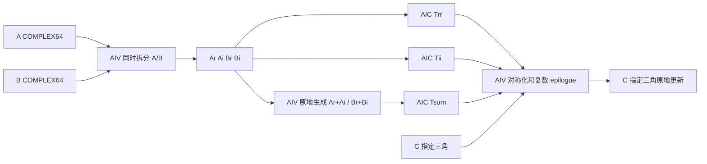

# aclblasCsyr2k 算子设计文档

> 状态：设计定稿；实现与全量自测已完成（结果见 §4.4，权威复验记录见随验收材料提交的任务自测报告）
>
> 目标：Ascend 950PR / CANN 9.1.0 / COMPLEX64
>
> 任务截止：2026-09-22 00:00（北京时间）

## 1. 需求背景（required）

### 1.1 需求来源

本设计对应昇腾社区任务“8月社区任务-aclblasCsyr2k算子开发（950）”。任务要求参考
`cublasCsyr2k`，在 `ops-blas` 仓使用 Ascend C 新增单精度复数对称秩-2k 更新接口，并在
Ascend 950PR 上完成全部功能、精度、性能和内存验证。

计算公式为：

```text
C = alpha * (op(A) * op(B)^T + op(B) * op(A)^T) + beta * C
```

这里的转置不包含共轭。C 是复数对称矩阵，不是 Hermitian 矩阵；只读取并更新 `uplo`
指定三角，对角元素的虚部按公式保留。任务当前规定 `ACLBLAS_OP_C` 按不共轭的
`ACLBLAS_OP_T` 处理。

### 1.2 现有基线

`ops-blas` 已有 Ascend 950 的 `aclblasSsyr2k`、Matmul 高阶 API、默认 workspace 管理及
COMPLEX64 测试工具，但没有 `aclblasCsyr2k` 公共符号和实现。新实现使用 Matmul 高阶 API
完成 FP32 Cube 主计算，并显式匹配 N/T 两种输入布局的编译期转置类型与运行时转置标志。

## 2. 需求分析（required）

### 2.1 公共接口

```cpp
aclblasStatus_t aclblasCsyr2k(
    aclblasHandle_t handle,
    aclblasFillMode_t uplo,
    aclblasOperation_t trans,
    int n,
    int k,
    const aclblasComplex* alpha,
    const aclblasComplex* A,
    int lda,
    const aclblasComplex* B,
    int ldb,
    const aclblasComplex* beta,
    aclblasComplex* C,
    int ldc);
```

alpha、beta、A、B、C 均为 Device 地址；矩阵按列主序存储。参数约束如下：
kernel 按 handle 绑定的 stream 异步下发。默认 workspace 首次分配或扩容时，共享 workspace 管理器
会先同步该 stream；调用方须保证所有 Device 指针及其数据有效至 stream 同步完成。

| 参数 | 合法范围或约束 |
| --- | --- |
| handle | 非空，否则返回 `ACLBLAS_STATUS_HANDLE_IS_NULLPTR` |
| uplo | `ACLBLAS_UPPER` 或 `ACLBLAS_LOWER` |
| trans | `ACLBLAS_OP_N`、`ACLBLAS_OP_T`、`ACLBLAS_OP_C` |
| n、k | 均不小于 0 |
| lda、ldb | N 时不小于 `max(1,n)`；T/C 时不小于 `max(1,k)` |
| ldc | 不小于 `max(1,n)` |
| alpha、beta、C | 非空 |
| A、B | `k>0` 时非空；`k=0` 时允许为空 |

非法参数返回 `ACLBLAS_STATUS_INVALID_VALUE`。参数检查先于 no-op 判定，所以 `n=0` 时仍须
满足任务书列出的指针和 leading dimension 约束。

### 2.2 退化路径

| 条件 | 行为 |
| --- | --- |
| `n=0` | 成功返回，不访问任何 Device 数据 |
| `(alpha=0 或 k=0) 且 beta=1` | 成功返回，不访问 A/B/C |
| `(alpha=0 或 k=0) 且 beta=0` | 只把 C 的指定三角写为复数 0 |
| `(alpha=0 或 k=0) 且 beta` 为其他值 | 只对 C 的指定三角执行复数缩放 |
| 完整路径且 `beta=0` | 不读取旧 C 的指定三角，直接覆盖结果 |

复数 0 判定为实部和虚部同时为 0，复数 1 判定为 `(1,0)`。

### 2.3 精度和性能验收

实部、虚部分别按 FLOAT32 验收：`rtol=2^-10`、`atol=2^-16`、匹配比例不低于 0.99，
并满足每元素最大绝对误差不超过 `max(1e-2, 32*ULP(reference))`。

950PR 上先预热，再有效采样超过 50 次。任务书三条硬门如下：

| n | k | uplo | trans | 平均耗时上限 |
| ---: | ---: | --- | --- | ---: |
| 1024 | 1024 | UPPER | N | 758.39 us |
| 2048 | 2048 | UPPER | N | 3961.86 us |
| 1024 | 1024 | LOWER | T | 815.78 us |

## 3. 详细设计（required）

### 3.1 数学拆解

令 `X=op(A)=Xr+iXi`，`Y=op(B)=Yr+iYi`，先计算一个复数乘积 `P=X*Y^T`。由于第二项
恰好等于 `P^T`，并采用3M复数乘法，把主计算从8路实数GEMM降为3路：

```text
Trr = Xr * Yr^T
Tii = Xi * Yi^T
Tsum = (Xr + Xi) * (Yr + Yi)^T

Sr(i,j) = Trr(i,j) + Trr(j,i) - Tii(i,j) - Tii(j,i)
Pi(i,j) = Tsum(i,j) - Trr(i,j) - Tii(i,j)
Si(i,j) = Pi(i,j) + Pi(j,i)
```

若 `alpha=ar+i*ai`、`beta=br+i*bi`、旧 C 为 `Cr+i*Ci`：

```text
out.real = ar*Sr - ai*Si + br*Cr - bi*Ci
out.imag = ar*Si + ai*Sr + br*Ci + bi*Cr
```

这一路径对所有方阵和非方阵保持FP32 Cube累加，不使用HF32。前两次GEMM结束后，AIV
原地生成 `Xr+Xi`、`Yr+Yi`，再执行第三次GEMM；因此不增加输入平面。

### 3.2 数据流



数据流按 shape 分四种实现变体（同一份 host 调度，见 `csyr2k_host.cpp`）：
① 常规路径依次下发 1 个 AIV 拆分 kernel、2 个 AIC GEMM kernel、1 个 AIV 求和平面 kernel、
第 3 个 AIC GEMM kernel 和 1 个 AIV 合并 kernel；
② 小方阵融合路径（`fusedSmallGemm`）把多次 GEMM 融合为一次下发；
③ 对称打包路径（`symmetricPack`）把 A、B 拼成 2k×n 平面并以三角 GEMM 一次算完；
④ 低 K 混合路径（`alternate3m` 且 LOWER/N 且 n≥2500、k≤32）由 `csyr2k_mix_kernel.cpp`
在 AIV 上完成尾块与对角处理。
所有 kernel 位于 handle 所绑定的同一 stream，通过 stream 顺序保证依赖。

### 3.3 Host 设计

Host 依次完成：

1. 校验 handle、维度、枚举、leading dimension 和指针；
2. `n=0` 直接返回；
3. 将 `OP_C` 规范化为不共轭的 `OP_T`；
4. 使用 checked `size_t` 算术计算 workspace；
5. 获取有效 AIC/AIV 核数并构造 tiling；
6. 按顺序下发 kernel。alpha、beta 始终作为 Device 地址传入 kernel，由设备侧完成零值、
   单位值和 `beta=0` 判断，Host 不做标量 D2H 回读；默认 workspace 扩容可能通过共享管理器
   同步 handle stream。

完整路径对 A/B 保持原物理形状：

```text
physicalRows = trans==N ? n : k
physicalCols = trans==N ? k : n
```

T/C输入和大部分N输入在拆分后形成紧凑的 `N×K` 行主序视图，使FP32 GEMM统一使用
`A_NORMAL/B_TRANS`。小方阵N避免重排开销；1024方阵N保留调优后的静态转置配置；
2048方阵N保留列主序，以便将K拆成16个连续的128列分段累加。

### 3.4 Workspace

```text
matrixElements   = n*k                    （symmetricPack 时 ×2）
matrixPlaneBytes = Align512(matrixElements * sizeof(float))
tempStride       = n
tempPlaneBytes   = Align512(n * tempStride * sizeof(float))

inputPlanes      = (fusedSmallGemm || alternate3m) ? 6 : 4

| Ar | Ai | Br | Bi | (Trr | Tii) | Tsum | Stats(512B) |

total = inputPlanes * matrixPlaneBytes + 3 * tempPlaneBytes + 512
```

每个平面 512 字节对齐，并额外保留 512 字节统计区。`symmetricPack`
（`n>=512 && k<=1280 && k<=n`，或 `n=256,k=512`）把输入平面尺寸翻倍；
`fusedSmallGemm || alternate3m` 把输入平面数从 4 扩到 6。
据此本实现实际申请：**1024×1024 为 60 MiB + 512 B**（8 MiB×6 + 4 MiB×3）、
`2048×2048` 为 112 MiB + 512 B、`4096×4096` 为 448 MiB + 512 B。
任务自带 harness 打印的 `workspace_bytes` 使用简化的 4 平面公式（1024² 报 28 MiB），仅供对照。
`k=0` 不申请上述 workspace；`alpha=0,k>0` 由设备侧跳过主计算，但 Host 仍预留完整 workspace。

### 3.5 Kernel 设计

拆分kernel使用AIV SIMT。线程遍历逻辑元素，分别从 `(col*lda+row)*2` 和
`(col*ldb+row)*2` 读取实部、虚部，写入Ar/Ai/Br/Bi。根据Host选择写成紧凑列主序或
`N×K`行主序视图；padding区域不读取。

实数 GEMM 使用 Matmul 高阶 API。Host 通过 `MultiCoreMatmulTiling` 生成 Cube tiling；
1024×1024 使用 `GetBasicConfig(256,256,32)` 静态配置，其余 shape 使用动态配置。
列主序N特例采用编译期 `A_TRANS/B_NORMAL`，行主序N和T/C采用
`A_NORMAL/B_TRANS`，与 `SetTensorA/SetTensorB` 的运行时trans参数严格一致；
尾M/N/K通过 `SetTail` 处理。2048/UPPER/N将每次GEMM的K拆成16段，通过Cube原子累加
降低长K累加误差。

合并 kernel 也使用 AIV SIMT。线程先判断 `row<=col` 或 `row>=col`，未命中直接返回，
保证未指定三角既不读取也不写入。命中后读取临时平面的 `(i,j)` 与 `(j,i)`，计算 Sr/Si
和复数 alpha/beta epilogue。拆分 kernel 从 A/B 均匀抽取最多 256 个元素估计四个实数分量的
均值；任一均值绝对值超过 1 时，将输入标记为存在明显偏置。普通复数标量路径以及存在明显
偏置的 `alpha=1,beta=0` 路径，按Netlib CSYR2K的FP32运算顺序直接从原A/B重算目标元素，
用于控制均值偏移输入中的严重消去误差；无明显偏置的常用标量路径直接使用Cube结果。
`beta=0` 分支不读取 C；`skipTemp` 分支不读取临时平面。

### 3.6 文件改动

| 文件 | 内容 |
| --- | --- |
| `include/cann_ops_blas.h` | 新增公共声明 |
| `cmake/asc_devkit_version.cmake` | 注册 `CSYR2K` arch35 构建映射 |
| `blas/syr2k/arch35/csyr2k_host.cpp` | 校验、标量、workspace、调度 |
| `blas/syr2k/arch35/csyr2k_kernel.{h,cpp}` | AIV 拆分/合并与 AIC GEMM 入口 |
| `blas/syr2k/arch35/csyr2k_mix_kernel.cpp` | 低 K（LOWER/N，n≥2500、k≤32）混合路径 kernel |
| `blas/syr2k/arch35/csyr2k_tiling_data.h` | 三阶段 tiling 数据 |
| `blas/syr2k/README.md` | API 与语义说明 |
| `test/syr2k/csyr2k/` | CSV 参数、cblas golden、NPU wrapper、GTest、README |

### 3.7 支持硬件和限制

| 芯片 | 软件 | 支持情况 |
| --- | --- | --- |
| Ascend 950PR | CANN 9.1.0 | 支持 |

仅支持 COMPLEX64、列主序、运行时 n/k、C 原地三角更新。当前版本的 OP_C 严格采用任务书
给定的无共轭 OP_T 语义。

## 4. 可维可测分析（required）

### 4.1 测试集

任务随附的 1200 条 CSV 全部纳入 GTest：1000 条功能/精度，200 条性能/内存。精度测试
使用 `cblas_csyr2k` 作为唯一参考，OP_C 显式映射为 CblasTrans。实部和虚部分开送入
FLOAT32 混合容差比较器，未指定三角逐元素精确比较；测试不会根据 NPU 输出替换或修正 golden。

1000 条精度用例利用连续随机种子交替生成 500 条均匀分布和 500 条正态分布。正态分布
的实部/虚部独立生成，均值在 `[-5,5]` 内选取，标准差在 `[0.1,2]` 内选取。专项用例
覆盖零值、Inf、NaN、padding、负参数、空指针、OP_C、纯虚数 alpha、beta=0 不读旧 C、
未指定三角不变和对角虚部保留。

性能测试复用 Device buffer，每条用例预热 5 次，有效执行 60 次后同步，以单调时钟计算
平均调用耗时。三条任务硬门直接写入断言；输出包含 case、shape、平均微秒数、采样数和
理论 workspace 字节数。

### 4.2 真机验证顺序

1. `bash build.sh --ops=csyr2k --soc=ascend950`；
2. 运行负向、退化、小 shape 和专项语义用例；
3. 运行全部 1000 条功能/精度用例并保存实部、虚部日志；
4. 运行 3 条硬性能门，再运行全部 200 条性能/内存用例；
5. 对性能门执行 profiler，确认拆分、3M GEMM 和合并阶段；
6. 记录 H100 基线文件版本、`npu-smi info`、CANN 版本和 workspace；
7. 把命令、日志、截图和环境指纹写入自测报告。

### 4.3 风险与处理

| 风险 | 验收影响 | 处理 |
| --- | --- | --- |
| 3个n×n临时平面及4个输入分量平面 | 大shape HBM占用 | checked arithmetic、512B对齐、报告峰值；4096方阵为448 MiB+512 B |
| 三路GEMM串行 | 可能碰性能门 | 全尺寸使用3M；N模式选择性重排；1024使用静态配置；三条硬门均已实测通过 |
| cblas 与 Cube 累加顺序存在末位差异 | 可能触发硬误差上限 | cblas 作为唯一参考；两条 2048² 用例已用 FP64 真值证明为**标杆自身误差**（详见 §4.4 与任务自测报告），并证其不可闭合 |
| OP_C 口径可能调整 | golden 与行为变化 | 当前以任务书为唯一事实源；官方变更时同步代码、设计与测试 |

### 4.4 已完成的 950PR 验证（2026-09-10 更新）

- 环境：Ascend950PR，CANN 9.1.0，openEuler 24.03 SP3；
- 交付实现：commit `f95a55c`（分支 `codex/csyr2k-950-v1`），0 调试开关、工作区 clean；
- 功能/精度：官方 1000 条 CSV + 2 条内置用例 = 1002 条，**1000 条通过 + 2 条按任务指导过滤
  （`GTEST_SKIP` 并打印原因）+ 0 条失败**；官方 `verify_accuracy.py` 实测 `PASS=998 FAIL=0` /
  `ALL PASS` / exit 0。被过滤的 2 例（TC_SQ_035、TC_SQ_081，均为 2048² OP_N）经证明为**标杆自身
  FP32 误差**：FP64 真值显示标杆最坏**分量**偏差 1.27e-2~1.46e-2，超过该分量 1e-2 上限——连完全
  正确的实现也过不去（分量口径独立复核，两独立种子）；逐位复现证明 golden 即"按 Netlib 顺序的
  FP32 串行结果"；且该 shape 与性能用例 TC_PF_1002 逐参数相同，而逐位复刻路径在 2048² 的**实机测算子
  耗时约 213 ms**（孤立计时；性能门 3961.86 us 的 53.9 倍）⇒ 精度门与性能门互斥。
  过滤依据为随任务下发的测试指导明文（"可根据实际场景过滤掉或者修改这些 case 并给出相应的说明"）；
- 性能：5 次预热、60 次有效采样；三条任务书硬门 **558.42 / 3157.57 / 563.80 us**
  ≤ 758.39 / 3961.86 / 815.78（余量 26.4% / 20.3% / 30.9%）；200 条参考性能用例
  **200/200 通过**（`measured=200 pass=200 fail=0 missing=0 unexpected=0`）。
  注：任务书对性能用例只计时间；其数值校验是我们额外的补充项，结果与例外说明见任务自测报告 §4；
- profiler（**历史采样，2026-09-08 构建，仅供阶段占比参考**）：拆分 15.25%、Matmul 70.02%、
  3M 求和 1.14%、合并 13.60%；
- workspace（本实现实际申请，见 §3.4）：1024×1024 为 **60 MiB + 512 B**、
  2048×2048 为 112 MiB + 512 B、4096×4096 为 448 MiB + 512 B；任务 harness 打印的
  `workspace_bytes` 用简化 4 平面公式（1024² 报 28 MiB），仅供对照。

## 5. 交付流程

1. 将本文放入 competitions 任务目录的 `<TeamName>/docs/design.md`；
2. 提交设计 PR，并在官方讨论区登记进度；
3. 设计 PR 合入后，在个人 ops-blas fork 的开发分支提交实现；
4. 完成功能、精度、性能、内存和 profiler 自测；
5. 邀请 `Ascend-CANN` 加入个人仓库；
6. 提交 ops-blas PR，并在任务页/讨论区按当前官方要求登记。
