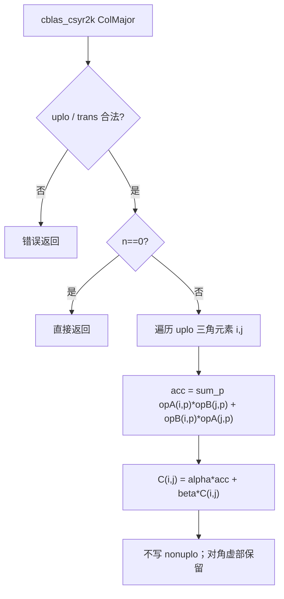
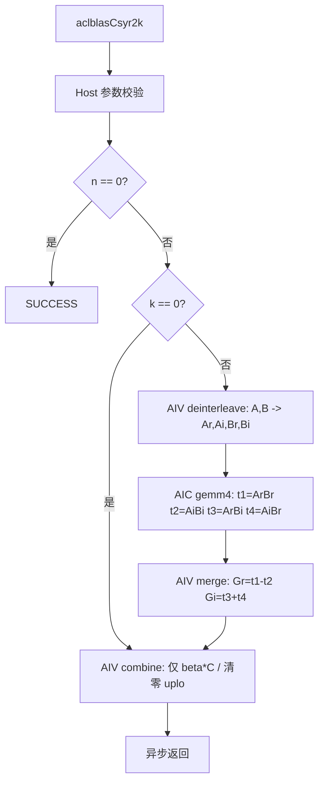
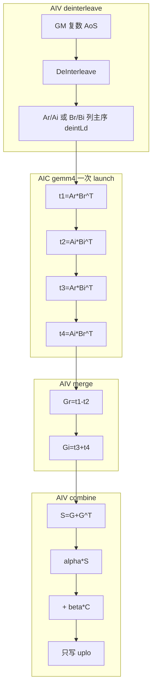

# aclblasCsyr2k 算子设计文档

| 项目 | 内容 |
|------|------|
| 算子名称 | `aclblasCsyr2k` |
| 任务编号 | 8 月社区任务 23 / 目录 `08-26-aclblasCsyr2k` |
| 目标硬件 | Ascend 950PR（arch35 / DAV_3510） |
| 软件版本 | CANN 9.1.0（asc-devkit >= 9.1） |
| 开发方式 | Ascend C Kernel 直调（ACLBLAS handle + stream） |
| 数据类型 | COMPLEX64（实部、虚部均为 FP32） |
| 对齐基线 | Netlib / CBLAS `cblas_csyr2k`、cuBLAS `cublasCsyr2k` |
| 合入仓及目录 | `ops-blas`，`blas/syr2k/arch35/` |
| GitCode 账号 | shine4real |

---

## 一、需求背景

### 1.1 需求来源

本需求来源于 CANN 社区任务《8月社区任务-aclblasCsyr2k 算子开发（950）》。任务要求在 Ascend 950PR 上，基于 `ops-blas` 使用 Ascend C 实现单精度复数对称秩-2k 更新接口 `aclblasCsyr2k`，完成公共 API、Host 校验、Device Kernel、CSV 驱动测试、算子 README 及自测。

### 1.2 背景介绍

#### 1.2.1 aclblasCsyr2k 算子实现优化

本任务不是 TBE 算子迁移，而是 **ops-blas Kernel 直调新增接口**。不存在 TBE `csyr2k` 源码路径，也不走 aclnn / 算子信息库（`*_opinfo.json`）。标杆与参考来源如下。

| 角色 | 路径 / 接口 | 说明 |
|------|-------------|------|
| 精度标杆 | Netlib CBLAS `cblas_csyr2k` | 测试 golden，列主序 |
| 接口标杆 | cuBLAS `cublasCsyr2k` | 参数顺序、uplo/trans 语义 |
| 仓内实数同族 | `blas/syr2k/arch35/ssyr2k_{host,kernel,tiling_data}.*` | Cube GEMM 模板、Fixpipe 对齐 |
| 仓内复数 4M 参考 | `blas/herk/arch35/cherk_{host,kernel}.*` | 复数拆分 / 合并思路 |
| 公共声明 | `include/cann_ops_blas.h`（`aclblasCsyr2k`） | 产品接口，非 950 私有 API |
| 接口清单 | `docs/zh/api_list.md` | 登记 `aclblasCsyr2k` |
| 算子说明 | `blas/syr2k/README.md` | 原型、约束、调用样例 |

实现优化目标：在 950PR 上用 Cube FP32 GEMM 完成复数 SYR2K，三项性能门禁不高于任务书标杆，仅写 uplo 三角，对角虚部不清零。

#### 1.2.2 aclblasCsyr2k 算子现状分析

##### 1.2.2.1 标杆算子支持的数据类型和数据格式

与任务书及 CBLAS / cuBLAS 对齐：

| 项 | 标杆约定 |
|----|----------|
| 数据类型 | COMPLEX64（两个连续 FP32：real, imag） |
| 存储格式 | 列主序（Column-Major） |
| C | `n×n` 对称复矩阵，仅更新 `uplo` 三角 |
| A / B | `trans=N` 时逻辑 `n×k`；`trans=T/C` 时逻辑 `k×n` |
| alpha / beta | Device 侧复数标量 |
| 不支持 | FP16 / BF16 / COMPLEX128 / 行主序 / Hermitian 语义 |

##### 1.2.2.2 标杆算子实现描述

Netlib / CBLAS `csyr2k` 计算：

```
C := alpha * (op(A) * op(B)^T + op(B) * op(A)^T) + beta * C
```

其中 `op(X) = X`（`trans=N`）或 `X^T`（`trans=T`）。这是 **普通转置，不是共轭转置**，因此：

- `trans=C` 在本任务中按 `trans=T` 处理，虚部不取反；
- C 满足 `C(i,j)=C(j,i)`，而不是 `C(i,j)=conj(C(j,i))`；
- 对角元素虚部参与计算，**不清零**（与 HERK / HER2K 不同）。

CPU 标杆对每个 uplo 元素做 K 维复数乘加，再与 `beta*C` 融合。计算量约为两次复数 `n×k × k×n` 外积累加，只写三角。

##### 1.2.2.3 标杆算子实现流程图



---

## 二、需求分析

### 2.1 外部组件依赖

| 依赖 | 用途 |
|------|------|
| CANN 9.1.0 / Ascend C | Kernel 编译与运行 |
| ACL Runtime | stream、workspace、`aclrtMemsetAsync` |
| Netlib CBLAS | 测试 golden `cblas_csyr2k` |
| GTest | CSV 驱动功能 / 精度 / 非法参数用例 |

不依赖 PyTorch / torch_npu / aclnn / ATK。

### 2.2 内部适配模块

| 模块 | 路径 | 作用 |
|------|------|------|
| ACLBLAS handle | `common/helper/aclblas_handle_internal.h` | stream、默认 workspace |
| Host 工具 | `common/helper/host_utils.h` | 核数、`GetUbBlockSize` |
| SYRK 公共 | `common/helper/syrk_host_utils.h` | AIV 核数裁剪 |
| Cube GEMM 模板 | `common/helper/syrk_gemm_arch35.h` | `SyrkGemmKernelImpl` |
| 实数 SYR2K tiling | `ssyr2k_tiling_data.h` | Cube tile / L1 / Fixpipe 对齐 |

### 2.3 需求模块设计

#### 2.3.1 Ascend C 算子原型

```cpp
aclblasStatus_t aclblasCsyr2k(
    aclblasHandle_t handle, aclblasFillMode_t uplo, aclblasOperation_t trans,
    int n, int k,
    const aclblasComplex* alpha, const aclblasComplex* A, int lda,
    const aclblasComplex* B, int ldb, const aclblasComplex* beta,
    aclblasComplex* C, int ldc);
```

除任务书明确不要求的产品（A2/A3）外，功能对标 CBLAS / cuBLAS：COMPLEX64、列主序、UPPER/LOWER、N/T/C、Device 标量、仅写 uplo。

#### 2.3.2 Ascend C 算子相关约束

相对标杆，本实现明确不做或限制如下：

| 项 | 说明 |
|----|------|
| 硬件 | 仅 Ascend 950PR / 950DT（arch35）；不支持 A2/A3 |
| 数据类型 | 仅 COMPLEX64 |
| Hermitian | 不提供共轭；对角虚部不清零 |
| tilingKey | 单套 Kernel 路径，无多 tilingKey 分发 |
| 小尺寸独立 SIMT | 不单独做纯 AIV 逐元素路径，小 n 仍走同一流水线 |

---

## 三、需求详细设计

### 3.1 调用方式

**ACLBLAS Kernel 直调**：业务通过 `aclblasCreate` / `aclblasSetStream` 绑定 handle，再调用 `aclblasCsyr2k`。Host 校验后在该 stream 上依次 launch AIV / AIC Kernel，异步返回；调用方 `aclrtSynchronizeStream` 后可读 C。

不走 aclnn、不走 PyTorch 自定义算子、不生成 OM。

### 3.2 需求总体设计

数学上令 `G = op(A) * op(B)^T`（普通转置），则

```
S = G + G^T = op(A)op(B)^T + op(B)op(A)^T
C_uplo = alpha * S + beta * C_uplo
```

复数乘法用 4M 拆成 4 次实数 GEMM：

```
G = (Ar + i Ai)(Br + i Bi)^T
  = (Ar Br^T - Ai Bi^T) + i (Ar Bi^T + Ai Br^T)
```

即 `Gr = t1 - t2`，`Gi = t3 + t4`。combine 再做 `S = G + G^T`，只需 **一次 4M**，不必再对 `(B,A)` 做第二组 4M。



#### 3.2.1 Host 侧设计

处理顺序：

1. `handle == nullptr` → `HANDLE_IS_NULLPTR`；
2. `uplo` / `trans` 非法、`n<0` / `k<0`、`lda/ldb/ldc` 不足、空指针 → `INVALID_VALUE` 并打日志；
3. `n==0` 直接 SUCCESS；
4. `OP_C` 映射为 `OP_T`；
5. `GetAivCoreCount` / `GetAicCoreCount`，失败分别打日志返回 `INTERNAL_ERROR`；
6. 计算 workspace，`EnsureDefaultWorkspace`，指针判空；
7. `k!=0`：必要时 pad memset → deint → sync → gemm4 → sync → merge → sync；
8. 始终 launch combine（Device 侧加载 alpha/beta，不在 Host D2H）。

##### 3.2.1.1 分核策略

核数运行时获取，不硬编码 28/56。

| 阶段 | 单元 | 分核 |
|------|------|------|
| deinterleave | 按物理行切分 | `aivCoreNum`，每核 `CeilDiv(physRows, aiv)` |
| gemm4 | `n×n` 输出按 `tileSide×tileSide` 二维 tile | `min(aicCoreNum, gemmTiles^2)` |
| merge | 按列切分对齐块 | `min(aiv, n)`；`n%64` 尾块由 0 号核处理 |
| combine | 按行切分 | `usedAiv = min(n, aiv)`；`rowsPerCore = CeilDiv(n, usedAiv)`。若 `n>=8` 且 `rowsPerCore<8`，则抬到 8；若余下行数为 1 且 `(n-1)` 非 8 对齐，再把 `rowsPerCore` 加 1，避免 1 行尾块落在非 32B 对齐基址。最后 `usedAiv = CeilDiv(n, rowsPerCore)` |

`tileSide`：默认 128；`n<128` 时上对齐到 Cube `BASE_M`（16）且不小于 16。

##### 3.2.1.2 数据分块和内存优化策略

**UB 对齐**：Host 用 `GetUbBlockSize()`（字节）得到 FP32 每块元素数 `ubElems = 32/sizeof(float)=8`；Kernel 用 `GetDataBlockSizeInBytes()`，避免写死 `BLOCK_SIZE=32` 的使用点。

**Cube 分块**：

- `tileM = tileN = tileSide`（默认 128）
- `tileKChunk` 初值 256；受 L1 约束：

```
alignedM = CeilAlign(tileM, 16)
alignedN = CeilAlign(tileN, 16)
denom    = L1_BUF_NUM * sizeof(float) * (alignedM + alignedN)
maxK     = floor((L1_SIZE / denom) / BASE_K) * BASE_K
tileK    = min(256, max(maxK, BASE_K))
```

`L1_SIZE=512KB`，`L1_BUF_NUM=2`。128×128 时 `tileK=256` 可放入 L1 ping-pong。

**Workspace（k!=0）**，起点 512B 对齐：

```
deintLd   = CeilAlign(physRows, ubElems)
tempLdc   = CeilAlign(n, FIXPIPE_N_ALIGN)   // 8
abBytes   = deintLd * physCols * 4
tempBytes = tempLdc * n * 4
need      = Align512(4 * abBytes + 6 * tempBytes)
布局      = [t1][t2][t3][t4][Gr][Gi][Ar][Ai][Br][Bi]
```

`deintLd` 垫到 8 的倍数：1 行 `te::Copy` 的 32B dest-pad 留在本列，避免 n=65 时写穿下一列。`n % ubElems != 0` 时对 t1–Gi memset 0，使 8 宽尾读为定义零。

**UB 占用（combine，SCALE_BLOCK=64）**：

```
Gr/Gi/GtR/GtI/rmR/rmI : 各 64*64*4 = 16KB
cIn/cOut              : 各 64*64*2*4 = 32KB
trans16               : 64*16*4 = 4KB
合计约 164KB < 248KB/核 UB
```

merge 使用 64×64 块，`DataCopyPad` 的 `blockCount<=8`。

##### 3.2.1.3 tilingKey 规划策略

本算子 **不使用 tilingKey**。950PR 上仅 arch35 一套实现，N/T/C、UPPER/LOWER、k=0 均通过 tiling 字段分流：

| 结构体 | 关键字段 |
|--------|----------|
| `Csyr2kDeintTilingData` | rows, cols, lda, rowsPerCore |
| `Ssyr2kGemmTilingData` | n, k, leftLd/rightLd=deintLd, tileM/N/K, isTransN |
| `Csyr2kMergeTilingData` | n, tempLdc, colsPerCore, isAdd |
| `Csyr2kCombineTilingData` | n, ldc, tempLdc, rowsPerCore, uploMode, isKZero；`alphaReal/Imag`、`betaReal/Imag`、`isAlphaZero/isBetaZero` 由 Kernel 从 Device 指针加载后回填 |

无数组型 tiling 成员（满足仓内 R4）。

#### 3.2.2 Kernel 侧设计

##### 3.2.2.1 Kernel 侧实现描述

**Phase 0 deinterleave（AIV）**  
按物理列块（64）× 行块（64）从列主序复数 GM 搬到 UB，`DeInterleave` 得到实/虚，再按 `deintLd` 写回。单列 leftover 由 0 号核按 8 行 1D `DataCopyPad` 处理，避免 `blockCols==1` 的 2D 路径。

**Phase 1 gemm4（AIC）**  
一次 AIC launch 内串行 4 次 `SyrkGemmKernelImpl`：

| 输出 | 左 | 右 |
|------|----|----|
| t1 | Ar | Br |
| t2 | Ai | Bi |
| t3 | Ar | Bi |
| t4 | Ai | Br |

`isTransN=1`：左 DNExt、右 NDExt；否则左 NDExt、右 DNExt。Fixpipe 写行主序，行步 `tempLdc`。四合一减少 3 次 Kernel 启动。

**Phase 1.5 merge（AIV）**  
`Gr = t1 - t2`，`Gi = t3 + t4`。对齐 64 块多核按列；尾行/尾列 0 号核。非对齐用 `DataCopyPad` + 右 pad，不用会对 32B 下取整的 `DataCopy`。

**Phase 2 combine（AIV）**  
1. `DataCopyPad` 加载 Device alpha/beta（32B 对齐），判定 `isAlphaZero` / `isBetaZero`；
2. `LoadGRm` + `TransDataTo5HD` 得到列主序 G，`LoadGtCm` 得到 G^T；
3. `S = G + G^T`，再复数乘 alpha；
4. 读旧 C，`DeInterleave` 后融入 beta；
5. `Interleave` 后只写 uplo：UPPER 按列截断；LOWER 先在 UB 把 nonuplo 还原为旧 C 再整块写回，避免 2D store 污染。

`k==0` 或 `alpha==0` 跳过 GEMM 结果，只做 beta 路径。

##### 3.2.2.2 Ascend C 实现流程图



##### 3.2.2.3 与标杆流程图的差异及原因

| 差异 | 标杆（CBLAS） | 本实现 | 原因 |
|------|---------------|--------|------|
| 计算图 | 逐元素复数 K 循环 | 4 次实数 Cube GEMM + 向量 merge/combine | 950PR 用 Cube 吞吐，不能逐元素 |
| 转置 | 寻址时交换下标 | combine 显式 `G+G^T` | Cube 只算一次 `G`，用转置补对称 |
| OP_C | CBLAS 对 SYR2K 无共轭 C | 映射为 OP_T | 任务书：对称非厄米特 |
| 写回范围 | 只更新三角 | 只更新三角；LOWER 用 UB 还原 nonuplo | 避免块拷贝覆盖对侧 |
| 尾块 | CPU 无 32B 对齐 | `DataCopyPad` + deintLd 垫 8 | DMA 32B 对齐，防止 pad 写穿 |
| 标量 | Host 可见 | Kernel 内 GM 加载 | alpha/beta 在 Device，避免 Host D2H |

### 3.3 支持硬件

与任务书一致：

- **支持**：Ascend 950PR / Ascend 950DT（arch35）
- **不支持**：Atlas A2 / A3

依赖 CANN asc-devkit >= 9.1。

### 3.4 算子约束限制

- `n>=0`，`k>=0`
- `uplo ∈ {UPPER, LOWER}`
- `trans ∈ {N, T, C}`，C 等价 T、不共轭
- `trans=N`：`lda,ldb >= max(1,n)`；`trans=T/C`：`lda,ldb >= max(1,k)`
- `ldc >= max(1,n)`
- alpha、beta 非空且位于 Device
- `k>0` 时 A、B 非空；`n>0` 时 C 非空
- 仅 COMPLEX64、列主序
- 非 uplo 三角保持输入不变
- 对角虚部不清零

---

## 四、特性交叉分析

| 交叉项 | 结论 |
|--------|------|
| 与 `aclblasSsyr2k` | 复用 Cube 模板与 Fixpipe 对齐；不改实数接口语义 |
| 与 `aclblasCherk` | 同为复数 4M，但 HERK 用共轭且清对角虚部，本算子均不做 |
| 与 `aclblasCsyrk` | SYRK 是 `A A^T`；本算子是 `A B^T + B A^T`，多一路 B |
| handle / stream | 与其它 ACLBLAS 算子共享默认 workspace；本算子按需 `EnsureDefaultWorkspace` 扩容 |
| 多算子连调 | 同一 stream 顺序执行；阶段间 `aclrtSynchronizeStream` 仅用于本算子内部 AIV/AIC 交接 |

无图模式、无动态 shape 广播、无多流并发假设。

---

## 五、可维护性分析

### 5.1 精度标准 / 性能标准

**精度**（uplo 实部、虚部分开判定；nonuplo EXACT）：

| 项 | 要求 |
|----|------|
| golden | `cblas_csyr2k`，OP_C 映射 `CblasTrans` |
| 通过条件 | `abs(diff) <= atol + rtol * abs(golden)` |
| atol / rtol | ACL_FLOAT mixed：约 `2^-16` / `2^-10` |
| matchedRatio | >= 0.999（任务附件口径） |
| maxAbsErr | 上限 1e-2 |

**性能**（warmup 后有效采样 >50 次平均，Device 执行时间）：

| case | n | k | uplo | trans | 标杆上限 (us) | 本机实测 (us) |
|------|---|---|------|-------|---------------|---------------|
| 1 | 1024 | 1024 | UPPER | N | 758.39 | 674.86 |
| 2 | 2048 | 2048 | UPPER | N | 3961.86 | 3826.18 |
| 3 | 1024 | 1024 | LOWER | T | 815.78 | 683.36 |

三项均不高于标杆。

### 5.2 兼容性分析

- 新增公共接口，不修改 `aclblasSsyr2k` / `aclblasCherk` 等既有 API；
- 源文件纳入 `blas/syr2k/arch35/`，产品门控 `ENABLE_BLAS_CSYR2K`；
- 非法参数统一 `INVALID_VALUE` 或 `HANDLE_IS_NULLPTR`，失败前打日志；
- 头文件 C/C++ 可编译；arch35 构建不要求 A2/A3 产物；
- 默认 workspace 扩容后仍由 handle 管理，其它算子按自身 `EnsureDefaultWorkspace` 使用。

---

## 六、工程文件与测试

```
include/cann_ops_blas.h
blas/syr2k/README.md
blas/syr2k/arch35/
    csyr2k_host.cpp
    csyr2k_kernel.cpp
    csyr2k_kernel.h
    csyr2k_tiling_data.h
test/syr2k/csyr2k/
    CMakeLists.txt
    csyr2k_golden.h
    csyr2k_param.h
    arch35/csyr2k_test.cpp
    arch35/csyr2k_test.csv
    arch35/csyr2k_npu_wrapper.h
```

自测：仓内 GTest + cblas golden。覆盖 NullHandle、TC_L0（N/T/C×UPPER/LOWER）、非法参数、alpha/beta 复数、lda 填充、小规模 SQ/EX。nonuplo 与输入 C 逐元素一致。
