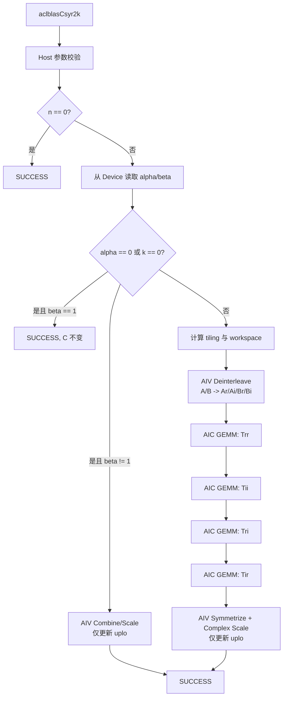

# aclblasCsyr2k 算子设计文档

> 文档状态：设计方案  
> 目标平台：Ascend 950PR  
> 目标软件版本：CANN 9.1.0  
> 数据类型：COMPLEX64（`aclblasComplex`）

# 1. 需求背景（required）

## 1.1 需求来源

本需求来源于 `aclblasCsyr2k` Ascend 950PR 社区算子开发任务。目标是在 `ops-blas` 仓中新增单精度复数对称秩-2k 更新接口，使用 Ascend C kernel 直调方式完成 Host 参数校验、stream 绑定、workspace 管理、AIC/AIV kernel 调度、精度与性能验证，并最终合入。

接口语义对齐 cuBLAS `cublasCsyr2k` 和 Netlib BLAS `csyr2k`。本任务的特殊约定是：`ACLBLAS_OP_C` 按 `ACLBLAS_OP_T` 处理，但不执行共轭。

参考资料：

- [ops-blas 开源仓](https://gitcode.com/cann/ops-blas)
- [cuBLAS syr2k 接口说明](https://docs.nvidia.com/cuda/cublas/index.html#cublas-t-syr2k)
- [Netlib CSYR2K 参考实现](https://www.netlib.org/blas/csyr2k.f)
- [生态算子开源精度标准](https://gitcode.com/cann/opbase/blob/master/docs/zh/ops_precision_standard/experimental_standard.md)

## 1.2 背景介绍

`aclblasCsyr2k` 计算复数对称矩阵的秩-2k 更新：

```text
C = alpha * (op(A) * op(B)^T + op(B) * op(A)^T) + beta * C
```

其中：

- `trans = ACLBLAS_OP_N` 时，`op(A)=A`、`op(B)=B`，A/B 的逻辑形状为 `n x k`；
- `trans = ACLBLAS_OP_T` 或 `ACLBLAS_OP_C` 时，`op(A)=A^T`、`op(B)=B^T`，A/B 的物理形状为 `k x n`；
- 所有矩阵均为列主序，`lda`、`ldb`、`ldc` 以复数元素为单位；
- C 是复数对称矩阵，不是厄米特矩阵；转置过程不共轭，对角元素虚部不强制为 0；
- 只引用并更新 `uplo` 指定的三角区域，另一三角区域保持原值。

`aclblasComplex` 已在 `include/cann_ops_blas_common.h` 中定义为两个连续 FP32 分量：

```cpp
typedef struct aclblasComplex {
    float real;
    float imag;
} aclblasComplex;
```

## 1.3 当前代码基线分析

截至本文档生成时，`ops-blas` 基线中尚无 `aclblasCsyr2k` 声明和实现。

# 2. 需求分析（required）

## 2.1 需求描述

在 Ascend 950PR 上提供以下公共接口：

```cpp
aclblasStatus_t aclblasCsyr2k(
    aclblasHandle_t handle,
    aclblasFillMode_t uplo,
    aclblasOperation_t trans,
    int n, int k,
    const aclblasComplex* alpha,
    const aclblasComplex* A, int lda,
    const aclblasComplex* B, int ldb,
    const aclblasComplex* beta,
    aclblasComplex* C, int ldc);
```

接口通过 `handle` 中绑定的 stream 下发计算，返回值为 `aclblasStatus_t`。本基线设计为判定 Device 标量分支会在 kernel 下发前执行一次标量回读同步；所有计算 kernel 仍在 handle stream 上有序执行，调用方读取 C 前必须同步对应 stream。

## 2.2 参数与约束

| 参数 | 存储位置 | 类型 | 语义与约束 | 非法行为 |
| --- | --- | --- | --- | --- |
| `handle` | Host | `aclblasHandle_t` | 已创建且有效，携带 stream | `nullptr` 返回 `ACLBLAS_STATUS_HANDLE_IS_NULLPTR` |
| `uplo` | Host | 枚举 | `ACLBLAS_UPPER` 或 `ACLBLAS_LOWER` | 其他值返回 `ACLBLAS_STATUS_INVALID_VALUE` |
| `trans` | Host | 枚举 | `OP_N`、`OP_T`、`OP_C`；`OP_C` 按无共轭 `OP_T` 执行 | 其他值返回 `ACLBLAS_STATUS_INVALID_VALUE` |
| `n` | Host | `int` | `n >= 0`，C 的阶数 | `n < 0` 返回 `INVALID_VALUE` |
| `k` | Host | `int` | `k >= 0`，归约维 | `k < 0` 返回 `INVALID_VALUE` |
| `alpha` | Device | `COMPLEX64` 标量指针 | 不可为空 | `nullptr` 返回 `INVALID_VALUE` |
| `A` | Device | `COMPLEX64` 矩阵 | `k > 0` 时不可为空；列主序 | 不满足时返回 `INVALID_VALUE` |
| `lda` | Host | `int` | N：`lda >= max(1,n)`；T/C：`lda >= max(1,k)` | 不满足时返回 `INVALID_VALUE` |
| `B` | Device | `COMPLEX64` 矩阵 | `k > 0` 时不可为空；列主序 | 不满足时返回 `INVALID_VALUE` |
| `ldb` | Host | `int` | N：`ldb >= max(1,n)`；T/C：`ldb >= max(1,k)` | 不满足时返回 `INVALID_VALUE` |
| `beta` | Device | `COMPLEX64` 标量指针 | 不可为空；值为 0 时不读取 C 的被更新三角 | `nullptr` 返回 `INVALID_VALUE` |
| `C` | Device | `COMPLEX64` 矩阵 | 不可为空；列主序；仅指定三角原地更新 | `nullptr` 返回 `INVALID_VALUE` |
| `ldc` | Host | `int` | `ldc >= max(1,n)` | 不满足时返回 `INVALID_VALUE` |

按任务书的显式约束，参数合法性检查先于 no-op 判定。因此即使 `n=0`，`alpha`、`beta`、C 和前导维等参数仍须满足接口约束；A/B 是否可空只由 `k==0` 决定。

## 2.3 功能语义

### 2.3.1 非厄米特对称语义

对任意复数矩阵 X，本算子使用普通转置 `X^T`，不使用共轭转置 `X^H`。因此：

- 非对角元素不做共轭；
- 对角元素可保留非零虚部；
- Kernel 不执行 HERK 中的“对角虚部置零”步骤。

### 2.3.2 三角引用语义

- `UPPER`：只读取/更新 `i <= j` 的 C 元素；
- `LOWER`：只读取/更新 `i >= j` 的 C 元素；
- 未指定三角不参与 beta 缩放，不应被搬入 UB，也不应被写回；
- 当 `beta=(0,0)` 时，被更新三角的旧 C 值不应被读取，避免无效值、NaN 或 Inf 传播。

### 2.3.3 no-op 和退化路径

复数零值要求实部、虚部同时为 0；复数一要求 `(1,0)`。

| 条件 | 行为 | A/B 是否参与计算 | C 行为 |
| --- | --- | --- | --- |
| `n == 0` | 合法 no-op | 否 | 不访问、不修改 |
| `(alpha == 0 || k == 0) && beta == 1` | quick return | 否 | 不访问、不修改 |
| `(alpha == 0 || k == 0) && beta == 0` | 退化路径 | 否 | 指定三角置 `(0,0)`，另一三角不变 |
| `(alpha == 0 || k == 0) && beta != 0/1` | 退化路径 | 否 | 指定三角执行复数 `beta*C` |
| 其他 | 完整路径 | 是 | 指定三角执行完整公式 |

## 2.4 复数乘法拆解

定义：

```text
X = op(A) = Xr + i*Xi
Y = op(B) = Yr + i*Yi
P = X * Y^T
```

原公式中的两个乘积满足：

```text
op(B) * op(A)^T = P^T
```

因此只需计算一次复数 GEMM，再做对称化：

```text
S = P + P^T
C = alpha*S + beta*C
```

P 使用 4 个 FP32 Cube GEMM 计算：

```text
Trr = Xr * Yr^T
Tii = Xi * Yi^T
Tri = Xr * Yi^T
Tir = Xi * Yr^T

Pr = Trr - Tii
Pi = Tri + Tir
```

最终对称结果为：

```text
Sr(i,j) = Trr(i,j) + Trr(j,i) - Tii(i,j) - Tii(j,i)
Si(i,j) = Tri(i,j) + Tri(j,i) + Tir(i,j) + Tir(j,i)
```

若 `alpha=ar+i*ai`、`beta=br+i*bi`、旧 C 为 `Cr+i*Ci`，则：

```text
outReal = ar*Sr - ai*Si + br*Cr - bi*Ci
outImag = ar*Si + ai*Sr + br*Ci + bi*Cr
```

本方案使用 4M 分解而不是 3M 分解。原因是其与仓内 `aclblasCgemm`/`aclblasCherk` 的 FP32 Cube 路径一致，不需要额外构造 `(Xr+Xi)` 和 `(Yr+Yi)` 矩阵，数值误差也更易按 FLOAT32 标准控制。

## 2.5 需求拆解

1. 在 `include/cann_ops_blas.h` 新增公共接口声明。
2. 完成全部参数检查、状态码映射和 `OP_C -> OP_T` 规范化。
3. 读取 Device 侧复数 alpha/beta，正确选择 no-op、仅缩放或完整计算路径。
4. 将 A/B 的 interleaved COMPLEX64 数据拆分成 FP32 实部/虚部平面。
5. 在 AIV 上完成转置对称化、复数 alpha/beta 运算、三角掩码和写回。
6. 覆盖 N/T/C、UPPER/LOWER、padding leading dimension、零维、空指针、Inf/NaN 和性能场景。
7. 在 Ascend 950PR + CANN 9.1.0 环境完成精度、性能和 msprof 路由验证。

# 3. 详细设计（required）

## 3.1 总体架构



正常路径包含 1 个 AIV 拆分 kernel、4 个 AIC FP32 GEMM kernel 和 1 个 AIV 合并 kernel。所有 kernel 均下发到 `handle->stream`，依赖同一 stream 的顺序语义，无需中间 Host 同步。

Device 标量需要在 Host 侧判定 quick return。设计新增 `ReadComplexAlphaBetaFromDevice`，在同一 stream 上提交两次 D2H copy 后只同步一次；该同步仅用于获取分支条件。后续计算仍按 handle stream 下发。若后续性能分析表明标量回读是主要瓶颈，可增加 Device 侧标量门控版本，消除 Host 分支同步。

## 3.2 文件与模块设计

| 文件 | 设计内容 |
| --- | --- |
| `include/cann_ops_blas.h` | 新增 `aclblasCsyr2k` 公共声明 |
| `blas/syr2k/csyr2k_host.cpp` | 参数校验、标量读取、分支、tiling、workspace、kernel 调度 |
| `blas/syr2k/csyr2k_tiling_data.h` | AIV 拆分和合并阶段的 tiling 结构与常量 |
| `blas/syr2k/csyr2k_kernel.h` | 拆分、合并 kernel launcher 声明 |
| `blas/syr2k/csyr2k_kernel.cpp` | A/B 拆分、对称化、复数缩放与三角写回 |
| `blas/syr2k/README.md` | 增加 Csyr2k 功能、接口、平台和约束说明 |
| `cmake/asc_devkit_version.cmake` | 增加 `CSYR2K` Tensor API 门控项 |
| `test/syr2k/csyr2k/` | 参数模型、cblas golden、GTest 驱动 |
| `test/syr2k/csyr2k/` | 950PR NPU wrapper、CSV 用例 |

## 3.3 Host 侧设计

### 3.3.1 参数校验顺序

为保证状态码稳定，按以下顺序校验：

1. `handle`；
2. `n`、`k` 是否非负；
3. `uplo`、`trans` 枚举；
4. `lda`、`ldb`、`ldc`；
5. `alpha`、`beta`、C；
6. `k > 0` 时 A、B；
7. 全部合法后处理 `n==0` no-op。

所有乘法和加法形式的字节数计算使用 `size_t`，在申请 workspace 前执行溢出检查。发生溢出或 runtime 内存申请失败时返回仓库已有的对应错误码，不截断为 32 位。

### 3.3.2 标量读取与分支

Host 将 alpha/beta 各复制 `sizeof(aclblasComplex)` 字节到 Host 临时变量，获取：

```text
isAlphaZero = alpha.real == 0 && alpha.imag == 0
isBetaZero  = beta.real  == 0 && beta.imag  == 0
isBetaOne   = beta.real  == 1 && beta.imag  == 0
skipGemm    = isAlphaZero || k == 0
```

`n==0` 在标量读取前返回。`skipGemm && isBetaOne` 不申请 workspace、不下发 kernel。其他退化路径只下发 combine/scale kernel。

### 3.3.3 GEMM 参数映射

A/B 拆分后保持原物理形状和列主序：

```text
physicalRows = (trans == N) ? n : k
physicalCols = (trans == N) ? k : n
```

P 的 GEMM 转置组合为：

| 原接口 trans | X | Y^T | FP32 GEMM transA | FP32 GEMM transB |
| --- | --- | --- | --- | --- |
| N | A | B^T | N | T |
| T/C | A^T | B | T | N |

`OP_C` 在构造 tiling 前统一改写为 `OP_T`，整个流程不设置 conjugate 标志。

四路 GEMM 的矩阵组合为：

| 中间结果 | 左矩阵 | 右矩阵 |
| --- | --- | --- |
| Trr | Ar | Br |
| Tii | Ai | Bi |
| Tri | Ar | Bi |
| Tir | Ai | Br |

Cube tiling 使用 `Csyr2kGemmTilingData` 和 SYRK Tensor API 流水：`baseM=16`、`baseN=16`、调优后的 `baseK=16`，`tileM/tileN` 上限为 128，`tileKChunk` 上限为 256。Host 根据 n 和 AIC 数量计算 `singleCoreM/singleCoreN`，4 个 GEMM 共享同一 tiling；kernel 内以二维 tile 网格跨核循环，直接处理 N/T 布局和尾块。

### 3.3.4 AIV tiling

拆分阶段建议定义：

```cpp
struct Csyr2kDeinterleaveTilingData {
    uint32_t rows;
    uint32_t cols;
    uint32_t lda;
    uint32_t ldb;
};
```

合并阶段建议定义：

```cpp
struct Csyr2kCombineTilingData {
    uint32_t n;
    uint32_t ldc;
    uint32_t tempLdc;
    float alphaReal;
    float alphaImag;
    float betaReal;
    float betaImag;
    uint8_t uploMode;
    uint8_t skipTemp;
    uint8_t isBetaZero;
};
```

实现采用 SIMT vector-function，单 block 使用 2048 个线程。拆分和合并阶段的 block 数均按 `ceil(logicalElementCount / 2048)` 计算，再限制到 `GetAivCoreCount()`，且至少为 1。每个线程按全局 stride 遍历列主序逻辑元素，因此无需二维 UB tiling，也不会访问 leading-dimension padding。

### 3.3.5 Workspace 设计

定义：

```text
matrixElems = physicalRows * physicalCols = n*k
matrixPlaneBytes = Align512(matrixElems * sizeof(float))
tempLdc = CeilAlign(n, 16)
tempPlaneBytes = Align512(tempLdc * n * sizeof(float))
```

正常路径 workspace 布局为：

```text
| Ar | Ai | Br | Bi | Trr | Tii | Tri | Tir |
```

总字节数：

```text
workspaceBytes = 4*matrixPlaneBytes + 4*tempPlaneBytes
```

退化路径不需要 Ar/Ai/Br/Bi 和 Trr/Tii/Tri/Tir，workspace 需求为 0。以 `n=k=4096` 为例，上式约为 512 MiB；任务书不设置内存验收指标，但实现和自测报告应记录实际 workspace，并在分配失败时返回明确错误码。

## 3.4 Kernel 侧设计

### 3.4.1 Phase 0：A/B 复数拆分（AIV）

单个 AIV kernel 同时处理 A 和 B，减少一次 kernel launch。SIMT 线程以 `index = row + col*physicalRows` 遍历逻辑矩阵：

1. 由 `row=index%rows`、`col=index/rows` 计算列主序坐标；
2. 分别按 `(col*lda+row)*2` 和 `(col*ldb+row)*2` 读取 interleaved 实部/虚部；
3. 将 Ar/Ai/Br/Bi 写入紧凑 FP32 平面，实数平面的 leading dimension 为 `physicalRows`；
4. 网格 stride 循环覆盖尾元素，只访问逻辑矩阵区域，不读取 leading-dimension padding。

当 `skipGemm=true` 时不下发该 kernel，因此 alpha 为 0 或 k 为 0 时 A/B 内容不会参与计算。

### 3.4.2 Phase 1：4 路 FP32 GEMM（AIC）

复用 `SyrkGemmKernelImpl` 并提供 `csyr2k_gemm_kernel_do` 专用入口：

```text
GM -> L1 -> L0A/L0B -> Mmad(FP32 accumulate) -> Fixpipe -> GM temp
```

关键策略：

- A/B 实部和虚部统一为 FP32，L0C 使用 FP32 累加；
- K 方向按最大 `tileKChunk=256` 切分，基本 K 粒度暂定为 16；
- M/N 二维分核，并对尾 M/N/K 做实际长度处理；
- L1/L0 使用现有 ping-pong 和事件同步；
- 通过 Host 的 N/T 映射直接完成逻辑转置，不增加独立 transpose kernel；
- 4 个 GEMM 顺序下发到同一 stream，复用同一份 tiling 配置。

### 3.4.3 Phase 2：对称化与复数缩放（AIV）

SIMT 线程以网格 stride 遍历 `n*n` 个逻辑位置，并在任何 GM 读取前判断 `row<=col`（UPPER）或 `row>=col`（LOWER）。对每个目标元素：

1. 以 `direct=col*tempLdc+row` 读取 Trr/Tii/Tri/Tir 的 `(i,j)`；
2. 以 `transpose=row*tempLdc+col` 读取 `(j,i)`，消除独立转置 kernel；
3. 按 §2.4 公式得到 Sr/Si；
4. 执行复数 alpha 缩放；
5. `beta != 0` 时只读取 C 的目标三角元素，并执行复数 beta 累加；
6. `beta == 0` 时不读取旧 C；
7. 仅写回目标三角的实部和虚部。

未指定三角在线程掩码处直接跳过，不采用“整块写入后恢复”的方式，因此满足另一三角不被引用且逐位保持不变的语义。

与 `aclblasCherk` 的差异：

- 不共轭；
- 虚部使用加法组合，而非 Hermitian 的反对称减法；
- 不执行 `ZeroDiagonal`，对角虚部按公式保留；
- alpha、beta 均为复数；
- 只写目标三角，不通过读取并恢复另一三角来维持原值。

### 3.4.4 退化路径 Kernel

`skipTemp=true` 时 combine kernel 不访问任何 GEMM 临时矩阵：

- `beta==0`：生成复数零并只写目标三角；
- 其他 beta：读取目标三角 C，执行复数乘法后原地写回；
- `beta==1` 已由 Host quick return，不下发 kernel。

## 3.5 数据流与内存访问

```text
A(COMPLEX64, column-major) ─┬─> Ar(FP32) ─┬─> Trr ─┐
                            └─> Ai(FP32) ─┼─> Tii ─┤
B(COMPLEX64, column-major) ─┬─> Br(FP32) ─┼─> Tri ─┼─> 对称化 -> alpha/beta -> C(uplo)
                            └─> Bi(FP32) ─┴─> Tir ─┘
```

输入和输出偏移均以复数元素为逻辑单位：

```text
A(i,j) address = A + (i + j*lda)
B(i,j) address = B + (i + j*ldb)
C(i,j) address = C + (i + j*ldc)
```

实际字节偏移乘以 `sizeof(aclblasComplex)`。实数 workspace 平面按 `sizeof(float)` 计算。SIMT 线程逐元素处理尾部，workspace 各平面起始地址按 512 字节对齐，且禁止读取逻辑矩阵之外的 padding。

## 3.6 性能优化方案

1. **利用结果对称性**：只计算 `P=op(A)*op(B)^T`，再使用 `P+P^T`，避免朴素方案分别计算两个复数 GEMM（由 8 个实数 GEMM 降为 4 个）。
2. **复用 FP32 Cube GEMM**：采用仓内已验证的 Tensor API、Mmad、Fixpipe 和多核切分，不在 AIV 上模拟大规模矩阵乘。
3. **融合 A/B 拆分**：一个 AIV kernel 同时完成 A、B 的实虚分离，减少启动开销。
4. **消除显式转置**：通过 GEMM N/T layout 和 combine 阶段的交换坐标读取处理转置。
5. **三角掩码**：combine 阶段在线程读取 GM 前跳过未引用三角，保证另一三角不被读取或写入。
6. **退化路径裁剪**：`alpha=0`、`k=0`、`beta=0/1` 时跳过不需要的拆分、GEMM、C 读取或全部 kernel。
7. **统一 tiling**：4 路 GEMM 共享同一 tiling，减少 Host 计算和代码分支；大 shape 优先提高 AIC 利用率，小 shape 通过实际使用核数降低空核开销。
8. **热点调优计划**：以任务书 3 个必测 case 为主，使用 msprof 分别检查 deinterleave、4 个 GEMM、combine 的耗时和带宽；根据 profiling 数据评估 tiling、GEMM 数量、临时矩阵和 GM 流量的优化空间。当前设计保持严格 FP32，HF32 等模式仅在完成全量精度验证后评估是否启用。

不在缺少实测证据时承诺固定加速比。最终性能结论以 Ascend 950PR、相同 shape/dtype、warmup 后超过 50 次采样的平均单次耗时为准。

## 3.7 支持硬件

| 支持的芯片版本 | 支持情况 | 说明 |
| --- | --- | --- |
| Ascend 950PR | 支持 | CANN 9.1.0 |

## 3.8 算子约束限制

- 仅支持 `aclblasComplex`/COMPLEX64；不支持 COMPLEX128。
- 矩阵为列主序，只支持 `lda/ldb/ldc` 表达的二维 padding；不支持任意非连续 Tensor 视图。
- 不支持 broadcast。
- `n`、`k` 为运行时参数，但接口维数类型固定为 `int`。
- C 原地更新，只更新 `uplo` 指定三角。
- 不提供确定性计算承诺；同一执行路径应满足规定精度阈值。
- `OP_C` 当前按任务书约定映射为无共轭 `OP_T`。若后续研发确认改变该口径，需要同步接口文档、golden 和测试用例。
- workspace 由 handle 的默认 workspace 机制管理，超大 shape 可能因 workspace 不足返回错误。

# 4. 可维可测分析

## 4.1 精度标准/性能标准

| 验收标准 | 描述 | 标准来源 |
| --- | --- | --- |
| 精度标准 | COMPLEX64 的实部/虚部分别按 FLOAT32 判定：`rtol=2^-10`、`atol=2^-16`、`matched_ratio>=0.99`，且 `max_abs_error<=1e-2` 或 `32*ULP` | 任务书与生态算子开源精度标准 |
| 功能标准 | 指定三角与 cblas `cblas_csyr2k` golden 比对；未指定三角逐元素保持不变 | 任务书 |
| 性能标准 | Ascend 950PR 上 warmup 后有效采样超过 50 次，平均单次耗时不高于任务书标杆 | 任务书 |

必测性能 case：

| case | n | k | uplo | trans | 目标 Avg time |
| --- | ---: | ---: | --- | --- | ---: |
| 1 | 1024 | 1024 | UPPER | OP_N | <= 121.34 us |
| 2 | 2048 | 2048 | UPPER | OP_N | <= 633.90 us |
| 3 | 1024 | 1024 | LOWER | OP_T | <= 130.52 us |

## 4.2 测试设计

使用任务随附的 1200 条 CSV 用例作为基础测试集：1000 条精度/功能用例和 200 条性能用例。通过 GTest 读取 CSV，调用 `aclblasCsyr2k`，并使用 Netlib/cblas `cblas_csyr2k` 生成单一 golden。

| 测试类别 | 覆盖内容 | 关键检查 |
| --- | --- | --- |
| 基础组合 | UPPER/LOWER x N/T/C x 小 shape | 公式、OP_C 无共轭、对角虚部保留 |
| 尺寸扫描 | 0、1、质数、2 的幂、幂 ±1、非对齐、2048/4096 | 头尾块、分核和地址边界 |
| 非方形 | `k << n`、`k >> n` | N/T 下物理 shape 与 leading dimension |
| 标量 | 0、1、-1、纯虚数、一般复数、大值 | quick return、复数乘法、NaN/Inf 传播 |
| leading dimension | 最小值和多种 padding | 只访问逻辑矩阵，不覆盖 padding |
| 三角保持 | UPPER/LOWER，beta 为 0 和非 0 | 未指定三角 bitwise 保持不变 |
| 负向 | 空 handle/指针、非法枚举、负 n/k、非法 lda/ldb/ldc | 返回值与任务书一致，不下发非法 kernel |
| 性能 | 任务书 3 个必测 case 和混合 shape | warmup、>50 次均值、阶段耗时 |

特殊值测试需分别检查实部和虚部；Inf/NaN 用例按 cblas 参考结果和比较器约定处理。`beta=0` 用例应将 C 的被更新三角预置为 NaN，以验证 kernel 未读取旧 C。

## 4.3 可观测性与问题定位

Host 日志至少输出：

- 接口参数和非法参数原因；
- `skipGemm/isBetaZero/isBetaOne` 分支；
- `physicalRows/physicalCols/tempLdc/workspaceBytes`；
- AIC/AIV 使用核数、GEMM N/T 映射和主要 tiling 参数；
- runtime copy、workspace 申请和 kernel launch 的失败码。

msprof 验证应能观察到完整路径的 1 个 deinterleave AIV kernel、4 个 AIC GEMM kernel 和 1 个 combine AIV kernel。退化路径不应出现 GEMM kernel。性能统计须区分首次加载、Host 标量回读、辅助 AIV kernel、单个 GEMM kernel 和 ACLBLAS 总调用时间。

## 4.4 兼容性分析

`aclblasCsyr2k` 是新增公共符号，不改变已有 `aclblasSsyr2k`、`aclblasCherk` 和其他产品线接口行为，ABI 风险较低。声明加入统一的 `include/cann_ops_blas.h`，保证不同产品线共用同一 API 名称。

## 4.5 风险与待确认项

| 风险/待确认项 | 影响 | 处理方案 |
| --- | --- | --- |
| `OP_C` 语义仍为任务书记录的开放问题 | 可能影响接口兼容与 golden | 当前严格按 `OP_T` 无共轭实现；口径变化时同步代码、文档和用例 |
| Device 标量回读引入 stream 同步 | 可能影响小 shape Host 总耗时 | 先复用仓内安全路径；用 profiler 判断后再评估 Device 侧门控 |
| 4 个完整 n x n 临时矩阵 workspace 较大 | 大 shape 内存占用高 | 使用 512B 对齐和 checked arithmetic；后续可评估分阶段复用 temp，但须以性能实测为准 |
| 4M 分解有多次 FP32 加减 | 大 k 或抵消场景误差增大 | 使用严格 FP32 Cube 累加；如评估 HF32，须先完成全量精度验证 |
| 合并阶段需同时读取 `(i,j)` 与 `(j,i)` | GM 带宽可能成为瓶颈 | 交换坐标二维搬运、跳过未引用块，针对对角块单独优化 |
| 四路严格 FP32 GEMM 可能不满足任务性能线 | 存在性能验收风险 | 评估面向三角输出的融合复数 Cube/3M 路径，减少 GEMM 数量、临时矩阵和重复 GM 流量，并完成全量精度回归 |
