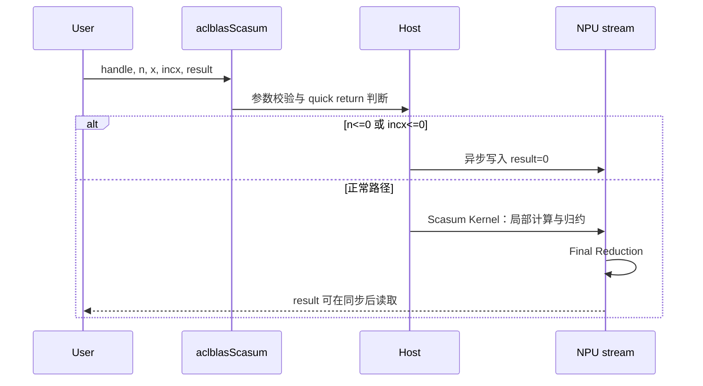
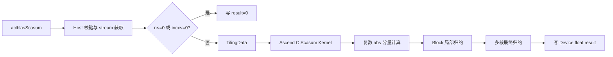
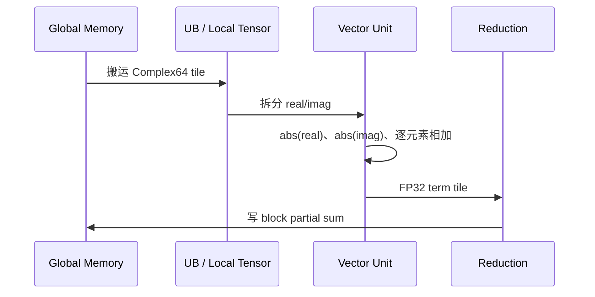
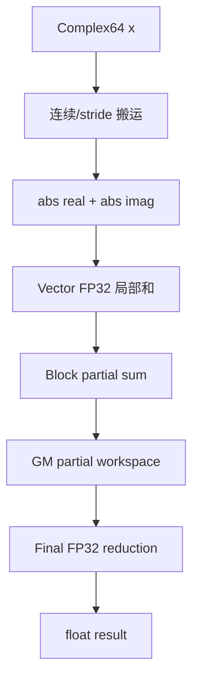

# aclblasScasum 算子设计文档

| 项目         | 内容                                      |
| ------------ | ----------------------------------------- |
| 任务名称     | 8月社区任务-aclblasScasum 算子开发（950）（`08-26-aclblasScasum`） |
| 提交账号/团队目录 | `lihaokun-2026` |
| 文档路径 | `04_tasks/01_community-task-2026/tasklist/08-26-aclblasScasum/lihaokun-2026/docs/design.md` |
| 目标代码仓   | `https://gitcode.com/cann/ops-blas`     |
| 目标代码目录 | `blas/asum`                     |
| 目标硬件     | Atlas 950PR（`ascend950` / `arch35`）                               |
| 验收软件版本 | CANN 9.1.0                                |
| 文档版本     | v0.1                                      |

---

## 1. 需求背景

### 1.1 需求来源

本算子来源于 CANN 社区 8 月任务，目标是在 Atlas 950PR 上使用 Ascend C 实现单精度复数向量绝对值分量之和，并以 ops-blas 统一 BLAS 接口形式交付。

算子与 cuBLAS `cublasScasum`、Netlib BLAS `scasum` 的核心语义保持一致：对复数向量的每个采样元素计算实部和虚部绝对值之和，再归约为一个 `float` 标量。

### 1.2 数学定义

设输入为交错存储的复数向量 `x`，第 `k` 个逻辑元素的实部和虚部分别为 `Re(x[k])`、`Im(x[k])`，则：

$$
\operatorname{Scasum}(x,n,incx)=\sum_{i=0}^{n-1}\left(|\operatorname{Re}(x[i\cdot incx])|+|\operatorname{Im}(x[i\cdot incx])|\right).
$$

`aclblasComplex` 按 `{float real; float imag;}` 交错布局存储，因此第 `j` 个物理复数元素对应两个连续 `float`：`x[2j]` 与 `x[2j+1]`。当 `n > 0` 且 `incx > 0` 时，访问的物理复数元素数为：

$$
1+(n-1)\times incx.
$$

### 1.3 功能边界

**交付范围：**

- `COMPLEX64` 输入、`FLOAT32` 标量输出；
- `n` 运行时传入，支持大规模向量；
- 正步长 `incx > 0` 的连续及跨步访问；
- `n <= 0` 或 `incx <= 0` 的 quick return；
- Ascend C 设备侧并行绝对值计算和归约；
- handle/stream 句柄式 BLAS 调用；
- Atlas 950PR `arch35` 实现及 CSV 驱动 GTest 测试。

**不交付：**

- 负步长反向遍历；
- 复数平方和、复数范数或其他 ASUM 变体；
- 多向量 batch/broadcast；
- 动态 shape 编译期特化；
- 950PR 私有平行 API；
- Host 侧遍历整个输入或把数据复制回 Host 后计算。

---

## 2. 需求分析

### 2.1 需求拆解

| 编号 | 模块          | 需求                                                      |
| ---- | ------------- | --------------------------------------------------------- |
| F1   | 公共 API      | 在`include/cann_ops_blas.h` 新增 `aclblasScasum` 声明 |
| F2   | Host 接口     | 校验 handle、指针、整数参数并绑定 stream                  |
| F3   | Quick return  | `n <= 0` 或 `incx <= 0` 时写零，不启动 kernel         |
| F4   | 数据访问      | 支持复数交错布局和正`incx` 跨步访问                     |
| F5   | Device Kernel | Ascend C 并行计算`abs(real)+abs(imag)`                  |
| F6   | Reduction     | 多核、多 Block 局部和及最终标量归约                       |
| F7   | 数值行为      | 保持 FP32 累加；允许归约顺序不同；溢出传播为`Inf`       |
| F8   | 工程集成      | 复用`sasum` 的 handle、编译、tiling 和测试框架          |
| F9   | 测试          | 覆盖功能、边界、特殊值、步长、性能和错误返回              |
| F10  | 性能          | 三个典型大规模 case 达到任务书规定的平均耗时              |

### 2.2 API 定义

公共头文件新增以下声明，参数顺序与 cuBLAS `cublasScasum` 以及仓内 `aclblasSasum` 保持同构：

```cpp
aclblasStatus_t aclblasScasum(
    aclblasHandle_t handle,
    int n,
    const aclblasComplex* x,
    int incx,
    float* result);
```

参数语义如下：

| 参数       | 方向 | 说明                                         |
| ---------- | ---- | -------------------------------------------- |
| `handle` | 输入 | 有效 ops-blas handle，携带执行 stream        |
| `n`      | 输入 | 逻辑复数元素个数；`n <= 0` 为 quick return |
| `x`      | 输入 | Device 端`COMPLEX64` 交错数组              |
| `incx`   | 输入 | 复数元素步长；`incx <= 0` 为 quick return  |
| `result` | 输出 | Device 端单个`float` 标量                  |

### 2.3 错误和 quick return 语义

校验顺序设计如下：

1. `handle == nullptr`：返回 `ACLBLAS_STATUS_HANDLE_IS_NULLPTR`；
2. `result == nullptr`：返回 `ACLBLAS_STATUS_INVALID_VALUE`，因为 quick return 仍需写回零；
3. 若 `n <= 0` 或 `incx <= 0`：通过当前 stream 将 `0.0f` 写入 `result`，不触发 Scasum kernel，返回 `ACLBLAS_STATUS_SUCCESS`；此路径不访问 `x`，因此 `x == nullptr` 仍合法；
4. 在正常计算路径（`n > 0 && incx > 0`）中，`x == nullptr`：返回 `ACLBLAS_STATUS_INVALID_VALUE`；
5. 其他内部执行或 stream 错误：转换为仓库统一的 `aclblasStatus_t`。

该顺序同时满足“quick return 不访问输入”和“输出必须可写”的要求。负步长不做反向遍历，按任务书定义为 quick return。

### 2.4 接口设计

#### 公共 C API

`aclblasScasum` 是 ops-blas 的句柄式 BLAS 接口。接口声明统一放置在公共头文件 `include/cann_ops_blas.h`，实现放置在 `blas/asum/arch35/`，不增加 Atlas 950PR 私有接口。

```cpp
aclblasStatus_t aclblasScasum(
    aclblasHandle_t handle,
    int n,
    const aclblasComplex* x,
    int incx,
    float* result);
```

接口参数、数据位置和生命周期如下：

| 参数       | 类型                      | 位置   | 语义                          |
| ---------- | ------------------------- | ------ | ----------------------------- |
| `handle` | `aclblasHandle_t`       | Host   | 有效句柄，携带执行 stream     |
| `n`      | `int`                   | Host   | 逻辑复数元素数量              |
| `x`      | `const aclblasComplex*` | Device | 交错存储的复数输入，只读      |
| `incx`   | `int`                   | Host   | 复数元素步长，不是 float 步长 |
| `result` | `float*`                | Device | 一个 FP32 输出标量            |

正常调用的执行语义为：Host 完成轻量参数检查和任务配置后，将设备任务提交到 `handle` 关联的 stream；接口返回不代表设备计算已经完成。调用方在读取 `result` 前必须同步该 stream。

### 3.2 Host 侧设计

Host 仅负责参数检查、地址范围检查、workspace/tiling 规划和 Kernel 发射；绝对值计算及归约全部在 NPU 完成。

#### 正常路径

    API["aclblasScasum"] --> HOST["Host：校验 / 地址检查 / Tiling / Workspace"]
    HOST --> QR{"n<=0 或 incx<=0?"}
    QR -->|是| ZERO["Device 写 result=0"]
    QR -->|否| LOAD["Ascend C：GM 读取 Complex64"]
    LOAD --> ABS["AIV：abs(real)+abs(imag)"]
    ABS --> LOCAL["Block 内 FP32 局部归约"]
    LOCAL --> PARTIAL["写入 FP32 partial workspace"]
    PARTIAL --> FINAL["Final Reduction Kernel"]
    FINAL --> OUT["写 Device FLOAT32 result"]

```

#### 图 3-2 调用时序



#### 代码组织

```text
ops-blas/
├── include/
│   └── cann_ops_blas.h                 # 公共 aclblasScasum 声明
├── blas/asum/arch35/
│   ├── scasum_host.cpp                 # 参数校验、Tiling、Kernel 调度
│   ├── scasum_kernel.cpp               # Ascend C 设备侧计算
│   ├── scasum_tiling_data.h            # TilingData 定义
│   └── CMakeLists.txt                  # arch35 构建接入
└── test/asum/scasum/arch35/
    ├── scasum_param.h                  # CSV 参数和复数数据生成
    ├── scasum_test.cpp                 # GTest
    ├── scasum_test.csv
    └── README.md
```

本算子不使用 CATLASS。Scasum 属于低算术强度的一维向量归约，采用 Ascend C Vector/DataCopy/归约能力更直接；仅复用 ops-blas 仓库的公共 handle、Kernel 注册、构建、测试和状态码框架。

### 3.2 Host 侧设计

Host 仅负责参数检查、workspace/tiling 规划和 kernel 发射；绝对值计算及归约全部在 NPU 完成。



实现目录如下：

```text
ops-blas/
├── include/
│   └── cann_ops_blas.h                 # 新增公共声明
├── blas/asum/arch35/
│   ├── scasum_host.cpp                 # Host API、校验、发射
│   ├── scasum_kernel.cpp               # Ascend C kernel
│   ├── scasum_tiling_data.h            # 运行时 tiling 数据
│   └── CMakeLists.txt                   # 接入 arch35 构建
└── test/asum/scasum/arch35/
    ├── scasum_param.h
    ├── scasum_test.cpp
    ├── scasum_test.csv
    └── README.md
```

公共 API 放入 `cann_ops_blas.h`。

### 3.2 Host 侧流程

#### 正常路径

1. 检查 handle 和 `result`；
2. 判断 quick return；
3. 检查 `x`；
4. 计算物理访问跨度，使用 64 位中间变量避免 `2 * (1 + (n-1)*incx)` 的 Host 整数溢出；
5. 根据 `n`、`incx`、输入布局和可用核心数生成 `ScasumTilingData`；
6. 分配或复用局部和 workspace；
7. 发射 Scasum kernel；
8. kernel 完成后把最终和写入 `result`。

`TilingData` 结构：

```python
ScasumTilingData {
  int32 n;              // 逻辑复数元素数量
  int32 incx;           // 复数元素步长，正常路径 > 0
  int32 blockCount;     // 参与计算的 block 数
  int32 tileElements;  // 每个 block 的逻辑元素数
  uint64 partialOffset;
  uint32 flags;
}
```

`incx` 的单位是复数元素，Kernel 计算地址时使用：

$$
\text{floatOffset}=2\times(i\times incx).
$$

#### Quick return 路径

不创建 `Scasum kernel` 的计算任务，不读取 `x`，仅使用仓库已有的 Device scalar/async memset 机制写 `result = 0.0f`。若仓库现有 Host 框架没有 `Device scalar` 写零封装，则新增最小化的通用写标量路径，不在 Host 端直接解引用 Device 指针。

### 3.3 Ascend C Kernel 设计

#### 数据读取与单元素变换

每个线程/Vector 子块处理一段逻辑复数元素。对第 `i` 个元素读取：

```python
real = x[2 * i * incx]
imag = x[2 * i * incx + 1]
term = abs(real) + abs(imag)
```

连续 `incx == 1` 时采用合并搬运；`incx > 1` 时按 stride 访问。由于性能 case 全部为 `incx == 1`，非连续路径优先保证正确性，并通过小规模 tile 避免无效搬运。

`abs(-0.0f)` 保持为 `+0.0f`。对于 `Inf`，结果按 IEEE FP32 传播；对于 `NaN`，结果是否为 NaN 按设备浮点语义判定，测试只要求与参考的 NaN 分类一致，不对 NaN payload 做比较。

#### Kernel 内流水



`incx == 1` 时优先采用连续搬运和向量化计算；`incx > 1` 时以逻辑复数下标计算地址，保证每次访问的两个 FP32 分量保持配对。尾块必须使用有效元素数，禁止读取超出物理输入范围的数据。

#### 分层归约

采用两级归约：

- **一级：** 每个 Vector 子组在 UB 中计算若干元素的 `term`，并以 FP32 进行局部累加；
- **二级：** 每个 Block 将子组局部和归约为一个 partial sum，写入 workspace；
- **三级：** 选定一个 final block 或专用归约 kernel 汇总 partial sum，并写 `result`。

当 `blockCount == 1` 时直接写最终结果，避免不必要的 workspace 和二次 kernel。多 Block 时使用固定的 Block 顺序进行最终归约；不承诺与 Netlib 逐位一致。



#### 数值和溢出

输入分量先转换或保持为 FP32，`abs(real)+abs(imag)` 和所有局部和均使用 FP32。由于所有项非负，正常数据的误差主要来自累加舍入。元素接近 `FLT_MAX` 且 `n` 较大时，FP32 结果允许溢出到 `+Inf`；不使用未规定的饱和或异常截断。

不采用 FP16 累加，不采用原子加作为默认实现，以避免精度和性能不可控。若多核最终归约需要原子操作，仅允许对 FP32 partial sum 使用仓库支持的原子能力，并通过精度和确定性测试验证；首选单独 final reduction kernel。

### 3.4 Workspace、并发与同步

- 输入 `x` 只读；输出 `result` 为独立 Device scalar；
- workspace 只保存每个 Block 的 FP32 partial sum，大小约为 `blockCount * sizeof(float)`；
- workspace 按仓库约定对齐；
- 不生成与 `n` 同规模的中间数组；
- 计算绑定到 `handle` 的 stream，接口返回后遵循 ops-blas 异步语义；
- Host 读取结果前必须同步对应 stream；
- 同一 handle 上的调用遵循已有 BLAS stream 顺序，不额外引入跨 stream 同步。

### 3.5 Tiling 与多核策略

| 场景          | 策略                                                    |
| ------------- | ------------------------------------------------------- |
| `incx == 1` | 连续向量化搬运，优先覆盖性能验收路径                    |
| `incx > 1`  | 以逻辑元素为单位计算地址，保证跨步语义                  |
| 小`n`       | 单 Block 直接归约，降低 kernel launch 和 workspace 开销 |
| 大`n`       | 多 Block 分片，每片产生一个 FP32 partial sum            |
| 尾块          | 以有效元素数保护，禁止越界读取                          |
| quick return  | Host 直接写零，不启动计算 kernel                        |

#### TilingData

```text
ScasumTilingData {
    int32 n;              // 逻辑复数元素数
    int32 incx;           // 复数元素步长，正常路径 > 0
    int32 blockCount;     // 计算 Block 数
    int32 tileElements;   // 每个 Block 负责的逻辑元素数
    uint64 partialOffset; // partial workspace 偏移
    uint32 flags;         // quick return/单阶段归约等标志
}
```

Block 划分按逻辑复数元素进行，而不是按底层 float 数组进行。对第 `blockId` 个 Block，其逻辑区间可表示为：

$$
[begin,end)=[blockId\times tileElements,\min((blockId+1)\times tileElements,n)).
$$

实际 float 地址由：

$$
offset_{float}=2\times(i\times incx)
$$

计算。Host 侧使用 64 位中间变量计算最后访问位置，避免大 `n`、大 `incx` 时发生 32 位整数溢出。

小规模输入采用单 Block 直接写结果；大规模输入采用多 Block 产生 partial sum，再执行最终归约。Block 数不能简单固定为最大核心数，应结合 `n`、tile 大小和 Kernel 启动开销选择。

性能计时包含必要的 kernel 发射和设备侧归约，不将输入生成、golden 计算和 Host 结果读取混入 kernel 性能统计。预热后有效采样超过 50 次，报告平均耗时。

---

## 4. 支持类型与约束

| 项目            | 设计                                                   |
| --------------- | ------------------------------------------------------ |
| 输入 dtype      | `COMPLEX64`，实部/虚部均为 FP32                      |
| 输出 dtype      | `FLOAT32`，单 Device scalar                          |
| 输入布局        | 交错复数布局，逻辑一维向量                             |
| `n`           | 任意`int`；`n <= 0` quick return                   |
| `incx`        | `incx > 0` 正常计算；`incx <= 0` quick return      |
| Device          | 输入和输出位于同一 NPU                                 |
| batch/broadcast | 不支持                                                 |
| 原地操作        | 不支持，`result` 独立于 `x`                        |
| 动态 shape      | `n` 作为运行时标量，不要求编译期动态 shape           |
| 内存            | 不额外规定用户可见内存；内部 workspace 为 partial sums |

---

## 5. 测试设计

### 5.1 测试方法

测试复用 `ops-blas` 和 `test/asum/sasum/` 的 CSV 驱动 GTest 组织方式，新增复数参数解析、复数输入生成和标量结果校验。测试程序真实调用 `aclblasScasum`，不在 Python 脚本中模拟负向结果。

当前工作目录已提供：

- `test_cases/scasum_test.csv`：功能、边界和性能用例；
- `test_cases/gen_csv.py`：固定种子可复现生成器；
- `test_cases/verify_accuracy.py`：编译并执行精度测试；
- `test_cases/verify_performance.py`：采集性能并关联基线。

默认生成 1000 条精度用例和 200 条性能用例。性能用例固定 `incx == 1`，非连续访问由功能用例覆盖。

### 5.2 功能矩阵

| 类别         | 覆盖内容                                                     |
| ------------ | ------------------------------------------------------------ |
| 基础         | `n=1/8`，`incx=1/2`                                      |
| 尺寸         | `0/1/2/3/7`、2 的幂、2 的幂±1、非对齐大尺寸至 `2^20`    |
| 步长         | `incx=1/2/3`，含尾块和跨步物理存储                         |
| 填充         | 随机、全零、正负交替、极端值、Inf、NaN                       |
| 溢出         | 大`n` 与接近 `FLT_MAX` 的分量组合                        |
| quick return | `n=0`、负 `n`、`incx=0`、负 `incx`，均要求写零并成功 |
| 指针错误     | 正常路径`x=nullptr`、`result=nullptr`                    |
| 句柄错误     | `handle=nullptr` 返回 `ACLBLAS_STATUS_HANDLE_IS_NULLPTR` |
| 稳定性       | 同一输入重复调用、不同 stream 顺序调用                       |
| 性能         | 任务书三个典型大规模 case 及规模扫描                         |

### 5.3 精度判定

golden 使用 cblas/Netlib `scasum` 语义生成。对于有限值，采用：

$$
|actual-golden|\le atol+rtol\times|golden|,
$$

其中：

- `rtol = 2^-10`；
- `atol = 2^-16`；
- 标量输出的 matched ratio 按单值判定，成功即为 1；
- `max_abs_error` 同时满足 `1e-2` 或 `32 * ULP` 限制；
- `Inf` 用例要求结果同为 `Inf`；
- `NaN` 用例检查 NaN 分类，不比较 payload；
- quick return 结果必须严格为 `0.0f`。

### 5.4 负向测试

所有负向用例必须进入真实 NPU API 路径，检查返回状态、输出是否被错误写入以及是否启动了不应启动的计算 kernel。特别验证 quick return 时 `x` 为空不应报错，但 `result` 为空仍无法写回零，应返回 `ACLBLAS_STATUS_INVALID_VALUE`。

### 5.5 性能测试

性能测试规则：

1. 固定 Atlas 950PR、CANN 9.1.0、`ascend950` 和代码 commit；
2. 首次编译、JIT 和内存初始化不计入有效样本；
3. 先 warmup，再采样至少 51 次；
4. 记录平均值、P50、P90、最小值、最大值和标准差；
5. 分别记录接口端到端时间与设备 kernel 时间；
6. 使用 `msprof` 或等价设备计时工具保留截图/原始结果；
7. 性能用例输入为连续 `incx=1`，避免步长引入不公平的访存差异。

---

## 6. 可维护性与兼容性

1. API 声明放入公共 `include/cann_ops_blas.h`，实现遵循现有 `aclblasSasum` 目录和命名规范。
2. Host 参数校验、handle 生命周期、stream 绑定和状态码复用 ops-blas 公共实现。
3. Kernel 只依赖 Ascend C 和仓库已有公共组件，不复制外部实现。
4. `incx` 始终按复数元素解释，避免与底层 float 地址步长混淆。
5. 采用 FP32 partial sum，独立 final reduction kernel，便于定位数据搬运、绝对值和归约问题。
6. 测试 CSV 固定随机种子，功能与性能用例分离，结果可复现。
7. 不改变 `aclblasSasum` 行为，不新增其他产品线私有入口。

---

## 7. 开发计划

| 阶段 | 内容                                                           |
| ---- | -------------------------------------------------------------- |
| P0   | 阅读 ops-blas 现有`sasum` 实现、公共头文件和 arch35 构建规范 |
| P1   | 新增公共声明、Host 骨架、quick return 和错误码路径             |
| P2   | 实现`incx=1` 的 Ascend C 单 Block/多 Block 归约              |
| P3   | 实现`incx>1`、尾块、workspace 和最终归约                     |
| P4   | 接入 CSV GTest，完成基础、边界、特殊值和溢出测试               |
| P5   | 完成 Atlas 950PR 性能调优和 P-01～P-03 复测                    |
| P6   | 输出自测报告、README、测试代码和 PR 交付材料                   |

---

## 8. 风险与待确认项

| 风险                                       | 处理方案                                                                                 |
| ------------------------------------------ | ---------------------------------------------------------------------------------------- |
| 任务书性能表与测试脚本基线口径可能存在差异 | 自测报告同时给出任务书绝对耗时上限和脚本基线/倍率结果，以任务书最终验收口径为准          |
| NaN 归约顺序可能影响 NaN 传播              | 只判定 NaN 分类；有限值和 Inf 单独按数值规则判定                                         |
| 大`incx` 造成物理地址跨度很大            | Host 使用 64 位计算并检查地址范围，Kernel 以复数元素为单位寻址                           |
| 多核归约顺序不同                           | 不做 bit-exact，按生态标准的标量误差阈值验收                                             |
| quick return 与空指针组合容易被错误校验    | 固化校验顺序：handle/result → quick return → x，并由专门负向用例验证                   |
| 测试工程暂时复用 sasum 参数框架            | 新增`scasum_param.h` 的 complex64 生成和标量 golden 逻辑，不能把复数内存误当成实数数组 |

---

## 9. 交付件

1. `include/cann_ops_blas.h` 中的 `aclblasScasum` 公共声明；
2. `blas/asum/arch35/` 下的 Host、Kernel、Tiling 和构建文件；
3. `test/asum/scasum/arch35/` 下的 GTest、参数解析、CSV 和 README；
4. 功能测试和性能测试原始结果；
5. 自测报告，包含设备、CANN 版本、commit、用例参数、标量精度结果、性能数据及截图；
6. ops-blas 算子 README 产品支持表中 Atlas 950PR 对 `aclblasScasum` 的支持说明；
7. 合入 ops-blas 的 PR 及对应测试代码 PR/提交记录。

---

## 10. 参考资料

1. ops-blas：`https://gitcode.com/cann/ops-blas`
2. Netlib BLAS `scasum`：`https://www.netlib.org/blas/scasum.f`
3. cuBLAS `cublasScasum` 文档：`https://docs.nvidia.com/cuda/cublas/index.html`
4. Ascend C 开发文档：`https://www.hiascend.com/document/detail/zh/CANNCommunityEdition/850/opdevg/Ascendcopdevg/atlas_ascendc_map_10_0002.html`
5. CANN 生态算子精度标准：`https://gitcode.com/cann/opbase/blob/master/docs/zh/ops_precision_standard/experimental_standard.md`
6. 本地测试指导：`test_cases/README.md`
7. 本地任务书：`aclblasScasum_Atlas950PR_task_doc.md`

---

## 修订记录

| 版本 | 日期       | 说明                             |
| ---- | ---------- | -------------------------------- |
| v0.1 | 2026-08-26 | 基于任务书、测试指导完成初版设计 |
