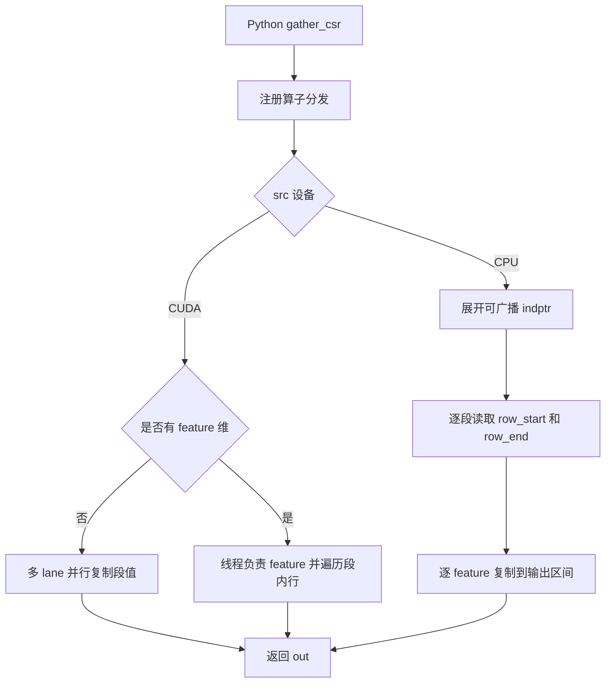
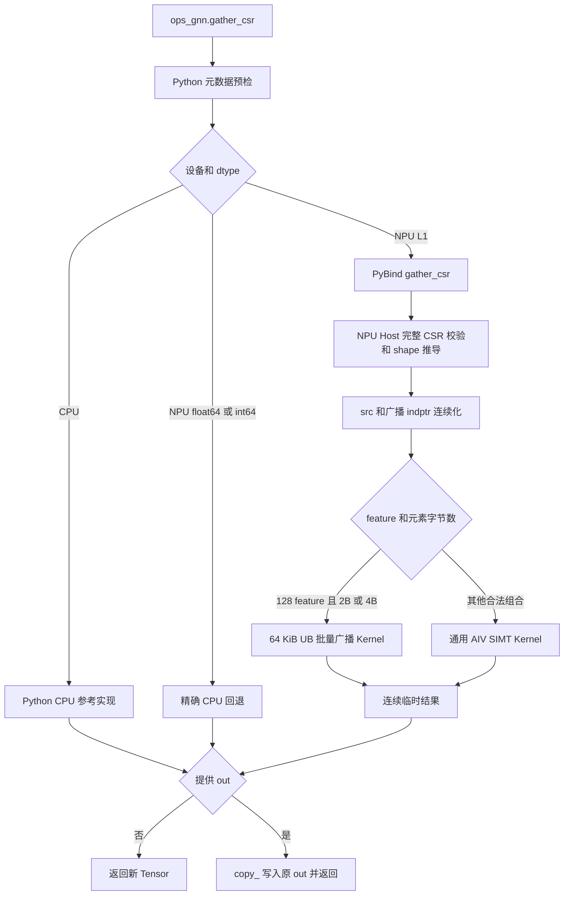
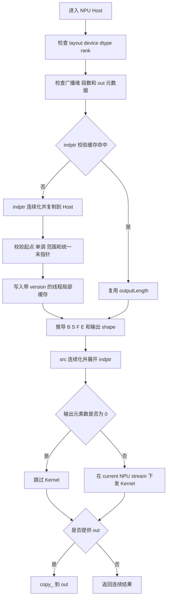
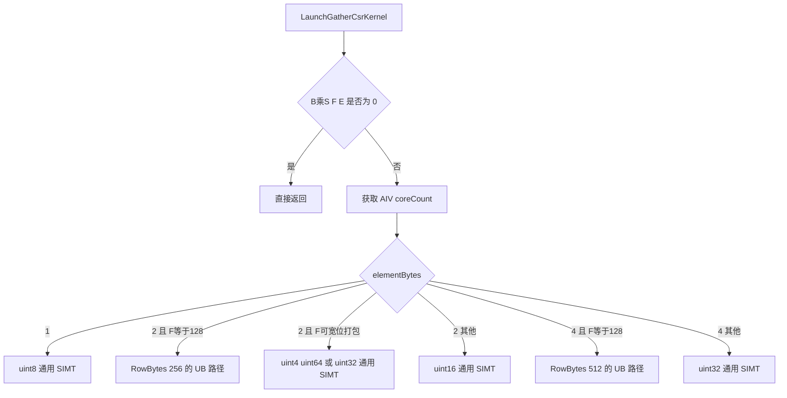
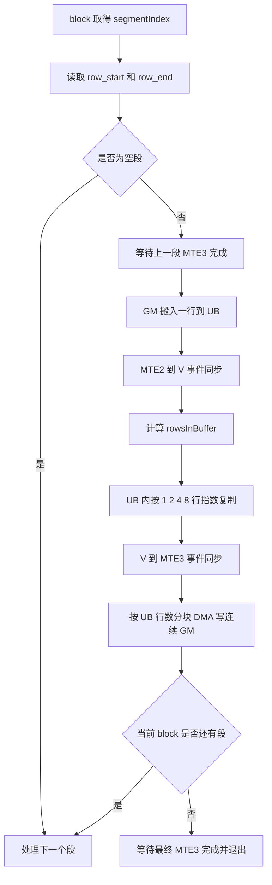

# gather_csr 算子设计文档

# 1. 需求背景（required）

## 1.1 需求来源

本文档对应《[8月社区任务 - gather_csr 算子开发任务书](../../../../docs/202608/gather_csr_task_doc.md)》，并按照《[算子设计文档模板](../../../../resources/design_template.md)》编写。

任务要求参考 `torch_scatter.gather_csr`（建议版本不低于 2.1.0），在 Ascend 950PR 上使用 Ascend C Kernel 和 Python PyTorch 适配层实现功能、接口和精度一致的 `gather_csr`，最终代码合入 `ops-gnn`。验收以 PyTorch 层接口为准，原生 ACLNN 接口不属于必选范围。

## 1.2 背景介绍

### 1.2.1 业务背景

CSR（Compressed Sparse Row）使用 `indptr` 描述每个段在展开序列中的起止位置。`gather_csr` 将按段压缩保存的特征扩展到逐元素或逐边表示，典型用途包括：

1. 将图中节点或分段特征广播到 CSR 边列表；
2. 执行 `segment_csr` 的结构对偶操作；
3. 在稀疏图消息传递中，将每段数据下发到该段对应的全部输出行。

例如：

```text
src    = [10, 20, 30, 40]
indptr = [0, 2, 5, 5, 6]
out    = [10, 10, 20, 20, 20, 40]
```

第三段满足 `indptr[2] == indptr[3]`，因此为空段，不产生输出。

### 1.2.2 与 segment_csr 的关系

`segment_csr` 将同一段内的多行输入归约为一个段值；`gather_csr` 则将一个段值复制到该段覆盖的所有输出行。两者的数据方向如下：

| 算子 | 输入段维 | 输出段维 | 核心操作 |
| --- | ---: | ---: | --- |
| `segment_csr` | `nnz` | `segment_count` | 段内归约 |
| `gather_csr` | `segment_count` | `nnz` | 段内广播复制 |

当 `segment_csr` 的归约为求和时，`gather_csr` 不是其数值逆运算；二者仅在 CSR 结构的数据流方向上互为对偶。

### 1.2.3 torch_scatter 参考实现分析

本设计以本地 `torch_scatter` 2.1.2 后续版本（提交 `f514c10`）为参考。相关模块如下：

| 模块 | 参考文件 | 行为 |
| --- | --- | --- |
| Python 接口 | `torch_scatter/segment_csr.py` | 将 `src`、`indptr`、可选 `out` 原样传入注册算子 |
| CPU 前向 | `csrc/cpu/segment_csr_cpu.cpp` | 展开广播后的 `indptr`，逐段、逐输出行、逐 feature 复制 |
| CUDA 前向 | `csrc/cuda/segment_csr_cuda.cu` | 标量和带 feature 两种 Kernel，按段读取边界后连续写出 |
| 算子注册 | `csrc/segment_csr.cpp` | 注册 `torch_scatter::gather_csr` 并实现 autograd 包装 |
| 功能测试 | `test/test_gather.py` | 覆盖 6 组标准值、`gather_coo` 等价、`out` 和非连续输入 |
| 空张量测试 | `test/test_zero_tensors.py` | 验证全零 shape 的输出行为 |

上游 CPU 核心逻辑可概括为：

```text
for each batch and segment i:
  row_start = indptr[i]
  row_end   = indptr[i + 1]
  value     = src[i, :]
  for row in [row_start, row_end):
    out[row, :] = value
```

上游 CUDA 在无 feature 时为每个段分配多个 lane 并行写输出行；存在 feature 时，一个线程负责一个 feature，并遍历段内输出行。本方案保留“按段定位、段内连续写”的语义，但根据 Ascend 950PR 的 SIMT 和 DMA 特性增加宽位复制与 UB 批量广播路径。

### 1.2.4 参考实现流程图



### 1.2.5 现有能力缺口

`ops-gnn` 原工程没有 `gather_csr`。任务需要补齐以下能力：

| 层次 | 缺口 | 本设计方案 |
| --- | --- | --- |
| Python | 无公开接口和输入校验 | 新增与 torch_scatter 一致的三参数接口 |
| PyBind | 无 NPU 扩展入口 | 注册 `_pybind.gather_csr` |
| Host | 无 shape 推导、广播、CSR 校验和流管理 | 增加完整 Host 调度及校验缓存 |
| Kernel | 无段内广播 Kernel | 增加通用 SIMT 和 128-feature UB 专用路径 |
| L2 dtype | Ascend C 主路径不覆盖 float64/int64 | 使用精确 CPU 回退 |
| 测试 | 无功能、精度、泛化和性能基线 | 对齐上游并补充 NPU 专项测试 |

# 2. 需求分析（required）

## 2.1 需求描述

对外接口保持为：

```python
def gather_csr(
    src: torch.Tensor,
    indptr: torch.Tensor,
    out: Optional[torch.Tensor] = None,
) -> torch.Tensor: ...
```

参数能力如下：

| 参数 | 方向 | dtype | 设备 | 约束 | 非连续 |
| --- | --- | --- | --- | --- | --- |
| `src` | 输入 | L1/L2 支持类型 | CPU 或 NPU | 段特征，`src.size(dim)=segment_count` | 支持 |
| `indptr` | 输入 | `int64` | 与 `src` 相同 | 最后一维为 CSR 指针 | 支持 |
| `out` | 输入/输出 | 与 `src` 相同 | 与 `src` 相同 | shape 必须等于推导输出 shape | 支持 |
| 返回值 | 输出 | 与 `src` 相同 | 与 `src` 相同 | 未给出 `out` 时返回新 Tensor，否则返回原 `out` | 支持 |

其中：

```text
dim = indptr.dim() - 1
segment_count = indptr.size(-1) - 1
output_length = indptr 展平后的最后一个值
```

## 2.2 功能约束

1. `indptr.dim()` 必须位于 `[1, src.dim()]`。
2. `indptr` 的前导维可以是 1 或与 `src` 对应维相同，从而支持 batch 广播。
3. 非空 `src` 必须满足 `src.size(dim) == indptr.size(-1) - 1`。
4. 每个 `indptr` 行必须从 0 开始、非负、非降序，且不超过输出长度。
5. 广播后的各 batch 必须具有相同的末指针，才能构造规则矩形 Tensor。
6. 空段合法；空段对应区间长度为 0，不写输出。
7. 仅提供前向，不提供 `reduce`、`dim_size` 或反向算子。
8. 结果完全确定；同一合法输入在相同 dtype 下产生相同位模式。

## 2.3 dtype 分级

| 级别 | dtype | 实现路径 | 精度策略 | 性能考核 |
| --- | --- | --- | --- | --- |
| L1 | float16、bfloat16、float32、int8、int16、int32、uint8 | Ascend C NPU Kernel | 原始比特复制 | 是 |
| L2 | float64、int64 | NPU 到 CPU、CPU 参考实现、结果回传 NPU | 原始比特复制 | 否 |

CPU Tensor 对全部 L1/L2 dtype 使用 Python CPU 实现，以便生成 golden 和支持无 NPU 环境。

## 2.4 需求拆解

| 编号 | 需求项 | 设计拆解 |
| --- | --- | --- |
| R1 | 接口对齐 | Python 暴露 `src, indptr, out=None` 三参数接口 |
| R2 | CSR 合法性 | Python 做元数据预检，NPU Host 做完整数值校验 |
| R3 | batch 广播 | Host 将 `indptr` expand 后连续化，Kernel 统一按二维 batch 访问 |
| R4 | 任意 feature | 将后置维展平为 `featureCount`，通用 SIMT 路径处理 |
| R5 | 高性能基线 | 对 feature=128 的 2B/4B 行使用 64 KiB UB 批量广播 |
| R6 | dtype 泛化 | 按元素字节数选择位宽等价存储类型，不执行数值计算 |
| R7 | 非连续 Tensor | 输入连续化，结果先写连续临时 Tensor，再复制到用户 `out` |
| R8 | 空输入和空段 | Host/Kernel 早返回，段长为 0 时跳过 |
| R9 | 当前流语义 | 使用当前 NPU device 和 current stream 下发 Kernel |
| R10 | 可验证性 | 上游用例、异常用例、逐位精度、广播、当前流和 12 组性能用例 |

## 2.5 外部组件依赖

| 组件 | 用途 | 依赖性质 |
| --- | --- | --- |
| PyTorch / torch_npu | Tensor、设备、版本计数器、当前 NPU 流 | 运行时依赖 |
| Ascend C / ACL Runtime | AIV SIMT、GM/UB DataCopy、Kernel launch | 运行时依赖 |
| torch_scatter 2.1.2+ | 接口、CPU/CUDA 逻辑和测试参考 | 设计与 golden 参考 |
| pytest | 功能、精度、泛化和性能自动化 | 测试依赖 |
| AscendOpTest | 任务书要求的验收精度日志 | 验收工具 |

## 2.6 设计原则

1. **按段并行**：直接从 `indptr` 读取区间，避免生成与 `nnz` 等长的 COO index。
2. **连续写出**：同一段只写连续输出区间，充分利用 GM 带宽。
3. **位级复制**：Kernel 不解释浮点或整数数值，避免转换和舍入。
4. **通用与专项分离**：任意合法 shape 走通用路径，验收热点 shape 走等价的 DMA 专用路径。
5. **先校验后下发**：非法 `indptr` 不进入 Kernel，避免越界写 GM。
6. **缓存不牺牲正确性**：校验缓存绑定 TensorImpl 和 PyTorch version counter，原地修改后必须重新校验。

# 3. 详细设计（required）

## 3.1 算子分析

### 3.1.1 数学公式

设 `src` 的 rank 为 `n`，`indptr` 的 rank 为 `m`，则展开维：

$$
d=m-1.
$$

将 `src` 在 `d` 之前的维度展平为 batch 数：

$$
B=\prod_{j=0}^{d-1}src.size(j),
$$

段数和 feature 数分别为：

$$
S=indptr.size(-1)-1,
$$

$$
F=\prod_{j=d+1}^{n-1}src.size(j).
$$

将广播后的 `indptr` 记为 `p[b,s]`，统一输出长度为：

$$
E=p[b,S],\quad 0\le b<B.
$$

对任意 batch `b`、段 `s` 和 feature `f`：

$$
out[b,e,f]=src[b,s,f],\quad p[b,s]\le e<p[b,s+1].
$$

`p[b,s] == p[b,s+1]` 时集合为空，不产生写操作。由于每个输出位置只属于一个非重叠 CSR 区间，不存在写冲突，也不需要原子操作。

### 3.1.2 输出 shape

输出 rank 与 `src` 相同，仅替换第 `d` 维：

$$
out.shape=(src.shape_0,\ldots,src.shape_{d-1},E,src.shape_{d+1},\ldots).
$$

例：

```text
src.shape    = [2, 4, 128]
indptr.shape = [1, 5]
dim          = 1
indptr       = [[0, 1, 257, 257, 770]]
out.shape    = [2, 770, 128]
```

`indptr` 在 batch 维从 1 广播到 2。

### 3.1.3 支持数据类型

该算子只做复制，同一位宽 dtype 共用无类型语义的存储路径：

| 元素字节数 | dtype | Kernel 基础存储类型 |
| ---: | --- | --- |
| 1 | int8、uint8 | `uint8_t` |
| 2 | float16、bfloat16、int16 | `uint16_t` / `uint32_t` / `uint64_t` / `uint4` 打包 |
| 4 | float32、int32 | `uint32_t` |
| 8 | float64、int64 | CPU 回退，不进入 NPU Kernel |

以无符号整数或宽向量承载数据仅改变搬运粒度，不执行 dtype cast，NaN、Inf、符号位及整数补码均保持不变。

## 3.2 总体架构

实现分为 Python 适配层、PyBind、NPU Host 和 Ascend C Kernel 四层。



原生 ACLNN 层为任务可选项，本实现不增加 ACLNN 接口。PyTorch 层是唯一公开验收入口。

## 3.3 Python 适配层设计

### 3.3.1 元数据预检

Python 在设备分流前检查：

1. `src`、`indptr` 和可选 `out` 均为 strided Tensor；
2. `indptr.dtype == torch.int64`；
3. rank、设备和 dtype 合法；
4. `indptr` 前导维可广播到 `src`；
5. `src` 段维与指针数量一致；
6. `out` 的设备、dtype 和 rank 与 `src` 一致。

CPU 路径进一步检查所有 `indptr` 数值并推导输出 shape。NPU L1 路径在 C++ Host 中完成同等的数值校验，避免 Python 侧额外创建 NPU 算子图。

### 3.3.2 执行路径

| 条件 | 路径 | 返回语义 |
| --- | --- | --- |
| `src.device.type == "cpu"` | `_gather_csr_cpu` | CPU Tensor |
| NPU 且 dtype 为 float64/int64 | 拷贝到 CPU 计算后回传 | NPU Tensor |
| NPU 且 dtype 属于 L1 | `_pybind.gather_csr` | NPU Tensor |
| 其他设备 | 抛出 `ValueError` | 不执行 |

### 3.3.3 CPU 参考实现

CPU 实现将逻辑 shape 统一展平为 `[B,S,F]`，将输出视为 `[B,E,F]`，逐 batch、逐段执行切片 `copy_`。该实现与数学定义直接对应，用于：

1. CPU 正常调用；
2. NPU L2 dtype 精确回退；
3. NPU L1 测试的逐位 golden。

## 3.4 NPU Host 侧设计

### 3.4.1 完整输入校验

Host 使用 `TORCH_CHECK` 拦截以下错误：

| 校验类别 | 条件 |
| --- | --- |
| Tensor | strided layout、同 NPU device、支持 dtype |
| rank | `1 <= indptr.dim() <= src.dim()` |
| 广播 | 每个前导 `indptr.size(i)` 为 1 或 `src.size(i)` |
| 段数 | 非空时 `src.size(dim) == pointerCount - 1` |
| 起点 | 每个 CSR 行第一个指针为 0 |
| 单调 | 相邻指针非降序 |
| 范围 | 所有值位于 `[0, outputLength]` |
| batch 终点 | 每个广播行的末指针等于统一 `outputLength` |
| `out` | dtype、device、rank、各维 size 全部匹配 |
| 整数安全 | batch 和 feature 连乘不得溢出 int64 |

完整 CSR 数值校验需要将连续 `indptr` 拷贝到 Host。该步骤在首次调用或指针发生变化时执行，确保 Kernel 不可能使用负数、逆序或越界区间。

### 3.4.2 indptr 校验缓存

固定图结构会重复调用 `gather_csr`。为避免每次都执行 Device-to-Host 校验，Host 使用线程局部缓存保存：

```text
weak TensorImpl + version + pointerCount + pointerRows + outputLength
```

命中条件要求 TensorImpl 仍存活且相同、版本号相同、shape 相关参数相同。PyTorch 原地修改 `indptr` 会增加 version counter，使下次调用自动重新校验。弱引用避免缓存延长 Tensor 生命周期。

### 3.4.3 shape 规整和内存处理

Host 计算 `B`、`S`、`F`、`E` 后执行：

1. `src.contiguous()`，得到 `[B,S,F]` 逻辑连续数据；
2. `indptr.expand(expandedShape).contiguous()`，消除广播和 stride 差异；
3. 创建连续结果 Tensor；
4. 结果非空时下发 Kernel；
5. 用户提供 `out` 时，通过 `out.copy_(result)` 支持非连续目标。

因此 Kernel 只处理连续 GM，非连续语义集中在 PyTorch 层完成，避免在 Kernel 中携带任意 stride 元数据。

### 3.4.4 当前设备和流

Host 使用 `NPUGuard` 切换到 `src` 所在 device，并通过 `getCurrentNPUStream` 获取当前流。Kernel 不使用默认流常量，能够正确参与调用方自定义流上的依赖关系。

### 3.4.5 Host 流程图



## 3.5 Kernel 侧设计

### 3.5.1 Kernel 分发

Host 将 `B`、`S`、`F`、`E`、`elementBytes` 作为标量参数直接传入 Kernel launch。本算子不使用独立 TilingData、tiling key 或额外 workspace，分发依据是元素字节数和 feature 数。



### 3.5.2 通用 AIV SIMT 路径

每个 AIV block 启动 1024 个 SIMT thread。总段数为：

$$
T_{seg}=B\times S.
$$

当 `T_seg >= coreCount` 时，每个 block 以 grid-stride 方式处理多个段；当段数小于核数时：

$$
blocksPerSegment=\left\lfloor\frac{coreCount}{T_{seg}}\right\rfloor,
$$

用多个 block 分片处理同一长段，使小段数场景也能利用更多 AIV。

对于逻辑 feature 数 `F_l <= 1024`：

$$
replicasPerBlock=\left\lfloor\frac{1024}{F_l}\right\rfloor.
$$

线程号拆为 `replicaInBlock` 和 `feature`。每组 `F_l` 个线程共同写一行，不同组并行写同一段的不同输出行。若一个段被多个 block 分片，各组按以下步长遍历：

$$
replicaStride=blocksPerSegment\times replicasPerBlock.
$$

对于 `F_l > 1024`，线程按 feature 分片，每个线程加载一个或多个 feature 值，并依次写该 feature 覆盖的所有输出行。

### 3.5.3 2 字节宽位复制

2 字节 dtype 的通用路径根据原始 feature 数进行无损打包：

| 条件 | 存储类型 | 单次搬运 | 逻辑 feature 数 |
| --- | --- | ---: | ---: |
| `F % 8 == 0` | `uint4` | 16B | `F / 8` |
| `F % 4 == 0` | `uint64_t` | 8B | `F / 4` |
| `F % 2 == 0` | `uint32_t` | 4B | `F / 2` |
| 其他 | `uint16_t` | 2B | `F` |

打包同时减少 load/store 指令数，并减小 `F_l`，从而增加一个 SIMT block 内可并行的输出行组数。

### 3.5.4 128-feature UB 批量广播路径

性能验收全部使用 128 feature。此时：

| dtype 位宽 | 单行字节数 | 64 KiB UB 可容纳行数 |
| ---: | ---: | ---: |
| 2B | 256B | 256 |
| 4B | 512B | 128 |

专用路径为每个 block 申请一个 64 KiB `TBuf`：

1. 从 GM 将当前段的一行 `src` 搬入 UB；
2. 使用 UB-to-UB `DataCopy` 按 1、2、4、8……行指数扩展，直到填满本段所需缓存行或 UB；
3. 使用大块 DMA 将缓存写到该段的连续 GM 输出区间；
4. 段长大于缓存行数时复用同一缓存，分块写完整个段；
5. 空段直接跳过。

设本次需缓存在 UB 的行数为 `R`，指数扩展次数为：

$$
N_{expand}=\lceil\log_2 R\rceil.
$$

因此不需要逐行执行 `R` 次 UB 复制，且 GM 写出由大块连续 DMA 完成。



MTE2→V、V→MTE3 和 MTE3→MTE2 事件保证：读取完成后才扩展、扩展完成后才写出、复用 UB 前上一段写出已经完成。

### 3.5.5 空段、尾块和确定性

1. 空段在读取源行和写出前跳过。
2. UB 末块使用 `min(remainingRows, rowsInBuffer)` 计算实际行数。
3. 每个输出区间由唯一段拥有；跨 block 分片时输出行集合互不重叠。
4. 算子没有规约、原子更新和不确定调度依赖，结果完全确定。

## 3.6 性能优化方案与选择依据

### 3.6.1 主要瓶颈

`gather_csr` 的计算量接近零，性能由以下开销决定：

1. `indptr` 边界读取；
2. 同一源行的重复加载；
3. 输出 GM 的大规模顺序写带宽；
4. 小段数场景的核利用率；
5. 过细粒度 store 的指令开销。

### 3.6.2 已采用优化

| 优化 | 作用 |
| --- | --- |
| 按段 grid-stride | 避免生成 COO index，降低额外内存与 Kernel 开销 |
| 小段数多 block 分片 | 提高 AIV 利用率 |
| 2B dtype 宽位打包 | 减少 load/store 指令并提高行并发度 |
| 128-feature UB 指数扩展 | 将逐元素/逐行写转换为大块 DMA |
| 64 KiB 固定 UB | 兼顾单次写出粒度与资源占用 |
| `indptr` version cache | 固定图结构重复调用时避免反复 D2H 校验 |
| 输入统一连续化 | 简化 Kernel 地址计算，保证连续写 |

### 3.6.3 对比后未采用的方案

开发过程中对以下方案进行了实机比较：

| 方案 | 结果 | 决策 |
| --- | --- | --- |
| 显式 `asc_ldca + asc_stcg` | fp16 路径明显变慢 | 回退 |
| 256-bit `ulonglong4` 打包 | 编译器拆分访存，性能下降 | 使用 128-bit `uint4` |
| block 数提升到 core 数的 2 倍或 4 倍 | 无稳定收益 | 保持当前分核 |
| 128-bit `ulonglong2` | 与 `uint4` 接近 | 选择语义更直接的 `uint4` |

## 3.7 数据检测与异常处理

| 场景 | 行为 |
| --- | --- |
| `indptr` 非 int64 | `TypeError` / `TORCH_CHECK` |
| `indptr` 降序、负值、非零起点或越界 | 在下发 Kernel 前报错 |
| 广播 batch 的末指针不同 | 报错，避免无法形成规则输出 |
| `out` shape/dtype/device 不匹配 | 报错，不做隐式 resize 或 cast |
| 空 Tensor | 推导零长度输出并跳过 Kernel |
| 空段 | 合法，Kernel 不写对应区间 |
| float64/int64 NPU 输入 | 精确 CPU 回退 |
| 非 CPU/NPU 设备 | 报错 |
| `B` 或 `F` 连乘溢出 int64 | Host 报错 |

## 3.8 使能与集成方式

1. CMake 将 `csrc/npu/host/gather_csr` 和 `csrc/npu/kernel/gather_csr` 加入 NPU 扩展构建。
2. `csrc/pybind.cpp` 注册 `_pybind.gather_csr`。
3. `python/ops_gnn/__init__.py` 导出 `gather_csr`。
4. 用户安装 `ops-gnn` 后直接调用：

```python
import torch
import ops_gnn

src = torch.tensor([[1, 2], [3, 4]], dtype=torch.float16, device="npu")
indptr = torch.tensor([0, 2, 5], dtype=torch.int64, device="npu")
out = ops_gnn.gather_csr(src, indptr)
```

# 4. 支持硬件与约束限制

## 4.1 支持硬件

| 支持的芯片版本 | 涉及勾选 |
| --- | --- |
| Ascend 950PR / Atlas 950 系列产品 | √ |

构建目标架构为 `dav-3510`。

## 4.2 算子约束限制

1. 仅支持 CPU 和 NPU Tensor；NPU L1 dtype 使用 Ascend C，L2 dtype 使用 CPU 回退。
2. `indptr` 固定为 int64，且必须满足 CSR 起点、范围、单调性和统一末指针约束。
3. 仅支持 strided layout；非连续 strided Tensor 由适配层连续化处理。
4. 接口仅包含 `src`、`indptr`、`out`，不支持 `reduce` 和 `dim_size`。
5. 仅实现前向，不提供 autograd backward。
6. 不提供 ACLNN 接口。
7. 原生 Kernel 假设 Host 已将 `src` 和广播后的 `indptr` 转换为连续布局。

# 5. 可维可测分析

## 5.1 精度标准与性能标准

| 验收标准 | 描述 | 标准来源 |
| --- | --- | --- |
| 功能标准 | PyTorch 接口、输出 shape、`out` 和泛化行为与 torch_scatter 对齐 | 任务书 |
| 精度标准 | L1/L2 全 dtype 与 CPU golden 逐位一致 | 任务书、生态算子精度标准 |
| 性能标准 | 12 组用例相对 A100 性能均不低于 0.6 | 任务书 |
| 确定性 | 相同输入重复执行结果一致 | 任务书 |

本算子无浮点运算，故优先使用 `torch.equal` 和 AscendOpTest 的零误差结果判定。只有单标杆无法判定时才需要 ATK 双标杆；正常复制路径不触发该条件。

## 5.2 功能与泛化测试设计

| 用例组 | 覆盖内容 | 预期结果 |
| --- | --- | --- |
| TC-01～TC-06 | torch_scatter 标准数据 | 与上游 expected 完全一致 |
| TC-07 | CSR/COO 等价索引 | `gather_csr == gather_coo` |
| TC-08 | 用户提供 `out` | 填充并返回同一 Tensor 对象 |
| TC-09 | 非连续 src/indptr/out | 与连续 CPU golden 逐位一致 |
| TC-10 | 零元素 Tensor | shape 正确、无 Kernel 越界 |
| TC-11 | 空段 | 不产生对应输出行 |
| TC-12～TC-13 | float64/int64 | CPU 回退逐位一致 |
| dtype 矩阵 | 全部 7 种 L1 dtype | NPU 与 CPU 逐位一致 |
| UB 专项 | 128 feature、长段、尾块、空段 | 2B/4B 专用路径逐位一致 |
| batch 广播 | `indptr` 前导维为 1 | 广播结果正确 |
| 非连续 `out` | transpose 目标 | 写回正确且返回原对象 |
| 非法 CSR | 负值、逆序、非零起点、越界 | Kernel 下发前报错 |
| 缓存失效 | 原地修改已校验 `indptr` | version 改变后重新校验并报错 |
| 当前流 | 非默认 NPU stream | 结果和依赖关系正确 |

## 5.3 性能测试设计

每个任务书用例使用 3 次 warmup 和 5 次 NPU Event 计时，记录 5 次中的最小值。相对性能定义为：

$$
Relative=\frac{A100\ time}{Ascend\ 950PR\ time}.
$$

通过条件：

$$
Relative\ge0.6.
$$

性能输入统一为随机 `[segment_count, 128]` Tensor，`indptr` 按输出行数尽量均匀分段。

## 5.4 实机验证结果

以下结果来自 PyTorch/pytest 功能测试和 NPU Event 性能测试。正式验收自测报告将对相同精度用例补充 AscendOpTest 执行日志；如单标杆出现无法判定的异常，再按任务书要求补充 ATK 双标杆结果。

验证环境：

| 项目 | 配置 |
| --- | --- |
| Device | Ascend 950PR，单 NPU，128 GiB HBM |
| CANN | 9.0.0-beta.2 |
| Python | 3.12.9 |
| PyTorch | 2.7.1+cpu |
| torch_npu | 2.7.1.post8 |
| 构建架构 | dav-3510 |

`test_import.py + test_gather_csr.py` 共 `128 passed`。L1 的 7 种 dtype 和 L2 的 2 种 dtype 均与 CPU 参考逐位一致。

最终一轮性能结果如下：

| 输出行 | 段数 | dtype | A100/ms | 验收上限/ms | Ascend 950PR/ms | 相对性能 | 结果 |
| ---: | ---: | --- | ---: | ---: | ---: | ---: | --- |
| 262144 | 512 | float32 | 0.100 | 0.166667 | 0.091702 | 1.090 | 通过 |
| 262144 | 512 | float16 | 0.060 | 0.100000 | 0.024957 | 2.404 | 通过 |
| 524288 | 1024 | float32 | 0.176 | 0.293333 | 0.176915 | 0.995 | 通过 |
| 524288 | 1024 | float16 | 0.096 | 0.160000 | 0.092252 | 1.041 | 通过 |
| 1048576 | 1024 | float32 | 0.330 | 0.550000 | 0.343327 | 0.961 | 通过 |
| 1048576 | 1024 | float16 | 0.174 | 0.290000 | 0.176727 | 0.985 | 通过 |
| 1048576 | 2048 | float32 | 0.333 | 0.555000 | 0.344545 | 0.966 | 通过 |
| 1048576 | 2048 | float16 | 0.175 | 0.291667 | 0.178853 | 0.978 | 通过 |
| 2097152 | 4096 | float32 | 0.638 | 1.063333 | 0.679829 | 0.938 | 通过 |
| 2097152 | 4096 | float16 | 0.326 | 0.543333 | 0.348284 | 0.936 | 通过 |
| 4194304 | 4096 | float32 | 1.246 | 2.076667 | 1.349794 | 0.923 | 通过 |
| 4194304 | 4096 | float16 | 0.627 | 1.045000 | 0.684730 | 0.916 | 通过 |

12 组性能测试连续执行三轮均通过。最终轮最低相对性能为 0.916；三轮记录结果中的最保守值为 0.864，高于 0.6 验收线。

## 5.5 可维护性设计

1. Python 的 dtype 分组与 Native/L2 路径集中定义，新增类型时可明确选择实现级别。
2. Host shape 信息封装为 `GatherCsrShapeInfo`，避免分散计算偏移。
3. 通用 Kernel 按存储类型模板化，宽位复制不复制业务逻辑。
4. UB 路径按 `RowBytes` 编译期模板化，256B/512B 的容量和偏移可由编译器常量折叠。
5. 功能和性能测试分文件维护，性能用例默认关闭，避免普通 CI 分配超过 2 GiB NPU 内存。
6. 校验缓存使用弱引用和版本号，兼顾重复调用性能与原地更新正确性。

## 5.6 兼容性分析

本算子是 `ops-gnn` 新增接口，不修改已有 `add_sample`、`segment_max_csr` 的函数签名和 Kernel。构建系统仅增加 gather_csr Host/Kernel 源文件，PyBind 和 Python `__all__` 只追加导出项，因此不影响既有调用。

## 5.7 风险与规避措施

| 风险 | 影响 | 规避措施 |
| --- | --- | --- |
| 非法 `indptr` 造成 GM 越界 | 数据破坏或运行异常 | Host 完整数值校验后才下发 Kernel |
| 校验缓存使用过期数据 | 输出 shape 或边界错误 | TensorImpl 弱引用 + version counter 失效机制 |
| 128-feature 优化影响其他 shape | 泛化回退 | 专用条件精确匹配，其余全部走通用 SIMT |
| UB 复用早于 DMA 完成 | 输出错误 | MTE2/V/MTE3 硬事件同步 |
| 非连续地址计算复杂 | 性能和正确性风险 | Host 连续化，最终 `copy_` 写回 |
