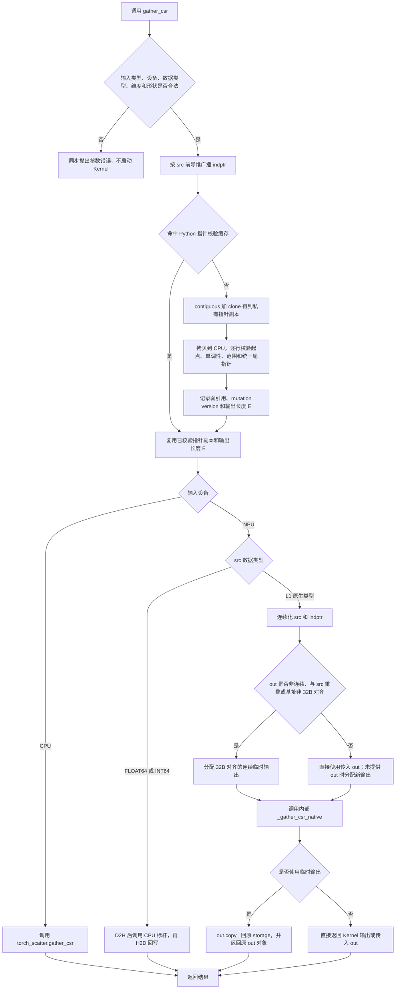
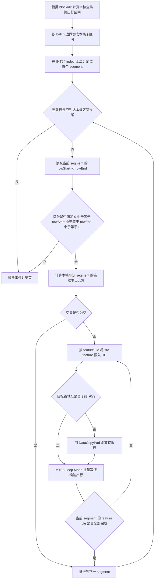
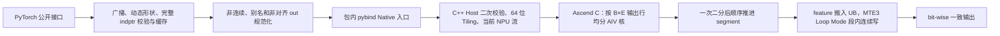

# 需求背景（required）

## 需求来源

本需求来源于 CANN 2026 年 8 月社区任务 `gather_csr`。任务要求参考 `torch_scatter.gather_csr`，在 Ascend950PR 上采用 Ascend C Kernel 与 Python PyTorch 适配层实现接口、功能、精度和性能对齐。验收以 PyTorch 层接口为准，aclnn 接口为可选项。

任务书：<https://gitcode.com/cann/cann-ops-competitions/blob/master/04_tasks/01_community-task-2026/docs/202608/gather_csr_task_doc.md>

## 背景介绍

Gather CSR 是 Segment CSR 的逆操作。`src` 在 `dim = indptr.dim()-1` 维存放每个 CSR 段的一行或一个 feature 切片，`indptr` 描述各段在展开输出中的起止位置。对第 `s` 段：

\[
out[..., indptr[s]:indptr[s+1], ...] = src[..., s, ...]
\]

该算子用于将节点/段特征广播到 CSR 边列表，是图消息下发和稀疏图特征展开的基础操作。算子没有浮点运算和原子归约，核心性能取决于 INT64 CSR 指针读取、源 feature 复用和输出 GM 连续写带宽。

### 参考实现现状分析

Python 参考接口为：

```python
def gather_csr(src: torch.Tensor, indptr: torch.Tensor,
               out: Optional[torch.Tensor] = None) -> torch.Tensor:
    return torch.ops.torch_scatter.gather_csr(src, indptr, out)
```

`gather_csr_cpu` 的主要步骤为：

1. 将 `indptr` 的前导维广播到 `src` 对应维度；
2. 检查 `src.size(dim) == indptr.size(dim)-1`，空 `src` 为例外；
3. 将 `src` 规范化为连续 Tensor；
4. 未提供 `out` 时，以 `indptr.flatten()[-1]` 推导输出长度；
5. 遍历 batch/segment，先缓存一个 `K` 长度的源 feature，再复制到 `[rowStart,rowEnd)` 的每个输出行。

目标 `ops-gnn` 仓已有 `segment_max_csr`，可复用 PyTorch 扩展、Host 启动、Ascend C 编译和 pybind 的工程结构。但其当前实现使用 INT32 indptr、固定 2048 元素 tile、uint32 shape product 和独立创建 stream，不满足本任务 INT64、超大 shape、调用流语义和 950PR 泛化要求，只作为工程结构参考，不直接复制实现。

# 需求分析（required）

## 需求描述

在 Ascend950PR 上实现与 torch_scatter 前向接口一致的 Gather CSR：

- 必选 Python 接口：`gather_csr(src, indptr, out=None)`；
- L1 NPU 原生类型：FLOAT16、BFLOAT16、FLOAT32、INT8、INT16、INT32、UINT8；
- `indptr` 固定 INT64；
- L2 FLOAT64/INT64 采用透明 CPU fallback，不参与性能验收；
- 支持 1～8 维、batch broadcast、空段、空 Tensor、非连续 Tensor和可选 `out`；
- L1 结果与 CPU torch_scatter 逐比特一致；
- 所有性能用例达到不低于 0.6 倍 A100 标杆性能。

## 需求拆解

1. PyTorch 层完成接口、dtype/device/shape 校验、非连续规范化、L2 fallback 和可选 `out` 处理。
2. Host 层推导 `B/S/K/E`、动态输出 shape、获取 dav-3510 核数和 UB 容量并生成 tiling。
3. Kernel 层按输出行切分，完成 INT64 CSR 定位、段内源 feature 缓存和连续写回。
4. 为对齐/非对齐、不同 dtype 字节宽度、空段、空输出和大小 shape 规划分支。
5. 使用 torch_scatter CPU 生成真值，通过 PyTorch 层运行功能测试；第二轮使用 AscendOpTest/ATK 做精度门禁并使用 msprof 做性能分析。
6. 完成 ops-gnn 的 Python 导出、pybind、Host/Kernel、CMake、测试和 README 集成。

# 详细设计（required）

## 算子分析

### 数学公式

设：

- `D = indptr.dim()`；
- `dim = D - 1`；
- `S = src.size(dim) = indptr.size(dim)-1`；
- `E = indptr[..., -1]`，即输出在 `dim` 维的长度；
- `K = product(src.shape[D:])`，即每个段的 feature 元素数；
- `B = product(src.shape[:dim])`，即展开后的 batch 数。

对 batch `b`、segment `s`、输出位置 `e` 和 feature `k`：

\[
out[b,e,k] = src[b,s,k],\quad indptr[b,s] \le e < indptr[b,s+1]
\]

空段满足 `indptr[b,s] == indptr[b,s+1]`，不产生输出。算子只复制数据位模式，不执行数值转换。

### 与 segment_csr 的对偶关系

Gather CSR 与 Segment CSR 使用相同的 `indptr` 描述，但数据流方向相反：

| 算子 | 输入段维长度 | 输出段维长度 | 数据流 |
| --- | ---: | ---: | --- |
| `segment_csr` | `E`（展开行数） | `S`（段数） | 将 `[indptr[s], indptr[s+1])` 归约到第 `s` 段 |
| `gather_csr` | `S`（段数） | `E`（展开行数） | 将第 `s` 段复制到 `[indptr[s], indptr[s+1])` |

令 `degree[s] = indptr[s+1] - indptr[s]`，`x = gather_csr(src, indptr)`，则以下关系用于约束实现和测试：

\[
segment\_sum\_csr(x, indptr)[s] = src[s] \times degree[s]
\]

对 `degree[s] > 0` 的非空段：

\[
segment\_mean\_csr(x, indptr)[s] = src[s]
\]

`segment_min_csr` 和 `segment_max_csr` 对非空段同样恢复 `src[s]`。空段没有 Gather 输出行，不能用 mean/min/max 的恒等式恢复其源值；空段结果单独以 CPU torch_scatter 行为为准。上述关系必须覆盖 batch、广播和全部 L1 dtype，并与 CSR/COO 等价测试相互独立。

### 参数与数据类型

| 参数 | 输入/输出 | 数据类型 | Shape/约束 | 非连续 |
| --- | --- | --- | --- | --- |
| src | 输入 | L1：FP16/BF16/FP32/INT8/INT16/INT32/UINT8；L2：FP64/INT64 | 1～8 维；`src.size(dim)=S` | 支持，由 PyTorch 层规范化 |
| indptr | 输入 | INT64 | `D<=src.dim()`；最后一维 `[S+1]`；非降序；合法范围 `[0,E]` | 支持，由 PyTorch 层规范化/广播 |
| out | 可选输入/输出 | 与 src 相同 | 除 `dim` 外与 src 相同，`out.size(dim)=E` | 支持；写入原 storage 并返回同一 Tensor |
| result | 输出 | 与 src 相同 | src shape 的 `dim` 维替换为 `E` | 连续快路径输出 |

### 功能边界

- 仅支持 gather，无 `reduce`、`dim_size` 和反向接口。
- `indptr` 必须非降序；允许零长度段。
- 每个逻辑 batch 的最终指针必须等于全局输出长度 `E=indptr.flatten()[-1]`，从而形成矩形输出；不同 batch 的尾指针不一致作为非法输入处理。
- L2 采用 D2H → CPU torch_scatter → H2D 的透明 fallback；不对 FLOAT64/INT64 做低精度拆分或数值 cast。
- 空 `src`、`S=0` 或 `E=0` 由 PyTorch/Host 快路径返回，不启动 Gather Kernel；合法 `indptr` 的最后一维至少包含一个尾指针。

## 算子实现

### PyTorch 侧设计

公开函数签名逐字保持为：

```python
def gather_csr(src: torch.Tensor, indptr: torch.Tensor,
               out: Optional[torch.Tensor] = None) -> torch.Tensor:
    ...
```

#### PyTorch/torch_scatter 参考实现展开

`torch_scatter.gather_csr` 的 Python 层本身只把三个参数原样下沉到 `torch.ops.torch_scatter.gather_csr`。CPU 实现将 `dim=indptr.dim()-1`，把 Tensor 逻辑上重排为 `B × S × K` 和 `B × (S+1)`，再按下面的等价伪代码执行：

```python
dim = indptr.dim() - 1
expanded_indptr = indptr.expand(*src.shape[:dim], indptr.size(-1))
E = int(expanded_indptr.reshape(-1)[-1])
out_shape = list(src.shape)
out_shape[dim] = E
result = out if out is not None else src.new_empty(out_shape)

for b in range(product(src.shape[:dim])):
    for s in range(src.size(dim)):
        begin = expanded_indptr[b, s]
        end = expanded_indptr[b, s + 1]
        # src[b, s, :] 是 K 个连续 feature；逐行复制而不做数值运算。
        result[b, begin:end, :] = src[b, s, :]
return result
```

这里的 `B` 是段维之前维度的乘积，`K` 是段维之后维度的乘积。Python 公开层必须保持 `out` 的对象身份和 storage 写入语义；NPU Kernel 可以重排内部存储，但不能改变这些可观察行为。

#### 最终 PyTorch 适配流程

最终实现位于 `python/ops_gnn/gather_csr.py`，处理顺序如下：



1. 校验 `src/indptr/out` 的 Tensor 类型、device、dtype、rank 和基础 shape；`dim` 只由 `indptr.dim()-1` 推导，不增加公开参数；
2. 用 `expand` 将 `indptr` 前导维广播到 `src.shape[:dim]`，随后 `contiguous().clone()` 得到私有连续副本。额外 `clone` 用于切断 expand view 的 `_base` 强引用，避免校验缓存延长调用者 Tensor 生命周期；
3. 首次完整读取广播后的 INT64 指针，校验每行从 0 开始、非降序、范围合法且 batch 尾指针一致，并得到动态输出长度 `E`；
4. `src` 或 `indptr` 非连续时转为连续 Tensor。`out` 非连续、与 `src` storage 重叠或 GM 基址非 32B 对齐时，创建对齐连续临时输出，Kernel 完成后再 `out.copy_(result)`，最终返回调用者传入的同一个 `out`；
5. CPU 输入直接调用 `torch_scatter.gather_csr`。NPU 上 FLOAT64/INT64 走 D2H → CPU torch_scatter → H2D 的位模式保持 fallback，并只告警一次；
6. L1 dtype 调用仅供包内包装层使用的 `_pybind._gather_csr_native(src_contiguous, indptr_contiguous, kernel_out)`；Native 返回后按第 4 步决定直接返回或回写；
7. 在 `python/ops_gnn/__init__.py` 导出公开函数，在 `csrc/pybind.cpp` 只注册内部 Native launcher，防止绕过公开层成为推荐用法。

核心控制流等价为：

```python
expanded, E = validate_and_expand_indptr(src, indptr)
if src.device.type == "cpu":
    return torch_scatter.gather_csr(src, expanded, out)
if src.dtype in (torch.float64, torch.int64):
    return cpu_fallback_and_copy_back(src, expanded, out)

src_c = src.contiguous()
needs_tmp = (
    out is not None
    and (not out.is_contiguous()
         or torch._C._overlaps(src, out)
         or out.data_ptr() % 32 != 0)
)
kernel_out = aligned_empty(output_shape) if out is None or needs_tmp else out
result = _pybind._gather_csr_native(src_c, expanded, kernel_out)
if out is not None and needs_tmp:
    out.copy_(result)
return out if out is not None else result
```

#### PyTorch 接口对照

| 项目 | torch_scatter | 本设计 |
| --- | --- | --- |
| 函数签名 | `gather_csr(src, indptr, out=None)` | 完全一致，不增加公开参数 |
| `dim` | `indptr.dim()-1` 隐式推导 | 完全一致 |
| `out=None` | 从 `indptr.flatten()[-1]` 推导输出长度 | 完全一致 |
| 提供 `out` | 原地写入并返回 `out` | 完全一致，非连续 `out` 使用临时结果回写 |
| L1 dtype | 后端原生执行 | Ascend C Kernel 原生执行 |
| FLOAT64/INT64 | 原后端执行 | 保持同签名和返回类型的透明 CPU fallback；路径可诊断且不参加性能验收 |
| 非连续输入 | 后端内部处理 | `src/indptr` 连续化后进入 Native；非连续 `out` 通过临时结果回写原 storage |
| `src/out` 别名 | 结果不得被前向覆盖破坏 | 公开层使用临时输出，Native 入口用 MemoryOverlap 再次拒绝别名 |
| 动态输出 | 从最终 CSR 指针推导 | 完整校验后取得统一 `E`，再分配 `src.shape` 的段维替换结果 |

### indptr 校验设计

校验分为不读取数据值的元数据校验和读取指针值的内容校验。元数据校验在 PyTorch/Host 侧完成；内容校验在公开 PyTorch 包装层将广播后的 INT64 `indptr` 搬回 CPU 后完整扫描。该选择保证错误发生在 Gather Kernel 启动前，并避免设备端异步错误难以归因。为控制稳态性能，同一 `indptr` 的成功校验按 Tensor identity、弱引用、PyTorch mutation version、shape/stride/storage offset 和广播前缀组成的签名缓存；任何原地修改都会令缓存失效。

| 校验项 | 执行层 | 失败条件/处理 |
| --- | --- | --- |
| Tensor、device、dtype | PyTorch | `src/indptr/out` 不在兼容 device，`indptr` 非 INT64，或 `out` dtype/device 与 `src` 不同，立即报参数错误 |
| rank 与段维 | PyTorch/Host | `src.dim()` 不在 1～8、`indptr.dim()<1`、`indptr.dim()>src.dim()` 或 `indptr.size(-1)<1`，立即报错 |
| 段数一致性 | Host | 非空 `src` 时 `src.size(dim) != indptr.size(dim)-1`，立即报错；这是任务书要求的 Host 硬校验 |
| 前导维广播 | PyTorch | `indptr` 的前导维不能广播到 `src.shape[:dim]`，立即报错 |
| `out` shape/storage | PyTorch/Host | rank 或非 `dim` 维不一致、`out.size(dim)!=E`，立即报错；重叠写和不安全别名拒绝执行 |
| shape/地址溢出 | Host | `B*S*K`、`B*E*K`、stride 或字节数的 uint64 乘加溢出，立即报错 |
| 单调性与范围 | PyTorch | 每个逻辑 CSR 行必须以 0 开始；任一行出现 `indptr[i]<0`、`indptr[i]>E` 或 `indptr[i]>indptr[i+1]`，立即报错 |
| batch 尾指针 | PyTorch | 任一逻辑 batch 的末指针不等于统一输出长度 `E`，立即报错 |

首次遇到新的 `indptr` 时，PyTorch 层执行一次 Device→Host 完整校验；性能脚本同时记录首次调用 wall time，并将该开销纳入口径。重复调用未修改的 `indptr` 时命中安全缓存，不再次同步。缓存不是只按裸地址判断，而是采用两层防护：

| 层次 | Cache key/失效条件 | 生命周期保护 |
| --- | --- | --- |
| Python 公开层 | Tensor identity、`_version`、src 广播前缀、shape、stride、storage offset | key 保存 weakref；私有 expanded clone 不引用原始 `indptr`；对象销毁回调立即删除条目 |
| C++ Native 层 | TensorImpl identity、mutation version、B/S/E | thread-local 保存一个强 Tensor 引用，防止 TensorImpl 地址回收后被误命中；原地修改自动失效 |

Native 层仍执行完整 CSR 扫描，使直接调用内部 launcher 也不能携带非法指针启动 Kernel。Kernel 对每次读取的 `(rowStart,rowEnd)` 再执行 `0 <= rowStart <= rowEnd <= E` 的廉价防御，避免任何非法值形成负数转无符号、减法溢出或 GM 越界写。空 Tensor 仍执行必要的 shape 规则检查，然后走空输出快路径。

### Host 侧设计

Host 侧使用 64 位整数计算所有 shape product、元素数和字节数，禁止将最大 537M 元素性能场景截断为 uint32。

内部 Native 入口重新校验 device、连续性、rank、dtype、shape 元素数、`src/out` 无重叠和 `out` 基址 32B 对齐，防止绕过 Python 包装层形成越界或前向覆盖。平台参数通过 `PlatformAscendCManager` 动态取得 AIV 核数和 UB 容量；Kernel 提交到 `c10_npu::getCurrentNPUStream()`，不创建私有 stream，因而保持 PyTorch 当前流的依赖和异步语义。

#### 输出 shape

- 提供 `out`：使用其 shape，结合 PyTorch 内容校验得到的 `E` 检查 `out.size(dim)==E`，无需动态输出分配。
- 未提供 `out`：读取逻辑尾指针 `E` 并创建输出。该读取可能发生 Device→Host 标量同步，功能计时和 Kernel 计时分别报告。
- 空输入：按 torch_scatter CPU 参考语义创建/返回空输出。

#### 多核切分

按 `B*E` 个输出行而不是按 `B*S` 个 segment 切分：

```text
totalRows = B * E
usedCores = min(aivCoreNum, totalRows)
rowsPerCore = ceil(totalRows / usedCores)
rowBegin(core) = core * rowsPerCore
rowEnd(core)   = min(totalRows, rowBegin + rowsPerCore)
```

这样长段、短段和空段不会造成主要核间失衡，每核写入连续输出区间。

#### 段内连续写

输出采用 row-major 展平。第 `s` 段对应的完整输出地址区间为：

```text
[(b*E + indptr[b,s]) * K,
 (b*E + indptr[b,s+1]) * K)
```

该区间在 GM 上连续。Kernel 顺序推进 segment，同一 segment 的源 feature 只从 GM 读取一次或按 feature tile 读取一次，再对连续输出行重复 MTE3 写回：

- `K*T` 与源/目的地址均 32B 对齐时，走整行连续 DataCopy 快路径；
- `K <= featureTile` 时，整行驻留 UB，对段内全部输出行连续复用；
- `K > featureTile` 时，按 feature tile 分块，每个 tile 在段内行区间顺序写回；
- `out` 的 Native 基址由公开层保证 32B 对齐；当某个逻辑行地址暂时未对齐时，先用 DataCopyPad 安全剥离有限行，再进入 DAV_3510 MTE3 Loop Mode 批量连续写；
- Loop Mode 单次最多覆盖 `(2^21)-1` 行，超限时分块；每个新块再次做地址对齐剥离。对 1B/2B/4B dtype，下一次对齐至多经过 `32/gcd(K*T,32)` 个行地址周期；
- 行尾或 feature tile 非 32B 整块时仍由 DataCopyPad/DataCopyExt 处理，禁止越界读写。

按输出行分核可能把一个长段切到相邻核，但每核仍只写自身的连续 GM 区间，不发生原子操作、跨核覆盖或写后冲突。

此前“小 K、大 degree、非 32B 对齐时可能逐行 DataCopyPad”的风险由两部分共同关闭：公开 `out` 的非对齐 storage offset 统一经对齐临时 Tensor 计算；Kernel 内的逻辑行偏移只做有限对齐剥离，随后进入 Loop Mode，而不是对整个 segment 逐行写。该方案同时保留非连续 `out` 和对象身份语义。

#### UB 切分

运行时通过 PlatformAscendC 获取 DAV_3510 的 AIV 核数和 UB 容量，不硬编码旧 910B 参数。设 dtype 字节数为 `T`，预留流水线和对齐空间后：

```text
kernelUbBudget = floor(platformUbBytes * 3 / 4)
featureBufferBytes = align32(kernelUbBudget - 32B_indptr_buffer)
featureTile = floor(featureBufferBytes / T)
featureTile = min(featureTile, K)
```

最终实现使用一个源 feature LocalTensor 和一个 32B indptr LocalTensor，输出由 MTE3 直接从 feature LocalTensor 写入 GM。第二轮实测表明纯复制路径不需要额外输出 LocalTensor 或 double buffer 即可通过全部性能门槛，保留 1/4 UB 作为架构与运行时安全余量。

#### TilingData

| 字段 | 类型 | 含义 |
| --- | --- | --- |
| batchCount | uint64 | B |
| segmentCount | uint64 | S |
| outputRowsPerBatch | uint64 | E |
| featureCount | uint64 | K |
| totalOutputRows | uint64 | B*E |
| outputRowsPerCore | uint64 | 每个 AIV core 的最大输出行数 |
| usedCoreNum | uint32 | 实际启动 AIV core 数 |
| featureTileElements | uint32 | 单次 feature tile 元素数 |
| featureBufferBytes | uint32 | 32B 对齐后的 feature LocalTensor 字节数 |
| elementSize | uint32 | 1/2/4 |

候选实现及选择依据：

| 路径 | 适用场景 | 优点 | 最大风险 |
| --- | --- | --- | --- |
| 输出行连续切分（默认） | 通用、段长不均、空段较多 | 按输出字节均衡分核，每核连续写 | 核边界可能重复加载长段 feature |
| 按 segment 切分 | 段长较均匀、单段输出较长 | 与参考伪代码直接对应，源 feature 复用高 | 极端长短段导致核间失衡 |
| SIMT 小特征路径 | `K` 很小且输出行较多 | 减少 SIMD 尾块和队列固定开销 | 线程映射及非对齐访存开销 |

第二轮先实现按 segment 均分的候选版本；偏斜 degree 压力测试显示其存在明显核间失衡，因此最终选择输出行连续切分。正式对照数据放入第二轮自测报告，不混入设计审计结论。空输出由 Host 直接返回；对齐路径运行时选择 DAV_3510 MTE3 Loop Mode，非对齐路径自动回退 DataCopyPad，不额外引入公开 TilingKey。

### Kernel 侧设计

每核处理连续的全局输出行范围。对每个 batch：

1. 对本核在该 batch 的第一个输出位置 `eBegin`，在 INT64 `indptr` 上二分查找起始 segment；
2. 后续按输出位置递增推进 `segment`，当 `e == rowEnd` 时加载下一个指针；
3. 对当前 segment 的每个 feature tile，将 `src[b,s,k:k+tile]` 搬入 UB；
4. 对本核覆盖的 `[max(eBegin,rowStart), min(eEnd,rowEnd))` 连续输出行重复写入该 feature tile；
5. 最后一个 feature tile 使用非对齐安全搬运，不越界读取或写入。



相较于每个输出行独立二分，该方案每核/每 batch 只进行一次起始二分，之后顺序读取 indptr；相较于按 segment 分核，它对极不均匀段长保持输出字节级负载均衡。

#### 最终方案与选择依据

最终采用“PyTorch 完整语义层 + C++ Host 防御层 + 输出行均分 Ascend C Kernel”的三层方案：



1. **语义层**：公开 Python 接口完成广播、动态 shape、完整 indptr 校验、L2 fallback、非连续/别名/非对齐 `out` 回写和校验缓存；
2. **Host 层**：对内部入口做第二次 shape、overflow、CSR、重叠和对齐防御，按运行时 950PR 平台参数生成 64 位 tiling，并使用 PyTorch 当前 NPU stream；
3. **Kernel 层**：把 `B*E` 输出行均分到 AIV core；每核每 batch 只二分一次起始 segment，随后顺序推进；一个 feature tile 搬入 UB 后通过 MTE3 Loop Mode 对段内连续区间重复写出；
4. **位模式统一**：Kernel 不按数值 dtype 做计算，1B/2B/4B storage 分别以 UINT8/UINT16/UINT32 模板搬运，因此浮点 NaN payload、符号位和整数位模式均保持不变；
5. **并发安全**：每个 core 的输出行区间互斥，不使用 atomic；MTE2→MTE3 和 MTE3→MTE2 通过显式 event 保证 UB feature 在复用前已经写完。

被否决或降级的候选方案：

| 候选 | 结论 | 原因 |
| --- | --- | --- |
| 按 segment 均分 core | 否决 | degree 偏斜时长段集中到少数 core，无法保证泛化性能 |
| 每个输出行独立二分 segment | 否决 | `E` 很大时 INT64 indptr 访问和二分开销重复 |
| 对所有非对齐行逐行 DataCopyPad | 否决 | 小 K、大 degree 时命令数随 E 线性增长；最终改为临时对齐加有限剥离后 Loop Mode |
| 双缓冲 feature/outLocal | 不启用 | 本算子无 Vector 计算可隐藏搬运，额外 buffer 压缩 feature tile；单 feature buffer 已满足带宽门槛 |
| NPU 低精度拼接实现 FP64/INT64 | 不采用 | L2 不考核性能，CPU fallback 更容易保证 bit-wise 语义且风险更低 |

### Buffer 规划

| Buffer | 用途 | 大小 |
| --- | --- | --- |
| srcLocal | 缓存一个 segment 的 feature tile | `align32(featureTile*T)` |
| indptrLocal | 二分定位及当前 rowStart/rowEnd | 32B |

常规对齐路径优先复用 `srcLocal` 多次 MTE3 写出，不进行 Vector 数值计算。所有同步使用 DAV_3510 支持的标准队列/事件机制；具体 BufferID/API 形式以当前 CANN 9.0 编译器实测为准。

## 支持硬件

| 支持的芯片版本 | NPU 架构 | 涉及勾选 |
| --- | --- | --- |
| Ascend950PR | DAV_3510 (`dav-3510`) | √ |

本任务不以旧 Ascend910B/DAV_2201 为验收目标，不复用旧芯片的 UB、核数或对齐硬编码。

## 算子约束限制

- `indptr` 必须为 INT64、最后一维非降序且范围合法；
- `indptr.dim() <= src.dim()`；
- 非空 src 满足 `src.size(dim) == indptr.size(dim)-1`；
- 输出 dtype/device 与 src 一致；
- 仅支持前向和确定性复制；
- L2 FLOAT64/INT64 通过 CPU fallback，不参加 NPU 性能验收；
- 不提供 `reduce`、`dim_size` 或额外公开参数。

# 可维可测分析

## 精度标准/性能标准

| 验收标准 | 描述 | 标准来源 |
| --- | --- | --- |
| 功能标准 | PyTorch 层接口与 torch_scatter 完全对齐，覆盖任务书 TC-01～TC-13 | gather_csr 任务书、torch_scatter pytest |
| L1 精度 | 纯位模式复制，与 CPU torch_scatter bit-wise 一致 | 生态算子开源精度标准、任务书 |
| L2 精度 | CPU fallback 与 CPU torch_scatter bit-wise 一致 | 任务书 |
| 性能 | 所有指定性能用例不低于 0.6 倍 A100 标杆；同时要求 Gather CSR 通常不慢于 Gather COO | 任务书 |

本设计文档只描述需求、边界和实现方案，不填报正式精度或性能结果。第二轮的 AscendOpTest 日志、性能数据和正式自测报告作为独立交付件维护。

## 测试设计

### 功能与边界矩阵

1. 官方 `test_gather.py` 标准值 TC-01～TC-06；
2. CSR/COO 等价 TC-07；
3. 提供 out、out 非连续、out storage 语义 TC-08；
4. src/indptr 非连续 TC-09；
5. 空 src、E=0、空 batch TC-10；
6. 连续空段、首尾空段、全部空段 TC-11；
7. FLOAT64/INT64 fallback TC-12～13；
8. `segment_sum_csr(gather_csr(...)) == src*degree`，并验证非空段的 mean/min/max 对偶恒等式；
9. 全 L1 dtype 的 1B/2B/4B 对齐与非对齐 K；
10. rank 1～8、indptr broadcast、多个 batch；
11. K=1、K=31/32/33 字节边界、大 K 分 tile；
12. 超大元素数和 64 位 offset 溢出防护；
13. 非法 dtype、下降/负/越界 indptr、不同 batch 尾指针不一致、广播/shape/out 不匹配，并检查错误发生在 Gather Kernel 启动前。

### 性能矩阵

完整覆盖任务书 6 组输出规模、FP16/FP32 两种主 dtype：

| 输出 Shape / segment 数 | FP32 A100 | FP16 A100 |
| --- | ---: | ---: |
| 256K×128 / 512 | 0.100 ms | 0.060 ms |
| 512K×128 / 1024 | 0.176 ms | 0.096 ms |
| 1024K×128 / 1024 | 0.330 ms | 0.174 ms |
| 1024K×128 / 2048 | 0.333 ms | 0.175 ms |
| 2048K×128 / 4096 | 0.638 ms | 0.326 ms |
| 4096K×128 / 4096 | 1.246 ms | 0.627 ms |

每组分别记录：PyTorch 总接口耗时、Kernel device time、Block Num、GM 带宽、L2 命中率和相对 A100 吞吐。预热后多次测量，报告中位数及波动范围。性能不达标必须回到切分/搬运设计，不能豁免。

## 兼容性分析

该算子是新增接口，不改变现有算子的功能和调用行为。公开 Python 签名与 torch_scatter 一致；aclnn 不属于本轮必选范围。
