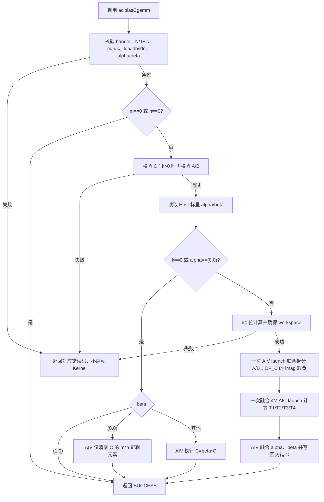
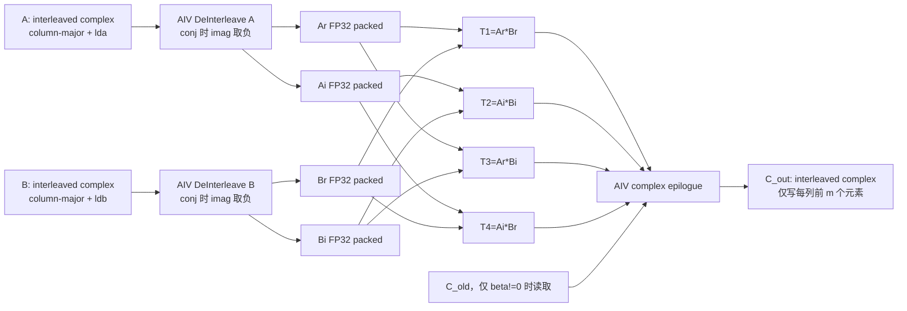
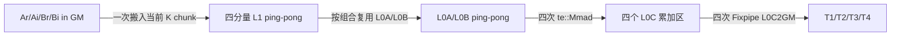

# 需求背景（required）

## 需求来源

本需求来源于 CANN 2026 年 8 月社区任务“aclblasCgemm 算子开发（950）”。任务要求在 Ascend 950PR 上使用 Ascend C Kernel 直调方式实现单精度复数通用矩阵乘，功能与参数语义对齐 cuBLAS `cublasCgemm`，数学语义对齐 Netlib BLAS `cgemm`，最终代码放入 `ops-blas/blas/gemm/arch35/`。

任务指定的对外接口已经声明在 `ops-blas/include/cann_ops_blas.h`，本实现只补充并完善 arch35 后端，禁止新增 950PR 私有平行接口。

## 背景介绍

### aclblasCgemm 功能

`aclblasCgemm` 是 BLAS Level 3 单精度复数矩阵乘接口。矩阵以列主序存储，计算：

```text
C = alpha * op(A) * op(B) + beta * C
```

其中：

- `op(A)` 的逻辑形状为 `m × k`；
- `op(B)` 的逻辑形状为 `k × n`；
- `C` 的逻辑形状为 `m × n`；
- `ACLBLAS_OP_N` 表示不转置；
- `ACLBLAS_OP_T` 表示仅转置；
- `ACLBLAS_OP_C` 表示共轭转置，复数场景下不得与 `T` 合并处理。

`aclblasComplex` 在 `include/cann_ops_blas_common.h` 中定义为两个连续的 FP32 分量：

```cpp
typedef struct aclblasComplex {
    float real;
    float imag;
} aclblasComplex;
```

### 现有工程能力分析

目标仓已经具备以下可复用能力：

1. `include/cann_ops_blas.h` 中已有统一的 `aclblasCgemm` 声明；
2. handle 已绑定 stream，并提供库管理/用户注入的 device workspace；
3. `blas/gemm/arch35/` 已有 FP32 tensor_api Cube GEMM 的多核切分、GM/L1/L0 搬运、MMAD 累加和 Fixpipe 写回底座；
4. `blas/herk/arch35/` 已验证 `te::Copy`、`DeInterleave`、`te::Mmad`、`Transform` 等接口在 DAV_3510 和 asc-devkit 9.1 下可用；
5. CMake 已通过 `cmake/asc_devkit_version.cmake` 对 arch35 tensor_api GEMM 做 asc-devkit 9.1 版本门禁。

当前主线 `gemm_host.cpp` 中还有一条可作为问题基线的 Cgemm 初步路径：它将 A/B 整矩阵 D2H，在 Host 拆分后 H2D，再顺序启动四次实数 GEMM 和一次合并。该路径不满足本任务的异步/性能目标，且 workspace 使用 `reABytes*4` 为 A/B 四个分量统一留空，对 `m!=n` 可能与 `reBBytes` 不匹配。本设计不沿用该数据路径，只复用其中已验证的列主序映射和 FP32 Cube 底座。

Cube 计算底座只接受实数 FP32，不能直接把交错存储的 `aclblasComplex` 当作 Cube 输入。因此需要在 Device 上将复数矩阵拆成实部和虚部矩阵，在融合 4M AIC Kernel 内完成四路实数 GEMM 累加，再融合 alpha、beta 并写回交错复数 C。

### 设计目标

1. 完整覆盖 `transa/transb` 的 N、T、C 共 9 种组合；
2. 正确处理非紧凑 `lda/ldb/ldc`，仅更新 C 的逻辑 `m*n` 个元素，不破坏 padding；
3. `m=0` 或 `n=0` 合法 quick return；
4. `k=0` 或 `alpha=(0,0)` 时只执行 `C=beta*C`；
5. `beta=(0,0)` 时不得读取 C 的旧值；
6. 主路径保持异步，禁止完整矩阵 D2H/H2D 和无条件 stream 同步；
7. 复用 ops-blas 现有 handle、stream、workspace、日志、错误码和构建体系；
8. 在精度优先的前提下复用 FP32 Cube 能力，达到任务书性能目标。

# 需求分析（required）

## 需求描述

在 Ascend 950PR 上实现以下既有接口：

```cpp
aclblasStatus_t aclblasCgemm(
    aclblasHandle_t handle,
    aclblasOperation_t transa,
    aclblasOperation_t transb,
    int m,
    int n,
    int k,
    const aclblasComplex* alpha,
    const aclblasComplex* A,
    int lda,
    const aclblasComplex* B,
    int ldb,
    const aclblasComplex* beta,
    aclblasComplex* C,
    int ldc);
```

接口参数顺序、类型、错误码和列主序语义必须保持不变。`alpha`、`beta` 位于 Host 内存，A、B、C 位于 Device 内存。调用使用 handle 当前绑定的 stream，接口返回成功只表示 Kernel 已成功入流；调用方在读回结果前负责同步该 stream。

### 参数与约束

| 参数 | 输入/输出 | 类型与位置 | 约束 | 异常行为 |
| --- | --- | --- | --- | --- |
| handle | 输入 | `aclblasHandle_t`，Host | 已创建的有效句柄 | `nullptr` 返回 `ACLBLAS_STATUS_HANDLE_IS_NULLPTR` |
| transa | 输入 | 枚举，Host | N/T/C | 其他值返回 `ACLBLAS_STATUS_INVALID_ENUM` |
| transb | 输入 | 枚举，Host | N/T/C | 其他值返回 `ACLBLAS_STATUS_INVALID_ENUM` |
| m | 输入 | int，Host | `m>=0` | 负值返回 `ACLBLAS_STATUS_INVALID_VALUE` |
| n | 输入 | int，Host | `n>=0` | 负值返回 `ACLBLAS_STATUS_INVALID_VALUE` |
| k | 输入 | int，Host | `k>=0` | 负值返回 `ACLBLAS_STATUS_INVALID_VALUE` |
| alpha | 输入 | COMPLEX64 标量指针，Host | 不可为空 | 空指针返回 `ACLBLAS_STATUS_INVALID_VALUE` |
| A | 输入 | COMPLEX64，Device，列主序 | 物理列数由 transa 决定 | 按任务书，`k>0` 时不可为空 |
| lda | 输入 | int，Host | N：`>=max(1,m)`；T/C：`>=max(1,k)` | 不满足返回 `ACLBLAS_STATUS_INVALID_VALUE` |
| B | 输入 | COMPLEX64，Device，列主序 | 物理列数由 transb 决定 | 按任务书，`k>0` 时不可为空 |
| ldb | 输入 | int，Host | N：`>=max(1,k)`；T/C：`>=max(1,n)` | 不满足返回 `ACLBLAS_STATUS_INVALID_VALUE` |
| beta | 输入 | COMPLEX64 标量指针，Host | 不可为空 | 空指针返回 `ACLBLAS_STATUS_INVALID_VALUE` |
| C | 输入/输出 | COMPLEX64，Device，列主序 | `m>0 && n>0` 时始终为有效输出地址，与 k/alpha/beta 无关 | 空指针返回 `ACLBLAS_STATUS_INVALID_VALUE`；m=0 或 n=0 的 no-op 可不访问 |
| ldc | 输入 | int，Host | `>=max(1,m)` | 不满足返回 `ACLBLAS_STATUS_INVALID_VALUE` |

当 `beta=(0,0)` 时，“C 无需初始化”表示 Kernel 不得读取 C 的旧内容；C 仍是输出地址，不表示输出指针可以为空。任务书的异常表明确规定 `k>0` 时 C 不能为空；由于 `k=0` 且 `m,n>0` 仍需物化 `C=beta*C`，本设计将 C 的有效性闭合为“除 m/n 零维 no-op 外始终必需”。A/B 则严格按任务书在 `k>0` 时必需，即使 alpha 为零也先校验。

指针校验与 quick return 的完整真值表如下，Host 实现不得因为标量特例改变这个顺序：

| `m,n` | `k` | 标量条件 | C | A/B | 结果 |
| --- | --- | --- | --- | --- | --- |
| 任一为 0 | 任意合法值 | 任意 | 可空 | 可空 | 完成元数据和 alpha/beta 校验后返回成功 |
| 均大于 0 | 0 | 任意 | 必须有效 | 可空 | 执行 `C=beta*C`；beta=1 时 no-op |
| 均大于 0 | 大于 0 | 任意，包括 alpha=0 | 必须有效 | 必须有效 | 指针校验通过后再进入缩放或主路径 |
| 均大于 0 | 大于 0 | 任意 | 空 | 任意 | `ACLBLAS_STATUS_INVALID_VALUE` |
| 均大于 0 | 大于 0 | 任意 | 有效 | A 或 B 为空 | `ACLBLAS_STATUS_INVALID_VALUE` |

### 物理矩阵形状

| 操作 | A 的物理有效区域 | B 的物理有效区域 |
| --- | --- | --- |
| N | `m*k`，物理矩阵 `lda*k` | `k*n`，物理矩阵 `ldb*n` |
| T/C | `k*m`，物理矩阵 `lda*m` | `n*k`，物理矩阵 `ldb*k` |

前导维大于逻辑物理行数时，多出的行属于 padding。实现可以读取有效列中的逻辑行，不得把 padding 当作参与计算的数据；输出只更新每列前 m 个 C 元素。

## 需求拆解

1. Host 参数校验与 quick-return 路由；
2. 复数 A/B 在 Device 上拆分为紧凑 FP32 实部/虚部矩阵；
3. `OP_C` 在拆分阶段对虚部取负，后续实数 Cube 只需执行转置；
4. 复数乘法分解为四个 FP32 乘积，并在一次融合 4M AIC Kernel 中完成；
5. AIV 合并四个中间结果，融合复数 alpha、beta，交错写回 C；
6. 设计 64 位安全的 workspace 公式、区域对齐与生命周期；
7. 复用 arch35 FP32 GEMM 的列主序映射和 tensor_api tiling；
8. 覆盖零维、alpha/beta 特殊值、padding、矩形、T/C 差异和异常参数；
9. 以 cblas 单标杆验证，按 COMPLEX64 的实部/虚部分别执行 FLOAT32 精度判定；
10. 性能验收只在后续实现阶段执行，本设计不填写未采集数据。

# 详细设计（required）

## 算子分析

### 复数 4M 分解

令：

```text
op(A) = Ar + i*Ai
op(B) = Br + i*Bi
```

定义四个实数矩阵乘：

```text
T1 = Ar * Br
T2 = Ai * Bi
T3 = Ar * Bi
T4 = Ai * Br
```

则：

```text
Pr = T1 - T2
Pi = T3 + T4
```

设 `alpha = alphaR + i*alphaI`、`beta = betaR + i*betaI`、旧 C 为 `Cr + i*Ci`，最终输出为：

```text
CoutReal = alphaR*Pr - alphaI*Pi + betaR*Cr - betaI*Ci
CoutImag = alphaR*Pi + alphaI*Pr + betaR*Ci + betaI*Cr
```

选择 4M 而不选择三实乘 3M 的原因是：3M 需要先计算 `(Ar+Ai)*(Br+Bi)`，会增加输入加法和消减误差。任务对大 K 的 COMPLEX64 同时约束 matched ratio 与最大绝对误差，4M 的误差传播更直接，也与 cblas 参考计算更接近。3M 仅作为后续可选优化，不进入首版验收路径。

### 转置与共轭处理

Device 拆分保持输入的物理二维顺序，但去除 lda/ldb padding，输出紧凑 FP32 矩阵：

```text
A: physicalRowsA * physicalColsA -> Ar/Ai，dstLdA = physicalRowsA
B: physicalRowsB * physicalColsB -> Br/Bi，dstLdB = physicalRowsB
```

`OP_C` 不在 Cube 内增加复数分支，而是在拆分阶段执行：

```text
realOut = realIn
imagOut = -imagIn
realTransposeFlag = true
```

因此：

| 原始操作 | 拆分输出 | 实数 GEMM 操作 |
| --- | --- | --- |
| N | `(real, imag)` | N |
| T | `(real, imag)` | T |
| C | `(real, -imag)` | T |

这样 T 与 C 在数值上保持严格区分，同时四路实数乘积可以复用融合 FP32 Cube Kernel 的同一套 tiling 和搬运逻辑。

### 列主序到 Cube 内部视图映射

BLAS 的列主序计算满足：

```text
(A * B)^T = B^T * A^T
```

arch35 FP32 GEMM 底座在 Host 侧执行列主序交换：

1. 交换内部 m/n；
2. 交换 A/B 的 leading dimension 与转置标志；
3. Kernel 实参按 B、A 的顺序传入；
4. Fixpipe 输出的内部转置结果对应外部列主序 C。

融合 4M 内的四路实数乘积都必须经过同一个 `ApplyColumnMajorSwap` 路径，禁止某个 T 矩阵单独手写地址公式，否则矩形和转置组合容易产生静默错误。

交换后的底层语义明确为：

```text
internalM      = externalN
internalN      = externalM
internalK      = externalK
kernel left ld = packedLdB
kernel right ld= packedLdA
kernel left op = RealOp(transb)
kernel right op= RealOp(transa)
```

| 外部结果 | 外部数学顺序 | 底层融合 Kernel 的 left、right | 底层写出 |
| --- | --- | --- | --- |
| T1 | `Ar*Br` | `Br, Ar` | `(Ar*Br)^T`，Fixpipe 映射为外部 T1 |
| T2 | `Ai*Bi` | `Bi, Ai` | `(Ai*Bi)^T`，Fixpipe 映射为外部 T2 |
| T3 | `Ar*Bi` | `Bi, Ar` | `(Ar*Bi)^T`，Fixpipe 映射为外部 T3 |
| T4 | `Ai*Br` | `Br, Ai` | `(Ai*Br)^T`，Fixpipe 映射为外部 T4 |

其中 `RealOp(N)=N`，`RealOp(T)=T`，`RealOp(C)=T`；C 的共轭已经在联合拆分阶段通过 imag 取负完成。

## 算子实现

### 文件设计

| 文件 | 设计职责 |
| --- | --- |
| `blas/gemm/arch35/gemm_host.cpp` | 公共 API、参数校验、quick return、workspace 规划、各阶段 Kernel 入流 |
| `blas/gemm/arch35/gemm_kernel.cpp` | FP32 Cube 基础设施、融合 4M AIC Kernel、A/B 联合拆分 AIV Kernel、复数合并/缩放 AIV Kernel |
| `blas/gemm/arch35/gemm_kernel.h` | Kernel launcher 声明 |
| `blas/gemm/arch35/gemm_tiling_data.h` | Cube、拆分、合并的 tiling 数据结构和常量 |
| `include/cann_ops_blas.h` | 复用已有声明，不新增接口 |
| `cmake/asc_devkit_version.cmake` | 复用 GEMM 的 asc-devkit 9.1 tensor_api 门禁 |

### Host 总体流程



校验顺序固定。`m=0` 或 `n=0` 的 no-op 仍要求 handle、枚举、维度、前导维和 alpha/beta 指针合法，但不访问 A/B/C。其余场景先要求 C 为有效输出；`k>0` 时再按照任务书强约束校验 A/B，即使 alpha 为零也不放宽 A/B 指针。`k=0` 时 A/B 可空，但 C 不可空，因 `C=beta*C` 仍需产生输出。

### 主路径数据流



所有阶段提交到 handle 绑定的同一 stream，依赖 stream 顺序保证，无需 Host 同步。正式主路径固定为“A/B 联合拆分、融合 4M Cube、复数 epilogue”三个顺序 launch，而不是 2+4+1 个独立 launch。workspace 的复用生命周期覆盖到合并 Kernel 完成；handle 销毁或切换 workspace 仍遵循 ops-blas 现有同步规则。

### 参数校验与边界路由

#### 参数校验

Host 使用统一的 `ValidateGemmParams` 风格完成：

```text
ldaMin = transa==N ? max(1,m) : max(1,k)
ldbMin = transb==N ? max(1,k) : max(1,n)
ldcMin = max(1,m)
```

尺寸乘法、字节数、512B 对齐和 `tempLdc=align16(m)` 全部使用 `size_t/uint64_t`，每次乘加前执行溢出检查。无法表示的尺寸返回 `ACLBLAS_STATUS_INVALID_VALUE`，workspace 分配失败返回 `ACLBLAS_STATUS_ALLOC_FAILED`。

#### quick return 和缩放路径

| 条件 | 行为 | 是否读取 A/B | 是否读取 C |
| --- | --- | --- | --- |
| `m==0 || n==0` | 直接成功 | 否 | 否 |
| `(k==0 || alpha==0) && beta==(1,0)` | 直接成功 | 否 | 否 |
| `(k==0 || alpha==0) && beta==(0,0)` | AIV 将 C 的逻辑元素置零 | 否 | 否 |
| `(k==0 || alpha==0) && beta` 为其他值 | AIV 复数缩放 | 否 | 是 |
| 主路径且 `beta==(0,0)` | 4M + epilogue | 是 | 否 |
| 主路径且 `beta!=0` | 4M + epilogue | 是 | 是 |

`ldc>m` 时不能用覆盖 `ldc*n` 的整段 memset，因为 BLAS padding 不属于逻辑 C。仅当 `ldc==m` 时允许用异步连续 memset；通用路径按列处理 m 个逻辑元素并保留 padding。

任务要求 `alpha=(0,0)` 的缩放路径执行 EXACT 校验。该路径固定按 FP32 顺序计算：

```text
outReal = betaReal * cReal - betaImag * cImag
outImag = betaReal * cImag + betaImag * cReal
```

实现不得改写为不同结合顺序，也不得使用会改变舍入的融合 FMA；`beta=(0,0)` 直接写正零，`beta=(1,0)` 不启动 Kernel。这样可避免向量融合与 cblas 标量参考之间产生非 bit-exact 差异。

### Workspace 设计

拆分输出去除输入 padding，因此矩阵有效元素数恒为：

```text
A component elements = m*k
B component elements = k*n
temporary elements   = tempLdc*n
tempLdc              = align_up(m, 16)
```

每个区域的长度和相对 offset 按 512B 对齐：

```text
aBytes = align512(m*k*sizeof(float))
bBytes = align512(k*n*sizeof(float))
tBytes = align512(tempLdc*n*sizeof(float))

workspaceBytes = 2*aBytes + 2*bBytes + 4*tBytes
```

布局如下：

```text
workspace
├── Ar [aBytes]
├── Ai [aBytes]
├── Br [bBytes]
├── Bi [bBytes]
├── T1 [tBytes]
├── T2 [tBytes]
├── T3 [tBytes]
└── T4 [tBytes]
```

该公式不能用 `aBytes*4` 代替 A/B 四个分量；对于 `m!=n` 的矩形矩阵，`m*k` 与 `k*n` 不相等，混用会造成空间浪费或越界。

512B 对齐是 region size/相对 offset 的性能设计，不扩大 `aclblasSetWorkspace` 的公共契约：用户 workspace 的实际基址可能不是 512B 对齐，此时各区域保持相同的基址模 512 偏移，仍必须正确执行，只记录性能告警。库通过 `aclrtMalloc` 获得的 workspace 使用其运行时返回对齐。若后续某个 tensor_api 被官方文档确认存在硬地址对齐要求，必须把 `align_up(base,512)-base` 的最多 511B front padding 纳入 requiredBytes 和末端边界检查后才能启用，不能只对 region 长度取整。

任务书三组性能 shape 的理论 workspace 为：

| m=n=k | workspace |
| --- | --- |
| 256 | 2 MiB |
| 512 | 8 MiB |
| 1024 | 32 MiB |

通过 `EnsureDefaultWorkspace` 复用或扩展 handle 的库 workspace。若用户通过 `aclblasSetWorkspace` 注入的空间不足，不重新分配用户内存，返回分配失败。库 workspace 扩容可能按现有 handle 规则同步一次；正式性能计时前必须预热，使扩容不进入有效采样。

### AIV 联合拆分 Kernel

为压缩性能主路径的 launch 数，A 和 B 不各自启动一个 Kernel，而是在一次 AIV launch 中处理两个独立 tile 网格。A 网格结束后紧接 B 网格，统一编号为 `[0,aTileCount+bTileCount)`；每个 core 通过 tile id 判断当前处理 A 还是 B，并复用同一组 UB buffer。

1. A/B 各自 tile 网格为 `ceil(rows/64) * ceil(cols/32)`；
2. `totalTileCount=aTileCount+bTileCount`，`usedAivCoreNum=min(aivCoreNum,totalTileCount)`；
3. 每个 core 以 grid-stride 方式领取统一 tile，避免 rows 很小但 cols 很大时核利用率不足；
4. `te::CopyGM2UB` 分别按源 lda/ldb 做 2D strided copy；
5. `DeInterleave` 将 `[r0,i0,r1,i1,...]` 拆为两个 FP32 LocalTensor；
6. 当前矩阵的 `conjugate=true` 时仅对 imag LocalTensor 乘 `-1.0f`；
7. `te::CopyUB2GM` 按对应紧凑 `dstLd=rows` 写入 Ar/Ai 或 Br/Bi；
8. A/B 地址、shape、源/目标 leading dimension 和共轭标志都在 tiling 中独立保存；
9. 尾行/尾列通过 tensor shape 描述，不读取 padding 外数据。

单个 64×32 tile 的 UB 规划：

| Buffer | 大小 |
| --- | --- |
| 交错复数输入 | `64*32*2*4 = 16 KiB` |
| 实部输出 | `64*32*4 = 8 KiB` |
| 虚部输出 | `64*32*4 = 8 KiB` |
| 单 buffer 合计 | 32 KiB |
| 双 buffer 合计 | 64 KiB |

64 KiB 只占 248 KiB UB 的 25.8%，首版即使用 ping-pong 重叠 GM 搬入、Vector 拆分和 GM 写出。不盲目放大 tile：对 256² 性能 shape，A/B 联合网格恰有 `2*(4*8)=64` 个 tile，可向运行时报告的最多 64 个 AIV core 提供独立任务；更大 shape 由 grid-stride 循环持续供给。

尾 tile 的 LocalTensor 布局显式定义为：

```text
ubTempStride = align_up(validRows, 8)        // FP32 元素
ubCplxStride = 2 * ubTempStride              // 交错 FP32 元素
srcCount     = ubCplxStride * validCols
dstCount     = ubTempStride * validCols
```

GM2UB 将每列 `2*validRows` 个 FP32 元素写到间距为 `ubCplxStride` 的 UB 列，尾 padding 先置零；`DeInterleave` 的输入长度为 `srcCount`，两个输出容量各为 `dstCount`。UB2GM 每列只写 `validRows`，不将 UB padding 写入紧凑 workspace。地址计算在乘法前就扩展为 64 位：

```text
srcOffsetFloats = 2ULL * (uint64_t(col)*uint64_t(srcLd) + uint64_t(row))
dstOffsetFloats = uint64_t(col)*uint64_t(dstLd) + uint64_t(row)
```

### 融合 4M AIC Cube Kernel

性能主路径不连续启动四次 `gemm_kernel_do`，而是复用 arch35 FP32 GEMM 的 tiling、layout、GM/L1/L0 搬运和 MMAD 模板，新增一次 launch 完成四路累加的融合 4M AIC Kernel。每个输出 tile 同时维护 T1～T4 四个 L0C 累加区；同一 K chunk 的 Ar/Ai/Br/Bi 只从 GM 搬入一次，然后依次发出四组 MMAD：

```text
T1 += Ar * Br
T2 += Ai * Bi
T3 += Ar * Bi
T4 += Ai * Br
```

上式是外部数学顺序。执行列主序交换后，Kernel 内部分别发出 `leftReal*rightReal`、`leftImag*rightImag`、`leftImag*rightReal`、`leftReal*rightImag`，对应前文表中的 T1～T4；其中 left=B、right=A。

初始 tile 参数为：

```text
baseM = 32
baseN = 16
baseK = 8
fusedTileKChunk = 32
operand L1/L0A/L0B FP32 C0 = 8
L0C NZ FP32 C0 = 16
```

融合路径把 K chunk 从独立 GEMM 的 64 调整为 32，使 Ar/Ai/Br/Bi 的双缓冲总量能放入 32 KiB L1。四个结果仍写入独立的 T1～T4 workspace，保持 epilogue 和精度顺序清晰。

#### 多核切分

Host 计算：

```text
mTiles = ceil(internalM/baseM)
nTiles = ceil(internalN/baseN)
```

遍历 `(mBlocks,nBlocks)`，选择不超过 AIC 数且乘积最大的组合。Kernel 再按 tile 数均分每个轴，使相邻 core 的 tile 数最多相差 1。每个 core 写互斥的输出块，不需要原子操作。

#### L1/L0 规划

当前 ops-blas arch35 FP32 GEMM 底座配置的可用 L1 窗口为 32 KiB，L0A/L0B/L0C 配置分别为 64/64/256 KiB。融合路径单个 K chunk：

| 区域 | 单 buffer | 双 buffer |
| --- | --- | --- |
| Br+Bi（left）L1 | `2*32*32*4 = 8 KiB` | 16 KiB |
| Ar+Ai（right）L1 | `2*32*16*4 = 4 KiB` | 8 KiB |
| L1 合计 | 12 KiB | 24 KiB |

24 KiB 不超过 32 KiB L1，剩余 8 KiB 用于对齐和框架保留。列主序交换后的固定搬运映射为 Br/Bi → left → L0A，Ar/Ai → right → L0B；不得只交换 launcher 指针而保留未交换的 L1/L0 offset。L0A/L0B 以 baseK=8 ping-pong并在四次 MMAD 间复用；每个 32×16 FP32 L0C tile 为 2 KiB，T1～T4 同时占 8 KiB。

operand 的 NZ/ZN layout 使用现有 `GEMM_FP32_C0=8`，L0C 的 NZ layout 使用 `GEMM_L0C_C0=16`。令 `c0TileBytes=baseM*baseN*sizeof(float)=2048`，对本 core 的第 `groupIdx` 个输出组、结果 `resultIdx∈[0,3]`，L0C 地址固定为：

```text
l0cOffsetBytes = uint64_t(4*groupIdx + resultIdx) * uint64_t(c0TileBytes)
```

四路 Fixpipe 全部完成前不得复用该 group。按 L0C 256 KiB 计算，一个 core 最多同时容纳 `256KiB/(4*2KiB)=32` 组四路输出 tile，实际组数取 tiling 所需值与该上限的较小者。

#### Cube 流水



MTE2、MTE1、M、FIX 通过硬件 event 显式同步。K 方向按 `fusedTileKChunk=32` 将四个分量搬到 L1，再按 `baseK=8` 进入 L0 和四路 MMAD；第一段 K 对四个 L0C 区分别清零，最后一段使用 final accumulation 标志。四路 Fixpipe 完成后才允许复用对应 L0C 区。

#### launch 数与性能路径

| 路径 | 顺序 launch 数 | 说明 |
| --- | --- | --- |
| `m==0 || n==0` | 0 | Host quick return |
| `alpha==0/k==0, beta==1` | 0 | C 不变 |
| `alpha==0/k==0, beta!=1` | 1 | 单个 AIV scale/zero Kernel |
| 正式 4M 主路径 | 3 | A/B 联合拆分 AIV + 融合 4M AIC + epilogue AIV |

在 AIV→AIC→AIV 的设备职责划分下，三阶段是该 4M 方案的最小顺序依赖链。任务书的 256/512/1024 NN、alpha=1、beta=0 性能用例全部直接走三 launch 路径，不再把融合列为“性能失败后的可选项”。本阶段不伪造单 launch 微秒数；后续性能验收若三阶段仍不达标，才评估改变算法边界的方案，而不是退回七 launch 实现。

#### 静态性能闭环

性能主用例为方阵 N，因此可在未运行实验前固定任务数、4M 计算量和 GM 字节下界：

```text
packTiles     = 2*ceil(N/64)*ceil(N/32)
cubeTiles     = ceil(N/32)*ceil(N/16)
epilogueTiles = ceil(N/32)*ceil(N/32)
4M FLOPs      = 8*N^3
beta=0 GM lower bound = (32 + 32 + 24)*N^2 = 88*N^2 bytes
```

88N² 分别包含：联合拆分读入两个 complex 矩阵并写四个 FP32 分量（32N²）；融合 Cube 至少读四个分量、写四个临时矩阵（32N²）；epilogue 读 T1～T4并写 complex C（24N²）。Cube 阶段这一项是依赖 L2/L1 复用的理论下界，不宣称为实测流量。

| N | pack/cube/epilogue tile 数 | 4M 计算量 | GM 下界 | 达到耗时上限所需的 4M 吞吐 | 按 GM 下界所需带宽 |
| --- | --- | --- | --- | --- | --- |
| 256 | 64 / 128 / 64 | 0.134 GFLOP | 5.5 MiB | 23.14 TFLOP/s | 0.99 TB/s |
| 512 | 256 / 512 / 256 | 1.074 GFLOP | 22 MiB | 98.24 TFLOP/s | 2.11 TB/s |
| 1024 | 1024 / 2048 / 1024 | 8.590 GFLOP | 88 MiB | 129.83 TFLOP/s | 1.39 TB/s |

三组 case 的 AIV 任务数均至少为 64，Cube 任务数均至少为 128，足以让 Host 按 `min(runtimeCoreNum,tileCount)` 选择核数。后续实现验收必须同时记录三个阶段耗时、实际核数、cache miss/实际 GM 流量和 launch 开销，并与平台可用 Cube/带宽峰值比较；总耗时超标时按最大占比阶段优化，不用一个未分解的“融合后应该足够快”代替闭环。

### AIV 合并与 alpha/beta Epilogue

合并 Kernel 以 C 的逻辑 `m*n` 二维 tile 网格均分 AIV core。设计 tile 为 32 行×32 列，按列主序访问；缩放/zero 快速路径使用同一二维切分，不仅按列分核。每个 tile：

1. 搬入 T1～T4；
2. 计算 `Pr=T1-T2`、`Pi=T3+T4`；
3. 融合复数 alpha；
4. `hasBeta=true` 时搬入并拆分 C_old，再融合 beta；
5. 将实部/虚部 `Interleave` 后写回每列前 m 个元素；
6. `hasBeta=false` 时完全跳过 C_old 的 GM 读取；
7. 尾 tile 只写有效行列，不触碰 `ldc-m` padding。

32×32 单 tile 的 UB 规划：

| Buffer | 大小 |
| --- | --- |
| T1～T4 | `4*32*32*4 = 16 KiB` |
| C_old 交错输入 | `32*32*2*4 = 8 KiB` |
| C_out 交错输出 | `32*32*2*4 = 8 KiB` |
| 单 buffer 合计 | 32 KiB |
| 双 buffer 合计 | 64 KiB |

64 KiB 只占 248 KiB UB 的 25.8%，允许 ping-pong 重叠 GM 搬入、Vector 计算和 GM 写回。256² 时 `8*8=64` 个 epilogue tile，避免 64×32 切分只有 32 个任务。`usedAivCoreNum=min(runtimeAivCoreNum,tileCount)`，尾 tile 采用与联合拆分相同的 8-FP32 对齐 stride 和有效元素计数。

UB 生命期固定，避免隐式 scratch 超额：先读 T1～T4，再将 `Pr` 覆盖到 T1、`Pi` 覆盖到 T3，此时原 T2/T4 失效。使用 T1/T3 的原始 Pr/Pi，把 `alpha*P` 的实部写到 T2、虚部写到 T4，然后 T1/T3 才可复用。`beta!=0` 时才读 C_old 到 cIn，将拆分后的 Cr/Ci 放入 T1/T3，再以 Axpy 形式把 beta 项累加到 T2/T4；最后 `Interleave(T2,T4)` 写入 cOut。`beta=0` 时完全不读 cIn，直接交错 T2/T4。C 的浮点地址使用 `2ULL*(uint64_t(col)*uint64_t(ldc)+uint64_t(row))`，禁止先在 32 位整数上计算 `col*ldc*2`。

### TilingData

融合 Cube 阶段复用 `GemmTilingData` 的尺寸、列主序映射和多核字段，并通过薄封装增加 4M 专用参数。联合拆分需要同时携带 A/B 两套元数据：

```cpp
struct CgemmPackMatrixSpec {
    uint32_t rows;
    uint32_t cols;
    uint32_t srcLd;
    uint32_t dstLd;
    uint32_t tileCount;
    uint32_t conjugate;
};

struct CgemmDeinterleaveTilingData {
    CgemmPackMatrixSpec a;
    CgemmPackMatrixSpec b;
    uint32_t tileRows;
    uint32_t tileCols;
    uint32_t totalTileCount;
    uint32_t usedAivCoreNum;
};

struct CgemmFused4MTilingData {
    GemmTilingData gemm;
    uint32_t fusedTileKChunk;
    uint32_t l0cGroupLimit;
};

struct CgemmCombineTilingData {
    uint32_t m;
    uint32_t n;
    uint32_t ldc;
    uint32_t tempLdc;
    uint32_t tileRows;
    uint32_t tileCols;
    uint32_t tileCount;
    uint32_t usedAivCoreNum;
    uint32_t hasBeta;
    float alphaReal;
    float alphaImag;
    float betaReal;
    float betaImag;
};
```

结构体只包含 POD 字段，Host/Kernel 两侧共享定义并按值传入，避免额外 tiling device buffer。

### API 选择与静态核验

| 计算步骤 | API/设施 | DAV_3510 / 9.1 | 约束与用途 |
| --- | --- | --- | --- |
| 复数二维搬入/搬出 | `te::Copy`，`CopyGM2UB/CopyUB2GM` | 已由安装头文件与 arch35 CHERK 源码静态核验 | 使用 NDExt layout 表达 lda 和尾块 |
| 实虚拆分 | `DeInterleave` | 已由 `kernel_operator_vec_duplicate_intf.h` 与 CHERK 源码静态核验 | 输入/输出 LocalTensor 容量按交错元素数规划 |
| 共轭虚部取负 | `Transform<MulScalar>` 或等价 `Muls` | 已由 arch35 源码静态核验 | 只对 imag tile 执行 |
| GM→L1、L1→L0 | tensor_api `te::Copy` | 已由 arch35 GEMM 源码静态核验 | FP32、ND/NZ/ZN layout |
| Cube 累加 | `te::Mmad` + `MmadParams` | 已由 asc-devkit 9.1 头文件与 GEMM 源码静态核验 | baseM/N/K 和 final accumulation 标志必须一致 |
| L0C→GM | `CopyL0C2GM` / Fixpipe | 已由 arch35 GEMM 源码静态核验 | 中间输出 tempLdc 16 对齐 |
| 合并计算 | `Transform<Add/Sub/MulScalar/Axpy>`、`Interleave` | 已由 arch35 CHERK 源码静态核验 | beta=0 分支不得读 C |

### 异步与资源语义

- 所有 Kernel 使用 handle 当前 stream；
- 算子内部不创建私有 stream；
- 主路径不执行 D2H/H2D，不调用全设备同步；
- 库 workspace 首次扩容沿用现有 handle 的同步/扩容语义，稳态调用只复用；
- 用户 workspace 只借用，不释放、不扩容；
- Host 参数校验、workspace 规划/扩容错误同步返回；现有 launcher 为 `void`，因此已入流 Kernel 的异步执行错误由调用方后续 stream 同步接口报告。只有在底层 launch API 实际提供同步状态时，才按仓库既有规则映射，不承诺无法观测的即时 `EXECUTION_FAILED`；
- 多 core 写区间互斥，计算确定，不使用原子操作。

## 支持硬件

| 支持的芯片版本 | 支持情况 | 说明 |
| --- | --- | --- |
| Ascend 950PR / arch35 | 支持 | CANN 9.1.0，asc-devkit >=9.1 |
| Atlas A2/A3 / arch22 | 本任务不新增 | 不修改其他产品线既有实现 |

## 算子约束限制

- 仅支持 `aclblasComplex`（实部、虚部均为 FP32）；
- A/B/C 为 Device 内存，alpha/beta 为 Host 标量指针；
- 仅支持列主序；
- 不支持 batch、broadcast 或超出 lda/ldb/ldc 语义的任意 stride；
- C 原地覆写，不返回视图；
- m/n/k 为运行时参数，但 API 类型限制为 int；
- workspace 单次需求不得超过 ops-blas handle 的最大限制；
- `ACLBLAS_OP_T` 不取共轭，`ACLBLAS_OP_C` 必须取共轭；
- 当输入含 Inf/NaN 时遵循 FP32 运算传播，不做额外清洗；
- 当 `beta=0` 时不得因读取未初始化 C 引入 NaN；
- 仅修改 C 的逻辑 m×n 区域，padding 保持不变。

# 可维可测分析

## 精度标准/性能标准

| 验收标准 | 描述 | 标准来源 |
| --- | --- | --- |
| 功能标杆 | `cblas_cgemm`，列主序，N/T/C 全组合 | 任务书、Netlib BLAS |
| FLOAT32 分量 rtol | `2^-10 = 9.765625e-4` | 生态算子开源精度标准 |
| FLOAT32 分量 atol | `2^-16 = 1.52587890625e-5` | 生态算子开源精度标准 |
| matched ratio | `>=0.99` | 任务书 |
| max abs error | `<=1e-2` 或 `<=32 ULP` | 任务书 |
| alpha=0 特例 | `C=beta*C` 按任务要求 EXACT | 任务书 |
| 性能采样 | warmup 后有效采样 >50 次取平均 | 任务书 |

任务书指定性能目标：

| m | n | k | transA | transB | alpha | beta | 平均耗时上限 |
| --- | --- | --- | --- | --- | --- | --- | --- |
| 256 | 256 | 256 | N | N | (1,0) | (0,0) | 5.80 us |
| 512 | 512 | 512 | N | N | (1,0) | (0,0) | 10.93 us |
| 1024 | 1024 | 1024 | N | N | (1,0) | (0,0) | 66.16 us |

> 上表为设计目标，不是本阶段实测结果。

## 可测性设计

后续实现阶段按以下层次验证；本阶段不执行实验：

| 类别 | 必测内容 | 关键判定 |
| --- | --- | --- |
| 基础功能 | 小 shape、方阵、矩形 | 与 cblas 全矩阵逻辑区一致 |
| 操作组合 | NN/NT/NC/TN/TT/TC/CN/CT/CC | T 与 C 的虚部符号必须不同且正确 |
| leading dimension | 紧凑与多种 padding | 逻辑输出正确，C padding 保持原值 |
| 标量 | alpha/beta 为 0、1、负数、纯虚数、一般复数、大值 | quick return 与复数 epilogue 正确 |
| 空与边界 | m/n/k 为 0、1、质数、2 的幂±1、非对齐尺寸 | 状态码和尾块正确 |
| 负向参数 | 空 handle、非法枚举、负维、非法 ld、空指针 | 返回任务书指定错误码且不启动 Kernel |
| 特殊值 | A/B/C 含 Inf/NaN | 与 cblas 的传播行为一致 |
| workspace | 32 MiB 边界、用户 workspace 充足/不足、溢出尺寸 | 无越界，错误码稳定 |
| 性能 | 256/512/1024 三个正式 case | warmup 后 >50 次平均达标 |

建议增加以下白盒断言和回归点：

1. `workspaceBytes == 2*aBytes + 2*bBytes + 4*tBytes`；
2. 对矩形 `m=17,n=65,k=33` 验证 aBytes 与 bBytes 不相等时无覆盖；
3. `beta=0` 且 C 预填 NaN，输出不得因旧 C 传播 NaN；
4. `ldc>m` 且 C padding 预填哨兵，调用后哨兵保持；
5. T 与 C 使用同一输入时，虚部符号应按数学定义产生差异；
6. 所有 workspace 相对 offset 为 512B 整倍数并落在已分配区间；非 512B 用户基址仍能正确执行；
7. Kernel 启动块数不超过运行时 AIC/AIV 核数且不为 0。

## 兼容性分析

1. API 兼容：复用现有 `aclblasCgemm` 声明，不改变 ABI；
2. 产品兼容：新增/完善 arch35 实现，不改变 arch22 或其他产品线；
3. 构建兼容：arch35 tensor_api 路径仅在 asc-devkit >=9.1 时编译；
4. stream 兼容：使用 handle 已绑定 stream，保持 ops-blas 异步调用习惯；
5. workspace 兼容：同时支持库管理 workspace 和 `aclblasSetWorkspace` 用户 workspace；
6. 数值兼容：对标 cblas，不承诺 bit-exact GEMM；alpha=0 缩放路径按任务要求 exact；
7. 数据布局兼容：遵守 BLAS 列主序与 lda/ldb/ldc，不引入新的 layout 参数。

## 风险与应对

| 风险 | 影响 | 应对措施 |
| --- | --- | --- |
| 列主序交换与 trans 组合错误 | 矩形或 T/C 用例静默错误 | 融合 4M 四路乘积统一走同一列主序映射；9 组合正交测试 |
| OP_C 共轭遗漏 | T/C 结果混淆 | 拆分 tiling 显式 `conjugate`，只对 imag 取负 |
| beta=0 仍读取 C | 未初始化 C 传播 NaN | `hasBeta` 编译/运行分支完全跳过 C GM2UB |
| alpha=0 清零覆盖 padding | padding 回归失败 | 按列写 m 个元素；只有 `ldc==m` 才允许连续 memset |
| 矩形 workspace 公式复用错误 | 越界或浪费 | A/B 分量分别使用 `m*k` 和 `k*n`，64 位溢出检查 |
| 三阶段 launch 与 4M 计算量 | 256/512 case 性能风险 | 首版固定联合拆分+融合 4M+epilogue；按阶段 profiling，不达标时评估小 shape SIMT 或更深融合 |
| 4M workspace 较大 | 超大 shape 分配失败 | 复用 handle workspace、region 相对 offset 512B 对齐、2 GiB 上限检查；必要时设计分块复用 |
| 3M 虽快但误差变大 | 精度不达标 | 首版坚持 4M，3M 必须经完整精度门禁后才可启用 |
| 首次库 workspace 扩容同步 | 首次调用耗时偏高 | 性能测试先预热，稳态采样不包含首次扩容 |
