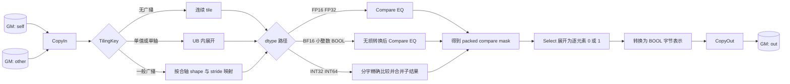

# 需求背景（required）

## 需求来源

参考 CANN 内置 `Equal` 算子的 TBE 实现，在 Atlas A2 训练系列产品和 Atlas A3 系列产品上使用 Ascend C 实现广播逐元素相等比较。新实现保持原有输入输出能力，比较语义改为与 CPU 一致的逻辑值比较，并满足确定性计算要求。

本设计仅描述公开的总体方案，不展开具体内核代码、常量取值和指令级调优细节。

参考实现与信息来源如下：

| 内容 | 路径 |
| --- | --- |
| TBE 动态实现 | `/usr/local/Ascend/ascend-toolkit/latest/opp/built-in/op_impl/ai_core/tbe/impl/ops_legacy/dynamic/equal.py` |
| TBE 算子信息库 | `/usr/local/Ascend/ascend-toolkit/latest/opp/built-in/op_impl/ai_core/tbe/kernel/config/ascend910b/ops_legacy/equal.json` |
| Ascend C 参考工程 | `ops-math/math/equal`、`ops-math/math/tensor_equal` |

## 背景介绍

### Equal 算子功能

对输入张量 `self` 和 `other` 按广播规则对齐后逐元素比较，输出 BOOL 张量：

$$
out_i = (self_i == other_i)
$$

其中 `==` 表示逻辑值相等：

- `+0.0 == -0.0` 为 `True`；
- `NaN` 与任意值（包括另一个 `NaN`）比较均为 `False`；
- 同号无穷大相等，异号无穷大不相等；
- 整数和 BOOL 按数值比较。

### TBE 实现现状分析

TBE 入口函数先完成 dtype 校验和广播场景分类，再为各场景创建占位张量、生成计算图、自动调度并编译。计算阶段存在两类路径：硬件 `vcmp` 比较路径，以及通过减法、绝对值和缩放构造 0/1 结果的数学变换路径。后者对特殊浮点值的行为不够直观，因此 Ascend C 方案统一以逻辑比较为语义基准，不继承任何按位模式判等的行为。

TBE Python 入口的基础校验列表为 BFLOAT16、FLOAT16、FLOAT32、INT64、UINT64、INT32、UINT8、INT8，在支持 16B block 的平台上追加 INT16；Ascend910B 已发布二进制配置还包含 BOOL。目标原型以任务书所列 dtype 为必选集合，并兼容随附验收用例中的 UINT8，具体见“支持数据类型”章节。

下面流程图按 `dynamic/equal.py` 的调用与分支顺序完整展开：

```mermaid
flowchart TD
    A0([调用 equal]) --> A1[读取 x 和 y 的 dtype]
    A1 --> A2{dtype 是否为 uint32}
    A2 -->|是| A3[规范化为 int32]
    A2 -->|否| A4[保持原 dtype]
    A3 --> A4A[初始化 TBE dtype 支持列表]
    A4 --> A4A
    A4A --> A4B{支持 16B block 模式}
    A4B -->|是| A4C[在支持列表追加 int16]
    A4B -->|否| A5[校验两个输入 dtype 在支持列表内]
    A4C --> A5
    A5 --> A6{两个输入 dtype 是否一致}
    A6 -->|否| AX[抛出输入 dtype 不一致错误]
    A6 -->|是| A7[按 ELEWISE_WITH_BROADCAST 分类]
    A7 --> A8{遍历分类得到的每个场景}
    A8 --> A9[variable_shape 生成动态 shape]
    A9 --> A10[创建 tensor_x 和 tensor_y placeholder]
    A10 --> C0[进入 equal_compute]

    C0 --> C1[broadcast_shapes 得到对齐 shape 与输出 shape]
    C1 --> C2{支持 16B block 模式}
    C2 -->|是| C3[x 和 y 转为 float16]
    C3 --> V0[进入 equal_compute_with_cmp]

    C2 -->|否| C4{是否为 v200 平台}
    C4 -->|是| C5[type_range = int64 uint64 float32 float16]
    C4 -->|否| C6[type_range = int64 uint64]
    C5 --> C7{dtype 属于 type_range}
    C6 --> C7
    C7 -->|是| V0
    C7 -->|否| C8{dtype 为 int32 且 vcmp 可用}
    C8 -->|是| V0
    C8 -->|否| C9{dtype 为 float32}

    C9 -->|是| F1[设置 fp32 最小值与三级缩放常量]
    C9 -->|否| F2[设置 fp16 最小值与两级缩放常量]
    F1 --> F3{dtype 为 int8 或 uint8}
    F2 --> F3
    F3 -->|是| F4[x 和 y 转为 float16]
    F3 -->|否| F5[保持计算 dtype]
    F4 --> F6[将 x 和 y 广播到输出 shape]
    F5 --> F6
    F6 --> F7[vsub 计算 x-y]
    F7 --> F8{当前 dtype 支持 vabs}
    F8 -->|是| F9[直接 vabs]
    F8 -->|否| F10[先转 float32 再 vabs]
    F9 --> F11[vmins 与最小正数取小值]
    F10 --> F11
    F11 --> F12[第一次 vmuls 缩放]
    F12 --> F13[第二次 vmuls 缩放]
    F13 --> F14{原 dtype 为 float32}
    F14 -->|是| F15[第三次 vmuls 缩放]
    F14 -->|否| F16[vadds 加 -1]
    F15 --> F16
    F16 --> F17[vabs 得到 0 或 1]
    F17 --> F18[cast_to int8 生成结果]

    V0 --> V1[将 x 和 y 广播到输出 shape]
    V1 --> V2[vcmp EQ 并以 bool 模式输出]

    V2 --> S0[记录 tensor 列表]
    F18 --> S0
    S0 --> S1[在 cce target 下 auto_schedule]
    S1 --> A8
    A8 -->|全部场景完成| S2[汇总 schedules 与 tensor_list]
    S2 --> S3[tbe.build]
    S3 --> S4[bool_storage_as_1bit = false]
    S4 --> Z([生成 Equal TBE kernel])
```



# 需求分析（required）

## 需求描述

使用 Ascend C 实现广播逐元素 Equal 算子，支持 Atlas A2/A3、ND 格式、动态 shape 和确定性计算。输出与 CPU/NumPy/PyTorch 的逻辑相等结果完全一致。

## 需求拆解

1. 校验输入 dtype 一致，输入 shape 满足广播规则，输出为广播结果 shape 的 BOOL 张量。
2. 覆盖任务书要求的 FLOAT16、FLOAT、INT8、INT16、INT32、INT64、BOOL、BFLOAT16；同时兼容任务附件用例中的 UINT8。
3. 浮点比较必须正确处理 `NaN`、`+0.0/-0.0` 和 `+Inf/-Inf`。
4. 支持相同 shape、单值广播和一般多维广播，并对常用无广播场景提供轻量路径。
5. 大 shape 场景使用多核和流水并行，性能目标为不低于 TBE 基线的 95%。

# 详细设计（required）

## 算子分析

### 数学公式

设 `B(self, other)` 为两个输入广播后的公共 shape，则：

$$
\forall i \in B(self, other),\quad out_i = (self_i == other_i)
$$

### 支持数据类型

| 输入 dtype | 输出 dtype | 处理原则 |
| --- | --- | --- |
| FLOAT16、FLOAT | BOOL | 直接按浮点逻辑值比较 |
| BFLOAT16 | BOOL | 无损提升后按浮点逻辑值比较 |
| INT8、UINT8、INT16、BOOL | BOOL | 无损转换到可比较类型后比较 |
| INT32、INT64 | BOOL | 使用整数精确路径，禁止通过有精度损失的浮点值转换完成比较 |

`self` 与 `other` 的 dtype 必须一致。UINT8 为任务附件测试用例覆盖的兼容扩展，不改变任务书所列必选 dtype。

### 支持形状

- 数据格式为 ND；
- 支持 0 维标量及一般张量；
- 两个输入从末维开始满足相等或其中一个维度为 1 的广播规则；
- 输出 shape 等于广播后的公共 shape；
- 不限定静态 shape，Host 侧在运行时完成 shape 校验与 tiling。

## 算子原型

本任务实现的是广播逐元素 `Equal`，不是将整张量归约为单个 BOOL 的 `TensorEqual`。

| 参数 | 参数含义 | 数据类型 | 支持数据类型 | 约束 | 形状 |
| --- | --- | --- | --- | --- | --- |
| self | 第一个输入张量 | tensor | FLOAT16、FLOAT、BFLOAT16、INT8、UINT8、INT16、INT32、INT64、BOOL | 与 `other` 的数据类型一致，数据格式为 ND | 支持标量及一般张量，须与 `other` 满足广播规则 |
| other | 第二个输入张量 | tensor | FLOAT16、FLOAT、BFLOAT16、INT8、UINT8、INT16、INT32、INT64、BOOL | 与 `self` 的数据类型一致，数据格式为 ND | 支持标量及一般张量，须与 `self` 满足广播规则 |
| out | 逐元素相等比较结果 | tensor | BOOL | 数据格式为 ND | 等于 `self` 与 `other` 广播后的公共 shape |

内部算子原型如下：

```cpp
REG_OP(Equal)
    .INPUT(x1, TensorType({DT_FLOAT16, DT_FLOAT, DT_BF16, DT_INT8,
                           DT_UINT8, DT_INT16, DT_INT32, DT_INT64, DT_BOOL}))
    .INPUT(x2, TensorType({DT_FLOAT16, DT_FLOAT, DT_BF16, DT_INT8,
                           DT_UINT8, DT_INT16, DT_INT32, DT_INT64, DT_BOOL}))
    .OUTPUT(y, TensorType({DT_BOOL}))
    .OP_END_FACTORY_REG(Equal)
```

任务书指定的 aclnn 两段式接口保持如下：

```cpp
aclnnStatus aclnnEqualGetWorkspaceSize(
    const aclTensor *self,
    const aclTensor *other,
    aclTensor *out,
    uint64_t *workspaceSize,
    aclOpExecutor **executor);

aclnnStatus aclnnEqual(
    void *workspace,
    uint64_t workspaceSize,
    aclOpExecutor *executor,
    aclrtStream stream);
```

说明：当前 `ops-math` 主干中逐元素接口还存在 `aclnnEqTensor` 命名，本文按社区任务书保留 `aclnnEqual` 原型；实现阶段需以任务目标分支的接口注册结果为准，避免与整张量比较接口混淆。

## 算子实现

### 实现方案

#### Host 侧设计

1. 获取输入输出描述，校验空指针、dtype、format、shape 和输出 BOOL 类型。
2. 对输入 shape 左侧补 1，根据广播规则推导输出 shape；相邻且广播模式相同的轴进行合并，降低 Kernel 侧索引开销。
3. 根据合轴结果选择 TilingKey：
   - `TILING_KEY_0`：两个输入无需广播，按一维连续数据处理；
   - `TILING_KEY_1`：单值或单轴广播；
   - `TILING_KEY_2`：一般多维广播。
4. 从平台信息获取 AIV 核数与 UB 容量。将输出元素数按 tile 对齐后均分给可用核，尾核记录实际处理长度。
5. tile 大小按 dtype 分支的真实 Buffer 数量计算，保证 UB 总占用不超过平台返回值。Compare 使用的有效区按 256 字节对齐，GM 搬运尾块按 32 字节约束处理。

#### Kernel 侧设计

Kernel 采用 `Init -> Process` 结构，`Process` 内执行 `CopyIn -> Broadcast/Compute -> CopyOut`。



关键点如下：

- FLOAT16/FLOAT 使用 `CMPMODE::EQ`，自然满足 `NaN != NaN` 和 `+0.0 == -0.0`。
- BFLOAT16、INT8、UINT8、INT16、BOOL 只允许无损转换后比较。
- INT32/INT64 不能整体转换为 FLOAT 后比较；采用固定宽度子字比较并对同一元素的全部子结果做逻辑与，保证全值域精确。
- Compare 产生的位掩码通过 Select 展开为逐元素 0/1，再写出 BOOL；尾块只写实际元素，padding 不参与有效输出。
- 算子无归约和原子写冲突；相同 tiling 与输入的执行次序固定，因此满足确定性计算。

#### UB 与流水规划

设单次处理的对齐元素数为 `L`，输入与比较类型的字节数分别为 `B_in`、`B_cmp`，整数精确路径的子字数为 `R`。各分支使用下列符号预算，未启用的临时区不分配：

| Buffer | 用途 | 大小上界 |
| --- | --- | --- |
| `inQueueSelf`、`inQueueOther` | 输入搬入 | 各 `2 * L * B_in`，Double Buffer |
| `outQueue` | BOOL 结果搬出 | `2 * L` |
| `castTmp` | 无损类型转换 | 不超过 `2 * L * B_cmp`，可复用 |
| `compareMask` | packed 比较掩码 | `Align256(ceil(R * L / 8))` |
| `selectTmp` | 掩码展开的 0/1 数据 | 不超过 `R * L * 2` |
| `broadcastTmp` | 广播展开 | 不超过 `2 * L * B_in`，仅广播分支分配 |

Host 侧按下式选择最大合法 tile，具体常量由目标 CANN 版本和平台信息确定：

$$
UB_{input}(tile) + UB_{output}(tile) + UB_{tmp}(tile) + UB_{reserved}
\le UB_{platform}
$$

无广播分支不申请 `broadcastTmp`；不同 dtype 分支独立计算 tile，避免按最坏情况统一切得过小。

#### 性能优化方案

- 大 shape 尽量启用全部可用 AIV 核，并通过大小核分配控制负载差异；
- 连续场景走轻量 TilingKey，避免通用广播索引；
- 合并广播模式相同的相邻轴，减少除法、取模和地址计算；
- 使用 Double Buffer 重叠 MTE2、Vector 和 MTE3；小 shape 采用单 tile，减少调度开销；
- Buffer 生命周期不重叠时复用 UB，优先扩大单次处理量；
- INT32/INT64 精确路径只在对应 dtype 启用，不影响常见浮点场景。

## 支持硬件

| 支持的芯片版本 | 是否支持 |
| --- | --- |
| Atlas A2 训练系列产品 | √ |
| Atlas A3 系列产品 | √ |

## 算子约束限制

- `self` 和 `other` 的 dtype 必须一致；
- 输入 shape 必须满足广播规则；
- `out` 必须为 BOOL，shape 必须等于广播结果 shape；
- 仅支持 ND 格式；
- 空 Tensor 直接返回空输出；
- 不使用有精度损失的类型转换代替 INT32/INT64 精确相等比较。

# 可维可测分析

## 精度标准/性能标准

| 验收标准 | 描述 | 标准来源 |
| --- | --- | --- |
| 精度标准 | BOOL 输出逐元素完全一致，`matched_ratio = 1.0`，`rtol = atol = 0` | 社区任务书与生态算子精度标准 |
| 特殊值 | 覆盖 `NaN`、`+0.0/-0.0`、`+Inf/-Inf` | 社区任务书 |
| 泛化能力 | 覆盖相同 shape、标量广播、双向广播、1D 至多维 shape、空 Tensor | 社区任务书 |
| 确定性 | 相同输入多次执行结果一致 | 社区任务书 |
| 性能标准 | 所有核参与的大 shape 场景不低于 TBE 基线的 95% | 社区任务书 |

## 风险与验证关注点

| 风险 | 处理方式 |
| --- | --- |
| Compare/Select 的 dtype 与对齐限制随 CANN 版本变化 | 实现阶段以目标环境头文件和官方 API 文档为准，未验证接口不作为已支持能力 |
| INT32/INT64 转 FLOAT 产生误判 | 使用固定宽度整数精确路径，并覆盖极值与仅单个子字不同的用例 |
| 多维广播地址计算影响性能 | Host 合轴并为无广播、简单广播提供独立 TilingKey |
| 尾块越界或 padding 污染输出 | 统一记录有效长度，搬运与 Compare 分别按其对齐约束处理 |

## 兼容性分析

本方案保持 `Equal` 的广播逐元素输出语义，BOOL 输出采用逐字节 0/1 表示，与 CPU、NumPy `equal` 和 PyTorch `eq` 的逻辑相等规则对齐。Kernel 不申请自定义跨核 workspace；aclnn 层仍按执行器实际计算结果返回 `workspaceSize`，兼容任务书指定的两段式调用方式。
