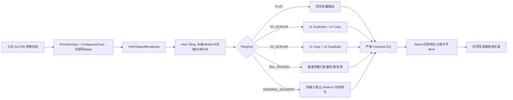
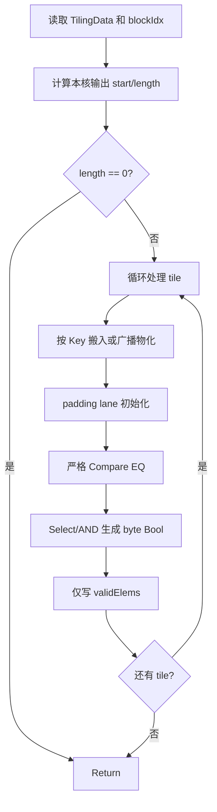

# 需求背景（required）

## 需求来源

本需求来源于 2026 年 8 月社区任务“Equal 算子开发（A2/A3）”。任务要求参考 CANN 9.0.0 环境中的 TBE Equal，实现适配 Atlas A2/A3 的 Ascend C 版本，并完成设计、开发、测试和性能对标。

设计依据如下：

1. `cann/ops-math` 的 `9.0.0` 分支（基线提交 `0bcce5c196b46bf3cec65d607902335c0c0d1af8`）；
2. CANN 9.0.0 安装包中的 TBE Equal 实现与 `ascend910_93` 信息库；
3. 任务书随附 `equal_testCase`；
4. 社区任务设计文档模板及 `ops-math` 中的同类算子实现。

任务书接口章节写为 `aclnnEqual`，随附测试包使用 `EqTensor`。`ops-math` 中现有接口定义为：

- `aclnnEqTensor`：对两个可广播 Tensor 逐元素比较，输出 Bool Tensor；
- `aclnnEqual`：判断两个 Tensor 整体是否相等，语义和输出形态不同。

本文以任务书的功能要求和验收标准为准，固定逐元素 Equal 语义，底层算子类型为 `Equal`。仓库中与该语义一致的候选公共入口是 `aclnnEqTensorGetWorkspaceSize/aclnnEqTensor`；现有 `aclnnEqual` 为整 Tensor 判等。官方确认接入方式前，不新增或覆盖同名 `aclnnEqual` 符号。内部 `DT_BOOL` 结果按每个逻辑元素物化为一个值为 0 或 1 的字节，不等同于 Compare 的 packed predicate。

任务书参数表要求支持 8 种 dtype：`FLOAT16、FLOAT、BFLOAT16、INT8、INT16、INT32、INT64、BOOL`。任务书同时要求对齐原 TBE 能力，随附 `op.json`、用例说明和 TBE 信息库均包含 `UINT8`。dtype 范围分为：

- 任务书强制 8 种：必须全部通过 A2/A3 AICore 验收；
- 附件兼容 1 种 `UINT8`：纳入实现和自测，使附件 50 例可完整执行。

AICore 实现共覆盖 9 种 dtype。任务范围外 dtype 保持现有公共 API 行为：A2/A3 不支持的类型（如 UINT64）保持原错误处理，DOUBLE、COMPLEX 等类型保持原 fallback 路径。

## 背景介绍

### Equal 算子实现优化

Equal 对两个输入张量进行逐元素逻辑值比较。输入 shape 可以不同，但必须满足右对齐广播规则；输出为广播后 shape 的逐字节 Bool Tensor。

任务指定的 TBE 参考位置在当前 CANNLab 环境中核验为：

| 组件 | 当前环境路径 |
| --- | --- |
| 动态 TBE 实现 | `/home/developer/Ascend/cann-9.0.0/opp/built-in/op_impl/ai_core/tbe/impl/ops_legacy/dynamic/equal.py` |
| APT 编译入口 | `/home/developer/Ascend/cann-9.0.0/opp/built-in/op_impl/ai_core/tbe/impl/ops_math/dynamic/equal_apt.py` |
| A3 信息库 | `/home/developer/Ascend/cann-9.0.0/opp/built-in/op_impl/ai_core/tbe/kernel/config/ascend910_93/ops_legacy/equal.json` |
| 开源接口实现 | `math/equal/op_api/aclnn_eq_tensor.cpp`、`math/equal/op_api/equal.cpp` |
| 开源广播推形 | `math/equal/op_host/equal_infershape.cpp` |

### Equal 算子 TBE 实现现状分析

TBE 动态实现先调用 `broadcast_shapes` 计算公共输出 shape，再根据 dtype 和硬件能力选择两类路径：

1. 支持 `vcmp` 的路径：广播两个输入后执行 `vcmp(..., "eq", mode="bool")`；
2. 其余路径：对输入做 Cast、Sub、Abs、Mins、Muls 等数学变换，再转为 `int8` 结果。

第二类路径并非直接逻辑比较。NaN 经过 Sub/Abs/Min/Mul 链后的行为可能与 IEEE `==` 不一致；有损 Cast 也可能把两个不同值映射为同一浮点值。因此测试需覆盖 NaN、`+0/-0` 和整数边界。

CANNLab `ascend910_93` TBE 信息库的能力如下：

| 参数 | 输入/输出 | TBE 信息库 dtype | format | shape |
| --- | --- | --- | --- | --- |
| x1 | 输入 | BF16、BOOL、FP16、FP32、INT32、INT64、INT8、UINT8 | ND | 与 x2 可广播 |
| x2 | 输入 | 同 x1 | ND | 与 x1 可广播 |
| y | 输出 | BOOL | ND | x1、x2 的广播结果 |

A3 TBE 信息库支持上述 8 种 dtype，不含 INT16；任务书要求 `FP16、FP32、BF16、INT8、INT16、INT32、INT64、BOOL`。AICore 实现取二者并集，共 9 种，即任务书 8 种加附件兼容 UINT8。

Equal 使用严格逻辑比较，不采用“相减后与 epsilon 比较”或有损 Cast。

当前 `ops-math 9.0.0` 中已有正式目录 `math/equal`，其现状如下：

| 模块 | 现状 | 本任务处理 |
| --- | --- | --- |
| ACLNN 参数校验 | 已实现非空、rank≤8、广播输出 shape 校验 | 复用现有参数校验逻辑 |
| InferShape | 已调用 `InferShape4Broadcast` | 复用广播规则 |
| L0 调用 | 已计算广播 shape，并按平台选择 AICore/AICPU | 增加 A2/A3 Ascend C 能力后确保目标 dtype 走 AICore |
| AICore Kernel | 仅有 `arch35`（Ascend 950）实现 | 新增 A2/A3 共用的 DAV_2201 实现 |
| OpDef 产品注册 | 仅注册 Ascend 950 等配置 | 增加 `ascend910b` 和 `ascend910_93` |

### 参考实现分析

公共接口以 `ops-math 9.0.0@0bcce5c196b46bf3cec65d607902335c0c0d1af8` 为基线，A2/A3 实现参考 `ops-math upstream/master@49c69ebe6dade4b135964608705513e7030e1ba9`。

| 参考实现 | 可复用设计 | 主要差异 | 本任务处理 |
| --- | --- | --- | --- |
| 正式 `math/equal`（9.0.0） | `aclnnEqTensor` 契约、PromoteType、Contiguous、Cast、ViewCopy 和广播推形 | DAV_2201 白名单不含 INT16，且无 A2/A3 Kernel | 复用公共接口和推形逻辑，补充 A2/A3 AICore 实现 |
| `experimental/math/is_close` | A2/A3 注册、右对齐广播、stride=0、合轴、尾维 segment、DataCopyPad 和 LibApi workspace | 计算公式和 dtype 范围不同 | 复用广播寻址和尾维分段策略 |
| `experimental/math/equal` | `aclnn_exclude` 构建形式、Compare+Select 调用方式 | 仅注册 A2，dtype 和广播能力不完整 | 复用工程结构，重新实现推形、Tiling 和 Kernel |
| `greater/less/logical_and` | Compare+Select 及 Bool/小整数转换 | 未实现通用广播寻址 | 用于确认 Compare 和结果物化方式 |
| `is_close/gcd` | stride=0、线性起点反解和坐标增量推进 | Gcd 使用逐元素 GM 访问 | 复用 cursor 思路，数据访问采用批量搬运 |

任务书要求代码最终提交到 `experimental/math`。候选集成方案如下：

1. 交付目录为 `experimental/math/equal`，作为独立 custom OPP 模块构建；
2. `CMakeLists.txt` 使用仓库实验算子惯例 `add_all_modules_sources(OPTYPE equal ACLNNTYPE aclnn_exclude)`，不在 custom 包中重复编译第二套 ACLNN 符号；
3. custom 模块只构建自身的 OpDef、InferShape、Tiling 和 Kernel，并同时注册 `ascend910b/ascend910_93`；
4. 候选接入方式下，由系统已有 `aclnnEqTensor` 完成 PromoteType、Contiguous、内部 Bool 输出和 ViewCopy，再按自定义算子包优先级调度 custom `Equal` AICore 实现；安装后通过 profiler 和 kernel 名确认实际路由；
5. `experimental` 与正式 `math/equal` 不在同一 custom target 中同时链接，避免同一目标内的重复 API/OpDef 符号。

正式 `math/equal` 的 DAV_2201 L0 AICore 白名单不含 INT16，仅安装 custom Host/Kernel 时 INT16 会进入 AICPU。INT16 接入可采用以下两种方式之一：在正式 `math/equal/op_api/equal.cpp` 中补充 DAV_2201 白名单，或采用官方指定的不修改正式 L0 的调度方式。具体方式须在设计定稿并进入完整实现前确认。

### Equal 算子功能分析

| 参数 | 参数含义 | 类型 | 支持 dtype | format | shape/约束 |
| --- | --- | --- | --- | --- | --- |
| self | 任务书公共输入 | Tensor | FLOAT16、FLOAT、BFLOAT16、INT8、INT16、INT32、INT64、BOOL；另兼容附件 UINT8 | ND | 与 other 同 dtype；0D 或 rank 1～8，与 other 可广播 |
| other | 任务书公共输入 | Tensor | 同 self | ND | 与 self 同 dtype；0D 或 rank 1～8，与 self 可广播 |
| out | 任务书公共输出 | Tensor | BOOL | ND | shape 为两个输入的广播结果 |
| x1 | 内部 Equal AICore 输入 | Tensor | FP16、FP32、BF16、INT8、UINT8、INT16、INT32、INT64、BOOL，且与 x2 相同 | 连续 ND | 公共 API 预处理后的广播输入 |
| x2 | 内部 Equal AICore 输入 | Tensor | 同 x1 | 连续 ND | 公共 API 预处理后的广播输入 |
| y | 内部 Equal AICore 输出 | Tensor | BOOL | 连续 ND | shape 为 x1、x2 的广播结果 |

任务验收按 self/other 同 dtype、out 为 Bool 执行。既有 `aclnnEqTensor` 的 mixed dtype PromoteType、非连续输入处理和非 Bool public out 转换能力纳入兼容性回归；内部 Kernel 保持同 dtype、连续 ND、Bool 输出。

计算公式：

\[
y_i = \begin{cases}
\mathrm{True}, & x1_{\phi_1(i)} = x2_{\phi_2(i)} \\
\mathrm{False}, & \text{otherwise}
\end{cases}
\]

其中 \(\phi_1\)、\(\phi_2\) 是从输出线性位置到两个输入的广播地址映射。

# 需求分析（required）

## 需求描述

使用 Ascend C 为 Atlas A2/A3 实现 `Equal` AICore Kernel，覆盖任务书强制 8 种 dtype 和附件兼容 UINT8，支持内部连续 ND、0D 标量及 rank 1～8 的合法广播，生成内部逐字节 Bool。公共入口名称按设计评审结论接入；候选方案复用 `aclnnEqTensor` 的 PromoteType、格式连续化和输出 Cast 契约。结果必须与 CPU 的逻辑 `==` 完全一致，且在任务书指定的满核性能场景中达到 TBE 基线的 95% 以上。

## 需求拆解

| ID | 需求 | 设计响应 | 验证标准 |
| --- | --- | --- | --- |
| F-01 | 逐元素 Equal | 底层算子类型为 `Equal`；公共符号及接入方式待设计评审确认 | 与 `torch.eq/numpy.equal` 每元素一致 |
| F-02 | 广播泛化 | 右对齐补 1、广播 stride 置 0、最多 8 维 | 同形、跨 rank、双侧、多轴、标量广播通过 |
| F-03 | 严格逻辑比较 | 原生 Compare 或无损扩宽后 Compare；INT64 保持 64 位精确性 | `+0==-0`、`NaN!=NaN`、同号 Inf 相等 |
| F-04 | 8 种强制 dtype + UINT8 附件兼容 | 编译期类型分派，不用 dtype 扩张几何 TilingKey | 9 种 AICore 路径的普通值、边界值、广播、尾块通过 |
| F-05 | 任务/兼容/内部契约 | 任务：同 dtype、Bool out；公共兼容：PromoteType、Contiguous、out Cast；内部：同 dtype、连续 ND、Bool y | 任务强制契约全部通过；既有混合 dtype/格式/out dtype UT 不回归；内部参数非法时不启动 Kernel |
| F-06 | 空 Tensor | 正确推形，元素数为 0 时不启动无效 GM 访问 | `[0,3]` 与 `[1,3]` 输出 `[0,3]` |
| F-07 | 确定性 | 无原子写冲突；padding 初始化且不写入逻辑输出 | 同输入重复执行逐字节一致 |
| P-01 | 精度 | Bool 严格匹配，无容差 | rtol=0、atol=0、matched_ratio=1.0 |
| PF-01 | 大 shape 性能 | 同形专用快路径、满核切分、批量搬运 | 每个指定大 case 的 TBE/AscendC ≥ 0.95 |
| PF-02 | 小 shape | 减少启动和同步开销；必要时提交仿真分析 | 按任务书例外规则提供实测与证据 |
| HW-01 | A2/A3 | 同一 DAV_2201 Kernel，分别注册 `ascend910b`、`ascend910_93` | 两平台分别编译、部署、回归 |

广播维度规则不是简单取 `max(a,b)`。对右对齐后的每一维：

1. 若 `a == b`，输出维为 `a`；
2. 否则若 `a == 1`，输出维为 `b`（`b` 可以为 0）；
3. 否则若 `b == 1`，输出维为 `a`（`a` 可以为 0）；
4. 否则输入不兼容。

因此 `(0,1)` 的广播结果是 `0`，空 Tensor 与 0D 标量必须分别处理。

# 详细设计（required）

## 算子分析

### 数学公式

设输出 shape 为 `B = broadcast(shape(x1), shape(x2))`。对输出坐标 `o=(o0,...,or-1)`，输入 `xk` 在第 `d` 维的坐标为：

\[
i_{k,d} = \begin{cases}
0, & shape(x_k)_d = 1 \\
o_d, & shape(x_k)_d = B_d
\end{cases}
\]

随后执行严格逻辑比较：

\[
y[o] = (x1[i_1] == x2[i_2])
\]

浮点语义：

- `+0.0 == -0.0` 为 True；
- `NaN` 与任何值均为 False；
- `+Inf == +Inf`、`-Inf == -Inf` 为 True；
- `+Inf == -Inf` 为 False。

### 支持数据类型

| 输入 dtype | 比较路径 | 精确性理由 |
| --- | --- | --- |
| FLOAT16 | 原生 Compare EQ | IEEE 逻辑比较 |
| FLOAT | 原生 Compare EQ | IEEE 逻辑比较 |
| INT32 | 原生 Compare EQ | 无减法，不溢出 |
| BFLOAT16 | 无损扩宽到 FP32 后 Compare EQ | 每个 BF16 值均可在 FP32 中精确表示 |
| INT8、UINT8、BOOL | 无损扩宽到 FP32 后 Compare EQ | 全值域可精确表示 |
| INT16 | 无损扩宽到 FP32 后 Compare EQ | 全值域可精确表示 |
| INT64 | 原生 Compare；不支持时拆成高/低 32 位分别 EQ 后逻辑 AND | 避免 Cast 到 FP32/FP64 造成大整数舍入 |

开发时通过 CANN 9.0.0 A2/A3 最小工程确认 API 重载和硬件支持。原生重载不可用时采用表中的无损等价方案。

### 支持形状

- ND 格式；
- 0D 标量及 rank 1～8；
- 同 shape；
- 单侧或双侧广播；
- 首轴、中轴、尾轴和多轴广播；
- 空 Tensor；
- 非连续 ND ACLNN 输入由既有 `Contiguous` 流程转为连续 Tensor 后进入 Kernel；不承诺 NCHW 等其它 format。

## 算子实现

### 实现方案

#### 方案比较

| 方案 | 描述 | 正确性 | 性能/风险 | 结论 |
| --- | --- | --- | --- | --- |
| A | 两输入按相同线性 offset 平铺比较 | 仅同形正确 | 无法支持广播 | 拒绝 |
| B | ACLNN 先把两个输入 Expand 成完整输出，再调用平铺 Kernel | 正确 | 多一次或多次 Kernel 启动及 GM 中间张量，难达 95% | 仅调试兜底，不作为交付方案 |
| C | Host 生成对称广播 stride，Kernel 分快路径和通用路径就地物化广播 | 正确 | 复杂度可控；同形性能最佳 | 采用 |

#### 总体架构



#### Host 侧设计

##### 1. OpDef、InferShape 与 ACLNN

1. custom OpDef 的内部 x1/x2/y 注册 9 组对应 dtype，内部输出均为 Bool、ND；不收窄公共 ACLNN 的输入、格式或 out dtype 契约；
2. AICore 同时注册 `ascend910b`（A2）和 `ascend910_93`（A3）；二者复用 DAV_2201 Kernel；
3. InferShape 使用仓内统一的 `InferShape4Broadcast`；
4. 候选接入方式下，系统 ACLNN 继续负责非空、rank≤8、广播 shape、输出 shape、PromoteType、Contiguous、内部 Bool 结果 Cast 和 ViewCopy；custom 模块不重复编译 ACLNN；
5. custom OpDef、Tiling、Kernel 注册 INT16 实例。现有 `math/equal/op_api/equal.cpp` 的 DAV_2201 AICore 路由白名单不含 INT16，需根据设计评审结论补充正式 L0 白名单或采用官方指定的调度方式；
6. 现有系统 `aclnnEqTensorGetWorkspaceSize` 在任一输入为空时已短路返回成功；custom Host 仍做防御：若 `totalOutElems==0`，在框架允许时不生成 Kernel task；若框架要求非零 blockDim，则设置 `blockDim=1`，Kernel 在读取任何 GM 前按 `totalOutElems==0` 立即返回。

文件与构建边界按实验算子模板布局：

```text
experimental/math/equal/
├── CMakeLists.txt                    # OPTYPE equal, ACLNNTYPE aclnn_exclude
├── op_host/
│   ├── equal_def.cpp                 # 注册 ascend910b + ascend910_93
│   ├── equal_infershape.cpp          # InferShape4Broadcast
│   └── equal_tiling.cpp              # 两产品共用 DAV_2201 Tiling
└── op_kernel/
    ├── equal.cpp                     # Kernel 入口/编译期 dtype 分派
    ├── equal.h                       # FLAT/标量/尾维分段广播实现
    ├── equal_tiling_data.h
    └── equal_tiling_key.h
```

A2 和 A3 共用 DAV_2201 Kernel/Tiling。若工程模板使用架构子目录，CMake 将 `ascend910b` 和 `ascend910_93` 映射到同一实现目录，并分别配置 `SUPPORT_COMPUTE_UNIT/TILING_DIR`。

##### 2. Shape 补全、stride 和合轴

设两个输入最大 rank 为 `r`。Host 将较短 shape 在左侧补 1，并从右向左计算连续 stride。若某维输入大小为 1 且输出维大于 1，则该输入该维 stride 设为 0。

相邻维只有在 `(x1Broadcast, x2Broadcast)` 状态完全一致且两个输入各自保持物理连续时才合并。对每个输入：相邻两轴均广播时可合并；相邻两轴均不广播时还需满足 `stride[d] == stride[d+1] * outDim[d+1]`；广播状态不同或 stride 递推不成立时禁止合并。例如：

```text
x1 = [2, 1, 4]
x2 = [1, 3, 1]
out= [2, 3, 4]

x1 broadcast flags = [0, 1, 0]
x2 broadcast flags = [1, 0, 1]
```

上述交替模式不能错误合并为一维；通用路径按保留的三维寻址。合轴后 rank 仍不超过 8。

##### 3. TilingKey 规划

TilingKey 只表示几何路径，不与 9 种 dtype 做笛卡尔积：

| Key | 名称 | 条件 | Kernel 策略 |
| --- | --- | --- | --- |
| 0 | `FLAT` | 两输入 shape 与输出相同 | 两输入连续 CopyIn，最高优先级性能路径 |
| 1 | `X1_SCALAR` | x1 所有有效 stride 均为 0 | x1 读一次后 Duplicate，x2 连续搬入 |
| 2 | `X2_SCALAR` | x2 所有有效 stride 均为 0 | x2 读一次后 Duplicate，x1 连续搬入 |
| 3 | `TAIL_PACKED` | Host 证明每个核从尾行边界开始且完整尾行可放入 tile；Kernel 允许在 launch 内按外层源偏移稳定区间拆 packed 子段 | 两输入分别计算连续/复用行上限；子段内源 offset 恒定时才复制一条源 row，边界处调用通用 materializer |
| 4 | `GENERAL_SEGMENT` | 任意其它合法 rank≤8 广播，包括单行大于 UB、双侧交替广播和每核非行首起点 | 输出线性区间切成不跨尾维边界的 segment，两个输入独立物化 |

若工程模板限制 TilingKey 数量，可将 Key 1～4 合并为一个 `BCAST` Key，并在 TilingData 的 `mode` 字段中分派。DAV_2201 静态 `Broadcast<T, dim, axis>` 作为可选 `STATIC_BRC_OPT`；在目标 dtype、axis 和对齐条件验证通过且同机 profiling 优于 segment 路径时启用。

##### 4. 分核策略

分核以输出逻辑元素数为基准：

- `FLAT` 路径定义 `minElemsPerCore` 为同时满足输入/Bool 输出 MTE 对齐和 Compare 粒度的最小元素数，`usedCoreNum = min(aivCoreNum, ceil(totalOutElems / minElemsPerCore))`；该阈值按 dtype 通过编译验证和 profiling 确定；
- 大 shape 优先使用全部可用 Vector Core；
- `FLAT` 路径数据不能均分时，前 `formerCoreNum` 个核处理大块，其余核处理小块；
- 每核起始位置和长度均以 64 位计算，避免大 shape 乘积溢出；
- 广播路径仍按输出线性元素数分核，每核可以从任意线性 offset 开始；Kernel 在本核起点只做一次坐标反解，再把区间切成 `segmentLen=min(remainingCoreElems, tileElems, tailDim-tailCoord, transferLimit)` 的 segment。因此一个尾行大于 UB、每核起点不在行首和双侧互补广播都不要求重新按完整重复单元分核；
- 每核只能写入自己的输出区间，不使用原子操作。

##### 5. TilingData

TilingData 传递 Host/Kernel 间的广播、分核和 UB 切分信息。实现使用仓内 `BEGIN_TILING_DATA_DEF/TILING_DATA_FIELD_DEF` 等标准宏：

```cpp
// Equal Host/Kernel tiling parameters
struct EqualTilingData {
    uint64_t totalOutElems;
    uint64_t formerCoreElems;
    uint64_t tailCoreElems;
    uint64_t tileElems;
    uint64_t maxCompareElems;
    uint32_t usedCoreNum;
    uint32_t formerCoreNum;
    uint32_t collapsedRank;
    uint32_t mode;
    uint32_t bufferNum;
    uint64_t outDims[8];
    uint64_t x1Strides[8];
    uint64_t x2Strides[8];
};
```

`tileElems` 是每次 segment 可处理的逻辑最大元素数；`maxCompareElems` 是由 UB 容量决定的最大补齐计算元素数。每个 segment 单独计算 `compareCount=AlignUp(segmentLen, alignElems)`，并保证 `compareCount<=maxCompareElems`。补齐区只存在于 UB，不扩大 GM 读写范围。

`outDims/x1Strides/x2Strides` 用于从本核线性起点恢复双输入 offset 并增量推进。若搬运参数超过 `DataCopyExtParams/DataCopyParams` 字段上限，Host 继续拆分 segment。

可选 `STATIC_BRC_OPT` 若最终启用，其 `src/dstShape2D、broadcastAxis、tmpBytes` 等字段放入专用 TilingData 或明确的扩展区，不污染通用 segment ABI。

##### 6. UB 预算和 tile 选择

Host 从平台接口动态获取 UB 大小，不硬编码 192 KiB。定义：

- `A_x1Mat/A_x2Mat = AlignUp(maxCompareElems * sizeof(srcT), 32)`，为两个输入直接物化成当前连续 segment 后的比较张量；尾 stride=1 时批量搬入，尾 stride=0 时由一个合法搬入的 scalar 在 UB 内 Duplicate；
- `A_scalar` 为最多两个输入的标量缓冲；若实现要求 32B 搬入单元，应使用合法 padding 搬入或专用 scalar 路径，禁止通过单元素 GM `GetValue` 绕过尾块安全；
- `A_row=A_x1Row+A_x2Row` 为 `TAIL_PACKED` 可能同时存活的两个输入行缓冲总和，只为确实需要独立 row buffer 的输入计入；若直接在 `A_x1Mat/A_x2Mat` 首行原地做 Local→Local 复制，则相应 `A_xiRow=0`；
- `A_cmp = AlignUp(maxCompareElems * sizeof(computeT), 32)`；
- `A_out = AlignUp(maxCompareElems, 32)`；
- `A_pred` 为 Compare predicate 缓冲空间，其布局和大小通过编译及语义测试确定，不按未经验证的 `ceil(N/8)` 计算；
- `A_brcTmp` 只属于可选静态 Broadcast 快路径，由目标签名对应的 Tiling 接口计算；通用 segment 主路径不依赖它；
- `A_selectTmp` 为 Select/Bool 物化所需常量 Tensor 或临时区，由目标 API 签名和生命周期分析确定；
- `R=reserveBytes` 为平台/队列管理和安全余量，从平台编译信息或仓内同架构模板取得，禁止凭经验硬编码；
- `B` 为队列 buffer 数（1 或 2）；
- `N_tmp` 为不同 dtype 路径的同时存活计算 Tensor 数。

UB 按 TilingKey 和 dtype 路径分别计算峰值存活量，不能用一条低估公式覆盖全部路径：

\[
\begin{aligned}
UB_{flat,native} &= B(A_{x1Mat}+A_{x2Mat}+A_{out}) + A_{pred}+A_{selectTmp}+R \\
UB_{flat,cast} &= B(A_{x1Mat}+A_{x2Mat}+A_{out}) + 2A_{cmp}+A_{pred}+A_{selectTmp}+R \\
UB_{segment} &= B(A_{x1Mat}+A_{x2Mat}+A_{out}) + A_{scalar}+A_{row} \\
&\quad + N_{tmp}A_{cmp}+A_{pred}+A_{selectTmp}+R
\end{aligned}
\]

INT64 fallback 使用独立峰值公式，其中 `A_i32` 为一个 N-lane INT32 Tensor，`A_bytePred` 为一个已物化的 N-byte predicate，`A_logic` 为 byte And 或无损扩宽 And 的最大中间区，`A_gatherTmp` 为高低位拆分临时区：

\[
UB_{int64}=B(A_{x1Mat}+A_{x2Mat}+A_{out})+A_{scalar}+A_{row}+4A_{i32}+2A_{bytePred}+A_{logic}+A_{gatherTmp}+A_{pred}+A_{selectTmp}+R
\]

所有 UB 缓冲按 `maxCompareElems` 分配，运行时只处理当次 `compareCount/segmentLen`，尾部 lane 使用确定性 padding。INT64 的 low/high Compare 串行复用 `A_pred/A_selectTmp`，Host 为该路径单独求 tile。`B` 只乘队列缓冲；`alignElems` 按目标 API 的元素粒度确定。

双缓冲不是默认正确性条件：

- 大 shape `FLAT` 路径在 profiling 证明 MTE2/MTE3 为瓶颈后启用 `B=2`，并同步减小 tile；
- 小 shape 或通用广播路径可使用 `B=1`，减少 UB 和同步开销；
- 若启用双缓冲，必须把循环改造成预取流水，不能只修改 `InitBuffer` 的 buffer 数。

##### 7. 数据检测

公共 ACLNN 在预处理阶段检查必选指针、公共 dtype/format/out 约束、rank 和广播 shape。custom Host 在启动内部 Kernel 前进一步检查：

- 内部 x1/x2 已具有相同 promoted dtype，且属于 9 种 AICore 目标类型；
- 内部 x1/x2 连续 ND，内部 y 为 Bool，shape 等于广播结果；
- rank≤8；
- shape 满足广播规则；
- shape 元素数和字节数计算不溢出；
- `coreNum`、UB 大小、搬运字段上限和 tile 长度均合法（空 Tensor 例外）。

#### Kernel 侧设计

##### 1. 初始化与主流程

Kernel 采用 `Init → Process`，`Process` 内部为 `CopyIn/MaterializeBroadcast → Compare → MaterializeBool → CopyOut`。



##### 2. 同形与标量快路径

- `FLAT`：两个输入按连续 tile 批量搬入，适配任务书五个性能 case；
- `X1_SCALAR/X2_SCALAR`：标量只从 GM 读取一次，在 UB 内用 `Duplicate` 扩展；另一输入连续搬入；
- 非 32B 逻辑尾块使用方向匹配的扩展搬运接口，只读取/写入真实字节数。

##### 3. 尾维分段广播主路径

通用正确性路径采用仓内 A2/A3 `IsClose` 已落地的尾维分段思想，而不是要求一个完整广播重复单元必须放入 UB。Host 右对齐 shape、把广播轴 stride 设为 0，并只在双输入广播状态和物理连续关系都一致时合轴；Kernel 接收 `outDims[8]、x1Strides[8]、x2Strides[8]`，可从任意本核线性区间起点开始。

对本核区间只在起点执行一次 `LinearToCoord` 和双输入 offset 计算；随后按以下规则循环：

```text
coord, x1Offset, x2Offset = InitCursor(coreStart, outDims, x1Strides, x2Strides)
remaining = coreLength
while remaining > 0:
    tailRemain = outDims[last] - coord[last]
    segmentLen = Min(remaining, tileElems, tailRemain, dataCopyFieldLimit)

    MaterializeOneInput(x1, x1Offset, x1Strides[last], segmentLen, x1Local)
    MaterializeOneInput(x2, x2Offset, x2Strides[last], segmentLen, x2Local)
    CompareAndWriteValid(segmentLen)

    AdvanceCursorByTailSegment(coord, x1Offset, x2Offset, segmentLen)
    remaining -= segmentLen
```

合轴后每个输入的尾 stride 必须为 0 或 1：

- 尾 stride=1：从对应 GM offset 以 DataCopyPad/扩展 DataCopy 批量搬入连续 `segmentLen`；
- 尾 stride=0：合法搬入一个 scalar 后在 UB 内 Duplicate 为 `segmentLen`；
- 两个输入独立判断，因此 `[2,3,1]` 与 `[2,1,3]` 等双侧互补广播无需特殊地址公式；
- segment 永不跨越输出尾维边界，所以跨行时只需对外层坐标做加法进位并更新双输入 offset；不构造完整输出索引表，也不做逐元素除模；
- 若一个尾行大于 UB，同一行自然被拆成多个 segment；若单次搬运字段不足，再按字段上限继续拆分，均不截断参数。

`TAIL_PACKED` 在通用算法之上增加整行优化。Host 只负责保证每核从行边界开始且一条完整尾行可放入 UB。Kernel 在当前行把每个输入的外层映射分类为 `CONST_ROW`、`CONTIG_ROWS` 或 `GENERAL`，并分别计算该映射关系保持不变的最大行数 `mappingRunRows_i`：

```text
packedRows = Min(tileRows,
                 mappingRunRows_x1,
                 mappingRunRows_x2,
                 rowsUntilCoreEnd)
```

`CONST_ROW` 只搬入一行并用 Local→Local DataCopy 复制；`CONTIG_ROWS` 批量搬入物理连续的多行；`GENERAL` 调用通用 row/segment materializer。`packedRows` 不跨越任一输入的映射模式变化边界，可覆盖 `x1=[2,1,N]、x2=[1,3,N]` 等双输入复用周期不同的情况。最后不足整组或其它前提不满足时局部回退，不改变本次 launch 的 TilingKey 和输出映射。

DAV_2201 静态 `Broadcast<T, dim, axis>` 作为可选 `STATIC_BRC_OPT`。其 rank、axis、dtype、临时空间和 32B 对齐均有限制，仅在 CANN 9.0.0 A2/A3 的目标 dtype 和签名验证通过，且同机 profiling 优于 `GENERAL_SEGMENT/TAIL_PACKED` 时启用。INT32、INT64、BOOL、BF16、INT16 及非对齐场景仍使用 segment 路径。

所有广播物化只改变布局、不改变数值；禁止为方便广播而有损 Cast，也禁止逐元素 GM `GetValue/SetValue`。极端 rank8 交替广播只会产生更多 segment，不改变正确性。

##### 4. Compare 和 Bool 物化

Compare 计算长度按目标 API 要求的 `alignElems` 补齐，padding lane 先确定性初始化。`AlignUp(count, 256)` 中的 256 是元素数，不作为 256B 对齐使用。Compare predicate 通过 Compare+Select 物化为逐字节 0/1；predicate 类型、布局、缓冲大小、Select 模式以及 valid/padded count 由 CANN 9.0.0 A2/A3 编译和语义验证确定。

| API/模式 | 参考实现 | 使用方式 |
| --- | --- | --- |
| DataCopyPad/扩展 DataCopy | CANN 9.0 官方文档和 A2/A3 IsClose | 用作非对齐 GM↔UB 主路径；ExtParams 字段宽度通过编译验证确认 |
| Local→Local DataCopy、Duplicate | IsClose 的整行复用和 scalar 展开 | 用于 `TAIL_PACKED` 和标量物化；重载及对齐按 CANN 9.0 接口定义配置 |
| Compare→Select→Cast | IsClose、Less | FP16/FP32/INT32 使用原生路径，其它 dtype 采用无损扩宽或整数拆分 |
| 静态 Broadcast | 9.0 官方 API/编程场景说明能力和限制 | 仅 `STATIC_BRC_OPT`，失败时回退 segment，不影响正确性 |
| Reinterpret/Gather/And | INT64 精确 fallback | 验证 lane 顺序、端序、Gather 参数和 byte 物化；不可用时采用其它等价整数路径 |

INT64 路径必须保持全 64 位精确性：

- A2/A3 支持原生 `Compare<int64_t>` 时直接使用；
- 否则在 UB 内用 Gather/等价重排把 `[lo0,hi0,lo1,hi1,...]` 拆成 `N` lane 的 low/high INT32 Tensor；low、high 各执行一次 Compare，并分别通过 Select 物化为 N 字节 0/1；若目标版本支持 byte `And`，对两个 byte Tensor逐元素求 And；若不支持，则把两个 0/1 byte 无损扩宽为受支持的整型执行 And，再 Cast/Select 回 0/1 byte。该方案不直接对 packed predicate 做相邻位 AND；
- 通过测试确认 `ReinterpretCast<int32_t>` 或等价视图的 lane 顺序、Gather 偶/奇 lane 参数以及 byte→整型→byte 的无损转换签名；
- 禁止将 INT64 转为 FP32/FP64 后比较。

##### 5. 尾块安全

- GM→UB：使用 `DataCopyExtParams/DataCopyPadExtParams` 搬入逻辑有效字节，UB padding 单独初始化；
- Compare：当次使用 `compareCount=AlignUp(valid segmentLen, alignElems)` 且不超过 `maxCompareElems`，padding 结果不会计入逻辑输出；
- UB→GM：使用目标版本支持的扩展 CopyOut 签名，只回写 `validElems` 对应的 Bool 字节；
- 若目标签名的 `blockLen/blockCount/srcStride/dstStride` 字段宽度不足以表示当前 tile，Host 必须按字段上限继续拆分，禁止截断强转；
- 最后一个核、最后一个 tile 和非对齐行都不得访问 `totalOutElems` 之外地址；
- 空 Tensor 不进入 Kernel。

##### 6. Workspace

Equal 不需要跨核中间结果或原子归并，因此不增加算法级全局 scratch。Host 参考 IsClose 调用 `GetLibApiWorkSpaceSize()` 设置基础库 API workspace；公共 ACLNN 预处理 workspace 仍由 executor 实际计算。

### 性能优化方案

1. 同形大 Tensor 固定命中 `FLAT`，采用连续大块搬运、满 Vector Core 切分和 CopyIn/Compute/CopyOut 流水，避免广播索引开销；
2. 单元素广播命中 `X1_SCALAR/X2_SCALAR`，标量只搬入一次并在 UB 内 Duplicate；
3. 所有合法广播由尾维 segment 主路径处理；连续完整尾行使用整行或重复行复用。静态 `Broadcast` 在 API 验证与 A/B profiling 均通过时启用；
4. tile 大小按各 dtype 和路径独立计算；双缓冲只在 A/B profiling 证明吞吐提升且 UB 可容纳时启用；
5. 小 shape 限制分核并减少队列/TBuf 初始化成本，大 shape 使用全部可用 Vector Core；阈值由编译验证和同机 profiling 确定；
6. 性能优化不改变严格 Bool 比较语义。

## 支持硬件

| 产品 | SoC 配置 | 内核架构 | 支持 |
| --- | --- | --- | --- |
| Atlas A2 训练系列产品 | `ascend910b` | DAV_2201，共用 A2/A3 Kernel | √ |
| Atlas A3 训练系列产品 | `ascend910_93` | DAV_2201，共用 A2/A3 Kernel | √ |

本任务不采用仅适用于 DAV_3510（Ascend 950/A5）的 NDDMA 或动态 UB Broadcast 方案。

## 算子约束限制

- 公共 `aclnnEqTensor` 的 format、混合 dtype PromoteType 和 out dtype 行为保持现有契约；
- 进入内部 Equal AICore Kernel 的 x1/x2 必须是相同 promoted dtype、连续 ND，内部 y 必须为 Bool；
- 公共输入和输出 rank 不超过 8；
- shape 必须满足右对齐广播规则；
- 本任务 AICore 承诺任务书 8 种强制 dtype，并兼容附件 UINT8；公共 API 其它既有 dtype 保持原 fallback，不在本任务中删除；
- 对超大 shape，Host 的元素数、stride 和偏移使用 64 位并检查溢出；
- 不使用原子操作，不依赖未初始化 padding；
- API 具体错误码沿用仓库公共校验宏，负向测试只要求返回非成功状态。

# 可维可测分析

## 精度标准/性能标准

| 验收项 | 标准 | 来源 |
| --- | --- | --- |
| Bool 精度 | `rtol=0`、`atol=0`、`matched_ratio=1.0`，逐字节完全一致 | 最新任务书、生态精度标准 |
| 特殊值 | `+0==-0`；NaN 与任何值不等；同号 Inf 相等 | 最新任务书 |
| 确定性 | 相同输入重复执行，输出逐字节一致 | 最新任务书 |
| 大 shape 性能 | 每个满核 case `TBE_latency / AscendC_latency >= 0.95` | 最新任务书 |
| 小 shape | 先实测；满足任务书例外条件时提交仿真图和分析 | 最新任务书 |

任务强制 ST 和性能用例使用 self/other 同 dtype，public out 和内部 y 均为 Bool。mixed dtype PromoteType、可转换的非 Bool public out 和非连续输入作为公共 API 兼容性回归。“任意维度”按正式 `aclnnEqTensor` 约束覆盖 0D 及 rank 1～8。

### 测试层级与证明对象

| 层级 | 主要内容/落盘位置 | 能证明 | 不能证明 |
| --- | --- | --- | --- |
| L0 公共 OP_API UT | 复用/扩展 `math/equal/tests/ut/op_api`：GetWorkspaceSize 状态、空 Tensor、rank/shape/out/null、mixed dtype/format | 公共校验、兼容行为和 executor 构造 | 设备结果、custom Kernel 被调用或 AICore 路由 |
| L1 Host Infer/Tiling UT | `experimental/math/equal/tests/ut/op_host`：逐例断言 key/mode、blockNum、workspace、shape/stride/core/tail 字段 | Host 推形、分核、segment 元数据和 LibApi workspace 设置 | Kernel 数值、设备内存安全和真实路由 |
| L2 Kernel ICPU/Simulator UT | 固定 `gen_data.py → bin → ICPU_RUN_KF/Simulator → raw output`；9 dtype×Key×tail | Kernel 算法、原始 Bool `{0,1}`、精确 golden、部分越界检测 | A2/A3 真实硬件性能及最终 ACLNN→custom 路由 |
| L3 A2/A3 ST/E2E | AscendOpTest：附件 50 例+固定补充集；保存 raw Bool、tilingKey、kernel 名、Core Type、异常日志 | Host+Kernel 集成、两平台精度、18 格真实 AICore 路由 | 与 TBE 的公平性能比值，除非另按性能口径采集 |
| L4 Perf | 独立性能套件和自测报告：TBE/custom 隔离、同输入、完整调用 device tasks、原始样本与环境 | 每 case 95%、满核证据及性能稳定性 | 不替代功能/负向覆盖 |

每个 `gen_data.py` 中定义的 case 必须有对应 C++ TEST/CTest 登记或由明确的参数化测试枚举实际执行；禁止出现“生成了多例但测试二进制只注册一例”的假覆盖。L0/L1/L2 通过均不能推断 custom AICore 已命中，只有 L3 profiler/kernel/Core Type 证据可以关闭路由格。

### 精度与泛化测试矩阵

任务附件含 50 例，覆盖 9 种 dtype、rank 1～8、同形和单侧广播，但缺少 0D、空 Tensor、双侧广播、非法输入及浮点特殊值。附件用例作为基础回归集，并补充以下固定用例。

| 类别 | 必测内容 |
| --- | --- |
| dtype | 9 种类型各覆盖普通值、边界值、全 True、全 False、混合结果 |
| 浮点特殊值 | `+0/-0`、NaN/NaN、NaN/有限值、NaN/Inf、±Inf、最大有限、最小正规和次正规数 |
| 整数边界 | 各整数 MIN/MAX；INT32 的 `2^24` 与 `2^24+1`；INT64 的 `2^24`、`2^32`、`2^53` 相邻值，并覆盖仅高 32 位/仅低 32 位不同 |
| shape | 0D、rank 1～8、同形、跨 rank、首/中/尾轴、多轴、双侧交替广播 |
| BOOL 穷举 | 单元素和广播场景覆盖 TT、TF、FT、FF 四种组合 |
| 空 Tensor | `[0]`、`[2,0,3]`、`[0,3]` 与 `[1,3]`、标量与空 Tensor；同时覆盖合法空广播与不兼容空广播 |
| 对齐边界 | 32B 前/等于/后、Compare `alignElems` 前/等于/后、tile±1、尾行±1、核切分±1 |
| 尾块安全 | 输出有效区前后放置 canary/protected region，运行后验证保护区未变化；必要时结合 sanitizer/异常检测 |
| 非法公共参数 | A2/A3 UINT64、广播不兼容、rank>8、错误 out shape、空指针和元素数溢出；断言返回非成功且不启动 AICore Kernel |
| 非法内部参数 | x1/x2 dtype 不同、y 非 Bool、非法 format/shape/Tiling 字段；由 Host UT 验证拒绝路径 |
| 非连续/格式兼容 | mixed dtype PromoteType、ND 连续化、非 Bool out Cast/ViewCopy、非连续 ND Tensor；安装前后均成功且结果一致 |
| 任务外 dtype/别名兼容 | DOUBLE、COMPLEX、UINT64 等保持原 fallback/错误行为，并覆盖 inplace/别名契约 |
| 确定性 | 固定输入重复运行至少 10 次并逐字节比较 |

测试数据使用固定 seed 并写入自测报告；数值 dtype 的随机用例约 80% 在各 dtype 可表示的 `[-100,100]` 范围内采样，约 20% 定向注入对应 dtype 的特殊值、整数边界、相等/不等对和广播边界；BOOL 直接覆盖 TT、TF、FT、FF 及其广播组合。每个 dtype 先通过 AscendOpTest 的 `compare_result=True` 检查，再执行原始字节校验：把设备 Bool 输出按 `uint8` 读取，断言所有有效字节只属于 `{0,1}`，并与 `golden.astype(np.uint8)` 逐字节完全一致。附件原始 50 例在 A2、A3 各完整执行一次。

为证明各 TilingKey 均被真实执行，测试报告须记录以下覆盖证据：

| Key | 最小命中用例 | 必留证据 |
| --- | --- | --- |
| `FLAT` | 两输入同 shape 大 Tensor | tiling key、kernel 名、block_dim |
| `X1_SCALAR` | x1 为 0D，x2 为 Tensor | tiling key、profiler/kernel 日志 |
| `X2_SCALAR` | x2 为 0D，x1 为 Tensor | 同上 |
| `TAIL_PACKED` | 一输入外层广播、多行且尾维连续、分核落在行边界；再用 `x1=[2,1,N]、x2=[1,3,N]` 跨双输入复用周期边界 | 同上，并证明 row-once 只覆盖 source offset 稳定子段，最后 packed group/核尾不足整组时局部 fallback |
| `GENERAL_SEGMENT` | rank8 交替广播、双侧互补广播、每核非行首起点、单尾行大于 UB，以及非 32B 对齐 row | 同上，并记录 segment 数和最大长度 |

各 Key 在可达条件下覆盖非对齐尾块；`TAIL_PACKED` 还覆盖最后 packed group 和局部 fallback。使用 canary、Simulator 或 guard page 检查越界，精确长度分配只作辅助。

### 性能测试

| ID | dtype | shape | 理论最小 GM 流量 | 目标 |
| --- | --- | --- | --- | --- |
| PERF-1 | FP16 | `[1024,4096]` | 20 MiB | 满核，≥TBE 95% |
| PERF-2 | FP16 | `[4096,4096]` | 80 MiB | 满核，≥TBE 95% |
| PERF-3 | FP32 | `[1024,4096]` | 36 MiB | 满核，≥TBE 95% |
| PERF-4 | INT32 | `[1024,4096]` | 36 MiB | 满核，≥TBE 95% |
| PERF-5 | FP16 | `[256,256]` | 0.3125 MiB | 小 shape 实测/必要时仿真分析 |

测试口径：

1. A2、A3 分别测量；TBE 与 Ascend C 使用相同硬件、CANN、输入 bin 和 profiler 口径；
2. 安装 custom OPP 前采集 TBE 基线；若两者必须共存，则显式禁用 custom 路径，并记录实际 TBE kernel 名；
3. 启用 custom OPP 后记录 OPP 搜索路径、kernel 名和 Core Type；A2×9 dtype 与 A3×9 dtype 共 18 组均需命中 custom AICore；
4. 先确认两路输出完全一致，再比较 msprof device `Task Duration`；一次调用包含多个 device task 时汇总该调用的全部相关 task；
5. 每例预热 5 次，正式测量不少于 10 次；报告原始值、均值、中位数和离散程度，均值比和中位数比均不低于 0.95；
6. 满核场景同时记录 `block_dim`、可用 AIV 数和 profiler 中实际参与的 Core ID；仅在活跃核数与可用 AIV 数一致时声明使用全部 Vector Core；
7. 每例单独判断，不使用跨 case 平均值掩盖失败；
8. 自测报告记录软硬件版本、性能策略和预先确定的异常样本规则；验收主值使用全部原始样本，同时列出剔除前后统计。

若小 shape 未达到 95%，且属于任务书所述“10 μs 以下场景、绝对差约/不超过 3 μs”的例外范围，则提交原始数据、流水仿真图、MTE2/Vector/MTE3 占比及原因分析。

## 兼容性分析

- 功能语义为逐元素 Bool Tensor，公共入口按设计评审结论接入；
- 广播推形与仓内 `InferShape4Broadcast` 保持一致；
- 非连续输入继续通过 ACLNN 的 `Contiguous` 处理；
- 新增 A2/A3 AICore 实现，不改变 Ascend 950 的 `arch35` 路径；
- 对任务范围外 dtype 保持原有 AICPU/错误处理策略，不扩大本次验收承诺。

## 参考资料

1. Equal A2/A3 任务书：[官方活动页](https://www.hiascend.com/developer/activities/details/11014a50a8794171a4a08688fd398774#tab0)、[任务中心指引](https://www.hiascend.com/activities/task-center/details/e65dd3fcabf1444299784f2232d67456?menu=guide)。
2. [社区任务设计文档模板（固定快照）](https://gitcode.com/cann/cann-ops-competitions/blob/77b8bdd0051d923675f4ca358dbec307b132dc02/04_tasks/01_community-task-2026/resources/design_template.md)
3. [社区任务仓参与及交付说明（固定快照）](https://gitcode.com/cann/cann-ops-competitions/blob/77b8bdd0051d923675f4ca358dbec307b132dc02/04_tasks/01_community-task-2026/README.md)
4. [ops-math Equal 9.0.0 基线](https://gitcode.com/cann/ops-math/tree/0bcce5c196b46bf3cec65d607902335c0c0d1af8/math/equal)
5. [CANN 9.0.X Ascend C API 列表](https://www.hiascend.com/document/detail/en/CANNCommunityEdition/900/API/ascendcopapi/atlasascendc_api_07_0003.html)
6. [CANN 9.0.X DataCopyPad API](https://www.hiascend.com/document/detail/zh/CANNCommunityEdition/900/API/ascendcopapi/atlasascendc_api_07_0265.html)
7. [生态算子开源精度标准](https://gitcode.com/cann/opbase/blob/master/docs/zh/ops_precision_standard/experimental_standard.md)（检索日期 2026-08-27）
8. [社区任务流程及注意事项讨论 #39](https://gitcode.com/org/cann/discussions/39)
9. [CANN 9.0 Broadcast 编程场景](https://www.hiascend.com/document/detail/zh/CANNCommunityEdition/900/programug/Ascendcopdevg/atlas_ascendc_10_10011.html)
10. [CANN 9.0 Broadcast API](https://www.hiascend.com/document/detail/zh/canncommercial/900/API/ascendcopapi/atlasascendc_api_07_0853.html)
11. [上游 IsClose A2/A3 实现](https://gitcode.com/cann/ops-math/tree/49c69ebe6dade4b135964608705513e7030e1ba9/experimental/math/is_close)
12. [上游实验 Equal 实现](https://gitcode.com/cann/ops-math/tree/49c69ebe6dade4b135964608705513e7030e1ba9/experimental/math/equal)

## 风险与验证

| 风险 | 影响 | 验证措施 | 处理方案 |
| --- | --- | --- | --- |
| 任务书 `aclnnEqual` 与现有整 Tensor 判等接口语义不同 | 发生语义或 ABI/符号冲突 | 设计评审确认公共接口名称和接入方式 | 保持逐元素 Equal 语义，按评审结论调整接口层 |
| custom `aclnn_exclude` 与正式 API 的调度优先级 | custom Kernel 未被调用或重复注册 | 安装最小 custom 包，通过 profiler 核验实际 kernel | 根据实测结果调整 CMake、OPP 路径和注册方式 |
| INT16 不在现有 DAV_2201 L0 AICore 白名单 | INT16 进入 AICPU | 确认正式 L0 白名单或其它受支持调度方式，并执行路由测试 | 修改正式 L0 白名单或采用官方指定方法 |
| A2/A3 Compare 重载差异 | 部分 dtype 编译失败 | 两平台最小编译验证 | 无损扩宽；INT64 使用高低 32 位精确比较 |
| Compare predicate 布局或 Select 签名差异 | Bool 结果布局错误 | 编译验证和 0/1 原始字节检查 | 按目标 API 的 predicate 布局物化并仅写逻辑长度 |
| Compare 补齐粒度处理错误 | GM 越界或结果错误 | 覆盖对齐粒度前、等于、后及 32B/tile 边界 | DataCopyPad、UB padding 和仅回写 validElems |
| segment cursor/stride 推进错误 | 双侧或高维广播错误 | rank 1～8 属性测试、每核非行首和单行大于 UB 用例 | 保持尾维不跨界，起点反解后使用加法进位 |
| `TAIL_PACKED` 跨输入复用周期复制错误 row | 双侧外层广播结果错误 | 两输入独立计算映射稳定区间；`[2,1,N]` vs `[1,3,N]` 跨周期测试 | packed 子段截在最近变化边界，局部回退通用 segment |
| 通用 segment 过短 | 极端 pattern 性能差 | rank8 交替广播 profiling | 增加经实测证明必要的专用 Key 或 `STATIC_BRC_OPT`，但不替换正确性主路径 |
| 参考实现发生变化 | 接口或约束不一致 | 使用固定 commit 和 CANN 9.0 API 文档 | 重新验证相关 API 和参数 |
| 双缓冲只增 UB 无收益 | 性能倒退 | 单/双缓冲同机 A/B | 小 shape/通用路径保持单缓冲 |
| INT64 有损 Cast | 错误结果 | `2^24±1`、`2^32±1`、`2^53±1`、高/低位单独不同、MIN/MAX 用例 | 原生 Compare 或高低位 EQ+AND |
| 附件用例覆盖不足 | 泛化验收失败 | 执行附件 50 例及新增测试矩阵 | 增加固定 seed 的 property test |
