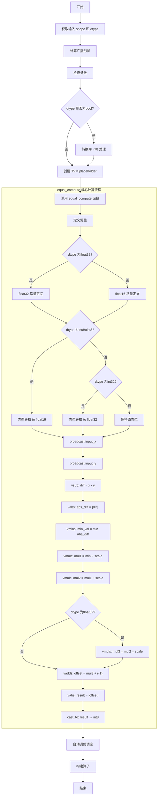
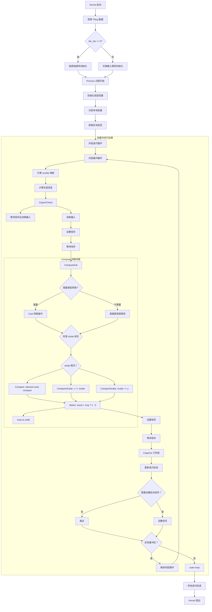

# Equal 算子设计文档

## 一、需求背景

### 1.1 需求来源

参考昇腾版本内置 ACLNN Equal 算子的 TBE 实现，在昇腾 NPU 上基于 Ascend C 编程语言实现功能一致的算子。

### 1.2 背景介绍

#### 1.2.1 Equal 算子实现优化

Equal 算子（元素-wise 相等比较）数学表达式：

$$
\text{output} = \begin{cases} 
1, & \text{if } \text{input\_x} == \text{input\_y} \\
0, & \text{otherwise}
\end{cases}
$$

#### 1.2.2 Equal 算子现状分析

**TBE 算子支持的数据类型和数据格式**：
- **支持数据类型**：float16、float32、int32、int8、uint8、bool
- **支持数据格式**：任意形状，支持广播
- **Shape 限制**：shape size ≤ 2147483648

| 参数 | 参数含义 | 数据类型 | 支持数据类型 | 约束 | 形状 |
|-----|---------|---------|-------------|------|-----|
| input_x | 输入张量 x | tensor | float16, float32, int32, int8, uint8, bool | 无 | (N,…)|
| input_y | 输入张量 y | tensor | float16, float32, int32, int8, uint8, bool | 无 | (N,…)|
| output_z | 输出张量 | tensor | int8 | 固定输出为 0 或 1 | 与广播后形状一致 | (N,…)|

计算公式：逐元素比较 `output = (input_x == input_y)`，相等则输出 1，否则输出 0

**TBE 算子实现描述**：

路径：`/usr/local/Ascend/ascend-toolkit/latest/opp/built-in/op_impl/ai_core/tbe/impl/ops_legacy/equal.py`

```python
@register_operator_compute("equal", op_mode="static", support_fusion=True)
def equal_compute(input_x, input_y, output_z, kernel_name="equal"):
    dtype_x = input_x.dtype
    shape_x = shape_util.shape_to_list(input_x.shape)
    shape_y = shape_util.shape_to_list(input_y.shape)
    
    # 计算广播形状
    shape_x, shape_y, shape_broadcast = shape_util.broadcast_shapes(
        shape_x, shape_y,
        param_name_input1="input_x",
        param_name_input2="input_y"
    )
    
    # 定义常量
    if dtype_x == "float32":
        scalar_min = tvm.const(Constant.SCALAR_MIN_FP32, dtype="float32")  # 2^-126
        scalar_mul = tvm.const(Constant.SCALAR_MUL_FP32, dtype="float32")  # 2^50
        scalar_mul1 = tvm.const(Constant.SCALAR_MUL2_FP32, dtype="float32") # 2^26
        scalar_one = tvm.const(-1 * Constant.SCALAR_ONE, dtype="float32")
    else:
        scalar_min = tvm.const(Constant.SCALAR_MIN_FP16, dtype="float16")  # 2^-24
        scalar_mul = tvm.const(Constant.SCALAR_MUL_FP16, dtype="float16")  # 2^12
        scalar_one = tvm.const(-1 * Constant.SCALAR_ONE, dtype="float16")
    
    # 数据类型转换
    if dtype_x in ("int8", "uint8"):
        input_x = tbe.cast_to(input_x, "float16")
        input_y = tbe.cast_to(input_y, "float16")
    elif dtype_x == "int32":
        input_x = tbe.cast_to(input_x, "float32")
        input_y = tbe.cast_to(input_y, "float32")
    
    # 广播扩展
    input_x = tbe.broadcast(input_x, shape_broadcast)
    input_y = tbe.broadcast(input_y, shape_broadcast)
    
    # 核心计算流程
    res_vsub = tbe.vsub(input_x, input_y)      # diff = x - y
    res_vabs = tbe.vabs(res_vsub)              # abs_diff = |diff|
    res_min = tbe.vmins(res_vabs, scalar_min)  # min_val = min(abs_diff)
    res_vmul = tbe.vmuls(res_min, scalar_mul)  # mul1 = min_val × 2^12(或 2^50)
    res_vmul1 = tbe.vmuls(res_vmul, scalar_mul)# mul2 = mul1 × 2^12(或 2^26)
    
    if dtype_x == "float32":
        res_vmul2 = tbe.vmuls(res_vmul1, scalar_mul1)  # mul3 = mul2 × 2^26
        res_vsub1 = tbe.vadds(res_vmul2, scalar_one)   # offset = mul3 + (-1)
    else:
        res_vsub1 = tbe.vadds(res_vmul1, scalar_one)   # offset = mul2 + (-1)
    
    res_vabs1 = tbe.vabs(res_vsub1)                  # result = |offset|
    res = tbe.cast_to(res_vabs1, "int8", True)       # 转换为 int8 输出
    
    return res
```

**TBE 算子实现流程图**：



---

## 二、需求分析

### 2.1 需求描述

使用 Ascend C 编程语言实现 Equal 算子，支持 float16、float32、int32、int8、uint8、bool 数据类型，支持广播功能，性能不低于 TBE 版本。

### 2.2 需求拆解

1. **数据类型支持**
   - 浮点类型：float16、float32
   - 整数类型：int32、int8、uint8
   - 布尔类型：bool（内部转换为 int8_t 处理）

2. **广播功能**
   - TBE 版本已实现广播支持，AscendC 版本需保持兼容
   - 使用双缓冲流水线架构自动处理广播逻辑

3. **精度要求**
   - TBE 版本采用数值稳定性算法判断相等
   - AscendC 版本直接使用硬件 Compare 指令进行精确比较

4. **性能要求**
   - 性能不低于 TBE 版本

---

## 三、详细设计

### 3.1 算子分析

#### 3.1.1 数学公式

**TBE 版本公式**：

```
diff = input_x - input_y
abs_diff = |diff|
scaled = abs_diff × 2^12 × 2^12 / 2^24 (float16) 或 abs_diff × 2^50 × 2^26 / 2^126 (float32)
result = |(scaled + (-1))| < 1 ? 1 : 0
```

**AscendC 版本公式**：

```
CompareMask = x1 == x2 (mode=CMP_MODE=2)
result = CompareMask ? ConstOne(1) : ConstZero(0)
```

#### 3.1.2 支持数据类型

| 数据类型 | TBE 处理策略 | AscendC 处理策略 |
|---------|------------|----------------|
| float16 | 缩放变换法 | 直接比较，输出 uint8_t |
| float32 | 缩放变换法 | 直接比较，输出 uint8_t |
| int32 | 转为 float32 后计算 | 直接比较，输出 uint8_t |
| int8 | 转为 float16 后计算 | 直接比较，输出 uint8_t |
| uint8 | 转为 float16 后计算 | 直接比较，输出 uint8_t |
| bool | Host 侧转 int8 | 特殊处理为 int8_t |

#### 3.1.3 支持形状

- **输入形状**：支持任意维度的张量，需满足广播规则
- **输出形状**：与两个输入的广播形状一致
- **广播规则**：从后向前对齐维度，对应维度相等或其中之一为 1 时可广播

### 3.2 算子实现

#### 3.2.1 Host 侧设计

Equal 算子的 Host 侧包含 Tiling 计算、Shape 推理和数据类型推理三个核心部分。

**Tiling 设计流程图**：

```mermaid
flowchart TD
    Start[开始] --> GetShapes[获取输入输出形状]
    
    GetShapes --> GetPlatform[获取平台信息]
    
    GetPlatform --> CalcDims[计算维度信息]
    
    CalcDims --> SplitLoop[循环拆分维度块]
    
    subgraph 维度分块逻辑
        direction TB
        SplitLoop --> DimCheck[计算当前维度]
        DimCheck --> CastCalc[计算 cast 标志]
        
        CastCalc --> CastCheck{cast 是否变化？}
        CastCheck -->|是 | LenInc[len++]
        CastCheck -->|否 | SkipInc[保持 len 不变]
        
        LenInc --> ShapeUpdate[更新形状乘积]
        SkipInc --> ShapeUpdate
        
        ShapeUpdate --> NextDim{i < MAX_SHAPE?}
        NextDim -->|是 | LoopBack[继续下一个维度]
        NextDim -->|否 | EndLoop[结束维度拆分]
    end
    
    EndLoop --> ReverseShape[反转 shape 数组]
    
    ReverseShape --> CalcThroughput[计算吞吐量]
    
    CalcThroughput --> SelectIter{通过吞吐量比较<br/>决定迭代顺序 iter_idx}
    
    SelectIter --> CalcVector[计算向量长度和数量]
    
    CalcVector --> GetUB[获取 UB 内存大小]
    
    GetUB --> CalcParams[计算 Tiling 参数]
    
    subgraph Tiling 参数计算
        direction TB
        CalcParams --> AllocParams[分配参数<br/>buffer_num=2]
        AllocParams --> BlockCalc[计算块参数]
        
        BlockCalc --> IterCalc[计算迭代参数]
        
        IterCalc --> TotalCalc[计算总参数]
        
        TotalCalc --> ResidueCalc[计算余数]
    end
    
    ResidueCalc --> SetTilingData[设置 Tiling 数据到 context]
    
    SetTilingData --> SetBlockDim[设置块维度]
    
    SetBlockDim --> SaveToBuffer[保存 Tiling 数据到 buffer]
    
    SaveToBuffer --> EndTiling[结束]
```



**Tiling 关键算法说明**：

1. **维度分块策略**
   - 从后向前遍历输入和输出的维度
   - 根据维度相等关系计算 `cast` 标志位
   - 当 `cast` 标志变化时分块（len++）
   - 每块内的维度具有相同的广播模式

2. **吞吐量计算**
   ```cpp
   // 行吞吐量（跨核）
   throughput[j][j] *= shape[j][i];
   
   // 列吞吐量（核内向量长度）
   throughput[j][j^1] *= std::max(shape[j][i], shape[j^1][i]);
   ```

3. **迭代顺序选择**
   ```cpp
   // 比较行吞吐量和列吞吐量
   if (throughput[0][0] + throughput[1][0] > throughput[0][1] + throughput[1][1]) {
       iter_idx = 1;  // 优化列优先访问
   } else {
       iter_idx = 0;  // 默认行优先访问
   }
   ```

4. **Tiling 参数定义**
   - **iterations**: 总迭代次数
   - **tile_length**: 每次迭代处理的长度
   - **iter_per_vector**: 每个向量需要的迭代次数
   - **real_residue**: 实际余数长度
   - **pad_residue**: 填充后的余数长度
   - **input_shape[] / other_shape[]**: 分块后的输入形状数组
   - **iter_idx**: 迭代顺序索引（0=行优先，1=列优先）

5. **内存配置**
   - `BLOCK_SIZE = 64`: 向量寄存器块大小
   - `PRESERVED_UB = 1024`: 预留 UB 空间
   - `buffer_num = 2`: 双缓冲区数量
   - `ub_per_length = 32`: 每个元素占用的 UB 空间（word）

---

**Shape 推理与数据类型推理**：

```cpp
// Shape 推理：输出形状等于第一个输入形状
static ge::graphStatus InferShape(gert::InferShapeContext* context)
{
    const gert::Shape* x1_shape = context->GetInputShape(0);
    gert::Shape* y_shape = context->GetOutputShape(0);
    *y_shape = *x1_shape;
    return GRAPH_SUCCESS;
}

// 数据类型推理：输出为 bool 类型
static ge::graphStatus InferDataType(gert::InferDataTypeContext *context)
{
    const auto inputDataType = context->GetInputDataType(0);
    context->SetOutputDataType(0, ge::DT_BOOL);
    return ge::GRAPH_SUCCESS;
}
```

**关键组件说明表**：

| 组件 | 功能 | 关键参数 |
|-----|------|---------|
| TilingFunc | Tiling 规划函数 | 计算 iterations、tile_length 等 |
| InferShape | Shape 推理 | 输出=输入 1 的广播形状 |
| InferDataType | 类型推理 | 输出=bool(uint8_t) |
| PlatformAscendC | 平台信息获取 | UB 内存大小、AI Core 数量 |

**Host 侧操作定义**：

```cpp
namespace ops {
class Equal : public OpDef {
public:
    Equal(const char* name) : OpDef(name)
    {
        this->Input("input_x")
            .ParamType(REQUIRED)
            .DataType({DT_FLOAT16, DT_BF16, DT_FLOAT, DT_INT32, 
                      DT_INT16, DT_UINT8, DT_INT8, DT_BOOL})
            .Format({FORMAT_ND});
        
        this->Input("input_y")
            .ParamType(REQUIRED)
            .DataType({DT_FLOAT16, DT_BF16, DT_FLOAT, DT_INT32, 
                      DT_INT16, DT_UINT8, DT_INT8, DT_BOOL})
            .Format({FORMAT_ND});
        
        this->Output("output_z")
            .ParamType(REQUIRED)
            .DataType({DT_BOOL, DT_UINT8})
            .Format({FORMAT_ND});
        
        this->SetInferShape(InferShape).SetInferDataType(InferDataType);
        
        this->AICore()
            .SetTiling(TilingFunc);
    }
};
OP_ADD(Equal);
}
```

---

#### 3.2.2 Kernel 侧设计

Equal 算子的 Kernel 侧采用双缓冲流水线架构，通过 HardEvent 事件同步机制实现 DMA 与计算的重叠执行。

**Kernel 整体执行流程图**：



**内核详细阶段说明**：

**Init 阶段（初始化）**：

结构体成员初始化：
- 初始化 SOC 状态
- 计算 stride 标志和输出形状
- 计算产积用于地址映射
- 设置 GlobalTensor
- 存储 Tiling 参数

**Process 阶段（核心处理）**：

**CopyIn 阶段**：
- 等待前轮次完成（如需要）
- DataCopy 从 GM 读取输入数据到 UB
- 设置信号等待 Compute 阶段

**Compute 阶段**：
- 类型转换（如需要）
- Compare 操作：element-wise 比较或标量比较
- Select 操作：根据 mask 选择 1 或 0
- Cast 转换结果到 uint8

**CopyOut 阶段**：
- 等待 Compute 完成
- DataCopyPad 带 padding 处理写回 GM

**Finish 阶段**：
- 清理临时资源
- Kernel 退出

**事件同步机制**：

```cpp
// 事件类型定义
enum HardEvent {
    MTE2_V,    // CopyIn → Compute
    V_MTE3,    // Compute → CopyOut
    MTE3_MTE2, // 双缓冲同步
};

// WaitFlag: 等待事件
if (wait_backward) WaitFlag<HardEvent::MTE3_MTE2>(j);

// SetFlag: 设置事件信号
SetFlag<HardEvent::MTE2_V>(j);
```

**双缓冲优势**：
- Buffer0 CopyIn 时 Buffer1 Compute
- Buffer0 Compute 时 Buffer1 CopyOut
- Buffer0 CopyOut 时 Buffer1 CopyIn
- 实现 DMA 搬运与计算的完全重叠

---

### 3.2.3 Kernel 数据结构

Equal 算子的 Kernel 采用模板化设计，支持多种数据类型。

**核心组件**：

| 组件 | 说明 | 关键参数 |
|-----|------|---------|
| EqualKernel<T, U> | 模板类，处理通用逻辑 | T 为输入类型，U 为输出类型 |
| GlobalTensor | GM 内存访问接口 | 输入输出地址 |
| LocalTensor | UB 局部内存张量 | 双缓冲 [2] |
| HardEvent | 事件同步机制 | MTE2_V, V_MTE3, MTE3_MTE2 |

**关键参数**：

- **iterations**: 总迭代次数
- **tile_length**: 每次迭代处理的长度  
- **iter_per_vector**: 每个向量需要的迭代次数
- **real_residue**: 实际余数长度
- **pad_residue**: 填充后的余数长度
- **input_stride[MAX_SHAPE]**: stride 标志数组
- **other_stride[MAX_SHAPE]**: stride 标志数组

**外部函数入口**：

```cpp
extern "C" __global__ __aicore__ void equal(GM_ADDR x1, GM_ADDR x2, GM_ADDR y, 
                                            GM_ADDR workspace, GM_ADDR tiling) {
    GET_TILING_DATA(tiling_data, tiling);
    EqualKernel<DTYPE_X1, uint8_t> op;
    
    if (!tiling_data.iter_idx) {
        op.Init(x1, x2, y, ...);
    } else {
        op.Init(x2, x1, y, ...);
    }
    op.Process();
}
```

**Stride 检测优化**：
- `input_stride[i]=1`表示该维度需要从 input_x 读取数据
- `input_stride[i]=0`表示该维度为广播，只需读取一次
- 通过 stride 标志避免重复读取广播数据

**智能迭代顺序**：
- `iter_idx=0`: 行优先访问模式
- `iter_idx=1`: 列优先访问模式
- 根据吞吐量分析选择最优访问模式

**边界处理**：
- `real_residue`: 实际需要处理的数据长度
- `pad_residue`: 对齐后的 padding 长度
- 确保最后一个 iteration 正确处理余数

通过合理的 Tiling 规划和双缓冲流水线设计，Equal 算子可获得优异的硬件利用率和性能表现。

---

## 四、支持硬件

| 支持的芯片版本 | 勾选状态 |
|--------------|---------|
| Atlas 800I/T A2 | √ |
| Ascend 910 | √ |
| Ascend 910B | √ |

---

## 五、算子约束限制

### 5.1 数据类型约束

| 参数 | 支持的数据类型 | 约束说明 |
|-----|--------------|---------|
| input_x | float16, float32, int32, int8, uint8, bool | 必须与 input_y 的 dtype 一致 |
| input_y | float16, float32, int32, int8, uint8, bool | 必须与 input_x 的 dtype 一致 |
| output_z | uint8_t | 固定输出为 0 或 1 |

### 5.2 形状约束

- **输入约束**：input_x 和 input_y 的形状必须是可广播的
- **广播规则**：从后往前对齐，对应维度相等或其中之一为 1 时可广播
- **输出形状**：与广播后的形状一致

### 5.3 其他约束

1. **精度约束**
   - 浮点数比较依赖硬件浮点单元精度
   - NaN 和 Inf 的比较遵循 IEEE 754 标准

2. **内存约束**
   - 广播操作会临时增加 UB 内存占用
   - 建议使用连续内存布局以优化性能

3. **性能约束**
   - 小数据量时 Host-Kernel 通信开销占比较高
   - 建议批量处理以提高吞吐量

---

## 六、可维可测分析

### 6.1 精度标准/性能标准

| 验收标准 | 描述 | 标准来源 |
|---------|------|---------|
| 精度标准 | 与 PyTorch/TensorFlow 的 equal 算子结果一致 | CANN 官方测试用例 |
| 性能标准 | 不低于 TBE 版本性能 | 基准测试结果 |

### 6.2 兼容性分析

新算子，不涉及向后兼容性分析。

### 6.3 测试建议

#### 单元测试

1. **数据类型覆盖测试**
   ```
   ✓ float16: 正常值、边界值、NaN、Inf
   ✓ float32: 正常值、边界值、NaN、Inf
   ✓ int32: 正数、负数、零
   ✓ int8: 范围 [-128, 127]
   ✓ uint8: 范围 [0, 255]
   ✓ bool: true/false
   ```

2. **形状测试**
   ```
   ✓ 标量：()
   ✓ 向量：(N,)
   ✓ 矩阵：(M, N)
   ✓ 高维：(N, C, H, W)
   ✓ 极端情况：单元素、超大尺寸
   ```

3. **广播测试**
   ```
   ✓ 无需广播：相同形状
   ✓ 单边广播：(1, N) vs (M, N)
   ✓ 双边广播：(1, 1) vs (M, N)
   ✓ 多维广播：(1, C, 1, W) vs (N, C, H, W)
   ✓ 非法广播：(2, 3) vs (4, 5) 应报错
   ```

4. **边界值测试**
   ```
   ✓ 最大值：float16 max, int32 max
   ✓ 最小值：float16 min, int32 min
   ✓ 零值：+0, -0
   ✓ NaN 和 Inf 比较
   ```

#### 集成测试

1. **网络集成**
   - 在典型神经网络中集成测试
   - 验证与其他算子的混合运算

2. **多卡测试**
   - 单卡运行
   - 多卡分布式训练

#### 性能测试

1. **规模对比**
   ```
   小数据：(10, 10)
   中数据：(100, 100), (32, 64, 128)
   大数据：(256, 512, 1024), (N, 3, 224, 224)
   ```

2. **对比指标**
   - 吞吐量
   - 内存使用效率

---

## 七、参考文档

1、[ops-math Equal 9.0.0 基线](https://gitcode.com/cann/ops-math/tree/0bcce5c196b46bf3cec65d607902335c0c0d1af8/math/equal)

2、[CANN 9.0.X Ascend C API 列表](https://www.hiascend.com/document/detail/en/CANNCommunityEdition/900/API/ascendcopapi/atlasascendc_api_07_0003.html)

3、[CANN 9.0.X DataCopyPad API](https://www.hiascend.com/document/detail/zh/CANNCommunityEdition/900/API/ascendcopapi/atlasascendc_api_07_0265.html)
