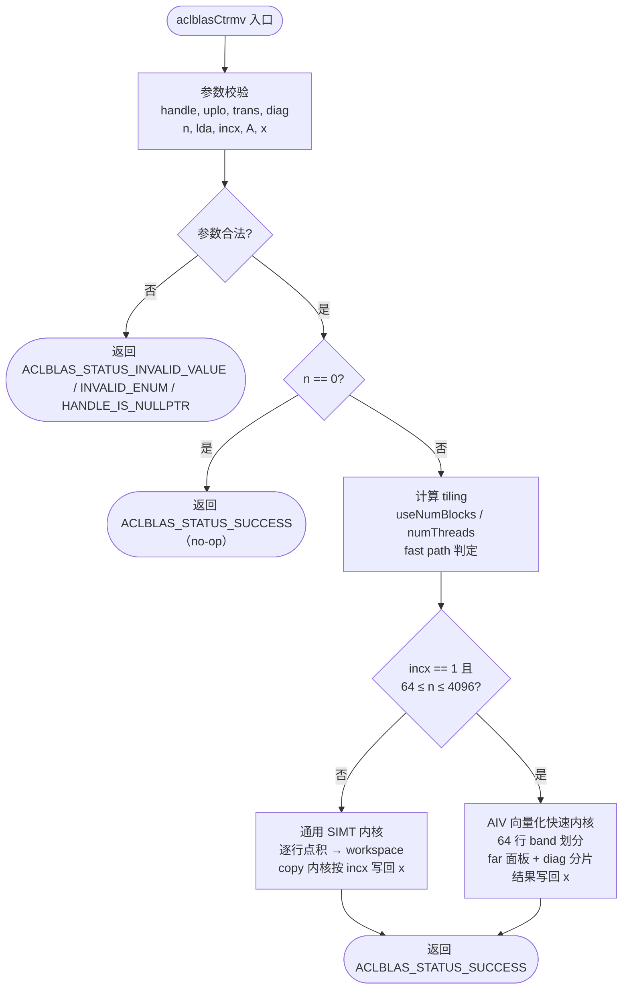
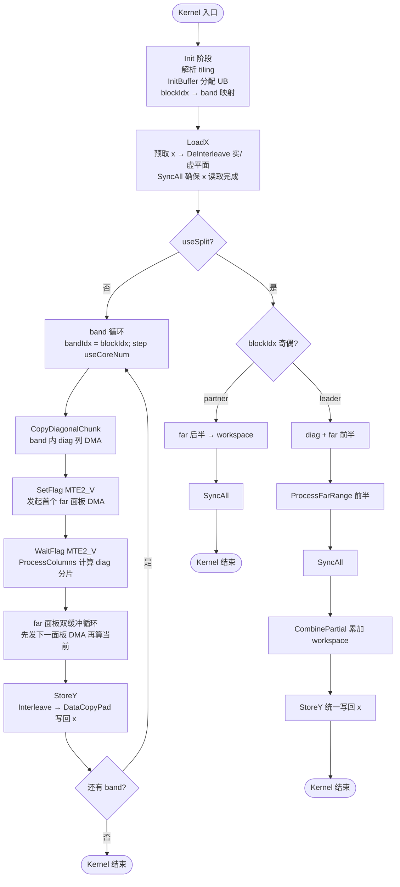

# 需求背景（required）

## 需求来源

基于昇腾算子开源仓社区任务需求，实现单精度复数三角矩阵-向量乘算子 `aclblasCtrmv`，对标 cuBLAS 库中 `cublasCtrmv` 接口（语义参考 Netlib BLAS `ctrmv`）。

- 任务讨论：https://gitcode.com/org/cann/discussions/39
- 算子开源仓：https://gitcode.com/cann/ops-blas （实现目录 `blas/trmv/arch35/`）
- 参考实现：https://www.netlib.org/blas/ctrmv.f
- cuBLAS 参考文档：https://docs.nvidia.com/cuda/cublas/index.html#cublas-t-trmv

## 背景介绍

### aclblasCtrmv 算子实现

三角矩阵-向量乘（TRMV, Triangular Matrix-Vector Multiply）是 BLAS Level 2 标准操作之一，计算 `x = op(A) * x`，其中 A 为上三角或下三角矩阵，op(A) 为 A、A^T 或 A^H。该操作广泛应用于科学计算、数值线性代数（如三角方程求解的迭代过程）和深度学习推理中。cuBLAS 库中的 `cublasCtrmv` 提供了 GPU 上高效的复数三角矩阵-向量乘实现。本任务旨在将该功能移植到昇腾 NPU（Ascend 950PR）平台，使用 Ascend C 编程语言实现功能与性能对齐的算子，并合入昇腾算子开源仓 ops-blas。

本算子为 BLAS 句柄式接口，采用 kernel 直调方式：通过 `aclblasHandle` 绑定 stream，host 侧完成参数校验与 tiling 计算后直接启动 NPU kernel。

### aclblasCtrmv 算子功能分析

aclblasCtrmv 算子功能：计算 `x = op(A) * x`。

- 输入：三角矩阵 A（COMPLEX64，列主序，lda×n 全存储）、向量 x（COMPLEX64，逻辑长度 n，步长 incx）、属性参数（uplo/trans/diag）
- 输出：向量 x 被原地覆写为计算结果

支持数据类型：complex64（实部/虚部各 float32）

数据格式：列主序（Column-Major）

| 参数 | 参数含义 | 数据类型 | 支持数据类型 | 约束 | 形状 |
| --- | --- | --- | --- | --- | --- |
| handle | 算子上下文句柄 | aclblasHandle_t | - | 非空 | - |
| uplo | 三角存储模式 | 枚举 | UPPER / LOWER | 必选 | - |
| trans | 矩阵操作类型 | 枚举 | OP_N / OP_T / OP_C | 必选 | - |
| diag | 对角线模式 | 枚举 | NON_UNIT / UNIT | 必选 | - |
| n | 矩阵 A 的阶数 | int | - | n ≥ 0 | - |
| A | 三角矩阵 | COMPLEX64 | complex64 | 列主序，lda×n | A: n×n |
| lda | A 的前导维度 | int | - | lda ≥ max(1, n) | - |
| x | 输入/输出向量 | COMPLEX64 | complex64 | 步长 incx，原地覆写 | x: n |
| incx | x 的步长 | int | - | incx ≠ 0（可负） | - |

计算公式：x = op(A) * x，其中：

- trans = ACLBLAS_OP_N 时 op(A) = A
- trans = ACLBLAS_OP_T 时 op(A) = A^T
- trans = ACLBLAS_OP_C 时 op(A) = A^H（共轭转置）

# 需求分析（required）

## 需求描述

使用 Ascend C 编程语言实现 `aclblasCtrmv` 算子，对标 cuBLAS `cublasCtrmv`，支持全部 12 种模式组合（uplo x trans x diag），支持负步长 incx、前导维度 padding、n = 0 快速返回等完整 BLAS 语义，数据格式为列主序，输出原地覆写 x。

## 需求拆解

1. 支持 complex64 数据类型（实部/虚部各 float32 判定）
2. 支持 12 种模式组合：uplo('U','L') x trans('N','T','C') x diag('U','N')
3. 支持列主序存储与前导维度 padding（lda > n）
4. 支持正/负步长 incx（|incx| ≥ 1）
5. 支持 n = 0 合法 no-op、非法参数返回对应状态码
6. 性能满足任务书标杆（n=512/1024/2048 平均单次耗时不高于 11.86/35.90/75.59 us）
7. 精度满足生态算子开源精度标准（COMPLEX64 实部/虚部分别按 FLOAT32 判定）

# 详细设计（required）

## 算子分析

### 数学公式

**不转置（OP_N）**：

```
x_i = Σ_{j ∈ T_i} A[i][j] * x_j    （上三角 UPPER: T_i = [i, n)；下三角 LOWER: T_i = [0, i]）
```

**转置（OP_T）**：

```
x_i = Σ_{j ∈ T_i} A[j][i] * x_j    （上三角 UPPER: T_i = [0, i]；下三角 LOWER: T_i = [i, n)）
```

**共轭转置（OP_C）**：

```
x_i = Σ_{j ∈ T_i} conj(A[j][i]) * x_j
```

其中 diag = ACLBLAS_UNIT 时对角元素视为 1 且不访问存储；diag = ACLBLAS_NON_UNIT 时使用存储的对角元素。复数乘累加按 `(a+bi)(c+di) = (ac-bd) + (ad+bc)i` 展开为实部/虚部分量运算。

### 支持数据类型

| 算子名称 | 输入数据类型 | 输出数据类型 |
| --- | --- | --- |
| aclblasCtrmv | complex64 (complex\<float\>) | complex64 (complex\<float\>) |

### 支持形状/模式组合

算子支持 uplo、trans、diag 三个维度的模式组合，共 12 种：

| uplo | trans | diag | 求和范围（输出行 i） | 说明 |
| --- | --- | --- | --- | --- |
| U | N | N / U | 列 j ∈ [i, n) | 上三角，不转置 |
| U | T | N / U | 列 j ∈ [0, i] | 上三角，转置 |
| U | C | N / U | 列 j ∈ [0, i]，取共轭 | 上三角，共轭转置 |
| L | N | N / U | 列 j ∈ [0, i] | 下三角，不转置 |
| L | T | N / U | 列 j ∈ [i, n) | 下三角，转置 |
| L | C | N / U | 列 j ∈ [i, n)，取共轭 | 下三角，共轭转置 |

## cuBLAS ctrmv 实现流程分析

cuBLAS 内部采用列主序（Column-Major）存储，`cublasCtrmv` 对 n×n 三角矩阵 A 与向量 x 执行 `x = op(A) * x`。其核心算法为逐行点积（row-wise dot product）：每个输出元素 x_i 是 op(A) 第 i 行与 x 在合法三角范围内对应元素的点积；由于 x 为输入兼输出向量，cuBLAS 在 kernel 内一次性读入原始 x 完成全部计算后统一写回，避免 in-place 覆写带来的数据依赖问题。本算子在昇腾 NPU 上的实现采用同样的思路：先完整读入 x，各输出行独立累加，最后统一写回。

### 总体调度流程图



## 算子实现

### 实现方案

#### host 侧设计

##### 1. 参数校验与异常处理

入口先校验 `handle != nullptr` 与 `n >= 0`（n = 0 直接返回 `ACLBLAS_STATUS_SUCCESS`，不执行计算，与 Netlib ctrmv 语义一致）；随后校验 uplo/trans/diag 枚举合法性（非法返回 `ACLBLAS_STATUS_INVALID_ENUM`）、`lda >= max(1, n)`、`incx != 0`、A/x 非空（非法返回 `ACLBLAS_STATUS_INVALID_VALUE`）。

##### 2. Tiling 策略

**通用路径（SIMT）tiling**：

- 按输出行数 n 与最小线程粒度 `SIMT_MIN_THREAD_NUM` 计算 `useNumBlocks = min(ceil(n / SIMT_MIN_THREAD_NUM), aivCoreNum)`，至少为 1
- `numThreads = clamp(ceil_align(n / useNumBlocks, SIMT_MIN_THREAD_NUM), SIMT_MIN_THREAD_NUM, SIMT_MAX_THREAD_NUM)`
- 将 n 个输出行均分到 useNumBlocks 个 block，每 block 内 numThreads 个线程并行，线程按 `row = blockIdx.x * blockDim.x + threadIdx.x` 步进循环

**快速路径（AIV 向量化）tiling**：

- 当 `incx == 1` 且 `64 <= n <= 4096` 时启用快速内核（`CTRMV_FAST_MIN_N = 64`，`CTRMV_FAST_MAX_N = 4096`）
- 将输出按 64 行一个 band 划分：`numBands = ceil(n / 64)`
- 常规模式：`useCoreNum = min(56, numBands)`，block 按 `bandIdx = blockIdx` 步进 `useCoreNum` 循环处理多个 band
- 拆分模式（split）：当 `numBands >= 8` 且 `2 * numBands <= 56` 时，每个 band 由一对 AIV core 协作：leader（偶数 block）负责 diag 分片 + far 面板前半，partner（奇数 block）负责 far 面板后半并将部分和发布到 workspace，`SyncAll()` 后 leader 通过 `CombinePartial` 累加并统一写回。拆分将 far 面板 DMA 时间减半，适用于中间尺寸

##### 3. 数据分块和内存优化策略

**通用路径**：每行输出为独立点积，行间无数据依赖；线程直接读取 GM 中的 A/x，累加结果写入 workspace（n×2 floats），再由 copy 内核按 incx（含负步长反向遍历）写回 x，避免 in-place 依赖并支持任意步长。

**快速路径 UB 规划**（充分使用 UB 空间 + Double Buffer 原则）：

| 缓冲区 | 容量（floats） | 用途 |
| --- | --- | --- |
| aIn0Buf / aIn1Buf | 2048 / 4096 | far 面板双缓冲（64 列 × 64 复数槽位）；aIn1Buf 在 diag 阶段复用 |
| aRBuf / aIBuf / t1Buf / t2Buf / t3Buf | 2048 各 | 面板实部/虚部平面及中间计算 |
| xInBuf | 2×4096 | x 整向量预取（DeInterleave 前） |
| xRBuf / xIBuf | 4096+64 各 | x 实部/虚部平面（含尾部清零余量） |
| pack2/pack4/pack8R/pack8I | 192/320/704 各 | x 元素 8 副本广播（PackX 中间结果） |
| yRBuf / yIBuf | 128 各 | band 输出实部/虚部累加器（64 行 × 2） |
| yOutBuf | 192 | 实部/虚部 Interleave 打包输出 |

**Double Buffer 优化**：far 面板采用双缓冲，先发起下一面板 DMA 再计算当前面板，使 DMA 与向量计算重叠。diag 分片的 DMA 与首个 far 面板 DMA 同时发起，diag 计算仅等待自身 DMA（`SetFlag<HardEvent::MTE2_V>` / `WaitFlag<HardEvent::MTE2_V>`），从而与 far DMA 重叠。由于 dav_3510 上 `PipeBarrier<PIPE_V>/<PIPE_MTE2>` 为空操作，数据依赖使用硬事件 flag 或 `PIPE_ALL` 屏障保证。

**尾块处理**：最后一个 band/面板可能不足 64 行/列；部分 band 先 `Duplicate` 预置零再补全当前 32B burst（Ascend 950 DataCopyPad 每侧 padding 上限 32B），保证 padding 区为零，避免 `0 * NaN = NaN` 污染。

##### 4. TilingKey 规划策略

算子通过模板参数在编译期展开 uplo/trans/diag 组合，避免运行期分支开销：

- 通用路径模板参数：`UPLO_IS_UPPER`、`TRANS_IS_N`、`DIAG_IS_UNIT`、`CONJ`，共 12 种组合；diag 通过 `DispatchCtrmvDiag` 分发
- 快速路径：uplo/trans/diag 作为运行时字段传入，算法分支（far 区域计算、diag 单位对角处理、OP_C 共轭取负、转置掩码）在 kernel 内按需执行

host 侧依据 `incx`、`n` 决定 fast/general 路径选择，作为最高层 TilingKey。

#### kernel 侧设计

##### 1. 通用路径（SIMT，ctrmv_kernel.cpp）

每个输出行是一个独立的点积：

1. 根据 uplo/trans 计算合法列范围 `[colStart, colEnd)`：
   - OP_N：UPPER 取 `[row, n)`，LOWER 取 `[0, row]`
   - OP_T/OP_C：UPPER 取 `[0, row]`，LOWER 取 `[row, n)`
2. 逐列读取 A 元素（`A[row + lda*col]` 或转置取 `A[col + lda*row]`），diag = UNIT 时对角列跳过存储读取（视为 (1,0)），OP_C 时虚部取负
3. 按 `CtrmvVectorIndex` 将逻辑列映射到物理 x 地址（负 incx 从 `(n-1)*(-incx)` 反向遍历），复数乘累加
4. 每行结果写入 workspace `midOut[row*2]`/`midOut[row*2+1]`
5. copy 内核按 incx 将 workspace 写回 x 原位置

该路径覆盖 fast 路径之外的任意合法输入（incx ≠ 1、n < 64、n > 4096）。

##### 2. 快速路径（AIV 向量化，ctrmv_fast_kernel.cpp）

每个 AIV core 负责一个或多个 64 行 band，对每个 band 将输出累加拆分为"far 列"（band 外、整行有效）与"diag 列"（band 内、逐列有效行数不同）两部分：

**LoadX 阶段**：`DataCopyPad` 预取完整 x 到 xInBuf，`DeInterleave` 拆为实部/虚部平面 xR/xI，平面尾部清零（避免 8 宽广播读到 NaN）。所有 core 经 `SyncAll()` 确保原始 x 读取完成后，方可原地覆写 x。

**far 面板处理（ProcessFarRange/ProcessBand）**：

- 每面板 64 列，双缓冲（aIn0Buf/aIn1Buf），下一面板 DMA 与当前面板计算重叠
- OP_N：每列段连续，`DataCopyPad` 以 16 列一组（src 跨列 stride = (lda-rowsBand)*8 字节）完成
- OP_T/OP_C：面板为 A 的 16×64 行块，使用 3D ND-DMA（`MultiCopyLoopInfo<3>`，loop0=re/im 对 stride 1，loop1=槽行 stride 2*lda，loop2=槽 stride 2）一次指令完成整个转置面板搬运
- 面板搬运到 64 复数槽位（128 floats/列，不足补零）

**diag 分片处理（CopyDiagonalChunk + ProcessColumns）**：

- band 内列（≤ 64 列，单分片）按列逐列 `DataCopyPad`（OP_N，每列仅拷贝合法行，UPPER 左对齐/LOWER 右对齐，32B burst 补零）或 3D ND-DMA（OP_T/OP_C，整列拷贝后由掩码清零非法三角）
- diag = UNIT 时，`SetValue` 将槽位内对角位置写入 (1, 0)
- OP_C 时对虚部平面 `Muls(aI, aI, -1)` 完成共轭
- 转置 diag 的非法三角用 `CreateVecIndex` 构造 0/1 掩码（UPPER: `clamp(k-(c0+j)+1,0,1)`；LOWER: `clamp(c0+j-k+1,0,1)`）乘到实/虚部平面上清零

**复数乘加（ProcessColumns）**：

- `DeInterleave` 将面板拆为实部平面 aR 与虚部平面 aI
- `PackX` 通过三次 `Interleave` 将 x 元素扩为 8 副本（pack8），配合 `BinaryRepeatParams{1,1,0,8,8,1}` 的 `Mul`（src1BlkStride=0）实现单指令列广播
- 复数乘：`t1 = aR*xr - aI*xi`，`t2 = aR*xi + aI*xr`
- 累加：`BinaryRepeatParams{1,1,1,0,0,8}` 的 `Add` 将每个列块（64 floats）累加进 64 行 yR/yI 累加器

**StoreY 阶段**：`Interleave` 将 yR/yI 合并为复数交错的 yOut（尾行 `SetValue` 补齐 8 对齐），`DataCopyPad` 写回 x 的 band 位置（原地覆写，依赖前序 SyncAll）。

**拆分模式**：leader 处理 diag + far 前半，partner 处理 far 后半并将部分和写入 workspace（`StoreY(wsGlobal)`），`SyncAll()` 后 leader `CombinePartial`（`DataCopyPad` 读回 + `DeInterleave` + `Add`）累加并统一写回 x。

##### 3. Kernel 侧流程图（快速路径）



## 支持硬件

| 支持的芯片版本 | 涉及勾选 |
| --- | --- |
| Atlas 950P（Ascend 950PR） | √ |

## 算子约束限制

1. 仅支持列主序（Column-Major）数据格式
2. n ≥ 0，lda ≥ max(1, n)，incx ≠ 0（负步长合法，反向遍历）
3. 仅引用 uplo 指定三角；diag = ACLBLAS_UNIT 时不访问对角元素
4. n = 0 为合法 no-op，返回 `ACLBLAS_STATUS_SUCCESS`
5. 接口复用 ops-blas 仓 `include/cann_ops_blas.h` 已有声明，不定义 950PR 私有平行接口
6. x 为原地覆写，结果不保证 bit-exact（浮点乘加，非确定性累加顺序）

# 可维可测分析

## 精度标准/性能标准

| 验收标准 | 描述 | 标准来源 |
| --- | --- | --- |
| 精度标准 | COMPLEX64 实部/虚部分别按 FLOAT32 判定：atol = 2^-16，rtol = 2^-10，matched_ratio ≥ 0.99，max_abs_error ≤ max(1e-2, 32×ULP) | 生态算子开源精度标准 |
| 性能标准 | 设备侧平均单次耗时（aclrtEventElapsedTime，warmup 后有效采样 >50 次取平均）≤ 标杆：n=512 ≤ 11.86 us，n=1024 ≤ 35.90 us，n=2048 ≤ 75.59 us | 任务书 |

**性能基准数据（Ascend 950PR，Release 构建，warmup 10 + 有效采样 60 次平均；sync 为 GTest 同步总耗时折算（含 host 准备，保守上界），dev 为 aclrtEventElapsedTime 设备侧计时，验收以 dev 为准）**：

| n | uplo | trans | diag | incx | 标杆耗时(us) | 实测 sync(us) | 实测 dev(us) |
| --- | --- | --- | --- | --- | --- | --- | --- |
| 512 | UPPER | N | NON_UNIT | 1 | 11.86 | 15.17 | 9.48 |
| 1024 | LOWER | T | NON_UNIT | 1 | 35.90 | 24.42 | 18.63 |
| 2048 | UPPER | C | UNIT | 1 | 75.59 | 53.88 | 48.19 |

**模式组合扫描（dev 设备侧耗时，us）**：

| n | 组合 | dev(us) |
| --- | --- | --- |
| 512 | U/N/N | 9.47 |
| 512 | U/T/N | 13.02 |
| 512 | U/C/U | 13.64 |
| 512 | L/N/N | 9.63 |
| 512 | L/T/U | 13.50 |
| 512 | L/C/N | 13.24 |
| 1024 | U/N/N | 15.01 |
| 1024 | L/T/N | 18.76 |
| 1024 | U/C/U | 19.00 |
| 2048 | U/C/U | 48.21 |
| 4096 | L/N/N | 92.34 |

## 兼容性分析

新算子，接口复用 ops-blas 仓 `include/cann_ops_blas.h` 已有声明，与 910B 等其他产品线共用同一 API，不涉及接口兼容性问题；新增实现仅作用于 `blas/trmv/arch35/` 目录，不影响其他芯片版本行为。
