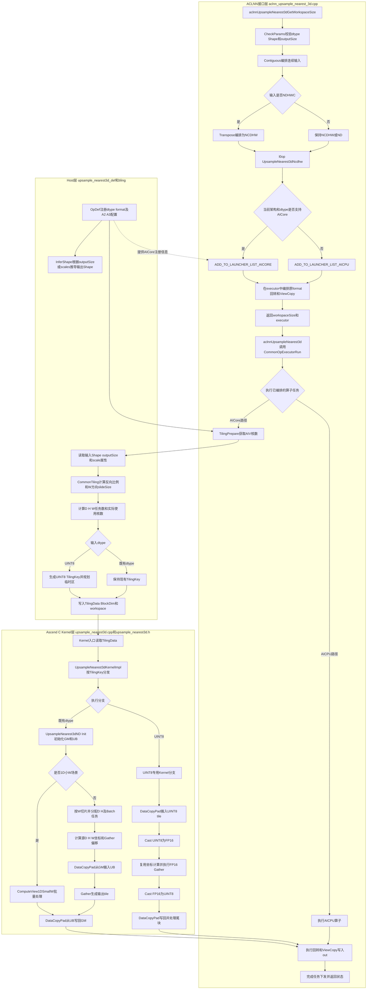

# 需求背景（required）

## 需求来源

本设计对应CANN社区UpsampleNearest3d算子开发任务。参考`ops-cv/image/upsample_nearest3d`现有Ascend C实现，为`aclnnUpsampleNearest3d`补充`UINT8`支持，目标硬件为Atlas A2训练系列产品和Atlas A3系列产品。

## 背景介绍

### UpsampleNearest3d算子UINT8能力扩展

`UpsampleNearest3d`对5维Tensor的D、H、W三个空间维执行最近邻采样。输入、输出的N和C维保持不变，输出空间尺寸由`outputSize`指定，坐标映射由`scalesD/scalesH/scalesW`或输入输出Shape确定。

本次在现有ACLNN、Host Tiling和Ascend C Kernel工程基础上扩展数据类型，不改变算子语义和外部接口。

### UpsampleNearest3d算子实现现状分析

参考工程已经实现参数校验、非连续Tensor处理、NDHWC转置、AICore/AICPU路由、Host Tiling和Ascend C Kernel。Atlas A2/A3普通AICore路径当前未完整支持`UINT8`。

| 模块 | 现有实现 | UINT8扩展设计 |
| --- | --- | --- |
| ACLNN接口 | 校验dtype、Shape和format，编排Contiguous、Transpose及ViewCopy | 在A2/A3白名单中增加`UINT8` |
| AICore路由 | DAV_2201仅路由FLOAT16、FLOAT32和BFLOAT16 | 将`UINT8`路由至AICore |
| Host Tiling | 计算比例、W方向切片、分核和TilingKey | 增加`UINT8` TilingKey及临时区规划 |
| Ascend C Kernel | 通过DataCopyPad、坐标计算和Gather完成采样 | 增加`UINT8`专用执行分支 |

### UpsampleNearest3d算子原型

ACLNN两段式接口如下：

```cpp
aclnnStatus aclnnUpsampleNearest3dGetWorkspaceSize(
    const aclTensor   *self,
    const aclIntArray *outputSize,
    double             scalesD,
    double             scalesH,
    double             scalesW,
    aclTensor         *out,
    uint64_t          *workspaceSize,
    aclOpExecutor    **executor);

aclnnStatus aclnnUpsampleNearest3d(
    void          *workspace,
    uint64_t       workspaceSize,
    aclOpExecutor *executor,
    aclrtStream    stream);
```

参考模板，算子参数规格整理如下：

| 参数 | 参数含义 | 参数类型 | 支持数据类型 | 数据排布格式 | 形状及约束 |
| --- | --- | --- | --- | --- | --- |
| `self` | 输入Tensor | tensor | FLOAT16、FLOAT32、BFLOAT16、DOUBLE、UINT8 | NCDHW、NDHWC、ND | 5维，不支持空的空间维 |
| `outputSize` | 输出D、H、W尺寸 | array | INT64 | - | 长度为3，各元素大于0 |
| `scalesD` | D维缩放参数 | scalar | double | - | 与其他scale同时使用时大于0 |
| `scalesH` | H维缩放参数 | scalar | double | - | 与其他scale同时使用时大于0 |
| `scalesW` | W维缩放参数 | scalar | double | - | 与其他scale同时使用时大于0 |
| `out` | 输出Tensor | tensor | 与`self`一致 | 与`self`一致 | 5维，N、C轴与输入一致 |

### UpsampleNearest3d算子功能分析

输入为5维Tensor `self`，输出为5维Tensor `out`。算子支持通过`outputSize`或scale参数控制D、H、W方向的最近邻采样；支持NCDHW、NDHWC和ND格式，其中ND按NCDHW解释；支持非连续输入和非连续输出。

# 需求分析（required）

## 需求描述

在不影响FLOAT16、FLOAT32、BFLOAT16和DOUBLE既有能力的前提下，使Atlas A2/A3上的`self/out`支持`UINT8`，并满足确定性、泛化性以及任务书规定的精度和性能要求。

## 需求拆解

1. ACLNN参数校验和AICore路由支持`UINT8`。
2. Host侧为`UINT8`生成与Kernel一致的TilingKey和TilingData。
3. Kernel支持`UINT8`最近邻索引复制，结果与CPU参考实现逐元素一致。
4. 保持NCDHW、NDHWC、ND和非连续Tensor能力。
5. `UINT8`相对同Shape的FLOAT16性能劣化不超过5%。

# 详细设计（required）

## 算子分析

### 数学公式

设输入空间尺寸为`(D, H, W)`，输出空间尺寸为`(Do, Ho, Wo)`。对输出坐标`(od, oh, ow)`，定义反向映射比例：

```text
ratioD = scalesD > 0 ? 1 / scalesD : D / Do
ratioH = scalesH > 0 ? 1 / scalesH : H / Ho
ratioW = scalesW > 0 ? 1 / scalesW : W / Wo

id = min(floor(od * ratioD), D - 1)
ih = min(floor(oh * ratioH), H - 1)
iw = min(floor(ow * ratioW), W - 1)
```

NCDHW格式下：

```text
out[n, c, od, oh, ow] = self[n, c, id, ih, iw]
```

`UINT8`只参与索引复制，不进行插值权重计算。

### 支持数据类型

FLOAT16、FLOAT32、BFLOAT16、DOUBLE、UINT8，本次新增Atlas A2/A3的UINT8能力。

### 支持形状

输入和输出均为5维Tensor。NCDHW/ND按`[N,C,D,H,W]`解释，NDHWC按`[N,D,H,W,C]`解释；输入输出N、C轴保持一致。

## 算子实现

### 参考工程UpsampleNearest3d完整流程图



### 实现方案

#### Host侧设计

1. 在A2/A3公共dtype校验白名单中加入`UINT8`，并保持输入输出dtype一致性检查。
2. 在`UpsampleNearest3dNcdhw`的DAV_2201 AICore支持列表中加入`UINT8`，避免落入AICPU路径。
3. OpDef的A2/A3输入输出注册增加`UINT8`，外部ACLNN接口和属性含义不变。
4. 继续复用现有`Contiguous`、`NDHWC→NCDHW→NDHWC`和`ViewCopy`编排，不在Kernel中增加任意stride寻址。

#### Tiling侧设计

1. 复用参考工程`UpsampleNearest3dCommonTiling`：根据输入输出Shape计算反向比例，并按输出W方向切片。
2. 复用现有D/H任务展开、Batch分组和尾任务分配策略，实际使用核数不超过平台AIV核数。
3. 在`GetTilingKey`中增加`UINT8`模板标识，使Host与Kernel分发一致。
4. UINT8通用路径需要UINT8输入输出区、FP16临时区和UINT32索引区。基于现有`slideSizeW`候选值选择能够放入UB的tile，各buffer按32Byte对齐。

#### Kernel侧设计

DAV_2201的`Gather`不直接支持`uint8_t`，因此增加独立UINT8执行分支：

1. 复用现有`UpsampleNearest3dND`的分核、W切片和D/H/W源坐标计算逻辑。
2. 使用`DataCopyPad`将UINT8 tile由GM搬入UB，并通过`Cast<half, uint8_t>(..., CAST_NONE)`扩展为FP16。
3. Gather偏移按FP16临时区的元素字节数生成，执行`Gather<half>`获得输出tile。
4. 通过`Cast<uint8_t, half>(..., CAST_NONE)`还原为UINT8，再使用`DataCopyPad`写回GM并处理非32Byte对齐尾块。
5. 0至255的整数均可由FP16精确表示，因此两次转换不改变输出值，计算结果保持确定性。

## 支持硬件

| 支持的芯片版本 | 涉及勾选 |
| --- | :---: |
| Atlas A2训练系列产品 | √ |
| Atlas A3系列产品 | √ |

## 算子约束限制

- `self/out`均为5维且dtype、format一致。
- NCDHW/ND格式的Shape为`[N,C,D,H,W]`；NDHWC格式的Shape为`[N,D,H,W,C]`。
- N、C及D/H/W各有效维度大于0，`outputSize`长度为3且各元素大于0。
- 输入输出N、C轴一致，Tensor元素数不超过接口约束上限。
- `outputSize`和scales两种方式使用其一，`outputSize`优先。
- 默认支持确定性计算。

# 可维可测分析

## 精度标准/性能标准

| 验收标准 | 描述 | 标准来源 |
| --- | --- | --- |
| 精度标准 | UINT8与CPU最近邻参考结果逐元素一致 | 社区任务书 |
| 性能标准 | UINT8相对同Shape FLOAT16劣化不超过5% | 社区任务书 |

本文档阶段不执行实验，精度和性能在后续开发及验收阶段验证。

## 兼容性分析

外部ACLNN原型、Shape推导和属性语义不变；新增分支仅对Atlas A2/A3的UINT8生效，既有数据类型继续使用原有TilingKey和Kernel路径。
