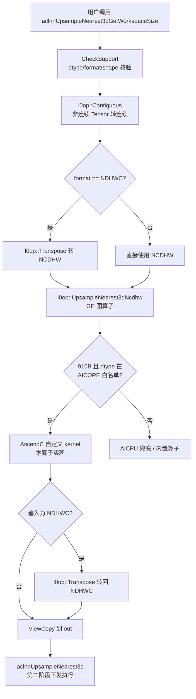
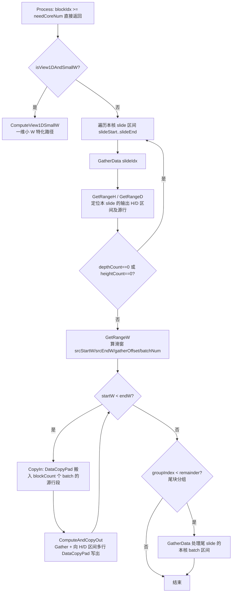
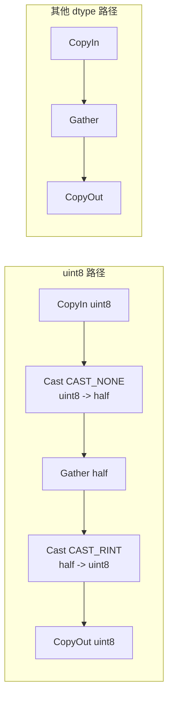

.36# aclnnUpsampleNearest3d 算子 uint8 数据类型支持 —— 设计文档

- 算子名称：UpsampleNearest3d（aclnn 接口：aclnnUpsampleNearest3d）
- 交付目录：ops-cv 仓 `experimental/image/upsample_nearest3d/`
- 适配平台：Atlas A2 训练系列（ascend910b / ascend910_93，重点验证 910B3）、Atlas A3 系列（ascend950，regbase 路径原生支持，本次仅验证编译）
- CANN 版本：9.0.0

---

## 1. 需求背景

`aclnnUpsampleNearest3d` 对 5D 输入（N, C, D, H, W）做最近邻上采样，输出 dtype 与输入一致。
原实现（`image/upsample_nearest3d`）在 910B/910_93 平台上只支持 FLOAT32 / FLOAT16 / BFLOAT16，
本任务在不改变原有语义的前提下，为 910B/910_93 平台新增 UINT8 支持，并满足：

- 精度：输出与 CPU 参考实现（torch `interpolate(mode='nearest')`）逐字节一致；
- 性能：uint8 相比同 shape fp16 劣化不超过 5%；
- 泛化：支持 output_size / scales 两种模式，NCDHW / NDHWC / ND 排布，非连续 Tensor，上下采样，边界 shape。

## 2. 算子规格

### 2.1 接口

```cpp
aclnnStatus aclnnUpsampleNearest3dGetWorkspaceSize(
    const aclTensor *self, const aclIntArray *outputSize,
    double scalesD, double scalesH, double scalesW,
    aclTensor *out, uint64_t *workspaceSize, aclOpExecutor **executor);

aclnnStatus aclnnUpsampleNearest3d(
    void *workspace, uint64_t workspaceSize, aclOpExecutor *executor, aclrtStream stream);
```

- `output_size`（可选，list<int64>，长度 3）：输出 D/H/W 尺寸；
- `scale_d / scale_h / scale_w`（可选，float）：三个维度的缩放系数；
- `output_size` 与 `scales` 必须且只能给一个（infershape 中强校验）；
- 反归一化方向：kernel 内统一按 `src_idx = floor((dst_idx + 0.5 * isExact) * scale)` 计算，
  `scale = in / out`（output_size 模式由 tiling 反算）。

### 2.2 支持矩阵（本次改动后）

| 平台 | dtype | format |
|---|---|---|
| ascend910b / 910_93 | FP32 / FP16 / BF16 / **UINT8（新增）** | ND |
| ascend950（regbase） | FP32 / FP16 / BF16 / UINT8 / DOUBLE | ND / NCDHW |
| ascend310p / kirinx90 / kirin9030 | FP32 / FP16 | ND |

DOUBLE 在 910B 上走 AICPU 兜底（L0 白名单不含 DT_DOUBLE 时由框架下发），与本次改动无关。
UINT8 走 AICORE 自定义 kernel，这是本次开发的核心。

## 3. 总体执行流程

aclnn 采用两段式接口。整体调用流水如下：



关键代码位置：

- `op_host/op_api/aclnn_upsample_nearest_3d.cpp`：两段式入口，`DTYPE_SUPPORT_LIST` 增加 `DT_UINT8`；
- `op_host/op_api/upsample_nearest_3d.cpp`：L0 层 `UpsampleNearest3dNcdhw`，`AICORE_DTYPE_SUPPORT_LIST` 增加 `DT_UINT8`，
  在 `DAV_2201`（910B）架构下将 uint8 下发到本 AscendC kernel；
- GE 图算子名：`UpsampleNearest3d`（nearest 模式）/ `UpsampleNearestExact3d`（nearest_exact 模式），
  共享同一套 infershape / tiling / kernel，仅 `isNearestExact` 标志不同。

## 4. Host 侧设计

### 4.1 算子原型定义（op_host/upsample_nearest3d_def.cpp）

910b / 910_93 默认 config 的 x/y 增加 `ge::DT_UINT8`：

```cpp
this->Input("x").ParamType(REQUIRED)
    .DataType({ge::DT_FLOAT, ge::DT_FLOAT16, ge::DT_BF16, ge::DT_UINT8})
    .Format({ge::FORMAT_ND, ...});
```

regbase（950）config 原本已含 UINT8，不改动。

### 4.2 InferShape（op_host/upsample_nearest3d_infershape.cpp）

- 输入必须 5 维；N/C 维不变；
- `output_size` 非空且 `scales` 为空 → D/H/W 直接取 output_size；
- 反之按 `floor(in * scale)` 计算；两者都给或都不给则报错；
- dtype 推导：y 与 x 一致（uint8 天然满足）。

### 4.3 Tiling（op_host/upsample_nearest3d_tiling.cpp + upsample_nearest3d_tiling_common.h）

Tiling 决定多核切分与滑窗参数，全部写入 `UpsampleNearest3dTilingData` 供 kernel 使用：

1. **scale 反算**：output_size 模式下 `realScale = in / out`；scales 模式直接使用入参。
2. **W 维滑窗 slideSizeW**：按 `realScaleW` 分档，放大倍率越小滑窗越大（一次 Gather 更多输出，摊薄搬运开销）：

   | realScaleW | slideSizeW |
   |---|---|
   | ≤ 6 | 2048 |
   | ≤ 10 | 1536 |
   | ≤ 24 | 768 |
   | > 24 | 256 |

3. **下采样（scale < 1）处理**：H/D 维 slideNum 改为按输入维度切（slideNumH=inH, slideNumD=inD），
   tensorSizeH/D 取 4（预留窗口），kernel 侧反查该输入行对应的输出行区间。
4. **多核切分（GetNeedCoreNum）**：
   - 总任务量 `slideNum = slideNumW * slideNumH * slideNumD`，按核数均分：`eachCoreSlideNum = slideNum / coreNum`；
   - 余数 `remainder = slideNum % coreNum` 个尾 slide，按 `groupCoreNum = coreNum / remainder` 分组，
     每组多核按 batch（N*C 行）再切 `tailAvergingRow`，保证尾块也能多核并行；
   - `needCoreNum` 为实际需要启动的核数，`SetBlockDim(needCoreNum)`。
5. **View1DAndSmallW 特化分支（GetISView1DAndSmallW）**：
   当 `inD==outD==1 且 inH==outH==1 且 scaleW ≤ 80 且 outW ≤ 64` 时，整行数据可视为一维，
   一次 repeat 可 Gather 多个 batch，走 `ComputeView1DSmallW` 高效路径。
6. **TilingKey（GetTilingKey）**：按 x/y dtype 选择模板实例，新增 `DT_UINT8 → UPSAMPLE_NEAREST3D_TPL_U8(40)`：

   | dtype | TPL 值 | kernel 实例 |
   |---|---|---|
   | FP16 | 10 | `UpsampleNearest3dND<half>` |
   | FP32 | 20 | `UpsampleNearest3dND<float>` |
   | BF16 | 30 | `UpsampleNearest3dND<bfloat16_t>` |
   | UINT8 | 40（新增） | `UpsampleNearest3dND<uint8_t>` |

7. **Workspace**：2201 架构为 0，其余 32MB。

## 5. Kernel 侧设计（op_kernel/upsample_nearest3d.h）

### 5.1 核心思想

最近邻上采样本质是**按索引 Gathering**：对输出 W 维一个滑窗，先算每个输出点对应的输入偏移表
（gatherOffset），搬入滑窗覆盖的源数据后，用一条 `Gather` 指令完成索引拷贝；H/D 维的复制通过
把 Gather 结果向 GM 写出多次实现（写放大换计算简化）。

### 5.2 单核执行流水（主路径 Process → GatherData）



### 5.3 索引计算（CalculateSrcIndexTensor）

输出点到源点的映射在 UB 上用向量指令批量计算：

```
idx = ArithProgression(start, 1, len)      // 等差数列 0,1,2,...
idx += 0.5          (仅 nearest_exact)
idx *= scales[dim]
idx = floor(idx)                           // Cast CAST_FLOOR
idx = min(idx, inShape[dim] - 1)           // 边界钳制
```

### 5.4 滑窗内 Gather 偏移（CalculateGatherOffsetW）

```
offset = floor(srcIndexW) - srcStartW      // 滑窗内相对偏移（元素单位）
offset *= GATHER_ELEM_SIZE                 // 转成字节单位
```

`Gather` 的 `srcBaseAddr` 与偏移表均为**字节**单位，因此偏移表要乘元素大小
（这是 uint8 适配的关键点之一，见 6.2）。

### 5.5 搬运与并行优化

- **多 batch 一次搬入**：`batchNum = inQueueBufSize / srcDataLength`，一次 DataCopyPad 搬入多个
  batch 相同位置的源行段（stride 跳读）；stride 超 UINT32_MAX 时退化为单 batch；
- **H/D 维复制**：Gather 结果对 `depthCount × heightCount` 个输出行循环 DataCopyPad 写出；
- **大倍率保护**：`scaleW > 100` 时逐点处理（dataCount=1），避免偏移表语义退化；
- **双缓冲**：inQueue / outQueue `BUFFER_NUM=2`，搬运与计算流水；
- **View1DSmallW 路径**：一维场景下 `batchesEachRepeat = numPerRep(64/128) / outW`，
  一次 repeat Gather 多个 batch，`Adds` 递推构造全量偏移表（避免逐点 SetValue）。

## 6. uint8 支持的关键设计

### 6.1 硬件约束

910B（dav_c220）的 `Gather` 指令只支持 2/4 字节数据类型，**不支持 uint8（1 字节）**。
昇腾 AscendC API 最佳实践（cannbot-skills）对 1 字节类型的 Gather 场景给出的推荐做法是：
先 Cast 到 half 再 Gather，Gather 完成后 Cast 回原类型。

### 6.2 方案选择与精度论证

候选方案：

| 方案 | 结论 |
|---|---|
| A.  reinterpret 成 2 字节类型凑对 Gather | 语义错乱（跨元素打包），不可行 |
| B. 逐点 DataCopy/SetValue | 正确但性能极差，不满足 5% 劣化要求 |
| C. **Cast uint8→half → Gather → Cast half→uint8** | 采用。复用全部原有控制流，只加两个 Cast |

精度无损论证：uint8 值域 0~255，half 对 0~2048 的整数可精确表示；
升档 `RoundMode::CAST_NONE`（精确转换），降档 `RoundMode::CAST_RINT`（整数值无舍入误差）。
Gather 只搬运不改值，因此端到端逐字节一致（已被 125+16 组用例验证）。

### 6.3 代码实现

模板内通过类型萃取统一切换 Gather 的数据类型与元素大小：

```cpp
using GatherT = typename std::conditional<std::is_same<T, uint8_t>::value, half, T>::type;
constexpr static uint32_t GATHER_ELEM_SIZE = sizeof(GatherT);
```

- **偏移表**：`CalculateGatherOffsetW` / `DoComputeGatherOffset` 中 Muls 系数由 `sizeof(T)`
  改为 `GATHER_ELEM_SIZE`（uint8 时为 2，其余类型不变，零开销）；
- **Cast 缓冲**：仅 uint8 实例化时分配（`if constexpr`，其他 dtype 不占 UB）：
  - `srcCastQueue`：与 inQueue 单 buffer 等长 × 2 字节；
  - `dstCastQueue`：slideSizeW × 2 字节；
- **三处计算分支**（`ComputeAndCopyOut`、`DoComputeView1DSmallW`、`ComputeView1DSmallW` 尾块）：



- **实例化**：`KernelImpl` 新增 `TPL_U8` 分支，实例化 `UpsampleNearest3dND<uint8_t>`；
- **预编译 kernel 配置**：`op_host/config/ascend910b|ascend910_93/upsample_nearest3d_binary.json`
  追加 uint8 条目（`bin_filename: UpsampleNearest3d_25fg7j162b1125fj4l011a1557cd7709`），
  否则算子包中缺少 uint8 kernel 二进制。

### 6.4 UB 内存核算（910B，UB 192KB）

以 slideSizeW=2048、tensorSizeW≈2052 为例，uint8 场景：

- inQueue：2 × align32(2052×1B) ≈ 4.1KB
- outQueue：2 × 2048×1B = 4KB
- srcCastQueue：≈4.1KB；dstCastQueue：4KB
- srcIndex W/H/D + srcOffset：≈ 2048×4 + 32 + 32 + 2048×4 ≈ 16.4KB

合计约 33KB，远低于 UB 上限，且 Cast 增加的向量指令开销在搬运转量面前可忽略
（实测见第 8 章，劣化 +0.42%）。

## 7. 950（regbase）路径说明

950 的算子实现走 `op_kernel/arch35/`（data_copy / simd / simt 三套实现）与
`upsample_nearest3d_tiling_arch35.cpp`，def 的 regbase config、tiling、apt kernel 原本即支持 UINT8，
本次未做任何代码改动，仅验证了 950 包编译且 binList 包含 uint8（ND + NCDHW）。


## 9. 代码结构索引

```
experimental/image/upsample_nearest3d/
├── op_host/
│   ├── upsample_nearest3d_def.cpp          # 原型注册（dtype/format 支持矩阵）
│   ├── upsample_nearest3d_infershape.cpp   # shape/dtype 推导
│   ├── upsample_nearest3d_tiling.cpp       # tiling 入口 + TilingKey（含 TPL_U8）
│   ├── upsample_nearest3d_tiling_common.h  # 切分策略（滑窗/多核/尾块/View1D 判定）
│   ├── op_api/aclnn_upsample_nearest_3d.cpp # aclnn 两段式入口（DTYPE 白名单）
│   ├── op_api/upsample_nearest_3d.cpp       # L0（AICORE 白名单/AICPU 兜底）
│   └── config/ascend910b|910_93/upsample_nearest3d_binary.json  # 预编译 kernel 列表
├── op_kernel/
│   ├── upsample_nearest3d.h        # kernel 主逻辑（含 uint8 Cast 分支、TPL_U8 实例化）
│   └── upsample_nearest3d_struct.h # TPL 声明/选择、TilingData 结构
├── tests/selftest/                 # AscendOpTest 用例 + golden + 复现 README
├── examples/                       # aclnn 全场景 uint8 测试代码、数据生成、bench 脚本
└── docs/aclnnUpsampleNearest3d.md  # 接口文档（支持矩阵已同步）
```
