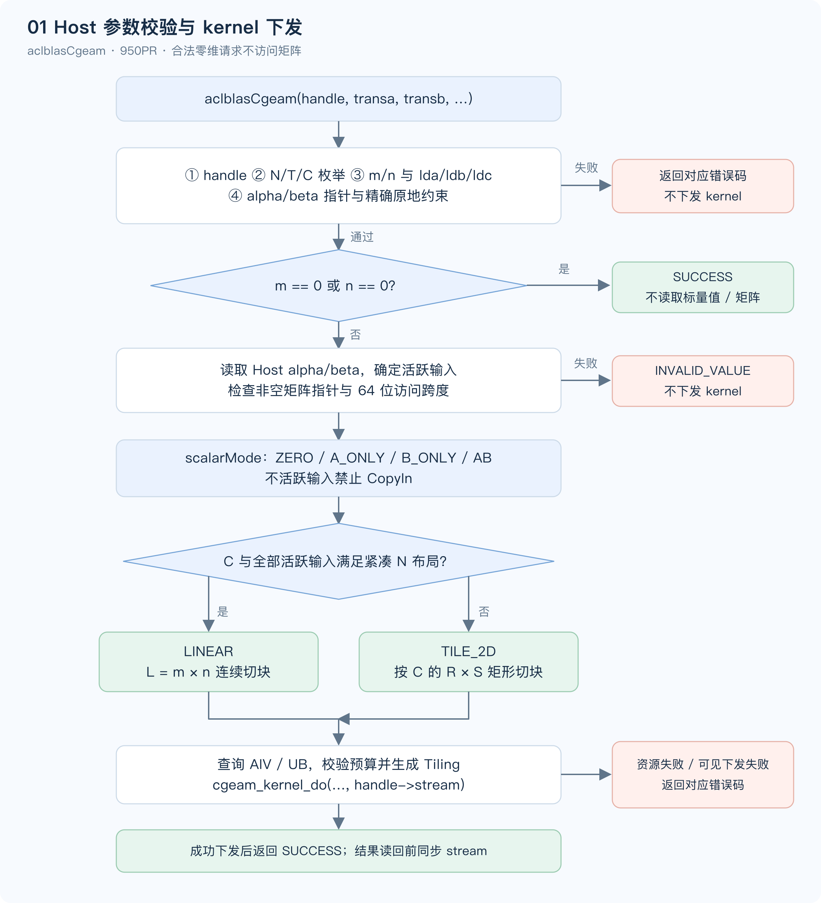
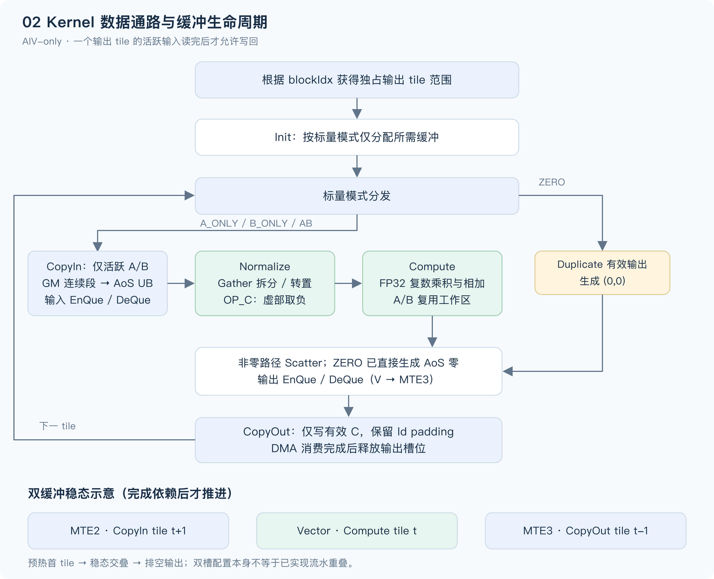
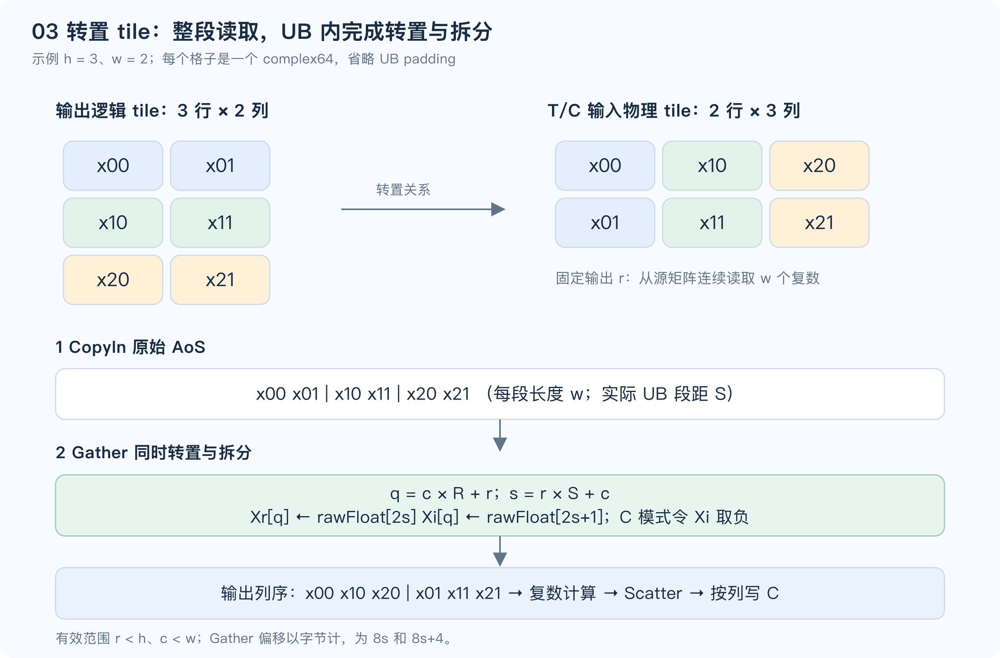

# aclblasCgeam 算子设计文档（Ascend 950PR）

| 项目 | 内容 |
| --- | --- |
| 社区任务 | 8月社区任务-aclblasCgeam算子开发（950），任务编号 08-34 |
| 贡献者 | dandanma |
| 目标环境 | Ascend 950PR，CANN 9.1.0，Ascend C，arch35 |
| 文档范围 | 接口与实现方案设计、静态分析、后续验证计划；未开展编译、精度或性能实验 |
| 实现仓库 | `cann/ops-blas`，`blas/geam/arch35/` |
| 设计基线 | ops-blas `2760346765b92e40579d16d8fffdb9f0988c35df` |

# 需求背景（required）

## 需求来源

依据社区任务清单中的第 34 项、任务书 `aclblasCgeam_Atlas950PR_task_doc.md` 和配套 `test_cases/` 资料开展设计。设计文档按社区模板提交到 `cann/cann-competitions/04_tasks/01_community-task-2026/tasklist/08-34-aclblasCgeam-950/dandanma/docs/design.md`。[R1][R2]

本次交付仅包含设计文档及其流程图。本文中的性能数值是任务验收目标，Tiling 数值是容量推导示例，均不代表已经取得的测试结果。

## 背景介绍

### aclblasCgeam 算子功能

`aclblasCgeam` 对两张单精度复数矩阵分别执行可选转置、共轭转置与复数缩放，再逐元素相加：

```text
C = alpha × op(A) + beta × op(B)
op(X) = X（N）、Xᵀ（T）或 Xᴴ（C）
```

`op(A)`、`op(B)` 和 `C` 均为 `m × n`，采用列主序存储。该功能对齐 cuBLAS 扩展接口 `cublasCgeam`；Netlib BLAS / CBLAS 没有直接对应接口。此处不包含矩阵乘法或归约，适合以 AIV 完成数据搬运、重排和 FP32 分量计算。[R3][R4]

### 现有实现及静态分析

基线仓库已经存在公共 API、Cgeam arch35 Host/Kernel 和 GTest 工程。本设计在这一工程结构内完善语义并优化数据通路，不新增公共 API。[R3]

| 现有文件 / 行为 | 静态观察 | 本次设计处理 |
| --- | --- | --- |
| `include/cann_ops_blas.h` | 已声明 `aclblasCgeam` | 完整复用函数名、参数顺序及 ABI |
| `cgeam_host.cpp`、`geam_host_common.h` | `ValidateGeamParams` 先检查 A/B/C，随后才进行零维返回；其中 C 无条件要求非空 | Cgeam 非空矩阵指针检查移至零维返回之后；不直接改变 Sgeam 的共享行为 |
| `cgeam_kernel.cpp` | 实部、虚部分开做 `blockLen=4` 的多块 DMA；逐输出列处理 | 整块搬运交织复数数据，在 UB 内拆分/重排，减少细粒度 DMA |
| `cgeam_host.cpp` | UB 固定为 248 KiB；tileM 被 `blockCount` 上限截到 4095 | 查询平台容量，按实际缓冲预算和搬运约束选块，分开处理满块与尾块 |
| `test/geam/geam_golden.h` | CPU 参考已处理 N/T/C、复数、标量零短路 | 后续复用此参考，保存原始输入用于原地用例比较 |
| `cgeam_test.cpp` / NPU wrapper | 当前验证采用 MERE/MARE；wrapper 对零维使用 dummy 指针 | 后续补充分量混合容差检查和直接 API 边界用例，不能只依赖 wrapper |

以上是源码检查结果，不能据此宣称原实现性能不达标，或本方案已经修复并通过测试。

# 需求分析（required）

## 需求描述

在 Ascend 950PR 上使用 Ascend C kernel 直调实现 `aclblasCgeam`，通过 handle 绑定的 stream 异步下发，支持 complex64、N/T/C 九种组合、列主序前导维 padding、零维 no-op、零标量短路及合法原地操作。

### 算子原型

公共原型以 `include/cann_ops_blas.h` 为准，禁止增加 950PR 私有平行接口：[R3]

```cpp
aclblasStatus_t aclblasCgeam(
    aclblasHandle_t handle,
    aclblasOperation_t transa, aclblasOperation_t transb,
    int m, int n,
    const aclblasComplex* alpha, const aclblasComplex* A, int lda,
    const aclblasComplex* beta, const aclblasComplex* B, int ldb,
    aclblasComplex* C, int ldc);
```

公共复数类型定义于 `include/cann_ops_blas_common.h`，不在算子中重复定义：

```cpp
typedef struct aclblasComplex {
    float real;
    float imag;
} aclblasComplex;
```

每个复数占 8 B，GM 按 `real0, imag0, real1, imag1, ...` 交织存储。实现阶段对 `sizeof(aclblasComplex)==8`、`offsetof(imag)==4` 做编译期检查；复数不降精度为 FP16/BF16。

### 参数、Shape 与内存位置

下表中的 leading dimension 均以“复数元素数”为单位，不能混用为 float 数或字节数。

| 参数 | 方向 / 内存 | 类型与含义 | 约束 |
| --- | --- | --- | --- |
| handle | 输入 / Host | `aclblasHandle_t`，库上下文及 stream | 必须为已创建的有效句柄 |
| transa、transb | 属性 / Host | `aclblasOperation_t` | 仅 N/T/C；仓库枚举值分别为 111/112/113，不按 0/1/2 强转 |
| m、n | 输入 / Host | `int`，输出行数和列数 | 均 ≥ 0，任一为 0 则无计算 |
| alpha、beta | 输入 / Host | `const aclblasComplex*`，复数缩放系数 | 指针非空；本任务只支持 Host 标量 |
| A | 输入 / Device | `const aclblasComplex*`，complex64，ND 列主序 | N：逻辑 `m×n`、存储 `lda×n`；T/C：逻辑 `n×m`、存储 `lda×m` |
| lda | 输入 / Host | `int`，A 的列间距 | N：≥ max(1,m)；T/C：≥ max(1,n) |
| B | 输入 / Device | `const aclblasComplex*`，complex64，ND 列主序 | N：逻辑 `m×n`、存储 `ldb×n`；T/C：逻辑 `n×m`、存储 `ldb×m` |
| ldb | 输入 / Host | `int`，B 的列间距 | N：≥ max(1,m)；T/C：≥ max(1,n) |
| C | 输出 / Device | `aclblasComplex*`，complex64，ND 列主序 | 逻辑 `m×n`，存储 `ldc×n`；非空矩阵必须有有效 C |
| ldc | 输入 / Host | `int`，C 的列间距 | ≥ max(1,m) |

各 FP32 分量的输入值域按任务书包含普通有限值、Inf 和 NaN；特殊值的比较规则见“精度标准”。A/B 在相应标量为复数零时不被引用，可为 nullptr；这一规则不免除枚举、前导维和原地关系的合法性要求。

### 返回值与校验顺序

使用仓库既有 `aclblasStatus_t`，不新增错误码。为避免零维与空指针约束产生歧义，本设计明确以下优先级：

| 顺序 | 检查 / 操作 | 失败行为 |
| --- | --- | --- |
| 1 | handle 是否为空 | `ACLBLAS_STATUS_HANDLE_IS_NULLPTR` |
| 2 | transa、transb 是否为 N/T/C | `ACLBLAS_STATUS_INVALID_ENUM` |
| 3 | m、n 是否非负；lda/ldb/ldc 是否满足相应约束 | `ACLBLAS_STATUS_INVALID_VALUE` |
| 4 | alpha、beta 是否非空；非空且相等的 C/A、C/B 是否满足原地约束 | `ACLBLAS_STATUS_INVALID_VALUE` |
| 5 | m==0 或 n==0 | 直接 `ACLBLAS_STATUS_SUCCESS`；不解引用标量，不要求 A/B/C 指向有效矩阵，不查询硬件、不启动 kernel |
| 6 | 读取 Host 标量；C 非空；非零标量对应的 A/B 非空 | `ACLBLAS_STATUS_INVALID_VALUE` |
| 7 | 检查需要访问的矩阵地址跨度、平台资源和 Tiling 可表示性 | 地址跨度溢出为 `INVALID_VALUE`；平台资源获取失败为 `INTERNAL_ERROR`；不支持架构沿用仓库分发错误 |
| 8 | 在 handle->stream 上下发 kernel | 可由启动包装层检测的下发失败映射 `EXECUTION_FAILED`；成功下发返回 `SUCCESS` |

步骤 4 保留“alpha/beta 不可为空”和原地约束；步骤 5 的 no-op 指其他参数合法的零维输入，非法枚举、负维度、非法 ld 不被零维掩盖。异步返回成功表示下发成功，Device 执行期错误须在调用方同步 stream 时检查。现有 `cgeam_kernel_do` 返回 void，实现阶段需依据实际启动机制补齐可观察的错误处理，不能伪造不存在的状态返回。

### 原地与别名

- `C==A`：必须 `transa==ACLBLAS_OP_N && lda==ldc`。
- `C==B`：必须 `transb==ACLBLAS_OP_N && ldb==ldc`。
- `A==B==C`：两组条件同时满足；每个输出 tile 的全部有效输入必须先读完再写回。
- 标量为零仍执行上述相等指针关系校验。A/B 可以互相只读重叠；除上述精确相等情况外，不支持 C 与输入的部分区间重叠，该情况属于调用方需避免的未定义输入。

## 需求拆解

| 需求 | 设计落点 | 后续验证覆盖 |
| --- | --- | --- |
| complex64、复数缩放相加 | FP32 实虚分量计算 | 实部/虚部分别全矩阵比较 |
| N/T/C 共 9 种组合 | 独立输入地址映射及共轭标志 | NN、NT、NC、TN、TT、TC、CN、CT、CC |
| ld padding | 每列只读写有效元素；UB pitch 与 GM ld 分离 | 最小 ld、多个 padding、padding 哨兵 |
| 0 维、0 标量 | Host no-op；ZERO / A_ONLY / B_ONLY / AB 分支 | 零维空矩阵、单零空输入、双零清零 |
| 原地 | 按输出 tile 独占分工、读完后写 | C=A、C=B、A=B=C，非法转置/ld |
| 950PR 异步执行 | arch35、AIV-only、handle->stream | 非默认 stream、多次有依赖调用 |
| 任务性能目标 | 连续整块搬运、二维转置 tile、双缓冲 | 任务指定 3 条主验收 case |

# 详细设计（required）

## 算子分析

### 数学公式与地址映射

以零基索引 `0≤i<m, 0≤j<n` 表示输出位置。对 X=A 或 B，`ldX` 为对应前导维：

```text
indexX(i,j) = i + j×ldX          if opX == N
              j + i×ldX          if opX == T or C
indexC(i,j) = i + j×ldc
byteAddress(real) = baseX + 8×indexX
byteAddress(imag) = baseX + 8×indexX + 4
```

`OP_C` 在转置寻址后只对矩阵虚部取负，不对 alpha/beta 取共轭。设 `a=op(A)[i,j]=ar+i·ai`，`b=op(B)[i,j]=br+i·bi`，则：

```text
pa_r = alpha_r×ar - alpha_i×ai
pa_i = alpha_r×ai + alpha_i×ar
pb_r = beta_r ×br - beta_i ×bi
pb_i = beta_r ×bi + beta_i ×br
C_r  = pa_r + pb_r
C_i  = pa_i + pb_i
```

当系数实、虚部都比较等于 `0.0f`（包括正负零）时，直接跳过该项，不能先读输入再乘零。NaN 系数不判为零。普通路径按“先形成各复数乘积，再相加”组织，避免任意重排带来的消去误差；不启用改变 NaN/Inf 语义的激进 fast-math。

### 数据类型、形状与计算特征

支持 complex64 输入、输出和系数；内部算术保持 FP32。m/n 为运行时参数；无需动态图注册或额外 shape inference。支持矩形、窄长矩阵和 ld padding，不支持广播、batch、行主序或超出 ld 语义的任意 stride。

非零双输入场景每个输出复数的理想 GM 流量为 `8+8+8=24 B`，普通复数公式为 14 次标量浮点运算，算术强度约 `14/24≈0.583 FLOP/B`。这仅是数据通路推导：连续场景应重点减少搬运开销，转置场景还受 UB Gather 和访问局部性影响。

## 算子实现

### 实现方案

#### 3.2.1 Host 侧设计

**Host 流程**



图 1：有效零维请求在访问矩阵、读取标量值和启动 kernel 之前返回；其他请求按输入活跃状态及布局选择数据通路。（[SVG 原图](./figures/host-flow.svg)）

**标量分支与布局分支**

先确定活跃输入，再依据其布局选择通路。不活跃输入的转置/ld 不阻止有效输入走连续路径，但公共参数及原地规则仍先校验。

| scalarMode | 条件 | Device 行为 |
| --- | --- | --- |
| ZERO | alpha=0 且 beta=0 | 只写 C 的有效 m×n 区域为 `(0,0)`；保留 C padding |
| A_ONLY | alpha≠0 且 beta=0 | 只读 A，计算 alpha×op(A) |
| B_ONLY | alpha=0 且 beta≠0 | 只读 B，计算 beta×op(B) |
| AB | alpha≠0 且 beta≠0 | 读取 A/B，完成两个复数乘积及求和 |

| layoutMode | 选择条件 | 工作单元 |
| --- | --- | --- |
| LINEAR | ldc=m，且所有活跃输入均为 N、ld=m | 按连续复数序列展平，总长 L=m×n |
| TILE_2D | 其余合法非空请求 | 按 C 的行列坐标切 `R×S` 矩形，输入分别按 N 或 T/C 读取 |

ZERO 在 ldc=m 时可以连续清零；ldc>m 时按列有效区域清零。只需要一次 AIV kernel，不分配整个矩阵的转置 workspace，不将矩阵拷回 Host。

对 `(1,0)` 或纯实数系数，首版仍使用一般复数算术；直接删掉 `0×Inf/NaN` 项可能改变特殊值传播。此类专用快路径仅作为后续完成特殊值验证后的优化候选，不纳入当前正确性依据。

**平台资源与溢出检查**

通过现有 `GetAivCoreCount()` 获取 AIV 数；通过同一平台对象的 UB 容量查询接口 `GetCoreMemSize(CoreMemType::UB, ubBytes)` 获取可用 UB。禁止写死核心数或将 A2/A3 容量直接用于 950PR；248 KiB 仅用于下文容量示例，实际以目标 CANN 平台查询为准。[R3][R5]

地址、L、tile 总数及乘积计算使用 `uint64_t`，先扩宽再乘，例如 `uint64_t(j)*uint64_t(ldX)`。对活跃矩阵先验证完整声明存储跨度 `8×ldX×colsX` 可由地址空间表示，再验证基址加跨度不溢出；未引用输入无需验证其内存跨度。不能先做 32 位 `2*ldX` 再强转。DMA 字段若无法表示大跨度，改为逐段单块搬运并以 64 位重算基址，不截断 stride，也不擅自缩小合法 ld 范围。

**分核策略**

1. LINEAR：先按 512 个复数（4 KiB）作为初始核工作粒度，令 `K=min(availableAiv, ceil(L/512))`，块长 `B=alignUp(ceil(L/K),512)`，实际 `K=ceil(L/B)`。第 k 核处理 `[kB,min((k+1)B,L))`，核内再按 UB tile 长度切分。该粒度为初始调度选择，不声称适合所有 shape 的最优值。
2. TILE_2D：`Tr=ceil(m/R)`、`Tc=ceil(n/S)`、`T=Tr×Tc`、`K=min(availableAiv,T)`。按输出列 tile 优先编号：`tileId=cTile×Tr+rTile`。用 `q=T/K, rem=T%K` 将 tile 分配为 `start(k)=kq+min(k,rem)`、`count(k)=q+(k<rem)`，各核工作量最多差一个 tile。
3. 每个输出元素仅属于一个核，无原子累加、跨核归约或跨核 barrier。小矩阵减少实际核数，避免启动空核；宽/窄矩阵调整 R/S，使合法 tile 数足以利用核心。

**UB 切分、Buffer 规划及复用**

统一记 P 为一个缓冲槽可容纳的复数数。LINEAR 中 P 为 32 的倍数；TILE_2D 中 `P=R×S`，完整块 R 为 8 的倍数、S 为 4 的倍数，使 AoS/FP32 工作区满足 32 B 对齐。逻辑尾块可以任意大小，不将对齐要求暴露给调用方。

下表是通用 AB + TILE_2D 路径的保守预算。每份 TBuf 只服务当前 Compute，A、B 顺序归一化、顺序计算，因此共用工作区。

| Buffer | 数量 / 单份大小 | 字节总量 | 生命周期 / 用途 |
| --- | --- | --- | --- |
| A AoS 输入 TQue | 2×8P | 16P | 当前 / 预取 tile，完成对 A 的计算后释放 |
| B AoS 输入 TQue | 2×8P | 16P | 当前 / 预取 tile，完成对 B 的计算后释放 |
| C AoS 输出 TQue | 2×8P | 16P | Scatter 重交织，等待 MTE3 写回完成后复用 |
| Xr、Xi TBuf | 2×4P | 8P | 依次装入规范化的 A 或 B 实虚部 |
| Cr、Ci TBuf | 2×4P | 8P | 当前输出的两个 FP32 累加器 |
| Wr、Wi TBuf | 2×4P | 8P | 复数乘法中间项；A/B 两阶段共用 |
| realOffset、imagOffset TBuf | 2×4P | 8P | Gather / Scatter 字节偏移表；顺序重建和复用 |
| 合计 | — | **80P** | 另计固定保留空间及各对象对齐 |

初始预留 `Ureserve=4096 B` 用于固定开销和布局余量，最终需与实际 `InitBuffer` 清单逐项核算。公式所有量均为字节，不额外乘 8：

```text
Pmax_AB     = alignDown((U - Ureserve) / 80, 32)
Pmax_SINGLE = alignDown((U - Ureserve) / 64, 32)   // 只分配一个输入双缓冲
Pmax_ZERO   = alignDown((U - Ureserve) / 16, 32)  // 只分配输出双缓冲
总分配      = 各实际对齐后的 buffer 之和 + 固定开销 <= U
```

容量示例：若平台 U=248 KiB=253952 B，则 AB 的 `Pmax=3104`；`80×3104+4096=252416 B`，预算利用率约 99.4%。TILE_2D 可选 R=96、S=32，P=3072，预算 `249856 B`（约 98.4%）。这些数值只说明容量可容纳，不代表实测最优。

选块时在 UB 约束内扩大块面积，并兼顾 tile 数、m/n 形状、DMA 段长和尾块浪费；初始候选包括 32×32、64×32、96×32、32×64 及容量允许的扩展。n=1 等窄矩阵可以采用带 UB padding 的窄 S，按有效宽度搬运；不得为了“满 UB”减少到只有少量大 tile 而丢失主要并行度。

偏移表先用于 A 的 Gather，完成后按 B 的布局复用，最后切为输出 Scatter 偏移。每次覆盖前保证前一次 Vector 消费结束。若后续选择同时常驻多套索引表以减少重建，需要增加预算、重算 P，不能沿用 80P 公式。

**内部 Tiling 与 kernel 原型**

复用已有 `CgeamTilingData` 和 `cgeam_kernel_do`，内部数据结构可按以下字段组扩展；这不是新增公共接口。现有枚举值需显式映射到内部模式，不改变公共枚举。

| 字段组 | 建议类型 | 含义 |
| --- | --- | --- |
| m、n、lda、ldb、ldc | `uint32_t` | 经合法性检查的 public int 入参 |
| totalElements、totalTiles、tilesPerCore、remainder | `uint64_t` | 全局计数及均分参数 |
| alphaR/I、betaR/I | `float` | Host 调用时复制的标量值 |
| scalarMode、layoutMode、opA、opB | `uint32_t` / 既有枚举 | 模式、转置和共轭状态 |
| blockDim、linearTileElements、tileRows、tileCols | `uint32_t` | 实际核数及单次容量 |
| linearBlockElements | `uint64_t` | LINEAR 每核覆盖范围 |

```cpp
// 已有内部启动包装，沿用名称和调用形式。
void cgeam_kernel_do(
    GM_ADDR A, GM_ADDR B, GM_ADDR C,
    const CgeamTilingData& tiling,
    uint32_t numBlocks, aclrtStream stream);

// 已有 AIV kernel 入口，Tiling 按值下发。
extern "C" __global__ __aicore__ void cgeam_kernel(
    GM_ADDR A, GM_ADDR B, GM_ADDR C, CgeamTilingData tiling);
```

Host 标量先复制到 Tiling，Device 不解引用 Host alpha/beta；无额外 GM Tiling 指针生命周期。若短路输入为空而启动机制需要有效形式地址，可沿用现有包装用 C 作为占位，但所有相关读操作仍必须被 scalarMode 禁止。

#### 3.2.2 Kernel 侧设计

**整体流程与同步**



图 2：ZERO 只产生输出；其他分支使用 CopyIn → Normalize/Compute → CopyOut。双缓冲深度为 2，每个活跃输入和输出分别使用 TQue 维护生产与消费依赖。（[SVG 原图](./figures/kernel-flow.svg)）

Kernel 使用 `KERNEL_TYPE_AIV_ONLY`、`TPipe`、`TQue<VECIN,2>`、`TQue<VECOUT,2>` 和 `TBuf<VECCALC>`。输入 EnQue/DeQue 完成 MTE2→V 同步，输出 EnQue/DeQue 完成 V→MTE3 同步；向量间数据依赖和索引表覆盖通过适当 Vector barrier 保证。TBuf 若直接参与 DMA，还必须显式处理对应硬事件，不能把 TQue 同步套用到普通 TBuf 上。

双缓冲采用预热、稳态、排空三段：预取首 tile；稳态允许 tile t 的 Compute 与 t+1 的 CopyIn、t−1 的 CopyOut 重叠；退出前排空输出。只有在读写消费者完成后才能 FreeTensor/复用槽位。配置两个槽本身不代表已经实现流水重叠，实际调度和队列占用须在后续代码审查中核对。

**LINEAR 路径**

活跃输入和 C 均为 N 且紧凑时，任意连续输出区间对应相同连续输入区间。每个活跃输入用一次连续 DMA 搬入 `8×validCount` 字节，再以 UB 内 Gather 拆实、虚部，计算后 Scatter 为 AoS 并连续写出。满块可用整个 P 的向量调用，尾块按 validCount 控制，禁止越界搬运对齐补齐的数据。

**TILE_2D 路径：整块读取与转置融合**

对输出 tile 起点 `(i0,j0)`，令 `h=min(R,m−i0)`、`w=min(S,n−j0)`。规范化工作区使用输出列主序 `q=c×R+r`，其中有效 `r<h, c<w`。输入只读物理连续段，不从 GM 按输出元素做随机 Gather。

| 输入模式 | GM 连续段 | UB 原始复数位置 s | 段数与段长 |
| --- | --- | --- | --- |
| N | `X[(i0+r)+(j0+c)×ldX]`，固定 c、r 连续 | `s=c×R+r` | w 段，每段 h 个复数，UB 段距 R |
| T/C | `X[(j0+c)+(i0+r)×ldX]`，固定 r、c 连续 | `s=r×S+c` | h 段，每段 w 个复数，UB 段距 S |

Gather 对每个有效 q 产生 `Xr[q]=rawFloat[2s]`、`Xi[q]=rawFloat[2s+1]`，字节偏移分别为 `8s` 和 `8s+4`。T/C 的 Gather 同时完成转置和拆分，不产生整张转置矩阵；C 模式随后对 Xi 取负。完整块重用固定 R/S 索引，边缘块按有效列和 h 个元素处理，不能让未初始化的 UB padding 进入有效结果。



图 3：以 h=3、w=2 的逻辑 tile 展示 T/C 的源连续方向和输出连续方向。UB 的物理 pitch 仍由对齐后的 R/S 决定，图中省略 padding。（[SVG 原图](./figures/tile-layout.svg)）

`DataCopyPad` 的 GM 段长精确为 `8h` 或 `8w` 字节，源段间 gap 分别为 `8(ldX−h)` 或 `8(ldX−w)`；UB 段距分别为 `8R` 或 `8S`。实现需按所用重载对 GM stride（字节）和 UB stride（32 B 块）分别编码，右侧对齐填充只写 UB，不读取矩阵 padding。超过 `blockCount`、`blockLen` 或 stride 字段限制时拆成合法批次；必要时每段独立搬运，64 位计算段基址。

输出在 UB 通过 `realOffset=8q`、`imagOffset=8q+4` Scatter 形成 AoS，按每个有效输出列写回 `C[(i0)+(j0+c)×ldc]` 的 h 个复数。写回不含每列 `[m,ldc)` padding，也不能用对齐向下的整块读改写触及相邻核负责的输出。

**复数 Compute 与特殊值处理**

Cr/Ci 初始为零。每个活跃输入依次经历 Gather、可选共轭、复数乘法及累加；Xr/Xi 和 Wr/Wi 在 A/B 阶段复用。为在六个 FP32 工作数组内先形成乘积，允许在不再需要原值后原地复用 Xr，例如：

```text
Wr = scale_r × Xr
Wi = scale_i × Xi
Wr = Wr − Wi                  // 此时 Wr 为乘积实部
Wi = scale_r × Xi
Xr = scale_i × Xr              // 原 Xr 的最后一次使用
Wi = Wi + Xr                  // 此时 Wi 为乘积虚部
Cr = Cr + Wr
Ci = Ci + Wi
```

以上为数据依赖伪代码，实际 Muls/Add/Sub 的同址限制、barrier 和掩码按 CANN 9.1.0 头文件及架构能力落实。Gather/Scatter、Muls/Add/Sub、TQue 和 DataCopyPad 在基线 arch35 源码中均有使用依据；不直接照搬其他算子中的容量常量。[R3]

特殊值路径必须逐分量处理：活跃输入的 NaN/Inf 不得被当作零屏蔽；零系数输入绝不访问，即便含 NaN/Inf。普通展开公式不自动等价于所有 C++ `std::complex<float>` 非有限值恢复行为，因此在每个复数乘积加入 C 之前执行恢复步骤：若乘积实、虚部同时为 NaN，检查乘数中是否存在 Inf，或四个实数乘积是否产生 Inf；存在恢复条件时，将含 Inf 的乘数按原符号归一化为 ±1/±0，并按恢复规则处理另一乘数的 NaN，再以 Inf 乘归一化后的复数结果。没有恢复条件时保留原 NaN。该规则参考 LLVM 的 `__mulsc3` 实现，最终分类行为仍以任务 golden 的实际编译环境核对。[R7]

恢复以逐向量片段的掩码和临时寄存器处理，复用 Xr/Xi、Wr/Wi；如需原始值，从仍未释放的 AoS 输入槽重新 Gather，不新增全 tile 的原始输入备份。固定掩码开销计入 Ureserve；若落地 API 要求额外 UB 工作区，必须回填预算并缩小 P。后续覆盖溢出、Inf×0、Inf−Inf 和共轭后虚部符号，不得直接跳过特殊值用例。本设计不声称特殊值实现已验证。

**原地安全证明**

每个核负责互不相交的输出 tile。若 C=A，合法性保证 A 为 N 且 lda=ldc，该 tile 的 A 地址集合与写回集合完全相同；C=B 同理。对任一 tile，活跃 A/B 的全部读操作在 C 写回前完成，因此不会覆盖尚需读取的同 tile 数据。跨 tile 输出集合互不相交，且合法别名输入无转置依赖，所以双缓冲预取和多核调度不会读取到其他 tile 已覆盖的输入。A=B=C 时仍先分别取得同一原始值，不把公式擅自改写为 `(alpha+beta)×C`。

**边界行为汇总**

| 场景 | 处理 |
| --- | --- |
| h/w/validCount 不对齐 | DMA 只搬有效字节；UB 按 pitch 对齐；Vector 使用有效 count / mask |
| alpha=beta=0 且 ldc>m | 每列仅 m 个复数清零，padding 不变 |
| 不活跃输入为空 | 不生成对应 CopyIn；不读占位地址 |
| 非法原地转置或 ld | Host 返回 `INVALID_VALUE`，不下发 |
| 有效地址偏移超过 32 位 | 64 位偏移；DMA 小字段分段，不截断 |
| 小矩阵 / 单行 / 单列 | 减少核数，矩形 tile 保持实际有效范围 |
| 多 stream | 每次调用使用自己的 handle->stream，无全局可变 scratch |

### 工程落点与维护方式

| 文件 / 目录 | 后续实现内容 |
| --- | --- |
| `include/cann_ops_blas.h` / `cann_ops_blas_common.h` | 保持公共接口及类型；不新增并行 API |
| `blas/geam/arch35/cgeam_host.cpp` | Cgeam 校验顺序、标量模式、资源查询、Tiling、下发 |
| `blas/geam/arch35/cgeam_tiling_data.h` | Host/Device 共用模式与切块字段 |
| `blas/geam/arch35/cgeam_kernel.h/.cpp` | 原入口下分发 LINEAR、TILE_2D、ZERO 数据通路 |
| `blas/geam/arch35/geam_host_common.h` | 复用无副作用的枚举、ld 和别名检查；避免无意改变 Sgeam 校验语义 |
| `test/geam/cgeam/arch35/` | 后续补充 CSV、直接 API 边界、混合容差及计时 |
| `test/geam/geam_golden.h` | 复用 CPU 参考，非有限值行为以该参考核验 |
| `blas/geam/README.md` | 后续同步约束说明及 Ascend 950PR 支持表 |

代码阶段沿用仓库现有编译、命名和架构选择规则，本次不提交这些源文件修改。

## 支持硬件

| 支持的芯片版本 | 本任务适配 |
| --- | --- |
| Ascend 950PR（arch35） | √，目标硬件 |
| 其他产品线 | 不纳入本任务验证范围，保留公共接口兼容 |

## 算子约束限制

本任务只支持列主序 complex64 和 Host 标量；支持的非紧凑存储仅限 lda/ldb/ldc 所表达的列间 padding。没有广播、任意 stride、batch、跨卡或矩阵乘法功能。零维 no-op 的校验优先级按前文定义，精确原地条件必须满足；部分输出/输入重叠由调用方避免。Device 输入和输出在 stream 完成前保持有效，读取结果前由调用方同步。

# 可维可测分析

## 精度标准 / 性能标准

### 精度标准

后续使用 `test/geam/geam_golden.h` 中 `aclblasGeam_cpu<std::complex<float>>` 单标杆验证 C 的全部有效 `m×n` 元素，实部和虚部各自统计，不把 padding 计入通过率。原地用例的 golden 使用调用前保存的 A/B。[R3]

| 项目 | 要求 | 来源 |
| --- | --- | --- |
| 分量类型 | FP32 | 任务书 §3.2 |
| 逐元素条件 | `abs(actual−golden) <= 2^-16 + 2^-10×abs(golden)` | 任务书 §3.2 / 生态精度标准 |
| 分量通过率 | 实部、虚部分别 ≥ 0.99 | 同上 |
| 分量最大绝对误差 | `1e-2 或 32×ULP`；本设计先按 1e-2 硬上限验收，使用 ULP 分支时须明确对应标准版本及计算口径 | 同上 |
| Padding / 越界 | 输出 padding 和前后 guard 哨兵不变 | 内存安全验证设计 |

有限值按上表比较；NaN 需与 golden 在同一分量位置匹配 NaN，Inf 需类别及符号一致，有限/非有限不匹配直接失败，不能通过 `Inf−Inf` 得到 NaN 后漏判。匹配的非有限分量不参与有限误差最大值计算，但必须记录分类匹配；无有限分量的用例单独报告分类结果。正负零按数值相等判定，任务不要求 bit-exact。

当前 CSV 的 `mere_threshold/mare_multiplier` 与仓库 MERE/MARE 验证不能替代任务指定混合容差，后续须增加上述指标并分别报告。未运行精度实验。

### 性能目标与测量口径

任务书指定三个主验收 case，均为 `alpha=beta=(1,0)`、最小合法 ld：

| case | m×n | transa/transb | 平均单次耗时上限（μs） | 理想 GM 数据量 | 达到目标所需有效带宽约值 |
| --- | --- | --- | --- | --- | --- |
| 1 | 1024×1024 | N/N | 12.41 | 24 MiB | 2.03 TB/s |
| 2 | 2048×2048 | N/N | 63.62 | 96 MiB | 1.58 TB/s |
| 3 | 2048×2048 | T/C | 65.33 | 96 MiB | 1.54 TB/s |

带宽按 `24mn / 时间`、十进制 TB/s 计算，仅用于识别数据通路压力，未代入或推断硬件峰值，也未证明实际可达。转置和 UB 重排成本会进一步消耗时间。

后续在 Ascend 950PR + CANN 9.1.0 上，预先分配并填充 Device 数据，先 warmup，再在同一 stream 上有效采样至少 51 次取平均；采用能覆盖 Device 执行的事件计时或 profiler 记录，单独报告 Host API 端到端时间。排除分配、H2D/D2H、CPU golden、GTest 框架耗时，保留复现实验所需的采样次数、计时边界和设备/软件版本。

配套 `gpu_baseline.csv` 的 `gpu_ms` 目前为空，不能将 NO_REF 视为达标。配套脚本解析 GTest 整条 case 的毫秒时间，不是 kernel 平均微秒时间；脚本中的倍率口径不能再次放宽任务书已明确给出的三个耗时上限。README 中“5 条典型 case”的说法与任务书 3 条主验收 case 不同，主验收采用上表，其他 PF 用例只作后续扩展覆盖。

### 验证计划（未执行）

复用任务提供的 1200 条 CSV（1000 精度、200 性能/内存）作为后续测试输入，同时补充以下不能由原有 wrapper 完整证明的场景。此处仅描述计划，不生成自测报告或 PASS 结论。

| 类别 | 覆盖内容 / 预期 |
| --- | --- |
| 基础映射 | 9 种转置组合；m/n=1、2、3、5、7、2 的幂及 ±1；非方阵验证 m/n 不交换错误 |
| Tiling 边界 | R/S/P、核分块边界及 ±1；不足一核、非整核、完整块与双方向尾块 |
| 前导维 / 对齐 | ld 最小值及 +1/+3/+7 等 padding；基址偏移 1~3 个复数，仍满足类型对齐；padding/guard 保持 |
| 标量短路 | 单零时对应 A/B 为 nullptr 或含 NaN/Inf；双零直接清零有效 C |
| 零维优先级 | 直接调用 API，合法 scalar 指针、合法 ld 且 m=0 或 n=0、A/B/C 为空应成功；非法枚举/ld/负维度/空标量按校验表失败 |
| 参数错误 | 空 handle、非法枚举、负维度、非法 ld、非零系数对应空输入、非空矩阵空 C；检查无下发、无输出修改 |
| 原地 | C=A、C=B、A=B=C、非方阵、多核、双缓冲；非法转置和 ld 不一致失败；不经会重新分配 A/B 的 wrapper 测三重别名 |
| 特殊数值 | 独立实虚随机数（均匀/正态各 50%）、纯虚系数、大值与相消、NaN/Inf/正负零、非有限复数乘法恢复 |
| 大跨度 | Host 静态检查超过 32 位的偏移和 DMA stride 可表示边界；按可用内存选择实际 Device 用例，不盲目申请超大矩阵 |
| 异步及重复调用 | 指定非默认 stream、连续依赖调用、调用后改变 Host 标量不影响已复制 Tiling；不同 stream 不共享可变缓冲 |
| 性能 | 上述 3 条主验收 case；PF 扩展、padding、单零和小矩阵延迟分别记录 |

### 可维护性与待验证事项

将校验、资源/Tiling、布局搬运、复数计算保持为可独立审查的模块。调试日志仅记录模式、R/S/P、核数、UB 预算和错误参数，不在正式 Kernel 热路径逐元素打印。

| 风险 / 待验证项 | 设计约束与后续检查 |
| --- | --- |
| Gather 重排与索引生成可能成为瓶颈 | 整块连续读；索引表按基础模式向量扩展；对不同 R/S 记录搬运与 Vector 开销 |
| 队列虽双缓冲但未形成重叠 | 明确预热/稳态/排空，核对事件、槽位生命周期和实际流水 |
| 特殊值与 std::complex 分类不一致 | 增加非有限值恢复逻辑与分量分类用例；不删异常 case 或宣称简单公式已全覆盖 |
| 查询容量、DMA 重载和字段上限 | 实现时依据 CANN 9.1.0 安装头文件确认；超限分段，保留 64 位基址 |
| 提高 tile 容量降低并行度 | 同时约束 UB 容量、总 tile 数和有效尾块比例；参数由后续实测确定 |
| 测试工程的 wrapper / 指标掩盖接口问题 | 直接 API 负向与别名测试；显式输出混合容差和正确计时数据 |

已参考 cannbot 的 `ascendc-tiling-design`、逐元素/转换类场景路由及 API 实践资料，对多核切分、UB 单位与容量、Buffer 生命周期、边界和分支进行静态复核。small-channel transpose 的 FP16 转换示例不适用于本任务的通用 complex64 转置，本设计采用 FP32 Gather/Scatter 并以 ops-blas arch35 用例为依据。本次未调用外部 cannbot 服务，也未产生独立实机认证。[R5]

## 兼容性分析

公共函数、参数顺序、复数类型、状态枚举和句柄/stream 约定保持一致；只在 arch35 的既有 Cgeam 实现范围内落地。CANN 9.1.0 为任务目标，其他版本或产品线不据此宣称已适配。Tiling 为内部结构，修改需 Host/Device 同步编译；共享校验函数的任何修改均需评估 Sgeam 影响，优先在 Cgeam Host 独立组织检查顺序。

设计遵循 cuBLAS Cgeam 的数学、列主序、转置、短路与原地核心语义。cuBLAS 的其他扩展能力（例如 Device 标量模式和 64 位公共接口）不属于本任务；零维和错误优先级按本文及任务书约定，不宣称所有混合非法参数组合的报错顺序都与任意 cuBLAS 版本完全相同。[R4]

## 参考资料与版本

- [R1] [CANN 社区任务目录说明](https://gitcode.com/cann/cann-competitions/blob/master/04_tasks/01_community-task-2026/README.md)；[任务清单](https://gitcode.com/cann/cann-competitions/blob/master/04_tasks/01_community-task-2026/docs/README.md)。本地读取基线：`f3f5a5c282a4d290763436d821943a0e443e161e`。
- [R2] [社区设计模板](https://gitcode.com/cann/cann-competitions/blob/master/04_tasks/01_community-task-2026/resources/design_template.md)；本任务提供的 `aclblasCgeam_Atlas950PR_task_doc.md` 与 `test_cases/README.md`、CSV、验收脚本。文档结构沿用模板，内容按本任务替换。
- [R3] [ops-blas](https://gitcode.com/cann/ops-blas)，基线 `2760346765b92e40579d16d8fffdb9f0988c35df`；重点参考 `include/cann_ops_blas.h`、`include/cann_ops_blas_common.h`、`blas/geam/arch35/`、`blas/common/helper/host_utils.h`、`test/geam/`。Gather/Scatter 工程用例位于 `blas/gemm_batched/arch35/gemm_batched_kernel.cpp`，只作为 API 存在与使用形式的依据。
- [R4] [NVIDIA cuBLAS：cublas&lt;t&gt;geam](https://docs.nvidia.com/cuda/cublas/index.html#cublas-t-geam)。查阅日期：2026-09-06；核心语义参考，不作为本次 NPU 实验结果。
- [R5] [cannbot-skills](https://gitcode.com/cann/cannbot-skills)，基线 `261afdb9a990a6db7a608783f44b931e4aac85b5`；`ops/ascendc-tiling-design/`、`ops/ascendc-api-best-practices/`。通用建议仅在满足本算子类型和平台前提下采用。
- [R6] [生态算子精度标准](https://gitcode.com/cann/opbase/blob/master/docs/zh/ops_precision_standard/experimental_standard.md)，读取基线 `f52badfa8ff5a873cfd1f3734b42e0abef68438b`，与任务书 §3.2 一并作为后续精度验收依据。当前原文未细化 ULP 数值取点，因此不擅自把技能资料中的解释替代为任务验收规则。
- [R7] [LLVM compiler-rt：mulsc3.c](https://github.com/llvm/llvm-project/blob/main/compiler-rt/lib/builtins/mulsc3.c)，用于说明复数乘法非有限结果的恢复思路；不替代仓内 golden，也不作为目标编译器采用相同实现的证明。
