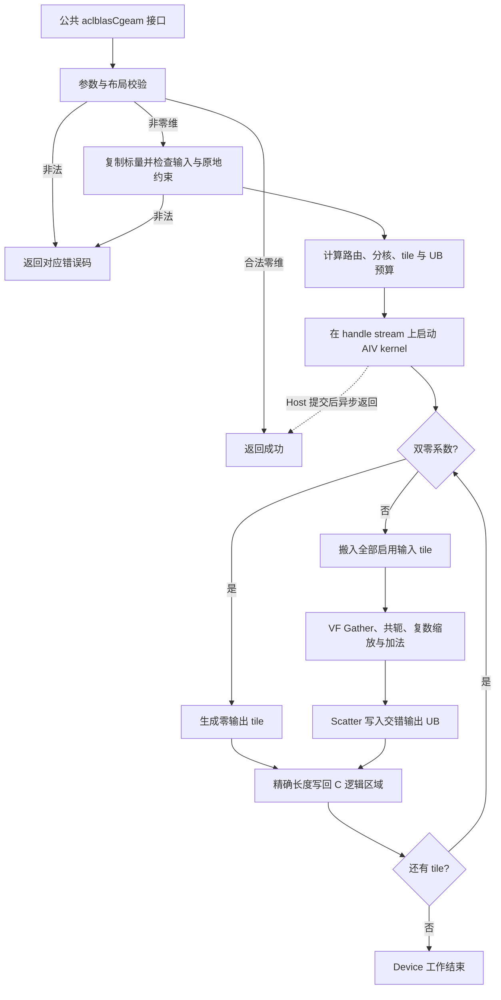

# 需求背景（required）

## 需求来源

本设计对应 **8月社区任务-aclblasCgeam算子开发（950）**，目标是在 Ascend 950PR、CANN 9.1.0 上实现单精度复数矩阵线性组合及转置接口 `aclblasCgeam`。

| 资料 | 来源及用途 |
| --- | --- |
| 官方任务 | [任务详情](https://www.hiascend.com/activities/task-center/details/84fa383c6db0464f9a63cb61d44663c7)、[任务书及测试附件](https://www.hiascend.com/p/resource/202608/edc7430da7e1498a98c966bf74cdba56.zip)：功能、环境、精度和性能要求 |
| 设计归档 | [2026 社区任务目录](https://gitcode.com/cann/cann-ops-competitions/tree/master/04_tasks/01_community-task-2026)、[设计模板](https://gitcode.com/cann/cann-ops-competitions/blob/master/04_tasks/01_community-task-2026/resources/design_template.md) |
| 公共接口 | [cann_ops_blas.h](https://gitcode.com/cann/ops-blas/blob/master/include/cann_ops_blas.h)、[公共类型](https://gitcode.com/cann/ops-blas/blob/master/include/cann_ops_blas_common.h) |
| 对标语义 | [cuBLAS geam](https://docs.nvidia.com/cuda/cublas/index.html#cublas-t-geam)、[仓内 CPU Golden](https://gitcode.com/cann/ops-blas/blob/master/test/geam/geam_golden.h) |

| 版本 | 日期 | 作者 | 修改内容 |
| --- | --- | --- | --- |
| 1.0 | 2026-09-15 | wangyuyan_44 | 初始设计：接口约束、复数计算、分块转置、原地安全性与测试设计 |
| 1.1 | 2026-09-15 | wangyuyan_44 | 精简过程性说明，明确计算、资源和测试要求 |

## 背景介绍

计算目标为 `C = alpha * op(A) + beta * op(B)`，其中 `op(A)`、`op(B)`、`C` 均为 `m × n`。两个输入可分别选择不转置、转置或共轭转置。将转置、共轭、缩放、相加融合在同一 kernel 内，可以避免生成两个完整的 GM 临时矩阵，并减少启动及中间数据读写开销。

该算子不包含矩阵乘法或归约，采用 AIV 上的 SIMD RegBase 路线。性能重点是保持 GM 搬运连续、在 UB 内完成重排，以及把复数算术中间值保留在寄存器中。

# 需求分析（required）

## 需求描述

沿用 ops-blas 的句柄式 BLAS 接口，使用 handle 绑定的 stream 直调 kernel。公共接口签名如下，接口名称、顺序和类型保持一致：

```cpp
aclblasStatus_t aclblasCgeam(
    aclblasHandle_t handle,
    aclblasOperation_t transa, aclblasOperation_t transb,
    int m, int n,
    const aclblasComplex* alpha, const aclblasComplex* A, int lda,
    const aclblasComplex* beta, const aclblasComplex* B, int ldb,
    aclblasComplex* C, int ldc);
```

| 参数 | 内存位置与语义 | 约束及处理 |
| --- | --- | --- |
| handle | Host 句柄，携带 stream | 空句柄返回 `ACLBLAS_STATUS_HANDLE_IS_NULLPTR` |
| transa、transb | Host 枚举 | 分别支持 `ACLBLAS_OP_N/T/C`；非法枚举返回 `ACLBLAS_STATUS_INVALID_ENUM` |
| m、n | Host 整数，输出行数和列数 | 非负；合法零维调用直接成功，不启动 kernel |
| alpha、beta | Host 上的 `aclblasComplex` 标量指针 | 指针有效；实部、虚部为 FP32；调用时复制标量值至 launch 参数 |
| A、B | Device 复数矩阵，列主序 | 对应标量非零时必须有效；对应标量为复数零时不读取输入，允许空指针 |
| lda、ldb | 以复数元素为单位的前导维 | N：至少 `max(1,m)`；T/C：至少 `max(1,n)` |
| C | Device 输出，列主序 | 非零维时必须有效；只更新逻辑 `m × n` 区域 |
| ldc | 输出前导维 | 至少 `max(1,m)` |

除空句柄和非法枚举外，非法数值、必需指针及原地约束错误返回 `ACLBLAS_STATUS_INVALID_VALUE`。不读取 Host 指针指向的 Device 内存；本任务只要求 Host 标量模式。

## 需求拆解

| 能力 | 实现要求 |
| --- | --- |
| 转置组合 | `transa × transb` 全部 9 种组合，包含非方阵 |
| 复数计算 | COMPLEX64 输入输出，FP32 分量计算，共轭仅改变输入虚部分量符号 |
| 标量短路 | alpha 为零跳过 A；beta 为零跳过 B；双零直接填充 C，不读取旧 C |
| 原地计算 | `C == A` 必须满足 `transa=N && lda=ldc`；`C == B` 必须满足 `transb=N && ldb=ldc`；两者同时相等时两组约束均满足 |
| 非紧凑布局 | 支持前导维 padding；输入 padding 不参与计算，输出 padding 保持原值 |
| 异步性 | 在绑定 stream 上提交一次 kernel；接口不为正常计算添加 stream 同步，调用者读回结果前同步 |
| 工程位置 | 实现位于 `blas/geam/arch35/`；测试位于 `test/geam/cgeam/arch35/`，复用公共声明 |

输出与输入内存的部分重叠不属于声明的原地模式；调用者应保证输出区不与输入重叠，或满足上述完全同址条件。A 与 B 可以同址且只读；实现不能据此擅自将两次复数乘法改为先合并系数。

# 详细设计（required）

## 算子分析

### 数学公式与索引

令 `0 <= i < m`、`0 <= j < n`，以下下标均以复数元素为单位：

| 操作 | 取值下标 | 分量变换 |
| --- | --- | --- |
| N | `X[i + j*ldX]` | `(xr, xi)` |
| T | `X[j + i*ldX]` | `(xr, xi)` |
| C | `X[j + i*ldX]` | `(xr, -xi)` |

对变换后的 `a=(ar,ai)`、`b=(br,bi)`，定义：

```text
pa.real = alpha.real * ar - alpha.imag * ai
pa.imag = alpha.real * ai + alpha.imag * ar
pb.real = beta.real  * br - beta.imag  * bi
pb.imag = beta.real  * bi + beta.imag  * br
C[i+j*ldc] = pa + pb
```

当某一复数系数两个分量均等于零时，直接省略对应乘积，不使用“先读取、乘零、最后 Select”的形式，以免空指针访问或 Inf/NaN 污染。`-0` 按零判断；NaN 系数不是零。通用运算按 Golden 中的顺序从复数零开始累加 A 项，再累加 B 项。

### 数据类型及精度路径

`aclblasComplex` 按公共头文件定义为两个相邻 FP32 分量，搬运视图采用实部、虚部交错的 FP32 分量流。计算不降为 FP16/BF16，也不把 FP32 数据数值转换成整数参与转置。

有限值采用显式 FP32 乘、加、减，保留两项分别计算的顺序，不启用改变运算顺序的 FMA 收缩或代数化简。Inf/NaN 按 Golden 的 `std::complex<float>` 行为处理，覆盖 `0*Inf`、异号 Inf 相加和复数乘法产生双 NaN 的恢复行为。通用复数乘法不替换为仅实系数乘法或 memcpy；特殊值修正位于 VF 的 mask/select 分支，在 Device 完成。

## 算子实现

### 3.2.1 Host 侧设计

**参数处理顺序：** 校验 handle、枚举、非负维度和前导维；合法零维调用直接返回；非零维时校验 alpha/beta/C，复制标量，检查原地约束，再检查非零系数对应的输入指针。零系数只免除输入数据引用，不免除枚举、前导维和明确的原地约束。接口测试按此顺序覆盖零维与空标量、非法前导维等组合场景，零维调用不跳过结构校验。

维度乘法、tile 总数和 GM 偏移使用 64 位无符号中间值；先转宽再乘。检查 `ldX*storedColumns*sizeof(aclblasComplex)` 及最大地址偏移的可表示范围；超出范围返回非法值，避免字节长度溢出。DMA 参数字段装不下的长跨度通过外层列循环分解，每次使用已检查的 64 位 GM 起址，不静默截断。

核数及 UB 容量从当前平台信息获取，目标为 `DAV_3510 / arch35`；不硬编码某一板型的核数。Host 生成按值传递的 POD tiling 参数，包括 `m/n/lda/ldb/ldc`、四个标量分量、输入启用标志、两种操作、布局路由、tile 形状/数量、UB pitch 和实际 blockDim。无随计算规模增长的 Host 或 GM 临时空间。

| 路由 | 触发条件 | 工作方式 |
| --- | --- | --- |
| ZERO | alpha、beta 均为零 | 只写 C 逻辑区域 |
| LINEAR | 所有启用输入均为 N 且前导维等于 m，ldc=m | 将 `m*n` 展平，连续分块 |
| TILED | 其余合法输入 | 输出矩形分块，输入按自身物理连续方向搬入，UB 内重排 |

单输入和双输入由启用标志决定，未启用输入不分配队列、不绑定或偏移空 GM 指针。ZERO 在 ldc=m 时连续填充，否则按列分段写回。路由依据参数和资源条件，不依赖 CSV 编号或验收尺寸。

### 3.2.2 分核与 UB 规划

**LINEAR：** 总复数元素数 `E=m*n`。按至少约 4 KiB 输出工作量的粒度裁剪核数，划分 512 个复数元素对齐的连续区间，并裁掉无任务核。每核按 UB 上限继续切 tile；末核和末 tile 只处理有效元素。设启用输入数为 `a`，缓冲深度为 `d`，单 tile 有 `K` 个复数，则数据队列预算为 `8*d*(a+1)*K` 字节。

**TILED：** 输出 tile 的起点为 `(i0,j0)`，最大形状 `R × S`，实际形状 `r=min(R,m-i0)`、`s=min(S,n-j0)`。设：

```text
tileRows = ceil(m/R)
tileCols = ceil(n/S)
tiles    = tileRows * tileCols
P_N      = AlignUp(R, 32)                  // 复数元素，列段按 256 B 对齐
P_T      = AlignUp(S, 4) + 4               // 复数元素，额外 32 B 间隔缓解周期性 bank 冲突
bytesN   = 8 * S * P_N
bytesT   = 8 * R * P_T
bytesC   = bytesN
```

N 输入的每个输出列段连续搬入，UB 下标为 `u + v*P_N`；T/C 输入的每个物理列段连续搬入，UB 下标为 `v + u*P_T`。其中 `0<=u<r`、`0<=v<s`。增加的 pitch 只用于 UB，不改变 GM 的 lda/ldb/ldc；尾块保留固定 pitch，通过有效 r/s 控制访问。

| Buffer | 大小 | 生命周期/复用 |
| --- | --- | --- |
| A 输入队列 | `d*bytesA`，按 N 或 T/C 取预算 | alpha 非零时存在；当前 tile 计算结束后释放 |
| B 输入队列 | `d*bytesB` | beta 非零时存在；当前 tile 计算结束后释放 |
| C 输出队列 | `d*bytesC` | 写回完成后槽位可复用 |
| VF 索引辅助区 | 不超过 `3*256 B` | 仅保存一个寄存器宽度的 lane/奇偶索引，可跨 tile 复用 |
| 算术中间值 | 寄存器 | 实/虚输入、两项乘积和结果，不额外生成完整 UB 中间矩阵 |

总预算为 `d*(bytesA+bytesB+bytesC)+indexBytes+reservedBytes <= U`，未启用输入大小为零。`reservedBytes` 包括额外对齐及工作区，按 2 KiB 计入 tiling 资源预算，并以 SDK 报告的实际 buffer 占用校验预算上限。

以双输入均转置、`R=S=64`、`d=2` 为例，`P_N=64`、`P_T=68`，数据队列共 204,800 B，加 768 B 索引区和 2,048 B 预留为 207,616 B；以典型 248 KiB UB 计算，约占 81.8%。Host 从合法形状候选中增大 tile，优先提高 UB 利用率，同时保留足够多的 tile 分配给 AIV；例如资源和并行度允许时可比较 `64×76`，而非所有输入固定用 `64×64`。小矩阵使用单缓冲与单核/少核，避免为了填满 UB 减少并行度。

tile 以列块优先、块内沿 i 方向遍历；对 `Q=min(可用AIV核数,tiles)` 个核均分连续 tile 编号，使用商和余数分配，每核 tile 数相差不超过 1。每个输出逻辑元素只有一个拥有者，核间无归约、原子操作或同步。tile 编号与总数为 64 位，局部 UB 索引为 32 位。

### 3.2.3 Kernel、UB 与 VF 数据流

外层 kernel 为 AIV-only，`Init` 绑定启用的 GM 地址并创建队列；`Process` 根据 LINEAR/TILED/ZERO 路由执行。GM↔UB 操作位于外层，复数算术与 gather/scatter 位于 `__VEC_SCOPE__` 或 `__simd_vf__` 内，二者职责分开。

**CopyIn：** N 输入每列读取 r 个复数，源首址 `i0+(j0+v)*ldX`；T/C 输入每列读取 s 个复数，源首址 `j0+(i0+u)*ldX`。使用 `DataCopyPad` 的 Ext 参数，blockLen 分别为 `8*r`、`8*s` 字节，UB 目标列段起始地址至少 32 B 对齐。先实现按列段循环，再在 stride 字段合法时合并为多块 DMA；必须区分 GM stride 的字节单位和 UB stride 的 32 B 单位。搬入不越过有效物理矩阵区域，不把 padding 作为有效输入。

**Compute：** 逐个输出列 v、沿 u 方向运行 VF slice。每次处理最多 L 个复数，其中 L 取一个 FP32 RegTensor 的元素数。用 `RegTensor<uint32_t>` 生成以下以 FP32 元素为单位的 UB 索引，使用 `Reg::Gather` 将实部、虚部分别放入 `RegTensor<float>`：

```text
N 输入：  realIndex = 2*(u + v*P_N)，imagIndex = realIndex+1
T/C 输入：realIndex = 2*(v + u*P_T)，imagIndex = realIndex+1
C 输出：  realIndex = 2*(u + v*P_N)，imagIndex = realIndex+1
```

这里采用 UB 指针版本 `Gather` 的元素索引，不与 Memory API 的字节 offset 混用。对 C 操作先对虚部取负，随后在寄存器中执行两次复数乘法和加法；通过 `Reg::Scatter` 按奇偶索引写回 C 的交错分量。未启用输入不执行 Gather。LINEAR 路径使用 `2*u` 和 `2*u+1` 作为实部、虚部索引。

每个 VF slice 的 mask 来自有效复数数目 `min(L,r-u0)`；将计数传给 `UpdateMask<float>` 时仅由它或外层其中一方推进剩余数，避免重复递减漏算。Gather/Scatter 的无效 lane 全部关闭；索引不能指向 UB 以外。输出 scatter 的实、虚索引互不重叠，且输入与输出 UB buffer 不重叠。

**CopyOut：** 每个输出列只写 r 个复数，目的首址为 `i0+(j0+v)*ldc`，blockLen 为 `8*r`。不将整个 `ldc*n` 空间清零，不覆盖输出 padding、相邻列或相邻 tile。即使 GM 列首址或尾段非 32 B 对齐，也保证 UB 起址对齐并使用准确字节长度。

关键 API 依据为 [Reg Gather 文档](https://www.hiascend.com/document/detail/zh/CANNCommunityEdition/900beta2/API/ascendcopapi/atlasascendc_api_07_0401.html) 和 CANN RegBase API 家族说明。寄存器计算结构参考 [group_norm_v2 的 arch35 实现](https://gitcode.com/cann/ops-nn/blob/master/norm/group_norm_v2/op_kernel/arch35/group_norm_v2_regbase_base.h) 中使用的 `RegTensor`、`LoadAlign`、`StoreAlign` 与 mask 模式，只复用编程结构，不引入其归约算法。API 签名和地址空间采用 CANN 9.1.0 公开头文件定义。

### 3.2.4 原地安全性与同步

合法 `C==A` 或 `C==B` 时，共享输入必须为 N 且前导维与 C 相同，因而每个输出 tile 只依赖共享输入的同一个 tile。先把当前 tile 的所有启用输入完整搬入各自 UB 队列，再生成输出；不在尚未读取 B 时覆盖 A/C。A=B=C 时仍分别完成两项计算，保持 Golden 的舍入和特殊值语义。

队列 EnQue/DeQue 管理 MTE2→VF→MTE3 的就绪关系：输入计算完才释放，输出写回结束才能复用槽位。双缓冲可以预取后续 tile，但不能提前复用尚在 MTE3 使用的输出槽位。普通寄存器算术链无本地 store→load 依赖，不额外添加 VF barrier；若索引辅助区先由 VF 写入再读取，则使用已核对的 `LocalMemBar<VEC_STORE,VEC_LOAD>`。本地 mask 不代替流水同步。接口不添加跨核 flag 或全局屏障。

GM 算法 workspace 为 0；tiling 与标量为有界 launch 参数。正常调用不临时申请完整输入副本，也不在异步 kernel 完成前释放其依赖的数据。运行时启动错误沿用 ops-blas 的错误映射；异步执行错误由调用方同步结果检查。

### 3.2.5 执行流程



## 支持硬件

| 产品 | 架构/工程目录 | 环境 |
| --- | --- | --- |
| Ascend 950PR | DAV_3510 / arch35 | CANN 9.1.0 |

## 算子约束限制

支持 complex64、运行时 m/n 和前导维 padding，无批量或广播接口；不扩展为独立的 950 私有 API。输出尺寸、地址和 DMA 字段分别检查，不把附件的最大测试尺寸当作合法输入上限。输入的实际分配大小、生命周期及跨 stream 依赖由调用者保证。其他产品线的实现与分派保持原有行为。

# 可维可测分析

## 精度标准/性能标准

| 验收项 | 标准 | 来源 |
| --- | --- | --- |
| Golden | 仓内 `test/geam/geam_golden.h`，复数采用 `std::complex<float>`；全输出实部、虚部分别比对 | 任务书 §3.1–3.2 |
| 有限值误差 | `abs(actual-golden) <= 2^-16 + 2^-10*abs(golden)`；matched_ratio≥0.99，且最大绝对误差满足 `1e-2 或 32*ULP` 的官方定义 | 任务书、[生态精度标准](https://gitcode.com/cann/opbase/blob/master/docs/zh/ops_precision_standard/experimental_standard.md) |
| 非有限值 | NaN 位置、Inf 符号分别检查，不将 NaN 从分母静默移除或统一改零 | 任务书 §3.5、Golden |
| 性能采样 | Ascend 950PR，预热后有效采样超过 50 次，记录平均单次 kernel 耗时及原始日志 | 任务书 §3.3 |

| m×n | transa/transb | alpha/beta | 前导维 | kernel 平均耗时上限 |
| --- | --- | --- | --- | --- |
| 1024×1024 | N/N | (1,0)/(1,0) | 最小合法值 | 12.41 μs |
| 2048×2048 | N/N | (1,0)/(1,0) | 最小合法值 | 63.62 μs |
| 2048×2048 | T/C | (1,0)/(1,0) | 最小合法值 | 65.33 μs |

双输入正常路径的最低 GM 流量约为 `24*m*n` 字节（两个 complex64 输入和一个输出）；单输入为 `16*m*n`，双零为 `8*m*n`，均不含 padding。利用这一模型检查是否出现多次 GM 重排或不必要读取。对转置路径重点比较 tile 形状、UB pitch 和 gather bank 冲突；对小矩阵比较单核启动与双缓冲收益。所有优化均使用参数驱动的通用条件。

## 测试覆盖与验收证据

测试集包含 1,000 条精度用例和 200 条性能用例，并补充以下交叉覆盖：

| 测试组 | 覆盖内容 | 检查重点 |
| --- | --- | --- |
| 基础与转置 | 全部 9 种组合；方阵、宽矩阵、窄矩阵 | 列主序地址、共轭符号、矩形重排 |
| tile 边界 | 1、质数、R/S/L 及其±1；核数边界；多 tile | 尾 mask、末核、无重复或遗漏写入 |
| 前导维与地址 | 最小 ld、不同 padding、GM 地址偏移 | UB 起址对齐、输入只读、输出 padding 与保护区保持不变 |
| 标量 | 零、负零、单位、纯虚、一般复数、大值、NaN/Inf | 零系数输入可空且不读取，非零系数不错误短路 |
| 原地 | C=A、C=B、A=B=C；共享输入 N，另一输入 T/C；padding | 当前 tile 两输入先读后写；非法转置或 ld 返回错误 |
| 参数错误 | 空 handle、空标量、必需输入/输出为空、非法枚举、负维度、非法 ld、偏移溢出 | 返回码和错误优先级；不启动无效 kernel |
| 特殊数值 | NaN/Inf 组合、抵消、极小值、溢出及复数乘法恢复 | 分量分类与 Golden 一致，有限值误差不被特殊值掩盖 |
| 流水与资源 | 同 stream 连续调用、独立 handle/stream、重复执行 | 无隐式同步、无跨调用状态污染、资源有界 |

在指定远端 NPU 环境执行构建、精度和性能验证，本地数学/索引验证不能替代设备测试。测试报告记录代码 Commit、CANN/驱动/设备版本、CSV 参数、实际执行条数、退出码、逐项结果与原始输出；零执行用例、NO_REF 或仅脚本退出码为 0 不构成验收通过。

## 兼容性分析

公共函数声明、句柄、stream 和状态码沿用 ops-blas。实现仅接入 arch35 对应分派，保持其他架构及 geam 家族接口不变。API 文档、算子 README、样例和测试与算子实现同步维护。
