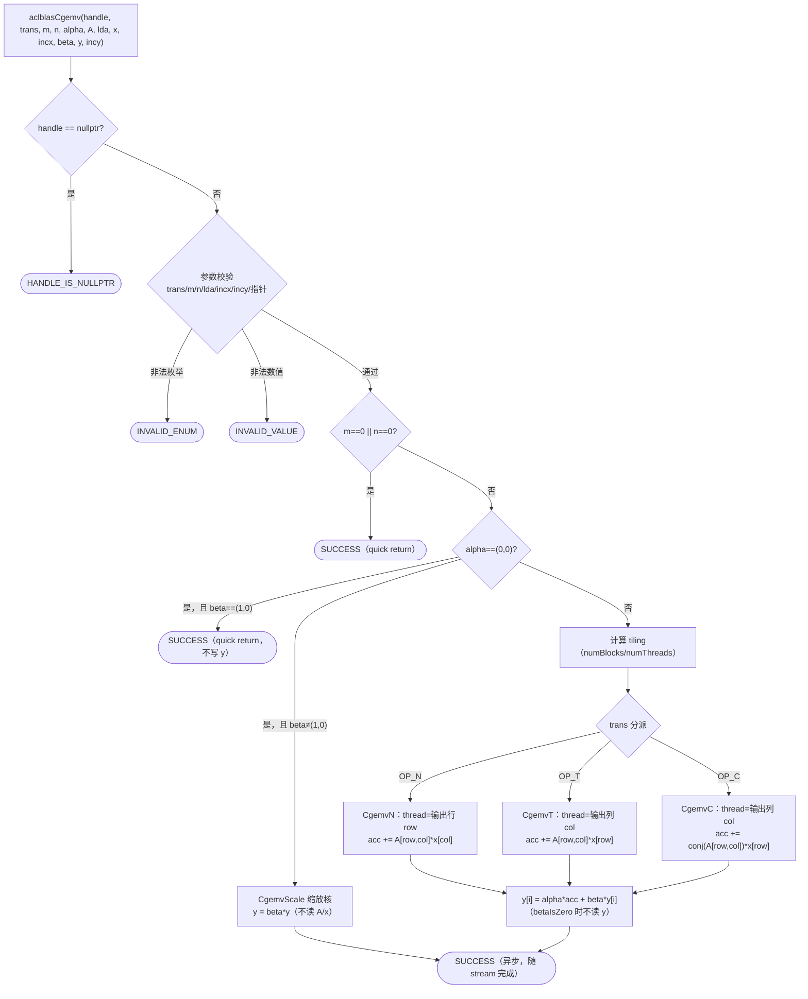
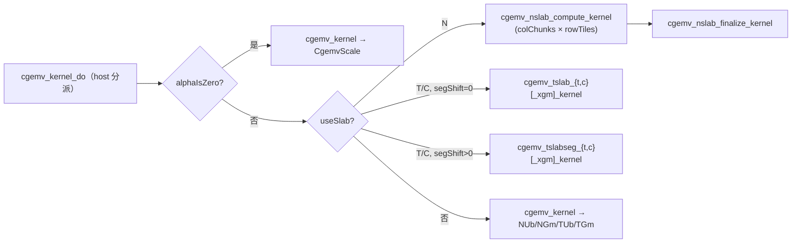

# aclblasCgemv 算子设计文档

## 一、需求背景

### 1.1 需求来源

社区任务《8月社区任务-aclblasCgemv算子开发（950）》要求在昇腾 NPU（Ascend 950PR，CANN 9.1.0）上使用 Ascend C 编程语言开发单精度复数（complex64）矩阵-向量乘算子 `aclblasCgemv`，完成算子设计、开发、测试全流程工作，验收通过后合入昇腾算子开源仓 [ops-blas](https://gitcode.com/cann/ops-blas)（算子目录 `blas/gemv/arch35/`，测试目录 `test/gemv/cgemv/arch35/`）。

### 1.2 背景介绍

#### 1.2.1 算子目标

`aclblasCgemv` 与 cuBLAS `cublasCgemv` 核心功能、参数语义完全对齐（语义参考 Netlib `cgemv`），计算：

```
y = alpha * op(A) * x + beta * y
```

其中 `A` 为 m×n 列主序（Column-Major）复数矩阵，`x`、`y` 为复数向量，`alpha`、`beta` 为复数标量，且：

```
op(A) = A        （trans == ACLBLAS_OP_N，不转置）
op(A) = A^T      （trans == ACLBLAS_OP_T，转置）
op(A) = A^H      （trans == ACLBLAS_OP_C，共轭转置）
```

复数路径下 `ACLBLAS_OP_C` 为共轭转置（先转置再逐元素取共轭），与 `ACLBLAS_OP_T` 语义不同，两条分支均须实现。向量长度语义：`trans = N` 时 x 逻辑长度为 n、y 逻辑长度为 m；`trans = T/C` 时 x 逻辑长度为 m、y 逻辑长度为 n。incx、incy 支持正负步长（负步长按 Netlib 参考实现从反向起点遍历）。

本次设计目标：

1. 在 Ascend 950PR（arch35）上实现 `aclblasCgemv` 句柄式 BLAS 接口，Ascend C kernel 直调（handle 绑定 stream 直调 NPU kernel）。
2. 逐参数对齐 ops-blas 仓 `include/cann_ops_blas.h` 中已有的 `aclblasCgemv` 声明，与其他产品线共用同一 API，不新增 950PR 私有平行接口。
3. 精度满足生态算子开源精度标准（complex64 实部/虚部分别按 FLOAT32 判定：rtol=2⁻¹⁰、atol=2⁻¹⁶、matched_ratio≥0.99、max_abs_error ≤ max(1e-2, 32ULP)），golden 由 cblas（Netlib `cgemv`）生成。
4. 性能不高于任务书标杆：OP_N 512×512 ≤ 2.18us、OP_N 2048×2048 ≤ 3.86us、OP_T 2048×2048 ≤ 3.51us（warmup 后有效采样 >50 次取平均）。

#### 1.2.2 基线来源说明

本设计以 ops-blas 仓已有实现为工程基线，不引入新的外部依赖：

| 基线层次 | 直接路径 | 作用 |
| --- | --- | --- |
| arch35 SIMT gemv 框架 | `blas/gemv/arch35/sgemv_{host,kernel}.cpp`、`sgemv_tiling_data.h` | 复用实数 sgemv 的 host 校验/tiling/SIMT kernel 结构（grid-stride、UB 缓存 x、正负步长寻址） |
| arch35 复数算子惯例 | `blas/geam/arch35/cgeam_{host,kernel}.cpp` | 复用复数交织存储（float 实部/虚部成对）、alpha/beta 置零判定、alpha=0 时 A/x 空指针替换等复数处理惯例 |
| 复数语义参考 | `blas/gemv/arch22/cgemv_*`（A2/A3 已有实现）、Netlib `cgemv.f` | 核对 OP_N/OP_T/OP_C 与 quick-return 语义 |
| 测试框架 | `test/frame/*`、`test/gemv/sgemv/arch35/*`、`test/geam/cgeam/arch35/*` | CSV 驱动 GTest、cblas golden、MIXED_TOLERANCE 精度判定（实部/虚部分离比对） |

#### 1.2.3 现状分析

ops-blas 仓现状：`include/cann_ops_blas.h` 已有 `aclblasCgemv` 声明；`blas/gemv/arch22/` 已有 A2/A3 实现（AscendC V220 手工流水风格）；`blas/gemv/arch35/` 仅有实数 `sgemv`（SIMT 风格），**缺少 950PR 的复数 cgemv 实现**。`blas/gemv/README.md` 已有 `aclblasCgemv` 章节，但产品支持表中 Ascend 950PR 标注为"不支持"，需要更新。

arch35（DAV_3510）提供 SIMT 编程模型（`simt_api/asc_simt.h`：`blockIdx/threadIdx`、`asc_vf_call`、`__ubuf__` 共享内存、`asc_syncthreads`），与 CUDA kernel 结构同构，天然适配 gemv 这类"每输出元素一次内积"的访存受限算子。本设计核心工作是：在 sgemv 的 SIMT 骨架上扩展复数乘累加（实部/虚部双累加器）、OP_C 共轭分支、复数标量 alpha/beta 缩放，以及 Netlib 复数 no-op 语义（alpha=0/beta=0 的退化路径）。

## 二、需求分析

### 2.1 外部组件依赖

不引入新的第三方组件。复用 ops-blas 已有的：handle 机制（`aclblas_handle_internal.h`，handle 携带 stream）、host 工具（`host_utils.h`：`CHECK_RET`/`CeilDiv`/`CeilAlign`/`GetAivCoreCount`）、SIMT 常量（`kernel_constant.h`：`SIMT_MIN_THREAD_NUM=128`、`SIMT_MAX_THREAD_NUM=2048`）、测试公共件（`test/frame`、`test/utils`，golden 依赖系统 cblas/Netlib 参考实现）。

### 2.2 内部适配模块

| 模块 | 计划文件 | 设计职责 |
| --- | --- | --- |
| Host 实现 | `blas/gemv/arch35/cgemv_host.cpp` | `aclblasCgemv` 入口：参数校验、quick-return、tiling 计算、kernel 直调 |
| Kernel 实现 | `blas/gemv/arch35/cgemv_kernel.cpp` | SIMT kernel：OP_N / OP_T / OP_C ×（UB 缓存 x / GM 直读）+ alpha=0 退化缩放路径 |
| Tiling 结构 | `blas/gemv/arch35/cgemv_tiling_data.h` | host/kernel 共享的 `CgemvTilingData`（POD，按值直传） |
| 功能测试 | `test/gemv/cgemv/arch35/cgemv_test.cpp` + `cgemv_test.csv` | CSV 驱动 GTest：cblas golden、实部/虚部分离 MIXED_TOLERANCE 比对、负向用例 |
| 测试辅件 | `test/gemv/cgemv/cgemv_param.h`、`test/gemv/cgemv/arch35/cgemv_npu_wrapper.h`、`cgemv_golden.h` | CSV 参数解析（alpha_real/alpha_imag 等列）、device 内存搬运包装、cblas_cgemv golden 包装 |
| 构建接入 | `test/gemv/cgemv/CMakeLists.txt` | arch35 走 GTest 注册（`ops_blas_add_gtest_tests`），其他架构保持原 `ops_blas_add_tests`（不影响 A2/A3 已有冒烟测试） |
| 文档 | `blas/gemv/README.md` | `aclblasCgemv` 章节产品支持表更新：Ascend 950PR：支持 |
| 构建选项 | 顶层 `CMakeLists.txt` | 对 `blas/gemv/arch35/cgemv_kernel.cpp` 单文件追加 `COMPILE_OPTIONS -O3`（仓库强制 Debug 构建下 ASC kernel 为 -O0，本 SIMT kernel 慢 ~3×；按 arch35 条件生效，其余算子不受影响） |

`blas/CMakeLists.txt` 按 `SOC_ARCH_DIRS` 自动收集 `blas/*/arch35/*.cpp`，算子源码无需改构建脚本。

### 2.3 接口原型

与 ops-blas 仓 `include/cann_ops_blas.h` 已有声明逐参数一致（复数类型 `aclblasComplex` 以 `include/cann_ops_blas_common.h` 定义为准，实部/虚部各 float32）：

```cpp
aclblasStatus_t aclblasCgemv(
    aclblasHandle_t handle, aclblasOperation_t trans, int m, int n, const aclblasComplex* alpha,
    const aclblasComplex* A, int lda, const aclblasComplex* x, int incx, const aclblasComplex* beta,
    aclblasComplex* y, int incy);
```

#### 2.3.1 参数说明

| 参数名 | 输入/输出 | 描述 | dtype | 维度/值域 | 异常行为 |
| --- | --- | --- | --- | --- | --- |
| handle | 输入 | ops-blas 库上下文句柄，携带 stream，Host 内存 | - | 指向已创建的有效句柄 | nullptr → `ACLBLAS_STATUS_HANDLE_IS_NULLPTR` |
| trans | 输入 | 矩阵操作类型，Host 内存 | 枚举 | {OP_N, OP_T, OP_C} | 非法枚举 → `ACLBLAS_STATUS_INVALID_ENUM` |
| m | 输入 | A 的行数，Host 内存 | int | m ≥ 0 | m < 0 → `ACLBLAS_STATUS_INVALID_VALUE`；m = 0 合法 quick return |
| n | 输入 | A 的列数，Host 内存 | int | n ≥ 0 | n < 0 → `ACLBLAS_STATUS_INVALID_VALUE`；n = 0 合法 quick return |
| alpha | 输入 | 复数标量指针，Host 内存 | COMPLEX64 | FLOAT32 全集 | nullptr → `ACLBLAS_STATUS_INVALID_VALUE` |
| A | 输入 | 列主序复数矩阵，数组维度 lda×n（有效 m×n），Device 内存，只读 | COMPLEX64 | FLOAT32 全集 | m>0 且 n>0 且 alpha≠(0,0) 时 nullptr → `ACLBLAS_STATUS_INVALID_VALUE` |
| lda | 输入 | A 前导维度，Host 内存 | int | lda ≥ max(1, m) | 违反 → `ACLBLAS_STATUS_INVALID_VALUE` |
| x | 输入 | 输入向量，Device 内存，只读；逻辑长度 lenx（N:n，T/C:m），存储元素数 ≥ 1+(lenx−1)×\|incx\| | COMPLEX64 | FLOAT32 全集 | m>0 且 n>0 且 alpha≠(0,0) 时 nullptr → `ACLBLAS_STATUS_INVALID_VALUE` |
| incx | 输入 | x 步长，支持正负，Host 内存 | int | incx ≠ 0 | incx = 0 → `ACLBLAS_STATUS_INVALID_VALUE` |
| beta | 输入 | 复数标量指针，Host 内存；beta=(0,0) 时 y 不必是有效输入 | COMPLEX64 | FLOAT32 全集 | nullptr → `ACLBLAS_STATUS_INVALID_VALUE` |
| y | 输入/输出 | 输入/输出向量，Device 内存，原地覆写；逻辑长度 leny（N:m，T/C:n） | COMPLEX64 | FLOAT32 全集 | 需执行写回（m>0、n>0 且非 quick-return）时 nullptr → `ACLBLAS_STATUS_INVALID_VALUE` |
| incy | 输入 | y 步长，支持正负，Host 内存 | int | incy ≠ 0 | incy = 0 → `ACLBLAS_STATUS_INVALID_VALUE` |

**返回值**：`aclblasStatus_t`，状态码语义与 `include/cann_ops_blas_common.h` 一致。

#### 2.3.2 no-op / 退化语义（依据 Netlib cgemv）

| 场景 | 行为 |
| --- | --- |
| m = 0 或 n = 0 | 合法 quick return，返回 `ACLBLAS_STATUS_SUCCESS`，不执行计算、不写 y |
| alpha = (0,0) 且 beta = (1,0) | quick return，不读 A/x、不写 y |
| alpha = (0,0) 且 beta ≠ (1,0) | 退化为 `y = beta * y`（不读 A、x；beta=(0,0) 时直接写 0） |
| beta = (0,0) | y 的输入值不被读取（y 可为 NaN/未初始化），仅写回 `alpha*op(A)*x` |

#### 2.3.3 设计范围与约束

| 类别 | 约束项 | 约束内容 |
| --- | --- | --- |
| 参数合法性 | 校验序 | handle → trans 枚举 → m/n → lda → incx/incy → alpha/beta 指针 → A/x/y 指针（按需） |
| 共轭转置 | OP_C | 必须对 A 取共轭转置（A^H），不得退化为普通转置 |
| 非连续 Tensor | 不要求 | 不支持超出 lda/incx/incy 语义的非连续内存访问 |
| broadcast | 不涉及 | A/x/y 独立，无广播 |
| dynamic shape | 不要求 | m/n 为运行时入参，tiling 每次调用即时计算 |
| 原地与视图 | y 原地覆写 | 不返回视图 |
| 确定性计算 | 不要求 | 浮点乘累加顺序与 golden 可在容差内不同 |
| 异步执行 | 依赖 handle 绑定的 stream | kernel 异步下发；读回 Device 结果前须同步 stream |

## 三、需求详细设计

### 3.1 使能方式

用户通过 `aclblasCreate` 创建 handle 并 `aclblasSetStream` 绑定 stream 后直接调用 `aclblasCgemv`（接口声明沿用
`include/cann_ops_blas.h` 既有声明，与其他产品线共用）。host 侧完成参数校验与 tiling 后经 `cgemv_kernel_do` 直接下发
SIMT kernel：OP_N slab 快路径为 compute → finalize 两次 stream 有序发射，OP_T/C slab 与通用路径为单次发射；tiling
按值传递，无 device 侧 tiling 内存；OP_N 快路径复用 handle 自带 workspace（默认 32MB）存放各 slab 部分和，热路径无
任何 `aclrtMalloc` / host↔device 拷贝。构建由 `blas/CMakeLists.txt` 按 `SOC_ARCH_DIRS` 自动收集 `blas/gemv/arch35/`
源文件，`--soc=ascend950` 时生效。

### 3.2 需求总体设计

#### 3.2.1 数据表示与总体结构

complex64 在 GM 中为实部/虚部交织存储（`aclblasComplex{float real; float imag;}`，与 cuComplex 布局一致）。kernel 侧将 A/x/y 视为 `__gm__ float*`，复数下标 k 的实部在 `2k`、虚部在 `2k+1`。

整体结构沿用 arch35 sgemv 的 SIMT 骨架，扩展为复数三分支：



#### 3.2.2 Host 侧设计（校验、tiling、下发）

**参数校验**（对应 §2.3.1 异常行为，全部在 host 完成，非法参数不下发 kernel）：

1. `handle == nullptr` → `HANDLE_IS_NULLPTR`；
2. `trans ∉ {OP_N, OP_T, OP_C}` → `INVALID_ENUM`（任务书 §2.4 明确要求，区别于实数 sgemv 的 INVALID_VALUE 行为）；
3. `m < 0`、`n < 0`、`lda < max(1, m)`、`incx == 0`、`incy == 0`、`incx/incy == INT32_MIN`（防 `|inc|` 溢出）→ `INVALID_VALUE`；
4. `alpha == nullptr`、`beta == nullptr` → `INVALID_VALUE`；
5. Device 指针按需校验（m>0 且 n>0 前提下）：`alpha ≠ (0,0)` 时 A、x 不得为 nullptr；非 quick-return（即 !(alpha==(0,0) && beta==(1,0))）时 y 不得为 nullptr。

**quick return**：`m==0 || n==0` → SUCCESS；`alpha==(0,0) && beta==(1,0)` → SUCCESS（不下发 kernel）。

**tiling 计算**（outDim 为输出向量逻辑长度）：

- **slab 快路径**（`incx == 1` 且 `lda*n < 2^32`；OP_N 另需 handle workspace ≥ `colChunks*m*8B`）：
  列切成 `colChunks = min(aivCoreNum, CeilDiv(n, 8))` 个连续列 slab，`chunkLen = CeilDiv(n, colChunks)`；
  - OP_N：`rowTiles = CeilDiv(m, 2048)`，`numThreads = CeilAlign(CeilDiv(m, rowTiles), 128)`（行分块均衡，每线程一行），
    grid = `colChunks × rowTiles`；第二次发射 finalize 的 grid = `CeilDiv(m, 128)`（每块 128 行 × 8 组 = 1024 线程）；
  - OP_T/OP_C：`numThreads = 2048`（每 warp 一列），grid = `colChunks`；slab 列数过少（`chunkLen*2^k ≤ 40`、
    段长 ≥ 512/1024 行）时列切成 `2^segShift` 个行段（`segShift ≤ 3`），使更多 warp 参与流式读取。
- **通用回退路径**（`incx != 1`、`lda*n ≥ 2^32` 或 workspace 不足）：与 sgemv 同构：

```
numBlocks  = clamp(CeilDiv(outDim, SIMT_MIN_THREAD_NUM), 1, aivCoreNum)
numThreads = min(CeilAlign(CeilDiv(outDim, numBlocks), SIMT_MIN_THREAD_NUM), SIMT_MAX_THREAD_NUM)
```

`CgemvTilingData`（POD，按值传入 kernel）：

```cpp
struct CgemvTilingData {
    uint32_t numThreads;   // 每 block 线程数
    uint32_t m, n, lda;    // 形状与前导维
    uint32_t trans;        // 0=N, 1=T, 2=C
    uint32_t alphaIsZero;  // alpha==(0,0)：走缩放路径，不读 A/x
    uint32_t betaIsZero;   // beta==(0,0)：不读 y（y 可为 NaN/未初始化）
    float alphaR, alphaI, betaR, betaI;
    int64_t incx, incy;    // 支持正负步长
    uint32_t useSlab;      // 1 = slab 快路径
    uint32_t chunkLen;     // 每 slab 列数
    uint32_t colChunks;    // slab 数
    uint32_t segShift;     // OP_T/C：log2(每列行段数)，0 = 每 warp 整列
};
```

**workspace**：OP_N slab 路径使用 handle 自带 workspace（默认 32MB，`GetEffectiveWorkspace`）存放 `colChunks` 份部分 y
向量（`colChunks*m*8B`），两次发射在同一 stream 上顺序执行（compute → finalize），**无跨 block 同步/自旋**；
同一 handle 上背靠背调用由 stream 顺序保证 workspace 复用安全。

**空指针替换**：`alphaIsZero` 路径下 A/x 允许为 nullptr，为避免空 GM 描述符问题，下发时以 y 地址替换 A/x 形参（kernel 依据 `alphaIsZero` 保证不读取，惯例同 `cgeam_host.cpp`）。

#### 3.2.3 Kernel 侧设计（SIMT）

**复数乘累加公式**（每线程持实部/虚部双累加器，float32 寄存器累加）：

| 分支 | 逐元素累加（a = A[row,col]，s = x 对应元素） |
| --- | --- |
| OP_N / OP_T | `accR += aR*sR − aI*sI`；`accI += aR*sI + aI*sR` |
| OP_C | `accR += aR*sR + aI*sI`；`accI += aR*sI − aI*sR`（即以 −aI 参与乘累加） |

OP_T 与 OP_C 共用列遍历骨架，以编译期模板参数 `IS_CONJ` 区分虚部符号（内层循环无分支）。

**写回公式**（w = y[i] 旧值，仅 `betaIsZero==0` 时读取）：

```
yR' = alphaR*accR − alphaI*accI + (betaIsZero ? 0 : betaR*wR − betaI*wI)
yI' = alphaR*accI + alphaI*accR + (betaIsZero ? 0 : betaR*wI + betaI*wR)
```

`betaIsZero` 时完全不读 y（避免 0×NaN 污染，满足"beta=0 时 y 不必是有效输入"）；缩放路径（`alphaIsZero && beta≠(1,0)`）同理：`betaIsZero` 时直接写 0。

**线程组织与寻址**（grid-stride，逐输出元素）：

```
OP_N： row = blockIdx.x*blockDim.x + threadIdx.x; row += gridDim.x*blockDim.x ...
       内层 col ∈ [0, n)：aIdx = row + col*lda（复数下标）
OP_T/C：col 为输出下标，内层 row ∈ [0, m)：aIdx = row + col*lda
```

- OP_N：同一内层迭代中相邻线程访问 A 同一列的相邻复数元素（8B 连续），跨线程合并访存；
- OP_T/C：每线程沿一列连续遍历（空间局部性好），线程间按列并行；
- 正负步长寻址（与 Netlib 反向遍历语义一致，len 为对应逻辑长度）：

```
idx(i) = (inc >= 0) ? i*inc : (len-1-i)*(-inc)      // 复数下标，float 下标再 ×2
```

**slab 快路径（incx==1，主路径）**：每个 block 按列 slab 从前到后连续流式读取 A（本架构实测最高带宽的 GM 访问模式，
float2/lane；float4 及更宽加载实测更慢）。

- OP_N（两次发射）：`CgemvNSlabCompute` 每线程持一行的实部/虚部累加器，沿本 slab 的列逐列累加
  （x 每列一次均匀地址 GM 读取，驻留缓存），把本 slab 的部分 y 写入 workspace `ws[chunk*m + row]`；
  `CgemvNSlabFinalize` 第二次发射，每块 128 行 × 8 个 chunk 组（1024 线程）并行求和 `colChunks` 份部分和，
  UB 内合并后施加 alpha/beta 写回 y。行数超过 2048 时按行分块扩展 grid（每块仍为最简"一次加载即消费"循环）。
- OP_T/OP_C：`CgemvTSlab<IS_CONJ>` 每 warp 负责一列，lane 跨行步进读取 A（x 驻留 UB；m > 8192 时从 GM 读），
  warp 内 shuffle 归约后由 lane 0 写回；`CgemvTSlabSeg<IS_CONJ>` 用于列数很少的 slab（细高 op(A)），
  每列切成 2^k 行段、(列, 段) 工作项轮转分配给各 warp，部分和经 UB 合并后写回（x 驻留 UB；m > 8192 时 `_xgm` 变体从 GM 读）。
- 每个 slab kernel 独占一个 `__global__` 入口（单一 vf 实例），由 host 侧 `cgemv_kernel_do` 按 tiling 直接选择。

**通用回退路径**：`incx != 1`、`lda*n ≥ 2^32` 或 workspace 不足时沿用 grid-stride 逐输出元素 kernel：
`incx==1 && xDim ≤ 8192 && outDim ≥ 32` 时 x 协同加载到 `__ubuf__ float xUb[16384]`（`CgemvNUb`/`CgemvTUb`），
否则 GM 直读（`CgemvNGm`/`CgemvTGm`）。

| kernel 入口 | SIMT 函数 | 路径 |
| --- | --- | --- |
| `cgemv_nslab_compute_kernel` → `cgemv_nslab_finalize_kernel` | `CgemvNSlabCompute` / `CgemvNSlabFinalize` | OP_N slab（两次发射） |
| `cgemv_tslab_{t,c}_kernel`（`_xgm` 变体：m > 8192） | `CgemvTSlab<IS_CONJ, X_FROM_GM>` | OP_T/C slab，每 warp 一列 |
| `cgemv_tslabseg_{t,c}_kernel`（`_xgm` 变体：m > 8192） | `CgemvTSlabSeg<IS_CONJ, X_FROM_GM>` | OP_T/C 细高 slab 行分段 |
| `cgemv_kernel`（分派入口） | `CgemvScale` / `CgemvNUb` / `CgemvNGm` / `CgemvTUb<>` / `CgemvTGm<>` | 缩放路径与通用回退 |



#### 3.2.4 性能设计

标杆场景为访存受限问题（2048² 读 A 33.5MB、4096² 134MB），设计以"每核流式读取 + 全部 AIV 核打满"为主线，
关键设计均以 950PR 微基准实测为依据（详见自测报告性能分析章节）：

1. **列 slab 流式读取**：每 block 连续流式读取一段列（实测 SIMT float2/lane 顺序流 ~2.4 TB/s，为全机制最高；
   逐列步进的朴素 gemv 访问模式仅 75-90 GB/s）。
2. **最简内层循环**：本架构 SIMT 由向量单元执行、靠 warp 切换隐藏延迟，线程内多路加载（展开、float4、8 路
   独立累加）实测一律更慢，内层循环保持"一次加载即消费"。
3. **OP_N 两次发射代替跨块同步**：部分和经 workspace 汇总，无自旋屏障（生产 kernel 不存在挂设备风险）；
   finalize 以 8 组 × 128 行的高占用率隐藏访存延迟（4us 量级）。
4. **x 读取路径按实测选择**：OP_N 每列一次均匀地址从 GM 读（比 UB 快 ~15%）；OP_T/C lane 各异地址从 UB 读
   （比 GM 快 ~25%）。
5. **行分块 / 行分段扩展并行度**：OP_N 大 m 按行分块（4096²：129 → ~105us）；OP_T/C 细高 slab 按行分段
   （C 2048×64：13.8 → 9.7us）。方阵与宽 slab 保持每 warp 一列（分段实测更慢）。
6. **小尺寸线程数收敛**：OP_N `numThreads = CeilAlign(m/rowTiles, 128)`，避免空闲 warp 走列循环（512²：9.0 → 7.3us）。
7. **编译优化级别**：仓库默认 Debug（ASC `-O0 -g`）下本 kernel 慢 ~3x；顶层 CMake 对本 kernel 文件追加 `-O3`。

精度设计：float32 寄存器逐元素累加（FMA 序与 Netlib golden 不同但同为单精度朴素累加，误差同阶）；OP_N 的
分 slab 部分和再求和引入一次额外舍入，均匀 [-5,5] 输入下相对误差远小于 rtol=2⁻¹⁰ 精度门限；不使用 fp16/bf16 降精度路径。

#### 3.2.5 特殊情况与边界处理

| 特殊情况 | 处理方式 |
| --- | --- |
| m=0 或 n=0 | host quick return SUCCESS，不下发 kernel |
| alpha=(0,0) 且 beta=(1,0) | host quick return SUCCESS，不写 y |
| alpha=(0,0) 且 beta≠(1,0) | `CgemvScale` 核：y=beta*y，不读 A/x（A/x 可为 nullptr，下发时指针替换） |
| beta=(0,0) | kernel 不读 y 旧值（y 可为 NaN/未初始化，不发生 0×NaN） |
| beta=(1,0) | 正常路径（读 y，βw 乘法保持精确恒等） |
| 负步长 incx/incy | 反向起点寻址 `idx=(len-1-i)*|inc|`，与 Netlib 一致 |
| incx/incy = INT32_MIN | host 校验拒绝（防止取绝对值溢出） |
| lda > m（padding） | 寻址按 lda，pad 区不读取 |
| m=1/n=1/1×1 | grid-stride 自然覆盖（单线程有效工作，其余线程空转退出） |
| A/x 含 Inf/NaN | 按 IEEE754 传播；测试侧 MIXED_TOLERANCE 策略对 NaN==NaN 判等、Inf 不匹配判失败 |
| 大尺寸 | slab 路径要求 `lda*n < 2^32`（32 位复数下标，host 校验，否则回退通用路径的 int64 寻址）；OP_N slab 另需 workspace ≥ `colChunks*m*8B` |
| trans 非法（如 999/0xFF） | host 返回 `INVALID_ENUM` |

### 3.3 支持硬件

| 支持的芯片版本 | 涉及勾选 |
| --- | --- |
| Ascend 950PR（arch35） | √ |

本次交付仅覆盖 Ascend 950PR；A2/A3 沿用仓内既有 arch22 实现，构建系统按 `SOC_ARCH_DIRS` 自动选源，互不影响。

### 3.4 算子约束限制

1. m ≥ 0、n ≥ 0、lda ≥ max(1, m)、incx ≠ 0、incy ≠ 0；alpha/beta 不可为 nullptr；非法数值参数返回 `ACLBLAS_STATUS_INVALID_VALUE`，非法枚举返回 `ACLBLAS_STATUS_INVALID_ENUM`。
2. A/x/y 为 Device 内存，alpha/beta 及标量参数为 Host 内存；y 原地覆写。
3. 复数类型为 `aclblasComplex`（float 实部+虚部交织），与 cuComplex 内存布局一致。
4. 异步语义：依赖 `aclblasSetStream` 绑定 stream，读回结果前须同步 stream。
5. 不支持超出 lda/incx/incy 语义的非连续访问；无广播、无确定性计算要求。OP_N 快路径使用 handle 自带 workspace（默认 32MB），不足时自动回退通用路径。

## 四、特性交叉分析

| 交叉维度 | 设计关注点 | 应对策略 |
| --- | --- | --- |
| trans × 步长 | 三分支 × 正负步长的寻址正交性 | 寻址公式仅依赖（len, inc），与 trans 解耦；用例覆盖 N/C × incx/incy ∈ ±1/±2/±3 全组合 |
| trans × 形状 | 宽（m≪n）/窄（m≫n）矩阵下 outDim 与内积维互换 | grid-stride 对 outDim 任意值有效；k 维过大场景留有 k-split 调优路径 |
| alpha/beta 特殊值 × 指针合法性 | alpha=0 时 A/x 可为空、beta=0 时 y 可为 NaN | 校验条件带 alpha/beta 判零；kernel 按 flags 跳读；空指针替换防空描述符 |
| OP_C × 复数运算 | 共轭仅作用于 A，不作用于 x/alpha/beta | 共轭在 A 元素乘累加处取 −aI，写回缩放不变；专项用例（纯虚 alpha + OP_C）覆盖 |
| 访存路径 × 步长/规模 | incx==1 走 slab 快路径（T/C：m≤8192 时 x 驻留 UB，否则 `_xgm` 变体；N：x 均匀地址 GM 读）；仅 lda·n≥2³² 或 workspace 不足时回退通用核 | 通用核中 xDim≤8192 && outDim≥32 使用 UB 缓存，否则 GM 直读；各路径语义等价，由 CSV 全量 + TC_XT + WorkspaceFallbackN 覆盖 |
| Inf/NaN × 精度判定 | 特殊值传播行为与 golden 一致性 | 均匀用例 + Inf/NaN 填充用例分别验证；判定策略跳过 NaN==NaN、严判 Inf 失配 |
| 与 sgemv/其他产品线共存 | 同名 API 多架构实现、符号唯一性 | arch35 源文件仅在 ascend950 构建收集；接口签名以 include 头为准，无平行 API |
| 异步 × 测试读回 | stream 未同步读回脏数据 | 测试 wrapper 在读回前 `aclrtSynchronizeDevice`；文档明确异步语义 |

## 五、可维可测分析

### 5.1 验收标准与验证方式

| 验收项 | 标准 | 说明 |
| --- | --- | --- |
| 功能标准 | 接口行为与 cublasCgemv/Netlib cgemv 语义一致 | OP_N/OP_T/OP_C、正负步长、no-op 语义、异常码全覆盖 |
| 精度标准 | 生态算子开源精度标准（experimental_standard） | 实部/虚部分别按 FLOAT32：rtol=2⁻¹⁰、atol=2⁻¹⁶、matched_ratio≥0.99、max_abs_error ≤ max(1e-2, 32ULP)；golden 由 cblas（Netlib cgemv）生成，y 全量验证 |
| 性能标准 | 不高于任务书标杆 | OP_N 512² ≤ 2.18us、OP_N 2048² ≤ 3.86us、OP_T 2048² ≤ 3.51us；warmup 后有效采样 >50 次取平均（配合 msprof 采集 kernel 耗时） |
| 内存标准 | 无额外 device 内存分配 | OP_N 快路径复用 handle 自带 workspace（colChunks×m×8B，2048² 下 0.9MB），不足时自动回退；OP_T/C 与通用路径不使用 workspace；热路径零 aclrtMalloc。实测进程 HBM 增量 = A+x+y 缓冲 + 32MB 默认 workspace（见自测报告） |
| 可复现 | 自测报告 + 测试 README | 用例参数、精度（实/虚部分别）截图、性能数据截图、复现步骤 |

### 5.2 验证矩阵

测试工程为 CSV 驱动 GTest（`test/gemv/cgemv/arch35/`），随任务提供的 1200 条用例（1000 精度 + 200 性能）全量接入，另补充 35 条 `TC_XT` 覆盖用例（N 多行分块、T/C m>8192 `_xgm` 变体、非单位/负 incx 回退核、alpha=0 退化变体、lda 填充、奇数 m）与 `WorkspaceFallbackN` gtest（强制 workspace 不足回退）：

| 验证项 | 典型场景 | 用例前缀 |
| --- | --- | --- |
| 基础功能 | trans 全组合 × 小尺寸 | TC_L0 |
| 尺寸扫描 | 1→8000，含 0/1、小质数、2 的幂 ±1、非对齐（33/65/127/4095） | TC_SQ / TC_CV / TC_EX |
| 标量特殊值 | alpha/beta ∈ {0, 1, −1, 复数, 纯虚数, 大值} 组合 | TC_AB / TC_ED |
| 非方阵 | 宽（m<n）/窄（m>n）矩形 × trans | TC_RC |
| 前导维/步长 | lda 紧凑与 padding；incx×incy ∈ ±1/±2/±3 全组合（含 OP_C） | TC_LD / TC_INC |
| 填充特殊值 | 全零/交替/极值/Inf/NaN（A、x、y 分别） | TC_FL |
| 边界与负向 | 零维 quick return、alpha=0 退化、beta=0 不读 y、空指针、非法枚举（INVALID_ENUM）、非法 lda、负维度、零步长 | TC_ED |
| 性能 | 任务书 3 条标杆 + 4096² + 小尺寸延迟 + 对数扫描 + 宽窄网格 | TC_PF |

比对方式：NPU 结果与 cblas_cgemv golden 逐元素比对，实部/虚部分别走 `MIXED_TOLERANCE`（FLOAT32 档）判定；负向用例断言返回码。

### 5.3 兼容性分析

顶层 CMake 的 `-O3` 为单文件 source property，不改变其他目标的编译选项；仅在 `SOC_ARCH_DIRS` 含 arch35 时设置。

本设计新增 `blas/gemv/arch35/cgemv_*` 三个文件与 arch35 测试目录，不修改 `include/cann_ops_blas.h`（声明已存在）、不修改 sgemv 及 arch22 cgemv 既有实现与行为；`test/gemv/cgemv/CMakeLists.txt` 按 SOC 架构分派注册方式，A2/A3 测试链路保持不变。对仓内其它算子无侵入。

### 5.4 待评审通过后进入开发/验收的交付件

1. 算子实现：`blas/gemv/arch35/cgemv_host.cpp`、`cgemv_kernel.cpp`、`cgemv_tiling_data.h`，提交 ops-blas fork（邀请 Ascend-CANN 为开发者）。
2. 测试工程：`test/gemv/cgemv/arch35/`（CSV 全量用例 + GTest 代码 + 测试 README，明确精度/性能 case 与复现步骤）。
3. 自测报告：按模板输出用例参数、精度对比结果及截图（实部/虚部分别）、性能数据及截图、内存占用数据。
4. README：`blas/gemv/README.md` 的 `aclblasCgemv` 章节产品支持表更新为 Ascend 950PR：支持。
