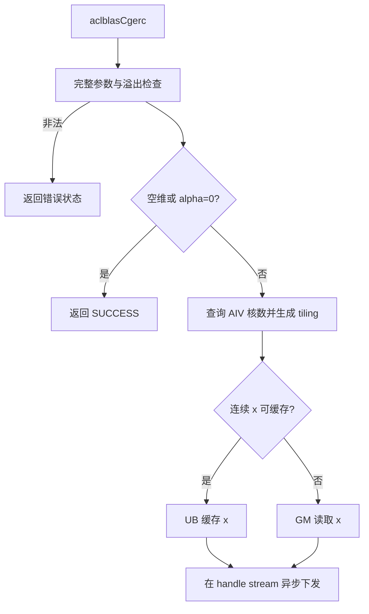
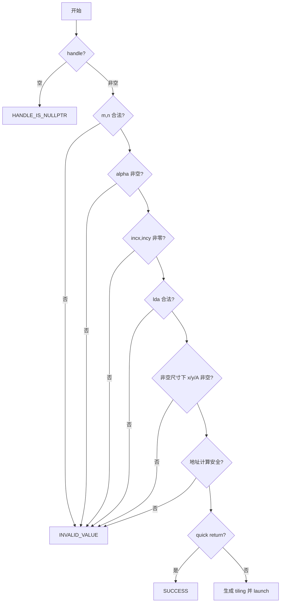

# aclblasCgerc 算子设计文档

> 本文档描述设计与验证计划，不包含尚未执行的编译、精度、性能或实机测试结论。

# 需求背景（required）

## 需求来源

本需求来源于“8月社区任务-aclblasCgerc算子开发（950）”。目标是在 Ascend 950PR、CANN 9.1.0 环境中，基于 `ops-blas` Kernel 直调框架，使用 Ascend C 实现单精度复数共轭秩 1 更新算子。

| 项目 | 要求 |
| --- | --- |
| 目标硬件 | Ascend 950PR |
| 数据类型 | `aclblasComplex`（Complex64） |
| 工程模式 | 句柄式 BLAS API，使用 handle 绑定的 stream 直调 Kernel |
| 实现目录 | `blas/gerc/arch35/` |
| 对标接口 | cuBLAS `cublasCgerc`，语义参考 Netlib `cgerc` |

## 背景介绍

`aclblasCgerc` 对列主序复数矩阵执行原地更新：

```text
A = A + alpha * x * conjg(y^T)
A(i,j) = A(i,j) + alpha * x(i) * conjg(y(j))
```

其中 `x` 含 `m` 个逻辑元素，`y` 含 `n` 个逻辑元素，`A` 的逻辑形状为 `m×n`。`gerc` 与 `geru` 的关键差异是前者对 `y` 取共轭。

仓库已有公共接口声明、`gerc/arch22` 实现以及 `ger/arch35`、`geam/arch35` 工程参考。本任务新增 `arch35` 实现，不新增 950PR 私有接口，不改变现有产品路径。

# 需求分析（required）

## 需求描述

实现与任务书接口和数学语义一致的 `aclblasCgerc`，支持：

1. Complex64 复数乘加和对 `y` 的共轭；
2. Column-Major 矩阵及 `lda` padding；
3. `incx/incy` 任意非零整数，包括负步长；
4. `m=0`、`n=0` 或 `alpha=(0,0)` 的合法 quick return；
5. 参数校验、handle stream 异步执行及 A 原地更新；
6. 任务书规定的精度与性能验收。

## 需求拆解

| 子需求 | 设计要点 |
| --- | --- |
| 接口兼容 | 复用 `include/cann_ops_blas.h` 中已有函数声明 |
| 数学正确 | 明确 `alpha*x*conjg(y)` 的实虚部符号 |
| 布局正确 | 使用 `A[row + col*lda]`，不改写 padding |
| 步长正确 | 64 位计算正负步长的逻辑首地址和元素下标 |
| 边界正确 | 所有规定参数校验完成后才执行 quick return |
| 并行安全 | 每个 A 元素只有一个线程写，不使用 atomic |
| 异步语义 | 在 handle stream 上下发，不在 API 内隐式同步 |
| 可验证性 | 覆盖步长、padding、非法输入、特殊值和性能 case |

# 详细设计（required）

## 算子分析

### 数学公式

设：

```text
alpha = ar + i*ai
x(i)  = xr + i*xi
y(j)  = yr + i*yi
```

先计算列复数标量 `p = alpha * conjg(y(j))`：

```text
pr = ar*yr + ai*yi
pi = ai*yr - ar*yi
```

再计算并更新：

```text
deltaReal = xr*pr - xi*pi
deltaImag = xr*pi + xi*pr
Areal(i,j) += deltaReal
Aimag(i,j) += deltaImag
```

该符号与不取共轭的 `geru` 不同，测试中使用纯虚数和实虚混合数据专项检查。

### 算子原型

```cpp
aclblasStatus_t aclblasCgerc(
    aclblasHandle_t handle, int m, int n,
    const aclblasComplex* alpha,
    const aclblasComplex* x, int incx,
    const aclblasComplex* y, int incy,
    aclblasComplex* A, int lda);
```

`alpha` 位于 Host，`x/y/A` 位于 Device；A 为输入输出参数。成功返回 `ACLBLAS_STATUS_SUCCESS`，空 handle 返回 `ACLBLAS_STATUS_HANDLE_IS_NULLPTR`，其他规定的非法参数返回 `ACLBLAS_STATUS_INVALID_VALUE`。

### 数据类型与内存布局

`aclblasComplex` 的实部、虚部均为 FP32。GM 中按 `{real, imag}` 交错存储：

```text
[real0, imag0, real1, imag1, ...]
```

矩阵 A 为列主序：

```text
aComplexIndex = uint64_t(col) * lda + row
aRealIndex    = 2 * aComplexIndex
aImagIndex    = 2 * aComplexIndex + 1
```

Kernel 仅访问 `0<=row<m`、`0<=col<n`，每列 `[m,lda)` 的 padding 保持不变。

### 参数约束

| 参数 | 约束与行为 |
| --- | --- |
| `handle` | 必须非空 |
| `m/n` | 必须 `>=0`；任一为 0 时可 quick return |
| `alpha` | 必须非空；两分量均为 0 时可 quick return |
| `x/y/A` | 当 `m>0 && n>0` 时必须非空 |
| `incx/incy` | 必须非零，支持正负值 |
| `lda` | 必须 `>=max(1,m)` |

逻辑向量的最小物理元素数分别为：

```text
x: m==0 ? 0 : 1 + (m-1)*abs(incx)
y: n==0 ? 0 : 1 + (n-1)*abs(incy)
```

### 负步长寻址

负步长遵循 Netlib 语义，从物理数组的末端开始逻辑遍历。Host 计算：

```text
absIncx = incx >= 0 ? int64_t(incx) : -int64_t(incx)
absIncy = incy >= 0 ? int64_t(incy) : -int64_t(incy)
xStart = (m==0 || incx>=0) ? 0 : uint64_t(m-1) * absIncx
yStart = (n==0 || incy>=0) ? 0 : uint64_t(n-1) * absIncy
xIndex(i) = int64_t(xStart) + int64_t(i)*int64_t(incx)
yIndex(j) = int64_t(yStart) + int64_t(j)*int64_t(incy)
```

先提升到 64 位再取负，避免 `INT_MIN` 的 32 位绝对值溢出。Host 对物理跨度、矩阵末地址、复数到 FP32/字节下标的乘法执行 checked arithmetic；不可安全表示时返回非法参数。

### Quick return 与特殊值

固定顺序为：检查 handle、维度、alpha、步长、lda、非空尺寸下的 x/y/A、地址可表示性，最后判断 quick return。这样即使尺寸为 0 或 alpha 为 0，其他非法参数仍按任务书返回错误。

合法 quick return 不下发 Kernel，不读取 x/y 数据。对于正常计算，按 Netlib 行为在原始 `y(j)==(0,0)` 时跳过该列更新，避免 `0*Inf` 引入额外 NaN；其他 Inf/NaN 按 FP32 运算自然传播。

## 算子实现

### 总体方案

采用“Host 校验和 tiling + Ascend 950PR SIMT AIV Kernel”方案。矩阵按列分配给 block，block 内线程按列主序遍历；连续且可容纳时缓存 x，否则直接从 GM 读取。



计划文件结构：

```text
blas/gerc/arch35/cgerc_tiling_data.h
blas/gerc/arch35/cgerc_host.cpp
blas/gerc/arch35/cgerc_kernel.cpp
test/gerc/cgerc/arch35/
```

### Host 侧设计

#### 参数校验

Host 不在检查前解引用 handle 或 alpha。建议校验流程：



#### 分核与 tiling

使用 `GetAivCoreCount()` 获取平台 AIV 核数，失败返回 `ACLBLAS_STATUS_EXECUTION_FAILED`。列块数不超过 `min(n,aivCoreNum)`，每个 block 获得连续列区间：

```text
colsPerBlock = ceil(n / numBlocks)
colStart = blockIdx * colsPerBlock
colEnd = min(n, colStart + colsPerBlock)
```

建议 tiling 字段如下：

```cpp
struct CgercTilingData {
    uint32_t m, n, lda;
    uint32_t numThreads, colsPerBlock;
    float alphaReal, alphaImag;
    int64_t incx, incy;
    uint64_t xStart, yStart;
    uint32_t useUbX;
};
```

当 `incx==1` 且完整 x 的 `2*m*sizeof(float)` 在预留 UB 容量内时选择 UB-x 路径。其他情况走 GM 路径。阈值由 `arch35` 公共硬件常量和实际 Kernel 临时空间计算，不硬编码设备总 UB 容量。

Host 不申请逐调用 Device workspace，不进行元数据 H2D 拷贝，不调用 `aclrtSynchronizeStream`。Tiling 按仓内 `arch35` 直调形式传值，Kernel 使用 handle 中的 stream。

### Kernel 侧设计

Kernel 使用 `KERNEL_TYPE_AIV_ONLY` 和 SIMT VF。每个线程负责一列或多列，各列内部顺序遍历行，因此 A 的访存连续，且不同线程/block 写入范围互斥。

```text
for col in assignedColumns(thread):
    yi = yStart + col*incy
    yr, yiVal = loadComplex(y, yi)
    if yr==0 && yiVal==0:
        continue
    pr = ar*yr + ai*yiVal
    pi = ai*yr - ar*yiVal
    for row in [0,m):
        xi = xStart + row*incx
        xr, xiVal = loadComplex(x or xUb, xi)
        aIdx = row + col*lda
        A.real[aIdx] += xr*pr - xiVal*pi
        A.imag[aIdx] += xr*pi + xiVal*pr
```

UB-x 路径由 block 内线程合作搬入 x，随后执行一次核内同步，再由所有线程只读共享；GM 路径不需要同步。两条路径共用 y 共轭、A 下标和复数更新公式。

| 依赖 | 处理方式 |
| --- | --- |
| UB 搬入后跨线程读取 | 一次 `asc_syncthreads()` |
| thread 间 A 写冲突 | 每列只归属一个 thread |
| block 间 A 写冲突 | 连续列区间互斥 |
| Kernel 与后续调用 | 由同一 stream 保序 |

不使用 atomic、跨核同步或 GM workspace。

### 性能优化方案

1. A 按 Column-Major 连续读写，减少离散访存；
2. 将 `alpha*conjg(y(j))` 提到行循环外，每列只计算一次；
3. 常见 `incx=1` 路径将 x 缓存在 UB，供同一 block 的多列复用；
4. 多 block 并行处理连续列，不使用 atomic；
5. Host 热路径不分配 workspace、不拷贝 tiling buffer、不隐式同步；
6. 根据列数、AIV 核数和线程上限动态选择 block/thread 数；
7. 对零 y 列直接跳过 A 的读写。

任务书性能门槛如下，均需 warmup 后有效采样超过 50 次取平均：

| m | n | incx | incy | alpha | Avg time 上限 |
| --- | --- | --- | --- | --- | --- |
| 512 | 512 | 1 | 1 | `(1,0)` | 8.68 us |
| 1024 | 1024 | 1 | 1 | `(1,0)` | 12.85 us |
| 2048 | 2048 | 1 | 1 | `(1,0)` | 44.63 us |

### 正确性与安全性

| 风险 | 防护 |
| --- | --- |
| gerc/geru 符号混淆 | 公式集中实现，纯虚数专项用例 |
| 负步长首地址错误 | Host 计算 xStart/yStart，64 位有符号步进 |
| 索引或字节地址溢出 | Host checked multiply/add，Kernel 使用 64 位下标 |
| lda padding 被改写 | row 始终小于 m，padding 使用 sentinel 检查 |
| quick return 仍访问数据 | 在 launch 前返回，不下发 Kernel |
| 零 y 与 Inf 产生额外 NaN | 按原始 y 是否为零跳过整列 |
| 并发覆盖 A | 列区间互斥，不使用 atomic |
| UB 越界 | Host 按实际预留容量选择 UB/GM 分支 |

## 支持硬件

| 支持的芯片版本 | 是否支持 | 说明 |
| --- | --- | --- |
| Ascend 950PR | √ | 本任务目标，使用 `arch35` 路径 |
| 其他产品 | 不新增承诺 | 保持仓库已有实现和支持状态 |

## 算子约束限制

1. 仅支持 `aclblasComplex`/Complex64，不进行类型提升；
2. A 必须是 Column-Major，且 `lda>=max(1,m)`；
3. x/y 仅支持 BLAS inc 表达的一维非零步长，不支持广播；
4. A 原地更新，调用方需提供满足物理跨度的 Device 内存；
5. 调用方应避免 A 与 x/y 发生未定义内存重叠；
6. API 异步执行，读取结果前由调用方同步相应 stream；
7. 本算子不要求 bit-exact，按任务书 FP32 分量容差验收。

# 可维可测分析

## 精度标准/性能标准

| 验收项 | 标准 | 来源 |
| --- | --- | --- |
| Golden | cblas/Netlib `cgerc`，实部、虚部分别比较 | 任务书 |
| rtol | `2^-10`，约 `9.77e-4` | 任务书 |
| atol | `2^-16`，约 `1.53e-5` | 任务书 |
| matched ratio | `>=0.99` | 任务书 |
| max abs error | `<=1e-2` 或 `<=32 ULP` | 任务书 |
| 性能 | 8.68/12.85/44.63 us 三个 case 分别达标 | 任务书 |

测试状态当前均为“待开发阶段实测”。功能验证计划如下：

| 类别 | 覆盖内容 | 检查点 |
| --- | --- | --- |
| 基础 shape | 1×1、质数、2 的幂及相邻值、非方阵 | 全矩阵实虚部正确 |
| 步长 | `±1/±2/±3` 正交组合 | 首地址和反向遍历正确 |
| lda | 紧凑和多种 padding | 逻辑区正确、padding 不变 |
| quick return | m/n 为 0、alpha 为 0 | 成功且无 Kernel/data read |
| 复数语义 | 纯实、纯虚、实虚混合 | 共轭符号正确 |
| 特殊值 | 零、Inf、NaN、极值 | 与 Netlib 分支及传播一致 |
| 非法参数 | 空指针、负维度、零步长、非法 lda | 状态码正确且不非法解引用 |
| 溢出边界 | 大维度与大步长组合 | Host 拒绝不可表示地址 |
| 异步 | 非默认 stream 的前后依赖 | 无 API 内同步，stream 保序 |
| Kernel 分支 | UB-x 与 GM 两条路径 | 输出一致、UB 无越界 |

性能测试固定 Ascend 950PR、CANN 9.1.0 环境，输入及 Device 内存只创建一次。使用 ACL event 或测试框架在同一 stream 计时，warmup 后采样超过 50 次；Profiler 复核 Kernel 数量、耗时、核间负载，并确认无意外 memcpy、atomic 和 synchronize。

## 兼容性分析

1. 公共 API、参数顺序和 `aclblasComplex` ABI 不变；
2. 新实现仅增加 `arch35` 路径，不修改 `arch22` 源码和行为；
3. 保持 handle stream 的异步调用模型；
4. 不引入全局状态或跨调用 workspace。

## 可维护性分析

- Host 参数检查、tiling 与 Kernel 分文件组织；
- Host/Device 共用固定宽度的 tiling 定义；
- UB/GM 分支共用复数公式和列主序地址计算；
- 性能参数使用命名常量，并通过完整回归后再调整；
- 测试代码和 CSV 位于独立的 `test/gerc/cgerc/arch35/` 目录，便于复现。
