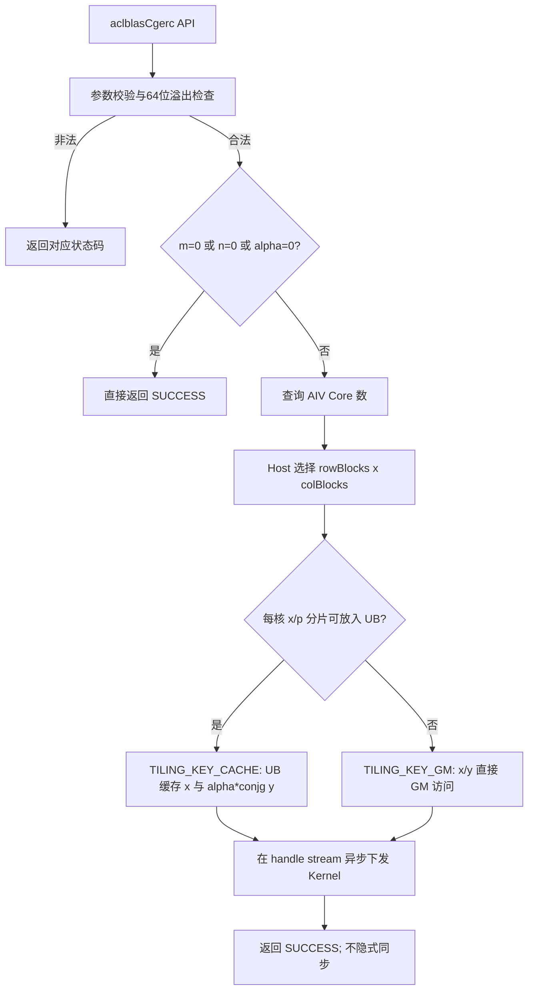
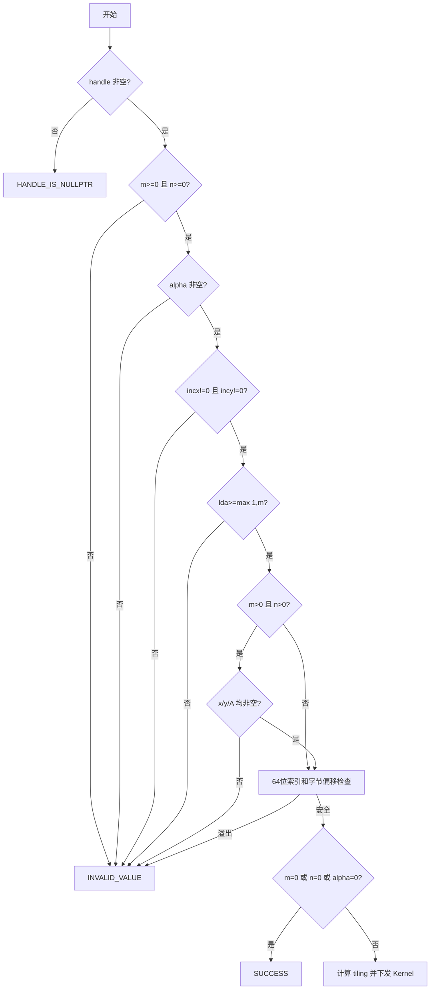
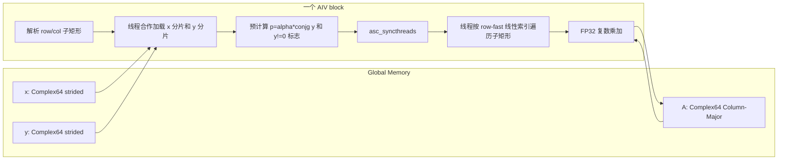

# aclblasCgerc 算子设计文档

> 本文档只描述设计与后续验证方案，不包含未执行的精度、性能或实机实验结果。

# 需求背景（required）

## 需求来源

本需求来源于“8月社区任务-aclblasCgerc算子开发（950）”。任务要求在 Ascend 950PR 上基于 `cann/ops-blas` 的 Kernel 直调框架，使用 Ascend C 实现单精度复数共轭秩 1 更新，并在后续开发、测试完成后合入 `blas/gerc/arch35/`。

目标软件、硬件基线以任务书为准：

| 项目 | 要求 |
| --- | --- |
| 目标硬件 | Ascend 950PR |
| CANN 版本 | CANN 9.1.0 |
| 开发语言 | Ascend C / C++ |
| 工程模式 | `ops-blas` 句柄式 BLAS API + handle stream + Kernel 直调 |
| 对标接口 | cuBLAS `cublasCgerc`，语义参考 Netlib BLAS `cgerc` |

## 背景介绍

### 算子功能

`aclblasCgerc` 对列主序复数矩阵执行原地共轭秩 1 更新：

```text
A = A + alpha * x * conjg(y^T)
```

其中 `x` 长度为 `m`，`y` 长度为 `n`，`A` 的逻辑形状为 `m x n`。`gerc` 与 `geru` 的唯一本质差异是 `gerc` 对 `y` 的每个复数元素取共轭。

### 现有实现分析

`ops-blas` 已存在公共声明和 `blas/gerc/arch22/` 实现，但尚无 `arch35` 实现。旧实现可用于核对复数代数，不可直接移植，原因如下：

| 项目 | `arch22` 现状 | 本任务要求 |
| --- | --- | --- |
| 产品 | A2/A3 | Ascend 950PR `arch35` |
| 参数检查 | 主要检查 `alpha` | 完整检查 handle、维度、步长、lda、指针和地址溢出 |
| 步长 | 未完整使用 `incx/incy` | 任意非零整数，包括负步长 |
| 矩阵寻址 | 旧 Kernel 不能作为列主序基线 | 严格使用 `A[row + col * lda]` |
| Host 开销 | 每次调用分配 offset/workspace/tiling，拷贝后同步 stream | 无逐调用 Device 分配，无隐式同步，保持异步语义 |
| 并行方式 | 固定核数、atomic add | 动态查询 AIV 核数，互斥分块，无原子写冲突 |

`blas/ger/arch35/` 提供了列主序 GER、负步长和 SIMT 启动模式参考；`blas/geam/arch35/` 提供了 Complex64 交错布局、实虚部拆分计算和 `arch35` Host/Kernel 组织参考。本设计在这些现有工程模式上完成 `gerc` 专用设计。

### 设计边界

本阶段只交付设计文档：

- 不新增或修改算子代码；
- 不编译、不运行模拟器或 NPU；
- 不填报精度、性能“通过”等未经实测的结论；
- 不新增 950PR 私有 API，后续实现复用 `include/cann_ops_blas.h` 中已有声明。

# 需求分析（required）

## 需求描述

在 Ascend 950PR 上实现与 `cublasCgerc`/Netlib `cgerc` 核心语义一致的 `aclblasCgerc`，支持 Complex64、列主序矩阵、`lda` padding、任意非零正负步长、合法 quick return 和 handle stream 异步执行。后续实现在全部正确性用例通过的前提下，满足任务书给出的三个性能门槛。

## 需求拆解

1. **接口兼容**：保持公共函数名、参数顺序、类型和状态码不变。
2. **数学正确**：实现 `A(i,j) += alpha * x(i) * conjg(y(j))`，不得误用 `geru` 符号。
3. **布局正确**：GM 中 Complex64 为 `{real, imag}` 交错存储，矩阵采用 Column-Major，padding 不得被覆盖。
4. **步长完整**：`incx/incy` 支持任意非零 `int`，包括负值和 `INT_MIN`；索引计算统一提升到 64 位。
5. **边界正确**：先完成任务书规定的合法性校验，再处理 `m=0`、`n=0`、`alpha=(0,0)` quick return。
6. **异步正确**：只在 handle 绑定的 stream 上下发 Kernel，API 内部不调用 stream synchronize。
7. **泛化并行**：对宽矩阵、窄矩阵和非方阵均能动态使用 AIV 核，避免仅沿列切分导致窄矩阵单核执行。
8. **性能优化**：避免 atomic、Host 侧临时分配和重复读取向量；常用连续步长路径缓存 `x` 和 `alpha*conjg(y)` 分片。
9. **可验证性**：后续测试覆盖普通值、负步长、padding、零维、非法参数、Inf/NaN、异步行为和任务书性能 case。

# 详细设计（required）

## 算子分析

### 数学公式

对 `0 <= i < m`、`0 <= j < n`：

```text
A(i,j) = A(i,j) + alpha * x(i) * conjg(y(j))
```

设：

```text
alpha = ar + i*ai
x(i)  = xr + i*xi
y(j)  = yr + i*yi
```

先按列计算并复用：

```text
p = alpha * conjg(y(j))
pr = ar*yr + ai*yi
pi = ai*yr - ar*yi
```

再更新矩阵元素：

```text
deltaReal = xr*pr - xi*pi
deltaImag = xr*pi + xi*pr

Areal(i,j) += deltaReal
Aimag(i,j) += deltaImag
```

符号核对：

| 算子 | 右向量 | `pr` | `pi` |
| --- | --- | --- | --- |
| `gerc` | `conjg(y)` | `ar*yr + ai*yi` | `ai*yr - ar*yi` |
| `geru` | `y` | `ar*yr - ai*yi` | `ar*yi + ai*yr` |

### 算子原型

公共声明已存在，后续实现不得新增平行接口：

```cpp
aclblasStatus_t aclblasCgerc(
    aclblasHandle_t handle, int m, int n, const aclblasComplex* alpha,
    const aclblasComplex* x, int incx, const aclblasComplex* y, int incy,
    aclblasComplex* A, int lda);
```

调用链如下：

```text
aclblasCreate
    -> aclblasSetStream(handle, stream)
    -> aclblasCgerc(...)
    -> 调用者在读取结果前按需同步 stream
```

`aclblasCgerc` 属于 aclBLAS 句柄式接口，不注册 ACLNN/GE，不返回 workspace 查询接口。

### 参数和返回值

| 参数 | I/O | 内存 | 类型/布局 | 约束与行为 |
| --- | --- | --- | --- | --- |
| `handle` | 输入 | Host | `aclblasHandle_t` | 必须有效；为空返回 `ACLBLAS_STATUS_HANDLE_IS_NULLPTR` |
| `m` | 输入 | Host | `int` | `m >= 0`，为 0 时可 quick return |
| `n` | 输入 | Host | `int` | `n >= 0`，为 0 时可 quick return |
| `alpha` | 输入 | Host | `aclblasComplex` 标量 | 不可为空；两分量均为 `0.0f` 时可 quick return |
| `x` | 输入 | Device | Complex64 一维向量 | 当 `m>0 && n>0` 时不可为空；逻辑长度 `m` |
| `incx` | 输入 | Host | `int` | 任意非零整数；物理跨度 `1+(m-1)*abs(incx)` |
| `y` | 输入 | Device | Complex64 一维向量 | 当 `m>0 && n>0` 时不可为空；逻辑长度 `n`；计算时取共轭 |
| `incy` | 输入 | Host | `int` | 任意非零整数；物理跨度 `1+(n-1)*abs(incy)` |
| `A` | 输入/输出 | Device | Complex64 Column-Major | 当 `m>0 && n>0` 时不可为空；只更新逻辑 `m x n` 区域 |
| `lda` | 输入 | Host | `int` | `lda >= max(1,m)` |

成功返回 `ACLBLAS_STATUS_SUCCESS`。参数不合法返回 `ACLBLAS_STATUS_INVALID_VALUE`；AIV 核数查询或 Kernel 下发失败按 `ops-blas` 公共规范映射为 execution/internal error。

### 数据类型与内存布局

`include/cann_ops_blas_common.h` 中 Complex64 定义为：

```cpp
typedef struct aclblasComplex {
    float real;
    float imag;
} aclblasComplex;
```

GM 中每个复数占两个相邻 FP32，排列为：

```text
[real0, imag0, real1, imag1, ...]
```

矩阵 `A` 的逻辑复数下标与 float 下标分别为：

```text
aComplexIndex = uint64_t(col) * lda + row
aRealIndex    = 2 * aComplexIndex
aImagIndex    = 2 * aComplexIndex + 1
```

只访问每列 `[0,m)` 行；`[m,lda)` 的 padding 保持原值。

### 支持形状

`m/n` 是运行时 Host 参数，不注册固定 shape，也不涉及 Tensor 广播：

| 对象 | 逻辑形状 | 最小物理跨度 | 说明 |
| --- | --- | --- | --- |
| `x` | `[m]` | `m==0` 时为 0，否则 `1+(m-1)*abs(incx)` 个 Complex64 | 只读，按 incx 访问 |
| `y` | `[n]` | `n==0` 时为 0，否则 `1+(n-1)*abs(incy)` 个 Complex64 | 只读，按 incy 访问并取共轭 |
| `A` | `[m,n]` | `m==0` 或 `n==0` 时不访问，否则按接口约定分配 `lda*n` 个 Complex64 | Column-Major，逻辑元素原地更新 |

空维度是合法输入；非空维度的实际可运行上限同时受 `int` 参数范围、64 位地址检查和调用方可用 Device 内存约束。

### 正负步长寻址

为匹配 Netlib 的负步长语义，Host 预计算逻辑首元素在传入数组中的偏移：

```text
absIncx = incx >= 0 ? int64_t(incx) : -int64_t(incx)
absIncy = incy >= 0 ? int64_t(incy) : -int64_t(incy)

xStart = (m == 0 || incx >= 0) ? 0 : uint64_t(m - 1) * absIncx
yStart = (n == 0 || incy >= 0) ? 0 : uint64_t(n - 1) * absIncy

xIndex(i) = int64_t(xStart) + int64_t(i) * int64_t(incx)
yIndex(j) = int64_t(yStart) + int64_t(j) * int64_t(incy)
```

先转换为 `int64_t` 再取负，因此 `incx/incy == INT_MIN` 也不会触发 32 位 `abs` 溢出。长度为 0 时不计算 `(length-1)`。Host 使用 64 位无符号乘法检查 `2*index+1` 和字节地址是否溢出；无法安全表示的规模返回 `ACLBLAS_STATUS_INVALID_VALUE`。

### Quick return 与特殊值语义

校验先于 quick return，顺序详见 Host 侧设计。关键行为如下：

| 场景 | 行为 |
| --- | --- |
| `m==0` 或 `n==0` | 参数合法时成功返回，不下发 Kernel；`x/y/A` 可为空 |
| `alpha.real==0 && alpha.imag==0` | 参数合法时成功返回，不下发 Kernel，不读取 `x/y/A` 数据 |
| `m>0 && n>0 && alpha==0` | `x/y/A` 指针仍须非空，但其数据不被读取 |
| `y(j)==(0,0)` | 按 Netlib 分支跳过该列对应元素的乘加和 A 读写，避免 `0*Inf` 产生非预期 NaN；缓存路径可合作预取 x，但不使用它参与该列计算 |
| `alpha` 或数据含 NaN/Inf | 非 quick-return 情况按 FP32 复数运算自然传播，不做饱和或清洗 |

## 算子实现

### 总体实现方案

后续实现采用“Host 完整校验与二维分核 + Ascend 950PR 纯 SIMT AIV Kernel”的方案。A 的每个逻辑元素只归属一个 block/thread，因此不需要 atomic，也不需要多核同步 workspace。



### 代码组织

开发阶段计划新增或修改以下文件；本设计文档阶段不创建这些代码文件：

```text
blas/gerc/arch35/cgerc_tiling_data.h   # Host/Device 共用 tiling 数据
blas/gerc/arch35/cgerc_host.cpp        # 参数校验、二维分核、异步 launch
blas/gerc/arch35/cgerc_kernel.cpp      # 950PR SIMT AIV Kernel
blas/gerc/README.md                    # 950PR 支持表、步长/lda/异步说明
test/gerc/cgerc/arch35/                # 后续自测代码与 CSV
```

`include/cann_ops_blas.h` 已有正确声明，不修改 ABI。构建系统只把上述实现注册到 Ascend 950/`arch35`，现有 `arch22` 文件保持隔离。

### Host 侧设计

#### 参数校验顺序

Host 固定按以下顺序检查，保证错误输入不触发非法解引用：



说明：

1. 读取 `handle->stream` 前先检查 handle。
2. 读取 `alpha->real/imag` 前先检查 alpha。
3. 即使尺寸为 0，`alpha/incx/incy/lda` 仍按任务书“校验先于 quick return”检查。
4. 即使 `alpha==0`，正尺寸下 `x/y/A` 仍须为非空合法参数；但不读取三者的数据。

#### 二维分核策略

只按列分核会在 `n` 很小时闲置大多数 AIV。Host 因此把 A 的逻辑矩形划分为 `rowBlocks x colBlocks` 个互斥子矩形：

```text
1 <= rowBlocks <= min(m, aivCoreNum)
1 <= colBlocks <= min(n, aivCoreNum)
rowBlocks * colBlocks <= aivCoreNum
```

Host 枚举合法的 `rowBlocks/colBlocks` 候选，按以下优先级选择：

1. 最大化 `rowBlocks * colBlocks`，优先占满可用 AIV；
2. 最小化 `ceil(m/rowBlocks) * ceil(n/colBlocks)`，降低最大核负载；
3. 再最小化 `ceil(m/rowBlocks) + ceil(n/colBlocks)`，减小每核向量缓存；
4. 最终平局时优先较大的 `colBlocks`，减少单核列循环长度。

每个维度采用“前 remainder 个 block 多 1 个元素”的连续切分：

```text
baseRows = m / rowBlocks, extraRows = m % rowBlocks
baseCols = n / colBlocks, extraCols = n % colBlocks
```

该方案使任意两个 block 的元素数差主要由二维余数决定；宽、窄、方形矩阵均能使用多个 AIV。

#### TilingData 规划

```cpp
enum class CgercTilingKey : uint32_t {
    CACHE_X_AND_P = 0,
    DIRECT_GM = 1,
};

struct CgercTilingData {
    uint32_t m;
    uint32_t n;
    uint32_t lda;
    uint32_t rowBlocks;
    uint32_t colBlocks;
    uint32_t tilingKey;
    float alphaReal;
    float alphaImag;
    int64_t incx;
    int64_t incy;
    uint64_t xStart;
    uint64_t yStart;
};
```

SIMT 线程数不放入 `TilingData`。Kernel 使用同一个编译期常量 `CGERC_THREADS` 作为 `LAUNCH_BOUND(CGERC_THREADS)` 与 `Dim3(CGERC_THREADS)` 的参数，满足 Ascend 950PR SIMT 约束。初始值采用仓内 `SIMT_MIN_THREAD_NUM`（当前为 128）；后续若调优改变，只在同一编译期常量处修改并重新完成全量验证。

#### UB 分支选择

每核最大分片：

```text
maxRows = ceil(m / rowBlocks)
maxCols = ceil(n / colBlocks)
```

缓存内容为：

- 当前 row 分片的 `x`，每个元素 2 个 FP32；
- 当前 col 分片的 `p=alpha*conjg(y)`，每个元素 2 个 FP32；
- 每列 `yIsNonZero` 标志，每个元素 1 个 `uint32_t`。

缓存字节数：

```text
cacheBytes = alignUp32(8*maxRows + 12*maxCols)
```

当 `cacheBytes <= 64 KiB` 时选择 `CACHE_X_AND_P`，否则选择 `DIRECT_GM`。64 KiB 是保守上限，低于 Ascend 950PR 的可用 UB，并为 DCache、编译器局部量和后续实现留出余量。该阈值只影响性能路径，不影响功能范围。

#### 异步下发与资源管理

- 使用 `GetAivCoreCount()` 动态查询 AIV 核数，查询失败返回 execution/internal error；不硬编码 950PR SKU 核数。
- `numBlocks = rowBlocks * colBlocks`，在 `handle->stream` 上下发 AIV-only Kernel。
- `TilingData` 按 `ops-blas arch35` 现有模式由值传递，不为每次调用额外申请 Device tiling buffer。
- 不申请 GM workspace，不创建 offset 表，不执行 H2D 元数据拷贝。
- 不在 API 内调用 `aclrtSynchronizeStream`；调用者在读取 A 前同步。

### Kernel 侧设计

#### 编程模型与 API 选择

Kernel 位于 `arch35`，使用纯 SIMT AIV：

| 能力 | 设计选择 | 原因 |
| --- | --- | --- |
| Kernel 入口 | `__global__ __aicore__` + `KERNEL_TYPE_AIV_ONLY` | 与 `ops-blas arch35` 一致 |
| VF | `__simt_vf__ __aicore__ LAUNCH_BOUND(CGERC_THREADS)` | 950PR SIMT 标准形式 |
| 启动 | `asc_vf_call`/`Simt::VF_CALL`，线程数为同一编译期常量 | 避免动态 `Dim3` 违规 |
| GM 访问 | `GM_ADDR` 直接转换为 `__gm__ float*` | 纯 SIMT 无需 GlobalTensor 中转 |
| 复数计算 | FP32 C++ `+/-/*` 运算符 | SIMT 标量复数公式清晰，编译器可生成对应指令 |
| 核内共享 | Cache 分支使用 `TPipe + TBuf<VECCALC>` 取得 `__ubuf__` 指针 | 线程共享 `x/p` 分片 |
| 核内同步 | 缓存合作装载后一次 `asc_syncthreads()` | 保证全部线程看到完整缓存 |
| 多核同步 | 不使用 | 各 block 写互斥 A 子矩形 |
| 原子操作 | 不使用 | 每个 A 元素只有一个写者 |

VF 参数拆成标量和 GM/UB 指针，按本设计合计 23 个 32 位槽位，不超过 CANNBot SIMT 规则的 `28 x 32bit` 上限；`CgercTilingData` 不作为结构体参数直接传入 VF。

#### Kernel 数据流



`DIRECT_GM` 分支跳过 `LOAD/PRE/SYNC`，每个元素直接按步长读取 `x/y` 并计算 `p`；A 的分核与写回方式完全相同。

#### Block 到矩形的映射

```text
rowBlock = blockIdx % rowBlocks
colBlock = blockIdx / rowBlocks
```

Kernel 根据 quotient/remainder 计算本 block 的 `[rowStart,rowEnd)` 和 `[colStart,colEnd)`。本地矩形使用 row-fast 线性编号：

```text
localRow = localIndex % rowCount
localCol = localIndex / rowCount
row = rowStart + localRow
col = colStart + localCol
```

连续 thread 首先覆盖同一列的连续行，匹配 Column-Major A 的连续地址；每个线程再以 `CGERC_THREADS` 为步长遍历当前矩形。

#### UB Buffer 规划

Cache 分支只使用一个共享 Buffer：

| 区域 | 元素 | 字节数 | 内容 |
| --- | --- | --- | --- |
| `xCache` | `2*maxRows` 个 FP32 | `8*maxRows` | 当前 row 分片的 `{real,imag}` |
| `pCache` | `2*maxCols` 个 FP32 | `8*maxCols` | 当前 col 分片的 `alpha*conjg(y)` |
| `yFlag` | `maxCols` 个 uint32 | `4*maxCols` | 原始 `y(j)` 是否不等于 `(0,0)` |

总量按 32 字节对齐且不超过 64 KiB。x/p 只读共享，装载阶段每个缓存位置只有一个 thread 写；同步后无并发写，因此不需要 UB 原子操作。Buffer 在一个 Kernel block 生命周期内复用，不做双缓冲，因为只装载一次、随后被整个矩形重复使用。

#### 核心伪代码

```cpp
template <bool USE_CACHE>
__simt_vf__ __aicore__ LAUNCH_BOUND(CGERC_THREADS)
inline void CgercSimt(
    __gm__ const float* x, __gm__ const float* y, __gm__ float* a,
    __ubuf__ uint8_t* cache, uint32_t m, uint32_t n, uint32_t lda,
    uint32_t rowBlocks, uint32_t colBlocks,
    float ar, float ai, int64_t incx, int64_t incy,
    uint64_t xStart, uint64_t yStart)
{
    // 1. 由 blockIdx 计算互斥 row/col 范围。
    Range r = ComputeRange(blockIdx, m, n, rowBlocks, colBlocks);

    // 2. Cache 分支合作装载 x，并把 y 预处理为 p=alpha*conjg(y)。
    if constexpr (USE_CACHE) {
        for (uint64_t lr = threadIdx; lr < r.rowCount; lr += CGERC_THREADS) {
            int64_t xi = int64_t(xStart) + int64_t(r.rowStart + lr) * incx;
            xCache[2*lr] = x[2*xi];
            xCache[2*lr + 1] = x[2*xi + 1];
        }
        for (uint64_t lc = threadIdx; lc < r.colCount; lc += CGERC_THREADS) {
            int64_t yi = int64_t(yStart) + int64_t(r.colStart + lc) * incy;
            float yr = y[2*yi];
            float yiVal = y[2*yi + 1];
            yFlag[lc] = (yr != 0.0f || yiVal != 0.0f);
            pCache[2*lc] = ar*yr + ai*yiVal;
            pCache[2*lc + 1] = ai*yr - ar*yiVal;
        }
        asc_syncthreads();
    }

    // 3. 每个线程独占一组 A 元素；padding 行不在 r 内。
    uint64_t tileElements = uint64_t(r.rowCount) * r.colCount;
    for (uint64_t k = threadIdx; k < tileElements; k += CGERC_THREADS) {
        uint32_t lr = k % r.rowCount;
        uint32_t lc = k / r.rowCount;

        float xr, xiVal, pr, pi;
        bool yNonZero;
        if constexpr (USE_CACHE) {
            xr = xCache[2*lr];
            xiVal = xCache[2*lr + 1];
            pr = pCache[2*lc];
            pi = pCache[2*lc + 1];
            yNonZero = yFlag[lc] != 0;
        } else {
            // 按 64 位 x/y 步长直接从 GM 读取，并计算 pr/pi。
        }

        // Netlib 对 y(j)==0 的列跳过更新，不能按 p==0 判断。
        if (!yNonZero) {
            continue;
        }

        uint64_t row = r.rowStart + lr;
        uint64_t col = r.colStart + lc;
        uint64_t aIdx = col * uint64_t(lda) + row;
        float oldR = a[2*aIdx];
        float oldI = a[2*aIdx + 1];
        a[2*aIdx] = oldR + (xr*pr - xiVal*pi);
        a[2*aIdx + 1] = oldI + (xr*pi + xiVal*pr);
    }
}
```

伪代码中的 `Range` 仅表示展开后的标量范围，不会作为 VF 结构体参数传递；自定义 VF 子函数若存在，必须使用 `__simt_callee__`。

#### 同步与数据竞争分析

| 依赖 | 是否需要同步 | 处理 |
| --- | --- | --- |
| 合作装载 UB -> 所有线程读取 UB | 是，核内 RAW | 装载完成后一次 `asc_syncthreads()` |
| 不同 thread 写 A | 否 | thread 负责的 `localIndex` 不重叠 |
| 不同 block 写 A | 否 | 二维子矩形不重叠 |
| Kernel 与调用者后续操作 | 由 stream 保序 | API 不额外同步 |

无跨核数据交换，不设置同步调度模式，不申请同步 workspace。Kernel 不使用 `SetAtomicAdd`，从根源上避免旧实现的 atomic 开销和状态恢复风险。

### 性能优化方案

#### 验收目标与带宽预算

任务书性能目标：

| m | n | incx | incy | alpha | Avg time 上限 |
| --- | --- | --- | --- | --- | --- |
| 512 | 512 | 1 | 1 | `(1,0)` | 1.39 us |
| 1024 | 1024 | 1 | 1 | `(1,0)` | 2.06 us |
| 2048 | 2048 | 1 | 1 | `(1,0)` | 7.14 us |

仅计算 A 的最少读写流量为每元素 16 字节。由门槛反推的有效 A 带宽预算如下，这只是设计预算，不是实测结果：

| shape | A 最少读写量 | 门槛对应有效带宽 |
| --- | --- | --- |
| 512 x 512 | 4 MiB | 约 3.02 TB/s |
| 1024 x 1024 | 16 MiB | 约 8.14 TB/s |
| 2048 x 2048 | 64 MiB | 约 9.40 TB/s |

因此性能设计以减少 A 之外的 GM 流量、占满 AIV、连续访问和降低 launch/Host 开销为主。

#### 具体优化

1. **二维满核切分**：按 `m/n` 比例选择 row/col block，方阵和窄矩阵都能使用多个 AIV。
2. **Column-Major 连续访问**：thread 的初始 local index 按 row-fast 排列，同一列内访问连续。
3. **向量分片缓存**：常用 case 把 x 分片和 `alpha*conjg(y)` 分片放入 UB；每个 block 的每个 x/y 元素只装载一次。
4. **列标量预计算**：把 alpha 与 y 的复数乘法从每个矩阵元素一次降低为每个 block/列一次。
5. **互斥原地写**：不使用 atomic，不需要先写临时矩阵再回加。
6. **零 y 跳过**：严格匹配 Netlib 的同时避免无效 A 读写。
7. **无 Host 热路径分配**：不申请 offset、workspace 或 Device tiling buffer，不做额外 H2D 和 stream 同步。
8. **编译器友好**：核心复数公式保持短小，使用寄存器标量和基本运算符；不在元素循环内调用高阶封装 API。
9. **大跨度退化可控**：缓存超限或特殊步长走 `DIRECT_GM`，仍保持二维分核和互斥写，功能不依赖快路径。

后续性能调优只允许调整不改变语义的参数，例如二维分核评分、UB 阈值和编译期线程常量；每次调整必须重跑全部精度、边界和性能用例。

### 正确性与安全性设计

| 风险 | 防护 |
| --- | --- |
| `gerc/geru` 符号混淆 | 文档、伪代码和专项纯虚数用例三重核对 |
| 负步长首地址错误 | Host 预计算 `xStart/yStart`，Kernel 用带符号 64 位步进 |
| `INT_MIN` 取绝对值溢出 | 先提升 `int64_t` 再取负 |
| `m*n`、`lda*n`、float 下标溢出 | Host 进行逐步 64 位 checked multiply/add |
| lda padding 被覆盖 | A 下标只使用 `row<m`，padding 加 sentinel 验证 |
| alpha=0 仍读取 Device 数据 | Host 在 launch 前 quick return |
| y=0 与 Inf 相乘产生 NaN | 依据 Netlib 按原始 y 是否为零跳过，不能按 p 是否为零跳过 |
| 多线程写冲突 | 二维矩形和 local index 一一映射，不用 atomic |
| 内部同步破坏调用链 | API 不同步 handle stream，测试验证 stream 保序 |
| UB 越界 | Host 用最大分片计算 cacheBytes，超过 64 KiB 走 GM 分支 |

## 支持硬件

| 支持的芯片版本 | 是否支持 | 说明 |
| --- | --- | --- |
| Ascend 950PR | √ | 本任务开发和验收目标，`arch35`/`dav-3510` |
| Ascend 950DT | × | 非本任务承诺范围；不得用 DT 结果代替 PR 验收 |
| Atlas A2/A3 | 现有 `arch22` 路径 | 本设计不修改其实现和支持状态 |

## 算子约束限制

1. 只支持 `aclblasComplex`/Complex64，不做 dtype promotion。
2. A 必须是 Column-Major，`lda >= max(1,m)`；不提供 Row-Major 选项。
3. x/y 只支持 BLAS inc 语义表达的一维步长，不支持额外 Tensor stride 描述符或广播。
4. A 原地更新；调用方必须保证 A 与 x/y 不发生未声明的重叠。API 无 allocation-size 元数据，无法验证指针指向的实际内存容量，调用方须按物理跨度分配。
5. `m/n/lda/incx/incy` 为 `int`，但实现内部所有乘法和地址运算使用 64 位并检查字节偏移溢出。
6. 算子为异步接口；读取结果前由调用者同步 handle stream。
7. 不要求 bit-exact；按任务书 Complex64 的 FP32 分量容差验收。
8. 不要求确定性归约；本算子没有跨线程归约，固定输入和执行路径下每个元素的运算顺序固定。

# 可维可测分析

## 精度标准/性能标准

| 验收项 | 标准 | 来源 |
| --- | --- | --- |
| Golden | cblas/Netlib `cgerc`，全矩阵实部、虚部分别比较 | 任务书 |
| rtol | `2^-10`，约 `9.77e-4` | FLOAT32 生态标准 |
| atol | `2^-16`，约 `1.53e-5` | FLOAT32 生态标准 |
| matched ratio | `>=0.99` | 任务书 |
| max abs error | `<=1e-2` 或 `<=32 ULP` | 任务书 |
| 性能 | 三个指定 case 的 Avg time 不高于 1.39/2.06/7.14 us | 任务书 |
| 采样 | warmup 后有效采样次数大于 50，取平均 | 任务书 |

本文未执行实验，所有测试项当前状态均为“待开发阶段实测”。

## 功能与边界验证计划

| 类别 | 覆盖内容 | 关键检查 |
| --- | --- | --- |
| 基础 | 1x1、小质数、2 的幂及相邻值、普通方阵 | 实虚部公式、原地更新 |
| 非方阵 | `m>>n`、`m<<n`、m/n 为 1 | 二维分核覆盖、无遗漏/重复写 |
| 步长 | `incx/incy` 正交覆盖 `+/-1,+/-2,+/-3`，含 `INT_MIN` 可安全表示场景 | 逻辑首元素、反向遍历、无 32 位溢出 |
| lda | `lda=m`、`lda>m` 多种 padding | 逻辑矩阵正确，padding sentinel 不变 |
| quick return | `m=0`、`n=0`、`alpha=(0,0)` | 返回成功、不下发 Kernel、不读取 x/y/A 数据 |
| 零值语义 | y 单列/多列为 `(0,0)`，x 含 Inf/NaN | 该列 A 保持原值，匹配 Netlib skip 分支 |
| 复数符号 | 纯实、纯虚、正负混合 alpha/x/y | gerc 共轭符号，不误实现 geru |
| 特殊值 | x/y/A/alpha 的 Inf、NaN、极大/极小 FP32 | 与单一 Golden 的传播行为一致 |
| 非法参数 | null handle/alpha/x/y/A、负 m/n、零步长、非法 lda | 精确状态码，无非法解引用 |
| 溢出 | 最大 int 附近的维度/步长组合 | Host 拒绝不可表示地址，不下发 Kernel |
| 异步 | 非默认 stream 上前置写入、调用、后置读回 | API 内无同步，stream 内依赖正确 |

quick-return 的“不读取”需使用可观察的 Device 侧保护方法验证，例如保持输入为合法非空地址但令内容包含会在误读路径暴露的问题值，并通过 Profiler/内存检查确认无 Kernel 下发；不能通过传空指针绕过正尺寸参数合法性要求。

## Kernel 分支覆盖计划

| TilingKey | 构造方式 | 观察点 |
| --- | --- | --- |
| `CACHE_X_AND_P` | 常规尺寸、连续或小跨度向量，cacheBytes 不超过阈值 | UB 地址范围、同步一次、结果正确 |
| `DIRECT_GM` | 超大单核向量分片或降低测试阈值的白盒 case | 64 位步长、GM 直读、与缓存分支结果一致 |

Host tiling 需增加白盒单元测试，枚举小范围 m/n/coreNum，验证：

1. `rowBlocks*colBlocks <= coreNum`；
2. 所有矩形完整覆盖 `[0,m)x[0,n)`；
3. 任意两个矩形不重叠；
4. remainder 分配后行列范围连续且无空洞；
5. cacheBytes 计算与 Kernel Buffer 布局一致并经过 32 字节对齐。

## 性能验证计划

1. 在 Ascend 950PR、CANN 9.1.0 配套环境构建 `arch35`。
2. 固定 CPU 频率策略、设备空闲状态、stream 和输入，记录 driver/firmware、ops-blas commit、AIV 核数。
3. 描述符、输入和输出只创建一次；warmup 后采样大于 50 次，避免把初始化和 H2D/D2H 计入 Kernel Avg time。
4. 使用 ACL event 或任务书测试框架计时，并用 Profiler 复核 Kernel 次数、Task Duration、核间负载和是否存在意外 memcpy/synchronize。
5. 分别记录三组目标 case；任何一组超门槛均判定性能未通过，不以平均 speedup 掩盖单 case 失败。
6. 若调优二维分核、线程常量或 UB 阈值，使用同一数据和统计口径做 A/B 对比，并在变更后重跑全部功能用例。

建议同时记录以下诊断指标，但不把未实测值预填为结论：

- 使用 block 数与实际 AIV 核数；
- 每核矩形元素数的最大/最小比；
- Cache/GM 分支；
- cacheBytes；
- A 读写有效带宽；
- Host API 耗时与 Kernel Task Duration；
- 是否出现 atomic、内部同步或逐调用 Device 分配。

## 兼容性分析

1. 公共 API 和 `aclblasComplex` ABI 不变，已有调用方无需修改。
2. 新实现只增加 `arch35` 产品路径；`arch22` 源码和行为保持不变。
3. 正常路径继续使用 handle 绑定 stream，符合 `ops-blas` 异步调用模型。
4. 不增加全局状态、缓存句柄或跨调用 workspace，不引入线程安全回退。
5. README 的产品支持表在代码完成后把 Ascend 950PR 更新为“支持”，但只有功能、精度、性能实测全部通过后才能提交该结论。

## 可维护性分析

- Host 参数校验、tiling 和 Kernel 分文件，避免把平台逻辑混入公共头文件。
- `TilingData` 只保存必要标量，字段使用固定宽度类型，并在 Host/Device 两侧共享同一声明。
- 复数公式集中在短小 helper/代码段，gerc 的共轭符号以注释和专项测试固定。
- 二维切分器使用纯 Host 函数，便于无 NPU 白盒测试。
- Cache 与 Direct-GM 共用矩形映射和最终复数更新公式，减少分支漂移。
- 所有性能阈值使用命名常量；线程数在一个 `constexpr` 处定义，保证 `LAUNCH_BOUND` 与 `Dim3` 一致。
