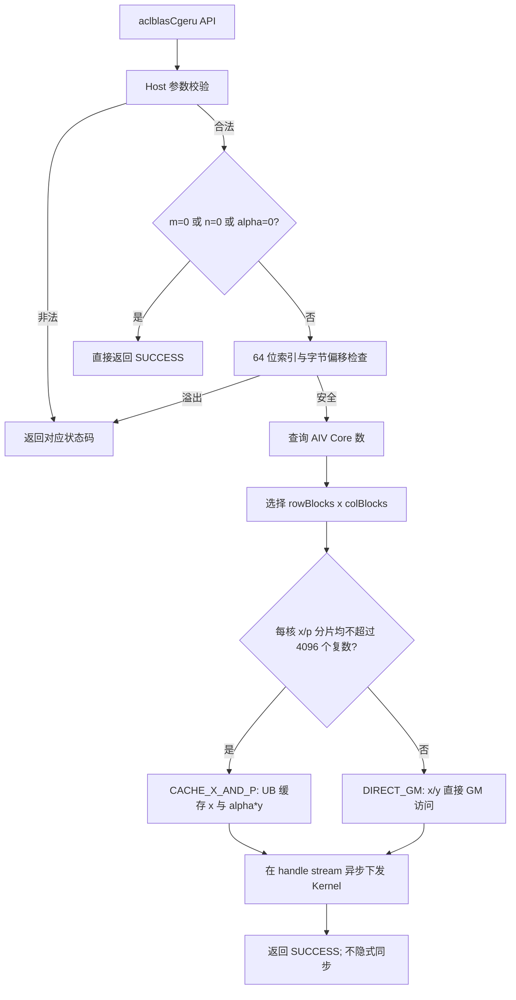
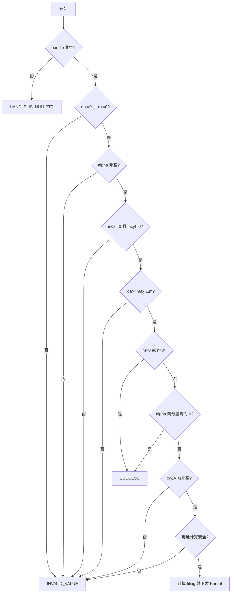
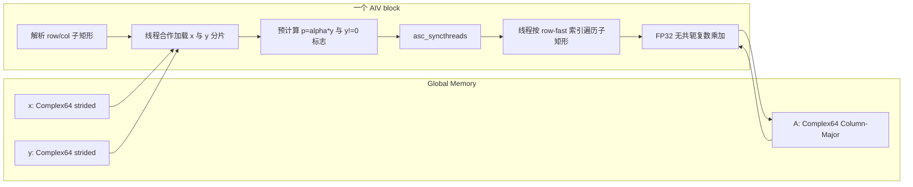
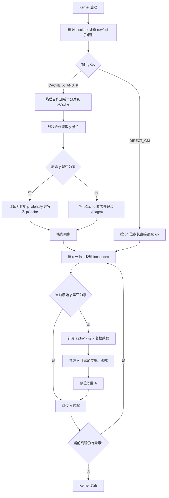

# aclblasCgeru 算子设计文档

# 需求背景（required）

## 需求来源

本需求来源于“8月社区任务-aclblasCgeru算子开发（950）”。目标是在 Ascend 950PR 上基于 `cann/ops-blas` 的 Kernel 直调框架，使用 Ascend C 实现单精度复数无共轭秩 1 更新，算子实现位于 `blas/ger/arch35/`。

目标基线以任务书为准：

| 项目 | 要求 |
| --- | --- |
| 目标硬件 | Ascend 950PR |
| CANN 版本 | CANN 9.1.0 |
| 开发语言 | Ascend C / C++ |
| 工程模式 | `ops-blas` 句柄式 BLAS API + handle stream + Kernel 直调 |
| 对标接口 | cuBLAS `cublasCgeru`，语义参考 Netlib BLAS `cgeru` |
| 数据类型 | `aclblasComplex` / Complex64 |

## 背景介绍

### 算子功能

`aclblasCgeru` 对列主序复数矩阵执行原地无共轭秩 1 更新：

```text
A = A + alpha * x * y^T
```

其中 `x` 的逻辑长度为 `m`，`y` 的逻辑长度为 `n`，`A` 的逻辑形状为 `m x n`。`geru` 中的字母 `u` 表示 unconjugated；它与 `gerc` 的唯一本质差异是 `geru` 不对 `y` 取共轭。

### 现有工程分析

当前 `ops-blas` 主仓状态与本任务差距如下：

| 项目 | 现状 | 本任务设计 |
| --- | --- | --- |
| 公共 API | `include/cann_ops_blas.h` 有 `aclblasCgerc`，无 `aclblasCgeru` | 新增公共 `aclblasCgeru` 声明，不增加 950PR 私有接口 |
| 同族实数实现 | `blas/ger/arch35/` 已有 `aclblasSger` SIMT 实现 | 复用目录组织、列主序寻址、SIMT 启动和 handle stream 模式 |
| 复数参考 | `blas/gerc/arch22/` 有 Complex64 复数公式 | 只用于核对数据布局和复数代数，不沿用其同步、临时分配和矩阵寻址 |
| 950PR 复数布局参考 | `blas/geam/arch35/` 已处理交错 Complex64 | 复用 `{real, imag}` 交错布局和 64 位矩阵下标习惯 |
| 步长支持 | `sger arch35` 已处理正负步长，但拒绝 `INT_MIN` | 本设计先提升到 64 位，再处理包括 `INT_MIN` 在内的任意非零 `int` 步长 |
| Host 热路径 | `gerc arch22` 每次分配 offset/workspace/tiling 并同步 stream | 无逐调用 Device 分配、无元数据 H2D、无 API 内隐式同步 |
| 并行冲突 | 旧复数实现使用原子累加 | 每个 A 元素只有一个 block/thread 写，不使用 atomic |

### 设计范围

本设计覆盖 `aclblasCgeru` 公共接口、Ascend 950PR `arch35` Host/Kernel 实现方案、Tiling 策略、内存规划、性能优化及验证方案。现有 `arch22` 实现和 `aclblasSger/aclblasCgerc` 接口行为保持不变。

# 需求分析（required）

## 需求描述

在 Ascend 950PR 上实现与 `cublasCgeru`/Netlib `cgeru` 核心语义一致的 `aclblasCgeru`，支持 Complex64、列主序矩阵、`lda` padding、任意非零正负步长、合法 quick return 和 handle stream 异步执行，并满足任务书规定的功能、精度和性能要求。

## 需求拆解

1. **接口新增**：在公共头文件新增 `aclblasCgeru`，函数名、参数顺序和类型与任务书一致。
2. **数学正确**：实现 `A(i,j) += alpha * x(i) * y(j)`；`y` 的虚部不得取反。
3. **布局正确**：GM 中 Complex64 为 `{real, imag}` 交错存储，A 为 Column-Major，只更新每列前 `m` 行。
4. **步长完整**：`incx/incy` 支持任意非零 `int`，包括负值和 `INT_MIN`；所有索引计算先提升到 64 位。
5. **边界正确**：非法标量参数返回指定状态码；`m=0`、`n=0`、`alpha=(0,0)` 按任务书 quick return。
6. **特殊值一致**：保留 Netlib 对原始 `y(j)==(0,0)` 的整列跳过语义，避免错误地产生 `0*Inf -> NaN`。
7. **异步正确**：只在 handle 绑定的 stream 上下发 Kernel，API 内不调用 stream synchronize。
8. **并行泛化**：对方阵、宽矩阵、窄矩阵均能利用多个 AIV，且不存在原子写冲突。
9. **性能优化**：常用尺寸缓存 x 分片和 `alpha*y` 分片，减少向量重复读取；无 Host 热路径分配。
10. **可验证性**：验证方案覆盖公式、无共轭、负步长、padding、quick return、特殊值、非法参数、异步行为和性能门槛。

# 详细设计（required）

## 算子分析

### 数学公式

对 `0 <= i < m`、`0 <= j < n`：

```text
A(i,j) = A(i,j) + alpha * x(i) * y(j)
```

设：

```text
alpha = ar + i*ai
x(i)  = xr + i*xi
y(j)  = yr + i*yi
```

先按列计算并复用：

```text
p = alpha * y(j)
pr = ar*yr - ai*yi
pi = ar*yi + ai*yr
```

再更新矩阵元素：

```text
deltaReal = xr*pr - xi*pi
deltaImag = xr*pi + xi*pr

Areal(i,j) += deltaReal
Aimag(i,j) += deltaImag
```

`geru`/`gerc` 符号核对表：

| 算子 | 右向量 | `pr` | `pi` |
| --- | --- | --- | --- |
| `geru` | `y` | `ar*yr - ai*yi` | `ar*yi + ai*yr` |
| `gerc` | `conjg(y)` | `ar*yr + ai*yi` | `ai*yr - ar*yi` |

实现和 Golden 使用 `geru` 公式。计算保持 Netlib 的结合顺序：先计算列标量 `p=alpha*y(j)`，再计算 `x(i)*p` 并加到 A；不跨元素做归约或重排。

### 算子原型

`aclblasCgeru` 在 `include/cann_ops_blas.h` 中声明，接口定义如下：

| 接口项 | 定义 |
| --- | --- |
| 接口名称 | `aclblasCgeru` |
| 返回类型 | `aclblasStatus_t` |
| 参数序列 | `aclblasHandle_t handle, int m, int n, const aclblasComplex* alpha, const aclblasComplex* x, int incx, const aclblasComplex* y, int incy, aclblasComplex* A, int lda` |
| 计算语义 | `A = alpha * x * y^T + A`，其中 y 不取共轭 |
| 调用模式 | aclBLAS 句柄式 Kernel 直调，使用 handle 绑定的 stream 异步执行 |

参数定义：

| 参数 | 参数含义 | 数据类型 | 支持数据类型 | 约束 | 形状 |
| --- | --- | --- | --- | --- | --- |
| `handle` | 输入，aclBLAS 上下文句柄，携带执行 stream | scalar | `aclblasHandle_t` | 非空有效句柄 | - |
| `m` | 输入，矩阵 A 的行数 | scalar | `int` | `m >= 0` | - |
| `n` | 输入，矩阵 A 的列数 | scalar | `int` | `n >= 0` | - |
| `alpha` | 输入，指向复数标量乘数的 Host 指针 | scalar | `const aclblasComplex*` | 非空；`(0,0)` 为合法 no-op | - |
| `x` | 输入，Device 内存中的只读复数向量 | tensor | Complex64 | 有效计算时非空；按 `incx` 访问 | 逻辑长度 `m`；物理跨度 `1+(m-1)*abs(incx)` |
| `incx` | 输入，x 的元素步长 | scalar | `int` | `incx != 0` | - |
| `y` | 输入，Device 内存中的只读复数向量，不取共轭 | tensor | Complex64 | 有效计算时非空；按 `incy` 访问 | 逻辑长度 `n`；物理跨度 `1+(n-1)*abs(incy)` |
| `incy` | 输入，y 的元素步长 | scalar | `int` | `incy != 0` | - |
| `A` | 输入/输出，Device 内存中的列主序复数矩阵，原地更新 | tensor | Complex64 | 有效计算时非空；Column-Major | `lda x n`，更新前 `m x n` 区域 |
| `lda` | 输入，A 的前导维度 | scalar | `int` | `lda >= max(1,m)` | - |

调用链：


`aclblasCgeru` 是 aclBLAS 句柄式 Kernel 直调接口，不注册 ACLNN/GE，不提供 workspace 查询接口，也不增加 `aclblasCgeru_950PR` 一类平行 API。

成功返回 `ACLBLAS_STATUS_SUCCESS`。参数不合法返回 `ACLBLAS_STATUS_INVALID_VALUE`；`GetAivCoreCount()` 返回 0 时按同目录 `sger arch35` 约定返回 `ACLBLAS_STATUS_EXECUTION_FAILED`。异步 Device 执行错误由调用者同步 stream 时按 ACL Runtime 机制观察。

### 数据类型与内存布局

`include/cann_ops_blas_common.h` 中 Complex64 由两个 FP32 分量组成：

| 类型 | 字段 | 字段类型 | 含义 |
| --- | --- | --- | --- |
| `aclblasComplex` | `real` | `float` | 实部 |
| `aclblasComplex` | `imag` | `float` | 虚部 |

GM 中每个复数占 8 字节，交错排列：

```text
[real0, imag0, real1, imag1, ...]
```

矩阵 A 的逻辑复数下标与 FP32 下标：

```text
aComplexIndex = uint64_t(col) * uint64_t(lda) + row
aRealIndex    = 2 * aComplexIndex
aImagIndex    = 2 * aComplexIndex + 1
```

只访问每列 `[0,m)` 行；`[m,lda)` 的 padding 保持原值。

### 支持形状

`m/n` 是运行时 Host 参数，不注册固定 shape，也不涉及广播：

| 对象 | 逻辑形状 | 最小物理跨度 | 说明 |
| --- | --- | --- | --- |
| `x` | `[m]` | `m==0` 时不访问，否则 `1+(m-1)*abs(incx)` 个 Complex64 | 只读，按 incx 访问 |
| `y` | `[n]` | `n==0` 时不访问，否则 `1+(n-1)*abs(incy)` 个 Complex64 | 只读，按 incy 访问且不取共轭 |
| `A` | `[m,n]` | 空维度时不访问，否则按接口约定分配 `lda*n` 个 Complex64 | Column-Major，逻辑元素原地更新 |

空维度是合法输入。非空维度的实际可运行上限同时受 `int` 参数范围、64 位字节地址检查和调用方可用 Device 内存约束。

### 正负步长寻址

为匹配 BLAS 负步长语义，Host 预计算逻辑首元素在传入数组中的偏移：

```text
incx64 = int64_t(incx)
incy64 = int64_t(incy)
absIncx = incx64 >= 0 ? incx64 : -incx64
absIncy = incy64 >= 0 ? incy64 : -incy64

xStart = (m == 0 || incx64 >= 0) ? 0 : uint64_t(m - 1) * uint64_t(absIncx)
yStart = (n == 0 || incy64 >= 0) ? 0 : uint64_t(n - 1) * uint64_t(absIncy)

xIndex(i) = int64_t(xStart) + int64_t(i) * incx64
yIndex(j) = int64_t(yStart) + int64_t(j) * incy64
```

先转换为 `int64_t` 再取负，因此 `incx/incy == INT_MIN` 不发生 32 位 `abs` 溢出。长度为 0 时不计算 `(length-1)`。Host 使用 checked multiply/add 验证物理跨度、`2*index+1` 和字节偏移均可由 `uint64_t/size_t` 安全表示；不可表示时返回 `ACLBLAS_STATUS_INVALID_VALUE`，不下发 Kernel。

### Quick return 与特殊值语义

| 场景 | 行为 |
| --- | --- |
| `m==0` 或 `n==0` | 标量参数合法时成功返回，不检查/访问 `x/y/A`，不下发 Kernel |
| `alpha.real==0 && alpha.imag==0` | 标量参数合法时成功返回，不检查/访问 `x/y/A`，不下发 Kernel，不写 A |
| `y(j)==(0,0)` | 跳过该列对应 A 元素的读写，匹配 Netlib `cgeru` 分支，避免 `0*Inf` 产生非预期 NaN |
| `alpha/x/y/A` 含 NaN/Inf | 非 quick-return、非零 y 列按 FP32 复数运算自然传播，不做饱和或清洗 |

零值判断对 `+0.0f/-0.0f` 均成立。判断是否跳过列必须基于原始 `y(j)`，不能基于 `p=alpha*y(j)`；否则在 alpha 含零、Inf 或 NaN 时可能改变参考语义。

## 算子实现

### 总体实现方案

实现采用“Host 完整校验与二维分核 + Ascend 950PR 纯 SIMT AIV Kernel”方案。A 的每个逻辑元素只归属一个 block/thread，因此无需 atomic、跨核同步或 GM workspace。



### 代码组织

工程文件规划如下：

```text
include/cann_ops_blas.h                  # 新增公共 aclblasCgeru 声明
blas/ger/arch35/cgeru_tiling_data.h     # Host/Device 共用 tiling 数据
blas/ger/arch35/cgeru_host.cpp          # 参数校验、二维分核、异步 launch
blas/ger/arch35/cgeru_kernel.cpp        # 950PR SIMT AIV Kernel
blas/ger/README.md                       # 补充 Cgeru 与 950PR 支持说明
CMake/构建源文件清单                     # 若仓库未自动收集源文件，则注册 cgeru arch35
test/ger/cgeru/arch35/                  # 测试代码与 CSV
```

新增实现与现有 `sger arch35` 共存；不重命名或修改 `aclblasSger/aclblasCgerc` ABI。

### Host 侧设计

#### 参数校验顺序

固定校验顺序避免空指针解引用，也落实任务书对 alpha 零值时 x/y/A 可不访问的要求：



具体约束：

1. 读取 `handle->stream` 前检查 handle；读取 alpha 分量前检查 alpha。
2. 空维度仍校验任务书明确要求的 alpha、步长和 lda；但不检查 x/y/A。
3. alpha 为零时不检查或访问 x/y/A，保证 no-op 可在这些指针为空时返回成功。
4. 地址检查只在实际需要访问 Device 数据时执行。

#### 二维分核策略

纯按列分核会在 `n` 很小时闲置 AIV。Host 将 A 的逻辑矩形切成互斥的 `rowBlocks x colBlocks` 子矩形。

先计算期望上限：

```text
totalElements = uint64_t(m) * uint64_t(n)
candidateBlocks = min(aivCoreNum, ceil(totalElements / 1024))
candidateBlocks = max(candidateBlocks, 1)
```

`1024` 是 SIMT 每核最小任务粒度的初始设计值，且为 warp(32) 的整数倍。Host 枚举满足以下条件的候选：

```text
1 <= rowBlocks <= min(m, candidateBlocks)
1 <= colBlocks <= min(n, candidateBlocks)
rowBlocks * colBlocks <= candidateBlocks
```

选择优先级：

1. 最大化实际 block 数，优先利用可用 AIV；
2. 最小化 `ceil(m/rowBlocks) * ceil(n/colBlocks)`，降低最大核负载；
3. 最小化缓存复制成本 `8*m*colBlocks + 12*n*rowBlocks`；
4. 平局时优先较大的 `colBlocks`，减少单核列循环长度。

其中缓存成本按 x 每元素 8 字节、`p+flag` 每列 12 字节估算。每个维度采用 quotient/remainder 连续切分，前 remainder 个 block 多处理 1 行或 1 列。这样可覆盖方阵、`m>>n`、`m<<n`，且任意两个矩形不重叠。

#### TilingData 规划

TilingKey 定义：

| TilingKey | 值 | 适用条件 | 数据访问方式 |
| --- | --- | --- | --- |
| `CACHE_X_AND_P` | 0 | 每核 x/p 分片均不超过缓存容量 | x 分片和 `alpha*y` 分片缓存至 UB |
| `DIRECT_GM` | 1 | 任一分片超过缓存容量 | x/y 按步长直接从 GM 读取 |

TilingData 字段：

| 字段 | 类型 | 含义 |
| --- | --- | --- |
| `m` | `uint32_t` | A 的逻辑行数 |
| `n` | `uint32_t` | A 的逻辑列数 |
| `lda` | `uint32_t` | A 的前导维度 |
| `rowBlocks` | `uint32_t` | 行方向 block 数 |
| `colBlocks` | `uint32_t` | 列方向 block 数 |
| `tilingKey` | `uint32_t` | Kernel 数据访问分支 |
| `alphaReal` | `float` | alpha 实部 |
| `alphaImag` | `float` | alpha 虚部 |
| `incx` | `int64_t` | 提升到 64 位的 x 步长 |
| `incy` | `int64_t` | 提升到 64 位的 y 步长 |
| `xStart` | `uint64_t` | x 逻辑首元素物理偏移 |
| `yStart` | `uint64_t` | y 逻辑首元素物理偏移 |

SIMT 线程数不放入 TilingData。`CGERU_SIMT_THREADS` 是值为 512 的编译期常量，`LAUNCH_BOUND` 和 `dim3` 必须引用同一常量。512 线程兼顾复数计算的内存延迟、64 位二维索引和寄存器压力；如需调优，只修改该编译期常量并重新执行全量验证，禁止从 TilingData 动态传入线程数。

#### UB 路径选择和预算

每核最大分片：

```text
maxRows = ceil(m / rowBlocks)
maxCols = ceil(n / colBlocks)
```

定义编译期容量 `CGERU_CACHE_COMPLEX = 4096`。当 `maxRows<=4096 && maxCols<=4096` 时选择 `CACHE_X_AND_P`：

| 静态 UB 区域 | 容量 | 字节数 | 内容 |
| --- | --- | --- | --- |
| `xCache` | `2*4096` 个 FP32 | 32 KiB | 当前 row 分片 `{real,imag}` |
| `pCache` | `2*4096` 个 FP32 | 32 KiB | 当前 col 分片 `alpha*y` |
| `yFlag` | `4096` 个 uint32 | 16 KiB | 原始 y 是否非零 |
| 合计 | - | 80 KiB | 均按 32 字节对齐 |

`ops-blas` 的 `arch35` UB 容量为 248 KiB。预留 8 KiB 并保证 SIMT DCache 不少于 32 KiB 后，可用于静态缓存的保守上限为 208 KiB；80 KiB 缓存仍留出约 128 KiB。Cache 和 Direct-GM 使用两个独立 VF，确保 GM 分支不承担该静态 UB 分配。

缓存只合作装载一次，之后被整个子矩形复用，不使用 Double Buffer。若任一分片超过容量，则选择 `DIRECT_GM`；该分支不降低功能范围，只增加向量读取流量。

#### 异步下发与资源管理

- 通过 `GetAivCoreCount()` 查询 AIV 核数；结果为 0 时返回 `ACLBLAS_STATUS_EXECUTION_FAILED`，不硬编码 SKU 核数。
- `numBlocks = rowBlocks * colBlocks`，在 `handle->stream` 上下发 AIV-only Kernel。
- `CgeruTilingData` 按现有 `ops-blas arch35` 直调模式值传递，不申请 Device tiling buffer。
- 不申请 GM workspace，不创建 offset 表，不执行元数据 H2D。
- 不在 API 内调用 `aclrtSynchronizeStream`；调用者在读取 A 前同步。

### Kernel 侧设计

#### 编程模型与 API 选择

| 能力 | 设计选择 | 说明 |
| --- | --- | --- |
| Kernel 入口 | `__global__ __aicore__` + `KERNEL_TYPE_AIV_ONLY` | 与 `ops-blas arch35` 一致 |
| VF | `__simt_vf__ __aicore__ LAUNCH_BOUND(CGERU_SIMT_THREADS)` | 线程数为编译期常量 |
| 启动 | `asc_vf_call`/`Simt::VF_CALL`，Dim3 使用同一常量 | 不使用运行时线程数 |
| GM 访问 | `GM_ADDR` 转换为 `__gm__ float*` 后直接读写 | 避免低效 `GlobalTensor::GetValue/SetValue` |
| 复数计算 | FP32 标量 `+/-/*` | 公式短小，无 dtype 转换 |
| 核内共享 | Cache VF 使用编译期定长 `__ubuf__` 数组 | x/p 只读共享 |
| 核内同步 | 合作装载后一次 `asc_syncthreads()` | 保证缓存可见 |
| 多核同步 | 不使用 | 子矩形互斥 |
| 原子操作 | 不使用 | 每个 A 元素只有一个写者 |

VF 只传递展开后的标量和 GM 指针，不直接把结构体作为 VF 参数。VF 参数数量必须满足编译器限制；自定义 VF 子函数如存在，必须标记 `__simt_callee__`。

#### Kernel 数据流



`DIRECT_GM` 分支跳过 `LOAD/PRE/SYNC`，每个元素直接按步长读取 x/y 并计算 p；矩形映射、零 y 判断和 A 更新公式与缓存分支一致。

#### Block 到矩形的映射

```text
rowBlock = blockIdx % rowBlocks
colBlock = blockIdx / rowBlocks
```

Kernel 根据 quotient/remainder 计算 `[rowStart,rowEnd)`、`[colStart,colEnd)`。子矩形使用 row-fast 线性编号：

```text
localRow = localIndex % rowCount
localCol = localIndex / rowCount
row = rowStart + localRow
col = colStart + localCol
```

同一 warp 的相邻 thread 优先访问同一列的连续行，符合 Column-Major 连续地址。每个 thread 以 `CGERU_SIMT_THREADS` 为步长遍历当前矩形。

#### Kernel 处理流程



Cache 与 Direct-GM 路径使用相同的矩形映射、零 y 判断和复数更新公式。两条路径分别实现为独立 VF，保证 Direct-GM 路径不分配缓存 UB。

#### 同步与数据竞争分析

| 依赖 | 是否需要同步 | 处理 |
| --- | --- | --- |
| 合作写 UB -> 全体线程读 UB | 是，核内 RAW | 合作装载后一次 `asc_syncthreads()` |
| 不同 thread 写 A | 否 | localIndex 按固定步长互斥 |
| 不同 block 写 A | 否 | 二维子矩形互斥 |
| Kernel 与调用者操作 | 由 stream 保序 | API 不额外同步 |

无跨核数据交换，不使用同步 workspace，不调用 `SetAtomicAdd`，因此不存在旧实现的原子状态恢复问题。

### 性能优化方案

#### 性能目标与带宽预算

任务书规定的性能目标如下：

| m | n | incx | incy | Avg time 上限 |
| --- | --- | --- | --- | --- |
| 512 | 512 | 1 | 1 | 8.61 us |
| 1024 | 1024 | 1 | 1 | 12.82 us |
| 2048 | 2048 | 1 | 1 | 44.53 us |

A 每个 Complex64 元素至少读 8 字节、写 8 字节。只计 A 的最低流量，门槛对应的设计带宽预算为：

| shape | A 最少读写量 | 门槛对应有效带宽 |
| --- | --- | --- |
| 512 x 512 | 4 MiB | 约 0.487 TB/s |
| 1024 x 1024 | 16 MiB | 约 1.309 TB/s |
| 2048 x 2048 | 64 MiB | 约 1.507 TB/s |

上述数值是由性能目标反推的带宽预算。该算子没有归约，主要瓶颈预计是 A 的读写与 GM 访存延迟。

#### 具体优化

1. **二维分核**：按 m/n 自适应拆分，窄矩阵和宽矩阵均可使用多个 AIV。
2. **Column-Major 连续访问**：row-fast 映射使相邻线程优先访问连续复数元素。
3. **x/p 分片缓存**：目标性能 case 的行列分片远小于 4096，可走 80 KiB Cache 路径；每个 block 的 x/y 元素只读取一次。
4. **列标量预计算**：`alpha*y(j)` 从每个 A 元素一次降低为每个 block/列一次。
5. **互斥原地写**：不使用 atomic，不生成临时矩阵，也不做二次回加。
6. **零 y 跳过**：匹配 Netlib 的同时避免无效 A 读写。
7. **无 Host 热路径分配**：不申请 offset、workspace 或 Device tiling buffer，不做额外 H2D 与同步。
8. **固定编译期线程数**：避免运行时 Dim3 违反 SIMT 编译约束；线程常量调整需重新编译并进行 A/B 对比。
9. **大跨度退化可控**：缓存超限走 Direct-GM，仍保持二维分核、64 位步长和互斥写。

性能参数调优仅调整不改变语义的参数，例如分核评分、缓存容量和编译期线程数；每次调整均执行完整的功能、边界、精度和性能验证。

### 正确性与安全性设计

| 风险 | 防护 |
| --- | --- |
| 把 geru 写成 gerc | 公式、Kernel 流程和纯虚数用例三重核对；所有路径不对 yi 取反 |
| 负步长首地址错误 | Host 预计算 xStart/yStart，Kernel 用带符号 64 位步进 |
| `INT_MIN` 绝对值溢出 | 先提升为 `int64_t` 再取负 |
| `m*n`、`lda*n`、FP32 下标溢出 | Host checked multiply/add，失败即 INVALID_VALUE |
| lda padding 被覆盖 | A 下标限定 `row<m`，padding 用 sentinel 验证 |
| alpha=0 仍检查/读取 Device 指针 | Host 在 x/y/A 检查前 quick return |
| y=0 与 Inf 相乘产生 NaN | 按原始 y 是否为零跳过，不按 p 是否为零判断 |
| 多线程写冲突 | 二维矩形和 localIndex 一一映射，无 atomic |
| API 内同步破坏异步链 | 不调用 stream synchronize，并通过异步行为测试验证 stream 保序 |
| UB 越界 | 分片均不超过编译期容量才进入 Cache VF；否则走 GM VF |

## 支持硬件

| 支持的芯片版本 | 是否支持 | 说明 |
| --- | --- | --- |
| Ascend 950PR | √ | 本任务的目标硬件，使用 `arch35`/`dav-3510` 实现 |
| Ascend 950DT | × | 不在本设计的硬件支持范围内 |
| Atlas A2/A3 | ×（本新增实现） | 本设计不新增 arch22 cgeru 路径，也不修改现有 gerc 实现 |

## 算子约束限制

1. 只支持 `aclblasComplex`/Complex64，不做 dtype promotion。
2. A 必须是 Column-Major，`lda >= max(1,m)`；不提供 Row-Major 选项。
3. x/y 只支持 BLAS inc 语义表达的一维步长，不支持额外 Tensor stride 描述符或广播。
4. A 原地更新；调用方须保证 A 与 x/y 不发生未声明的内存重叠。
5. API 无 allocation-size 元数据，无法验证非空指针背后的实际容量；调用方须按物理跨度正确分配 Device 内存。
6. `m/n/lda/incx/incy` 是 `int`，实现内部地址运算使用 64 位并进行溢出检查。
7. 算子为异步接口；调用者在读取 A 前同步 handle stream。
8. 不要求 bit-exact；Complex64 的实部、虚部分别采用任务书规定的 FLOAT32 精度容差。
9. 本算子没有跨线程归约；每个元素的乘法结合顺序固定，不要求额外确定性开关。

# 可维可测分析

## 精度标准/性能标准

| 指标 | 标准 |
| --- | --- |
| Golden | cblas/Netlib `cgeru`，全矩阵实部、虚部分别比较，y 不共轭 |
| rtol | `2^-10`，约 `9.77e-4` |
| atol | `2^-16`，约 `1.53e-5` |
| matched ratio | `>=0.99` |
| max abs error | `<=1e-2` 或 `<=32 ULP` |
| 性能 | 三个指定 case 的 Avg time 不高于 8.61/12.82/44.53 us |
| 采样 | warmup 后有效采样次数大于 50，取平均 |

## 功能与边界验证计划

功能与边界验证覆盖任务随附的 1200 条 CSV 用例，并按实现分支补充白盒测试。

| 类别 | 覆盖内容 | 关键检查 |
| --- | --- | --- |
| 基础 | 1x1、小质数、2 的幂及相邻值、普通方阵 | 实虚部公式、原地更新 |
| 无共轭专项 | y 为纯虚数，alpha/x 为实数或纯虚数 | yi 符号不取反，与 gerc 结果可区分 |
| 非方阵 | `m>>n`、`m<<n`、m/n 为 1 | 二维分核无遗漏、无重复写 |
| 步长 | `incx/incy` 正交覆盖 `+/-1,+/-2,+/-3`，补充 `INT_MIN` 的可表示/拒绝场景 | 逻辑首元素、反向遍历、无 32 位溢出 |
| lda | `lda=m`、`lda>m` 多种 padding | 逻辑矩阵正确，padding sentinel 不变 |
| quick return | `m=0`、`n=0`、`alpha=(0,0)`，x/y/A 可为空 | SUCCESS、无 Kernel、A 不写 |
| 零 y 语义 | y 单列/多列为 `(0,0)`，x 含 Inf/NaN | 对应 A 列保持原值，匹配 Netlib skip 分支 |
| 特殊值 | x/y/A/alpha 的 Inf、NaN、极大/极小 FP32 | 与单一 Golden 的传播行为一致 |
| 非法参数 | null handle/alpha、必要时 null x/y/A、负 m/n、零步长、非法 lda | 精确状态码，无非法解引用 |
| 溢出 | 最大 int 附近的维度/步长组合 | Host 拒绝不可表示地址，不下发 Kernel |
| 异步 | 非默认 stream 上前置写入、调用、后置读回 | API 内无同步，stream 内依赖正确 |

quick return 的“不读取/不写入”通过 Kernel 下发计数、Profiler 或内存保护手段确认；不能只依赖最终数值恰好未变化。

## Kernel 分支与 Host Tiling 白盒计划

| TilingKey | 构造方式 | 观察点 |
| --- | --- | --- |
| `CACHE_X_AND_P` | 常规尺寸以及任务书三个性能 case | UB 地址范围、一次核内同步、结果正确 |
| `DIRECT_GM` | 令单核 row 或 col 分片超过 4096，或白盒降低阈值 | 64 位步长、GM 直读、与 Cache 路径结果一致 |

Host 纯函数测试枚举小范围 m/n/coreNum，验证：

1. `rowBlocks*colBlocks <= candidateBlocks <= aivCoreNum`；
2. 所有矩形完整覆盖 `[0,m)x[0,n)`；
3. 任意两个矩形不重叠；
4. quotient/remainder 切分连续且负载差受限；
5. TilingKey 与每核最大分片、80 KiB UB 布局一致；
6. fixed thread 常量在 `LAUNCH_BOUND` 与 Dim3 两处一致。

## 性能验证计划

1. 在 Ascend 950PR、CANN 9.1.0 配套环境构建 `arch35`。
2. 固定设备、stream、输入和运行环境，记录 driver/firmware、ops-blas commit 和 AIV 核数。
3. 输入输出只准备一次；warmup 后采样大于 50 次，避免把初始化及 H2D/D2H 计入 Kernel Avg time。
4. 使用任务框架的计时口径，并用 Profiler 复核 Kernel 次数、Task Duration、核间负载和是否存在意外 memcpy/synchronize。
5. 分别记录三组目标 case；任何一组超过门槛均判定性能未通过，不用平均值掩盖单 case 失败。
6. 调整二维分核、缓存容量或线程常量时使用同一输入做 A/B 对比，并在每次变更后重跑全量功能和精度用例。

性能分析记录实际 block/AIV 数、每核矩形元素数、TilingKey、A 有效读写带宽、Host API 耗时、Kernel Task Duration，以及是否出现 atomic、同步或逐调用 Device 分配。

## 兼容性分析

1. 新增 `aclblasCgeru` 公共 ABI，不改变任何已有函数签名或 `aclblasComplex` 布局。
2. 新实现只注册到 `arch35`；现有 `sger arch22/arch35` 和 `cgerc arch22` 源码及行为保持不变。
3. 正常路径使用 handle 绑定 stream，符合 `ops-blas` 异步调用模型。
4. 不增加全局可变状态、跨调用缓存或外部 workspace，不引入新的线程安全约束。
5. README 产品支持表与本节硬件支持矩阵保持一致，仅新增 Ascend 950PR 支持项。

## 可维护性分析

- Host 参数校验、tiling 数据和 Kernel 分文件，公共头文件只增加接口声明。
- 复数公式集中在短小 helper/代码段，`geru` 的无共轭符号由注释和专项测试固定。
- 二维切分器为无设备依赖的 Host 纯函数，便于白盒验证。
- Cache 与 Direct-GM 共用矩形映射、零 y 判断和最终更新公式，减少分支漂移。
- UB 容量和线程数只有一个 `constexpr` 定义来源，避免 Host/Kernel 常量不一致。
- 所有地址计算经过同一组 checked arithmetic helper，避免不同路径各自处理溢出。
