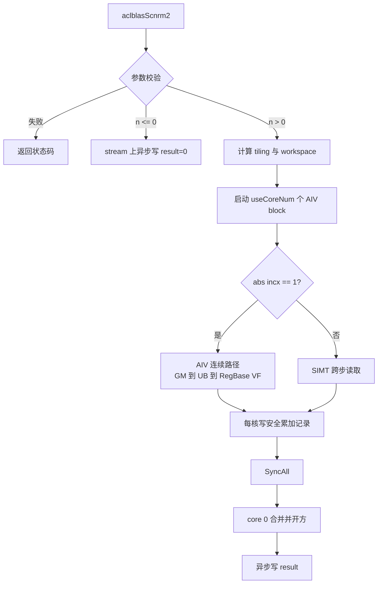
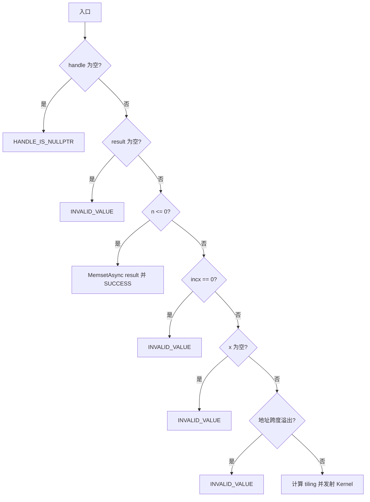

# aclblasScnrm2 算子设计文档

| 项目 | 内容 |
| --- | --- |
| 算子 | `aclblasScnrm2` |
| 任务 | 8 月社区任务 38：`aclblasScnrm2` 算子开发（950） |
| 目标硬件 | Ascend 950PR |
| CANN 版本 | 9.1.0 |
| 代码基线 | `cann/ops-blas` master，`0ea22c81b4b721f723730586c48a21c6d759da6a` |
| 文档版本 | v1.0 |

> 本文只描述本任务新增的 Ascend 950PR（`arch35`）实现。公共接口已经存在，其他产品线的既有实现与行为不在本任务中改动。

# 需求背景（required）

## 需求来源

- 社区任务书：[8 月社区任务-aclblasScnrm2 算子开发（950）](https://www.hiascend.com/activities/task-center/details/7d3f44c182ae48ffbbc5b979d43fbc20?menu=tasks)。
- 目标代码仓：[cann/ops-blas](https://gitcode.com/cann/ops-blas)。
- 随任务中心下发的《aclblasScnrm2 算子开发任务书》及配套测试材料。
- 算法语义参考：[Netlib SCNRM2](https://www.netlib.org/lapack/explore-html/d1/d2a/group__nrm2_gaee5779d5d216a7cd8cf83488fb6bb175.html) 与 cuBLAS `cublasScnrm2`。

## 背景介绍

`aclblasScnrm2` 计算单精度复数向量的欧几里得范数，属于 BLAS Level 1 归约算子。输入的每个 `aclblasComplex` 元素由两个交错存储的 FP32 分量组成，输出为一个非负 FP32 标量。

该算子看似是“平方、求和、开方”，但直接计算 `real² + imag²` 会在输入分量仍可由 FP32 表示时发生中间上溢或下溢。例如，接近 `FLT_MAX` 的有限输入在平方阶段会变为 `Inf`，极小非零输入的平方可能提前变为零。因此，本任务不仅要完成复数与步长语义，还必须采用安全缩放累加。

## 仓库现状

| 项目 | 当前状态 | 本任务处理 |
| --- | --- | --- |
| 公共 API | `include/cann_ops_blas.h` 已声明 `aclblasScnrm2` | 不新增平行接口，不修改签名 |
| 复数类型 | `aclblasComplex { float real; float imag; }` | 按两个交错 FP32 分量读取 |
| `arch22` 实现 | 将复数解释为 `2*n` 个 FP32 并复用 `Snrm2`，主要覆盖 `incx=1` | 保持不变 |
| `arch35/Snrm2` | 已有实数版本，但使用直接平方和，不能作为极值安全实现 | 仅参考工程框架 |
| `arch35/Snrm2Ex` | 已有缩放平方和、负步长和跨核归约骨架，但连续路径会从 GM 读取两遍；null handle 返回 `NOT_INITIALIZED` | 参考 Host、SIMT、workspace 与同步方式；本任务按任务书有意返回 `HANDLE_IS_NULLPTR` |
| `arch35/Scnrm2` | 尚无 Host、Kernel 和测试实现 | 本任务新增 |

## 功能价值

完成后，Ascend 950PR 可通过统一的 ops-blas 句柄式接口计算 COMPLEX64 向量 L2 范数，支持正、负步长和动态长度，并在极大值、极小值、`Inf`、`NaN` 场景下保持明确且可测试的行为。

# 需求分析（required）

## 需求描述

### 接口

公共接口保持如下，不新增 950PR 私有接口：

```cpp
aclblasStatus_t aclblasScnrm2(
    aclblasHandle_t handle,
    int n,
    const aclblasComplex* x,
    int incx,
    float* result);
```

`handle` 为 Host 侧句柄；`x` 和 `result` 均为 Device 地址；算子使用 `handle` 绑定的 stream 异步执行。

### 数学定义

令逻辑输入向量为 `x_0, x_1, ..., x_(n-1)`，其中 `x_i = a_i + b_i j`，则：

```text
result = sqrt(sum(i=0..n-1, a_i * a_i + b_i * b_i))
```

正步长时，逻辑元素 `i` 对应物理复数下标：

```text
physical(i) = i * incx
```

任务书要求支持负步长，但没有明确 `x` 的地址基准。本项目按 Netlib 数组基址语义，约定 `x` 指向物理跨度的低地址，负步长时：

```text
physical(i) = (n - 1 - i) * abs(incx)
```

范数与遍历顺序无关，因此 Kernel 可将负步长规范化为 `abs(incx)`，访问集合仍为 `{0, abs(incx), ..., (n-1)*abs(incx)}`。这一变换同时使 `incx=-1` 可以进入连续 SIMD 路径，并由正、负步长成对的地址哨兵用例固定该契约。

### 参数与返回值语义

参数校验顺序固定，避免组合非法参数时状态码不稳定：

| 顺序 | 条件 | 行为 |
| --- | --- | --- |
| 1 | `handle == nullptr` | 返回 `ACLBLAS_STATUS_HANDLE_IS_NULLPTR` |
| 2 | `result == nullptr` | 返回 `ACLBLAS_STATUS_INVALID_VALUE` |
| 3 | `n <= 0` | 在 handle stream 上将 `result` 异步置为 `+0.0f`，不启动 Kernel，返回成功 |
| 4 | `incx == 0` | 返回 `ACLBLAS_STATUS_INVALID_VALUE` |
| 5 | `x == nullptr` | 返回 `ACLBLAS_STATUS_INVALID_VALUE` |
| 6 | 地址跨度计算溢出 | 返回 `ACLBLAS_STATUS_INVALID_VALUE` |
| 7 | 运行时资源或入队失败 | 映射为对应的 alloc/internal/execution 状态 |

说明：

- `n <= 0` 是合法 quick return，优先于 `incx` 和 `x` 校验：只要 handle/result 有效，就不检查 `x` 和 `incx`，在绑定 stream 上写零并返回成功。因此 `n<=0 && incx==0` 也返回成功；`incx==0` 仅在 `n>0` 时返回非法。
- `incx` 先扩展为 INT64 再求绝对值，避免 `INT_MIN` 的有符号取反溢出；只要实际地址跨度合法，`INT_MIN` 不需要被无条件拒绝。
- Host 使用 UINT64/SIZE_MAX 安全计算 `spanComplex=(n-1)*absInc+1`，并验证 `spanComplex <= SIZE_MAX/sizeof(aclblasComplex)`；`2*n`、`2*physical+1` 等中间量也全部使用 UINT64。Host 无法获知调用者实际分配长度，缓冲区容量仍由调用者保证。
- quick return 使用 `aclrtMemsetAsync` 写入 FP32 `+0.0f` 的全零位模式，避免同步 Host-to-Device 拷贝和栈变量生命周期问题。

资源错误固定映射为：`GetAivCoreCount()==0` 返回 `ACLBLAS_STATUS_EXECUTION_FAILED`；handle workspace 不足返回 `ACLBLAS_STATUS_ALLOC_FAILED`；quick-return `aclrtMemsetAsync` 失败返回 `ACLBLAS_STATUS_INTERNAL_ERROR`。正常计算路径不执行 workspace memset。

### 特殊浮点值

特殊值行为按 Netlib Algorithm 978 的传播结果定义为：

| 输入集合 | 输出 |
| --- | --- |
| 含任意 `NaN` | `NaN`，优先级高于 `Inf` |
| 不含 `NaN`、含任意 `+Inf` 或 `-Inf` 分量 | `+Inf` |
| 全部为 `+0.0`/`-0.0` | `+0.0f` |
| 其余有限值 | 有限非负范数；真实结果超出 FP32 时允许为 `+Inf` |

实现中显式归约 `hasNaN`、`hasInf` 标志，不依赖 `ReduceMax`、比较指令或 `Inf/Inf` 的偶然传播行为。任务书没有单独规定 NaN 与 Inf 混合时的优先级，本项目明确采用 NaN 优先，并以显式 expected 测试；指定 CBLAS 版本仅用于交叉核对，不能覆盖该契约。

## 需求拆解

| 子任务 | 设计输出 | 验收重点 |
| --- | --- | --- |
| Host 接口 | 校验、quick return、tiling、workspace、异步发射 | 状态码、无 Host 同步、地址计算无溢出 |
| 连续 Kernel | `abs(incx)==1` 的 AIV RegBase VF 单遍 GM 读取；Membase 为回退 | 极值安全、尾块正确；检查 spill 与双发效果，展开因子按实测择优；最终性能达标 |
| 跨步 Kernel | `abs(incx)>1` 的 SIMT 读取和树形归约 | 正负步长结果一致，无越界 |
| 跨核归约 | 每核中间记录、全核同步、core 0 最终合并 | 所有 block 必达 barrier，特殊值传播正确 |
| 测试 | CBLAS golden、边界、极值、异常、性能 | 覆盖任务书全部有效维度 |
| 文档 | nrm2 README 产品表和 Scnrm2 约束 | API 与实现一致 |

## 验收口径

### 精度

FP32 标量输出采用任务书给定口径：

```text
abs(actual - golden) <= 2^-16 + 2^-10 * abs(golden)
```

同时执行仓库 `test/frame/verify.h` 中 FP32 mixed-tolerance 的第二项限制：

```text
abs(actual - golden) <= max(1e-2, 32 * ULP(abs(golden)))
```

两个不等式必须同时满足。新测试显式调用 `applyMixedTolerance`；附件 CSV 中的 `mere/mare` 列不代表上述阈值，不能用其替代 mixed-tolerance。标量只有通过或失败，不以批量 case 的 0.99 比例掩盖单例失败。`NaN` 要求 expected/actual 同为 `NaN`；`Inf` 要求符号一致。

### 性能

本项目确定采用配套测试 README、生成器和 `gpu_baseline.csv` 一致使用的 1M/2M/4M 尺寸。验收上限为 `GPU baseline * 0.4` 后按任务书两位小数取值：

| n | incx | GPU baseline | Ascend 950PR 平均耗时上限 |
| ---: | ---: | ---: | ---: |
| 1,048,576 | 1 | 13.081 us | 5.23 us |
| 2,097,152 | 1 | 14.365 us | 5.75 us |
| 4,194,304 | 1 | 16.820 us | 6.73 us |

任务书正文的 1M/4M/16M 尺寸序列与上述 baseline 映射不一致，本项目按尺寸填写错误处理，不作为性能验收 case。附件验证脚本当前使用 `baseline / 0.4`，实现测试时必须改为直接比较表中上限或等价的 `baseline * 0.4`。

测试需 warmup 后有效采样大于 50 次。性能验收以设备事件统计的算子 stream 执行时间为准，Host API wall time作为诊断指标另行记录；输入生成、Host/Device 数据搬运、CBLAS golden 和结果比对均不得混入设备计时。

# 详细设计（required）

## 算子分析

### 实现方案比较

| 方案 | 数值安全 | GM 读取 | 并行合并 | 结论 |
| --- | --- | ---: | --- | --- |
| 直接 `sum(v*v)` | 极大/极小值失败 | 1 遍 | 简单 | 不采用 |
| 全核最大值 + 缩放平方和 | 安全 | 连续路径 2 遍 | `(scale, ssq)` 合并 | 可作为正确性备选，但带宽开销大 |
| 三段安全缩放累加（Blue/Algorithm 978） | 安全 | 1 遍 | 三个加法桶天然可分核 | 采用 |

任务书的性能 case 是大规模连续向量，理论下限主要受 GM 读取和发射开销影响。因此设计采用一遍 GM 读取的三段安全缩放算法，而不是照搬现有 `Snrm2Ex` 的两遍 GM 方案。

### 950PR 编程机制取舍

| 机制 | 本算子结论 | 设计落点 |
| --- | --- | --- |
| FixPipe 直通 UB | 不采用 | 3510 的 FixPipe CO1/L0C→UB 通路服务于 Cube 矩阵结果的随路搬运、格式转换或量化。本算子为 AIV-only 向量归约，不执行 `Mmad`、不产生 CO1/L0C 数据；为使用 FixPipe 而引入 Cube 只会增加无关通路。 |
| GM→UB | 采用 | 连续路径由 MTE2 使用 Ext `DataCopyPad` 将每个 tile 一次搬入 UB。“FixPipe 直通 UB”不能替代该输入通路。 |
| RegBase SIMD VF | 连续路径首选 | `abs(incx)==1` 时按 `GM→UB→RegTensor` 处理；在 `__simd_vf__` 中使用 RegTensor、MaskReg 和 Reg 归约 API，使绝对值、分类、缩放、平方和局部累加尽量留在寄存器，避免 `absBuf` 和分类 mask 在 UB 反复落盘。3510 不支持 GM 直接加载到 Reg，因此仍保留一次 GM→UB。 |
| VF 指令双发 | 显式优化目标，不作为未经实测的性能承诺 | RegBase VF 主循环按两个互不依赖的 VL chunk 做 2 路展开，分别使用独立输入、临时量和三桶累加寄存器，再在循环末合并，以增加执行队列中的无依赖指令。展开因子 1/2 由编译报告、寄存器 spill 和 950PR profiling 择优；双缓冲的 MTE2↔VF 重叠与 VF 内指令双发是两种不同优化。 |
| SIMT | 跨步路径采用 | `abs(incx)>1` 时由 `__simt_vf__` + `asc_vf_call` 进行 64 位下标的 grid-stride GM 读取，每线程形成三桶与 flags，随后在 UB 原地树形归约。连续路径不退化为 SIMT，以保留合并搬运和 RegBase 吞吐。 |

首版工程顺序是：先编译验证 RegBase 的 Compare/Select、NaN/Inf 判定、Reduce 和 subnormal 配置，再以 RegBase 作为连续性能路径；若 CANN 9.1 的 Reg API 无法满足数值语义或发生不可接受的寄存器 spill，则回退到语义相同的 Membase SIMD 路径。FixPipe 不进入功能依赖图，VF 双发必须由编译产物和实机数据确认，不能只凭源码展开宣称已经实现。

### 三段安全缩放算法

对每个复数元素的实部、虚部分别取绝对值 `ax`。标准 Algorithm 978 的 IEEE FP32 常量为 `tsml=2^-63`、`tbig=2^52`、`ssml=2^75`、`sbig=2^-76`。固定 `tbig=2^52` 不能直接用于本任务的任意大 `n` 并行累加：当总分量数足够大时，medium 桶可能先溢出，而真实范数仍可由 FP32 表示。

本设计保留 `tsml`、`ssml`、`sbig`，并按本次调用的最大 FP32 分量数 `M=2*n` 动态收紧上阈值：

```text
L = ceil(log2(M))
k = min(52, floor((126 - L) / 2))
tbigEff = 2^k

tsml = 2^-63    tbigEff = 2^k, 47 <= k <= 52
ssml = 2^75     sbig    = 2^-76
```

`M < 2^32` 来自公共接口的 INT32 `n`，因此 `k` 最低为 47。`tbigEff` 是精确二进制幂，由 Host 计算指数 `k` 后随 tiling 下发。

有限分量被分入三个可加和的累加桶：

```text
ax >= tbigEff:       abig += (ax * sbig)^2
ax < tsml:  asml += (ax * ssml)^2
tsml <= ax < tbigEff: amed += ax^2
```

NaN/Inf 先由 flags 截获，不进入三个有限值桶。由于 medium 分量严格小于 `tbigEff`：

```text
AM < M * tbigEff^2 <= 2^126 < FLT_MAX
```

因此不论线程、tile 和 core 如何分组，medium 总和都不会产生“真实范数有限但中间 AM 溢出”的假 `Inf`，并给 FP32 正数归约保留至少约 4 倍的上溢余量。最小 big 分量在 `k=47` 时缩放平方为 `2^-58`，不会下溢；`AB` 若溢出，则对应真实范数早已超出 FP32，输出 `+Inf` 正确。

small 桶同样有 `AS < M*(tsml*ssml)^2 < 2^56`，不会上溢；在支持渐进下溢的 FP32 模式中，最小 subnormal 经 `ssml` 缩放后平方为 `2^-148`，仍可表示。设备 FTZ/DAZ 风险按后文专项探针处理。只要出现 big 分量，small 总贡献相对最小 big 分量也低于 FP32 可观测精度，因此最终忽略 `AS` 与参考算法一致。

`ssml`、`sbig`、`tbigEff` 均为 2 的幂，正常有限值上的缩放不引入额外十进制常量误差。每个 core 独立产生 `(abig, amed, asml, hasNaN, hasInf)`，跨线程、跨 core 对应字段直接相加或按位或即可，适合并行归约。

与串行 Netlib 中遇到 big 分量后停止累加 small 分量的优化不同，并行实现允许继续累加 `asml`；最终只要 `abig > 0` 就忽略 `asml`，与参考算法的有效结果一致。

所有 core 合并后记为 `AB`、`AM`、`AS`，最终恢复公式如下：

```text
if hasNaN:
    result = NaN
else if hasInf:
    result = +Inf
else if AB > 0:
    result = (1 / sbig) * sqrt(AB + (AM * sbig) * sbig)
else if AS > 0 and AM > 0:
    y1 = sqrt(AM)
    y2 = sqrt(AS) / ssml
    ymax = max(y1, y2)
    ymin = min(y1, y2)
    result = ymax * sqrt(1 + (ymin / ymax)^2)
else if AS > 0:
    result = sqrt(AS) / ssml
else:
    result = sqrt(AM)
```

### 支持数据类型和数据排布

| 对象 | 数据类型 | 逻辑排布 | 物理排布 |
| --- | --- | --- | --- |
| `x` | COMPLEX64 | `[n]` | `{real0, imag0, real1, imag1, ...}` |
| 中间累加 | FP32 + UINT32 flag | 每线程/每核一条记录 | UB/GM workspace |
| `result` | FP32 | scalar | Device 上 4 字节 |

连续路径将分配到该 core 的 `calNum` 个复数直接解释为 `2*calNum` 个 FP32 分量，以同一算法处理实部和虚部。跨步路径每次显式读取一个 `aclblasComplex` 的两个分量。

### 支持形状与步长

| 项目 | 支持范围 |
| --- | --- |
| 逻辑 shape | 一维 `[n]`，归约为标量 |
| `n` | 任意 INT32；`n<=0` 按 quick return 处理 |
| `incx` | 非零 INT32，支持正负；`abs(incx)==1` 连续，其余跨步 |
| 物理跨度 | `n>0` 时至少 `1+(n-1)*abs(incx)` 个复数元素 |
| broadcast / leading dimension | 不涉及 |

### 总体执行流程



## 算子实现

### Host 侧设计

#### 参数校验流程



#### Tiling 策略

本算子为 kernel 直调模式，不使用 GE 图算子的外部 TilingKey。`pathMode` 在 tiling 数据内承担等价分流作用：

| `pathMode` | 条件 | 实现 |
| ---: | --- | --- |
| 0 | `abs(incx)==1` | AIV RegBase SIMD VF 连续读取，按 `2*n` 个 FP32 分量处理；Membase 为编译/数值回退 |
| 1 | `abs(incx)>1` | SIMT 按复数物理下标读取 |

下列为首版 tiling 参数；它们不改变接口和数值语义，可在 UB 编译报告和 950PR profiling 的约束下调整：

```cpp
struct Scnrm2TilingData {
    int32_t n;
    uint64_t absInc;
    int32_t bigExponent;
    uint32_t pathMode;
    uint32_t useCoreNum;
    uint32_t batchPerCore;
    uint32_t remainder;
    uint32_t maxScalarPerTile;
    uint32_t simtThreadNum;
};
```

| 字段 | 含义 |
| --- | --- |
| `absInc` | Host 将 `incx` 扩展到 INT64 后得到的无符号绝对值；Kernel 不再对 `INT_MIN` 取反 |
| `bigExponent` | 动态上阈值指数 `k`，Kernel 使用 `tbigEff=2^k` |
| `batchPerCore` | 每个 core 的基础逻辑复数元素数，`n/useCoreNum` |
| `remainder` | 前 `remainder` 个 core 各多处理一个逻辑元素 |
| `maxScalarPerTile` | 连续路径单 tile 最大 FP32 分量数，首版取 16,384，必须按 32B/向量 repeat 对齐 |
| `simtThreadNum` | 跨步路径线程数，从 128/256/512/1024/2048 中按目标编译报告与 profiling 择优；不能只按 UB 容量取硬件上限 |

`useCoreNum` 初始按以下规则计算：

```text
targetCoreNum = ceil(n / minComplexPerCore[pathMode])
useCoreNum = min(max(targetCoreNum, 1), GetAivCoreCount(), n)
```

`minComplexPerCore` 是只影响性能、不改变语义的首版调优常量。大规模性能 case 使用全部可用 AIV core；小规模 case 减少空转 core、workspace 写入和全核同步开销。允许在 950PR profiling 后调整，但调整后必须重跑全部精度、边界和性能用例。

每个 core 的逻辑范围为：

```text
calNum64 = uint64(batchPerCore) + (blockIdx < remainder ? 1 : 0)
logicalStart64 = uint64(blockIdx) * batchPerCore + min(blockIdx, remainder)
scalarStart64 = 2ULL * logicalStart64
scalarCount64 = 2ULL * calNum64
```

所有乘 2 的分量计数和 GM 地址均先转 UINT64；只有已证明不超过 `maxScalarPerTile` 的单 tile 长度才能窄化为 UINT32。连续均分只保证复数起点 8B 对齐，因此每个非 32B 起点都必须走支持 GM 侧 1B 对齐的 Ext `DataCopyPad`，不能只处理全局首尾。

#### UB 预算

仓库 arch35 常量定义 UB 为 248 KiB。首版单 tile 取 16,384 个 FP32 分量。连续首选路径的 RegBase 计算把绝对值、分类 mask 和三桶局部累加保留在寄存器，UB 布局如下：

| 区域 | 预算 | 说明 |
| --- | ---: | --- |
| 双缓冲输入队列 | 128 KiB | `2 * 16384 * sizeof(float)` |
| VF 输入/输出记录 | 不超过 2 KiB | 每 tile 的三桶、NaN/Inf flag、尾部对齐和跨 VF/Main 交接 |
| 跨核/最终归约 scratch | 不超过 2 KiB | core 0 读取并归约固定 32B 记录 |
| 预留 | 不少于 116 KiB | pipe、事件、对齐、编译器静态 UB 与后续调优余量 |

RegBase 的寄存器不是 UB 预算的一部分，但 2 路展开会增加 RegTensor/MaskReg 压力。实现后必须检查编译报告，确认没有寄存器 spill 回 UB；若发生 spill，则先降为 1 路展开，而不是继续增大 UB tile。

Membase 回退路径沿用较保守的 248 KiB 内布局：128 KiB 双缓冲输入、64 KiB `absBuf`、不超过 8 KiB 的复用 mask、不超过 2 KiB 的 Reduce scratch，至少预留 46 KiB。dequeue 后的当前 input tensor 作为 bucket scratch，`absBuf` 保存原始绝对值；每个桶执行 `Select(inputScratch, mask, absBuf, zero)` 后再缩放、平方和归约。实现前分别编写 CANN 9.1 RegBase 与 Membase Compare/Select/mask 最小编译探针，锁定签名、组合谓词、Reg 压力和 mask 容量。实际实现后用编译报告核对 Reg/UB，并在代码中以公式注释或 static assertion 固化预算；若两种 API 均无法高效表达，则下调 `maxScalarPerTile` 或切换 tile-local `(scale,ssq)` 备选方案。

#### Workspace

每个 core 写一条 32B 对齐记录：

```cpp
struct alignas(32) Scnrm2CoreRecord {
    float abig;
    float amed;
    float asml;
    uint32_t hasNaN;
    uint32_t hasInf;
    uint32_t reserved[3];
};
```

所需 workspace 为 `useCoreNum * 32` 字节，按目标平台实际 AIV 核数计算。Host 检查该大小不超过 handle 的有效 workspace。每个已发射 block 都完整初始化并覆盖自己的记录，因此正常路径不需要额外 workspace memset，可减少一次运行时调用。

workspace 由 handle 管理，并依赖同一 stream 的顺序语义。沿用仓库约束：同一个 handle 不支持被多个 Host 线程或多个 stream 无序并发复用。

#### 发射与异步语义

- `blockDim` 必须等于 `useCoreNum`，所有 block 都执行到 `SyncAll`，不得在 barrier 前因空数据或特殊值提前返回。
- 采用单 Kernel：分核计算、写 workspace、全核同步、core 0 最终归约均在一次发射中完成，以满足微秒级性能目标。
- 计算分支内的局部 `TPipe` 必须在 `SyncAll` 前离开作用域；barrier 后由 core 0 新建 final `TPipe` 读取 workspace，沿用 `Snrm2Ex` 已验证的生命周期模式。
- 当前仓 `*_kernel_do` 发射包装返回 `void`，Host 只能检查参数和前置 ACL 资源调用，不虚构 Kernel 入队状态；异步执行错误由调用者后续同步时暴露。
- Kernel 和 quick return 都使用 `handle->stream`。

### Kernel 侧设计

#### Init

1. 读取 tiling，计算本 core 的 `logicalStart` 和 `calNum`，由 `bigExponent` 构造精确二进制阈值 `tbigEff`。
2. 设置 `xGM`、`workspaceGM`、`resultGM`。
3. 连续路径初始化双缓冲输入队列和 VF 输出记录；若选择 Membase 回退，再初始化 `absBuf`、复用 mask 与 Reduce scratch。
4. 跨步路径初始化 SIMT 线程数和 UB 中的线程局部记录区。
5. 将本 core 的三个桶和两个 flag 初始化为零。

#### CopyIn：连续路径

- 当 `abs(incx)==1` 时，当前 core 的复数段在物理上连续。
- 每个 tile 使用 `DataCopyExtParams` 的 UINT32 `blockLen` 和 Ext `DataCopyPad` 连续搬入；64 KiB tile 不能使用 UINT16 旧参数，否则长度会截断为零。
- GM 起点可能只有 8B 对齐，Ext `DataCopyPad` 覆盖该情况。若 profiling 证明有收益，可先处理 1～3 个复数的 prologue，再让 32B 对齐 body 使用普通 `DataCopy`。
- 双缓冲采用明确的 prologue/steady/epilogue：先预取 tile 0；steady 阶段预取 tile `i+1`、计算并释放 tile `i`；最后计算并释放末 tile。仅把 queue 深度设为 2 不视为已经形成重叠。
- padding 分量必须清零并被有效长度 mask 排除，不能影响 small 桶或特殊值 flag。

#### Compute：连续路径

首选实现通过 `asc_vf_call<Scnrm2RegVf>` 启动 `__simd_vf__`，向 VF 传入当前 tile 的 `__ubuf__` 输入地址、有效长度、动态阈值和输出记录地址。VF 以 256B VL（64 个 FP32）为单位，对每个 tile 执行：

1. 对有效分量取绝对值。
2. 通过 `ax != ax` 形成 NaN mask，通过 `ax > FLT_MAX` 形成 Inf mask，归约并更新本 core flag。
3. 对有限值依次生成 `ax>=tbigEff` 的 big、`ax<tsml` 的 small、`tsml<=ax<tbigEff` 的 medium mask；MaskReg 分时复用。
4. big 分量乘 `sbig`、平方，累加至 Reg 中的 `abig`。
5. small 分量乘 `ssml`、平方，累加至 Reg 中的 `asml`。
6. medium 分量平方，累加至 Reg 中的 `amed`。
7. VF 尾部对三桶执行寄存器归约，仅将三个 FP32 标量和两个 flag 写到 UB 记录；Main 合并到本 core 记录后释放 tile。

VF 主循环优先使用 2 路展开：chunk A 与 chunk B 各有独立的输入/临时/三桶累加寄存器，按 `Load A, Load B, classify A, classify B, accumulate A, accumulate B` 组织无依赖指令，再在循环尾合并 A/B 累加器。这样为硬件乱序双发提供机会，同时避免让所有迭代串在同一 `abig/amed/asml` 依赖链上。循环使用从 0 开始、步长为 1 的 UINT16 迭代变量，尾块仅更新 MaskReg，不在循环内引入运行时 `if/else`，以满足 Hardware Loop 生成条件。若编译报告出现 spill、Hardware Loop 失效或代码尺寸膨胀，则退回 1 路；不得为了追求双发破坏 mask、特殊值或尾块语义。

所有缩放常量用十六进制浮点或等价精确二进制幂表示。VF 内仅为真实内存依赖插入 `LocalMemBar`，避免冗余 barrier 抑制乱序双发；VF/Main、MTE2/VF 和 V/S/MTE3 间按 Ascend C 要求同步，Main 读取 VF 输出记录前必须确认 VF 完成。Membase 回退路径使用必要的 `PipeBarrier` 和事件。

普通随机输入几乎全部落在 medium 区间。“整 tile 有限且全为 medium”的快速路径作为首版 profiling 候选：检测成功后只执行一次平方和 Reduce；检测成本、V-to-S 同步与省去的两桶计算必须以 950PR 数据决定是否启用。

#### Compute：跨步路径

当 `abs(incx)>1` 时使用 SIMT：

```text
for (t = threadIdx.x; t < calNum; t += blockDim.x):
    logical = logicalStart + t
    physical = logical * absInc
    scalarBase = 2 * physical
    real = xFloatGM[scalarBase]
    imag = xFloatGM[scalarBase + 1]
    分别将 abs(real)、abs(imag) 更新到线程的三个桶和 flag
```

因为范数与元素顺序无关，负步长同样使用 `physical=logical*absInc` 读取相同物理元素集合，不需要访问 base 地址之前的内存。

每线程得到五字段记录后，在 block 内采用 2 的幂线程数做树形归约：每一轮将后半区记录加到前半区，flags 按位或，并在轮次间执行 `asc_syncthreads()`。禁止由 thread 0 串行扫描全部线程记录，避免线程数较大时形成热点。

2,048 线程时，三个 FP32 桶数组和两个 UINT32 flag 数组的 UB 上界约为 40 KiB，采用原地树形归约，不再复制第二套线程记录；这只证明 UB 容量，不证明该线程数可用。每线程还长期持有三桶、两个 flag 和 UINT64 地址中间量，必须对 128/256/512/1024/2048 分别检查寄存器额度、spill/stack、占用率和设备时间，首版不预设 2,048 线程必然最优或可编译。

#### CopyOut：每核中间结果

- 每个 block 的 thread 0 或 AIV 主流程将记录写到 `workspaceGM[blockIdx]`。
- 记录固定为 32B，自然满足 GM 搬运对齐。
- 即使本 core 只处理零或特殊值，也必须写完整记录并到达 `SyncAll`。

#### 最终跨核归约

`SyncAll` 后仅 core 0 执行：

1. 读取 `useCoreNum` 条记录。
2. 三个 FP32 桶分别做加法归约，两个 flags 分别做按位或。
3. 按“特殊值优先级 + Algorithm 978 恢复公式”计算最终标量。
4. 将结果写入 `resultGM[0]`。

跨核记录最多为硬件 AIV core 数，数据量很小。最终 `sqrt/div/max/mul` 不默认依赖不可用的 C 标量数学库：首版用一个 32B UB 向量 helper 和 Ascend C Vector 指令完成，并处理 S/V/MTE3 事件；NaN 和 `+Inf` 分别写规范位模式 `0x7fc00000`、`0x7f800000`。若设备编译器已提供并验证等价标量 intrinsic，才可替换。若 profiling 显示跨核阶段占比显著，再将记录合并也改为 UB Vector Reduce，接口和 workspace 布局不变。

### 预期文件变更

| 文件 | 变更 |
| --- | --- |
| `blas/nrm2/arch35/scnrm2_host.cpp` | Host 校验、tiling、workspace、发射 |
| `blas/nrm2/arch35/scnrm2_kernel.cpp` | Kernel 入口与发射包装 |
| `blas/nrm2/arch35/scnrm2_kernel.h` | RegBase AIV、Membase 回退、SIMT 与最终归约实现 |
| `blas/nrm2/arch35/scnrm2_tiling_data.h` | tiling 与常量定义 |
| `test/nrm2/scnrm2/CMakeLists.txt` | 测试目标注册 |
| `test/nrm2/scnrm2/arch35/*` | 参数、golden、wrapper、GTest、CSV |
| `blas/nrm2/README.md` | 950PR 支持表、接口和约束更新；修正现有 Scnrm2 原型与公共头文件不一致的问题 |

`include/cann_ops_blas.h` 中已有正确公共声明，预计不改动。`blas/CMakeLists.txt` 已按 arch 文件模式收集源码，优先复用现有自动注册机制，除非实现阶段验证确需调整。

## 支持硬件

| 硬件 | 支持情况 | 说明 |
| --- | --- | --- |
| Ascend 950PR | 支持 | 本任务目标，CANN 9.1.0 |
| Ascend 950DT | 本任务不声明 | 未包含在任务书验收硬件中 |
| 其他产品线 | 保持现状 | 不修改 `arch22` 等既有实现 |

## 算子约束限制

- `x` 和 `result` 必须是当前 Device 可访问地址，`result` 至少有 4 字节空间。
- `n > 0` 时，`x` 的物理复数长度至少为 `1+(n-1)*abs(incx)`。
- `x` 与 `result` 按任务书视为独立对象；实现不检查设备地址重叠，也不承诺别名行为。
- `incx==0` 非法；正、负非零步长均支持。
- 归约顺序随分核和 tiling 改变，不保证 bit-exact 或跨版本逐位确定性。
- 调用成功只表示参数合法且工作已成功入队；读取 `result` 前调用者必须同步绑定 stream。
- 本任务不新增生产依赖，不改变公共 ABI。
- 配套测试材料约定单用例 Host 侧内存不超过 4 GB；用例生成器必须在展开 stride 后检查物理分配大小。

# 可维可测分析

## 精度标准/性能标准

| 类别 | 标准 |
| --- | --- |
| 普通 FP32 标量 | `diff <= 2^-16 + 2^-10*abs(golden)`，且 `diff <= max(1e-2, 32*ULP(abs(golden)))` |
| NaN/Inf | NaN 分类一致；Inf 符号一致 |
| 性能 | 1M/2M/4M 分别不超过 5.23/5.75/6.73 us；Device Event；warmup 后有效采样 >50 |
| 确定性 | 不要求 bit-exact，所有 case 仍须逐例通过精度阈值 |

## 精度分析

### 正确性依据

- 每个复数拆成两个 FP32 分量后，计算目标与对 `2*n` 个实数分量求 2-范数完全等价。
- 三段桶内只对安全缩放后的值平方，避免有限输入在中间阶段无条件上溢或下溢。
- 三个桶均满足加法可分解性，因此按线程、core 分片后再合并与同一分组规则下的串行累加等价，仅存在允许范围内的浮点加法顺序差异。
- 动态 `tbigEff` 以全局最大分量数 `2*n` 推导，使 medium 桶总和严格低于安全界；不能退回固定 `2^52` 且使用严格大于号的实现。
- 显式特殊值 flags 避免 `Inf/Inf` 生成伪 `NaN`，也避免 NaN 被比较或 Reduce 指令静默忽略。

### Golden

- 常规精度 case 使用仓库已有 CBLAS 兼容层调用 `cblas_scnrm2`。
- 负步长按配套测试说明用 `abs(incx)` 生成 golden，因为范数与遍历方向无关；同时用专门地址用例确认最终指针基准契约。
- 极值用例同时使用 long double/分段缩放参考做诊断，防止本机 CBLAS 版本自身的直接平方和实现掩盖问题；正式验收结果仍以任务指定 CBLAS 为准。
- 特殊值 case 使用显式 expected 并与指定 CBLAS 版本交叉核对，不能盲目套用普通的 `abs(actual-golden)` 表达式。
- 在 950PR 上分别为 AIV、SIMT 做 subnormal 端到端探针，覆盖 GM load/Abs、`x*ssml`、square、ReduceSum、final Sqrt+scale-down 和 GM store。若仅内部 square FTZ，可将 `ssml` 提高到 `2^86`，使最小 scaled square 为 normal `2^-126`；若输入 DAZ 或最终 subnormal 在缩小/写回阶段 FTZ，则使用位级指数归一化与 round/pack，或已验证的 non-FTZ 指令路径，不能把输入或有限结果静默冲零。

### 精度用例矩阵

| 维度 | 覆盖 |
| --- | --- |
| 参数优先级 | null handle+其他非法项；null result+`n<=0`；`n<=0 && x==nullptr`；`n<=0 && incx==0`；`n>0 && x==nullptr && incx==0` |
| quick return | `n=0,-1,-8`；`x=nullptr`；不同非零 `incx` |
| 非法参数 | null handle 明确期望 `HANDLE_IS_NULLPTR`；null result；`n>0 && x==nullptr`；`incx=0`；地址跨度溢出 |
| 基础值 | 单元素、`3+4j`、纯实、纯虚、全零、正负交替 |
| 尺寸 | 1/2/3/7、2 的幂、2 的幂 ±1、质数、非对齐值、大规模 |
| 步长 | `±1, ±2, ±3` 及较大 stride |
| tile/core 边界 | 8,191/8,192/8,193 complex 及分核余数边界 |
| 分布 | 50% 均匀 `[-5,5]`，50% 正态分布，实虚部独立 |
| 极值 | subnormal、`FLT_MIN`、`sqrt(FLT_MIN)` 邻域、`2^-63`、动态 `tbigEff` 两侧、`2^52`、`sqrt(FLT_MAX)`、`FLT_MAX` |
| 大 n 安全回归 | `n=2^24`，real/imag 取 `nextafter(2^52,0)`；验证固定阈值反例不会得到假 `Inf` |
| 特殊值 | 单独/混合 NaN、±Inf，NaN+Inf，多处特殊值 |
| 重复调用 | 同一 handle/stream 连续调用，确认 workspace 时序无污染 |

测试框架需补充确定性正态分布生成：`mu` 位于 `[-5,5]`、`sigma` 位于 `[0.1,2]`，实部和虚部独立采样，并在用例清单中证明均匀/正态 case 各占 50%。当前附件生成器的提示文字不能替代实际生成逻辑。

`aclblasScnrm2` 接口不包含 alpha、矩阵 shape 或 leading dimension 参数，因此这些通用模板维度对本算子不适用；测试范围以任务书参数表和配套 CSV 为准。

## 性能分析

### 关键路径

大规模 `incx=1` case 的主要数据量是 `8*n` 字节输入，输出和 workspace 可忽略。设计通过以下手段压缩关键路径：

- 输入只从 GM 读取一遍；
- `incx=±1` 共用连续 SIMD 路径；
- 连续路径使用 RegBase，在 RegTensor 内完成分类和三桶累加，减少 UB 中间结果读写；
- VF 循环以两个独立 VL chunk 做 2 路展开，为无依赖指令双发创造条件；
- 单 Kernel 完成分核计算和最终归约；
- 每核固定 32B workspace 写入，不做 workspace memset；
- 双缓冲重叠 MTE2 与 VF；该重叠不等同于 VF 内指令双发；
- big/small 缩放为 2 的幂乘法，不采用全量除法；
- 跨步路径使用线程树形归约，不由单线程线性合并。

### 性能验证方法

1. 固定 Ascend 950PR、CANN 9.1.0、同一频率和运行环境。
2. 预先创建 handle/stream、分配并填充输入与输出。
3. 首版测试规定 warmup 10 次；正式采样不少于 51 次。任务书只规定有效采样大于 50，warmup 次数可按统一验收工具调整。
4. 使用 ACL event 或仓库等价设备计时机制包围重复调用并同步末事件，计算单次平均 us。
5. 不在计时区内生成 CBLAS golden、打印日志、申请内存或执行 H2D/D2H。
6. 使用编译报告/反汇编复核 VF Hardware Loop、2 路展开、寄存器 spill 和无依赖指令排布；使用 `msprof` 复核 Kernel 数量、GM→UB 流量、VF/Vector 执行与 stall、尾块和最终归约耗时。源码写成 2 路展开不等于双发已经生效，须同时比较展开因子 1/2 的设备耗时。
7. 设备事件记录算子在 stream 上的总执行时间并作为验收指标；Host 高精度时钟另记 API 入队 wall time，`msprof` 记录主 Kernel 时间，二者作为诊断数据。

### 性能回退策略

按优先级定位和优化：

1. 确认是否只有一次 GM 读取和一次 Kernel 发射。
2. 对比 RegBase VF 展开因子 1/2 的 Hardware Loop、寄存器 spill、VF 指令 stall 和设备时间；只有 2 路实测获益时才保留双发展开。
3. 调整 `maxScalarPerTile` 与 `minComplexPerCore`，消除小 tile 和空转 core。
4. 检查 RegBase mask/Select/Reduce 指令流水，减少不必要的 Store/Load 和 `LocalMemBar`；同时确认 MTE2/VF 双缓冲确实重叠。
5. 将 core 0 的跨核标量归约替换为 UB Vector Reduce。
6. 若 Algorithm 978 的通用分类仍为瓶颈，可增加“整 tile 全为 medium”的快速分支；该分支仍须使用动态 `tbigEff` 判定，并保留同一特殊值与极值结果。
7. 若 CANN 9.1 的 RegBase Compare/Select/mask 或 subnormal 配置无法正确、高效实现三桶，先回退到单遍 GM 的 Membase SIMD；若 Membase 也不满足，再切换为单次 GM 搬入、UB 内 `ReduceMax + scaled ssq` 的 tile-local 方案，用可结合 `(scale,ssq)` 公式跨 tile/core 合并。禁止退回两遍 GM 或不安全直接平方和。

## 兼容性分析

- API 签名、`aclblasComplex` ABI、handle/stream 使用方式均不变。
- 新代码仅进入 `arch35`，不改变 `arch22` 的编译产物和既有行为。
- result 仍为 Device FP32 scalar；同步责任与 ops-blas 其他句柄式接口一致。
- null handle 有意按任务书返回 `ACLBLAS_STATUS_HANDLE_IS_NULLPTR`，不照搬当前 `Snrm2/Snrm2Ex` 的 `NOT_INITIALIZED`。
- 负步长采用物理跨度低地址基准；`n<=0` quick return 优先于 `incx/x` 校验。若未来统一 BLAS 家族语义，应通过公共规范单独评审，不能在本任务中顺带改变其他算子。

## 可维护性分析

- Host 校验、tiling、Kernel 算法和测试 golden 分文件，避免一个文件同时承担接口与设备实现。
- 安全缩放常量集中定义并注明 Netlib 公式来源，禁止散落魔数。
- workspace 记录固定 32B，后续把最终归约从 Scalar 改成 Vector 时无需修改 Host ABI。
- Tiling 中明确所有计数的单位是“复数元素”还是“FP32 分量”，防止 `n` 与 `2*n` 混用。
- 新增测试须进入现有 CMake/CSV 流程，不能依赖任务附件中不可复现的独立脚本才能运行。
- 性能 baseline 必须记录设备、软件版本、采样方法、日期和原始日志；case 主键包含填充模式等完整参数，不能只用重复的 `(n,incx)` 覆盖记录。

## 交付件验收矩阵

| 交付件 | 内容 | 完成条件 |
| --- | --- | --- |
| 社区设计文档 | 按 tasklist 规则提交独立 `docs/design.md` PR | 评审通过并合入 competition 仓 |
| 算子与测试代码 | arch35 Host/Kernel、CSV/GTest、测试 README、nrm2 README | 在个人 fork 的明确分支可复现构建和测试 |
| 自测报告 | 全量 case、精度结果、三项性能 case、内存占用、截图与原始日志 | 使用任务指定模板，数据可追溯 |
| 待验收地址 | 个人仓 URL、分支、算子/测试目录 | 按任务要求邀请 `Ascend-CANN` 为开发者 |

任务书一处写“内存要求不涉及”，交付件又要求内存占用数据；本设计按更严格口径在自测报告中记录峰值 Host/Device/workspace 占用。

## 工程实现与验收门禁

| 工程项 | 影响 | 实现与关闭条件 |
| --- | --- | --- |
| 性能计时工具 | 附件脚本解析整数毫秒并包含非算子工作，不能验证 5～7 us | 改为 Device Event 验收、msprof 与 Host wall time 诊断，采样 >50 次 |
| 附件验证脚本可靠性 | accuracy/performance 脚本未可靠地把子进程非零退出、零匹配、FAILED/NO_REF 转为验收失败；性能倍率方向也与已确定口径相反 | 任何脚本异常或无 baseline 均不得判通过；验收工具需修订或替换并增加自测 |
| 950PR RegBase/VF 编译 | Reg Compare/Select/Reduce、VF Hardware Loop、2 路展开、寄存器 spill 和指令双发均需目标工具链/设备验证 | 编译 RegBase 与 Membase 最小原型；检查编译报告/反汇编并比较展开因子 1/2 的设备时间。RegBase 不满足语义或无性能收益时回退 Membase，不得把源码展开直接当成双发生效 |
| 950PR SIMT 资源 | 线程数同时影响每线程寄存器额度、spill/stack、占用率和树形归约开销；40 KiB UB 上界不能单独证明 2,048 线程可用 | 对 128/256/512/1024/2048 生成编译报告并实测，选择无 spill/stack 风险且时间最优的 `simtThreadNum` |
| 950PR subnormal 与内存 | 248 KiB UB、Reg/Membase 的 FTZ/DAZ 行为尚需目标设备验证 | 做 GM→UB→Reg、缩放/平方/归约/写回端到端探针，再锁定 tile、small 路径和 subnormal 配置；全量回归后才关闭 |
| baseline 元数据 | 附件缺少设备/软件/采样元数据，且重复 `(n,incx)` 键可能覆盖不同填充模式 | 重新采集或补齐元数据，使用完整 case id 关联 |

这些项目均由开发实现和自验阶段负责，不需要接口使用者额外验证；对应门禁关闭后才能形成最终自测报告和性能验收结论。

# 参考资料

1. [社区任务设计文档模板](https://gitcode.com/cann/cann-competitions/blob/master/04_tasks/01_community-task-2026/resources/design_template.md)
2. [2026 社区任务参与及 PR 流程](https://gitcode.com/cann/cann-competitions/blob/master/04_tasks/01_community-task-2026/README.md)
3. [cann/ops-blas](https://gitcode.com/cann/ops-blas)
4. [Netlib SCNRM2（Algorithm 978 / Blue safe scaling）](https://www.netlib.org/lapack/explore-html/d1/d2a/group__nrm2_gaee5779d5d216a7cd8cf83488fb6bb175.html)
5. [cuBLAS NRM2 API](https://docs.nvidia.com/cuda/cublas/index.html#cublas-t-nrm2)
6. [生态算子开源精度标准](https://gitcode.com/cann/opbase/blob/master/docs/zh/ops_precision_standard/experimental_standard.md)
7. [CANN 3510 架构规格](https://www.hiascend.com/document/detail/zh/CANNCommunityEdition/910beta3/programug/Ascendcopdevg/docs/guide/%E7%BC%96%E7%A8%8B%E6%8C%87%E5%8D%97/%E9%AB%98%E7%BA%A7%E7%BC%96%E7%A8%8B/%E7%A1%AC%E4%BB%B6%E5%AE%9E%E7%8E%B0/%E6%9E%B6%E6%9E%84%E8%A7%84%E6%A0%BC/NPU%E6%9E%B6%E6%9E%84%E7%89%88%E6%9C%AC3510.md)
8. [CANN Reg 矢量计算编程](https://www.hiascend.com/document/detail/zh/CANNCommunityEdition/910beta3/programug/Ascendcopdevg/docs/guide/%E7%BC%96%E7%A8%8B%E6%8C%87%E5%8D%97/%E7%BC%96%E7%A8%8B%E6%A8%A1%E5%9E%8B/AI-Core-SIMD%E7%BC%96%E7%A8%8B/%E5%9F%BA%E4%BA%8ETensor%E7%9A%84CPP%E7%BC%96%E7%A8%8B/Reg%E7%9F%A2%E9%87%8F%E8%AE%A1%E7%AE%97%E7%BC%96%E7%A8%8B.md)
9. [CANN VF 指令双发优化](https://www.hiascend.com/document/detail/zh/CANNCommunityEdition/900beta2/opdevg/Ascendcopdevg/atlas_ascendc_best_practices_10_00024.html)
10. [CANN Fixpipe（含 3510 CO1→UB 通路）](https://www.hiascend.com/document/detail/zh/CANNCommunityEdition/910beta3/API/ascendcopapi/atlasascendc_api_07_0251.html)
11. [CANN SIMD/SIMT VF 函数限定符](https://www.hiascend.com/document/detail/zh/CANNCommunityEdition/910beta3/API/ascendcopapi/atlasascendc_api_07_10840.html)
12. [CANN SIMT 核函数配置与寄存器约束](https://www.hiascend.com/document/detail/zh/CANNCommunityEdition/910beta3/API/ascendcopapi/atlasascendc_api_07_10846.html)
