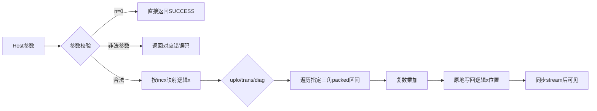
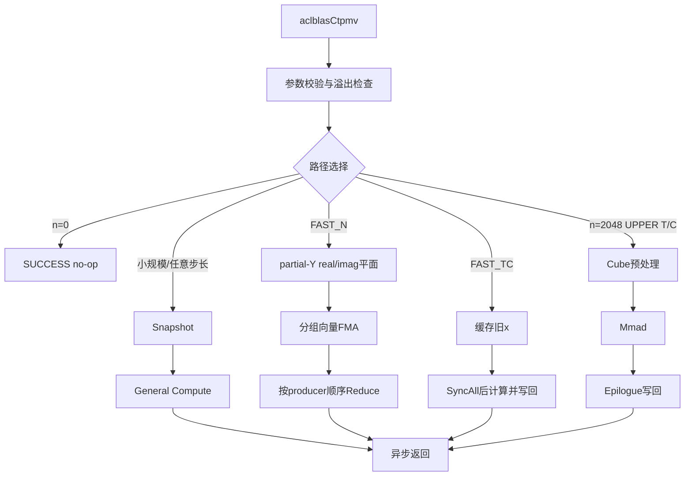

# aclblasCtpmv算子设计文档

| 项目 | 内容 |
| --- | --- |
| 社区任务 | CANN社区任务2026，08-41 aclblasCtpmv算子开发（A2/A3） |
| 目标代码仓 | `cann/ops-blas` |
| 设计文档提交仓 | `cann/cann-ops-competitions` |
| 目标硬件 | Atlas A2/A3系列产品，arch22 |
| CANN版本 | 9.1.0 |
| 文档状态 | 待提交设计文档PR |

# 一、需求背景

## 1.1 需求来源

本需求来自CANN社区任务“aclblasCtpmv算子开发（A2/A3）”。任务要求在Atlas A2/A3系列产品上，基于`cann/ops-blas`开源仓和Ascend C Kernel直调框架，实现单精度复数三角压缩存储矩阵-向量乘接口`aclblasCtpmv`。

算子语义对齐cuBLAS `cublasCtpmv`，packed布局、转置、单位对角、负步长和quick return语义参考Netlib `ctpmv`。公共API声明放入`include/cann_ops_blas.h`，A2/A3实现放入`blas/tpmv/arch22/`，测试放入`test/tpmv/ctpmv/arch22/`。

## 1.2 背景介绍

### 1.2.1 aclblasCtpmv算子实现

`aclblasCtpmv`属于BLAS Level-2算子，原地计算：

```text
x := op(A) * x
```

其中：

- `A`是`n × n`单精度复数三角矩阵；
- `AP`按列优先packed格式存储一个三角，长度为`n(n+1)/2`；
- `x`是逻辑长度为`n`的complex64向量，结果原地写回；
- `uplo`指定引用上三角或下三角；
- `trans`指定`A`、`A^T`或`A^H`；
- `diag`指定实际对角或单位对角；
- `incx`支持正、负非零步长；
- `n=0`为合法no-op。

公共接口原型：

```cpp
aclblasStatus_t aclblasCtpmv(
    aclblasHandle_t handle,
    aclblasFillMode_t uplo,
    aclblasOperation_t trans,
    aclblasDiagType_t diag,
    int n,
    const aclblasComplex* AP,
    aclblasComplex* x,
    int incx);
```

### 1.2.2 标杆算子现状分析

#### 1.2.2.1 标杆算子支持的数据类型和数据格式

本任务没有历史TBE实现，标杆为cuBLAS `cublasCtpmv`和Netlib `ctpmv`。因此不存在TBE源码路径和TBE算子信息库路径；语义参考来源如下：

| 参考对象 | 路径或链接 | 用途 |
| --- | --- | --- |
| cuBLAS | <https://docs.nvidia.com/cuda/cublas/index.html#cublas-t-tpmv> | 参数顺序、接口语义和异常行为 |
| Netlib BLAS | <https://www.netlib.org/blas/ctpmv.f> | packed布局、遍历顺序、负步长和quick return |
| 任务测试包 | `test_cases/ctpmv_test.csv`、`verify_accuracy.py`、`verify_performance.py` | 官方精度与性能验收口径 |
| ops-blas同族算子 | `blas/tpmv/arch22/`中`aclblasStpmv` | 工程结构、handle/stream和Kernel直调方式 |

标杆支持能力如下：

| 对象 | 数据类型 | 数据格式 | 约束 |
| --- | --- | --- | --- |
| AP | complex64，实部/虚部均为float32 | 列优先packed三角 | 长度`n(n+1)/2`，无`lda` |
| x | complex64 | 一维向量，支持非零步长 | 物理长度`1+(n-1)*abs(incx)` |
| n | int | Host标量 | `n >= 0` |
| incx | int | Host标量 | `incx != 0` |
| uplo/trans/diag | 枚举 | Host属性 | 仅支持任务书定义的合法枚举 |

#### 1.2.2.2 标杆算子实现描述

对逻辑输出`y(i)`，三种转置模式的计算公式为：

```text
trans=N: y(i) = sum_j A(i,j) * x(j)
trans=T: y(i) = sum_j A(j,i) * x(j)
trans=C: y(i) = sum_j conj(A(j,i)) * x(j)
```

复数乘法展开为：

```text
(a + b*i) * (c + d*i)
    = (a*c - b*d) + (a*d + b*c)*i
```

packed列优先布局采用0-based下标：

```text
UPPER，i <= j:
    columnStart(j) = j*(j+1)/2
    offset(i,j)    = i
    AP index       = i + j*(j+1)/2

LOWER，i >= j:
    columnStart(j) = j*(2*n-j+1)/2
    rowOffset(i,j) = i-j
    AP index       = j*(2*n-j+1)/2 + (i-j)
```

LOWER公式也可等价展开为`i + j*(2*n-j-1)/2`。实现和golden均按“列起点+行偏移”计算，保证列内连续、无空洞。

步长映射按Netlib语义：

```text
incx > 0: physical(i) = i * incx
incx < 0: physical(i) = (n-1-i) * abs(incx)
```

`diag=UNIT`时对角贡献固定为`1*x(i)`，实现不得读取AP中的对角槽；`diag=NON_UNIT`时读取实际对角元素。未引用三角和对参与计算的`x`空洞位置均不得读写。

#### 1.2.2.3 标杆算子实现流程图



# 二、需求分析

## 2.1 外部组件依赖

| 依赖 | 版本或来源 | 使用方式 |
| --- | --- | --- |
| CANN Toolkit | 9.1.0 | Ascend C编译、ACL Runtime、Kernel直调 |
| Atlas A2/A3驱动与固件 | 与CANN 9.1.0配套 | NPU执行 |
| CMake与构建脚本 | ops-blas仓自带 | 编译`ops_blas`与GTest目标 |
| GoogleTest | ops-blas测试框架自带 | CSV驱动功能与精度回归 |
| Netlib/cuBLAS | 语义参考，不作为运行时依赖 | golden与接口语义对齐 |

算子运行时不需要引入额外三方库。精度golden是独立实现的Netlib语义参考，不调用被测实现，也不使用CPU/PyTorch fallback作为算子执行路径。

## 2.2 内部适配模块

| 模块 | 位置 | 作用 |
| --- | --- | --- |
| 公共API | `include/cann_ops_blas.h` | 新增`aclblasCtpmv`声明，供产品线共用 |
| Host实现 | `blas/tpmv/arch22/ctpmv_host.cpp` | 参数校验、路径选择、workspace管理和Kernel提交 |
| Device实现 | `blas/tpmv/arch22/ctpmv_kernel.cpp`等 | Snapshot、General、FAST_N、FAST_TC和Cube路径 |
| Tiling结构 | `blas/tpmv/arch22/ctpmv_tiling_data.h` | 传递维数、枚举、路径、核数、区间和workspace信息 |
| 算子README | `blas/tpmv/README.md` | 接口、支持硬件、参数、约束和调用示例 |
| 测试工程 | `test/tpmv/ctpmv/` | 官方CSV、补充CSV、golden、GTest和复现说明 |
| Handle框架 | ops-blas公共handle/stream/workspace助手 | 复用stream绑定、workspace分配和状态码语义 |

## 2.3 需求模块设计

### 2.3.1 Ascend C算子原型

除任务书明确不要求的场景外，Ascend C实现与标杆算子语义对齐：

| 能力 | 对齐情况 |
| --- | --- |
| UPPER/LOWER | 完全支持 |
| N/T/C | 完全支持，C仅共轭AP元素，不共轭x |
| UNIT/NON_UNIT | 完全支持，UNIT不读AP对角 |
| complex64 | 完全支持 |
| n=0 | quick return，不访问AP/x |
| 正负incx | 完全支持，空洞不修改 |
| 异常参数 | 按任务书返回状态码 |
| 原地输出 | 完全支持 |
| 异步执行 | 通过handle stream提交，调用方读回前同步 |

### 2.3.2 Ascend C算子相关约束

与标杆相比没有任务书要求范围内的功能缺失。实现额外明确以下边界：

1. 仅支持complex64，不支持混合精度；
2. packed输入无`lda`，不支持普通二维矩阵或任意Tensor stride；
3. 步长语义仅由`incx`表达，不支持超出该语义的非连续Tensor；
4. `n`为运行时参数，不引入动态shape推导；
5. `incx=INT_MIN`时取绝对值会溢出，按非法值返回`ACLBLAS_STATUS_INVALID_VALUE`；
6. 优化路径只改变执行效率，不改变合法参数范围和数值语义。

# 三、需求详细设计

## 3.1 调用方式

本算子采用ops-blas的handle式BLAS接口和Ascend C Kernel直调方式：

1. 调用方创建`aclblasHandle_t`并使用`aclblasSetStream`绑定stream；
2. `aclblasCtpmv()`在Host侧完成参数校验、路径选择、workspace准备和Kernel提交；
3. Kernel全部提交到handle绑定的stream；
4. 接口不在Host侧隐式同步；
5. 调用方读取Device结果前执行stream同步。

该方式不依赖图模式、aclnn自动生成框架或PyTorch框架，符合任务书对ops-blas Kernel直调工程的要求。

## 3.2 需求总体设计

### 3.2.1 host侧设计

Host侧处理顺序固定，保证异常行为可预测：

1. `handle == nullptr`返回`ACLBLAS_STATUS_HANDLE_IS_NULLPTR`；
2. `uplo/trans/diag`非法返回`ACLBLAS_STATUS_INVALID_ENUM`；
3. `n < 0`、`incx == 0`或`incx == INT_MIN`返回`ACLBLAS_STATUS_INVALID_VALUE`；
4. `n == 0`返回`ACLBLAS_STATUS_SUCCESS`，不访问AP/x；
5. `n > 0`且AP或x为空返回`ACLBLAS_STATUS_INVALID_VALUE`；
6. 计算packed和x物理长度并检查无符号溢出；
7. 按路径申请或复用handle workspace；
8. 构造TilingData并提交Device Kernel。

#### 3.2.1.1 分核策略

通用路径按三角列或输出行的有效工作量做负载均衡。Host侧使用成本模型：

```text
cost(column) = activeLength(column) + 64
totalCost   = sum(cost(column))
coreCount   = min(availableAivCores, n, 48)
```

每个AIV核按累计成本获得连续任务区间，避免简单按列数均分导致大列和小列负载差距过大。小规模`n<=256`可退化为单核或少量核，优先降低调度开销。

性能关键路径采用固定分核：

| case | uplo/trans | 核数 | 说明 |
| --- | --- | ---: | --- |
| n=512 | UPPER/N | AIV 48 | compact kernel，一次提交 |
| n=1024 | LOWER/N | AIV 44 | compact kernel，一次提交 |
| n=2048 | UPPER/T | AIC 32 + AIV 48 | Cube预处理、Mmad和epilogue |
| 其他FAST_N/FAST_TC | 连续incx=1 | 最多AIV 48 | 按工作量动态分核 |

#### 3.2.1.2 数据分块和内存优化策略

基础大小计算：

```text
packedElements = n*(n+1)/2
packedBytes    = 8 * packedElements
xElements      = 1 + (n-1)*abs(incx)
xBytes         = 8 * xElements
```

通用Snapshot路径仅保存连续的旧`x`，workspace为：

```text
workspaceBytes = align32(8*n)
```

FAST_N通用路径为每个producer核维护real/imag两个partial平面：

```text
producerStride = ceil(n/64)*64
workspaceBytes = producerStride * 48 * 2 * sizeof(float)
```

compact路径只保留实际producer平面：

| case | workspace |
| --- | ---: |
| n=512 UPPER/N | 196608 B |
| n=1024 LOWER/N | 393216 B |

单核UB预算为184 KiB。AP和x搬运按32字节对齐组织，复杂向量拆分为real/imag SoA后使用向量乘加。FAST_N分组按64行对齐：

- UPPER，`n < 1024`：192行 × 18列；
- UPPER，`n >= 1024`：448行 × 8列；
- LOWER：256行 × 14列。

Cube路径将complex64展开为real/imag平面并分块为64×64 tile。设`B = n/64`、`Nc = 16`：

```text
activeTiles = B*(B+1)/2
aFloats     = align32(activeTiles * 2 * 64 * 64)
bFloats     = align32(n * Nc)
cFloats     = align32(B * 2 * 64 * Nc)
workspace   = align32(sizeof(float) * (aFloats + bFloats + cFloats))
```

所有workspace大小均使用64位无符号乘加并检查溢出，超过`size_t`范围时返回非法值。

#### 3.2.1.3 tilingKey规划策略

本任务为Kernel直调工程，不使用标准算子框架的`TilingKey`注册机制；等价路径选择通过`CtpmvTilingData::kernelMode`传递到Device侧。规划如下：

| kernelMode | 条件 | 目的 |
| --- | --- | --- |
| SMALL_N | `n <= 256`或非连续小规模 | 降低调度开销 |
| FAST_N | `incx=1`、`256 < n <= 4096`、`trans=N` | packed列贡献并行累加 |
| FAST_TC | `incx=1`、`256 < n <= 4096`、`trans=T/C` | 按输出列做点积 |
| FAST_N_FUSED | FAST_N进入融合计算 | 减少Snapshot与Reduce往返 |
| CUBE | `n=2048`、UPPER、T/C、NON_UNIT、incx=1、对齐 | 利用Cube吞吐 |
| GENERAL_SNAPSHOT/GENERAL_COMPUTE | 任意步长、非对齐或未命中优化路径 | 语义兜底 |

在FAST_N基础上，若参数精确匹配`n=512 UPPER/N/NON_UNIT/incx=1`或`n=1024 LOWER/N/NON_UNIT/incx=1`且AP/x均32字节对齐，则进入compact kernel。compact kernel首次调用通过生成wrapper完成二进制注册，后续使用`AscendLaunchKernelWithHostArgs`携带56字节Host参数提交；若直接提交失败则回退生成wrapper，保证正确性优先。

### 3.2.2 kernel侧设计

#### 3.2.2.1 kernel侧实现描述

1. **Snapshot kernel**：将正负步长x按Netlib逻辑顺序压缩到workspace连续区域，间隙由测试canary验证不被写入。
2. **General Compute kernel**：NoTrans按输出行分块，Trans按三角列分块；使用`HybridDot/ScalarDot`兜底，保证任意枚举、步长和对齐组合正确。
3. **FAST_N kernel**：每核维护partial-Y的real/imag SoA平面。AP段按32字节对齐搬运，GatherMask拆为real/imag SoA，Brcb展开x三路广播，MulAddDst完成复数FMA。producer平面按固定顺序归约，最后交织写回x。
4. **FAST_TC kernel**：计算kernel内先读取并缓存旧x，`SyncAll`后开始写回，保持原地语义，减少Snapshot往返。
5. **Cube路径**：
   - 预处理kernel将packed AP和旧x展开为real/imag矩阵平面；
   - Mmad kernel按64×64 tile执行矩阵乘；
   - epilogue kernel合并real/imag结果并写回x。
6. **同步策略**：MTE2/MTE3/V/S之间使用SetFlag/WaitFlag与PipeBarrier；partial平面写回前保证计算完成；Cube C平面Fixpipe前完成cache清理和同步。
7. **越界保护**：AP最后一列不按4 complex向上取整读取，尾块使用mask/padding，避免GM越界。

#### 3.2.2.2 Ascend C实现流程图



#### 3.2.2.3 Ascend C实现与标杆实现的差异点和原因

| 差异点 | 标杆实现 | Ascend C实现 | 原因 |
| --- | --- | --- | --- |
| 遍历顺序 | Netlib按依赖安全顺序串行更新 | 并行划分输出或列任务 | 利用多AIV/AIC并行 |
| 原地旧值 | 串行顺序天然保证依赖 | Snapshot或kernel内缓存旧x | 并行写回不能覆盖未消费输入 |
| 累加顺序 | 固定串行顺序 | 分组/分核归约顺序 | 提高吞吐；任务书允许非bit-exact，按容差判定 |
| 计算单元 | CPU/GPU标量或库内部实现 | AIV向量FMA，关键T/C路径用AIC Cube | 发挥arch22向量与Cube能力 |
| 对角处理 | 循环中跳过或乘单位值 | 地址生成和搬运阶段排除对角 | 保证UNIT模式不触发对角DMA读取 |
| 执行模型 | 同步或库内部异步 | handle stream异步提交 | 对齐ops-blas BLAS接口 |

## 3.3 支持硬件

| 硬件 | 支持情况 | 说明 |
| --- | --- | --- |
| Atlas A2训练/推理系列 | 支持 | ascend910b系列，arch22 |
| Atlas A3训练/推理系列 | 支持 | ascend910_93/910B3同类arch22路径 |
| Ascend 950PR/950DT | 不支持 | 本任务仅要求A2/A3，实现位于arch22 |

## 3.4 算子约束限制

1. `n >= 0`，`incx != 0`；
2. AP长度必须为`n(n+1)/2`，x物理长度必须为`1+(n-1)*abs(incx)`；
3. 仅支持complex64；
4. 仅支持`uplo=UPPER/LOWER`、`trans=N/T/C`、`diag=UNIT/NON_UNIT`；
5. UNIT模式不读取AP对角槽；
6. 未引用三角和x空洞位置不得读写；
7. 不支持任意非连续Tensor，仅支持`incx`表达的向量步长；
8. 调用后读取x前必须同步handle stream；
9. workspace由handle管理，调用方无需传入workspace指针。

# 四、特性交叉分析

| 交叉项 | 分析结论 |
| --- | --- |
| 枚举组合 | UPPER/LOWER × N/T/C × UNIT/NON_UNIT共12组，全部由通用路径保证 |
| 步长 | 正负步长先映射为逻辑连续x；间隙只作canary验证，不参与计算 |
| 对齐 | 优化路径要求AP/x 32字节对齐；不对齐自动回退通用路径 |
| 尺寸 | n=0、1、小尺寸、2幂、2幂±1、非对齐和大规模均有路径 |
| 特殊值 | Inf/NaN按IEEE传播，golden逐元素比对，不额外替换 |
| 原地语义 | Snapshot或kernel内缓存旧x，避免并行写覆盖未消费输入 |
| stream | 多次调用按handle stream顺序执行，可与其他同stream算子串联 |
| workspace | 按当前路径需求取最大值；后续小请求可复用已有buffer |
| API兼容 | 仅新增公共符号，不修改已有接口和结构体 |
| 产品兼容 | arch22专用实现，不影响950等其他架构目录 |
| 确定性 | 任务书不要求bit-exact；归约顺序固定，误差满足FLOAT32标准 |

# 五、可维可测分析

## 5.1 精度标准/性能标准

### 5.1.1 精度标准

golden使用Netlib `ctpmv`语义独立实现。输出向量全量验证，real/imag分别按FLOAT32判定：

| 指标 | 标准 |
| --- | --- |
| rtol | `2^-10`，约`9.7656e-4` |
| atol | `2^-16`，约`1.5259e-5` |
| required matched ratio | `>= 0.99` |
| max abs error | `<= max(1e-2, 32*ULP)` |

逐元素通过条件：

```text
abs(actual - golden) <= atol + rtol * abs(golden)
```

### 5.1.2 性能标准

| case | n | uplo | trans | diag | incx | 标杆Avg time |
| --- | ---: | --- | --- | --- | ---: | ---: |
| 1 | 512 | UPPER | N | NON_UNIT | 1 | 28.95 us |
| 2 | 1024 | LOWER | N | NON_UNIT | 1 | 61.46 us |
| 3 | 2048 | UPPER | T | NON_UNIT | 1 | 134.41 us |

性能测试要求Release构建，先warmup再有效采样超过50次。本设计采用每case 60次warmup和60次有效采样，并建议绑定NPU本地NUMA CPU以降低Host调度抖动。

### 5.1.3 测试覆盖

| 类别 | 覆盖 |
| --- | --- |
| 官方CSV | 1200条：1000精度 + 200性能/内存配置 |
| 补充CSV | 1093条：枚举、状态码、UNIT哨兵、对齐、步长、tail、特殊值 |
| 固定GTest | 10条：空handle、n=0、UNIT NaN哨兵、gap canary、手工golden等 |
| 尺寸 | 0、1、小质数、2幂及±1、非对齐、1023/1024、2047/2048/2049、4096 |
| 步长 | `±1/±2/±3`，`incx=0`负向 |
| 数据 | 均匀、正态、全零、交替、极端值、Inf、NaN、负零 |
| 异常 | 空handle、非法枚举、负n、空AP/x、零步长 |
| 内存 | workspace公式、UB预算、gap canary和越界保护 |

## 5.2 兼容性分析

1. **API兼容**：只在公共头文件新增`aclblasCtpmv`声明，参数顺序与cuBLAS和同族`aclblasStpmv`对齐，不定义A2/A3私有平行API。
2. **工程兼容**：实现放入`blas/tpmv/arch22/`，测试放入`test/tpmv/ctpmv/arch22/`，复用ops-blas CMake和GTest框架。
3. **行为兼容**：packed布局、N/T/C、UNIT、负步长、n=0和异常状态码与任务书对齐。
4. **硬件兼容**：A2/A3共用arch22实现；950等架构不受影响。
5. **调用兼容**：与其他handle式BLAS接口一样异步执行，调用方负责stream同步。

## 5.3 自验证结果

本地已在CANN 9.1.0、Atlas 800I A3（arch22）环境完成自验：

| 项目 | 结果 |
| --- | --- |
| 官方三case | 3/3通过，real/imag均0失败 |
| 全量回归 | 2303/2303通过 |
| 精度统计 | 4588次real/imag校验，最低matchedRatio=0.99611，最大maxAbsErr=6.5918e-3 |
| 20轮性能 | n=512平均23.1582 us，n=1024平均52.2520 us，n=2048平均101.7065 us，均20/20达标 |

该结果用于证明设计可行性；设计文档PR本身不包含算子代码和验收材料。

# 六、本PR范围与后续计划

本设计文档PR仅提交`design.md`，不包含算子代码、测试代码或验收材料。设计评审通过并合入后，再按任务书完成代码开发、全量自验、IT验收申请、需求issue、ops-blas代码PR、compile门禁、检视意见答复和最终合入。
