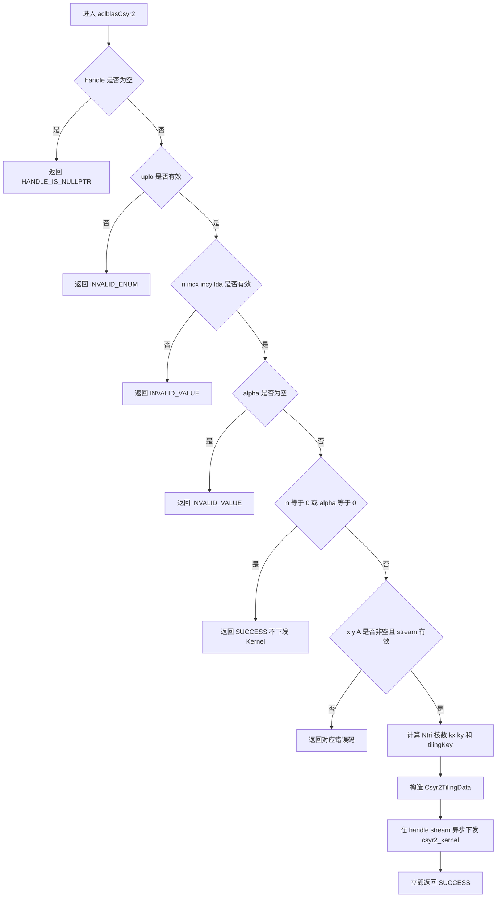
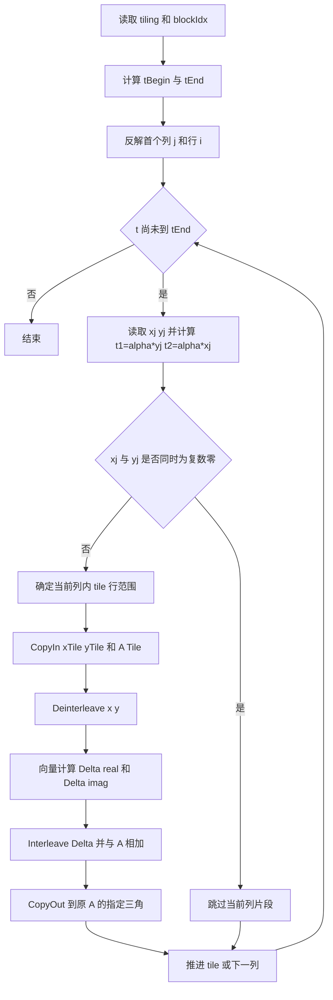

# aclblasCsyr2 算子设计文档

# 需求背景（required）

## 需求来源

本任务来自 2026 年 CANN 社区任务 `aclblasCsyr2` 算子开发，目标是在 Atlas A2/A3 系列产品上，基于 `ops-blas` 的 Ascend C Kernel 直调框架新增单精度复数对称秩 2 更新能力。

算子语义对齐 cuBLAS `cublasCsyr2`，秩 2 更新和负步长的遍历规则参考 Netlib BLAS `ssyr2`。接口、复数类型、状态码和流语义以 `ops-blas` 仓库为准。

## 背景介绍

`syr2` 属于 BLAS Level 2 算子。它使用两个复数向量的外积更新复数对称矩阵的一个三角区域：

$$
A \leftarrow A + \alpha x y^T + \alpha y x^T
$$

这里的转置是普通转置而不是共轭转置，因此矩阵满足 $A=A^T$，不满足 Hermitian 算子的共轭约束。上式展开到列主序矩阵的元素为：

$$
A_{i,j} \leftarrow A_{i,j} + x_i(\alpha y_j) + y_i(\alpha x_j)
$$

当 `uplo = ACLBLAS_UPPER` 时仅引用并更新 $0 \le i \le j < n$；当 `uplo = ACLBLAS_LOWER` 时仅引用并更新 $0 \le j \le i < n$。另一三角既不读取也不写入，对角元素的虚部按普通复数参与运算，不做清零或其他特殊处理。

`aclblasComplex` 在 `include/cann_ops_blas_common.h` 中定义为两个连续的 `float` 字段 `real` 和 `imag`，即 complex64 的 AoS 存储形式。矩阵采用列主序，元素地址为 `A[i + j * lda]`。

## 现状分析

`ops-blas` 已有实数接口 `aclblasSsyr2` 和 Atlas A2/A3 的 `blas/syr2/arch22/` 实现，但当前公共头文件中尚无 `aclblasCsyr2` 声明，也没有对应的 complex64 arch22 实现。现有同仓复数 BLAS 算子已经提供 complex64 实部/虚部分离、向量计算和重新交织的实现基础，可复用公共数据搬运和复数处理模式，但本算子的数学公式、三角映射、负步长寻址和一次写回策略需要独立设计。

# 需求分析（required）

## 需求描述

新增 `aclblasCsyr2` 句柄式 BLAS 接口，通过 handle 绑定的 stream 异步下发 Ascend C Kernel，在 Atlas A2/A3 上完成 complex64 对称秩 2 原地更新。

接口原型如下：

```cpp
aclblasStatus_t aclblasCsyr2(
    aclblasHandle_t handle,
    aclblasFillMode_t uplo,
    int n,
    const aclblasComplex* alpha,
    const aclblasComplex* x, int incx,
    const aclblasComplex* y, int incy,
    aclblasComplex* A, int lda);
```

该声明新增到 `include/cann_ops_blas.h`，Atlas A2/A3 实现放在 `blas/syr2/arch22/`，不定义产品私有平行接口。

## 输入、输出与属性

| 参数 | I/O | 存储位置 | 类型 | 约束与语义 |
| --- | --- | --- | --- | --- |
| `handle` | 输入 | Host | `aclblasHandle_t` | 有效句柄，携带执行 stream |
| `uplo` | 输入 | Host | `aclblasFillMode_t` | 仅允许 `ACLBLAS_UPPER` 或 `ACLBLAS_LOWER` |
| `n` | 输入 | Host | `int` | `n >= 0`，为矩阵阶数和向量逻辑长度 |
| `alpha` | 输入 | Host | `const aclblasComplex*` | 非空；`(0, 0)` 触发 quick return |
| `x` | 输入 | Device | `const aclblasComplex*` | 逻辑长度为 `n`，物理跨度由 `incx` 描述 |
| `incx` | 输入 | Host | `int` | 非零，支持正、负步长 |
| `y` | 输入 | Device | `const aclblasComplex*` | 逻辑长度为 `n`，物理跨度由 `incy` 描述 |
| `incy` | 输入 | Host | `int` | 非零，支持正、负步长 |
| `A` | 输入/输出 | Device | `aclblasComplex*` | 列主序，原地更新，仅访问 `uplo` 指定三角 |
| `lda` | 输入 | Host | `int` | `lda >= max(1, n)` |

对负步长采用 0 基下标形式的 Netlib 起点规则：

$$
k_x = \begin{cases}
0, & incx > 0 \\
(1-n)\cdot incx, & incx < 0
\end{cases},\qquad
k_y = \begin{cases}
0, & incy > 0 \\
(1-n)\cdot incy, & incy < 0
\end{cases}
$$

逻辑元素 $x_i$ 和 $y_i$ 的物理下标分别为 `kx + i * incx` 和 `ky + i * incy`。所有下标与乘法在 host 和 kernel 中使用 64 位整数计算，避免 `n`、`lda`、负步长及 `INT_MIN` 参与地址计算时发生 32 位有符号溢出。

## 参数校验与 quick return

Host 侧按以下顺序处理，以保证错误行为明确，并使 quick return 不引用无关数据：

1. `handle == nullptr` 时返回 `ACLBLAS_STATUS_HANDLE_IS_NULLPTR`。
2. `uplo` 非法时返回 `ACLBLAS_STATUS_INVALID_ENUM`。
3. `n < 0`、`incx == 0`、`incy == 0` 或 `lda < max(1, n)` 时返回 `ACLBLAS_STATUS_INVALID_VALUE`。
4. `alpha == nullptr` 时返回 `ACLBLAS_STATUS_INVALID_VALUE`。
5. 完成以上标量校验后，若 `n == 0` 或 `alpha == (0, 0)`，直接返回 `ACLBLAS_STATUS_SUCCESS`，不读取 `x`、`y`、`A`，不申请临时内存，也不下发 kernel。
6. 非 quick-return 场景下，`x`、`y` 或 `A` 为空时返回 `ACLBLAS_STATUS_INVALID_VALUE`。
7. 非 quick-return 场景下若 handle 中的 stream 未初始化，返回 `ACLBLAS_STATUS_NOT_INITIALIZED`。

## 需求拆解

1. 正确实现 complex64 非共轭秩 2 更新，保留对角虚部。
2. 同时支持 `UPPER`、`LOWER`，未指定三角严格不读不写。
3. 支持 `incx`、`incy` 的任意非零正负值，以及带 padding 的 `lda`。
4. 为 `incx == 1 && incy == 1` 提供连续访存快路径，为其他步长提供通用正确性路径。
5. 各 AI Core 的输出区间互不重叠，单次 kernel 内完成两项外积之和，不依赖原子加。
6. Host 侧不执行流同步；tiling 通过 kernel 参数传值，避免每次调用为 tiling 单独申请 Device 内存。
7. 覆盖空维、零标量、非法参数、非对齐尾块、Inf/NaN 和负步长等边界场景。

# 详细设计（required）

## 算子分析

### 复数计算展开

令：

$$
t_1 = \alpha y_j = t_{1r} + it_{1i},\qquad
t_2 = \alpha x_j = t_{2r} + it_{2i}
$$

每个目标元素的增量为：

$$
\begin{aligned}
\Delta_r &= x_{ir}t_{1r}-x_{ii}t_{1i}+y_{ir}t_{2r}-y_{ii}t_{2i} \\
\Delta_i &= x_{ir}t_{1i}+x_{ii}t_{1r}+y_{ir}t_{2i}+y_{ii}t_{2r}
\end{aligned}
$$

最终执行 `A.real += Delta_r`、`A.imag += Delta_i`。实现保持 `t1 = alpha * y[j]`、`t2 = alpha * x[j]` 的求值顺序，不改写为先求两个外积再统一乘 `alpha`，以减少与 BLAS 参考语义在浮点舍入和 Inf/NaN 传播上的差异。

当 `x[j]` 和 `y[j]` 都精确等于复数零时，整列对应的更新为零。Kernel 跳过该列片段，不读取该片段的 `x[i]`、`y[i]`、`A[i,j]`。这一行为与 Netlib 的列级零值短路一致，可避免 `0 * Inf` 无意义地产生 NaN。

### 三角逻辑线性化

矩阵的有效三角共有：

$$
N_{tri}=n(n+1)/2
$$

个 complex64 元素。设计将有效三角看作按列拼接的一维逻辑序列 `t`，再把 `[0, Ntri)` 等量分配给 AI Core。这样既不触碰另一三角，也避免按整列分核在三角列长度差异较大时产生负载不均。

上三角第 `j` 列的逻辑起点和长度为：

$$
S_U(j)=j(j+1)/2,\qquad L_U(j)=j+1
$$

对给定 `t`，寻找满足 `S_U(j) <= t < S_U(j+1)` 的列 `j`，行号为 `i = t - S_U(j)`。

下三角第 `j` 列的逻辑起点和长度为：

$$
S_L(j)=j(2n-j+1)/2,\qquad L_L(j)=n-j
$$

对给定 `t`，寻找满足 `S_L(j) <= t < S_L(j+1)` 的列 `j`，行号为 `i = j + t - S_L(j)`。

每个核只在其起点执行一次 64 位整数二分查找，得到首个 `(i,j)`；随后按列和行连续推进，不在逐元素循环中重复做反解。

### 分核策略

设实际使用核数为 `P`，核 `b` 负责：

$$
t_{begin}=\lfloor N_{tri}b/P\rfloor,\qquad
t_{end}=\lfloor N_{tri}(b+1)/P\rfloor
$$

区间为 `[tBegin, tEnd)`。区间不重叠且完整覆盖有效三角，因此每个矩阵元素只由一个核读改写一次，不需要 `SetAtomicAdd`，结果不受核间执行顺序影响。

`P` 由 `GetAivCoreCount()`、`Ntri` 和最小单核工作量共同确定：

```text
P = min(aivCoreNum, max(1, ceil(Ntri / minElementsPerCore)))
```

`minElementsPerCore` 初始按 512 个 complex64 输出设计；大规模性能用例使用满可用 Vector Core，小规模输入减少空核和调度开销。该阈值在后续性能阶段根据基准数据微调，不改变功能路径。

## Host 侧设计

Host 侧负责参数校验、quick return、核数选择、tiling 生成和异步 kernel 下发。



建议的 tiling 数据如下，指针和地址计算统一使用 64 位字段：

```cpp
struct Csyr2TilingData {
    uint64_t x;
    uint64_t y;
    uint64_t a;
    uint64_t totalTriElements;
    int64_t kx;
    int64_t ky;
    int32_t n;
    int32_t lda;
    int32_t incx;
    int32_t incy;
    uint32_t uplo;
    uint32_t tilingKey;
    uint32_t tileComplexCount;
    uint32_t usedCoreNum;
    float alphaReal;
    float alphaImag;
};
```

Tiling key 规划：

| Tiling key | 条件 | 处理策略 |
| --- | --- | --- |
| `0`：连续快路径 | `incx == 1 && incy == 1` | x/y 片段连续搬入 UB，使用向量化复数计算 |
| `1`：通用步长路径 | 其他合法非零步长 | 按 64 位逻辑下标将 x/y 聚集为 UB 中的连续 complex64，再复用同一计算主体 |

Tiling 结构体按值传给 kernel launch。Host 不为 tiling 或偏移表执行 `aclrtMalloc`/`aclrtMemcpy`，也不调用 `aclrtSynchronizeStream`，从而保持句柄 stream 的异步语义并消除每次调用的临时分配成本。

## Kernel 侧设计

### 总体流程

每个 Vector Core 先计算自己的 `[tBegin, tEnd)`，根据 `uplo` 反解首列和首行，再逐列处理区间。列内以 `tileComplexCount` 为上限分块。



### 数据搬运

- `A`：同一列中的目标行连续，物理起点为 `2 * (j * lda + i)` 个 `float`，一次搬入/搬出 `2 * tileLen` 个 `float`。`lda` padding 仅影响列起点，不影响列内连续性。
- 连续快路径：`x`、`y` 的 tile 均为连续 complex64，分别按 `2 * tileLen` 个 `float` 批量搬运。
- 通用步长路径：物理下标使用 `kx + row * incx`、`ky + row * incy`。正步长且 DMA stride 可表达时使用多 burst 搬运；负步长或 stride 超出 DMA 字段范围时使用 64 位下标的标量 GM 读取，将元素打包到连续 UB。打包完成后进入与快路径相同的向量计算主体。
- 所有尾块使用实际 `tileLen` 作为 DataCopy 和 Vector API 的有效长度，越界对齐区不写回 GM。

### UB 切分与复用

Host 通过 `PlatformAscendCManager::GetInstance()->GetCoreMemSize(CoreMemType::UB, ubSize)` 获取当前 Vector Core 的可用 UB，禁止在实现中把容量写死。预留 256 B 安全空间后，按 6 个等大的 `2T` 缓冲区计算 tile：

$$
T=\operatorname{AlignDown}\left(\left\lfloor\frac{ubSize-256}{6\times 2\times sizeof(float)}\right\rfloor,32\right)
$$

Atlas A2/A3（DAV_2201）的可用 UB 为 192 KiB，代入后 `T=4064` 个 complex64，每个 `2T` 缓冲区为 31.75 KiB。共申请 6 个等大 TBuf，合计 190.5 KiB，保留 1.5 KiB 余量，UB 利用率约 99.2%：

| Buffer | 大小 | 初始化阶段用途 | 计算阶段用途 |
| --- | ---: | --- | --- |
| `indexBuf` | `2T * 4 B` | `[real | imag]` 到交织结果的 byte offset | 全程保留重排索引 |
| `aux0Buf` | `2T * 4 B` | 生成重排索引的临时向量 | GM 搬入 staging、交织后的 Delta |
| `aux1Buf` | `2T * 4 B` | 生成重排索引的临时向量 | 复数计算 scratch，随后复用为 A 输入/输出 |
| `xPlaneBuf` | `2T * 4 B` | - | `[xReal | xImag]` |
| `yPlaneBuf` | `2T * 4 B` | - | `[yReal | yImag]` |
| `deltaPlaneBuf` | `2T * 4 B` | - | `[deltaReal | deltaImag]` |

Kernel 启动后使用整数向量指令在 UB 内构造一次 interleave offset，随后 `aux0Buf`、`aux1Buf` 立即复用，不需要 Host 生成辅助表或额外 GM workspace。总 UB 利用率为 100%；各 buffer 生命周期明确且没有重叠写冲突。

计算步骤为：

1. x tile 搬入 `aux0Buf`，通过 `GatherMask` 分离到 `xPlaneBuf`。
2. y tile 覆盖搬入 `aux0Buf`，通过 `GatherMask` 分离到 `yPlaneBuf`。
3. 使用 `Muls`、`Add`、`Sub` 在 `deltaPlaneBuf` 中生成实部和虚部，`aux1Buf` 作为可复用 scratch。
4. 使用 `Gather` 按 `indexBuf` 将 Delta 重新交织到 `aux0Buf`。
5. 将 A tile 搬入已释放 scratch 角色的 `aux1Buf`，执行逐 float 加法。由于 complex64 为 `[real, imag]` 交织布局，此处同一条向量加同时完成实部和虚部累加。
6. 将 `aux1Buf` 的有效区写回 A。

单个性能目标用例的 `n <= 2048`，每个列片段通常可以在一个 tile 内完成。相比缩小 tile 强行双缓冲，本设计优先减少循环、事件和重复搬运开销；超过 tile 上限时按块顺序流水处理，通过 MTE2/V/MTE3 事件保证 buffer 复用安全。

### 正确性与并发性

- 每个有效三角元素只属于一个逻辑 `t`，不同核写集严格不相交，无需原子操作。
- 单个元素在一次 kernel 中完成两个秩 1 项和原 A 的合并，只写回一次。
- `UPPER` 路径只生成 `i <= j`，`LOWER` 路径只生成 `i >= j`；另一三角地址不会出现在 CopyIn/CopyOut 中。
- 对角虚部不清零，因为本算子是 symmetric 而不是 Hermitian。
- quick return 在 Host 完成；`alpha == 0` 时不读取含 Inf/NaN 的 x、y、A。
- 列级零值短路保持 A 原值并避免不必要的 Inf/NaN 乘法。
- 不使用跨核归约、workspace 或原子加，给定输入和硬件时计算路径稳定。

## 工程文件规划

| 文件 | 设计内容 |
| --- | --- |
| `include/cann_ops_blas.h` | 新增公共 `aclblasCsyr2` 声明 |
| `blas/syr2/arch22/csyr2_tiling.h` | `Csyr2TilingData`、tiling key 和常量 |
| `blas/syr2/arch22/csyr2_host.cpp` | 参数校验、quick return、tiling、异步下发 |
| `blas/syr2/arch22/csyr2_kernel.cpp` | 三角映射、步长打包、复数向量计算、写回 |
| `blas/syr2/arch22/CMakeLists.txt` 或同级构建配置 | 将 csyr2 arch22 源文件加入目标 |
| `test/syr2/csyr2/arch22/` | 后续阶段的 CSV、GTest、golden 和 wrapper |

## 支持硬件

| 芯片/产品 | 支持情况 |
| --- | --- |
| Atlas A2 训练/推理系列产品 | 支持 |
| Atlas A3 训练/推理系列产品 | 支持 |

## 算子约束限制

1. 仅支持 `aclblasComplex`（complex64）。
2. A 使用列主序，`lda >= max(1, n)`。
3. 仅更新 `uplo` 指定三角，调用方不得依赖另一三角被同步镜像。
4. `incx`、`incy` 必须非零；负步长按 Netlib 起点语义解释。
5. `alpha` 位于 Host 内存；x、y、A 位于 Device 内存。
6. A 原地更新，x、y 只读；接口不返回视图。
7. Host 侧不同步 stream，调用方在读取结果前负责流同步。
8. 不涉及广播和高维 Tensor 语义。

# 可维可测分析

## 精度标准

complex64 的实部和虚部分别按 FLOAT32 标准比较：

| 指标 | 要求 |
| --- | --- |
| `rtol` | $2^{-10}$（约 `9.77e-4`） |
| `atol` | $2^{-16}$（约 `1.53e-5`） |
| `required_matched_ratio` | `0.99` |
| `max_abs_error_limit` | `1e-2` 或 `32 * ULP` |

逐分量判定条件为 `abs(actual - golden) <= atol + rtol * abs(golden)`。仅比较 `uplo` 指定三角；另一三角应额外验证保持原值。Golden 按 Netlib `ssyr2` 的循环和求值顺序扩展为 complex64，不使用 Hermitian 共轭。

## 性能标准与优化点

目标是在任务书给定的 n=512、1024、2048 且 `incx=incy=1` 的场景中不高于标杆平均耗时。设计中的主要优化点为：

1. 仅遍历约 $n(n+1)/2$ 个有效元素，不计算完整方阵。
2. 有效三角按元素数均分，降低三角列长差异造成的核间尾效应。
3. 连续步长走单独快路径，x/y/A 均使用批量 GM↔UB 搬运。
4. 一个 kernel 同时完成 `x*y^T` 和 `y*x^T`，避免两次 kernel launch 和原子累加。
5. 每个 A 元素仅执行一次读改写，另一三角零流量。
6. interleave offset 在核内生成并复用，Host 无辅助表分配、H2D 拷贝和流同步。
7. 由实际 UB 容量计算的大 tile 使目标性能 shape 的大多数列片段单 tile 完成。

## 后续测试设计

本阶段只交付设计文档，不执行实验。实现阶段应至少覆盖：

| 类别 | 覆盖点 |
| --- | --- |
| 基础功能 | `UPPER`、`LOWER`；n=1、小质数、2 的幂及 ±1、非对齐 n |
| Quick return | n=0；alpha=(0,0)；同时传入空 x/y/A 并确认成功且不访问 |
| 步长 | incx/incy 为 ±1、±2、±3，正负组合 |
| lda | `lda=n`、`lda>n` padding，验证 padding 和另一三角不变 |
| 负向参数 | 空 handle、非法 uplo、n<0、inc=0、lda 不足、空 alpha、活动路径空 x/y/A |
| 数值 | 随机均匀/正态、纯实 alpha、纯虚 alpha、大值、Inf、NaN、正负零 |
| 尾块 | 三角分核边界落在列中间、tile 尾块、32B/256B 非对齐长度 |
| 性能 | n=512/1024/2048，warmup 后采样大于 50 次取平均 |

## 兼容性分析

- 新增公共函数声明，不改变已有 API 的签名和行为。
- 文件放入现有 `syr2/arch22` 同族目录，沿用 `ops-blas` 的 handle、stream、状态码和构建方式。
- 不引入第三方依赖和 Device workspace。
- 通过 64 位内部地址运算兼容 int 接口允许的较大 n、lda 和步长，外部 ABI 保持任务书规定的 int 参数。

## 风险与规避

| 风险 | 规避措施 |
| --- | --- |
| complex64 交织/分离导致尾块越界 | 所有 Vector 和 DataCopy API 使用实际有效长度，写回只覆盖 `2 * tileLen` 个 float |
| 三角线性反解出错 | 使用 64 位单调起点函数和二分查找，并对首尾、跨列分核边界做专项用例 |
| 负步长地址溢出 | 使用 `(1LL - n) * inc` 和 64 位乘加，不调用可能溢出的 32 位 `abs(int)` |
| Inf/NaN 与零乘传播不一致 | Host alpha 零 quick return；Kernel 保留 Netlib 列级零值短路和计算顺序 |
| 核间写冲突 | 按不相交逻辑三角区间分核，不使用原子加 |
| 异步接口被临时资源释放破坏 | tiling 按值传参，offset 在 UB 内生成，不做每次调用的临时 Device 分配 |
| 小 shape 核启动开销过大 | 依据最小单核工作量动态缩减实际核数 |

# 参考资料

1. `aclblasCsyr2` Atlas A2/A3 社区任务书。
2. `cann/cann-competitions` 社区任务设计模板与提交目录规范。
3. `cann/ops-blas` 的公共 BLAS 类型、状态码、`syr2/arch22` 及 complex64 同族实现。
4. NVIDIA cuBLAS API Reference：`cublas<t>syr2()`。
5. Netlib BLAS：`ssyr2.f`。
6. CANN 生态算子精度标准。
