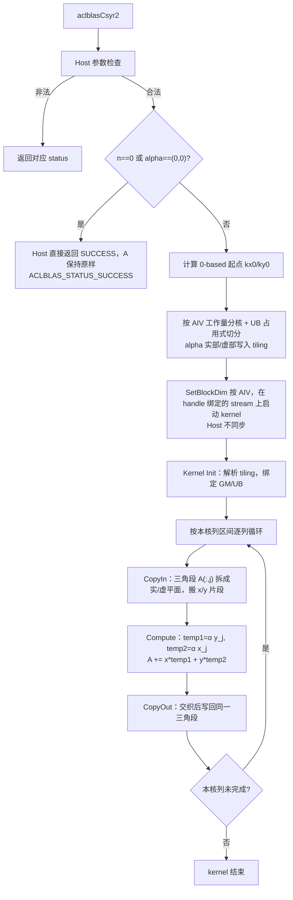

# 需求背景（required）

## 需求来源

依据 8 月社区任务「aclblasCsyr2 算子开发（A2/A3）」任务书，在昇腾 NPU（Atlas A2/A3 系列，arch22）上使用 Ascend C 编程语言实现单精度复数对称秩 2 更新接口 `aclblasCsyr2`，与 cuBLAS `cublasCsyr2` 参数序列及核心语义对齐，语义依据 Netlib `ssyr2`（https://www.netlib.org/blas/ssyr2.f）。验收通过后合入昇腾算子开源仓 ops-blas（https://gitcode.com/cann/ops-blas）。

本任务为 **ops-blas 句柄式 BLAS 新接口**：Host 绑定 stream 后直调 Ascend C kernel。

## 背景介绍

### aclblasCsyr2 算子实现

SYR2 是 BLAS Level-2 对称秩 2 更新：用两个向量的外积对对称矩阵做原地累加。复数情形下，cuBLAS 提供 `cublasCsyr2` / `cublasZsyr2`；Netlib 参考 BLAS 仅有实数 `ssyr2` / `dsyr2`，**没有** `csyr2`。因此本算子：

- 接口与参数顺序对齐 cuBLAS `cublasCsyr2`；
- 三角引用、负步长起点、`n = 0` / `alpha = (0,0)` 的 quick return 对齐 Netlib `ssyr2`；
- 采用普通复数乘法与对称转置 `A = A^T`（对角虚部按普通累加）。

工程落点（与任务书一致）：

| 项 | 路径 / 约定 |
| --- | --- |
| 接口声明 | `include/cann_ops_blas.h` **新增** `aclblasCsyr2`，与 Ascend 950PR 产品线共用同一声明 |
| 复数类型 | `include/cann_ops_blas_common.h` 中的 `aclblasComplex`（实部/虚部各 `float32`，即 complex64） |
| 实现 | `blas/syr2/arch22/`，与实数同族接口 `aclblasSsyr2` 同族归档 |
| 测试 | `test/syr2/csyr2/arch22/`（CSV + C++ GTest，结构对齐仓内 BLAS 测试） |
| 硬件 | Atlas A2/A3，架构目录 `arch22`；性能验收设备 Atlas 800I A2（910B3） |
| CANN | 9.1.0 |

公开头文件 `include/cann_ops_blas.h` 中 **已声明** `aclblasSsyr2`，**尚无** `aclblasCsyr2`。仓内 `blas/syr2/` 目录用于 syr2 同族归档。本设计不复述仓内 `ssyr2` kernel 的未公开切分细节，Csyr2 按下文独立给出可落地的 Host/Kernel 方案。

相关资料：

- cuBLAS `cublas<t>syr2()`：https://docs.nvidia.com/cuda/cublas/index.html#cublas-t-syr2
- Netlib `ssyr2.f`：https://www.netlib.org/blas/ssyr2.f
- ops-blas：https://gitcode.com/cann/ops-blas
- Ascend C 算子开发文档：https://www.hiascend.com/document/detail/zh/CANNCommunityEdition/850/opdevg/Ascendcopdevg/atlas_ascendc_map_10_0002.html
- Ascend C API：https://www.hiascend.com/document/detail/zh/canncommercial/850/API/ascendcopapi/atlasascendc_api_07_0003.html
- 生态算子开源精度标准：https://gitcode.com/cann/opbase/blob/master/docs/zh/ops_precision_standard/experimental_standard.md

### aclblasCsyr2 算子功能分析

计算公式（对称普通转置，普通复数乘法）：

```
A := alpha * x * y^T + alpha * y * x^T + A
```

其中：

- `alpha` 为单精度复数标量；
- `x`、`y` 为长度 `n` 的复数向量（按 `incx` / `incy` 寻址）；
- `A` 为 `n × n` **对称**复数矩阵，满足 `A = A^T`（普通转置）；
- 存储为列主序，前导维 `lda`；仅 `uplo` 指定的三角（含对角）被引用并原地更新，对侧三角保持原样，由对称性隐含；
- 对角元素虚部按普通累加。

接口（参数序列与 `cublasCsyr2` 一一对应，维数参数均为 `int`）：

```cpp
aclblasStatus_t aclblasCsyr2(
    aclblasHandle_t handle,
    aclblasFillMode_t uplo,
    int n,
    const aclblasComplex* alpha,
    const aclblasComplex* x, int incx,
    const aclblasComplex* y, int incy,
    aclblasComplex* A, int lda);
```

参数表（口径与任务书 §2.4 一致）：

| 参数名 | 输入／输出/属性 | 描述 | 数据类型 | dtype类型 | 数据排布格式 | 维度(shape) | 值域范围 | 异常行为 |
| --- | --- | --- | --- | --- | --- | --- | --- | --- |
| handle | 输入 | ops-blas 库上下文句柄，携带 stream，Host 内存 | scalar | - | - | - | 指向已创建的有效句柄 | handle 为 nullptr 时返回 `ACLBLAS_STATUS_HANDLE_IS_NULLPTR` |
| uplo | 输入 | 指定矩阵 A 的存储三角：ACLBLAS_UPPER(121) 上三角、ACLBLAS_LOWER(122) 下三角；仅该三角（含对角）被引用，Host 内存 | attr | int（枚举） | - | - | {ACLBLAS_UPPER, ACLBLAS_LOWER} | 取值不在上述枚举时返回 `ACLBLAS_STATUS_INVALID_ENUM` |
| n | 输入 | 矩阵 A 的阶数，向量 x/y 的元素个数，Host 内存 | scalar | int | - | - | n ≥ 0 | n < 0 时返回 `ACLBLAS_STATUS_INVALID_VALUE`；n = 0 为合法 no-op |
| alpha | 输入 | 指向复数标量乘数的指针，Host 内存；alpha = (0,0) 时 Host 直接返回 SUCCESS，A 保持原样 | scalar | COMPLEX64 | - | - | 实部/虚部取值于 FLOAT32 全集 | alpha 为 nullptr 时返回 `ACLBLAS_STATUS_INVALID_VALUE` |
| x | 输入 | 输入向量 x（按 incx 步长取 n 个元素），Device 内存，只读 | tensor | COMPLEX64 | ND | [1 + (n-1)·\|incx\|]（逻辑长度 n） | 实部/虚部取值于 FLOAT32 全集 | n > 0 且 alpha ≠ (0,0) 时 x 为 nullptr 返回 `ACLBLAS_STATUS_INVALID_VALUE` |
| incx | 输入 | x 相邻元素间的内存地址偏移量，Host 内存 | scalar | int | - | - | incx ≠ 0（支持负步长） | incx = 0 时返回 `ACLBLAS_STATUS_INVALID_VALUE` |
| y | 输入 | 输入向量 y（按 incy 步长取 n 个元素），Device 内存，只读 | tensor | COMPLEX64 | ND | [1 + (n-1)·\|incy\|]（逻辑长度 n） | 实部/虚部取值于 FLOAT32 全集 | n > 0 且 alpha ≠ (0,0) 时 y 为 nullptr 返回 `ACLBLAS_STATUS_INVALID_VALUE` |
| incy | 输入 | y 相邻元素间的内存地址偏移量，Host 内存 | scalar | int | - | - | incy ≠ 0（支持负步长） | incy = 0 时返回 `ACLBLAS_STATUS_INVALID_VALUE` |
| A | 输出（原地输出） | 输入/输出对称矩阵 A，Device 内存；仅 uplo 指定三角被引用并原地覆写；对称转置 A=A^T，对角虚部按普通累加 | tensor | COMPLEX64 | ND（列主序） | lda×n（逻辑 n×n） | 实部/虚部取值于 FLOAT32 全集 | n > 0 且 alpha ≠ (0,0) 时 A 为 nullptr 返回 `ACLBLAS_STATUS_INVALID_VALUE` |
| lda | 输入 | 矩阵 A 的前导维度（列主序），Host 内存 | scalar | int | - | - | lda ≥ max(1, n) | lda < max(1, n) 时返回 `ACLBLAS_STATUS_INVALID_VALUE` |

**返回值**：`aclblasStatus_t`，与 `include/cann_ops_blas_common.h` 定义一致（`ACLBLAS_STATUS_SUCCESS` / `ACLBLAS_STATUS_INVALID_VALUE` / `ACLBLAS_STATUS_INVALID_ENUM` / `ACLBLAS_STATUS_HANDLE_IS_NULLPTR` 等）。

列主序下标（0-based C）：

```
A(i, j) 物理地址 = A + (i + j * lda)   // i 为行，j 为列，元素类型 aclblasComplex（8B）
x 逻辑元素 i 物理地址 = x + (kx0 + i * incx)
y 逻辑元素 i 物理地址 = y + (ky0 + i * incy)
```

其中 `kx0` / `ky0` 为 0-based 起点，由 Netlib 1-based 起点换算，见 Host 侧负步长设计。

### aclblasCsyr2 算子现状分析

| 项 | 现状 |
| --- | --- |
| ops-blas 公开声明 | `aclblasCsyr2` **不存在**，需在 `include/cann_ops_blas.h` 新增；`aclblasSsyr2` 已存在 |
| 同族归档 | 实现放入 `blas/syr2/arch22/`，测试放入 `test/syr2/csyr2/arch22/` |
| 对标实现 | GPU 侧为 cuBLAS `cublasCsyr2`；CPU 参考语义为 Netlib `ssyr2` 的复数推广 |
| golden | cblas/netlib **无**复数 syr2（仅 ssyr2/dsyr2）。测试工程须按 `ssyr2` 语义自实现复数 golden |
| 工程模式 | 句柄式 BLAS + Ascend C kernel 直调；异步，Host 不隐式同步 |
| 本任务范围 | Atlas A2/A3（arch22）。950PR（arch35）实现不在本任务内，但 **共用同一 API 声明** |

# 需求分析（required）

## 需求描述

使用 Ascend C 编程语言，在 ops-blas 框架下实现 `aclblasCsyr2`：对列主序、complex64 对称矩阵做原地秩 2 更新 `A := alpha * x * y^T + alpha * y * x^T + A`。支持 `uplo` 上/下三角、负步长、`lda` padding，以及任务书规定的参数检查与 quick return。精度按 FLOAT32 分量标准验收；性能在 Atlas 800I A2（910B3）上达到任务书 §3.3 三条典型 case 的平均单次耗时上限。范围为二维列主序原地更新；浮点乘加非 bit-exact。

## 需求拆解

1. 在 `include/cann_ops_blas.h` 新增与 `cublasCsyr2` 参数一一对应的 `aclblasCsyr2` 声明，与 950PR 共用同一声明。
2. 数据类型仅 complex64（`aclblasComplex`，实部/虚部 float32）。
3. 公式采用普通复数乘法与对称转置：`A = A^T`（对角虚部按普通累加）。
4. 仅更新 `uplo` 指定三角（含对角）；对侧三角保持原样；对角虚部按普通累加。
5. 列主序，`lda` 为前导维；`lda ≥ max(1, n)`。
6. 负步长：`incx`/`incy` 可为负；按 Netlib 起点寻址；`incx = 0` 或 `incy = 0` 返回 `ACLBLAS_STATUS_INVALID_VALUE`。
7. Host 指针 `alpha`：启动 kernel 前 Host 解引用；`alpha = (0,0)` 或 `n = 0` 时 Host 直接返回 `ACLBLAS_STATUS_SUCCESS`，A 保持原样。
8. 参数合法性与任务书 §2.4 状态码一致。
9. 异步：`aclblasSetStream` 绑定 stream，Host 不隐式同步。
10. 精度：实部/虚部分别按 FLOAT32，`rtol = 2^-10`，`atol = 2^-16`，`matched_ratio ≥ 0.99`，`max_abs_error ≤ 1e-2` 或 32 ULP；golden 为自实现复数 `ssyr2`。
11. 性能：Atlas 800I A2（910B3），warmup 后有效采样 >50 次取平均，单位 us：UPPER n=512 ≤ 4.82；LOWER n=1024 ≤ 6.22；UPPER n=2048 ≤ 12.19。
12. 实现与测试分别落入 `blas/syr2/arch22/` 与 `test/syr2/csyr2/arch22/`，与已有 `aclblasSsyr2` 并列归档。

# 详细设计（required）

## 算子分析

### 数学公式

对称秩 2 更新（0-based，列主序）：

```
A := α x y^T + α y x^T + A
```

元素形式（普通复数乘法）：

```
A(i, j) := A(i, j) + α * x(i) * y(j) + α * y(i) * x(j)
```

对列 `j`，先形成两个复数标量（与 Netlib `ssyr2` 相同的列循环结构）：

```
temp1 = α * y(j)
temp2 = α * x(j)
```

再更新该列的三角段：

```
A(i, j) := A(i, j) + x(i) * temp1 + y(i) * temp2
```

三角范围：

- `uplo = ACLBLAS_UPPER`：`j = 0 .. n-1`，`i = 0 .. j`（含对角）；
- `uplo = ACLBLAS_LOWER`：`j = 0 .. n-1`，`i = j .. n-1`（含对角）。

复数乘法（`z1 = a + b i`，`z2 = c + d i`）：

```
z1 * z2 = (a c - b d) + (a d + b c) i
```

`α`、`x`、`y`、`A` 的所有乘加均使用上式（普通复数乘法）。对角：

```
A(j, j) := A(j, j) + α * x(j) * y(j) + α * y(j) * x(j)
```

在交换律下等于 `A(j, j) + 2 α x(j) y(j)`，对角虚部按普通累加。

Netlib `ssyr2` 对负步长（1-based）：

```
KX = 1                 if INCX > 0
KX = 1 - (N-1)*INCX    if INCX < 0
```

`KY` 同理。本算子换成 0-based 后用于 kernel 寻址（见 Host 侧）。

### 支持数据类型

| 操作数 | 类型 | 说明 |
| --- | --- | --- |
| alpha、x、y、A | `aclblasComplex` / COMPLEX64 | 实部、虚部各 float32，共 8 字节 |
| n、incx、incy、lda | `int` | Host 标量 |
| uplo | `aclblasFillMode_t` | `ACLBLAS_UPPER = 121`，`ACLBLAS_LOWER = 122`（与任务书及 CBLAS `CblasUpper/CblasLower` 口径一致） |

本接口数据类型为 complex64；实数路径由已有 `aclblasSsyr2` 承担。

### 支持形状

| 对象 | 逻辑形状 | 物理布局 |
| --- | --- | --- |
| A | n × n 方阵 | 列主序，`lda × n` 个 complex64；`lda ≥ max(1, n)` 时列尾可有 padding |
| x | 长度 n | 按下标 `kx0 + i * incx` 取 n 个元素 |
| y | 长度 n | 按下标 `ky0 + i * incy` 取 n 个元素 |
| n | 标量 | `n ≥ 0`；`n = 0` 合法空问题 |

约束：

- 逻辑上始终是方阵；任务书「非方阵」覆盖通过 `lda > n` 的列 padding 表达。
- 形状为运行时二维方阵。
- `n` 为运行时入参。
- 非连续由 `incx`/`incy`/`lda` 描述。

## 算子实现

### 实现方案

整体为 **带宽敏感的 Level-2 秩 2 更新**：三角约 `n(n+1)/2` 个 complex64 做一遍读-改-写，`x`/`y` 被各列复用。计算强度低，本算子 **Vector-only**，Host 用 `GetCoreNumAiv()` 启动 AIV。目标是：只碰被引用三角、列内连续搬运、`x`/`y` 复用、double buffer 掩盖 GM 延迟。



#### 3.2.1 host侧设计

Host 位于 `blas/syr2/arch22/`，职责：参数检查、quick return、负步长起点换算、组装 tiling、选择 tilingKey、在 handle 的 stream 上启动 kernel。向量寻址由 tiling 中的 `kx0`、`ky0`、`incx`、`incy` 描述。

##### 1. 参数检查

检查顺序（先枚举/空指针，再 quick return，避免 no-op 掩盖非法参数）：

| 序号 | 条件 | 返回值 |
| --- | --- | --- |
| 1 | `handle == nullptr` | `ACLBLAS_STATUS_HANDLE_IS_NULLPTR` |
| 2 | `uplo` 不是 `ACLBLAS_UPPER(121)` 且不是 `ACLBLAS_LOWER(122)` | `ACLBLAS_STATUS_INVALID_ENUM` |
| 3 | `n < 0` | `ACLBLAS_STATUS_INVALID_VALUE` |
| 4 | `alpha == nullptr` | `ACLBLAS_STATUS_INVALID_VALUE` |
| 5 | `incx == 0` 或 `incy == 0` | `ACLBLAS_STATUS_INVALID_VALUE` |
| 6 | `lda < max(1, n)` | `ACLBLAS_STATUS_INVALID_VALUE` |
| 7 | `n == 0`，或 `(*alpha).real == 0 && (*alpha).imag == 0` | `ACLBLAS_STATUS_SUCCESS`（quick return） |
| 8 | `n > 0` 且 alpha ≠ (0,0)，且 `x == nullptr` 或 `y == nullptr` 或 `A == nullptr` | `ACLBLAS_STATUS_INVALID_VALUE` |

说明：

- 非法 `uplo` 以任务书为准返回 **`ACLBLAS_STATUS_INVALID_ENUM`**。随任务 CSV 中 `TC_ED` 的 `invalid_uplo` 若编码为 `ACLBLAS_STATUS_INVALID_VALUE`，属于用例与任务书不一致，测试工程须按任务书更正，实现不迁就 CSV。
- `n = 0` 时仍校验 `alpha != nullptr`、`incx/incy != 0`、`lda ≥ 1`；不要求 `x`/`y`/`A` 非空。
- 状态码取值以 `cann_ops_blas_common.h` 为准。

##### 2. quick return 与复数 alpha 下发

`alpha` 是 **Host 指针**。kernel 启动前 Host 读取：

```
alphaReal = alpha->real
alphaImag = alpha->imag
```

将这两个 `float` 写入 tiling（或 kernel 标量参数）。

quick return：

- `n == 0`，或 `alpha = (0,0)`（即 `alphaReal == 0 && alphaImag == 0`）；
- Host 在 quick return 时不 launch kernel，直接返回 `ACLBLAS_STATUS_SUCCESS`，A 保持原样。
- 即使 A 中含 NaN/Inf，只要走 quick return，A 保持原样（与 Netlib `IF ((N.EQ.0).OR.(ALPHA.EQ.ZERO)) RETURN` 一致；复数零判断为实部与虚部均为 0，即 `alpha = (0,0)`）。

##### 3. 负步长起点

`incx`/`incy` 允许为负，不允许为 0。

Netlib 1-based：

```
kx_1based = (incx > 0) ? 1 : (1 - (n - 1) * incx)
ky_1based = (incy > 0) ? 1 : (1 - (n - 1) * incy)
```

C / kernel 0-based：

```
kx0 = (incx > 0) ? 0 : ((1 - n) * incx)
ky0 = (incy > 0) ? 0 : ((1 - n) * incy)
```

逻辑元素 `i`（`i = 0 .. n-1`）：

```
x_i = x[kx0 + i * incx]
y_i = y[ky0 + i * incy]
```

Host **只**把 `kx0`、`ky0`、`incx`、`incy` 写入 tiling，由 kernel 按起点+步长寻址。`|incx| == 1` 且 `incx < 0` 时，物理区间仍连续，kernel 可将该区间一次搬入 UB 再按反向逻辑下标访问，该优化在 kernel 内完成。

##### 4. uplo 三角

| uplo | 数值 | 引用并更新 | 对侧三角 |
| --- | --- | --- | --- |
| `ACLBLAS_UPPER` | 121 | `i ≤ j` 的上三角含对角 | 保持原样（`i > j`） |
| `ACLBLAS_LOWER` | 122 | `i ≥ j` 的下三角含对角 | 保持原样（`i < j`） |

`lda` padding（每列 `i ≥ n` 的尾部）保持原样。仅更新 `uplo` 指定三角（含对角）；对侧三角保持原样。

##### 5. 分核策略（Vector-only，三角前缀工作量均分）

本算子 **Vector-only**，Host 用 `GetCoreNumAiv()` 启动 AIV。Atlas A2/A3 为 Cube/Vector 分离架构；本算子是带宽敏感的向量秩 2 更新，按向量核 launch。

- Host 用 `GetCoreNumAiv()`（或仓内 AIV 封装）取 `aivNum`。核数由 `GetCoreNumAiv()` 运行时获取。
- `usedCoreNum = min(aivNum, n)`；`n` 很小则不满核。
- `SetBlockDim(usedCoreNum)` 按 AIV。
- Atlas 800I A2（910B3）**期望约 40 AIV**，仅作 tiling 验算参考量级（例如核对 n=2048 时每核列段与 GM 量），核数由运行时接口获取。

列之间无写冲突（每列只写 `A(:, j)` 的三角段），无需核间同步。

列长随 `j` 变化：UPPER 后列更长，LOWER 前列更长，UPPER 列长差约 O(n)。分核采用三角前缀工作量均分。tiling 字段为 `n`、`uplo`、`usedCoreNum`；核列区间由 `GetBlockIdx()` 与前缀反函数闭式计算。

```
UPPER: 列 j 工作量 w(j) = j + 1，前缀 S(j) = j*(j+1)/2      // S(j) 为列 0..j-1 的累计
LOWER: 列 j 工作量 w(j) = n - j，前缀 S(j) = j*(2n - j + 1)/2
总工作量 total = n*(n+1)/2
核 c（c = 0 .. usedCoreNum-1）的目标工作量区间
    [T0, T1) = [c*total/usedCoreNum, (c+1)*total/usedCoreNum)
jBegin = min { j | S(j+1) > T0 }，缺省 0
jEnd   = min { j | S(j) >= T1 }，最后一核为 n
```

`jBegin`/`jEnd` 可由前缀的反函数闭式求得（UPPER 为二次根 `(-1 + sqrt(1+8T))/2` 再校正到满足上式的整数，LOWER 同理），保证连续列段、核间无重叠无空洞。tiling 字段为 `n`、`uplo`、`usedCoreNum`；kernel 按 `GetBlockIdx()` 与上式计算本核 `[jBegin, jEnd)`。

##### 6. 数据分块、UB 占用式与列 Copy

`aclblasComplex` 按 **8 字节**计。GM 上为实虚交织。选定 fallback：**CopyIn 将 complex64 拆成两个 float32 UB（实平面 / 虚平面），再 `Mul` / `Sub` / `Add`**。x/y/tmp 按下式按每元素字节计入（两平面合计仍为 8B/元素）。

Host 必须按占用式编出 `tileRow` 写入 tiling。

```
ubBytes = GetCoreMemSize(UB)
```

A2 AIV 期望 UB **192–256KB**，仅作 tiling 验算参考，由 `GetCoreMemSize(UB)` 运行时获取。

```
BUFFER_NUM = 2
xCost   = 8     // x 实平面 + 虚平面，各 4B/元素
yCost   = 8     // y 同上
tmpCost = 16    // 两次复乘加中间 zr/zi，各 2 个 float 平面；占用式按独立计入
overhead        // 队列头、对齐填充等，Host 按实际代入；验算可取 8KB 量级

A 三角段 double buffer = BUFFER_NUM * tileRow * 8
```

A 的交织 staging 与实/虚平面 **共用** 同一 `BUFFER_NUM * tileRow * 8` 预算（in-place 拆包或别名同一块 UB）；`tmpCost` 与 A **不别名**（占用式已按独立计入，保持）。

```
tileRow = align_down((ubBytes - overhead) / (BUFFER_NUM*8 + xCost + yCost + tmpCost), 4)
```

其中对齐粒度 **4 = 32B / 8B**。`align_down(v, 4)` 表示向下取到 4 的倍数。再令 `tileRow = min(tileRow, n)`。若上式结果为 0（UB 异常偏小），取 `tileRow = 1`，短段走 DataCopyPad（规则见下）。

**x/y 并集容量**：本核列段 `[jBegin, jEnd)` 的逻辑并集长度 `unionLen`：UPPER 为 `jEnd`，LOWER 为 `n - jBegin`。最坏核接近 `n`（UPPER 尾核、LOWER 首核）。因已有 `tileRow = min(tileRow, n)`，并集判定直接用 `tileRow`。若

```
overhead + BUFFER_NUM * tileRow * 8
    + unionLen * (xCost + yCost)
    + tileRow * tmpCost  > ubBytes
```

则并集装不下：退化为按列或沿列滑窗搬 x/y（每次只驻留当前 `tileRow` 的 x/y 片段）。占用须落在 `ubBytes` 内。Host 按最坏核判定后将 `xyReuse`（1 = 缓存并集，0 = 按列/滑窗）写入 tiling。

**列 Copy 与 lda**：列间距是 `lda` 个元素。主方案：对每一列做一次连续 1D CopyIn / Compute / CopyOut，长度 UPPER = `j+1`、LOWER = `n-j`。tiling 字段为 `tileRow`（由占用式编出）等，见第 7 节。

数量级：n=2048、约 40 AIV、工作量均分后，一核大约数十到数百次 8B～十余 KB 的列 Copy；尾核列少而段长、决定 GM 体积。double buffer 掩盖搬运。落地约束：满 AIV、逐列 1D Copy、占用式编出 `tileRow`。

**DataCopy 对齐写死 32B**。凡 `len * 8` 不是 32 的倍数（含整列短段 `len = 1, 2, 3`），一律 `DataCopyPad`，短段仍被完整搬运。

访存路径：

- `incx == 1 && incy == 1`：连续向量通路，按 32B 规则 `DataCopy` / `DataCopyPad` 进 UB 后拆平面再向量乘加；
- `|incx| > 1` 或 `|incy| > 1`：按起点+步长 gather 到连续 UB 平面，再走向量计算；
- 负单位步长：见上文，可连续搬入后反向寻址。

##### 7. tiling 数据与 tilingKey

写入 tiling 的字段（字段名可按仓内 `TilingData` 宏风格调整）：

| 字段 | 含义 |
| --- | --- |
| n, lda, incx, incy | 问题规模与步长 |
| kx0, ky0 | 0-based 向量起点 |
| uplo | 121 或 122 |
| alphaReal, alphaImag | Host 已解引用的 α |
| usedCoreNum | 实际启动的 AIV 数 |
| tileRow | 由占用式编出的单次三角段最大元素数 |
| bufferNum | 2 |
| xyReuse | 1 = 本核 x/y 并集缓存；0 = 按列/滑窗 |

tiling 字段见上表；核列区间由 `n` / `uplo` / `usedCoreNum` / `GetBlockIdx()` 闭式计算。

**tilingKey**（Host 可见信息决定 kernel 分支）：

| tilingKey | 条件 |
| --- | --- |
| 0 | UPPER 且 `incx == 1 && incy == 1` |
| 1 | LOWER 且 `incx == 1 && incy == 1` |
| 2 | UPPER 且非单位正步长（含负步长、\|inc\| > 1） |
| 3 | LOWER 且非单位正步长 |

需要 tilingKey 的原因：连续列段走 `DataCopy` 向量通路；跨步/负步长走 gather。`uplo` 决定三角方向，编译期分支可去掉内层判断。

##### 8. kernel 启动与异步

- 通过 handle 取 `aclrtStream`（由 `aclblasSetStream` 绑定）。
- `SetBlockDim(usedCoreNum)` 后启动对应 tilingKey 的 kernel，blockDim 按 AIV。
- **Host 不调用 stream 同步**；调用方读回 Device 上的 A 之前自行同步。
- 启动符号与仓内同族 host 直调对齐。
- kernel 读写既有 A/x/y 的 GM。

#### 3.2.2 kernel侧设计

kernel 位于 `blas/syr2/arch22/`，分为 **Init** 与 **Process**。Process 对每个 tile 执行 **CopyIn → Compute → CopyOut**。本算子 Vector-only，Host 用 `GetCoreNumAiv()` 启动 AIV。

##### 1. Init

- 按 `GetBlockIdx()` 读取 tiling；若 `blockIdx >= usedCoreNum` 则直接返回。
- 按 §3.2.1 第 5 节闭式前缀计算本核列区间 `[jBegin, jEnd)`。
- `GlobalTensor<aclblasComplex>` 绑定 `x`、`y`、`A`。
- 按 Host 编好的 `tileRow`、`bufferNum`、`xyReuse` 划分 UB，占用与 Host 占用式一致：
  - A 三角段 double buffer：`BUFFER_NUM * tileRow * 8`（交织 staging 与实/虚平面共用该预算）；
  - x 实平面 / 虚平面：每元素 `xCost = 8`；
  - y 实平面 / 虚平面：每元素 `yCost = 8`；
  - 复乘加临时平面：每元素 `tmpCost = 16`（与 A 不别名）。
- `xyReuse == 1` 时按本核并集一次搬入 x/y 平面；否则按列或滑窗。划分结果必须满足占用式。
- 连续路径准备向量拷贝；跨步路径准备 gather 目标平面。

##### 2. Process 主循环

对 `j` 从 `jBegin` 到 `jEnd - 1` **逐列**循环，对每一列做一次连续 1D CopyIn / Compute / CopyOut：

**CopyIn**

- 计算三角段长度 `len`：UPPER 为 `j+1`，LOWER 为 `n-j`。
- GM 源地址：UPPER `&A[j * lda + 0]`，LOWER `&A[j * lda + j]`，长度为 `len`，**列内连续**。列间距为 `lda`，逐列 1D Copy。
- 仅拷贝该段（`uplo` 指定三角含对角）。
- 对齐：短段走 DataCopyPad（规则见上）。一列 `len > tileRow` 时沿行方向按 `tileRow` 滑窗多次 CopyIn/Compute/CopyOut，尾块同样走 DataCopyPad（规则见上）。
- 选定 fallback 布局：交织 complex64 进 UB 后 **拆成两个 float32 平面（实/虚）**；后续计算只在平面上做。若平台提供交织/平面转换原语则用之，否则用向量拆包。
- `x`/`y`：连续时按逻辑区间拷贝后同样拆平面；否则 gather 到平面。`xyReuse == 1` 时本核并集只搬一次；否则按当前列或当前滑窗搬。
- 与计算重叠：double buffer。

**Compute**

```
temp1 = alpha * y[j]     // 普通复数乘
temp2 = alpha * x[j]
for i in 三角段:          // UPPER i=0..j；LOWER i=j..n-1
    A(i,j) += x[i] * temp1 + y[i] * temp2
```

向量化：把三角段看成长度 `len` 的两路 float32 向量（实平面 / 虚平面）。`temp1`/`temp2` broadcast 后做两次复乘加。

若 Ascend C 提供复数向量乘加原语，可优先调用；**选定的 fallback** 仍是上述实/虚平面上的 `Mul` / `Sub` / `Add`：

```
// z = x * t ，x=xr+xi i，t=tr+ti i；xr/xi 为 UB 平面
zr = xr*tr - xi*ti
zi = xr*ti + xi*tr
A.r += zr_temp1 + zr_temp2
A.i += zi_temp1 + zi_temp2
```

尾块 mask 或标量收尾。全程采用普通复数乘法。实现必须能在无复数原语时按该平面布局落地。

对角元素走同一公式，虚部按普通累加。

**CopyOut**

- 将两平面交织回 complex64，把已更新的三角段写回 **同一** GM 地址区间；短段同样 `DataCopyPad`。
- 仅写回 `uplo` 指定三角段。
- 与下一列 CopyIn 流水。

##### 3. 列主序与三角正确性

`A(i, j)` 仅出现在列 `j` 的连续段中，核间按列划分故无写冲突。`lda > n` 时列间距为 `lda` 个元素：CopyIn 仍只取该列三角连续前/后缀，逐列 1D Copy。

##### 4. 跨步与负步长

非 `incx == incy == 1` 时，CopyIn 对 `x`/`y` 做：

```
ub_x_r[k] = Re(GM_x[kx0 + idx(k) * incx])
ub_x_i[k] = Im(GM_x[kx0 + idx(k) * incx])
ub_y_r[k] = Re(GM_y[ky0 + idx(k) * incy])
ub_y_i[k] = Im(GM_y[ky0 + idx(k) * incy])
```

`idx(k)` 为当前三角段逻辑行号。计算与连续路径相同（仍在实/虚平面上）。负步长通过 `kx0/ky0` 与 `incx/incy` 符号体现在寻址中；`|inc|==1` 时可连续搬入后反向寻址。

##### 5. 性能要点（对应 §3.3 带宽目标）

本算子有效流量约为三角元素的一次读加一次写，外加可忽略的 `x`/`y`。设计必须：

1. **一遍读改写**被引用三角；
2. **`x`/`y` 按核复用**（`xyReuse == 1` 时复用并集；装不下则按列/滑窗，占用满足占用式）；
3. **向量流水 + double buffer**，让 GM Copy 与 Vector 计算重叠；
4. **仅访问 `uplo` 指定三角（含对角）**；`lda` padding 保持原样；
5. 连续 case（性能三条均为 `incx=incy=1`、`lda=n`）走 tilingKey 0/1 的 `DataCopy` 向量通路；
6. **满 AIV 启动**：`usedCoreNum = min(GetCoreNumAiv(), n)`。

本算子 Vector-only，Host 用 `GetCoreNumAiv()` 启动 AIV。

## 支持硬件

| 支持的芯片版本 | 涉及勾选 |
| --- | --- |
| Atlas 800I/T A2 | √ |
| Atlas A3 系列产品（与 A2 同属 arch22） | √ |

说明：实现目录为 `blas/syr2/arch22/`。性能测试设备为 **Atlas 800I A2（910B3）**；任务书 §3.1 亦出现 Atlas 800T A2（910B3），二者同为 910B3 / arch22。A3 与 A2 共用 arch22 二进制策略，**A3 的 us 标杆任务书未给出，不以自行换算代替**。本任务勾选 Atlas A2/A3（arch22）；Ascend 950PR（arch35）共用 `aclblasCsyr2` 声明。

## 算子约束限制

1. 数据类型为 `aclblasComplex` / COMPLEX64；实数路径由 `aclblasSsyr2` 承担。
2. 仅 `uplo ∈ {ACLBLAS_UPPER, ACLBLAS_LOWER}`；非法枚举返回 `ACLBLAS_STATUS_INVALID_ENUM`。
3. 仅更新 `uplo` 三角（含对角）；对侧三角保持原样；对角虚部按普通累加。
4. 列主序；`lda ≥ max(1, n)`。
5. `incx ≠ 0`、`incy ≠ 0`；支持负步长；零步长返回 `ACLBLAS_STATUS_INVALID_VALUE`。
6. `n ≥ 0`；`n = 0` 或 `alpha = (0,0)` 为合法 quick return。
7. 二维列主序，A 原地覆写。
8. 浮点乘加非 bit-exact。
9. 异步执行，Host 不隐式同步。
10. 采用普通复数乘法与对称转置 `A = A^T`（对角虚部按普通累加）。
11. 非连续由步长/前导维表达。
12. Inf/NaN 按 float32 乘加的 IEEE 传播处理。

# 可维可测分析

## 精度标准/性能标准

| 验收标准 | 描述(不涉及说明原因) | 标准来源 |
| --- | --- | --- |
| 精度标准 | 输出 A 仅校验 uplo 三角；实部、虚部分别按 FLOAT32：rtol = 2^-10（≈9.77e-4），atol = 2^-16（≈1.53e-5），required_matched_ratio = 0.99，max_abs_error_limit = 1e-2 或 32×ULP。逐元素 \|actual-golden\| ≤ atol + rtol×\|golden\|；同时满足 matched_ratio 与 max_abs_error 即通过。非 bit-exact。golden 由测试工程按 Netlib ssyr2 语义自实现复数参考（含负步长 kx=1-(n-1)·incx 的 0-based 换算、n=0 / alpha=(0,0) 时 A 保持原样、对称转置 A=A^T、对角虚部按普通累加）。 | 任务书 §3.2；生态算子开源精度标准 |
| 性能标准 | 设备 Atlas 800I A2（910B3）。COMPLEX64，warmup 后有效采样 >50 次取平均，单位 us，平均单次耗时不高于：① UPPER n=512 lda=512 alpha=(1,0) incx=incy=1 → 4.82；② LOWER n=1024 lda=1024 alpha=(1,0) incx=incy=1 → 6.22；③ UPPER n=2048 lda=2048 alpha=(1,0) incx=incy=1 → 12.19。 | 任务书 §3.3 |
| 内存标准 | 不涉及。测试工程单用例 Host ≤512MB 仅为用例生成预算。 | 任务书 §3.4 |

精度自验：`verify_accuracy.py` 编译并运行仓内 GTest，过滤 `-*TC_PF*`。默认约 1000 条精度 + 200 条性能（`gen_csv.py`）。类别覆盖 L0 基础、尺寸扫描、alpha 特殊值、lda padding、±1/±2/±3 步长、填充/Inf/NaN、边界负向、扩展采样。golden 按 Netlib ssyr2 语义自做复数参考。

性能自验：`verify_performance.py` 跑 `*TC_PF*`。门槛用任务书三条 NPU us。其余性能用例不作额外耗时门限；A3 与更大 n 的 us 以任务书为准。

CSV 里另有 mere/mare 列，验收仍按上表 rtol/atol。

## 兼容性分析

- **新接口**：新增 `aclblasCsyr2`，已有 `aclblasSsyr2` 的签名、语义与 arch22 实现保持不变。
- **同族归档**：源码与测试进入 `blas/syr2/`、`test/syr2/csyr2/`，与实数 syr2 并列归档。
- **跨产品线**：`include/cann_ops_blas.h` 中单一声明，与 950PR（arch35）任务共用；本任务只实现 arch22。
- **ABI**：维数保持 `int`，`alpha` 为 Host `const aclblasComplex*`，与近期仓内复数接口风格（指针标量、`const` 输入）一致。
- **行为差异（有意）**：相对 `her2`：采用普通复数乘法与对称转置 `A = A^T`，对角虚部按普通累加。相对 cuBLAS：非法 `uplo` 返回 `INVALID_ENUM`（cuBLAS 文档将该类错误归在 `INVALID_VALUE`），以任务书为准。
- **异步契约**：与 ops-blas 其它句柄式接口相同，Host 不隐式同步。
