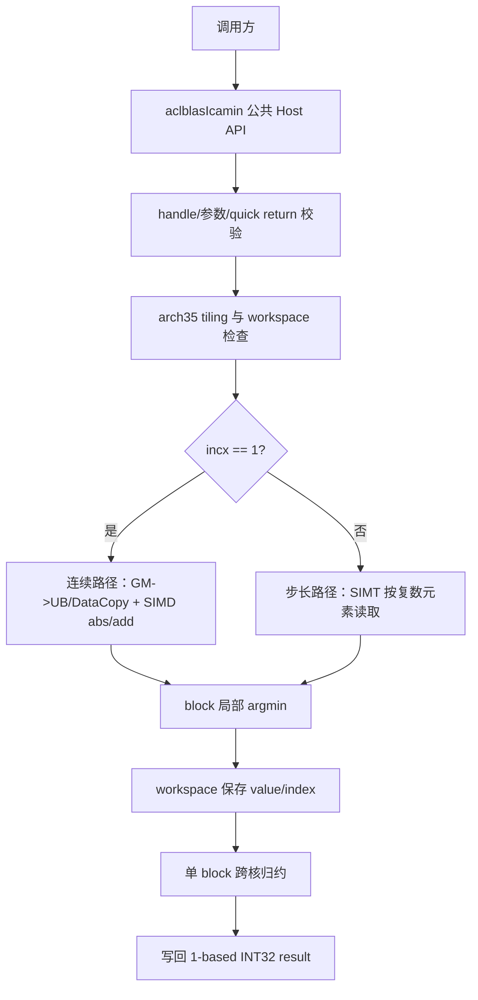

# 【CANN社区任务】aclblasIcamin 算子设计文档

## 一、需求背景

### 1.1 需求来源

本文档对应 CANN 社区任务 `aclblasIcamin`（Ascend 950PR）。任务要求使用
Ascend C 在 ops-blas 工程中实现单精度复数向量最小模元素索引算子，并完成
功能、精度、性能和测试交付。验收通过后，算子实现合入
[cann/ops-blas](https://gitcode.com/cann/ops-blas)。

本次设计文档提交信息如下：

| 项目 | 内容 |
| --- | --- |
| 任务 | aclblasIcamin 算子开发（Ascend 950PR） |
| 设计文档目录 | `04_tasks/01_community-task-2026/tasklist/08-47-aclblasIcamin/Qianqiuer/docs/design.md` |
| 参与账号/目录名 | `Qianqiuer` |
| 设计文档仓库 | `https://gitcode.com/Qianqiuer/cann-ops-competitions` |
| 目标代码仓库 | `https://gitcode.com/cann/ops-blas` |
| 目标硬件 | Ascend 950PR（arch35，DAV-3510） |
| CANN | 9.1.0 |
| 开发语言 | C++、Ascend C、GTest 测试工程 |

任务要求的公开接口必须加入 `include/cann_ops_blas.h`，不能新增只供 950PR
使用的平行私有接口。代码目录使用现有 iamin 算子族的组织方式：

```text
ops-blas/
├── include/cann_ops_blas.h
├── blas/iamin/arch35/
│   ├── icamin_host.cpp
│   ├── icamin_kernel.cpp
│   └── icamin_tiling_data.h
└── test/iamin/icamin/arch35/
    ├── icamin_test.cpp
    ├── icamin_golden.h
    ├── icamin_param.h
    └── icamin_test.csv
```

### 1.2 算子功能

`aclblasIcamin` 查找复数向量中 BLAS 1-范数模最小的逻辑元素，并返回
Fortran/BLAS 惯例的 1-based 索引。对第 `i` 个逻辑元素，物理位置为：

```text
k_i = 1 + (i - 1) * incx,       i = 1, ..., n
m_i = |Re(x[k_i])| + |Im(x[k_i])|
result = argmin_i (m_i, i)
```

这里的复数模是 `|Re| + |Im|`，不是欧几里得模
`sqrt(Re * Re + Im * Im)`。比较键为 `(magnitude, logical_index)` 的字典序，
因此多个元素模值相等时返回最小逻辑索引。`aclblasComplex` 由两个 FP32 分量组成，
Device 内存中采用 `real0, imag0, real1, imag1, ...` 的交错布局。

### 1.3 现有实现和复用边界

ops-blas 已有 `aclblasIsamin` 的 arch35 实现，可复用其句柄、stream、参数校验、
分块归约和测试工程组织方式；复数版本不能直接把复数按一个 float 读取，必须在
kernel 中读取实部、虚部并计算 `abs1`。`aclblasIcamax` 的复数加载和模计算方式
可作为复数数据处理参考，但最值方向改为最小值，且必须保留最小索引 tie-break。

标准 Netlib BLAS 没有 `icamin` 例程，因此 CPU golden 采用测试工程中的 cblas 风格
参考循环；cuBLAS `cublasIcamin` 文档是接口参数顺序和 BLAS 语义的最高优先级参考。

## 二、需求分析

### 2.1 对外接口

新增公共声明，参数顺序与 cuBLAS `cublasIcamin` 对齐：

```cpp
aclblasStatus_t aclblasIcamin(
    aclblasHandle_t handle,
    int n,
    const aclblasComplex* x,
    int incx,
    int* result);
```

接口使用 `handle` 中绑定的 ACL stream 异步提交任务。`x` 和 `result` 是 Device
指针，`result` 指向一个 `int` 标量。调用方在读取 `result` 前负责同步绑定的 stream。

### 2.2 参数与异常语义

| 参数 | 方向/位置 | 类型 | 约束 | 非法或特殊行为 |
| --- | --- | --- | --- | --- |
| `handle` | 输入，Host | `aclblasHandle_t` | 已创建且有效 | `nullptr` 返回 `ACLBLAS_STATUS_HANDLE_IS_NULLPTR` |
| `n` | 输入，Host | `int` | `n >= 0` | `n < 0` 返回 `ACLBLAS_STATUS_INVALID_VALUE` |
| `x` | 输入，Device，只读 | `const aclblasComplex*` | 逻辑长度 `[n]`，物理元素跨度为 `incx` | 正常计算路径为空返回 `ACLBLAS_STATUS_INVALID_VALUE` |
| `incx` | 输入，Host | `int` | `incx >= 1` 进入计算 | `incx < 1` 为 quick return，写 0 并成功返回，不反向遍历 |
| `result` | 输出，Device | `int*` | 一个 INT32 标量 | `nullptr` 返回 `ACLBLAS_STATUS_INVALID_VALUE` |

参数处理顺序固定为：

1. 检查 `handle`；
2. 检查 `result`；
3. 检查 `n < 0`；
4. 若 `n == 0` 或 `incx < 1`，在绑定 stream 上把 `result` 异步置零并直接返回成功，
   不检查 `x`，不启动 Icamin kernel；
5. 对正常计算路径检查 `x`，再进行 workspace 和 kernel 提交。

这样可以覆盖任务书要求的 `n=0/nullptr x`、`incx=0/nullptr x` quick return 组合，
同时保证 `result=nullptr` 始终是非法参数。`n < 0` 优先于 quick return，返回非法值。

### 2.3 支持范围

| 类别 | 支持范围 |
| --- | --- |
| 硬件 | Ascend 950PR，arch35 / DAV-3510 |
| 输入 | `COMPLEX64`，实部和虚部均为 FP32 |
| 输出 | `INT32` 单值索引 |
| 逻辑 shape | 一维向量 `[n]` |
| 正常步长 | `incx = 1, 2, 3, ...`，任务用例重点覆盖 1/2/3 |
| 空输入 | `n=0`，成功并输出 0 |
| 非法输入 | `n<0`、正常路径 `x=nullptr`、`result=nullptr` |
| 负步长 | `incx<=0` quick return，不做反向访问 |
| 广播/布局 | 不涉及广播、矩阵布局和原地更新 |
| 动态 shape | `n` 为运行时 Host 参数，kernel 根据 tiling 处理 |

当 `n > 0` 且 `incx >= 1` 时，所需复数物理长度为
`1 + (n - 1) * incx`；所有偏移先按复数元素计算，再换算为交错 float 的偏移，
避免把 `incx` 错当成 float 步长。

### 2.4 精度和确定性要求

输出为离散 INT32 索引，验收不采用浮点容差，而是与 CPU golden 逐位相等：

```text
actual_result == golden_result
```

正常元素使用 IEEE FP32 的 `fabsf(real) + fabsf(imag)`。比较时只有严格小于才替换
当前候选；相等时比较逻辑索引，保证归约树、分核数量和执行顺序不会改变结果。

特殊值按任务测试工程的 golden 语义实现：

- `Inf` 作为普通浮点候选参与最小值比较；多个相同 `Inf` 返回最小索引。
- `NaN` 不满足严格小于，跳过该元素。
- 首个元素是 `NaN` 时，候选初始化为 `FLT_MAX` 和索引 1，继续扫描后续元素。
- 全部元素均为 `NaN` 时返回索引 1，与 golden 的首元素基准一致。
- 全零、正负交替和相同模值数据必须返回最小索引。

以上规则在 golden、连续路径、非连续路径和跨 block 归约中统一实现，不能在
kernel 的局部归约阶段使用只比较浮点值的非确定性合并。

### 2.5 性能验收口径

任务书要求在 Ascend 950PR 上对 COMPLEX64 输入执行性能测试，先 warmup，再有效采样
超过 50 次并取平均单次耗时。随任务提供的 `gpu_baseline.csv` 使用毫秒记录，测试脚本
按 `NPU <= GPU / 0.4`（即倍率 `GPU/NPU >= 0.4`）判定。换算为微秒后，任务书三组典型
case 的上限为：

| case | `n` | `incx` | GPU 基线（ms） | 950PR NPU 上限（us） |
| --- | ---: | ---: | ---: | ---: |
| 1 | 1,048,576 | 1 | 0.009907 | 24.77 |
| 2 | 2,097,152 | 1 | 0.009836 | 24.59 |
| 3 | 4,194,304 | 1 | 0.011876 | 29.69 |

计算关系为 `gpu_ms * 1000 / 0.4`，四舍五入后与任务书表格一致。除三组典型 case 外，
还必须对任务提供的 200 条 `TC_PF` 性能用例逐条执行；基线为空时测试脚本只记录
`NO_REF`，不能把没有基线的结果伪造为性能通过。

## 三、总体设计

### 3.1 分层架构



Host API、tiling 和 kernel 的职责边界如下：

1. 公共接口只负责参数语义、句柄 stream 和状态码，不暴露 arch35 私有参数；
2. Host tiling 计算分核数、每核范围、线程数、tile 大小和 workspace 字节数；
3. kernel 只处理有效输入元素，局部结果携带 `(min_value, min_index)`；
4. 跨核归约使用同一比较规则，最后加 1 写回结果；
5. quick return 使用异步 memset，不进入普通 kernel 和 workspace 流程。

### 3.2 文件与模块设计

| 模块 | 文件 | 责任 |
| --- | --- | --- |
| 公共接口 | `include/cann_ops_blas.h` | 新增 `aclblasIcamin` 声明及公共注释 |
| Host 实现 | `blas/iamin/arch35/icamin_host.cpp` | 参数校验、quick return、tiling、workspace、stream 提交 |
| Kernel | `blas/iamin/arch35/icamin_kernel.cpp` | 连续/步长路径、局部归约、跨核归约、结果写回 |
| Tiling 数据 | `blas/iamin/arch35/icamin_tiling_data.h` | 传递 `n`、`incx`、range、tile、block 和路径标志 |
| 算子说明 | `blas/iamin/README.md` | 产品支持表、接口语义、限制和构建说明 |
| CPU golden | `test/iamin/icamin/icamin_golden.h` | 生成 abs1 最小值和 1-based 索引 |
| CSV 参数 | `test/iamin/icamin/icamin_param.h` | 解析任务 CSV 的 n/incx/pattern/期望状态 |
| GTest | `test/iamin/icamin/arch35/icamin_test.cpp` | 申请数据、调用 API、同步、EXPECT_EQ 和状态码断言 |
| 任务用例 | `test/iamin/icamin/arch35/icamin_test.csv` | 复制任务提供的 1200 条用例 |

### 3.3 Host 侧设计

#### 3.3.1 参数校验和 quick return

Host 使用与 `aclblasIsamin` 一致的句柄和状态码体系，先在 Host 判断可确定的错误，
再将合法计算提交到 handle 的 stream。quick return 的 `result=0` 通过
`aclrtMemsetAsync` 或等价的异步标量写入完成，调用方仍需按异步 API 约定同步 stream。

Host 不对 `x` 做 Host 侧解引用，不把 Device 地址转换成 Host 指针；`result` 只作为 Device
写回地址传入 kernel。所有 `n * incx * sizeof(aclblasComplex)` 计算使用 64 位中间值，
在超过可表示范围时返回 `ACLBLAS_STATUS_INVALID_VALUE`，避免地址计算溢出。

#### 3.3.2 分核与 range tiling

以逻辑元素数 `n` 为工作量，使用可用 AIV 核数与数据量共同决定 block 数：

```text
block_num = min(n, available_aiv_cores)
base      = n / block_num
remainder = n % block_num
count(b)  = base + (b < remainder ? 1 : 0)
start(b)  = b * base + min(b, remainder)
```

这样每个 block 的逻辑范围连续且最多相差一个元素。`n` 较小时减少空 block，`n` 较大时
使用满核扫描。连续路径按 32B 对齐的 tile 计算每次搬运的复数元素数，尾部采用
`DataCopyPad` 或等价的有效长度搬运；步长路径保留逻辑索引，不能把有间隔数据当作连续块搬运。

Tiling 数据至少包含：

```text
n, incx, block_num, block_start, block_count,
tile_elements, thread_num, workspace_bytes, contiguous_path
```

#### 3.3.3 workspace

每个第一阶段 block 保存一个 FP32 最小模值和一个 INT32 逻辑索引：

```text
workspace[2 * block]     = min_value bit pattern
workspace[2 * block + 1] = min_index
```

workspace 由调用方按 ops-blas 既有约定提供或由 handle 工作区管理；Host 在提交前检查
大小和 64B 对齐要求，禁止 kernel 越界写。第二阶段最多读取 `available_aiv_cores` 个
partial，所需临时空间与 `n` 无关。空输入和非法步长不申请或使用普通归约 workspace。

### 3.4 Kernel 侧设计

#### 3.4.1 连续路径（`incx == 1`）

连续路径使用 Ascend C 的 GM 到 UB 搬运和 SIMD 向量指令，避免逐元素标量加载：

1. 按 tile 从 GM 搬入交错的 real/imag FP32 数据，尾块补齐但只处理有效元素；
2. 在 UB 中将相邻的 real/imag 分量解交错，或使用 RegBase/DINTLV 等价指令；
3. 对 real、imag 分别执行 `Abs`，再执行 `Add` 得到 abs1；
4. 在向量批次内生成逻辑索引，使用最小值和最小索引的联合比较；
5. 将 tile 局部结果写入本 block 的 workspace 槽位。

双缓冲只在 tiling 确认 UB 余量足够时启用：CopyIn(n+1) 与 Compute(n) 交替，尾块
单独处理。双缓冲不得改变输入读取顺序、NaN 判断或 tie-break。对 `incx=1` 的性能
路径不创建每元素的完整中间模值数组，减少 UB 写回和同步。

#### 3.4.2 步长路径（`incx > 1`）

步长路径复用 isamin 的 SIMT 分块框架，每个线程处理多个逻辑元素：

```cpp
for (int i = thread_id; i < block_count; i += thread_count) {
    int logical = block_start + i;
    int64_t float_offset = 2LL * logical * incx;
    float real = x[float_offset];
    float imag = x[float_offset + 1];
    float abs1 = fabsf(real) + fabsf(imag);
    update_argmin(abs1, logical);
}
```

线程局部候选写入 UB 后做确定性 tree reduction。步长访问不进行错误的连续 DataCopy，
保证 `incx=2/3` 读到正确的交错复数元素。

#### 3.4.3 局部及跨核归约

归约比较函数统一为：

```text
valid(rhs) && (!valid(lhs)
  || rhs.value < lhs.value
  || (rhs.value == lhs.value && rhs.index < lhs.index))
```

NaN 候选标记为 invalid；初始候选为 `(FLT_MAX, 1)` 的逻辑语义。每个 block 只向
workspace 写一个候选，第二阶段使用一个 block 顺序读取所有候选并应用相同比较函数，
最后写 `best_index + 1`。这样 block 执行顺序和归约树形状不会影响输出。

当 `n=1` 或工作量小于单 block 容量时可走单阶段小数据路径，直接写 1-based 结果，
但必须复用同一 `update_argmin` 规则。

#### 3.4.4 结果写回与同步

kernel 只写 `result` 一个 INT32 标量，不写输入，不执行额外 Host 同步。Host 返回成功
表示任务已入队；调用方通过 `aclrtSynchronizeStream` 或既有 handle 同步接口后读取结果。

## 四、测试设计与验收映射

### 4.1 CSV 用例覆盖

任务目录提供 `gen_csv.py`、`icamin_test.csv`、`verify_accuracy.py`、
`verify_performance.py` 和 `gpu_baseline.csv`。默认 CSV 为 1200 条：1000 条精度/边界
用例加 200 条性能用例。固定精度类别和覆盖点如下：

| 类别 | 数量 | 覆盖内容 |
| --- | ---: | --- |
| `TC_L0` | 6 | n=1/8、incx=1/2、全零 tie 最小索引 |
| `TC_SQ` | 38 | 1 到 1,048,576 的尺寸扫描、2 的幂和非对齐尺寸 |
| `TC_INC` | 17 | 正步长 1/2/3 与 0/-1/-2/-3 quick return |
| `TC_FL` | 12 | 随机、全零、交替、极端值、Inf、NaN |
| `TC_ED` | 12 | n=0、负 n、x 空指针和 quick return 优先级 |
| `TC_EX` | 915 | 尺寸、步长、填充的确定性扩展组合 |
| `TC_PF` | 200 | 三组任务书典型 case、规模扫描和特殊填充性能 |

固定类别合计 85 条，`TC_EX` 补足精度总数至 1000 条；扩展精度或性能数量时保留
固定类别全集。生成脚本固定随机种子并检查典型性能 case 顺序、seed 唯一性和负向语义。

### 4.2 精度执行

在 ops-blas 根目录执行：

```bash
python3 test_cases/verify_accuracy.py \
    --repo /path/to/ops-blas --soc ascend950 \
    --csv /path/to/icamin_test.csv --timeout 3600
```

脚本将 CSV 安装到 `test/iamin/icamin/arch35/`，调用 `build.sh --soc=ascend950 --ops=icamin`
编译，并运行排除 `TC_PF` 的 GTest。每个正常用例由 CPU golden 计算 abs1 最小索引，
NPU 结果经 stream 同步后使用 `EXPECT_EQ` 精确比对；负向用例比对状态码，quick return
同时检查 `result == 0`。验收报告逐条记录 PASS/FAIL，不使用只统计平均误差的替代结论。

额外的 Host API 测试覆盖 handle 空指针、result 空指针、输入只读、workspace 边界和
重复调用；这些不在 CSV 的 `x=NULLPTR` 字段中时，必须由 GTest 独立构造。

### 4.3 性能执行

```bash
python3 test_cases/verify_performance.py \
    --repo /path/to/ops-blas --soc ascend950 --timeout 3600
```

性能脚本只运行 `TC_PF`，先构建或使用 `--skip-build` 复用已构建二进制，设置
`ASCEND_DEVICE_ID` 后执行任务。测试工程必须显式 warmup，并采集超过 50 次有效样本；
报告同时保存平均值、样本数、设备、编译参数和原始日志。`gpu_baseline.csv` 中 200 条
基线按 `(n, incx)` 关联，`gpu_ms` 为空的条目只能输出 `NO_REF`，不能参与 PASS 统计。

在性能采样之外，使用 msprof 或 ACL Event 采集 kernel-only 时间，确认没有 CPU fallback，
并区分 Host 准备、golden 计算和 kernel 时间。最终性能报告至少包含：

- 200 条 `TC_PF` 的 NPU 平均耗时和判定；
- 三组典型 case 与 24.77/24.59/29.69 us 上限的对照；
- warmup 次数、有效样本数、设备 ID 和 CANN 版本；
- 连续路径/步长路径及尾块的覆盖说明；
- workspace、输入字节数和失败项原始日志。

### 4.4 自测报告

交付报告使用社区模板，包含接口/参数、CSV 用例分类、每条精度结果、性能平均值和
样本数、GPU 基线关联、设备信息、编译参数、内存占用、截图和原始日志。由于本算子
输出是 INT32 索引，精度表明确记录 `actual == golden`，不填写无意义的浮点 rtol/atol
替代整数精确比较。内存章节说明本算子不新增动态 Host/Device 分配，并记录输入和
workspace 的峰值。

## 五、性能优化方案

1. **连续访存专用化**：`incx=1` 使用向量搬运和 SIMD abs/add，避免每个元素的标量
   地址乘法和函数调用。
2. **按工作量分核**：小 n 减少空 block，大 n 使用可用 AIV 核；前余数 block 多处理
   一个元素，降低核间负载不均。
3. **UB 分块和双缓冲**：以 32B 对齐规划复数 tile，输入搬运和计算流水化，尾块用
   有效长度处理，避免越界和无效写回。
4. **联合值/索引归约**：只保留每线程和每 block 一个 `(value,index)`，不写全量模值
   中间张量；跨核只读取少量 workspace。
5. **路径分派**：连续、非连续和小数据路径分别选择合适的访存策略；性能优化不能
   改变步长、NaN、Inf 和 tie 语义。
6. **可观测性**：用 msprof/ACL Event 分离 MTE、向量、SIMT 和归约时间，保留优化前后
   原始采样，避免用 Host wall time 代替 kernel 性能。

## 六、兼容性、风险与回滚

### 6.1 兼容性

这是新增公共接口，不修改 `aclblasIsamin`、`aclblasIcamax` 或其他既有接口的 ABI 和
行为。公共头文件只增加声明；arch35 实现通过现有 ops-blas 构建入口注册。未支持产品
不宣称可用，避免把 950PR 专用实现误用于其他架构。

### 6.2 风险和控制措施

| 风险 | 控制措施 |
| --- | --- |
| 把欧氏模误作 BLAS 模 | golden、文档和 kernel 固定使用 `abs(real)+abs(imag)` |
| 复数交错地址偏移错误 | 所有 offset 以复数元素计算，最终乘 2；incx=2/3 定向测试 |
| tie 结果受归约顺序影响 | 比较 `(value, logical_index)`，相等时取小索引 |
| NaN 传播导致结果不一致 | 显式 valid 标志，和 golden 的首 NaN/全 NaN 语义一致 |
| workspace 越界 | Host 根据 block 数计算字节数并在提交前检查；尾块只处理有效元素 |
| quick return 错误启动 kernel | Host 在 x 检查前处理 n=0/incx<1，并记录 kernel 启动计数 |
| 性能口径混淆 | gpu_ms、us 上限、NPU kernel 时间和 Host 时间分栏保存，不混算 |
| 优化引入精度回归 | 每次改动先跑全量精度 CSV，再采集完整 TC_PF 性能 |

出现精度失败时优先回退到与 `aclblasIsamin` 一致的 SIMT 归约路径；出现性能回退时
保留可观测的连续路径开关和原始 tiling 参数，不修改公共 API 语义。

## 七、交付与评审清单

设计文档 PR 阶段提交本文件。开发和验收阶段还需提交：

1. `include/cann_ops_blas.h` 的公共声明；
2. `blas/iamin/arch35/` 的 Host、Tiling 和 Ascend C Kernel；
3. `test/iamin/icamin/arch35/` 的 GTest、golden、参数解析、CSV 和 README；
4. `blas/iamin/README.md` 中 Ascend 950PR 支持表、接口和限制说明；
5. 1200 条 CSV 精度/性能用例执行结果、原始日志和性能报告；
6. 报告中明确 CANN、SOC、设备 ID、构建命令、warmup、有效采样次数和基线版本；
7. 验收前在个人 ops-blas 仓库邀请 `Ascend-CANN` 为开发者，并提供仓库、分支和算子目录。

设计评审通过后，按任务书要求将实现和测试代码分别提交至 ops-blas 的
`blas/iamin/arch35/` 与 `test/iamin/icamin/arch35/`，再申请代码 PR。

## 八、参考资料

- [Ascend C 算子开发文档](https://www.hiascend.com/document/detail/zh/CANNCommunityEdition/850/opdevg/Ascendcopdevg/atlas_ascendc_map_10_0002.html)
- [Ascend C 算子 API](https://www.hiascend.com/document/detail/zh/canncommercial/850/API/ascendcopapi/atlasascendc_api_07_0003.html)
- [ops-blas](https://gitcode.com/cann/ops-blas)
- [生态算子精度标准](https://gitcode.com/cann/opbase/blob/master/docs/zh/ops_precision_standard/experimental_standard.md)
- [cuBLAS cublasIcamin](https://docs.nvidia.com/cuda/cublas/index.html#cublas-t-amin)
- [Netlib BLAS isamin 参考](https://www.netlib.org/blas/isamin.f)
- 任务提供的 `test_cases/README.md`、`gen_csv.py`、`verify_accuracy.py`、
  `verify_performance.py`、`icamin_test.csv` 和 `gpu_baseline.csv`
