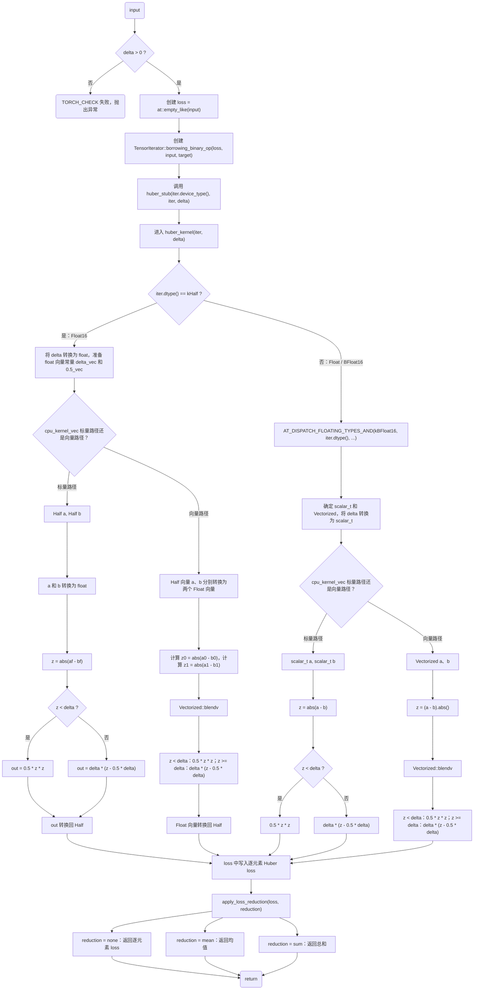
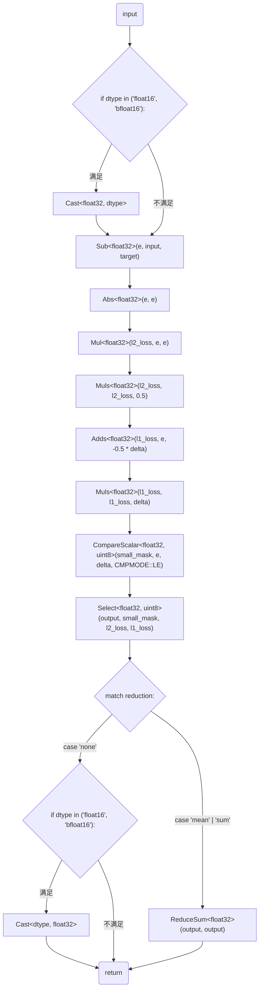

# 需求背景
## 需求来源
## 背景介绍
### huber_loss算子实现
基于huber_loss算子PyTorch版本使用Ascend C编程语言进行实现。

huber_loss算子（PyTorch）实现链接和相关API链接

huber_loss算子实现链接为：https://github.com/pytorch/pytorch/blob/main/aten/src/ATen/native/cpu/BinaryOpsKernel.cpp

huber_loss算子实现中的API链接：https://github.com/pytorch/pytorch/blob/main/aten/src/ATen/native/Loss.cpp
### huber_loss算子PyTorch实现现状分析
通过对huber_loss算子PyTorch版本的功能分析，当前支持的能力如下：

| 参数        | 参数含义       | 数据类型   | 支持数据类型                     | 约束 | 形状       |
|-----------|------------|--------|----------------------------|----|----------|
| input     | 输入tensor   | tensor | float32, float16, bfloat16 | 无  | (N,…)    |
| target    | 输入tensor   | tensor | float32, float16, bfloat16 | 无  | (N,…)    |
| reduction | 属性         | str    |                            | 无  |          |
| delta     | 属性         | float  |                            | 无  |          |
|           | 输出tensor   | tensor | float32, float16, bfloat16 | 无  | (N,…)或标量 |

PyTorch版huber_loss算子的整体流程图如下图所示：

### huber_loss算子功能分析
huber_loss算子功能：计算input与target的逐元素Huber损失，并按reduction模式做归约输出

输入：input、target

属性：reduction、delta

输出：output

支持数据类型：float32、float16、bfloat16

支持广播：不支持
# 需求分析
## 需求描述
使用Ascend C编程语言实现huber_loss算子，支持float32、float16、bfloat16数据类型，不支持广播功能。
## 需求拆解
1. 支持float32、float16、bfloat16数据类型
2. 不支持广播功能
3. 性能达到80%的compute bound或者memory bound。
# 详细设计
## 算子分析
### 数学公式
对于大小为 $N$ 的输入，未归约的 Huber loss 可表示为：

$$
\ell(input, target) = L = \{l_1, ..., l_N\}^T
$$

其中

$$
l_n =
\begin{cases}
0.5(input_n - target_n)^2, & \text{if } |input_n - target_n| < delta \\
delta * (|input_n - target_n| - 0.5 * delta), & \text{otherwise}
\end{cases}
$$

则

$$
output =
\begin{cases}
L, & \text{if reduction} = \text{'none'}; \\
\text{mean}(L), & \text{if reduction} = \text{'mean'}; \\
\text{sum}(L), & \text{if reduction} = \text{'sum'}.
\end{cases}
$$
### 支持数据类型
float32、float16、bfloat16
### 支持形状
不支持广播
## 算子实现
### 实现方案
#### 3.2.1 host侧设计：
1. tiling策略：算子计算过程不涉及数据的维度信息，故在host侧将数据视为一维向量，仅考虑数据个数，不考虑数据维度信息。
2. 分核策略：优先使用满核的原则，输入数据以512B为单位均分。
3. 核内切分策略：开启double buffer，tile块最大大小在均分UB空间且满足对齐约束的条件下设到最大，尾块可一并处理，无需额外参数。
4. tiling key规划策略：三种reduction对应设置tiling key为0/1/2。
#### 3.2.2 kernel侧设计：
1. 根据DTYPE_INPUT自动选择对应类型的模板函数，float16和bfloat16均需提升为float32计算。
2. 循环执行数据搬入（CopyIn）、计算（Compute）、搬出（CopyOut）三个阶段，Compute阶段根据模板数据类型调用相应的HuberLoss函数。
3. reduction不为0时，需要进行一次核间同步，处理各核的归约结果得到最终结果。
4. Ascend C的HuberLoss算子流程见下图。

## 支持硬件
| 支持的芯片版本         | 涉及勾选 |
|-----------------|------|
| Atlas A2 训练系列产品 | √    |
## 算子约束限制
- input 与 target 必须具有相同的 shape 和 dtype，不支持 broadcast。
- reduction 取值仅支持 0（none）、1（mean）、2（sum），其他值属非法输入。
- delta 必须为正数（> 0）。
- 输出 dtype 与 input/target 一致；reduction=mean 时内部累加建议提升至 FP32 计算后再转回输出 dtype，避免精度损失。
- fusion：当前作为独立 loss 算子实现，不涉及图融合。
# 可维可测分析
## 精度标准/性能标准
| 验收标准 | 描述(不涉及说明原因)                                                       | 标准来源               |
|------|-------------------------------------------------------------------|--------------------|
| 精度标准 | 与CPU aten::huber_loss结果对齐，float32双万分之一，float16双千分之一，bfloat16双千分之四 | AscendOpTest工具默认阈值 |
| 性能标准 | 达到80%的compute bound或者memory bound                                 |                    |
## 兼容性分析
新算子，不涉及兼容性分析
