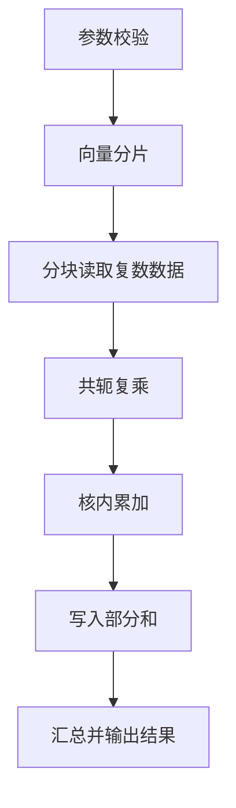
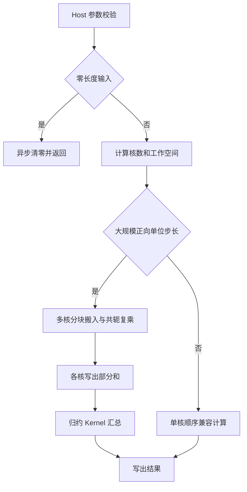

# aclblasCdotc 算子设计文档

## 一、需求背景

### 1.1 需求来源

面向 Ascend 950PR 实现 `aclblasCdotc`，在 ops-blas 句柄和 stream 机制下完成单精度复数向量的共轭点积计算。

### 1.2 背景介绍

#### 1.2.1 aclblasCdotc 算子实现优化

`aclblasCdotc` 对向量 `x` 取共轭后与向量 `y` 做点积。对于第 `i` 个复数元素，实部累加 `x.real × y.real + x.imag × y.imag`，虚部累加 `x.real × y.imag - x.imag × y.real`，最终输出一个 COMPLEX64 标量。

输入采用实部、虚部交错存储。`incx` 和 `incy` 以复数元素为单位，可分别使用正步长或负步长。

#### 1.2.2 aclblasCdotc 算子现状分析

##### 1.2.2.1 标杆算子支持的数据类型和数据格式

| 对象 | 数据类型 | 数据排布 | 逻辑形状 | 步长 |
| --- | --- | --- | --- | --- |
| `x` | COMPLEX64 | 实部、虚部交错 | `[n]` | 非零整数 |
| `y` | COMPLEX64 | 实部、虚部交错 | `[n]` | 非零整数 |
| `result` | COMPLEX64 | 单个复数标量 | `[1]` | 不适用 |

##### 1.2.2.2 标杆算子实现描述

标杆实现先校验输入参数，再将向量划分到多个 Vector Core。各核分块读取复数数据，完成共轭复乘和局部累加，将部分和写入工作空间，最后汇总为一个复数结果。

##### 1.2.2.3 标杆算子实现流程图

## 二、需求分析

### 2.1 外部组件依赖

| 依赖 | 使用阶段 | 用途 |
| --- | --- | --- |
| CANN ACL Runtime | 运行时 | 管理 handle、stream、异步清零和 Kernel 下发 |
| Ascend C Kernel API | Kernel | 完成数据搬运、LocalMemory 管理、向量计算和归约 |
| CPU 参考计算库 | 测试 | 生成精度参考结果 |
| GoogleTest | 测试 | 驱动精度、边界和性能用例 |

### 2.2 内部适配模块

| 模块 | 职责 |
| --- | --- |
| 公共接口 | 提供 `aclblasCdotc` 调用入口 |
| Host | 校验参数、处理零长度输入、计算分核并下发 Kernel |
| TilingData | 向 Kernel 传递长度、步长和使用核数 |
| Kernel | 完成数据读取、共轭复乘、局部累加和最终归约 |
| 测试 | 执行精度、边界和性能验证 |

### 2.3 需求模块设计

#### 2.3.1 Ascend C 算子原型

对外接口为 `aclblasCdotc(handle, n, x, incx, y, incy, result)`，返回 `aclblasStatus_t` 状态码。

| 参数 | 含义 |
| --- | --- |
| `handle` | ops-blas 句柄，提供 stream 和工作空间 |
| `n` | 参与计算的复数元素数量 |
| `x`、`y` | Device 侧 COMPLEX64 输入向量 |
| `incx`、`incy` | 两个输入向量的逻辑步长 |
| `result` | Device 侧 COMPLEX64 输出标量 |

计算任务异步下发到 handle 绑定的 stream。

#### 2.3.2 Ascend C 算子相关约束

- 支持 COMPLEX64 输入和输出；
- `n` 不小于 0；
- `n` 大于 0 时，输入、输出指针有效，`incx` 和 `incy` 不为 0；
- 正步长按地址递增访问，负步长从对应逻辑起点反向访问；
- `n` 等于 0 时返回零结果，不读取输入向量；
- 仅支持单向量输入和标量输出，不支持 batch、broadcast 和原地更新。

## 三、需求详细设计

### 3.1 调用方式

用户通过 `aclblasCdotc` 发起计算。Host 完成参数校验和分核计算后，根据输入规模和步长选择执行路径，并将 Kernel 下发到 handle 绑定的 stream。连续快路径依次执行局部计算和最终归约；兼容路径直接输出结果。

### 3.2 需求总体设计

实现包含两类主要执行路径。大规模、正向单位步长输入使用多核并行计算，以提高连续访存吞吐；小规模或非单位步长输入使用顺序兼容计算，以保持稳定的累加顺序。两类路径共用相同的参数校验和输出语义。

#### 3.2.1 Host 侧设计

##### 3.2.1.1 分核策略

连续快路径使用不超过向量长度的可用 AIV 核。设使用核数为 `C`，每核处理 `n / C` 个元素，并将余数依次分配给前若干核，使各核负载差不超过一个元素。

顺序兼容路径使用单个 AIV，按输入的逻辑顺序完成计算。

##### 3.2.1.2 数据分块和内存优化策略

连续快路径根据可用 LocalMemory 容量确定分块大小。输入 `x` 和 `y` 各使用双缓冲，当前块计算时预取下一块，使数据搬运与计算重叠。每核只向工作空间写出一个复数部分和，最终归约仅需读取实际使用核产生的数据。

顺序兼容路径按固定容量分块读取数据。单位步长每块处理 4096 个复数，非单位步长每块处理 1024 个复数；输入队列和输出缓冲的总占用不超过 248 KiB LocalMemory。负步长通过调整每块起点和块内访问方向维持逻辑顺序。

工作空间保存每个核的实部和虚部部分和，大小为 `2 × align_up(C, 8) × sizeof(float)`。

##### 3.2.1.3 tilingKey 规划策略

算子采用 Kernel 直调方式，数据类型固定为 COMPLEX64，因此不设置 tilingKey。运行时根据向量长度和步长选择 Kernel，TilingData 只传递计算所需的长度、步长和核数。

#### 3.2.2 Kernel 侧设计

##### 3.2.2.1 Kernel 侧实现描述

连续快路径由多个 AIV 分别处理连续区间。各核分块搬入 `x` 和 `y`，完成共轭复乘和局部归约，再把部分和写入工作空间。随后由同一 stream 上的归约 Kernel 汇总所有部分和并写出结果。

顺序兼容路径由单个 AIV 分块读取输入，按照逻辑元素顺序执行 FP32 共轭复乘和累加，完成后直接写出结果。非单位步长通过跨步搬运压缩到连续 LocalMemory，负步长在块内恢复逻辑顺序。

##### 3.2.2.2 Ascend C 实现流程图

##### 3.2.2.3 Ascend C 实现流程图与标杆算子流程图存在的差异点和原因

| 差异点 | 本实现 | 原因 |
| --- | --- | --- |
| 核数选择 | 根据向量长度和可用 AIV 核数动态确定 | 提高大规模输入的并行度并兼顾小规模输入 |
| 步长处理 | 支持正、负及混合步长 | 覆盖完整的向量访问方式 |
| 最终归约 | 局部计算与最终归约使用两个顺序下发的 Kernel | 避免跨核同步并简化执行时序 |
| 精度路径 | 小规模和非单位步长采用顺序累加 | 减少并行归约顺序变化带来的数值差异 |

### 3.3 支持硬件

| 项目 | 说明 |
| --- | --- |
| 支持产品 | Ascend 950PR |
| 编译架构 | arch35 / DAV_3510 |
| CANN 版本 | 9.1.0 |

### 3.4 算子约束限制

- 输入和输出位于 Device 内存；
- `result` 为独立的 COMPLEX64 标量；
- 步长单位为复数元素；
- 并行归约受 FP32 加法顺序影响，不保证与其他实现逐位一致；
- 接口异步执行，读取结果前需要同步对应 stream。

## 四、特性交叉分析

- 输入较大且连续时由多个计算核分段累加；输入较小或带有步长时，由一个计算核按元素原有顺序累加，减少加法顺序变化带来的误差。
- 步长为负时，从对应逻辑起点向低地址读取数据，保证参与计算的元素及其顺序正确。
- 计算当前数据块时提前读取下一块，分块大小根据 LocalMemory 容量确定，避免缓冲区超出可用空间。
- 每个计算核先将部分结果写入工作空间，最终归约在所有部分结果写入后执行；两步在同一 stream 中按顺序完成。
- 工作空间大小根据实际使用的计算核数量确定，Host 和 Kernel 采用一致的内存布局，避免越界或读取错位。

## 五、可维可测分析

### 5.1 精度标准/性能标准

精度测试分别比较结果的实部和虚部。FP32 结果采用相对误差 `2^-10`、绝对误差 `2^-16`，并限制误差不超过 `max(1e-2, 32 ULP)`；NaN 和 Inf 按特殊值类别比较。基础、步长、边界、特殊值和扩展精度用例均通过。

性能测试使用 ACL Event 采集 Kernel 耗时，预热后执行 100 次有效采样并取平均值。单位步长性能点如下：

| 规模 | n | incx | incy | 实测耗时（us） |
| --- | ---: | ---: | ---: | ---: |
| 1M | 1048576 | 1 | 1 | 7.748610 |
| 2M | 2097152 | 1 | 1 | 11.474650 |
| 4M | 4194304 | 1 | 1 | 18.773500 |
| 16M | 16777216 | 1 | 1 | 168.273582 |

四个性能点均完成稳定运行和计时。

### 5.2 兼容性分析

- 保持公共 API、复数类型、handle 和 stream 使用方式不变；
- 支持连续、非连续、正步长、负步长和混合步长输入；
- 零长度、空指针、非法长度和零步长均按接口约束处理；
- arch35 实现独立编译，不影响其他架构的既有实现。
