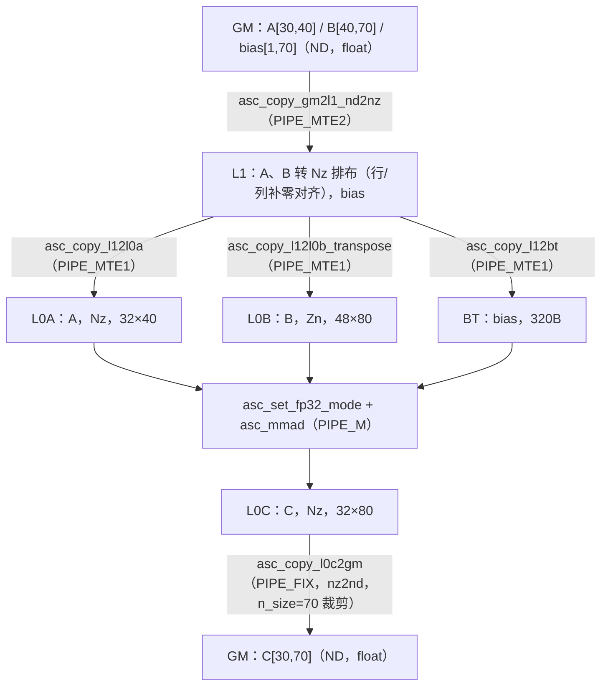

# MatMul（C = A × B + Bias）Cube-Core 算子设计文档

# 一、需求描述

## 1.1 需求来源

需求来源于《8月社区任务 - MatMul 算子开发任务书》（[asc_matmul_task_doc.md](https://gitcode.com/cann/cann-ops-competitions/blob/master/04_tasks/01_community-task-2026/docs/202608/asc_matmul_task_doc.md)）：基于 Ascend C C API 接口开发纯 Cube-Core 矩阵乘法算子 MatMul，对两个输入矩阵完成矩阵相乘运算，叠加偏置向量后输出结果矩阵。

数学公式：

$$C_{i,j} = \sum_{k=0}^{K-1} A_{i,k} \cdot B_{k,j} + \mathrm{bias}_j$$

算子规格定义（任务书 §2.2）：

| 参数名 | 类型 | 描述 | 数据类型 | Shape | 是否转置 |
|--------|------|------|----------|-------|----------|
| dst | Output | 目的操作数的起始地址，公式中的 C | FLOAT | [30, 70] | - |
| src0 | Input | 源操作数的起始地址，公式中的 A | FLOAT | [30, 40] | false |
| src1 | Input | 源操作数的起始地址，公式中的 B | FLOAT | [40, 70] | false |
| weight | Input | 源操作数的起始地址，公式中的 bias | FLOAT | [1, 70] | - |

核心约束（任务书 §2.3）：

- 使用 Cube-Core 单元完成计算；单核方案开发，无需处理分块（Tiling）相关逻辑；
- 禁止 Host 侧串行计算：严禁在 Host 侧使用 for 循环逐个元素运算，所有计算必须在 Device 侧批量完成；
- 内存安全：需合理分配 Local Memory，确保无缓冲区溢出风险；
- 功能逻辑与 Ascend C 官方算子库中的 matmul 实现完全对齐（带偏置矩阵）；
- 数据大小范围 [-100, 100]，计算精度满足《生态算子开源精度标准》；
- 适配硬件 Ascend 950，CANN 版本 >= 9.1.0。

## 1.2 需求分析

由算子规格可得维度定义：**M = 30，K = 40，N = 70**，即 A[M, K] = [30, 40]，B[K, N] = [40, 70]，bias[1, N] = [1, 70]，C[M, N] = [30, 70]，输入/输出均为 float32，A/B 均不转置。

一次完整的矩阵乘法涉及的数据搬运过程为：Global Memory → L1 Buffer → L0A / L0B / BiasTable Buffer →（Cube 计算）→ L0C Buffer → Global Memory。各存储单元的数据排布格式如下表所示。

**表1 不同存储单元的数据排布格式**

| 存储单元 | 数据排布格式 |
|----------|--------------|
| Global Memory（GM） | 输入 A、B 矩阵和输出 C 矩阵为 ND 排列 |
| L1 Buffer（L1） | A、B 矩阵为 Nz 排列 |
| L0A Buffer（L0A） | A 矩阵为 Nz 排列 |
| L0B Buffer（L0B） | B 矩阵为 Zn 排列 |
| BiasTable Buffer（BT） | Bias 是 shape 为 [N] 的一维 Tensor |
| L0C Buffer（L0C） | C 矩阵为 Nz 排列 |

需求的技术难点集中在 **float32 数据类型在 Cube 数据流各环节的差异化行为**上（float 的分形规格、转置约束、Mmad 读取对齐规则均与 int8_t/bfloat16 不同），以及 **B 不转置时 L1(Nz) → L0B(Zn) 的片上阵列转置**。难点逐条分析见 §2.1.8。实现基于官方自验证样例 `examples/02_simd_c_api/03_c_api/03_matrix_compute/mmad` 扩展（对应任务书 §3 的自验证计划）。

---

# 二、方案设计

## 2.1 接口内部实现

### 2.1.1 整体计算流程

算子采用单核、单趟（无 Tiling）方案：A/B/bias 全量一次性装入片上 Buffer，调用一次 `asc_mmad` 完成全部计算，结果一次性搬回 GM。四阶段流水线如下：



图1 算子整体数据流图

### 2.1.2 数据排布与对齐规格（float 特有）

float（32bit）类型的分形规格与 int8_t/bfloat16 均不同，这是本任务全部参数推导的出发点：

**表2 float 类型的分形规格**

| 项 | 取值 | 说明 |
|----|------|------|
| C0_SIZE | 32B / 4B = **8** | 一个 DataBlock 容纳 8 个 float（int8_t 为 32，bfloat16 为 16） |
| L1 / L0A 分形（Nz） | **[16, 8]**，128 元素（512B） | 大 N（列主序）套小 z（行主序） |
| L0B 分形（Zn） | **[8, 16]**，128 元素（512B） | 大 Z（行主序）套小 n（列主序） |
| L0C 分形（Nz） | [16, 8] | 输出 float 时同样按 C0=8 组织 |

GM→L1 的 `asc_copy_gm2l1_nd2nz` 搬运遵循：行方向对齐到 16、列方向（最内层）对齐到 C0=8，**填充值一律为 0**。各矩阵在 L1 上的分配尺寸与有效填充尺寸如下（分配尺寸需额外满足 §2.1.4 转置搬运的对齐要求）：

**表3 L1/L0 Buffer 尺寸推导（M=30, K=40, N=70）**

| Buffer | 逻辑 Shape | 分配尺寸（元素） | nd2nz 实际填充 | 推导 |
|--------|-----------|------------------|----------------|------|
| A L1 | [30, 40] | CeilAlign(30,16) × CeilAlign(40,8) = 32 × 40 = **1280** | 32 × 40（行 30→32 补零 2 行；列 40 已是 C0 整数倍） | 行对齐 16、列对齐 C0 |
| B L1 | [40, 70] | CeilAlign(40,16) × CeilAlign(70,16) = 48 × 80 = **3840** | 48 × 72（行 40→48 补零 8 行；列 70→72 补零 2 列；[72, 80) 列未填充） | N 轴按 16 对齐是转置约束，见 §2.1.4 |
| bias L1 | [1, 70] | **80** | 72（列 70→72 补零） | [1, N] 单行 Nz |
| A L0A | [30, 40] | 32 × 40 = **1280**（10 个 [16,8] 分形） | - | 整块复制 |
| B L0B | [40, 70] | 48 × 80 = **3840**（30 个 [8,16] 分形） | - | Nz→Zn 转置 |
| C L0C | [30, 70] | CeilAlign(30,16) × CeilAlign(70,16) = 32 × 80 = **2560** | - | M 对齐 16、N 对齐 16 |

### 2.1.3 阶段一：GM → L1（ND → Nz）

使用 `asc_set_gm2l1_nz_para` + `asc_copy_gm2l1_nd2nz`。其中 `nz_para` 为 64bit 位域寄存器配置（bit48-63：dst_nz_matrix_stride；bit32-47：dst_nz_c0_stride，目的 Nz 相邻分形列的间隔，粒度为 16 元素；bit16-31：dst_nz_n_stride；bit0-15：dst_nd_num）。三个输入的配置与搬运参数如下：

**表4 GM → L1 参数表**

| 参数 | A | B | bias |
|------|---|----|------|
| nz_para config | (0<<48) \| (32<<32) \| (1<<16) \| 1 | (0<<48) \| (48<<32) \| (1<<16) \| 1 | (0<<48) \| (1<<32) \| (1<<16) \| 1 |
| dst_nz_c0_stride | CeilAlign(M,16) = 32 | CeilAlign(K,16) = 48 | 1（单列分形） |
| loop1_src_stride | K × 4B = 160B | N × 4B = 280B | N × 4B = 280B |
| n_value | M = 30 | K = 40 | 1 |
| d_value | K = 40 | N = 70 | N = 70 |
| loop4_src_stride / smallc0_en | 0 / false | 0 / false | 0 / false |

### 2.1.4 阶段二：L1 → L0A / L0B / BT

**A → L0A**（`asc_copy_l12l0a`，Nz 整块复制）：

| m_start | k_start | m_step | k_step | src_stride | dst_stride |
|---------|---------|--------|--------|------------|------------|
| 0 | 0 | CeilDiv(M,16) = 2 | CeilDiv(K,8) = 5 | 2 | 2 |

**B → L0B**（`asc_copy_l12l0b_transpose`，Nz → Zn 片上阵列转置）——**本算子核心难点之一**：

B 不转置存放于 GM（[K, N] = [40, 70]），经 nd2nz 到 L1 后是 [K, N] 的 Nz 排布（分形 [16(K), 8(N)]）；而 L0B 要求 Zn 排布（分形 [8(K), 16(N)]），必须使用转置搬运接口。32bit 数据转置时，每次迭代以 16×16×4B 方块为单位（N 方向合并 2 个源分形），因此 **k_step 必须为 2 的倍数**，即 N 轴必须按 BLOCK_CUBE(16) 对齐——这就是表3 中 B L1 按 48 × 80 分配（而非 nd2nz 填充的 48 × 72）的原因。参数如下：

| 参数 | 取值 | 含义 |
|------|------|------|
| m_start / k_start | 0 / 0 | 起始分形坐标 |
| m_step | CeilDiv(K,16) = 3 | 源 Nz 行方向分形数（16 元素粒度） |
| k_step | CeilDiv(N,16) × (16/8) = 5 × 2 = **10** | 目的 N 方向步长（C0=8 元素 / 32B 粒度），为偶数满足 32bit 约束 |
| src_stride | 3 | 源 Nz 相邻分形列间隔（= K 方向分形行数） |
| dst_stride | 5 | 目的 Zn 相邻分形行间隔（= N 方向分形列数） |

**bias → BT**（`asc_copy_l12bt`）：len_burst 单位为 32B DataBlock，且搬运总字节数需按 2 个 DataBlock（64B）对齐：

$$\mathrm{len\_burst} = \mathrm{CeilAlign}\left(\mathrm{CeilDiv}(N \times 4B,\ 32B),\ 2\right) = \mathrm{CeilAlign}(9, 2) = 10$$

即搬运 10 × 32B = 320B（80 个 float，覆盖 N=70 及对齐填充区），n_burst = 1，source_gap = dst_gap = 0。

### 2.1.5 阶段三：Mmad 计算

```cpp
asc_set_fp32_mode();  // 清除 CTRL 寄存器 HF32 舍入模式位，保证 FP32 精确计算
asc_mmad(c_l0, a_l0, b_l0,
         /*left_height=*/M,      // 30
         /*n_dim=*/K,            // 40
         /*right_width=*/N,      // 70
         /*unit_flag=*/0,
         /*disable_gemv=*/true,
         /*c_matrix_source=*/true,   // C 矩阵初始值来源于 BT（Bias）
         /*c_matrix_init_val=*/false);
```

两个 float 特有的关键点：

1. **FP32 精确模式**：dav-3510 上 FP32 数据参与 Mmad 前可能处于 HF32 舍入模式（精度约 10bit 尾数），直接计算将无法满足精度标准。计算前调用 `asc_set_fp32_mode()` 清除 CTRL 寄存器的 HF32_MODE_BIT，保证全精度 FP32 乘累加。
2. **N 方向读取对齐规则**：`asc_mmad` 对 float 输入在 N 方向按 CeilAlign(right_width, 16) 读取分形，因此 `right_width` 直接传 N = 70 即可正确读入全部 5 个 N 方向分形（80 列）；**不需要**像同一样例中 int8_t 场景那样显式设置 right_width = CeilAlign(N, 2 × BLOCK_CUBE)（int8_t 场景若只传 N 会漏读含有效数据的分形，是该样例 README 图1 所示的经典陷阱）。float 场景下 M 方向按 CeilAlign(30,16)=32 行读取，K 方向 40 恰好为 C0=8 的整数倍，无填充参与计算。

### 2.1.6 阶段四：L0C → GM（Nz → ND）

`asc_set_l0c2gm_nz2nd(nd_num=1, src_nd_stride=0, dst_nd_stride=0)` 后调用 `asc_copy_l0c2gm`：

| 参数 | 取值 | 说明 |
|------|------|------|
| n_size | N = 70 | **裁剪 N 方向**：只搬出有效 70 列，剔除对齐引入的 [70, 80) 列 |
| m_size | M = 30 | **裁剪 M 方向**：只搬出有效 30 行，剔除补零行 |
| loop_dst_stride | N = 70 | GM 侧 ND 行间隔 |
| loop_src_stride | CeilAlign(M,16) = 32 | L0C 侧 Nz 分形行间隔 |
| nz2nd_en | true | 其余量化/relu/broadcast 等功能位均关闭 |

### 2.1.7 流水线同步设计

A、B、bias 三条输入链路各占一个事件号，MTE2 → MTE1 → PIPE_M 逐级 notify/wait，Mmad 前汇聚等待全部三个事件，计算完成后经 PIPE_FIX 搬出：

| 事件 | 链路 | notify/wait 序列 |
|------|------|------------------|
| EVENT_ID0 | A：GM→L1→L0A | MTE2→MTE1 notify → L0A 搬运前 wait → MTE1→M notify → Mmad 前 wait |
| EVENT_ID1 | B：GM→L1→L0B | 同上 |
| EVENT_ID2 | bias：GM→L1→BT | 同上 |
| EVENT_ID0（复用） | C：M→FIX | Mmad 后 notify → l0c2gm 前 wait |

核函数末尾 `asc_sync_pipe(PIPE_ALL)` 收尾，保证全部流水完成后退出。

### 2.1.8 实现难点与关键决策汇总

**难点1：float 分形规格突变，参数体系无法沿用既有场景。** int8_t 的 C0_SIZE=32（分形 [16,32]）、bfloat16 的 C0_SIZE=16（分形 [16,16]），而 float 的 C0_SIZE=8（L1/L0A 分形 [16,8]、L0B Zn 分形 [8,16]）。所有搬运接口的步长、step、buffer 尺寸均需按 C0=8 重新推导（见表2/表3），不能照搬样例中 int8_t/bfloat16 场景的参数。

**难点2：B 不转置时的片上 Nz→Zn 转置及 32bit 特有约束（核心难点）。** L0B 只接受 Zn 排布，而 B 不转置时 L1 上是 [K,N] 的 Nz 排布，必须使用 `asc_copy_l12l0b_transpose` 完成片上阵列转置。32bit 数据转置时 k_step 必须为 2 的倍数（每次迭代以 16×16×4B 方块为单位，N 方向合并 2 个源分形），因此 N=70 需向上对齐到 80 分配 L1/L0B buffer，k_step 取 CeilDiv(N,16)×2=10。该约束在 API 文档中仅针对 32bit 类型存在，16bit/8bit 场景无此限制。

**难点3：对齐引入的未初始化区及其安全性论证。** nd2nz 仅将 B 的列方向按 C0=8 补零到 72 列，而转置要求 N 方向按 16 对齐到 80 列，L1 上 [72,80) 列为未初始化数据。安全性论证：矩阵乘各输出列相互独立，垃圾列仅产生 C 的 [72,80) 垃圾列，由 `asc_copy_l0c2gm` 的 n_size=70 精确裁剪，有效列 [0,70) 的计算不受任何污染；同理 M 方向补零行（A 的 30→32 行）经 Mmad 后 C 对应行等于 bias 广播值，由 m_size=30 裁剪；K=40 恰好为 C0 整数倍，无 K 方向填充参与。该"无效数据参与计算、搬出时裁剪剔除"的设计哲学与官方样例 int8_t 场景一致，避免了对 L1 buffer 的显式清零操作（零额外开销）。

**难点4：asc_mmad 对 float 的 N 方向读取对齐规则与 int8_t 的陷阱差异。** int8_t 场景（样例 README 图1）若 right_width 直接传 N，Mmad 按 2×BLOCK_CUBE 组织分形读取会漏读含有效数据的分形，必须显式 CeilAlign(N, 2×BLOCK_CUBE)；而 float 场景 N 方向按 CeilAlign(right_width, 16) 读取，right_width 直接传 N 即可。二者行为差异需从 `asc_mmad` 文档的 k_direction_align 说明中逐字比对提取，属于文档理解的易用性难点。

**难点5：FP32/HF32 默认舍入模式陷阱。** dav-3510 的 CTRL 寄存器存在 HF32_MODE_BIT（bit 46），FP32 数据参与 Mmad 前若处于 HF32 模式会被舍入（尾数从 23bit 降至约 10bit），直接威胁双万分之一精度目标。该模式位是全局隐式状态，API 层无任何报错提示，属于典型的"结果错但无报错"陷阱；对策是在 Mmad 前显式调用 `asc_set_fp32_mode()`。

**难点6：GM→L1 的 nz_config 64bit 位域编码。** `asc_set_gm2l1_nz_para` 将 4 个字段打包进一个 uint64（bit48-63 matrix_stride / bit32-47 c0_stride / bit16-31 n_stride / bit0-15 nd_num），其中 c0_stride 的语义是"目的 Nz 相邻分形列的间隔（16 元素粒度）"，对 A/B/bias 三个 shape 各取 CeilAlign(M,16)=32 / CeilAlign(K,16)=48 / 1，位域错一位即静默错位。

**难点7：Bias 通路的字节对齐。** `asc_copy_l12bt` 的 len_burst 以 32B DataBlock 为单位且总量需 64B 对齐，N×4B=280B 需向上对齐到 320B（10 个 DataBlock）。

**难点8：三路输入的流水同步。** A/B/bias 三条 MTE2→MTE1→M 链路使用 EVENT_ID0/1/2 独立 notify/wait，Mmad 前汇聚等待三个事件，避免"先到先算"的数据竞争。

> 上述难点 2、4、5 在开发过程中均属于文档理解歧义/隐式行为类问题，已按任务书 §1.2 要求整理为易用性反馈，拟提交至 asc-devkit 仓库 Issue（链接：【待填写】）。

### 2.1.9 内存安全分析

| Buffer | 分配字节数 | 容量约束 |
|--------|-----------|----------|
| L1（A 1280 + B 3840 + bias 80，float） | 5120 + 15360 + 320 = 21248B | 远小于 L1 容量 |
| L0A | 1280 × 4B = 5120B | 远小于 L0A 容量 |
| L0B | 3840 × 4B = 15360B | 远小于 L0B 容量 |
| BT | 320B | 远小于 BT 容量 |
| L0C | 2560 × 4B = 10240B | 远小于 L0C 容量 |

全部 Buffer 尺寸由 `CeilAlign`/`CeilDiv` 编译期常量表达式推导，与 M/K/N 一一对应，无运行时越界写；所有搬运接口的读写区间均落在对应分配区间内（§2.1.8 难点3 已论证未初始化区只读不写、结果被裁剪）。

## 2.2 接口设计

### Kernel 侧接口

按任务书 §3 要求，核函数命名 `matmul_custom`（实现基于官方 mmad 样例工程扩展，工程内以 `SCENARIO_NUM` 编译参数选择本场景，交付时核函数名与任务书保持一致）：

```cpp
__global__ __cube__ void matmul_custom(__gm__ float* a, __gm__ float* b,
                                       __gm__ float* bias, __gm__ float* c);
```

**表5 核函数参数说明**

| 参数名 | 输入/输出 | 描述 |
|--------|-----------|------|
| a | 输入 | A 矩阵 GM 起始地址，float [30, 40]，ND，不转置 |
| b | 输入 | B 矩阵 GM 起始地址，float [40, 70]，ND，不转置 |
| bias | 输入 | 偏置向量 GM 起始地址，float [1, 70] |
| c | 输出 | C 矩阵 GM 起始地址，float [30, 70]，ND |

约束说明：单核方案（num_blocks = 1），无 Tiling；shape 为任务书固定规格 [M, K, N] = [30, 40, 70]，工程内以编译期常量表达；输入输出地址按 GM 对齐要求分配（Host 侧使用 aclrtMalloc）。

### Host 侧接口与流程

Host 主函数流程：aclInit → 申请 Host/Device 内存 → 读取输入文件（x1_gm.bin 4800B、x2_gm.bin 11200B、bias_gm.bin 280B）→ H2D 拷贝 → 启动 `matmul_custom<<<1, 0, stream>>>` → 同步 → D2H 拷回 → 写出 output.bin（8400B）→ 释放资源。Host 侧不做任何逐元素数值计算（满足任务书"禁止 Host 侧串行计算"约束）。

工程文件组织（基于官方 mmad 样例扩展）：

| 文件 | 职责 |
|------|------|
| mmad.asc | 主文件：公共常量、核函数入口（按场景分发）、Host main |
| mmad_s3.h | 本算子的常量与四阶段流水线函数 |
| scripts/gen_data.py | 输入数据与真值（golden）生成，数据范围 [-100, 100] |
| scripts/verify_result.py | 精度比对脚本 |

## 2.3 测试用例设计

精度 golden 使用 numpy float32 计算 `matmul(A, B) + bias`（与官方算子库 matmul 带偏置语义对齐），Device 输出与其逐元素比对。

**表6 测试用例表**

| 用例编号 | 测试项 | 输入描述 | 期望结果 |
|----------|--------|----------|----------|
| L0_001 | 任务书规格基线 | A[30,40]、B[40,70]、bias[1,70] 均 ~ U(-100, 100)，float32 | 与 golden 比对满足双万分之一精度标准 |
| L0_002 | 零 A 矩阵 | A 全 0，B/bias 随机 | C 精确等于 bias 按行广播 |
| L0_003 | 零 bias | bias 全 0，A/B 随机 | C == A × B，精度达标 |
| L0_004 | 满幅边界值 | A/B/bias 全部元素取 ±100 | 无溢出（K=40 累加上界约 4×10⁵，远在 float32 表示范围内），精度达标 |
| L0_005 | 正负抵消 | A/B 含正负混合随机值 | 累加抵消场景精度达标 |
| L0_006 | 确定性重复执行 | 同一输入连续执行 2 次 | 两次输出逐 bit 一致 |
| L0_007 | 非对齐覆盖 | 规格本身 M=30、N=70 即非 16 对齐（K=40 非 16 对齐） | 由 L0_001 天然覆盖，验证对齐/裁剪逻辑正确性 |

---

# 三、可维可测

## 3.1 精度标准/性能标准

| 验收标准 | 描述 | 标准来源 |
|----------|------|----------|
| 精度标准 | float32 数据类型双万分之一要求（1 万个数据中相对误差超过万分之一的不超过 1 个）；数据范围 [-100, 100]。本算子已显式启用 FP32 精确模式（asc_set_fp32_mode），K=40 累加与 numpy golden 的累加序差异引入的相对误差在 10⁻⁶ 量级，相对 10⁻⁴ 阈值有约两个数量级余量。真机实测结果：【待填写：max_rel_err / 超限点数 / 比对截图】 | 任务书 §3 精度要求 + 《生态算子开源精度标准》误差指标与通过标准 |
| 性能标准 | 无 | 任务书 §3 明示"性能要求：无" |

## 3.2 兼容性分析

本算子基于官方样例 `examples/02_simd_c_api/03_c_api/03_matrix_compute/mmad` 扩展实现，新增独立头文件与场景分支，不修改样例既有场景（int8_t / bfloat16）的任何行为，无存量兼容性/回归问题。目标平台为 Ascend 950PR / 950DT（dav-3510 架构），CANN 版本 9.0.0 ~ 9.1.0。
