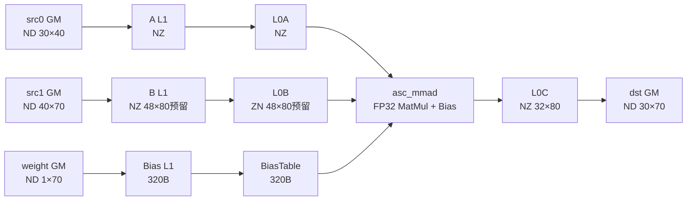

〖社区任务〗MatMul算子设计文档

# 一、需求背景（required）

## 1.1 需求来源

本需求来源于 CANN 2026 年 8 月社区任务“MatMul 算子开发”。

任务要求基于 Ascend C C API 开发纯 Cube-Core 矩阵乘法算子，完成两个 FP32 矩阵相乘并叠加 FP32 Bias，输出 FP32 结果矩阵。算子采用单核方案，无需处理多核切分和动态 Tiling。

设计文档评审 Issue 标题使用任务书规定格式：

```text
[Requirement|需求建议]: 〖社区任务〗MatMul算子设计文档评审申请
```

本设计选择任务书版本范围中的最高版本作为开发、自测和验收基线：

```text
硬件：Ascend 950PR / Ascend 950DT
架构：dav-3510
CANN：9.1.0
```

本文不声明兼容 CANN 9.0.0。若任务验收人员额外要求覆盖 9.0.0，再根据指定 Toolkit 和接口头文件补充兼容方案。

## 1.2 算子功能

算子实现：

$$
C_{i,j}=\sum_{k=0}^{K-1}A_{i,k}\times B_{k,j}+\mathrm{bias}_{j}
$$

其中：

- `src0` 对应矩阵 `A`；
- `src1` 对应矩阵 `B`；
- `weight` 对应偏置向量 `bias`；
- `dst` 对应输出矩阵 `C`；
- Bias 沿 M 轴广播，即 `bias[j]` 加到输出矩阵第 `j` 列的每一个元素上。

固定规格为：

| 参数名 | 输入/输出 | 含义 | 数据类型 | Shape | 是否转置 |
| --- | --- | --- | --- | --- | --- |
| `dst` | Output | 输出矩阵 C | FLOAT32 | `[30, 70]` | - |
| `src0` | Input | 输入矩阵 A | FLOAT32 | `[30, 40]` | false |
| `src1` | Input | 输入矩阵 B | FLOAT32 | `[40, 70]` | false |
| `weight` | Input | Bias | FLOAT32 | `[1, 70]` | - |

对应矩阵参数：

```text
M = 30
K = 40
N = 70
```

计算规模：

```text
MatMul：30 × 40 × 70 = 84,000 MAC
BiasAdd：30 × 70 = 2,100 次加法
```

Bias 通过 BiasTable 融合进 Mmad，不额外使用 Vector Core 执行逐元素 Add。

## 1.3 设计目标

本设计需要满足：

1. 使用 Ascend C C API；
2. 使用 Cube-Core 完成矩阵乘加；
3. Kernel 只启动一个 Block；
4. Host 侧不使用 `for` 循环逐元素完成算子计算；
5. A、B 均为数学意义上的非转置输入；
6. 输入、Bias 和输出均为 FP32；
7. 固定 Shape，不设计 Host Tiling；
8. 合理规划 L1、L0A、L0B、BiasTable、L0C，避免 Local Memory 越界；
9. 精度满足生态算子开源精度标准；
10. 基于 CANN 9.1.0 和 Ascend 950 完成编译、仿真及上板自测。

# 二、需求分析（required）

## 2.1 参考实现分析

官方 `mmad` C API 样例给出了完整 Cube 流水：

```text
GM ND
  ↓ asc_copy_gm2l1_nd2nz
L1 NZ
  ↓ asc_copy_l12l0a / asc_copy_l12l0b_trans / asc_copy_l12bt
L0A NZ / L0B ZN / BiasTable
  ↓ asc_mmad
L0C NZ
  ↓ asc_copy_l0c2gm + NZ2ND
GM ND
```

官方样例当前主要覆盖：

1. int8 输入、int32 输出、A/B 不转置、带 Bias；
2. bfloat16 输入、float 输出、B 已转置、不带 Bias。

本任务为：

```text
float × float → float
A/B 均不转置
带 float Bias
A=[30,40]，B=[40,70]，C=[30,70]
```

因此只复用官方样例的流水组织、同步机制和接口组合，不直接复用 int8 或 bfloat16 场景中的分形常量、Buffer 大小和特殊 `right_width` 对齐方式。

## 2.2 关键技术点

### 2.2.1 FP32 Cube 分形

一个 Cube 基础分形占 512 Byte。

FP32 元素大小为 4 Byte，因此：

```text
C0 = 512 / 16 / 4 = 8
```

FP32 的一个基础分形可表示为 `16 × 8` 个元素。

对于 `asc_copy_l12l0b_trans`，FP32 每次迭代处理两个连续的 `16 × 8` 分形，组合为一个完整 `16 × 16` 方块完成转置。因此，B 的转置搬运空间不能只按 N 对齐到 8，而需要按 K、N 均对齐到 16进行保守分配。

### 2.2.2 非对齐维度

固定维度为：

```text
M = 30
K = 40
N = 70
```

对齐结果：

```text
M_ALIGN_16 = 32
K_ALIGN_8  = 40
K_ALIGN_16 = 48
N_ALIGN_8  = 72
N_ALIGN_16 = 80
```

其中：

- A 的 L0A 分形按 `M_ALIGN_16 × K_ALIGN_8` 分配；
- B 经 FP32 `asc_copy_l12l0b_trans` 时按完整 `16 × 16` 方块处理，因此 B L1 和 L0B 均按 `K_ALIGN_16 × N_ALIGN_16` 分配；
- L0C 按 `M_ALIGN_16 × N_ALIGN_16` 分配；
- Mmad 使用逻辑尺寸 `M=30、K=40、N=70`；
- Fixpipe 只搬出 `[30,70]` 有效输出。

### 2.2.3 Bias 搬运

Bias 有效数据量：

```text
70 × sizeof(float) = 280 Byte
```

BiasTable 搬运按 32 Byte Burst 组织，并将 Burst 数补齐到偶数：

```text
ceil(280 / 32) = 9 Burst
AlignUp(9, 2) = 10 Burst
Bias Buffer = 10 × 32 = 320 Byte
```

因此 Bias L1 和 BiasTable 按 320 Byte 规划。

第 70～79 个补齐位置不属于逻辑 Bias，也不会写入有效输出。实现阶段仍需通过全零 A/B 和特征化 Bias 用例确认尾部补齐不会影响前 70 列。

## 2.3 实现范围

本设计包含：

- 固定 Shape FP32 MatMul + Bias；
- 单核、单 Tile；
- GM、L1、L0A、L0B、BiasTable、L0C 间搬运；
- FP32 Mmad；
- L0C NZ 到 GM ND 的结果搬出；
- 精度、内存安全、稳定性和基础性能测试。

本设计不包含：

- 动态 Shape；
- Host Tiling；
- 多核切分；
- Batch MatMul；
- A/B 转置属性泛化；
- 多数据类型泛化；
- K 轴多轮分块累加；
- Workspace；
- Vector Core 后处理。

# 三、需求详细设计（required）

## 3.1 总体方案

矩阵规模较小，A、B 和 C 均能一次性放入相应 Local Memory，因此采用：

```text
单核 + 单 Tile + 单次 Mmad + BiasTable 融合 + Fixpipe 直出
```

不进行 K 轴切分，也不使用双缓冲。当前只有一个完整 Tile，双缓冲不能形成跨 Tile 的稳定搬算重叠，反而增加内存占用和同步复杂度。

整体流程：



## 3.2 Host 侧设计

Host 侧只负责：

1. 初始化 ACL；
2. 设置 Device；
3. 创建 Stream；
4. 申请输入输出 Host/Device 内存；
5. 将输入搬至 Device；
6. 单核启动 Kernel；
7. 同步 Stream；
8. 将结果搬回 Host；
9. 释放资源。

Device 内存有效大小：

| Tensor | 元素数 | 字节数 |
| --- | ---: | ---: |
| `src0` | `30 × 40 = 1200` | 4800 B |
| `src1` | `40 × 70 = 2800` | 11200 B |
| `weight` | 70 | 280 B |
| `dst` | `30 × 70 = 2100` | 8400 B |

Kernel 启动方式：

```cpp
constexpr uint32_t NUM_BLOCKS = 1;

matmul_custom<<<NUM_BLOCKS, 0, stream>>>(
    src0Device,
    src1Device,
    weightDevice,
    dstDevice);
```

Host 侧可以生成输入、调用 Kernel 和执行 CPU Golden，但不得使用 Host 循环替代 Device 算子计算。

## 3.3 Kernel 接口设计

Kernel 原型：

```cpp
extern "C" __global__ __cube__ void matmul_custom(
    __gm__ float* src0,
    __gm__ float* src1,
    __gm__ float* weight,
    __gm__ float* dst);
```

固定编译期常量：

```cpp
constexpr uint32_t M = 30;
constexpr uint32_t K = 40;
constexpr uint32_t N = 70;

constexpr uint32_t BLOCK_CUBE = 16;
constexpr uint32_t C0_SIZE = 8;

constexpr uint32_t M_ALIGN_16 = 32;
constexpr uint32_t K_ALIGN_8 = 40;
constexpr uint32_t K_ALIGN_16 = 48;
constexpr uint32_t N_ALIGN_16 = 80;
```

Kernel 入口调用 `asc_init()`，随后依次完成：

1. GM → L1；
2. L1 → L0A / L0B / BiasTable；
3. FP32 Mmad；
4. L0C → GM。

## 3.4 Local Memory 规划

| Buffer | 格式 | 元素数 | 字节数 | 设计依据 |
| --- | --- | ---: | ---: | --- |
| A L1 | NZ | `32 × 40 = 1280` | 5120 B | M16、K8 |
| A L0A | NZ | `32 × 40 = 1280` | 5120 B | FP32 `16×8` 分形 |
| B L1 | NZ | `48 × 80 = 3840` | 15360 B | FP32 转置按 `16×16` 方块读取 |
| B L0B | ZN | `48 × 80 = 3840` | 15360 B | 3 个 K16 组 × 5 个 N16 组 × 2 个 512B 分形 |
| Bias L1 | 一维 | 80 | 320 B | 10 个 32B Burst |
| BiasTable | 一维 | 80 | 320 B | 仅前 70 个为逻辑 Bias |
| L0C | NZ | `32 × 80 = 2560` | 10240 B | M/N 均按 16 对齐 |

分存储区占用：

```text
L1  = 5120 + 15360 + 320 = 20800 B
L0A = 5120 B
L0B = 15360 B
L0C = 10240 B
BT  = 320 B
```

实现中增加编译期检查：

```cpp
static_assert(M > 0 && K > 0 && N > 0);
static_assert(K % C0_SIZE == 0);
static_assert(A_L1_BYTES % 512 == 0);
static_assert(A_L0_BYTES % 512 == 0);
static_assert(B_L1_BYTES % 512 == 0);
static_assert(B_L0_BYTES % 512 == 0);
static_assert(C_L0_BYTES % 512 == 0);
static_assert(BIAS_BYTES % 64 == 0);
```

同时检查各 Buffer 不超过 CANN 9.1.0 dav-3510 对应存储区容量。

## 3.5 GM 到 L1 搬运

### 3.5.0 ND2NZ 寄存器配置

`asc_copy_gm2l1_nd2nz` 执行前，必须针对 A、B、Bias 分别调用
`asc_set_gm2l1_nz_para`，不能沿用上一份输入的配置。

本任务固定使用以下配置：

```cpp
constexpr uint64_t GM2L1_NZ_CONFIG_A =
    (0ULL << 48) | (32ULL << 32) | (1ULL << 16) | 1ULL;

constexpr uint64_t GM2L1_NZ_CONFIG_B =
    (0ULL << 48) | (48ULL << 32) | (1ULL << 16) | 1ULL;

constexpr uint64_t GM2L1_NZ_CONFIG_BIAS =
    (0ULL << 48) | (1ULL << 32) | (1ULL << 16) | 1ULL;
```

对应十六进制值：

```text
A    = 0x0000002000010001
B    = 0x0000003000010001
Bias = 0x0000000100010001
```

其中 `[47:32]` 字段控制 L1 NZ 排布中 C0 组间的对齐步长：

```text
A：M_ALIGN_16 = 32
B：K_ALIGN_16 = 48
Bias：1
```

因此，三路 ND2NZ 的固定调用顺序为：

```cpp
asc_set_gm2l1_nz_para(GM2L1_NZ_CONFIG_A);
asc_copy_gm2l1_nd2nz(aL1, src0, ...);

asc_set_gm2l1_nz_para(GM2L1_NZ_CONFIG_B);
asc_copy_gm2l1_nd2nz(bL1, src1, ...);

asc_set_gm2l1_nz_para(GM2L1_NZ_CONFIG_BIAS);
asc_copy_gm2l1_nd2nz(biasL1, weight, ...);
```

B 的配置必须使用 48，确保其 L1 NZ 分形线性次序满足：

```text
src_index(n8, k16) = n8 × 3 + k16
```

上述寄存器编码以 CANN 9.1.0、dav-3510 接口定义为准，并通过 B L1
Dump 复核。若实际安装版本头文件的字段定义发生变化，以该版本头文件
和官方样例为准同步更新代码与文档。

### 3.5.1 A 矩阵

A 的逻辑 Shape 为 `[30,40]`，GM 中为 ND，L1 中转换为 NZ。

参数设计：

| 参数 | 取值 |
| --- | ---: |
| `loop1_src_stride` | `K × sizeof(float) = 160 B` |
| `n_value` | 30 |
| `d_value` | 40 |
| L1 M 方向预留 | 32 |
| L1 K 方向预留 | 40 |
| `smallc0_en` | false |

搬运结束后：

```text
asc_sync_notify(PIPE_MTE2, PIPE_MTE1, EVENT_ID0)
```

### 3.5.2 B 矩阵

B 的逻辑 Shape 为 `[40,70]`，GM 中为 ND，L1 中转换为 NZ。

参数设计：

| 参数 | 取值 |
| --- | ---: |
| `loop1_src_stride` | `N × sizeof(float) = 280 B` |
| `n_value` | 40 |
| `d_value` | 70 |
| L1 K 方向预留 | 48 |
| L1 N 方向预留 | 80 |
| `smallc0_en` | false |

B L1 为后续 FP32 `16×16` 转置预留完整的 `48×80` 空间。由于
ND2NZ 只覆盖逻辑 `[40,70]` 数据，不能假设其会自动把人为扩展到 80
列的尾部分形全部置零，因此采用“同步清零、再由 MTE2 覆盖有效数据”
的确定性方案。

`asc_fill_l1` 属于 `PIPE_MTE1`，而 `asc_copy_gm2l1_nd2nz` 属于
`PIPE_MTE2`。为避免两条流水并行执行产生清零覆盖有效数据的竞态，
本设计使用同步接口 `asc_fill_l1_sync`：

```cpp
asc_fill_value_config bFillConfig;
bFillConfig.repeat = 1;
bFillConfig.blk_num = 480;  // 15360 B / 32 B
bFillConfig.dst_gap = 0;

asc_fill_l1_sync(
    bL1,
    static_cast<uint32_t>(0),
    bFillConfig);
```

同步接口返回时，B L1 的 15360 B 清零已经完成。随后再执行：

```cpp
asc_set_gm2l1_nz_para(GM2L1_NZ_CONFIG_B);
asc_copy_gm2l1_nd2nz(
    bL1,
    src1,
    ...);

asc_sync_notify(
    PIPE_MTE2,
    PIPE_MTE1,
    EVENT_ID1);
```

完整顺序为：

```text
PIPE_MTE1：asc_fill_l1_sync(B L1, 0)
           ↓ 同步接口返回，清零已完成
PIPE_S：   asc_set_gm2l1_nz_para(GM2L1_NZ_CONFIG_B)
           ↓
PIPE_MTE2：asc_copy_gm2l1_nd2nz(B L1, src1)
           ↓
PIPE_MTE2 → PIPE_MTE1：EVENT_ID1
```

ND2NZ 只从 `src1` 的 11200 B 有效区读取 `[40,70]` 数据；由预清零保证
K 方向 40～47、N 方向 70～79 以及其他未覆盖位置保持为 0。该方案不从
GM 读取第 70 列之后的数据，也不依赖 Local Memory 的初始值。

实现代码提交前，使用：

```text
B[k,n] = 1000 × k + n
```

构造可追踪输入，并 Dump B L1，确认：

- 有效 `[40,70]` 元素位置正确；
- K 方向 40～47 为 0；
- N 方向 70～79 为 0；
- 未读取 GM 有效输入之外的数据。

### 3.5.3 Bias

Bias 的逻辑 Shape 为 `[1,70]`。

参数设计：

| 参数 | 取值 |
| --- | ---: |
| `loop1_src_stride` | `70 × sizeof(float) = 280 B` |
| `n_value` | 1 |
| `d_value` | 70 |
| Bias L1 预留 | 320 B |
| `smallc0_en` | false |

Bias 同样使用同步清零，避免 `PIPE_MTE1` 清零与 `PIPE_MTE2`
有效数据覆盖并发执行：

```cpp
asc_fill_value_config biasFillConfig;
biasFillConfig.repeat = 1;
biasFillConfig.blk_num = 10;  // 320 B / 32 B
biasFillConfig.dst_gap = 0;

asc_fill_l1_sync(
    biasL1,
    static_cast<uint32_t>(0),
    biasFillConfig);

asc_set_gm2l1_nz_para(GM2L1_NZ_CONFIG_BIAS);
asc_copy_gm2l1_nd2nz(
    biasL1,
    weight,
    ...);

asc_sync_notify(
    PIPE_MTE2,
    PIPE_MTE1,
    EVENT_ID2);
```

同步清零完成后，只从 GM 读取 70 个有效 FP32 元素并覆盖 Bias L1，
从而保证第 70～79 个补齐位置为 0。不得按 320 B 直接从 `weight`
越界读取。

## 3.6 L1 到 L0A、L0B 和 BiasTable

### 3.6.1 A：L1 → L0A

等待：

```text
asc_sync_wait(PIPE_MTE2, PIPE_MTE1, EVENT_ID0)
```

参数设计：

```text
m_start_position = 0
k_start_position = 0
m_step = ceil(M / 16) = 2
k_step = ceil(K / 8) = 5
src_stride = ceil(M / 16) = 2
dst_stride = ceil(M / 16) = 2
```

调用 `asc_copy_l12l0a` 后通知：

```text
asc_sync_notify(PIPE_MTE1, PIPE_M, EVENT_ID0)
```

### 3.6.2 B：L1 → L0B

等待：

```text
asc_sync_wait(PIPE_MTE2, PIPE_MTE1, EVENT_ID1)
```

FP32 转置的固定分组：

```text
K16_GROUPS = ceil(40 / 16) = 3
N16_GROUPS = ceil(70 / 16) = 5
每次迭代 = 16 × 16 × 4 B
每次迭代写入 2 个 512 B 分形
```

按照 B L1 的 NZ 分形次序和 L0B 的 ZN 分形次序推导：

```text
N8_GROUPS  = N_ALIGN_16 / 8  = 10
K16_GROUPS = K_ALIGN_16 / 16 = 3
N16_GROUPS = N_ALIGN_16 / 16 = 5
```

B L1 的源分形线性索引为：

```text
src_index(n8, k16) = n8 × K16_GROUPS + k16
```

固定第 `i` 个 K16 组时，第 `j` 个 N16 方块组合的两个源分形为：

```text
src_index(2j, i)     = 6j + i
src_index(2j + 1, i) = 6j + 3 + i
```

L0B 的目的分形线性次序按两个 K8 子分形分组：

```text
dst_index(k8, n16) = k8 × N16_GROUPS + n16
```

因此 `asc_copy_l12l0b_trans` 的 FP32 候选参数为：

```text
index_id     = 0
repeat       = 5
src_stride   = 6
dst_gap      = 0
dst_frac_gap = 4
src_frac_gap = 2

src_offset_per_k_group = 1 × 512 B = 512 B
dst_offset_per_k_group = 5 × 2 × 512 B = 5120 B
```

若使用 `float*` 指针做地址偏移，对应为：

```text
src element offset = 512 / 4 = 128
dst element offset = 5120 / 4 = 1280
```

固定循环在 Device Kernel 内执行：

```cpp
for (uint32_t i = 0; i < K16_GROUPS; ++i) {
    // 对第 i 个 K16 组执行 asc_copy_l12l0b_trans。
    // float* 源偏移按 128 个元素递增，
    // float* 目的偏移按 1280 个元素递增。
}
```

该循环用于片上分形搬运，不是 Host 侧逐元素计算。上述参数来自 FP32 分形地址公式推导，正式代码提交前仍需在 CANN 9.1.0 Simulator 或 Ascend 950 上 Dump B L1/L0B 验证。

调用完成后通知：

```text
asc_sync_notify(PIPE_MTE1, PIPE_M, EVENT_ID1)
```

在正式提交前，通过 CANN 9.1.0 Simulator 和 Ascend 950 Dump 验证上述 `src_stride`、偏移及目的分形顺序。若实际 9.1.0 头文件定义与本参数推导不一致，以该版本官方接口定义为准修改代码和文档，不兼容保留其他版本猜测。

### 3.6.3 Bias：L1 → BiasTable

等待：

```text
asc_sync_wait(PIPE_MTE2, PIPE_MTE1, EVENT_ID2)
```

参数：

```text
dst          = 0
conv_control = 0
n_burst      = 1
len_burst    = 10
source_gap   = 0
dst_gap      = 0
```

调用 `asc_copy_l12bt` 后通知：

```text
asc_sync_notify(PIPE_MTE1, PIPE_M, EVENT_ID2)
```

## 3.7 FP32 Mmad

Mmad 前等待三路输入准备完成：

```text
asc_sync_wait(PIPE_MTE1, PIPE_M, EVENT_ID0)
asc_sync_wait(PIPE_MTE1, PIPE_M, EVENT_ID1)
asc_sync_wait(PIPE_MTE1, PIPE_M, EVENT_ID2)
```

调用：

```cpp
asc_set_fp32_mode();
```

保证 FP32 输入按完整 FP32 模式参与矩阵运算，不启用 HF32。

Mmad 参数固定为逻辑矩阵尺寸：

| 参数 | 取值 | 含义 |
| --- | ---: | --- |
| `left_height` | 30 | M |
| `n_dim` | 40 | K |
| `right_width` | 70 | N |
| `unit_flag` | 0 | 不启用 unit flag；Kernel 设计中仅调用一次 Mmad |
| `disable_gemv` | true | 使用普通矩阵乘路径 |
| `c_matrix_source` | true | C 初值来自 BiasTable |
| `c_matrix_init_val` | false | 不清零 C，使用 BiasTable 初值 |

调用：

```cpp
asc_mmad(
    cL0,
    aL0,
    bL0,
    30,
    40,
    70,
    0,
    true,
    true,
    false);
```

不保留 `right_width=80` 作为备选方案。80 是 Buffer 对齐尺寸，不是本任务的逻辑 N；只有在 CANN 9.1.0 官方接口或实际最小复现明确要求时，才允许重新评估。

计算结束后：

```text
asc_sync_notify(PIPE_M, PIPE_FIX, EVENT_ID0)
```

## 3.8 L0C 到 GM

等待：

```text
asc_sync_wait(PIPE_M, PIPE_FIX, EVENT_ID0)
```

配置 NZ2ND：

```text
nd_num        = 1
src_nd_stride = 0
dst_nd_stride = 0
```

Fixpipe 核心参数：

| 参数 | 取值 |
| --- | ---: |
| `n_size` | 70 |
| `m_size` | 30 |
| `loop_dst_stride` | 70 |
| `loop_src_stride` | 32 |
| `l2_cache_ctl` | 0 |
| `clip_relu_pre` | 0 |
| `unit_flag_ctl` | 0 |
| `quant_pre` | 0 |
| `relu_pre` | 0 |
| `split_en` | false |
| `nz2nd_en` | true |
| `quant_post` | 0 |
| `relu_post` | 0 |
| `clip_relu_post` | false |
| `eltwise_op` | 0 |
| `eltwise_antq_en` | false |
| `c0_pad_en` | false |
| `broadcast_en` | false |
| `nz2dn_en` | false |

Fixpipe 只写出 `[30,70]` 有效 ND 数据，不能将 `[32,80]` 对齐区写入仅有 8400 B 的 `dst`。

Fixpipe 调用完成后，Kernel 返回前显式执行：

```cpp
asc_sync_pipe(PIPE_ALL);
```

保证 L0C→GM 的异步写回完成。

## 3.9 同步关系

完整 Event 生命周期：

| 数据/阶段 | 生产 Pipe | 消费 Pipe | Event |
| --- | --- | --- | --- |
| B L1 同步清零 | MTE1 | 当前线程继续 | `asc_fill_l1_sync` |
| Bias L1 同步清零 | MTE1 | 当前线程继续 | `asc_fill_l1_sync` |
| A：GM→L1 完成 | MTE2 | MTE1 | EVENT_ID0 |
| B：GM→L1 完成 | MTE2 | MTE1 | EVENT_ID1 |
| Bias：GM→L1 完成 | MTE2 | MTE1 | EVENT_ID2 |
| A：L1→L0A 完成 | MTE1 | M | EVENT_ID0 |
| B：L1→L0B 完成 | MTE1 | M | EVENT_ID1 |
| Bias：L1→BT 完成 | MTE1 | M | EVENT_ID2 |
| Mmad 完成 | M | FIX | EVENT_ID0 |
| Fixpipe 写回结束 | ALL | Kernel 返回 | `asc_sync_pipe(PIPE_ALL)` |

B L1 和 Bias L1 的清零使用 `asc_fill_l1_sync`，该操作属于
`PIPE_MTE1`，并在同步接口返回时完成；随后才向 `PIPE_MTE2` 提交
ND2NZ。因此清零与有效数据覆盖之间不存在跨流水竞态，也不需要额外的
MTE1→MTE2 Event。ND2NZ 完成后，再分别通过 EVENT_ID1 和 EVENT_ID2
通知 MTE1 进入后续 L1→L0B/BiasTable 搬运。

本 Kernel 只执行一次完整计算，不循环复用 Event，不存在跨 Tile 的 Event 重用。

## 3.10 性能设计

任务书无性能验收门槛，本设计仍采用低开销路径：

1. 单次 Mmad，不切分 K；
2. BiasTable 融合 Bias；
3. L0C 通过 Fixpipe 直接写 GM；
4. 固定 Shape，所有参数编译期常量化；
5. 单 Tile 不使用双缓冲；
6. 只保留必要流水同步；
7. 不使用 Vector Core 后处理。

由于矩阵规模较小，Kernel Launch 和搬运开销可能占比较高。自测报告分别记录：

- Kernel 时间；
- H2D + Kernel + D2H 端到端时间；
- 首次运行与预热后运行时间。

# 四、特性交叉分析（required）

## 4.1 与动态 Tiling 的关系

任务明确要求单核且无需处理 Tiling。本实现使用固定编译期常量，不创建 Host TilingData，不设置 TilingKey。

## 4.2 与多核并行的关系

Kernel 固定启动一个 Block，不进行 M、N 或 K 轴多核切分，不涉及核间同步和结果归并。

## 4.3 与 Vector Core 的关系

矩阵计算、Bias 融合和结果搬出均由 Cube 相关流水完成。Vector Core 不参与算子计算，满足纯 Cube-Core 要求。

## 4.4 与精度模式的关系

本任务全部使用 FP32，并显式调用 `asc_set_fp32_mode()`。不启用 HF32，不做 FP16/BF16 转换。

## 4.5 与官方样例的关系

代码基于 `asc-devkit` 官方 `mmad` 样例修改：

- 保留 GM→L1→L0A/L0B/BT→L0C→GM 流水；
- 保留 Event 同步组织；
- 将数据类型改为 FP32；
- 将逻辑规格改为 M=30、K=40、N=70；
- 修正 FP32 非转置 B 的分形和 Buffer；
- 将 Kernel 名称改为 `matmul_custom`；
- 不照搬 int8 场景的 `right_width` 特殊对齐。

# 五、可维可测分析（required）

## 5.1 精度验证

### 5.1.1 Golden

测试输入先按 FP32 生成和保存。

Golden 计算流程：

1. 读取 FP32 输入；
2. 将输入转换为 FP64；
3. 使用 FP64 完成 MatMul 和 BiasAdd；
4. 将 Golden 输出转换为 FP32；
5. 与 NPU FP32 输出比较。

该方式避免 Python/NumPy 默认类型差异造成 Golden 不一致。

### 5.1.2 判定标准

逐元素满足：

$$
|actual-golden|\le atol+rtol\times|golden|
$$

FLOAT32 阈值：

```text
rtol = 2^-10
atol = 2^-16
required_matched_ratio = 0.99
max_abs_error_limit = 1e-2 or 32 × ULP
```

用例同时满足以下条件才通过：

```text
matched_ratio ≥ 0.99
max_abs_error ≤ max_abs_error_limit
```

验证程序同时输出：

- 最大绝对误差；
- 最大相对误差；
- Matched Ratio；
- 最大误差索引；
- 不通过元素数量；
- Golden、Actual、绝对误差；
- ULP 距离；
- NaN/Inf 数量。

规则：

- 任务输入范围为有限值 `[-100,100]`，NPU 输出出现 NaN 或 Inf 直接判失败；
- Golden 接近 0 时使用混合容差公式，不单独做除法型相对误差判定；
- `32 × ULP` 按对应 Golden FP32 数值相邻可表示数间距计算；
- `1e-2 or 32 × ULP` 的具体取值逻辑严格复用 opbase 官方验证实现；若官方脚本已提供公共函数，优先直接调用，不自行改写语义。

## 5.2 精度测试用例

| Case | 输入构造 | 验证目的 |
| --- | --- | --- |
| P01 | A/B/Bias 均匀随机 `[-100,100]` | 任务规定的随机范围 |
| P02 | A/B/Bias 全 0 | 零输入、初始化 |
| P03 | A/B 全 0，Bias 为可追踪序列 | BiasTable 及广播方向 |
| P04 | B 前 40 列构造单位阵，其余列 0，Bias 0 | 矩阵索引和 B 排布 |
| P05 | A/B 为交替 `-100/100` | 正负大值累加 |
| P06 | 大项相消，使输出接近 0 | 绝对容差和累加误差 |
| P07 | A/B 稀疏，Bias 随机 | 零值和局部非零 |
| P08 | 输入位于 `[-1e-4,1e-4]` | 小数和近零输出 |
| P09 | B[k,n]=1000k+n，A 为单热点 | 定位 B 搬运和转置顺序 |
| P10 | 固定随机种子重复 10 次 | 结果稳定性 |

## 5.3 内存安全测试

重点检查：

1. B L1 和 L0B 按 15360 B 分配；
2. B 尾块不会读取 `src1` 有效 GM 区之外；
3. Bias GM 只读取 280 B；
4. Fixpipe 只写 `dst` 的 8400 B；
5. 各 Local Buffer 的目的分形不重叠；
6. Padding 不污染 `[30,70]` 有效输出。

建议调试阶段在以下区域增加 Guard/Sentinel：

| 区域 | Guard 建议 | 初值 |
| --- | ---: | --- |
| B L1 尾部 | 512 B | 固定非零模式 A |
| B L0B 尾部 | 512 B | 固定非零模式 B |
| L0C 尾部 | 512 B | 固定非零模式 C |
| dst GM 前后 | 各 256 B | 固定非零模式 D |

检查时机：

- GM→L1 后 Dump B L1；
- L1→L0B 后 Dump B L0B；
- Mmad 后 Dump L0C；
- Kernel 完成后检查 dst GM 两侧 Guard。

正式版本不保留调试 Guard，但保留对应测试用例。

## 5.4 编译和运行验证

基线环境：

```text
CANN 9.1.0
Ascend 950PR / Ascend 950DT
dav-3510
num_blocks = 1
```

验证顺序：

1. CANN 9.1.0 编译通过；
2. SIM Simulator 运行通过；
3. Ascend 950 NPU 运行通过；
4. 所有精度 Case 通过；
5. Guard/Sentinel 未变化；
6. 连续运行无超时、死锁和随机错误；
7. 保存编译日志、运行日志、精度结果和性能数据。

本文不把未执行的编译或上板验证描述为已经完成。设计文档可先提交评审；上述 Dump、Simulator 和上板结果在代码实现及自测阶段补齐，并根据评审意见回写文档。

## 5.5 性能测试

建议：

```text
Warmup：50 次
正式执行：1000 次
统计：Min、Avg、P50、P90、P99
```

性能无强制门槛，但测试报告需保留可复现命令和原始数据。

## 5.6 易用性问题记录

开发过程中若发现以下问题并能稳定复现，提交到 `asc-devkit` Issue：

- FP32、A/B 不转置、带 Bias 的完整样例缺失；
- FP32 `asc_copy_l12l0b_trans` 参数说明与实际行为不一致；
- ND2NZ 尾块 Padding 语义不清晰；
- BiasTable 非 32/64 Byte 对齐尾部处理说明不清晰；
- CANN 9.1.0 文档与头文件接口签名不一致。

易用性 Issue 标题按任务要求使用：

```text
〖AscendC CAPI社区任务〗问题简述
```

Issue 应附：

- CANN 版本；
- 硬件型号；
- 最小复现代码；
- 编译命令；
- 实际结果；
- 预期结果；
- 日志或 Dump；
- 建议修改方向。

## 5.7 交付路径

不同交付内容分别处理，不混用目录。

### 5.7.1 设计文档

设计文档通过 PR 提交到社区任务仓对应 MatMul tasklist：

```text
cann-ops-competitions/
└── 04_tasks/
    └── 01_community-task-2026/
        └── tasklist/
            └── <任务方最终发布的MatMul目录>/
                └── <团队名称>/
                    └── docs/
                        └── design.md
```

MatMul tasklist 精确目录以任务仓正式发布内容为准，不自行编造目录编号。

设计文档通过评审并合入后，再按任务要求在 `asc-devkit` 提交对应设计文档 Issue。

### 5.7.2 算子代码

代码 PR 目标：

```text
仓库：cann/asc-devkit
分支：master
目录：examples/02_simd_c_api/03_c_api/03_matrix_compute
```

具体是在现有 `mmad` 样例内扩展，还是新增 MatMul 子目录，以任务维护者和评审意见为准。设计阶段不自行假设最终子目录名称。

算子交付内容至少包括：

- Kernel 和 Host 代码；
- `matmul_custom` 调用；
- 数据生成脚本；
- 精度验证脚本；
- README；
- 编译和运行命令；
- 自测报告；
- 必要的易用性 Issue 链接；
- 个人代码仓链接、分支和算子目录；
- 在个人仓邀请 `Ascend-CANN` 账号作为开发者；
- 自测报告中的精度对比结果及截图；
- 自测报告中的性能数据及截图。

## 5.8 验收检查表

- [ ] 设计文档标题格式正确；
- [ ] 使用 CANN 9.1.0 基线；
- [ ] 使用 Ascend C C API；
- [ ] 使用纯 Cube-Core；
- [ ] 单核启动；
- [ ] A `[30,40]`、B `[40,70]`、Bias `[1,70]`、C `[30,70]`；
- [ ] A/B 数学意义上均不转置；
- [ ] 输入、Bias 和输出均为 FP32；
- [ ] Host 侧无逐元素算子计算；
- [ ] B L1/L0B 均按 15360 B 规划；
- [ ] B/Bias 使用 `asc_fill_l1_sync` 完成确定性清零；
- [ ] A/B/Bias 分别设置固定的 `asc_set_gm2l1_nz_para` 配置；
- [ ] B 的 NZ 步长字段固定为 48；
- [ ] Mmad 参数固定为 `30/40/70`；
- [ ] Bias 通过 BiasTable 融合；
- [ ] Fixpipe 只写 `[30,70]`；
- [ ] 无 GM 和 Local Memory 越界；
- [ ] CANN 9.1.0 编译通过；
- [ ] Simulator 和 Ascend 950 上板通过；
- [ ] 精度满足 opbase 标准；
- [ ] README、自测代码和自测报告完整；
- [ ] 设计文档和代码提交路径未混用。

# 参考资料

1. 8月社区任务——MatMul 算子开发任务书  
   https://gitcode.com/cann/cann-ops-competitions/blob/master/04_tasks/01_community-task-2026/docs/202608/asc_matmul_task_doc.md

2. Ascend C C API `mmad` 官方样例  
   https://gitcode.com/cann/asc-devkit/tree/master/examples/02_simd_c_api/03_c_api/03_matrix_compute/mmad

3. `asc_copy_l12l0b_trans` C API 文档  
   https://www.hiascend.com/document/detail/zh/canncommercial/latest/API/ascendcopapi/context/cube_datamove/asc_copy_l12l0b_trans.md

4. 生态算子开源精度标准  
   https://gitcode.com/cann/opbase/blob/master/docs/zh/ops_precision_standard/experimental_standard.md

5. 社区任务 2026 提交说明  
   https://gitcode.com/cann/cann-ops-competitions/blob/master/04_tasks/01_community-task-2026/README.md
