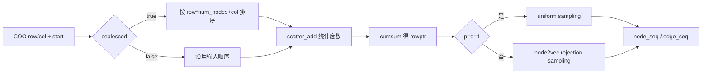
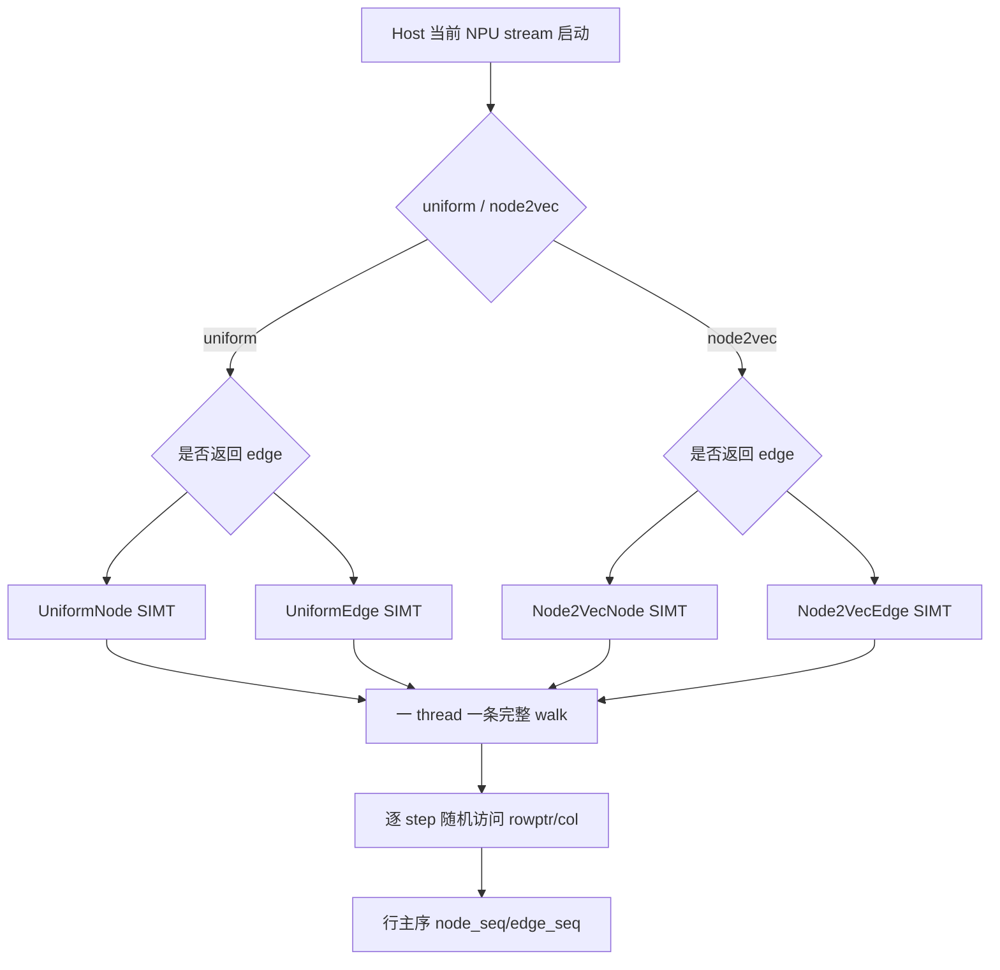
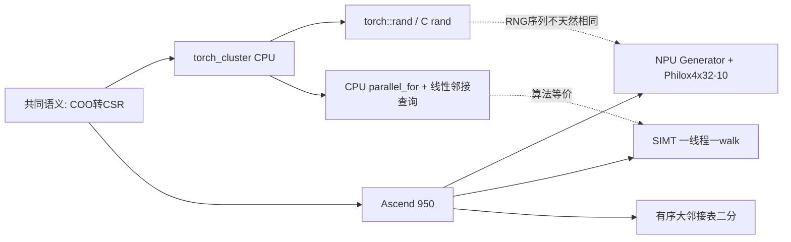

# RandomWalk 算子设计文档

> 状态：功能与性能实现完成，但尚未达到最终验收状态。2026-08-05 已在 Ascend 950PR 上完成
> clean build、CPU/NPU 功能回归和任务书四项性能测试，正式脚本退出码为 0；任务书第 7 节要求的
> CPU `torch_cluster` 固定 seed 单标杆 bit-wise 门禁尚未取得 PASS 证据。

# 需求背景（required）

## 需求来源

本设计对应 CANN 2026 年 8 月社区任务 `random_walk`，任务书版本固定为
`cann-ops-competitions@60ed83ec11a084d322b0a471213ac9bcf957aad3`。验收以 PyTorch 层
`random_walk()` 为准，目标仓库为 `cann/ops-gnn`，目标硬件为 Ascend 950PR（DAV_3510）。

## 背景介绍

RandomWalk 在 CSR 图上从多个起点生成固定长度的节点序列。`p=q=1` 时每一步均匀选择当前
节点的一条出边；其他取值使用 node2vec 二阶随机游走，候选节点按“返回上一节点、与上一节点
相邻、远离上一节点”三类权重进行拒绝采样。Python 层接收 COO `(row, col)`，负责排序和构造
CSR；NPU 扩展只执行 CSR 随机游走。

参考实现固定为：

- `torch_cluster/rw.py`：PyTorch API、COO 排序、`deg.scatter_add_` 和 CSR 构造；
- `torch_cluster/csrc/cpu/rw_cpu.cpp`：均匀采样、node2vec 拒绝采样、孤立节点语义；
- `torch_cluster/csrc/cuda/rw_cuda.cu`：一线程一条 walk 的 GPU 并行基线。

### 参考实现现状分析

CPU 均匀路径预生成 `torch::rand`；CPU node2vec 路径使用 C `rand()`，CUDA 两条路径又分别使用
PyTorch CUDA RNG 和 cuRAND。因此“固定 seed 与 CPU bit-wise 一致”并非跨后端自然成立，尤其
CPU node2vec 的 `rand()` 不受 `torch.manual_seed` 完整约束。任务书第 7 节明确要求 CPU 单标杆
bit-wise，一般注意事项又写有“允许统计等价验收（固定 seed 下 bit-wise）”；本设计按更严格的
第 7 节执行：算法语义、路径合法和同一 NPU seed 可复现只能作为辅助证据，不能替代 CPU
`torch_cluster` 单标杆逐位一致，未通过前不宣称精度验收 PASS。

# 需求分析（required）

## 需求描述

实现与 `torch_cluster.random_walk` 签名一致的 NPU 前向接口。输入和输出均为 int64；支持
`walk_length>=0`、`p>0`、`q>0`、`coalesced`、显式/自动 `num_nodes` 和可选边序列。孤立节点
后续节点保持不变，边索引为 -1。全流程不得将图或随机数回退到 CPU。

## 需求拆解

| 项目 | 范围与约束 |
| --- | --- |
| Python API | 复现任务书 9 参数签名；COO 排序、度数统计和 CSR 构造留在 NPU Python 层 |
| Host | 校验 int64/一维/同设备；申请输出；取得默认 NPU Generator 和当前 stream |
| Kernel | uniform 与 node2vec；节点输出与节点+边输出；孤立点和度 1 快路径 |
| 随机性 | Philox4x32-10；walk 间随机流隔离；固定 seed 可复现 |
| 硬件 | 仅首要适配 Ascend 950PR / DAV_3510；复杂分支使用 SIMT |
| 性能 | 四个任务用例均达到不少于 A100 标杆吞吐的 0.6 倍 |
| 测试 | TC-01 至 TC-07；CPU golden、NPU 功能、重复性、四项性能 |

# 详细设计（required）

## 算子分析

设当前路径为 `t -> v`，从 `v` 的邻接点中提议 `x`。权重为：

\[
\alpha(t,x)=\begin{cases}
1/p,&x=t\\
1,&x\ne t\ \text{且}\ (x,t)\in E\\
1/q,&\text{其他}
\end{cases}
\]

以 `M=max(1/p,1,1/q)` 为拒绝采样上界，提议均匀邻居后以 `alpha/M` 接受。`p=q=1`
单独进入无拒绝循环的 uniform 路径。

### 输入输出

| 参数 | 类型/形状 | 约束 |
| --- | --- | --- |
| row, col | int64 `[E]` | NPU、同设备、非负且小于 `num_nodes` |
| start | int64 `[S]` | NPU、`0 <= start[i] < num_nodes` |
| walk_length | int | `>=0` |
| p, q | float | 有限且 `>0` |
| node_seq | int64 `[S,L+1]` | 行主序 |
| edge_seq | int64 `[S,L]` | 可选；CSR/排序后 COO 的边位置，孤立步为 -1 |

`coalesced=True` 时每行目标节点有序，可对大度节点二分查询邻接关系；`coalesced=False` 时严格
保留输入边顺序，邻接查询始终线性扫描，以满足未按 `col` 排序输入的正确性。调用者仍需像
torch_cluster 一样保证边已按源节点分组。

## 算子实现

### Python 与 Host 侧设计

Python 按任务书执行 `argsort(row*num_nodes+col)`（可选）、`scatter_add_` 和 `cumsum`，随后调用
PyBind。Host 申请连续输出，不创建、不同步、不销毁私有 ACL stream，而使用
`c10_npu::getCurrentNPUStream(device).stream(false)`，保持 PyTorch 异步语义。随机状态通过
默认 NPU Generator 的 `philox_engine_inputs` 原子取得。

Host 把三个接受概率转成 `[0,2^32]` 整数阈值，kernel 只比较无符号整数，避免每次拒绝循环
进行浮点除法。`walk_length=0`、`S=0` 直接返回，不启动 kernel。

### Kernel 侧设计

DAV_3510 的 RegBase SIMD 适合规则向量，而本算子的下一访问地址依赖上一步采样结果，且
node2vec 含不定长拒绝循环，属于复杂控制流与随机 GM 访问。故采用 SIMT：一个 thread 负责
一条 walk，walk 间并行，step 在线程内串行。无需 TQue/UB 搬运；rowptr、col 依赖 DCache，
输出直接写 GM。该选择避免把随机访存伪装成低利用率的向量搬运。

分核公式（`T=256` 用于 uniform，`T=1024` 用于 node2vec）：

\[
blockDim=\max(1,\min(AIVCoreNum,\lceil S/T\rceil))
\]

uniform 路径每 block 启动 256 个 SIMT thread，node2vec 路径每 block 启动 1024 个 SIMT
thread；当 `S` 超过一次覆盖范围时，以全局 stride 继续处理。Host 按 `p/q` 和
`return_edge_indices` 分派四个模板实例，使 uniform 路径不承担 node2vec 分支，且仅在请求
`edge_seq` 时写边输出。边索引在采样时直接写出，因此即使 COO 中存在重复边，也返回实际被
采样的边位置，而不是按端点反查得到的第一条边。

### RNG 设计

使用 Random123 Philox4x32-10。key 由 64 位 seed 与调用 offset 混合；counter 高 64 位为
walk index，低 64 位为该 walk 内的 Philox block index。`__umulhi(random, degree)` 将
uint32 均匀映射到 `[0,degree)`，消除取模偏差。拒绝循环只消耗本 walk 的流，线程调度和其他
walk 的拒绝次数不会改变结果。CPU golden 使用同一常量、轮函数和 counter 映射，并以官方
已知向量 `6627E8D5 E169C58D BC57AC4C 9B00DBD8` 自检。

### 与基线差异

实现直接写 `[S,L]` 行主序。CUDA 基线采用步主序临时输出再转置；Ascend 950PR 实测表明当前
布局已满足全部四项性能门槛，因此不额外引入转置 kernel 和中间缓冲区。

## 支持硬件

| 支持的芯片版本 | 状态 |
| --- | --- |
| Ascend 950PR / DAV_3510 | 已完成 clean build、6 项 NPU pytest 与 4 项性能验收 |

## 算子约束限制

- 当前每个节点出度和总边数需不超过 `2^32-1`；
- `coalesced=False` 要求边已按源节点分组，但目标节点可无序；
- 仅前向；不提供反向；
- node2vec 在极端 `p/q` 下可能产生长拒绝循环，这是算法本身的尾延迟风险。

# 可维可测分析

## 精度标准/性能标准

| 验收标准 | 描述 | 标准来源 |
| --- | --- | --- |
| 功能 | TC-01 至 TC-07；形状、dtype、孤立点、边路径合法 | random_walk 任务书 |
| 随机性 | NPU 固定 seed 重复执行一致；分布与 CPU 标杆一致 | 任务书 + 实现可测性 |
| bit-wise | 固定 seed 下与 CPU `torch_cluster` 的 node_seq/edge_seq 逐位一致；当前尚未通过 | 任务书第 7 节 |
| 性能 | 吞吐不低于 A100 标杆的 0.6 倍，即延迟不高于标杆延迟/0.6 | random_walk 任务书 |

四项延迟门槛分别为 0.960 ms、1.182 ms、1.898 ms、3.112 ms（由任务书 A100 延迟除以
0.6，保留三位小数）。Ascend 950PR 正式验收实测如下，判定列以 PyTorch 层端到端中位数为准：

| E | walk_length | starts | A100 标杆/ms | 0.6 倍门槛/ms | 950PR 端到端中位数/ms | 相对 A100 速度 | 结果 |
| ---: | ---: | ---: | ---: | ---: | ---: | ---: | --- |
| 65,536 | 128 | 8,192 | 0.576 | 0.960 | 0.410631 | 1.402719x | PASS |
| 262,144 | 128 | 16,384 | 0.709 | 1.181667 | 0.714126 | 0.992821x | PASS |
| 524,288 | 128 | 32,768 | 1.139 | 1.898333 | 0.974346 | 1.168989x | PASS |
| 524,288 | 256 | 32,768 | 1.867 | 3.111667 | 1.678272 | 1.112454x | PASS |

## 测试矩阵

| Case | 配置 | 判据 |
| --- | --- | --- |
| TC-01 | `p=q=1` | 输出形状/路径正确，并与固定 seed CPU 单标杆 bit-wise 一致 |
| TC-02 | `p!=1` 或 `q!=1` | 路径与统计偏置正确，并与固定 seed CPU 单标杆 bit-wise 一致 |
| TC-03 | `return_edge_indices=True` | edge 与 node 相邻步严格对应 |
| TC-04 | `coalesced=False` | 已按 row 分组但 col 无序的图正确 |
| TC-05 | 孤立节点 | 节点保持，edge=-1 |
| TC-06 | `walk_length=0` | `[S,1]` 与 `[S,0]`，不启动 kernel |
| TC-07 | 四个大规模用例 | 达到门槛，保存原始日志与 TSV |

离线执行 `test/reference/random_walk_golden.py` 和 pytest；真机通过
`scripts/run_random_walk_950.sh` 完成环境快照、clean build、NPU 功能、重复性和性能，证据统一
归档且脚本不会关机。正式结果为 CPU golden PASS、CPU pytest 14/14、NPU pytest 6/6、性能
4/4 PASS、脚本退出码 0。

## 验证环境与门禁结果

| 项目 | 结果 |
| --- | --- |
| 硬件 | Ascend950PR，`npu-smi 25.7.rc1`，Health OK |
| CANN | `/home/developer/Ascend/cann-9.0.0-beta.2` |
| Python/PyTorch | Python 3.12.9，torch 2.7.1+cpu |
| torch_npu | 2.7.1.post8；镜像预置的早期开发版不支持该 950PR，未用于正式结果 |
| 构建 | clean build PASS |
| 功能 | CPU golden PASS；CPU pytest 14/14；NPU pytest 6/6；CPU 单标杆 bit-wise 尚未通过 |
| 性能 | 4/4 PASS |
| 正式脚本 | `exit_code=0`，完成时间 2026-08-05 00:04:47+08:00 |

## 兼容性分析

新增算子，不改变现有 API。Python 对外签名与 torch_cluster 一致；底层 PyBind 多接收一个内部
`neighbors_sorted` 标志，不对用户暴露。构建新增 torch_npu include 与 `libtorch_npu.so` 链接，
用于正确接入当前 NPU stream 和默认 Generator。

# 特性交叉分析

| 维度 | 覆盖组合 | 结论 |
| --- | --- | --- |
| 采样路径 | `p=q=1`；`p!=1`；`q!=1` | uniform 独立分支；node2vec 拒绝采样分支均已覆盖 |
| 输出模式 | 仅 `node_seq`；`node_seq + edge_seq` | 形状、dtype、边与相邻步对应关系均已覆盖 |
| 图预处理 | `coalesced=True/False` | 排序构建 CSR 与已按 row 分组、col 无序两类输入均覆盖 |
| 边界 | 孤立点、度 1、`walk_length=0`、空 start、非法 `p/q` | CPU/NPU 分层用例覆盖；孤立点节点保持且边为 -1 |
| 规模 | 65K~512K 边、8K~32K 起点、128/256 步 | 任务书四项性能规模全部通过 |
| 硬件/类型 | Ascend 950PR；int64 | 全程 NPU 图操作，无 float64 特征回退 |
