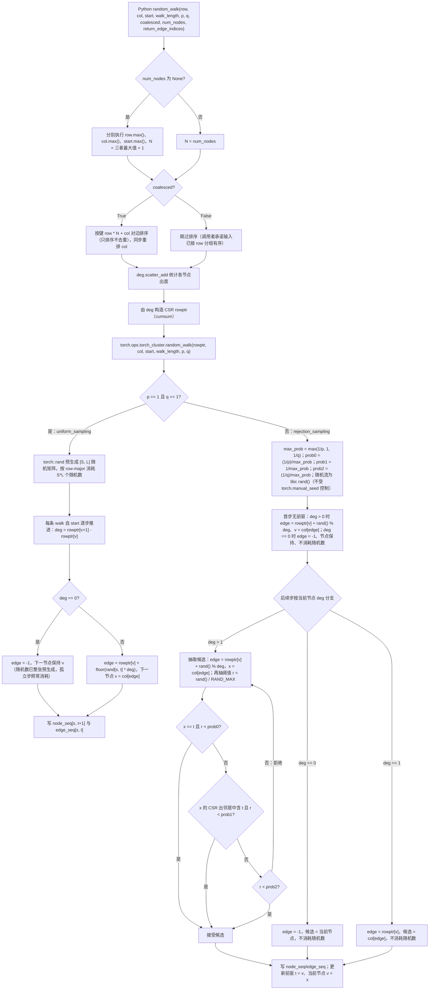
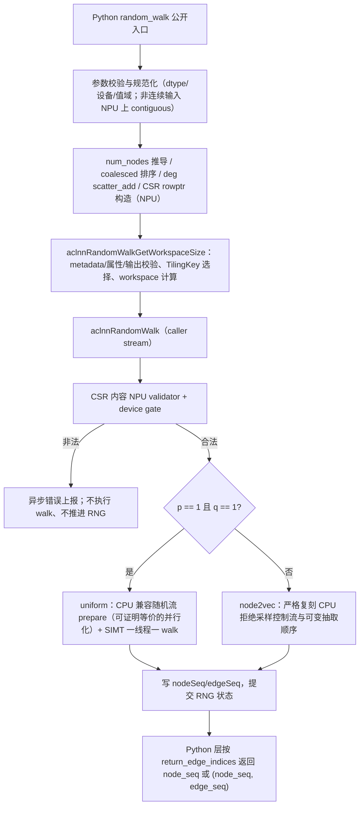

# random_walk 算子开发设计文档

## 一、需求背景

### 1.1 需求来源

2026 年 8 月社区任务要求实现与 `torch_cluster.random_walk`（https://github.com/rusty1s/pytorch_cluster ，版本 ≥ 1.6.0，本设计对齐 1.6.3）**接口完全一致**的 NPU 版本：在 CSR 图上从 `start` 节点出发，采样长度为 `walk_length` 的随机游走（支持 node2vec 偏置 `p`/`q`），完成算子设计、开发、测试和验收交付。目标仓为算子开源仓 `ops-gnn`（PR 路径 `ops-gnn/random_walk`，导出 API 名 `random_walk`），CANN 版本以该仓指定版本为准，适配硬件为 Ascend 950PR。验收口径以 PyTorch 层 `random_walk()` 为准。

### 1.2 背景介绍

#### 1.2.1 random_walk 算子现状分析

`random_walk` 是图神经网络中的随机游走采样算子：给定有向图 COO 边 `(row, col)`，经 Python 预处理构造 CSR（`rowptr`/`col`）后，从每个起点出发执行定长随机游走。当 `p=1, q=1` 时为均匀随机游走（`uniform_sampling`）；否则为 node2vec 二阶偏置拒绝采样（`rejection_sampling`，`p` 为返回上一节点（t→x→t）惩罚，`q` 为 BFS/DFS 插值）。输出为节点序列 `node_seq [S, walk_length+1]`，可选输出边索引序列 `edge_seq [S, walk_length]`。

torch_cluster 1.6.3 提供 CPU（`csrc/cpu/rw_cpu.cpp`）与 CUDA（`csrc/cuda/rw_cuda.cu`）参考实现，现状与本任务缺口如下：

| 维度 | 现状 | 本任务缺口 |
| --- | --- | --- |
| 运行平台 | CPU 实现（`rw_cpu.cpp`）与 CUDA 实现（`rw_cuda.cu`） | 无 Ascend NPU 实现，需基于 Ascend C 新增 NPU 算子 |
| 验收入口 | PyTorch 层 Python `random_walk()`，COO 预处理在 Python 层 | 接口完全一致的 NPU 版本，Python 预处理语义保持不变 |
| 内部执行边界 | `torch.ops.torch_cluster.random_walk(rowptr, col, start, walk_length, p, q)` 单次调用，仅接收 CSR | 提供正式 ACLNN 两段式内部接口，执行语义与参考实现对齐 |
| 数据类型 | row/col/start/输出均为 int64，无 float64 特征 | 保持 int64，全程 NPU，不涉及 float CPU 回退 |
| 采样语义 | uniform 用 `torch::rand`；node2vec 用 libc `rand()` 拒绝采样，含 t→x→t 惩罚与 q 插值的顺序接受判断 | NPU 侧复刻一致的采样控制流与固定随机流，固定 seed 下 bit-wise 一致 |

本任务为新增 NPU 算子，无 TBE 历史版本；功能、精度与性能对齐对象为 torch_cluster 1.6.3 CPU/CUDA 参考实现。

#### 1.2.2 现有实现流程图

下图为 torch_cluster 1.6.3 参考实现的忠实还原：上半部分为 `torch_cluster/rw.py` 的 Python 预处理链，下半部分为 `csrc/cpu/rw_cpu.cpp` 的采样控制流（含 `uniform_sampling` 与 `rejection_sampling` 的 t→x→t 惩罚与 q 插值接受判断顺序、孤立节点行为）。



> 说明：`rejection_sampling` 的三项接受判断是同一个随机阈值 `r` 下的顺序 `if / else-if` 控制流——`x == t` 未通过首项时仍可经邻接项或最终阈值项被接受，不能改写为严格互斥的教科书分类；拒绝后重新抽取候选与阈值，构成可变次数的随机数消耗。`edge_seq` 的非负值索引**有效排序后的 COO/CSR 边序** `[0, E)`，孤立/停止步为 `-1`。CPU 1.6.3 的 `walk_length=0` 路径存在除零崩溃，本任务按任务书 TC-06 以 `walk_length >= 0` 的明确语义覆盖，不复制上游缺陷。

## 二、需求分析

### 2.1 外部组件依赖

- ACLNN 框架：内部 CSR 执行边界以正式 `aclnnRandomWalkGetWorkspaceSize` / `aclnnRandomWalk` 两段式接口导出，复用 CANN 的 aclTensor、执行器与 stream 机制。
- PyTorch / torch_npu 扩展：公开验收入口为 Python `random_walk()`，经 pybind 调用内部两段式接口；COO 排序、度统计、CSR 构造等预处理在 NPU 张量上完成。

### 2.2 内部适配模块

| 模块 | 计划文件（`ops-gnn` 仓） | 设计职责 |
| --- | --- | --- |
| 公开 Python 包装层 | `python/ops_gnn/random_walk.py` | 公开签名、参数/设备校验、num_nodes 推导、coalesced 排序、CSR 构造、返回值裁剪 |
| pybind 绑定 | `csrc/pybind.cpp` | Python 到内部接口的桥接，导出 API 名 `random_walk` |
| 内部 ACLNN 接口层 | `csrc/npu/host/random_walk/aclnn_random_walk.cpp/.h` | 两段式接口：第一段 metadata/属性/输出校验与 workspace 计算，第二段 caller stream 执行 |
| Host 主体与随机状态管理 | `csrc/npu/host/random_walk/random_walk.cpp/.h`、`random_walk_rng_state.cpp` | TilingKey 选择、TilingData 打包、RNG 上下文管理 |
| Ascend C Kernel | `csrc/npu/kernel/random_walk/random_walk_kernel.cpp/.h`、`random_walk_simt.h`、`random_walk_rng_simt.h` 等 | CSR 校验、随机数生成、SIMT walk 等核函数 |
| 测试 | `test/test_random_walk.py` | 功能、精度（固定 seed bit-wise）与性能用例 |

### 2.3 需求模块设计

#### 2.3.1 算子原型

公开验收入口为 PyTorch 层接口（与 torch_cluster 原版签名完全一致）：

```python
def random_walk(
    row: Tensor,
    col: Tensor,
    start: Tensor,
    walk_length: int,
    p: float = 1,
    q: float = 1,
    coalesced: bool = True,
    num_nodes: Optional[int] = None,
    return_edge_indices: bool = False,
) -> Union[Tensor, Tuple[Tensor, Tensor]]: ...
```

其中 `coalesced`、`num_nodes`、`return_edge_indices` 属于公开 Python 包装层语义，不进入内部算子。内部算子（ACLNN 两段式 `aclnnRandomWalk`）只接收 CSR，算子原型如下：

| 名称 | 输入/输出/属性 | 含义 | 数据类型 | 数据格式 | 维度(shape) | 非连续Tensor |
| --- | --- | --- | --- | --- | --- | --- |
| rowptr | 输入 | CSR 行指针；长度 N+1，首值为 0，单调不降，末值为 E，值域 [0, E] | INT64 | ND | 1 维 [N+1] | × |
| col | 输入 | 有效排序 CSR 边的目标节点序列；长度 E，元素值域 [0, N) | INT64 | ND | 1 维 [E] | × |
| start | 输入 | S 条随机游走的起始节点；元素值域 [0, N) | INT64 | ND | 1 维 [S] | × |
| walkLength | 属性 | 随机游走步数 L，L >= 0 | INT64 | - | 标量 | - |
| p | 属性 | node2vec 返回上一节点（t→x→t）惩罚参数；有限正数；p=q=1 选择均匀路径 | DOUBLE | - | 标量 | - |
| q | 属性 | node2vec BFS/DFS 插值偏置参数；有限正数 | DOUBLE | - | 标量 | - |
| nodeSeq | 输出 | 节点序列；nodeSeq[s,0]=start[s]，随后记录每步到达的节点 | INT64 | ND | 2 维 [S, L+1] | × |
| edgeSeq | 输出 | 有效 CSR 边索引序列，非负值范围 [0, E)；孤立步为 -1 | INT64 | ND | 2 维 [S, L] | × |

#### 2.3.2 算子相关约束

1. row/col/start/nodeSeq/edgeSeq 均为 INT64，无 float64 特征；格式 ND；rowptr/col/start 为一维连续张量，nodeSeq/edgeSeq 为二维连续张量。
2. 全部张量位于同一 Ascend 950PR/950DT 设备，全程 NPU，不涉及 float CPU 回退；仅验收前向。
3. `walk_length >= 0`；`p`、`q` 为有限正数；当且仅当 `p == 1 且 q == 1` 走均匀采样路径（`uniform_sampling`）。
4. CSR 内容契约：`rowptr[0]=0`、单调不降、`rowptr[N]=E`、`rowptr` 值域 [0, E]；`col`/`start` 节点 ID 值域 [0, N)。
5. 孤立节点（度为 0）：后续 `edge_seq = -1`，节点序列保持当前节点（与 CPU 一致）。
6. `walk_length = 0`：`node_seq = start[:, None]`（shape [S, 1]），`edge_seq` 为 INT64 shape [S, 0]，不消耗随机数（覆盖上游 1.6.3 该路径除零崩溃缺陷）。
7. 内部 ACLNN 直接调用不接受非连续 Tensor；公开 Python 层允许非连续一维 COO 输入，但先在 NPU 上做 contiguous 规范化，不回退 CPU。
8. 算子含随机性：均匀采样与拒绝采样均依赖 RNG；验收固定 seed，固定 seed 下输出与 CPU 标杆 bit-wise 一致。

## 三、需求详细设计

### 3.1 使能方式

| 上层调用/工具链 | 状态 |
| --- | --- |
| PyTorch 层 Python `random_walk()`（经 pybind → 内部 ACLNN 两段式） | 支持（唯一公开验收入口） |
| ACLNN 直调（内部 CSR 边界 `aclnnRandomWalk` 两段式） | 支持 |
| TF / ATC / GE 图模式 / torch.compile | 不涉及 |

### 3.2 需求总体设计

整体链路分三层：

1. 公开 Python 包装层：参数与设备校验、非连续输入 NPU 规范化、`num_nodes` 推导、`coalesced` 有效边排序、度统计与 CSR `rowptr` 构造、调用内部接口、按 `return_edge_indices` 裁剪返回值。
2. 内部 ACLNN 两段式接口层：第一段（GetWorkspaceSize）只校验 Host 可判定的 metadata/属性/输出契约，按 metadata 选择 TilingKey、计算 workspace、打包 TilingData，不读取 device 数据；第二段在调用者 stream 上先以 NPU validator 防御校验 CSR 内容并形成 device gate，校验通过后才执行随机数生成与随机游走，内容非法时异步报错且不推进 RNG。
3. Ascend C Kernel 层：CSR validator、随机数 prepare、SIMT walk、状态提交等核函数。

#### 3.2.1 host 侧设计

- **分核策略**：优先使用满核。可用 AIV 核数由 `GetCoreNumAiv()` 运行时动态获取，不写死核数；启动规模随起点数 S 自适应。walk 粒度并行：不同 walk 之间无数据依赖，一线程负责一条 walk；同一 walk 内步间为递推关系，严格串行以保持与 CPU 一致的随机数消费顺序。
- **数据分块与内存策略**：本算子访问模式为 INT64 离散间接访存（rowptr/col 按运行时节点索引 gather），主路径采用 SIMT 直接 GM/L2 访存，不做规则 GM↔UB tile 切分；workspace 按状态区、随机数区等功能分段并对齐，各段大小由第一段按 metadata 精确计算并做溢出检查。
- **TilingKey 规划策略**：dtype 仅 INT64，无 dtype key；按 shape 边界与采样路径分流，各 key 互斥、按优先级 first-match：

| TilingKey | 触发条件 | 执行策略 |
| --- | --- | --- |
| 空输出 | S = 0 | 校验后返回空输出，无计算 launch |
| 零步长 | S > 0, L = 0 | 拷贝 start 到 nodeSeq 首列，edgeSeq 为空 |
| 全孤立-uniform | S > 0, L > 0, E = 0, p = q = 1 | 精确推进 S*L 个随机数并填充保持节点/-1 |
| 全孤立-node2vec | S > 0, L > 0, E = 0, p ≠ 1 或 q ≠ 1 | 填充保持节点/-1 |
| 均匀路径 | S > 0, L > 0, E > 0, p = q = 1 | 随机数 prepare + 一线程一 walk 的 SIMT walk |
| node2vec 严格路径 | S > 0, L > 0, E > 0, p ≠ 1 或 q ≠ 1 | 严格复刻 CPU 拒绝采样控制流与可变抽取顺序 |

#### 3.2.2 kernel 侧设计

- **实现描述**：Kernel 侧按第二段 caller stream 上的固定顺序执行：CSR validator（校验 rowptr 首值/单调性/末值/值域与 col/start 值域）→ device gate（内容非法时阻断后续并异步上报，不执行有效 walk、不推进 RNG）→ 随机数阶段 → walk 阶段 → RNG 状态提交。各计算路径如下：
  - 均匀路径（p = q = 1）：prepare 阶段按 CPU 固定随机流的 row-major 顺序生成 [S, L] 随机矩阵；当 draw 量足够大时，prepare 采用可证明等价的并行化方案分段到多 AIV 并行，保证与 CPU 固定随机流逐位一致（小 draw 量走串行回退）；walk 阶段一线程负责一条 walk，按 `edge = rowptr[v] + floor(rand * deg)` 选边，直接写 row-major 输出。
  - node2vec 路径（p ≠ 1 或 q ≠ 1）：严格复刻 CPU `rejection_sampling` 的顺序 `if / else-if` 接受判断（t→x→t 惩罚 → 邻接项 → 最终阈值项）与拒绝后重新抽取造成的可变随机数消耗；p/q 阈值比较在 Host 侧按与 CPU 相同的运算顺序预计算为等价的整数阈值，Kernel 仅做整数比较，保证与 CPU double 判定逐项等价。
  - 边界路径：空输出、零步长、全孤立按上表专用 key 处理，随机数消耗口径与 CPU 一致。
- **本任务新实现流程图**：



- **现有实现与本任务新实现的差异点和原因**：

本任务为新增 NPU 算子，无 TBE 版本；对比对象为 torch_cluster 1.6.3 CPU/CUDA 参考实现。

| 维度 | 现有实现（torch_cluster 1.6.3 CPU/CUDA） | 本任务新实现（Ascend 950PR NPU） | 原因 |
| --- | --- | --- | --- |
| 运行平台 | CPU（`rw_cpu.cpp`）/ CUDA（`rw_cuda.cu`） | Ascend 950PR，全程 NPU，不涉及 CPU 回退 | 任务书要求 NPU 版本且全程 NPU |
| Python 预处理 | `rw.py`：num_nodes 推导 → coalesced 排序 → deg scatter_add → rowptr 构造 | 预处理链语义逐步保持一致，在 NPU 张量上完成 | 任务书要求 CSR 预处理在 Python 层、与原版一致 |
| 采样控制流 | `uniform_sampling` / `rejection_sampling` 实际代码控制流 | 逐分支保持一致：deg 0/1/>1 分流、t→x→t 惩罚与 q 插值的顺序接受判断、孤立节点行为 | 精度契约要求固定 seed 下与 CPU 标杆 bit-wise 一致 |
| 随机数来源 | uniform 用 `torch::rand`；node2vec 用 libc `rand()`（全局状态、可变抽取） | NPU 侧复刻 CPU 兼容随机流，消费顺序逐一对齐；seed 由内部状态管理，不作为公开参数 | 验收固定 seed bit-wise；公开签名与原版一致、不暴露 seed |
| 并行方式 | CPU 多线程按 walk 并行 | SIMT 一线程一 walk；uniform prepare 阶段采用可证明等价的并行化方案，保证与 CPU 固定随机流 bit-wise 一致 | 步间递推必须串行、walk 间天然独立；性能目标为 ≥ 0.6 倍 A100 标杆 |
| 内部执行边界 | `torch.ops.torch_cluster.random_walk` 单次调用 | 正式 ACLNN 两段式：第一段 metadata/属性/输出校验与 workspace 计算；第二段 caller stream 上 NPU 校验 CSR 内容后执行 | ACLNN 接口规范；第一段无 stream、无法观测 device 数据，CSR 内容校验须在第二段 device 侧完成 |
| walk_length=0 | CPU 1.6.3 该路径除零崩溃 | 明确语义：node_seq = start[:, None]、edge_seq 为 [S, 0]，不消耗随机数 | 任务书 TC-06 要求 walk_length ≥ 0，不复制上游缺陷 |

### 3.3 支持硬件

| 支持的芯片版本 | 涉及勾选 |
| --- | --- |
| Ascend 950PR | √ |
| Ascend 950DT | √ |

### 3.4 算子约束限制

1. 仅支持 INT64 张量、ND 格式；rowptr/col/start 一维连续，nodeSeq/edgeSeq 二维连续。
2. 全部张量须在同一 Ascend 950PR/950DT 设备；全程 NPU，不支持 CPU 回退；仅前向。
3. `walkLength >= 0`；`p`、`q` 为有限正数；`p = q = 1` 走均匀采样路径。
4. CSR 内容须满足 `rowptr[0]=0`、单调不降、`rowptr[N]=E`、值域 [0, E]，`col`/`start` 值域 [0, N)；内容非法时第二段异步报错，不执行有效 walk、不推进 RNG。
5. `edgeSeq` 非负值索引有效排序后的 CSR 边序 [0, E)，孤立步为 -1。
6. 内部 ACLNN 两段式直接调用不接受非连续 Tensor；`coalesced`、`num_nodes`、`return_edge_indices` 为公开 Python 层语义，内部接口不含这些参数。

## 四、特性交叉分析

| 交叉维度 | 设计关注点 | 应对策略 |
| --- | --- | --- |
| p/q 取值 | p=q=1 均匀采样与 node2vec 拒绝采样随机流、控制流不同 | TilingKey 分流，两条路径分别对齐 CPU 参考实现的采样控制流与随机数消耗 |
| 孤立节点 | deg=0 时节点保持、edge=-1，两条路径随机数消耗口径不同 | 各路径统一孤立语义；uniform 随机数整张预生成照常消耗，node2vec 孤立步不消耗 |
| walk_length=0 | 上游 1.6.3 除零崩溃 | 专用 key：node_seq=[S,1]、edge_seq=[S,0]，不消耗随机数 |
| 空输入（S=0/E=0/N=0） | 仅在显式 num_nodes 下合法；num_nodes=None 时三者任一为空报错 | Python 层校验拦截；专用 key 快速返回或填充 |
| coalesced=True/False | 是否按键 row*N+col 排序；False 表示调用者承诺已满足前置条件 | 纯 Python 层语义，不影响 Kernel |
| return_edge_indices | 返回 node_seq 或 (node_seq, edge_seq) | 内部恒生成双输出，Python 层裁剪返回值 |
| 随机性 | 默认调用随机 vs 验收固定 seed bit-wise | 内部 RNG 上下文管理固定随机流；固定 oracle（单线程 CPU + 双 seed）下逐元素 bit-wise 验收 |

## 五、可维可测分析

### 5.1 精度标准/性能标准

| 验收标准 | 描述 | 标准来源 |
| --- | --- | --- |
| 精度标准 | 算子计算精度需严格满足《生态算子开源精度标准（https://gitcode.com/cann/opbase/blob/master/docs/zh/ops_precision_standard/experimental_standard.md ）》，采用 AscendOpTest（https://gitcode.com/HIT1920/AscendOpTest ） 测试。真值生成方式：以 CPU 版 torch_cluster 为标杆；NPU 结果通过 PyTorch 层 `random_walk()` 调用获取并与标杆比对，须固定 RNG seed。单标杆不满足时：采用 ATK（https://gitcode.com/AscendTest/ATK ） 双标杆比对（`cv_fused_double_benchmark`），以更高精度的 CPU 实现为真值，同时评估同精度 CPU 与 NPU 算子实现相对于该真值的误差；满足条件为 NPU/同精度 CPU 的最大相对误差比例 ≤ 2、平均相对误差比例 ≤ 1.2、均方根误差比例 ≤ 1.2。 | 任务书 |
| 性能标准 | 算子所有用例的性能需大于等于0.6倍标杆性能（标杆为 GPU A100，数据：随机边 + 随机起点，耗时见下表）。 | 任务书 |

精度策略（照任务书）：

| 数据类型 / 场景 | 精度策略 |
| --- | --- |
| node_seq / edge_seq（int64） | 固定 seed 下与 CPU 标杆 **bit-wise 一致** |
| 均匀游走（p=q=1） | 与 CPU 采样路径一致 |
| node2vec（p≠1 或 q≠1） | 拒绝采样逻辑与 CPU 一致；固定 seed bit-wise |
| 孤立节点 | `edge_seq=-1`、节点序列行为与 CPU 一致 |

A100 标杆耗时（照任务书，图上随机游走，数据：随机边 + 随机起点）：

| shape (边数, 步数, 起点数) | 耗时 | 输出元素 |
| --- | --- | --- |
| E=64K walk=128 start=8K | 0.576ms | 1.0M |
| E=256K walk=128 start=16K | 0.709ms | 2.1M |
| E=512K walk=128 start=32K | 1.139ms | 4.2M |
| E=512K walk=256 start=32K | 1.867ms | 8.4M |

功能验收用例（照任务书）：TC-01 均匀游走 p=q=1；TC-02 node2vec p≠1 或 q≠1；TC-03 return_edge_indices=True；TC-04 coalesced=False；TC-05 孤立节点；TC-06 walk_length=0；TC-07 多 start 大规模（性能用例）。

### 5.2 兼容性分析

新算子，不涉及兼容性分析。
