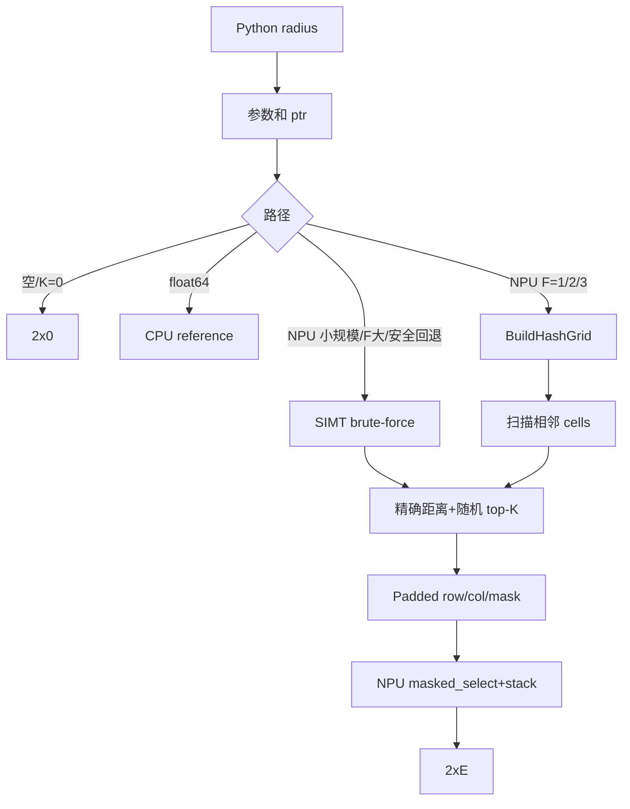
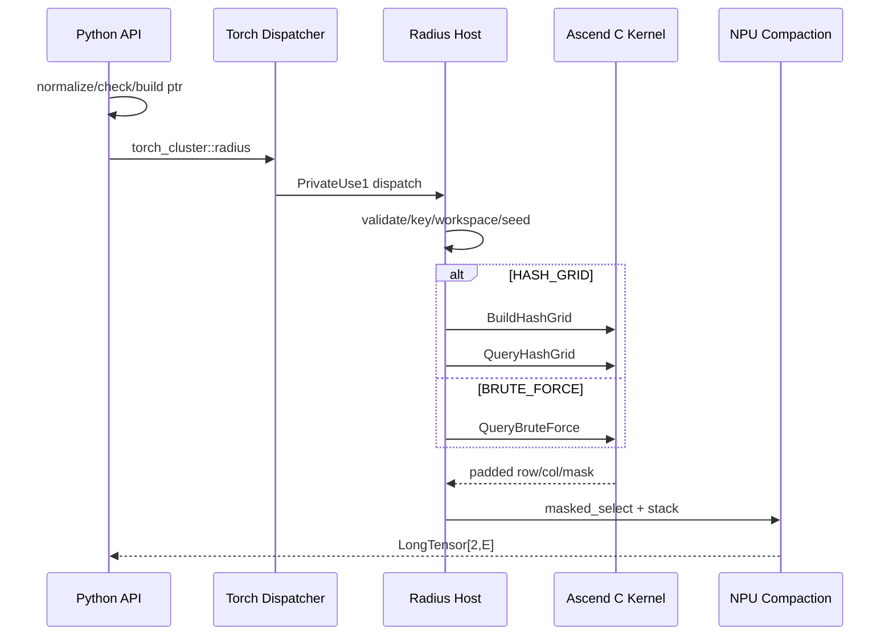
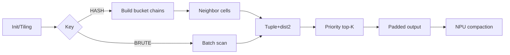

# 【社区任务】radius算子设计文档

> 任务：2026年8月社区任务 radius
> 目标仓：`cann/ops-gnn`；实现沿用仓内 Python、Host 与 Ascend C Kernel 分层
> 目标环境：Ascend 950PR（`dav-3510`）、CANN 9.1.0-beta.1+；PyTorch/torch_npu 使用目标环境配套版本

# 一、需求背景

## 1.1 需求来源

实现与 `torch_cluster.radius`、`radius_graph` 公共接口一致的 NPU 版本：对每个 y 点找出同 batch 中
欧氏距离严格小于 r 的 x 点，每点最多返回 `max_num_neighbors` 个邻居。须同时验收 radius 与
radius_graph，并覆盖 float16/bfloat16/float32 NPU、float64 L2、batch、随机截断、loop/flow 和空输入。

## 1.2 背景介绍

radius/radius_graph 是 PointNet++、DGCNN 等点云/GNN 构图的基础操作。输入
`x∈R^(N×F)`、`y∈R^(M×F)`，输出 `edge_index[2,E]`。任务最大基准为随机 3D、N=M=64K；朴素
方法约检查 40 亿点对，因此设计保留 SIMT brute-force 泛化路径，并为 1D/2D/3D 增加 hash-grid 路径。

### 1.2.1 参考实现现状

本任务没有可对齐的 CANN TBE radius。参考基线来自 pytorch_cluster：

| 层级 | 文件 | 现状 |
| --- | --- | --- |
| Python | `torch_cluster/radius.py` | 空输入、一维 view、contiguous、batch ptr、radius_graph loop/flow。 |
| CPU | `csrc/cpu/radius_cpu.cpp` | nanoflann KD-tree，作为 CPU 真值。 |
| CUDA | `csrc/cuda/radius_cuda.cu` | 一个 thread 处理一个 y；brute-force；padded row/col 后 masked_select。 |
| 注册 | `csrc/radius.cpp` | `torch_cluster::radius`，由 `torch.ops.torch_cluster.radius` 调用。 |

上游 1.6.3 CUDA 超过 K 时按扫描顺序保留前 K，并非随机；任务书明确要求超限随机采样，故随机截断是
本任务对旧 CUDA 参考的有意增强。任务签名还包含 1.6.3 schema 没有的 `ignore_same_index`，所以依赖必须
检查实际 schema，不能只判断版本号“>=1.6.0”。

### 1.2.2 参考流程

```text
radius Python -> 参数/batch ptr -> torch.ops.torch_cluster.radius
  ├─ CPU：pytorch_cluster CPU reference
  └─ NPU：本任务 PrivateUse1 kernel
radius_graph -> radius(x,x,...,ignore_same_index=not loop) -> 按 flow 交换两行
```

## 1.3 任务书条款基线

下表把任务书中的验收条款转成设计约束。后续详细设计和测试均以该编号引用，避免只描述算法主路径而遗漏包装层语义。

| 条款 | 任务要求 | 设计落点 |
| --- | --- | --- |
| RQ-01 | `radius` 公共签名和默认值一致 | Python 包装、参数表、schema guard。 |
| RQ-02 | `radius_graph` 与 `radius` 一并交付 | graph 包装、loop/flow 交叉矩阵。 |
| RQ-03 | 同 batch 内执行严格欧氏距离 `< r` 搜索 | ptr 限域、FP32 距离累加、严格比较。 |
| RQ-04 | 每个查询点最多输出 K 个邻居 | per-query bounded top-K。 |
| RQ-05 | 超过 K 时随机无放回采样 | Philox priority top-K，不按遍历顺序截断。 |
| RQ-06 | batch 输入有序且不能跨 batch 建边 | Python/Host 校验及 batch-aware hash。 |
| RQ-07 | `ignore_same_index` 仅排除相同 index | 候选谓词，不按坐标相等排除。 |
| RQ-08 | `radius_graph` 支持 loop 和两种 flow | 包装层换行与 self-loop 语义。 |
| RQ-09 | float16/bfloat16/float32 在 NPU 执行 | dtype dispatch，半精度输入 FP32 累加。 |
| RQ-10 | float64 提供 L2 路径 | CPU reference 回退并搬回原设备。 |
| RQ-11 | 空输入返回 `[2,0]` LongTensor | Python 早返回，不访问空 batch 的 max。 |
| RQ-12 | 仅验收前向 | 不注册 backward，不建立 autograd 反向。 |
| RQ-13 | 950PR 性能不低于 0.6 倍 A100 标杆 | hash-grid 优化、brute fallback、端到端计时。 |
| RQ-14 | 精度遵循生态算子标准 | CPU/ATK 真值、边界和随机集合验证。 |

## 1.4 交付范围

本设计覆盖 Python 公共接口、C++/Host 接入、Ascend C Kernel、动态输出紧凑化以及功能、精度、随机性和性能测试。
不在本任务范围内的内容包括反向传播、逐查询半径 Tensor、未排序 batch 的自动重排，以及用当前非目标硬件生成
950PR 验收数据。性能优化不得改变接口、严格半径边界或随机无放回语义。

# 二、需求分析

## 2.1 功能需求拆解

| 功能阶段 | 输入 | 输出 | 关键不变量 |
| --- | --- | --- | --- |
| Python 归一化 | x/y、batch、属性 | contiguous x/y、ptr、标准属性 | 默认值和异常类型与公共接口一致。 |
| 路径分派 | dtype、F、N/M/K、坐标范围 | EMPTY/CPU_F64/BRUTE/HASH | 分派只影响性能，不改变边集合。 |
| 候选生成 | 点坐标、ptr 或 hash-grid | 每个 query 的合法候选流 | 同 batch、严格 `< r`、self 规则正确。 |
| 随机选择 | 候选流、K、generator 状态 | 每个 query 至多 K 个唯一邻居 | 无放回、固定调用序列可复现。 |
| 动态紧凑化 | padded row/col/mask | `[2,E]` LongTensor | 不回读 Host、不产生无效边。 |
| graph 包装 | radius edge、flow | graph edge_index | loop 和方向只在包装语义中变换。 |

## 2.2 性能需求

性能考核覆盖任务书给出的五组 3D shape 与 float16/float32。公开 Python API 的端到端时间包含参数处理、
索引构建、候选查询、随机选择和输出紧凑化；分阶段计时仅用于定位瓶颈。以任务书 A100 时间 $T_{A100}$ 为基准，
验收条件为：

$$
T_{NPU}\le\frac{T_{A100}}{0.6}
$$

hash-grid 负责降低稀疏邻域下的候选数量；brute-force 保证任意 F 和极端输入的完整语义。两条路径必须使用同一候选谓词、
随机规则和输出契约。

## 2.3 外部组件依赖

| 依赖 | 要求 | 作用 |
| --- | --- | --- |
| CANN Toolkit | 9.1.0-beta.1+ | Ascend C、SIMT、runtime。 |
| PyTorch/torch_npu | 目标环境配套版本 | Tensor、PrivateUse1、当前 stream、generator、NPU compaction。 |
| pytorch_cluster | schema 与任务签名一致 | Python/CPU 真值及 `torch_cluster::radius` schema。 |
| pytest/AscendOpTest/ATK | 测试期 | 功能、集合精度、双标杆、性能。 |

加载 `_pybind.so` 时只给既有 `torch_cluster::radius` 注册 PrivateUse1/NPU 实现，不重复定义 schema；CPU/CUDA
实现保持不变。加载阶段执行 schema guard：schema 不存在或缺少 `ignore_same_index` 时终止导入并输出所需
revision，防止接口不完整的环境进入算子执行阶段。

## 2.4 内部适配模块

| 模块 | 文件 | 职责 |
| --- | --- | --- |
| Python | `python/ops_gnn/radius.py`、`__init__.py` | 完整参数、ptr、flow、L2 回退、导出。 |
| 注册/Host | `csrc/pybind.cpp`、`csrc/npu/host/radius/` | NPU 实现注册、校验、tiling、workspace、当前 stream。 |
| Kernel | `csrc/npu/kernel/radius/` | hash-grid、查询、随机截断、padded 输出。 |
| 构建 | `CMakeLists.txt`、Python 打包文件 | 新源码和兼容依赖。 |
| 测试 | `test/test_radius.py` | 功能、异常、路径、随机与性能。 |

## 2.5 接口与约束设计

### 2.5.1 公共接口

```python
def radius(x, y, r, batch_x=None, batch_y=None, max_num_neighbors=32,
           num_workers=1, batch_size=None, ignore_same_index=False): ...
def radius_graph(x, r, batch=None, loop=False, max_num_neighbors=32,
                 flow='source_to_target', num_workers=1, batch_size=None): ...
```

`radius` 参数定义：

| 参数 | 类型与默认值 | 语义 | 校验与处理 |
| --- | --- | --- | --- |
| x | Tensor，无默认值 | 候选点，`[N,F]` 或上游兼容的一维 `[N]` | 与 y 同 device/dtype/F；NPU L1 或 float64 L2。 |
| y | Tensor，无默认值 | 查询点，`[M,F]` 或一维 `[M]` | 与 x 同 device/dtype/F。 |
| r | float，无默认值 | 严格搜索半径 | 必须有限且 `r>0`；比较平方距离与 `r²`。 |
| batch_x | Optional[LongTensor] | 每个 x 点的 batch id | 长度 N、非递减；B>1 时与 batch_y 同时存在。 |
| batch_y | Optional[LongTensor] | 每个 y 点的 batch id | 长度 M、非递减；B>1 时与 batch_x 同时存在。 |
| max_num_neighbors | int，32 | 每个 query 的最大输出数 K | `K>=0`；K=0 直接返回空。 |
| num_workers | int，1 | CPU 参考的工作线程提示 | NPU 路径接受但忽略，不改变结果。 |
| batch_size | Optional[int] | batch 总数提示 | 缺省时从已有 batch 推导；显式值必须为正，B>1 时两侧 batch 均存在。 |
| ignore_same_index | bool，False | 排除满足 `i==j` 的候选 | 只比较索引，不比较坐标是否相同。 |

`radius_graph` 参数定义：

| 参数 | 类型与默认值 | 语义 | 映射到 radius |
| --- | --- | --- | --- |
| x | Tensor | 图节点坐标 | 同时作为 x 和 y。 |
| r | float | 严格搜索半径 | 原样传递。 |
| batch | Optional[LongTensor] | 节点 batch id | 同时作为 batch_x 和 batch_y。 |
| loop | bool，False | 是否允许 self-loop | `ignore_same_index=not loop`。 |
| max_num_neighbors | int，32 | 每个目标点最大入邻居数 | 原样传递。 |
| flow | str，`source_to_target` | edge_index 方向 | source_to_target 交换两行；target_to_source 保持 radius 行序。 |
| num_workers | int，1 | CPU 参数兼容 | 原样传递，NPU 忽略。 |
| batch_size | Optional[int] | batch 总数提示 | 原样传递。 |

返回值统一为输入设备上的 `torch.long`、二维 contiguous Tensor，shape 为 `[2,E]`。E 等于所有查询点
最终邻居数之和，满足 `0<=E<=M*K`。结果不承诺跨 seed 的边顺序；固定 seed、输入和调用序列下要求可复现。

包装层处理顺序固定如下：

1. 校验 flow、标量属性、已有 batch Tensor 的长度与有序性；
2. 将一维 x/y 视为 `[N,1]`/`[M,1]`，然后 contiguous；
3. 在访问 batch 最大值前处理 N=0、M=0 或 K=0；
4. `batch_size` 缺省时分别从已有 batch Tensor 推导 B，二者都缺省时 B=1；
5. B=1 时 ptr 保持 None；B>1 时要求 batch_x/batch_y 同时存在，并按上游
   `bucketize(arange(B+1), batch)` 构造 `ptr_x`、`ptr_y`；
6. float64 进入 L2 CPU reference，其余支持 dtype 进入 NPU；
7. radius 输出 `[query,neighbor]`；radius_graph 根据 flow 对结果换行，不重复搜索；
8. NPU 接受但忽略 num_workers，flow 只允许两个公开值。

### 2.5.2 数学原理

对查询点 $y_j$ 与候选点 $x_i$，以 FP32 累加计算平方欧氏距离：

$$
d^2(i,j)=\sum_{f=0}^{F-1}\left(x_{i,f}-y_{j,f}\right)^2
$$

同一 batch 内满足严格半径条件的候选集合定义为：

$$
S_j=\left\{i\;\middle|\;b_x(i)=b_y(j),\quad d^2(i,j)<r^2,\quad
\neg\mathrm{ignore\_same\_index}\ \lor\ i\ne j\right\}
$$

令 $K=\mathrm{max\_num\_neighbors}$，并以 $\mathcal{U}_K(S_j)$ 表示从 $S_j$ 中无放回均匀采样的 K 元子集，
则每个查询点的最终邻居集合为：

$$
T_j=\begin{cases}
S_j, & |S_j|\le K,\\
\mathcal{U}_K(S_j), & |S_j|>K.
\end{cases}
$$

radius 的输出边集为 $\{(j,i)\mid i\in T_j\}$，因此第一行是 query、第二行是 neighbor；
radius_graph 再依据 `flow` 调整两行。距离判定严格使用 $d^2(i,j)<r^2$，边界 $d(i,j)=r$ 不入边。

### 2.5.3 参数语义

| 组合 | 支持范围 | 计算/输出策略 |
| --- | --- | --- |
| shape | x=`[N,F]`、y=`[M,F]`；兼容上游一维输入 | 一维先 view 为 F=1；不支持 x/y 的 F 广播。 |
| float16 | NPU L1 | 坐标转 FP32 后累加平方距离。 |
| bfloat16 | NPU L1 | 坐标转 FP32 后累加平方距离。 |
| float32 | NPU L1 | FP32 乘加与严格阈值比较。 |
| float64 | CPU L2 | 在 CPU 调用同一 torch_cluster reference，edge 搬回输入设备。 |
| batch | Optional LongTensor | 长度匹配、非递减；ptr 类型为 int64。 |
| r/K | float/int | r 有限且正；K 非负；K=0 返回空。 |
| 输出 | LongTensor `[2,E]` | x 所在设备、contiguous、仅前向。 |

异常语义如下：

| 场景 | 行为 |
| --- | --- |
| x/y device、dtype 或 F 不一致 | 抛出参数错误，不执行 Kernel。 |
| B>1 但仅提供 batch_x 或 batch_y | 与上游一致触发参数断言。 |
| batch 长度错误或递减 | 抛出参数错误，不自动排序。 |
| batch_size 非正，或 B>1 时缺少任一 batch Tensor | 与上游一致触发参数断言。 |
| r 为 NaN、Inf、零或负数 | 抛出参数错误。 |
| K 为负数或非整数 | 抛出参数错误。 |
| flow 不在两个公开值中 | radius_graph 抛出参数错误。 |
| 运行时、分配或 Kernel 失败 | 抛出带阶段信息的异常，不返回部分结果。 |

# 三、需求详细设计

## 3.1 使能方式

```bash
source /usr/local/Ascend/cann-9.1.0-beta.1/bin/setenv.bash
cd ops-gnn
./scripts/build.sh all --npu-arch dav-3510
```

```python
import ops_gnn
edge = ops_gnn.radius(x, y, r=0.3, max_num_neighbors=32)
graph = ops_gnn.radius_graph(x, r=0.3, loop=False,
                             flow='source_to_target')
```

导入 ops_gnn 后，NPU tensor 通过 `torch.ops.torch_cluster.radius` 的 PrivateUse1 实现进入本 kernel；CPU
Tensor 仍走 pytorch_cluster CPU 实现。

## 3.2 需求总体设计



### 3.2.1 分层架构与文件映射

当前 `ops-gnn` 源码采用 Python → `_pybind`/Torch → `csrc/npu/host` → `csrc/npu/kernel` 的分层方式，
CMake 会递归收集 Host C++ 和 Kernel 源文件。Radius 沿用该工程结构，不建立仓外构建系统。

| 层级 | 规划文件 | 设计职责 |
| --- | --- | --- |
| Python API | `python/ops_gnn/radius.py` | 接口兼容、batch ptr、空输入、float64、radius_graph。 |
| Python 导出 | `python/ops_gnn/__init__.py` | 导出 `radius`、`radius_graph`。 |
| 模块入口 | `csrc/pybind.cpp` | 加载扩展及触发 NPU 实现注册，不定义冲突 schema。 |
| Host 接口 | `csrc/npu/host/radius/radius.h` | Host 函数、adapter 和 launch 声明。 |
| Dispatcher | `csrc/npu/host/radius/radius_dispatch.cpp` | 只注册 PrivateUse1 实现，不定义 schema。 |
| Host 实现 | `csrc/npu/host/radius/radius.cpp` | 校验、TilingKey、workspace、stream、launch。 |
| Runtime adapter | `csrc/npu/host/radius/radius_runtime_adapter.{h,cpp}` | current stream、generator、compaction 版本隔离。 |
| Tiling 契约 | `csrc/npu/kernel/radius/radius_tiling.h` | Host/Kernel 共享的定长 tiling 数据。 |
| Kernel 入口 | `csrc/npu/kernel/radius/radius_kernel.cpp` | build/query 两类 SIMT Kernel 与 key dispatch。 |
| Kernel 实现 | `csrc/npu/kernel/radius/radius_kernel.h` | 距离谓词、hash、top-K、padded 写出。 |
| 测试 | `test/test_radius.py` | 接口、精度、随机性、异常和路径等价。 |
| 性能测试 | `test/test_radius_perf.py` | 五组公开 shape、warmup、端到端和分阶段计时。 |

现有仓库快照中的 `pybind.cpp` 直接导出已有算子，而任务书要求 Python 最终调用
`torch.ops.torch_cluster.radius`。因此 Radius 接入增加 dispatcher 实现注册，但绝不重新声明同名 schema。

加载顺序固定为：Python 先导入目标版本 `torch_cluster` 使 schema 生效；随后检查
`torch_cluster::radius` 的参数列表和 `ignore_same_index`；检查通过后再导入 `_pybind.so`，由
`radius_dispatch.cpp` 注册 PrivateUse1 实现；最后查询 dispatch table，确认 NPU key 指向 Radius 实现。
概念注册形式如下，具体宏/API 以目标环境探针为准：

```cpp
TORCH_LIBRARY_IMPL(torch_cluster, PrivateUse1, m) {
    m.impl("radius", TORCH_FN(radius_npu));
}
```

schema guard 位于 Python 模块初始化、且早于 `_pybind.so` 加载；C++ 静态注册不承担 schema 定义职责。
目标环境探针还必须验证既有 catch-all/RegisterOperators 与 PrivateUse1 实现共存时的实际 dispatch 结果。
任一门禁不满足时导入失败并给出 torch、torch_npu、torch_cluster 版本和实际 schema，不能静默改成另一套接口。
`radius_runtime_adapter` 只封装三类版本相关能力：取得调用方 current stream；在 generator 锁内保留
seed/offset 区间；调用 NPU compaction。算法、参数校验和 TilingKey 不进入 adapter。

调用时序如下：



### 3.2.2 Host 侧设计

#### 3.2.2.1 参数校验与 TilingKey

Host 检查 device/dtype/shape/F、ptr、r/K 和整数乘法溢出。TilingKey：

| Key | 条件 | 行为 |
| --- | --- | --- |
| EMPTY | N/M/K 为 0 | 不启动 kernel。 |
| CPU_F64 | float64 | CPU 回退。 |
| BRUTE_FORCE | F>3、小规模、hash 不经济或静态索引/workspace 条件不满足 | batch 内全扫描。 |
| HASH_GRID_F1/F2/F3 | F=1/2/3 且规模达到 profiling 阈值 | hash-grid + 3/9/27 邻 cell。 |

小规模阈值由 950PR profiling 形成并写入 Host 策略表，设计文档不预填未经实测的常量；选择只影响性能，
不改变结果。分派顺序固定为 EMPTY → CPU_F64 → 安全性检查 → 代价路径选择。只要 hash 所需的维度、cell、
索引或 workspace 条件不满足，就选择 BRUTE_FORCE，而不是缩小搜索范围。

Host 与 Kernel 共享的 `RadiusTilingData` 至少包含以下定长字段：

| 字段 | 类型 | 作用 |
| --- | --- | --- |
| n/m/f/k | uint64 | x/y 点数、特征维度、邻居上限。 |
| batchCount | uint32 | ptr 中的 batch 数。 |
| dtypeCode | uint32 | fp16/bf16/fp32 dispatch。 |
| tilingKey | uint32 | BRUTE 或 HASH_F1/F2/F3。 |
| radius2 | float | FP32 阈值 `r²`。 |
| ignoreSameIndex | uint8 | 候选谓词开关。 |
| hashSize/hashMask | uint64 | bucket 数和 power-of-two mask。 |
| blockDimBuild/blockDimQuery | uint32 | build/query 启动核数。 |
| seed/offset | 各 uint64 | 当前 generator 为本次调用保留的 RNG 区间。 |
| paddedCount | uint64 | `M*K`，经安全乘法计算。 |

Tensor 地址、ptr 和 workspace 指针通过 Kernel 参数传递，不塞入可序列化 tiling 标量。Host 在任何分配前使用
checked-multiply/checked-add 计算 `M*K`、`2*M*K*sizeof(int64)`、hash buffer 和总 workspace；失败时直接报错。

batch ptr 构造保持上游行为：B=1 时 ptr 为 None，Kernel 将其解释为 x/y 的完整单段；B>1 时先验证 batch
非递减，再根据 `batch_size` 生成 `[B+1]` 边界。空 batch 允许出现相邻相等的 ptr。Kernel 只依据 ptr 段
访问 x/y，不按 batch 最大值分配点对矩阵。

#### 3.2.2.2 分核策略

- Query：一个 SIMT thread 处理一个 y，按 M/AIV 数配置 block，grid-stride 覆盖尾部。
- BuildHashGrid：一个 thread 处理一个 x，原子插入 bucket 链。
- brute-force 通过 ptr 只扫本 batch；hash-grid 将 batch 编入 hash 并二次核对。
- 小 M 减少 block，大 M 使用平台查询到的可用 AIV；设计不写死核数。

Query 和 Build 统一采用全局 grid-stride，不再叠加 block 连续区间。设每个 block 的 SIMT 线程数为 T，
则全局线程 id 与步长为：

$$
tid=blockIdx\times T+threadIdx,\qquad stride=blockDim\times T
$$

Query 线程处理 `j=tid,tid+stride,...<M`；Build 线程处理 `i=tid,tid+stride,...<N`。这一映射覆盖完整且互不重复。
query 之间没有写冲突，因为每个 query 只写自身 `[j*K,(j+1)*K)` 的 padded 槽位。Hash build 仅在
bucket_head 上发生原子竞争，next/cell 元数据由各 x thread 独占写入。T 和 blockDim 从 950PR 平台能力及
profiling 取得，并写入 Host 策略表。

#### 3.2.2.3 Workspace、数据块和 UB/寄存器

| Buffer | 类型/规模 | 作用 |
| --- | --- | --- |
| row/col | int64，各 `M×K` | padded 输出，初始化 -1。 |
| valid mask | bool/uint8，`M×K` | 紧凑化。 |
| priority | uint64，`M×K` 或分块 | 随机 top-K。 |
| bucket_head | int32，`H≈nextPow2(2N)` | bucket 链头。 |
| next | int32，N | x 链表。 |
| cell/batch | int64 `N×F` + int32 N | 保存 F<=3 的真实 cell tuple 和 batch，碰撞后精确核对。 |
| fallback flag | int32 标量 | cell 溢出时切 brute-force。 |

该算子是非规则 SIMT 搜索，不把整个 x tile 搬进 UB。线程连续读取一个点的 F 元素；常用 K=32 时 heap
优先放寄存器/LocalTensor，大 K 使用 GM 分块。所有规模乘法用 int64 预检，OOM 明确报错。N 超过
`INT32_MAX` 时禁用 int32 链表并回退使用 int64 索引的 brute-force，不能发生索引截断。

令 $P=M\times K$，不含框架 allocator 元数据时，padded 主路径的显式 workspace 上界为：

$$
W_{padded}=P\times(8+8+1+8)\ \text{bytes}
$$

四项分别对应 row、col、mask 和最坏情况下的 priority。hash 路径另需 bucket_head、next、cell tuple 和 batch
元数据。priority 在常用 K 可完全驻留线程局部空间时不分配对应 GM 区域；Host 仍按实际路径计算精确字节数，
不以理论上界盲目分配。若 workspace 超出 allocator 或地址空间限制，功能层返回 OOM，不允许降低 K 继续运行。

#### 3.2.2.4 输出与 stream

Query kernel 写 padded row/col/mask，再在当前 PyTorch NPU stream 调有效槽位紧凑化，得到 `[2,E]`。
紧凑化逻辑等价于：对 row 和 col 使用同一 mask，分别选出有效元素后 stack；两行长度必须一致。

整个序列在调用方当前 stream 上执行：初始化 workspace → build（hash 路径）→ query → compaction → stack。
Host 不同步回读 E，也不新建私有 stream。返回 Tensor 持有其 storage，临时 workspace 的生命周期由当前 stream
和框架 allocator 管理。torch_npu 的 stream、generator 和 masked_select/替代 primitive API 统一隔离在
adapter 层，并在目标环境最小探针中验证。若目标版本不支持直接 masked_select，则替代实现必须仍在 NPU 上
完成 mask scan、scatter 和 shape 构造，不能退化为 Host 计数往返。

### 3.2.3 Kernel 侧设计

#### 3.2.3.1 BRUTE_FORCE

每个 y thread 由 ptr_y 定位 batch b，扫描 `[ptr_x[b],ptr_x[b+1])`，累加 dist2，执行严格半径和
ignore_same_index 谓词。该路径覆盖任意 F，也是 grid 安全回退。

伪代码如下：

```text
j = global_thread_id
while j < M:
    b = locate_batch(ptr_y, j)
    topk = empty max-heap ordered by (priority, i)
    for i in [ptr_x[b], ptr_x[b + 1]):
        if ignore_same_index and i == j: continue
        dist2 = fp32_sum_f((x[i,f] - y[j,f])^2)
        if isfinite(dist2) and dist2 < radius2:
            insert_or_replace_largest(topk, priority(seed, offset, j, i))
    sort_selected_by_priority(topk)
    write padded slots j*K ... (j+1)*K
    j += global_thread_count
```

当合法候选数不超过 K 时，top-K 结构保留所有候选；超过 K 时仅保留随机优先级最小的 K 个。谓词和写出函数
与 hash 路径共用，避免两条路径在 `<r`、self-loop 或随机规则上分叉。

#### 3.2.3.2 HASH_GRID

cell 边长为 r，`cell_f=floor(coord_f/r)`。Build kernel 生成含 batch 的 64-bit hash，并用 atomic
exchange/CAS 把 x 插入链表，同时保存真实 `(batch,cell tuple)`。Query 访问本 cell 和每维 -1/0/1 的
邻 cell；hash 命中后仍核对 tuple，再计算精确距离。碰撞只增加工作量，不改变集合。

NaN/Inf x 不插入、NaN/Inf y 返回空，与距离比较结果一致；有限坐标除 r 后若不能安全表示 int64 cell，设置
fallback flag。后续 Query Kernel 在设备侧读取该 flag，并让全部 query 执行 brute-force 分支；Host 不为该条件
同步回读标量。这样即使 BuildHashGrid 已产生部分 bucket，也不会使用不完整索引。

hash-grid 不漏边的依据是：若 $d(i,j)<r$，则任一维均满足 $|x_{i,f}-y_{j,f}|<r$。cell 边长为 r 时，
两个点在该维的 cell 编号之差至多为 1，因此 F=1/2/3 分别扫描 3/9/27 个邻 cell 可以覆盖全部合法候选。
hash 值只定位 bucket，真实 batch 和 cell tuple 的二次核对消除碰撞假阳性，随后精确距离比较消除立方邻域中的
非球形候选。由此 hash 碰撞和遍历顺序只影响性能，不影响候选集合。

BuildHashGrid 步骤固定为：

1. 将 bucket_head 初始化为 -1，并将 fallback flag 初始化为 0；
2. 每个 x thread 检查坐标有限性及 cell 转换范围；
3. 对安全点计算 `(batch,cell tuple)` 和 64-bit hash；
4. 通过 atomic exchange/CAS 将旧链头写入 `next[i]`，再发布新链头；
5. Query 遍历链时同时核对 batch、完整 cell tuple、索引规则和精确距离。

负 cell 坐标先按 int64 二进制位模式转换为 uint64，再与 batch、维度编号逐项执行固定 avalanche mix，
最终以 `hash & hashMask` 选 bucket。hash 函数不承担唯一编码职责，正确性依赖完整 tuple 二次核对。
插链协议使用 CAS 循环：读取旧 head，将 `next[i]` 写为旧 head，再以 release 语义 CAS 发布 i；失败则用返回的
新 head 重试。bucket 初始化、Build、Query 在同一 current stream 依次提交；Query 只在 Build 完成后读取链和
fallback flag。workspace 每次调用独立分配/初始化，不使用跨 stream 的全局可变 hash 表。

#### 3.2.3.3 随机截断

Host 在 generator 互斥锁内读取 seed、保留 counter 区间并推进 offset，然后释放锁。为使 hash 与 brute 在同一
调用中得到相同随机选择，priority 只由调用 RNG 区间和全局点对 `(j,i)` 决定，不依赖候选发现顺序。

令 $p=jN+i$。Philox4x32 的一个 counter 产生四个 32-bit word，每个点对使用相邻两个 word 组成 64-bit
priority，因此 counter 索引为 `base_offset + floor(p/2)`，lane 由 `p mod 2` 决定。Host 为非空 NPU 调用保留
`ceil(M*N/2)` 个 counter，确保与后续随机调用不重叠；`M*N`、counter 数或 offset 加法溢出时明确报错。
选择最小 K 个，priority 相同以 i 打破平局。固定 seed、输入和调用序列可 bit-wise 复现；不同调用消费新的
counter 区间；hash 链重排不改变选中集合。

对每个候选分配独立同分布随机优先级时，取 K 个最小优先级等价于对候选集合随机排列后取前 K，因此满足
无放回采样。K=32 等常用值使用线程局部 max-heap；大 K 使用 GM 分块 heap/merge。写出前按
`(priority,i)` 排序选中项，使固定 seed 的 edge 顺序稳定。禁止固定 seed、共享所有 query 的同一随机序列，
或按遍历顺序截前 K。

测试侧实现同一 Philox priority 规则的 CPU 随机 golden：先由高精度 CPU 得到完整候选集合，再按同一
`(seed,base_offset,j,i)` counter 映射选 K 个。固定 seed 的 bit-wise 比较以该 golden 为准；上游旧
CPU/CUDA 的遍历顺序
截断仅用于非截断候选集合参考，不能作为随机真值。

#### 3.2.3.4 Ascend C 流程



#### 3.2.3.5 与参考实现差异

- 无 TBE 基线；CPU torch_cluster 是功能真值。
- CUDA 1.6.3 是 brute-force/前 K；本实现增加 hash-grid 和任务要求的随机 K。
- 保留 padded + NPU compaction 输出结构；所有操作绑定当前 NPU stream。
- CUDA 输出候选发现顺序受扫描顺序影响；本设计固定 seed 时按随机优先级排序，便于跨路径复现。
- CPU KD-tree 仅作为非截断候选集合和 float64 L2 真值，不直接充当随机截断 golden。

#### 3.2.3.6 动态输出不变量

每个 query j 的 padded 槽位固定为 `[j*K,(j+1)*K)`。被选中的第 t 个邻居写入：

```text
row[j*K+t]   = j
col[j*K+t]   = i
mask[j*K+t]  = true
```

剩余槽位 mask 为 false，row/col 的占位值不会进入结果。compaction 对两行使用同一 mask，因此输出的第 e 个
row 与 col 始终来自同一 padded 槽位。K=0、M=0 或 N=0 在 Host 早返回，不构造零长度 Kernel launch。
输出 E 的动态值由 NPU compaction 结果 shape 给出，满足：

$$
E=\sum_{j=0}^{M-1}|T_j|,\qquad 0\le E\le M K
$$

### 3.2.4 数据检测与异常处理

| 检查 | 行为 |
| --- | --- |
| dtype/device/F 不一致、r/K 非法 | Host 立即报参数错误。 |
| batch 非递减或长度不符 | Python/Host 报错，不自动排序。 |
| ptr 越界、末值与 N/M 不符 | Host 报错，不启动 kernel。 |
| M×K/H/N 算术溢出或分配失败 | 报溢出/OOM，不缩减输出。 |
| cell int64 溢出 | 设置 device flag，Query Kernel 对全部 query 选择 brute-force 分支。 |
| kernel/runtime 失败 | 抛出带阶段名的异常，不返回部分 edge。 |

### 3.3 支持硬件

| 芯片 | 支持 |
| --- | --- |
| Ascend 950PR（dav-3510） | √ |

### 3.4 算子约束限制

1. 仅前向；x/y 同 device、dtype、F。
2. batch 必须 sorted，不自动重排。
3. r 为有限正 float，不支持逐点半径 Tensor。
4. L1 为 fp16/bf16/fp32；fp64 仅 CPU 回退。
5. 普通验收比较 edge 集合；固定 seed 额外要求 bit-wise。
6. 不通过删边、缩小 K 或 padded 输出冒充 OOM 场景成功。

# 四、特性交叉分析

| 交叉项 | 处理 |
| --- | --- |
| dtype×距离 | half/bf16→FP32；fp32→FP32；fp64→CPU。 |
| batch×grid | batch 进入 hash/tuple；brute 由 ptr 限域。 |
| loop×K | loop=False 候选阶段去 i==j；loop=True 自边参与 K。 |
| flow×输出 | Python 只交换两行，不重跑搜索。 |
| empty×batch | 在 batch.max 前返回空。 |
| random×算法 | priority 依赖 seed/base_offset/j/i；两路径同调用区间时选择一致。 |
| collision×精度 | tuple+距离二次检查。 |
| overflow×grid | fallback brute-force。 |
| schema×版本 | 检查 ignore_same_index；不兼容显式失败。 |

# 五、可维可测分析

## 5.1 精度标准/性能标准

| 标准 | 要求 | 来源 |
| --- | --- | --- |
| L1 | 非截断时每 query 集合与 CPU 一致；严格 `<r`。 | 任务书 |
| 截断 | degree=K，均为真值候选；固定 seed bit-wise；多 seed 非固定前 K。 | 任务书 |
| L2 | CPU 回退与同一 CPU torch_cluster bit-wise。 | 任务书 |
| graph | loop/flow 集合与方向一致。 | 任务书 |
| 性能 | NPU≥0.6×A100，即时间≤A100/0.6。 | 任务书 |

| 3D N/r | FP32上限 ms | FP16上限 ms |
| --- | ---: | ---: |
| 8K/0.8 | 3.530 | 3.782 |
| 16K/0.5 | 6.527 | 7.373 |
| 32K/0.3 | 14.077 | 16.803 |
| 64K/0.2 | 34.717 | 47.363 |
| 64K/0.3 | 34.837 | 47.450 |

## 5.2 测试方案

### 5.2.1 Golden 与比较方式

测试先用 float64 CPU 计算每个 query 的完整合法候选集合，距离比较保持严格 `<r`。非截断场景对每个 query
比较无序邻居集合，并额外检查输出 dtype、device、shape 和两行含义；不把 edge 的偶然遍历顺序当精度标准。

截断场景分三层判断：

1. 每个被选邻居都属于完整候选集合，且没有重复；
2. degree 等于 `min(|S_j|,K)`；
3. 固定 seed、输入和调用序列时，与 CPU Philox priority golden 进行 bit-wise 比较。

浮点阈值附近采用高精度输入构造 `r-eps`、`r`、`r+eps` 三组点。若单一同精度 CPU 标杆无法解释误差，
按任务书使用 ATK 双标杆，并记录最大、平均和均方根相对误差比例。NaN/Inf 的候选资格按比较结果单独断言。

### 5.2.2 功能与异常验证矩阵

| 用例 | 关键输入 | 预期与证据 |
| --- | --- | --- |
| TC-01 | F=1/2/3，N/M 不等，多组 r | 每个 query 集合与 CPU 一致。 |
| TC-02 | F=4/8，非连续 view | contiguous 后走 brute，结果一致。 |
| TC-03 | 距离为 r-eps/r/r+eps | 只保留严格小于 r 的边。 |
| TC-04 | B>1，有序 batch，N_b/M_b 不等 | 无跨 batch 边，ptr 段正确。 |
| TC-05 | batch id 跳号、空 batch 段 | 相邻相等 ptr 不影响后续 batch。 |
| TC-06 | B=1，仅给一侧全零 batch | 与上游单 batch 行为一致。 |
| TC-07 | K=0/1/32/>候选数 | shape、degree 和空返回正确。 |
| TC-08 | 候选数恰好 K、K+1、高密度 | 截断边界无 off-by-one。 |
| TC-09 | ignore_same_index True/False | 只排 `i==j`，不排同坐标不同索引。 |
| TC-10 | loop True/False × 两种 flow | self-loop 和两行方向正确。 |
| TC-11 | fp16/bf16/fp32 | NPU 集合满足 L1 标准。 |
| TC-12 | fp64 | CPU L2 bit-wise，输出搬回原设备。 |
| TC-13 | x/y 任一为空、二者为空 | `[2,0]` LongTensor，不访问 batch.max。 |
| TC-14 | r 非法、K 负、flow 非法 | 明确参数异常，不启动 Kernel。 |
| TC-15 | shape/dtype/device/F 不匹配 | 明确参数异常。 |
| TC-16 | batch 递减、长度错误、B>1 缺一侧 | 与接口约束一致失败。 |
| TC-17 | 负坐标、重复点、NaN/Inf、超大 cell | 无漏边；不安全 grid 设备侧转 brute。 |
| TC-18 | 强制 HASH 与 BRUTE，候选数>K | 同 seed/base_offset 时 bit-wise 等价。 |
| TC-19 | 强制小 bucket 制造 hash 碰撞 | tuple 核对后候选集合不变。 |
| TC-20 | `M*K`、hashSize、offset 溢出 | Host checked arithmetic 报错。 |
| TC-21 | 非默认 NPU stream 连续调用 | 无隐式默认 stream、无提前释放。 |
| TC-22 | 五组公开 3D shape × fp16/fp32 | 950PR 端到端性能报告。 |

### 5.2.3 随机性验证

固定 seed 测试在每次运行前重置 generator，并保证调用序列相同；重复调用 20 次必须得到完全相同的 edge。
不同 seed 测试选取 `|S_j|` 明显大于 K 的 query，确认至少存在两个不同子集，同时所有输出始终满足合法子集和
无重复约束。统计测试固定 `|S_j|=8、K=2`，使用 4096 个独立 seed；每个候选的理论入选频率为 0.25，要求
频率偏差不超过二项分布标准差的 5 倍，且卡方检验 `p>=0.001`。该阈值用于识别固定前 K 或严重偏置，不替代
逐次合法性断言；完整 seed、计数和统计量写入自测报告。

RNG 与路径等价测试对同一输入强制 BRUTE/HASH，重置到相同 generator 状态，要求输出 bit-wise 一致；随后不
重置 generator 连续调用，要求第二次调用消费新的 counter 区间。测试同时检查被选邻居无重复、不同 query 的
随机序列不被错误共享。

### 5.2.4 性能测试协议

性能只在 Ascend 950PR、CANN 9.1.0-beta.1+ 目标环境执行。报告记录硬件、驱动、CANN、PyTorch、torch_npu、
ops-gnn commit、dtype、shape、r、K、batch、路径和 workspace。公开基准使用 `torch.manual_seed(12345)` 生成
`torch.rand([N,3])` 坐标，x=y、batch=None、K=32，N/r 使用任务书五组取值；若社区验收脚本给出不同数据生成器，
以验收脚本为主并同时披露差异。

每组执行 20 次 warmup 和 100 次正式测量，使用 NPU event 或等价设备计时测量公开 Python API；计时开始前
完成输入构造并同步，计时结束后同步对应 event，防止只记录异步 launch 时间。warmup 不计入结果。

每组保存原始重复数据，并同时报告最小值、P50 和 P90；任务验收按社区统一口径取值。端到端时间包含 hash build、
query、随机 top-K 和 compaction，分阶段计时不得替代端到端结果。性能测试前后运行同 shape 的正确性检查，
避免调优分支改变边集合。brute/hash 切换阈值依据这些 950PR 数据形成，不使用其他硬件结果外推。

### 5.2.5 条款到实现与测试映射

| 条款 | 实现阶段/文件 | 验证用例 | 证据类型 |
| --- | --- | --- | --- |
| RQ-01 | `radius.py`、Host schema guard | TC-01、TC-14～16 | API/异常测试。 |
| RQ-02 | `radius.py::radius_graph` | TC-10 | edge 方向与集合。 |
| RQ-03 | shared candidate predicate | TC-01、TC-03、TC-04 | CPU 集合/边界。 |
| RQ-04 | per-query top-K | TC-07、TC-08 | degree/shape。 |
| RQ-05 | Philox priority top-K | TC-08、随机性测试 | fixed-seed/统计。 |
| RQ-06 | Python ptr、batch-aware hash | TC-04～06、TC-16 | batch 隔离/异常。 |
| RQ-07 | ignore predicate | TC-09 | 索引与坐标交叉。 |
| RQ-08 | graph loop/flow wrapper | TC-10 | 四象限矩阵。 |
| RQ-09 | dtype dispatch、FP32 accumulation | TC-11 | L1/ATK。 |
| RQ-10 | CPU L2 wrapper | TC-12 | bit-wise/device。 |
| RQ-11 | Python early return | TC-13 | shape/device。 |
| RQ-12 | 无 backward 注册 | API inspection | 前向范围。 |
| RQ-13 | hash-grid、profiling policy | TC-22 | 950PR 性能报告。 |
| RQ-14 | CPU/ATK test harness | TC-01～22 | 精度与自测报告。 |

随机截断按“CPU 候选集合的 K 元合法子集”验收；固定 seed 额外 bit-wise。阈值附近单标杆不足时按任务书用
ATK 高精度双标杆。性能覆盖公开 Python API，build/query/compaction 分项只用于分析。

## 5.3 性能优化策略

1. 小规模/F>3 走单 kernel brute-force，避免建索引开销；大规模 1D/2D/3D 通过 profiling 选择 hash-grid。
2. hash bucket 数按负载因子约 0.5 规划，tuple 二次核对保证碰撞只影响性能。
3. 一 thread 对一 query，F=1/2/3 合并读取；batch ptr 限制无效扫描。
4. K=32 使用局部 heap，减少 GM priority 访问；padded compaction 全程留在 NPU 当前 stream。
5. 分别测 BuildGrid、Query、随机选择、compaction，优化主要阶段后重测公开 API。
6. 高密度/大 r 导致候选接近 N 时切 brute-force，避免索引维护反而变慢。

## 5.4 兼容性分析

1. 参数顺序、默认值、dtype/shape/device 与任务签名一致。
2. PrivateUse1 注册不覆盖 CPU/CUDA；L2/CPU 真值保持可用。
3. schema 必须含 ignore_same_index；这是目标环境前置检查。
4. atomic、当前 stream、generator/Philox、masked_select 均通过兼容层封装，并在 950PR 构建和用例中验证。
5. hash-grid 失败可回退 brute-force，不改变功能。

# 六、风险与规避

| 风险 | 规避/门槛 |
| --- | --- |
| schema 不匹配 | 加载阶段执行 schema guard，打印 schema 并阻止不兼容版本运行。 |
| atomic/Philox API 差异 | 通过独立兼容层隔离，并纳入 950PR 编译与固定 seed 用例。 |
| 高密度/大 r 导致 grid 退化 | profiling 选 grid/brute。 |
| M×K workspace 大 | int64/OOM 检查，不伪造结果。 |
| 旧 CUDA 与随机任务冲突 | 明确以任务书为准，验证合法子集和 seed。 |
| 浮点边界 | ULP 用例与 ATK 高精度真值。 |
| generator 状态竞争 | 锁内保留独立 counter 区间，多 stream 用例检查无重叠。 |
| compaction 动态 shape | 同一 mask 紧凑化两行，非默认 stream 检查生命周期。 |
| 文档副本漂移 | 云端主稿与本地 deliverable 使用 SHA-256 对照，只保留一个提交候选。 |

# 七、提交规范

设计文档提交到 `cann-ops-competitions` 对应 tasklist 团队目录，以 PR 而非 issue 评审；PR 标题为
`【社区任务】radius算子设计文档`。收到维护者“审核通过”后，才进入代码验收/贡献流程。

团队提交目录名为 `zhouzirui`，设计文档提交路径为：

```text
04_tasks/01_community-task-2026/tasklist/20260801-radius/zhouzirui/docs/design.md
```

精度、性能及兼容性验收证据统一由 Ascend 950PR、CANN 9.1.0-beta.1+ 目标环境生成。

# 八、参考资料

1. Radius 社区任务书：`cann-ops-competitions/04_tasks/01_community-task-2026/docs/202608/radius_task_doc.md`；
2. 社区任务流程及注意事项：`https://gitcode.com/org/cann/discussions/39`；
3. 社区设计文档模板：`cann-competitions/04_tasks/01_community-task-2026/resources/design_template.md`；
4. 目标代码仓：`https://gitcode.com/cann/ops-gnn`；
5. PyTorch Cluster Radius Python/CPU/CUDA 参考：`https://github.com/rusty1s/pytorch_cluster`；
6. 生态算子开源精度标准：`https://gitcode.com/cann/opbase/blob/master/docs/zh/ops_precision_standard/experimental_standard.md`；
7. AscendOpTest：`https://gitcode.com/HIT1920/AscendOpTest`；
8. ATK 双标杆工具：`https://gitcode.com/AscendTest/ATK`。
