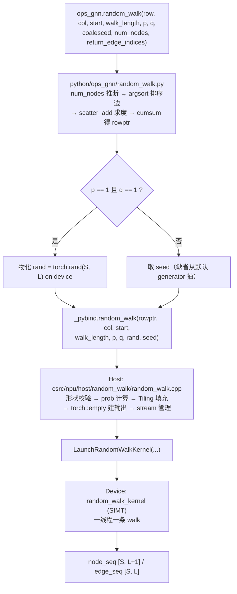

# random_walk 算子设计文档

| 版本 | 日期 | 修改人 | 修改内容 |
|------|------|--------|----------|
| v1.0 | 2026.8.3 | sss-hust | 初稿 |

---

# 一、需求背景（required）

## 1.1 需求来源

CANN 2026 年 8 月社区任务——`random_walk` 算子开发。参考
[`torch_cluster.random_walk`](https://github.com/rusty1s/pytorch_cluster)（≥ 1.6.0），
在昇腾 NPU（Ascend 950PR）上实现 CSR 图上的随机游走采样，交付 Ascend C Kernel +
PyTorch 扩展层，验收后合入开源仓 [`ops-gnn`](https://gitcode.com/cann/ops-gnn) 的
`random_walk`，导出 API 名 `random_walk`。

## 1.2 背景介绍

随机游走是图表示学习（DeepWalk / node2vec / PyG 的 `Node2Vec` 模块）的样本生成算子：
从一批起点出发，在图上采样固定长度的节点序列，作为 skip-gram 的训练语料。它通常位于
训练流水线的最前端，是端到端吞吐的直接瓶颈之一。

`p = q = 1` 时为均匀随机游走：每步在当前节点的出边中等概率选一条。否则为 node2vec
的二阶有偏游走。设上一节点为 $t$、当前节点为 $v$、候选节点为 $x$，未归一化转移权重为

$$
\alpha(t, x) =
\begin{cases}
1/p, & x = t \quad \text{(返回上一节点)} \\
1, & x \in N(t) \quad \text{(BFS 式局部探索)} \\
1/q, & \text{otherwise} \quad \text{(DFS 式向外探索)}
\end{cases}
$$

直接采样需要为每个节点构造归一化的转移概率表（$O(\sum_v \deg(v)^2)$ 的预处理），
因此上游采用**拒绝采样**：以 $\max(1/p, 1, 1/q)$ 归一化后反复试采样，直到接受。

## 1.3 现状分析

`ops-gnn` 仓当前只有 `add_sample`（SIMT 模式，逐元素）和 `segment_max_csr`
（Kernel 类 + TPipe 双缓冲）两个样例算子，**无 `random_walk`**，接口与 Kernel 均需
从零交付。

上游两个实现的关键差异如下，这直接决定了"对齐谁"这件事必须先说清楚：

| 维度 | CPU (`rw_cpu.cpp`) | CUDA (`rw_cuda.cu`) |
|------|--------------------|---------------------|
| 并行粒度 | `at::parallel_for`，每 walk 一次迭代 | 一 thread 一 walk |
| uniform 随机源 | 预先物化 `torch::rand({S, L})`，索引 `rand[n*L + l]` | 同形状张量，索引 `rand[l*S + n]` |
| node2vec 随机源 | libc `rand()` 全局串行序列，从不 `srand` | `curand_init(time(NULL), 0, 0)` |
| 输出布局 | 行主序 `[S, L+1]` 直接写 | 先写 `[L+1, S]` 再 `.t().contiguous()` |
| `is_neighbor` | 独立函数，不影响调用方的 `row_start/row_end` | 内联后**覆盖** `row_start/row_end`，重试时从错误区间采样 |

即：**两个上游实现之间本身就不是逐位一致的**，且 CUDA 版用 `time(NULL)` 播种，
每次运行结果都不同（完全不可复现）。本任务验收口径为 PyTorch 层 CPU 结果，因此
下文一律以 CPU 语义为准，CUDA 仅作为并行化思路参考。

本设计已配套一份纯 Python 的 golden 参考实现，逐位复刻了 CPU 版语义（含下文 3.1.2
列出的全部细节），并在 CPU 上与上游 `torch_cluster` 1.6.3 完成 21 个用例的逐位对拍
（uniform 与 node2vec 两条路径均通过），作为 NPU 侧的精度基线。

---

# 二、需求分析（required）

## 2.1 需求描述

使用 Ascend C 实现 `random_walk` 的 NPU Kernel，并通过与 `torch_cluster.random_walk`
**签名完全一致**的 PyTorch 层对外提供能力；CSR 预处理保留在 Python 层（与上游一致）；
支持均匀采样与 node2vec 拒绝采样两条路径；全程 int64，无浮点特征输入，无 float CPU
回退；性能对标 A100，NPU ≥ 0.6×；仅前向。

## 2.2 需求拆解

1. **接口层**：`random_walk(row, col, start, walk_length, p=1, q=1, coalesced=True,
   num_nodes=None, return_edge_indices=False)`，默认值与返回值形态与上游完全一致。
2. **Python 预处理**：`num_nodes` 推断 → `coalesced` 时按 `row * num_nodes + col`
   排序 → `deg.scatter_add_` → `cumsum` 得 `rowptr`，逐步复现上游。
3. **双路径分派**：`p == 1 && q == 1` 走 `uniform_sampling`，否则走拒绝采样。
4. **边界行为**：度为 0 的节点 `edge_seq = -1` 且节点序列停在原地；支持
   `walk_length = 0`。
5. **精度**：uniform 路径在固定随机源下与 CPU 标杆逐位一致；node2vec 路径见 3.2.2。
6. **性能**：四个标杆 shape 均满足 `NPU 耗时 ≤ A100 耗时 / 0.6`。
7. **范围**：仅前向，无反向。

## 2.3 输入输出规格

| 名称 | 角色 | dtype | 形状 | 约束 |
|------|------|-------|------|------|
| `row` | 输入 | int64 | `[E]` | 源节点 |
| `col` | 输入 | int64 | `[E]` | 目标节点，`0 ≤ col[i] < N` |
| `start` | 输入 | int64 | `[S]` | 起点，`0 ≤ start[i] < N` |
| `walk_length` | 输入 | int | 标量 | `≥ 0` |
| `p`, `q` | 输入 | double | 标量 | `> 0` |
| `coalesced` | 输入 | bool | 标量 | 默认 `True` |
| `num_nodes` | 输入 | int 可选 | 标量 | 默认 `max(row.max(), col.max(), start.max()) + 1` |
| `node_seq` | 输出 | int64 | `[S, walk_length+1]` | 游走节点序列 |
| `edge_seq` | 输出 | int64 | `[S, walk_length]` | 边序号，无出边时为 `-1` |

Kernel 实际接收的是 CSR：`rowptr [N+1]`（非递减，`rowptr[0]=0`，`rowptr[N]=E`）与
`col [E]`。

---

# 三、详细设计（required）

## 3.1 算子分析

### 3.1.1 采样语义

**均匀路径**，第 `n` 条 walk 的第 `l` 步（当前节点 `v`）：

```text
row_start = rowptr[v];  row_end = rowptr[v+1];  deg = row_end - row_start
if deg == 0:  e = -1                                  # 原地不动
else:         e = row_start + trunc(fp32(rand[n,l]) * fp32(deg));  v = col[e]
node_seq[n, l+1] = v;   edge_seq[n, l] = e
```

**node2vec 路径**：第 0 步无偏（等概率选一条出边）；之后每步按 `deg` 分三种情形，
`deg == 0` 原地不动且 `e = -1`；`deg == 1` 直接走唯一出边且**不消耗随机数**；
`deg ≥ 2` 进入拒绝循环，每轮抽一个候选 `x` 和一个 `r`，按
`x == t` → `is_neighbor(x, t)` → 兜底的顺序判定是否接受。

### 3.1.2 必须逐位对齐的语义细节

以下每一条都足以单独破坏与 CPU 标杆的一致性，且都不是从任务书表述能直接读出来的，
均已在 golden 实现中复刻并被对拍用例锁定：

1. **索引计算是 float32 而非 float64。** C++ 中 `rand_data` 为 `float*`，
   `int64_t(rand_data[i] * (row_end - row_start))` 的乘法会把 int64 提升为 `float`，
   即单精度乘法后向零截断。用 double 计算会在大度数节点上落到不同的桶。
2. **`edge_seq` 是 coalesced 之后的边序号**，不是原始 COO 序号。上游在
   `coalesced=True` 时重排边后不再映射回原顺序，本实现同样不映射。
3. **`deg == 1` 时不消耗随机数。** 拒绝采样中这是一个显式短路分支，遗漏会让该 walk
   之后的随机序列全部错位。
4. **`is_neighbor` 不修改当前行范围。** CPU 版是独立函数；CUDA 版内联后覆盖了
   `row_start/row_end`，导致重试时从 `x` 的行区间而非 `v` 的行区间采样。以 CPU 为准。
5. **每轮拒绝只抽一个 `r`**，三个判定分支共用它。
6. **`walk_length = 0` 且 `p ≠ 1` 时上游 CPU 越界写。** 它无条件执行循环前的
   "第 0 步"并写 `n_out[n*1 + 1]`，越出 `[S, 1]` 的输出缓冲，属未定义行为。
   本实现定义为"只返回起点列、不消耗随机数"（见第六章待确认项）。

## 3.2 随机数设计（关键决策）

这是本算子最需要提前对齐的部分：**"固定 seed 下与 CPU 逐位一致"这一要求对两条路径
的可达性是不同的。**

### 3.2.1 uniform 路径：可以做到逐位一致

上游 CPU 本身就是先把 `torch::rand({S, L})` 物化成一张 float32 张量，再让每条 walk
读自己那一行——随机性与并行度是解耦的。因此只要喂同一张 `rand` 张量，任何并行实现都能
逐位复现 CPU 的结果。

本设计照抄这一结构：Python 层物化 `torch.rand(S, L, device=start.device)` 传给 Kernel。

- **性能路径**：`rand` 直接在 device 上生成。最大用例 `S=32K, L=256` 为 33 MB
  写 + 33 MB 读，在 HBM 带宽下约几十微秒，相对 1.87 ms 的预算可忽略；若实测占比偏高，
  可退化为 Kernel 内 counter-based 生成（见 3.3.6 优化项 5）。
- **精度路径**：测试经 CSR 层 hook 注入固定 `rand`（CPU 生成后拷入 NPU），
  与 golden 逐位比对。此时 NPU 与 CPU 标杆结果**完全一致**。

### 3.2.2 node2vec 路径：与 CPU 逐位一致在并行实现下不可达

上游 CPU 的拒绝采样从 libc `rand()` 这**一条全局串行流**取数，而每步消耗几个随机数
取决于拒绝了几次（数据相关）。因此第 `n` 条 walk 起始时的 RNG 状态依赖于前 `n-1` 条
walk 的全部拒绝历史——这是一个严格的串行依赖链，任何并行实现都无法在保留并行的前提下
复现。同一原因下：

- 上游 CPU 自身在多线程时也不可复现，必须 `torch.set_num_threads(1)`；
- 上游 CUDA 用 `time(NULL)` 播种，每次运行结果都不同，且所有线程共用同一条流
  （`curand_init(seed, 0, 0)` 的 sequence 参数恒为 0）。

**本设计方案**：每条 walk 一条独立的 counter-based 随机流。第 `n` 条 walk 第 `l` 步
第 `k` 次试采样取

```text
h = splitmix64(seed ^ (n * K1) ^ (l * K2) ^ (k * K3))
idx = (h >> 32) % deg        // 候选边
r   = (h & 0xFFFFFF) * 2^-24  // 接受判定用的 [0,1) fp32
```

性质：

- 同 seed 下**跨运行、跨核数、跨分核策略完全可复现**（比上游 CPU 多线程更强的保证）；
- 无状态、无跨线程依赖，天然并行；
- 与 CPU 单线程标杆**不逐位一致**。

对应验收方式见 4.1、4.2；口径需评审确认，见第六章。

另有一个"完全逐位一致"的兜底方案：在 Kernel 内复刻 glibc `rand()` 的 TYPE_3 加法
反馈序列并**串行**执行。配套 golden 已实现该生成器并通过 glibc 种子-1 已知向量验证，
可以拿到与 CPU 完全相同的输出，但只能单线程跑，性能无法达标。建议作为 debug 开关
保留，不作为默认路径。

## 3.3 昇腾侧实现方案

### 3.3.1 调用链



### 3.3.2 负载特征与性能预算

每步的计算量极小（一次乘法 + 一次截断），但有 3 次**随机地址**的 GM 访问
（`rowptr[v]`、`rowptr[v+1]`、`col[e]`），且步与步之间是严格的指针追逐依赖。
所以这是一个**延迟受限**算子，不是带宽或算力受限：优化方向是提高在飞访存数，
而不是提高向量利用率。这也决定了 3.3.4 选 SIMT 而非向量化流水线。

最大用例共 `32K × 256 = 8.4 M` 步、约 25 M 次随机 8 字节读。预算：

| E | walk | start | 输出元素 | A100 | 上限（/0.6） |
|---|------|-------|----------|------|--------------|
| 64K | 128 | 8K | 1.0 M | 0.576 ms | 0.960 ms |
| 256K | 128 | 16K | 2.1 M | 0.709 ms | 1.182 ms |
| 512K | 128 | 32K | 4.2 M | 1.139 ms | 1.898 ms |
| 512K | 256 | 32K | 8.4 M | 1.867 ms | 3.112 ms |

即最大用例需达到约 2.7 G steps/s。并行度上限等于 `S`（单条 walk 不可再切分），
`S = 32K` 与 950PR 的 AIV 核数 × 每核线程数量级匹配，可以做到一线程一条 walk。

### 3.3.3 Host 侧设计

职责：入参校验 → `prob_0/1/2` 计算 → Tiling 填充 → 输出分配 → 分派 Launch → 同步。

- **入参校验**：`rowptr/col/start` 均为 int64 且一维；`rowptr.numel() == N+1`；
  `walk_length ≥ 0`；`p > 0 && q > 0`；`rand` 在 uniform 路径下 numel 为 `S*L`。
- **概率预计算**：`max_prob = max(1/p, 1, 1/q)`，`prob_0 = 1/p/max_prob`,
  `prob_1 = 1/max_prob`, `prob_2 = 1/q/max_prob`，host 侧以 double 计算后转 float32
  下发（device 侧 double 运算代价高，且该路径不要求与 CPU 逐位一致）。
- **Tiling 结构体**（遵循仓内规范，仅 `uint32_t`，不含指针；float 以位模式传递）：

```cpp
struct RandomWalkTilingData {
    uint32_t numStarts;       // S
    uint32_t walkLength;      // L
    uint32_t numNodes;        // N
    uint32_t numEdges;        // E
    uint32_t usePq;           // 0: uniform, 1: rejection sampling
    uint32_t coalesced;       // 1 时 is_neighbor 可用二分查找
    uint32_t prob0Bits;       // float32 位模式
    uint32_t prob1Bits;
    uint32_t prob2Bits;
    uint32_t maxTrials;       // 拒绝循环上限
    uint32_t seedLo;
    uint32_t seedHi;
    uint32_t startsPerCore;
    uint32_t startsLastCore;
};
```

- **分核**：walk 之间完全独立，按 `numStarts` 均分到 AIV 核，余数依次分给前几个核；
  `S` 小于总线程数时多余线程直接退出。
- **输出**：`torch::empty({S, L+1}, start.options())` 与 `torch::empty({S, L}, ...)`。
- **Stream**：`aclrtCreateStream` → Launch → `aclrtSynchronizeStream` →
  `aclrtDestroyStream`，与 `segment_max_csr` 一致。

### 3.3.4 Kernel 侧设计

采用 SIMT 模式（`__simt_vf__` + `AscendC::Simt::VF_CALL`，参考 `add_sample`），
一个线程负责一条完整的 walk：

```text
tid = blockIdx * threadNum + threadIdx
for n = tid; n < numStarts; n += totalThreads:
    v = start[n];  node_seq[n, 0] = v
    if usePq: t = v; 第 0 步无偏采样
    for l in ...:
        row_start = rowptr[v]; row_end = rowptr[v+1]; deg = row_end - row_start
        deg == 0            → e = -1，v 不变
        uniform             → e = row_start + trunc(fp32(rand[n,l]) * fp32(deg))
        deg == 1 (node2vec) → e = row_start
        否则                → 拒绝循环
        node_seq[n, l+1] = v;  edge_seq[n, l] = e
```

选 SIMT 而不是 Kernel 类 + `DataCopy` 流水线的理由：访问地址完全数据相关，无法
预取成规整 tile，向量化搬移在这里没有收益；SIMT 下大量线程各自发射独立的随机读，
正好用线程并发掩盖 GM 延迟。

**线程发散处理**：拒绝循环的迭代次数逐线程不同，会让同一 VF 组内线程发散。
措施是设 `maxTrials` 上限（初值 100）后兜底接受。单轮接受概率下界为
`min(prob_0, prob_1, prob_2) = 1/max(p, q, 1) / max_prob`，常用参数范围
（`p, q ∈ [0.25, 4]`）下 100 轮全部拒绝的概率低于 $10^{-15}$；极端 `p` 或 `q`
时需要按实际取值放大上限。该兜底会引入与 CPU 的语义差异，见第六章。

**`is_neighbor` 优化**：上游对 `x` 的邻居做线性扫描，高度数节点很贵，且它位于
拒绝循环内部（每轮都要扫）。`coalesced=True` 时同一行内 `col` 升序，可改为
**二分查找**——这是语义等价的纯谓词优化，不改变任何采样结果，把该步从
$O(\deg(x))$ 降到 $O(\log \deg(x))$。`coalesced=False` 时退回线性扫描。

**防御性裁剪**：uniform 路径的 `idx` 在 `deg > 2^24` 且 `rand` 极接近 1 时，
fp32 舍入可能得到 `idx == deg`。加 `idx = min(idx, deg-1)`，该裁剪在其余情况下
永不触发，因此不影响与 CPU 的逐位一致性。

### 3.3.5 输出写回布局

v1 按行主序直接写 GM：每个线程写自己那一行，行内连续 `L+1` 个 int64（最大 2 KB），
相邻线程的写相距一整行。若实测写回成为瓶颈，再对齐 CUDA 的做法：先写 `[L+1, S]`
转置布局让相邻线程写相邻地址，最后做一次 transpose；代价是额外一遍 67 MB 读写，
需要实测权衡后决定。

### 3.3.6 优化项清单（按预期收益排序）

1. 线程数与分核比例调优，目标是最大化在飞随机读（延迟受限算子的首要变量）
2. `is_neighbor` 二分查找（node2vec 路径，高度数图上收益显著）
3. 小图时把 `rowptr` 或按 int32 压缩的度数组缓存进 UB（`N ≤ 16K` 时约 64 KB）
4. 转置写回 + transpose（视 3.3.5 实测结果）
5. `rand` 改为 Kernel 内 counter-based 生成，省掉 33 MB 的读写
6. 首步与后续步分离，避免 node2vec 路径每步都判 `l == 0`

### 3.3.7 文件清单

```text
csrc/npu/host/random_walk/{random_walk.h, random_walk.cpp}
csrc/npu/kernel/random_walk/{random_walk_kernel.h, random_walk_kernel.cpp,
                             random_walk_tiling.h}
csrc/pybind.cpp                 # 追加 m.def("random_walk", ...)
python/ops_gnn/random_walk.py   # Python 接口
python/ops_gnn/__init__.py      # 追加导出
test/test_random_walk.py        # 单元测试
```

## 3.4 支持硬件

| 芯片版本 | 支持 |
|----------|------|
| Ascend 950PR（`dav-3510` / arch35） | √ |
| Atlas 800I/T A2（`dav-2201`） | 待评估 |

开发环境：CANN ≥ 9.1.0-beta.1，PyTorch ≥ 2.7 + torch_npu 26.0.0，编译器 bisheng；
构建 `pip install -e .` 或 `scripts/build.sh python`。

## 3.5 算子约束限制

1. `rowptr` / `col` / `start` 及输出均为 int64，不支持其他 dtype；
2. 仅前向，不支持反向；
3. `p > 0`、`q > 0`；
4. `edge_seq` 返回的是 coalesced 之后的边序号（与上游一致）；
5. node2vec 路径与 CPU 标杆不保证逐位一致（见 3.2.2），但同 seed 下自身完全可复现；
6. 拒绝循环存在 `maxTrials` 上限兜底。

---

# 四、可维可测分析

## 4.1 精度标准 / 性能标准

| 验收标准 | 描述 |
|----------|------|
| 精度标准 | 满足《生态算子开源精度标准》。uniform 路径：固定 `rand` 下与 CPU 标杆 **bit-wise 一致**。node2vec 路径：结构合法性 + 分布等价 + 同 seed 自复现 + 与本仓 golden bit-wise 一致；单标杆不满足时用 ATK `cv_fused_double_benchmark` 双标杆（最大相对误差比例 ≤ 2、平均 ≤ 1.2、RMSE ≤ 1.2） |
| 性能标准 | 对标 A100，四个标杆 shape 均满足 `NPU 耗时 ≤ A100 耗时 / 0.6`（见 3.3.2 表） |

输出是 int64 索引而非浮点数值，逐元素相对误差在这里没有意义，因此精度判定采用
"逐位相等"与"结构合法性 + 分布等价"两套口径，分别对应两条路径。

## 4.2 测试方案

**功能用例**（与 golden 对拍，golden 本身与上游 `torch_cluster` CPU 对拍）：

| 编号 | 场景 | 判定方式 |
|------|------|----------|
| TC-01 | 均匀游走 `p = q = 1`，`walk_length ∈ {1, 4, 10, 128}` | 注入固定 `rand`，与 golden 逐位一致 |
| TC-02 | node2vec `(p,q) ∈ {(2,0.5),(0.5,2),(1,0.25),(4,1)}` | 结构合法性；同 seed 两次调用逐位一致；`p` 增大时回头率单调下降 |
| TC-03 | `return_edge_indices=True` | 返回值形态、dtype、形状；全连通图上无 `-1` |
| TC-04 | `coalesced=False` | 结构合法性（边序号须落在未排序 CSR 的行区间内） |
| TC-05 | 孤立节点（含全孤立图） | `edge_seq` 全 `-1`，节点序列原地重复 |
| TC-06 | `walk_length = 0`（两条路径） | `node_seq` 为起点列，`edge_seq` 形状 `[S, 0]` |
| TC-07 | 多 start 大规模（64K/8K 与 512K/32K） | 形状 + 抽样结构合法性 |
| REF-01 | golden 与上游 `torch_cluster` CPU 逐位一致 | 21 个用例，CPU 即可运行，已通过 |
| REF-02 | libc `rand()` 仿真已知向量（glibc + Darwin） | 已通过 |

"结构合法性"指：`node_seq[:, 0] == start`；每一跳 `e` 都落在当前节点的行区间
`[rowptr[v], rowptr[v+1])` 内且 `node_seq[n, l+1] == col[e]`；度为 0 时 `e == -1`
且节点不变。这是一个能覆盖绝大多数 Kernel 缺陷的强不变式，且对两条路径同样适用。

**性能用例**：3.3.2 的四个 shape，随机边 + 随机起点，固定种子；uniform 与
node2vec 各跑一轮；用 msprof 抓 Kernel 耗时并留截图。

## 4.3 兼容性分析

新增算子，`ops-gnn` 内无同名 API，不涉及存量接口变更。Python 层签名与
`torch_cluster.random_walk` 完全一致，可直接替换上游调用。CSR 预处理留在 Python 层，
与上游一致，不影响已有 `add_sample` / `segment_max_csr`。

---

# 五、风险点与规避方案

| 风险描述 | 等级 | 规避方案 |
|----------|------|----------|
| node2vec 与 CPU 不逐位一致，引发验收口径争议 | 高 | 提交本文档前先在讨论帖对齐（第六章第 1 条）；同时给出可逐位一致的串行 debug 路径作为兜底证明 |
| 随机 GM 访问延迟无法掩盖，性能不达标 | 高 | 先用 uniform 路径定量测 steps/s 定位瓶颈；调线程数与分核比例；小图缓存 `rowptr` 进 UB |
| 拒绝循环导致 SIMT 线程发散，长尾拖慢整组 | 中 | `maxTrials` 上限兜底；必要时按 `deg` 分桶，把高度数节点的 walk 归到同组 |
| `is_neighbor` 线性扫描在高度数图上退化 | 中 | `coalesced=True` 时改二分查找（语义等价） |
| 逐位对齐语义写错（3.1.2 六条） | 中 | golden 已逐条复刻并与上游对拍；uniform 路径先跑通（信号最干净）再做 node2vec |
| fp32 截断在超大度数节点产生 `idx == deg` 越界 | 低 | 防御性 `min(idx, deg-1)`，不影响逐位一致性 |
| `rand` 张量 33 MB 额外读写占用预算 | 低 | 实测占比；必要时改 Kernel 内 counter-based 生成 |
| 脏输入（`col` 越界、`rowptr` 非递减）导致踩内存 | 中 | Host 侧前置校验并返回标准错误 |

---

# 六、遗留问题（待评审确认）

1. **node2vec 路径的精度口径。** 任务书要求"固定 seed 下与 CPU 标杆 bit-wise 一致"，
   但如 3.2.2 所述，上游 CPU 的拒绝采样是单条全局 libc `rand()` 流上的串行依赖，
   并行实现无法复现（上游自身多线程也不可复现，CUDA 版更是每次运行都不同）。
   申请以 4.1 的替代口径验收。
2. **`edge_seq` 的索引口径。** 任务书表述为"边在 COO 中的 index"，而上游实际返回的是
   **coalesced 之后**的边序号。本设计按上游行为实现，请确认。
3. **`walk_length = 0` 且 `p ≠ 1` 的期望行为。** 上游 CPU 在该组合下越界写输出缓冲
   （UB）。本设计定义为"只返回起点列、不消耗随机数"，请确认。
4. **拒绝循环 `maxTrials` 兜底是否可接受**，以及是否需要覆盖极端 `p`/`q`
   （如 `p = 100`）下的取值。

---

# 七、交付物与 PR 合入路径

1. 算子设计文档：本文件，PR 至
   `cann-ops-competitions` 的
   `04_tasks/01_community-task-2026/tasklist/random_walk/sss-hust/docs/design.md`；
2. 算子代码：PR 至 `cann/ops-gnn`，路径 `random_walk`，导出 API 名 `random_walk`，
   文件清单见 3.3.7；
3. 自测用例与测试代码：功能用例 TC-01 ~ TC-07、golden 对拍用例 REF-01/REF-02、
   性能基准脚本，配套 README 说明复现步骤；
4. 自测报告：用例参数、精度对比结果与截图、性能数据与 msprof 截图；
5. 算子目录 README：编译、自测、调用说明。
