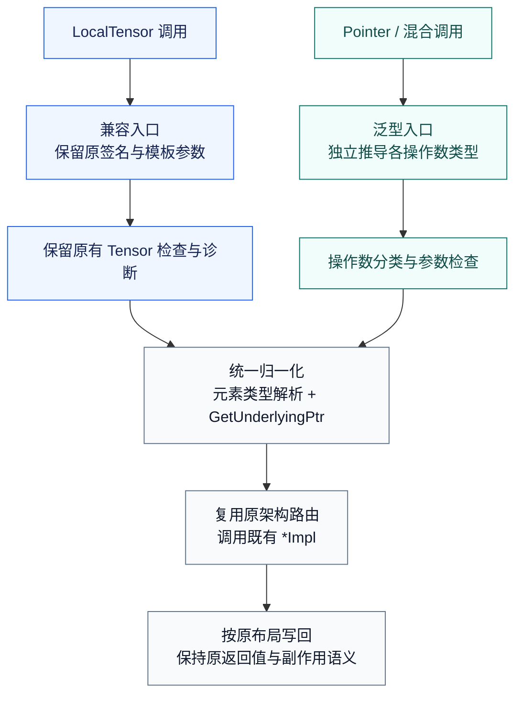

# AscendC Basic_API优化实现(VECTOR矢量接口扩展)设计文档

GitCode 用户：`gcw_2GoAgJFe`

目标代码仓：`cann/asc-devkit`，目标分支：`master`

适配范围：Ascend 950 系列，CANN 9.0.0～9.1.0（按实际工具链支持情况建立版本矩阵）

## 一、需求描述

### 1.1 需求来源与背景

本设计依据《AscendC Basic_API优化实现（VECTOR矢量接口扩展）》任务书 `basic_api_optimize_vector.md`，为 Basic API 增加裸指针操作数支持。任务附件正文沿用“8月社区任务”的名称，本设计以其 VECTOR 分册技术要求为准。

现有部分矢量接口以 `LocalTensor<T>` 为入口，调用方即使已经拥有合法的 UB 指针，也需要遵循 Tensor 对象调用方式。本任务在现有模板封装层统一解析操作数，使 `LocalTensor<T>`、`__ubuf__ T*` 及其合法混合组合调用同名 API，最终复用现有 `*Impl`。算术公式、舍入方式、mask、repeat、stride、同步时序和返回值保持原定义。

这是设备侧 Basic API 接口扩展，不新增独立算子，不新增 ACLNN/GE 注册、Host tiling 或工作区查询接口。调用方继续负责内存分配、数据搬运、分块和同步。

### 1.2 范围与边界

权威范围为任务书链接的 [VECTOR 接口清单](https://docs.qq.com/sheet/DYVNBU3BUUVdVRFRu?tab=000001)：**79 个接口名、245 个重载签名**。计数来自任务书；实现验收须以清单逐行映射，不能用头文件数量或代表样例数量替代覆盖率。

| 分类 | 本次设计关注点 |
| --- | --- |
| 矢量一元、二元、标量及复合计算 | 各 Local 操作数独立推导；标量类型和复合运算顺序保持不变 |
| 类型转换、量化/反量化 | 分别提取源和目的元素类型，保留合法异构 dtype 组合及舍入参数 |
| 归约 | 保留工作缓冲、输出布局、索引、归约顺序及有效长度语义 |
| 比较与选择 | 数据、比较结果、选择掩码分别建模，不能统一为一种元素类型 |
| Gather/Scatter | 保留 offset/index 类型及其字节或元素单位，按原重载约束访问 |
| 填充、广播、排列及双线性插值 | 保留原 shape、block、repeat、布局和临时空间要求 |
| 排序与转置 | 仅包含 VECTOR 清单中列出的 N 类接口及相关重载，如 MrgSort、Sort、Transpose |
| 队列同步相关条目 | 仅适配清单中的数据操作数，保留事件、队列归属和流水线语义 |

矩阵/Cube 专用接口、已排除的 Proposal 拆分接口及其他分册不在本次交付范围。不能因某个头文件同时包含多个类别而整文件扩大改造范围。纯寄存器 API 仅作为依赖与回归对象，除非其签名明确出现在 VECTOR 清单中。

开发前将官方清单冻结为可追溯台账，每行保存：`函数名 + 重载序号 + 完整签名 + 头文件 + 模板参数/默认值 + Local 操作数位置 + dtype 组合 + 架构条件 + 实现入口 + 用例编号`。以完整签名归一化后的标识去重，核对 79/245；上游新增、删除或改名均记录差异，不静默改变交付范围。

任务附件中未附 `api_list_vector.md`，因此本文直接引用在线清单，不设置不可访问的相对链接。后续实现须归档清单快照及逐项映射。

### 1.3 需求拆解与验收对应

| 编号 | 需求 | 设计与验收方式 |
| --- | --- | --- |
| R1 | 245 个重载支持 Pointer/Tensor | 按签名台账逐项编译、运行和核销 |
| R2 | 同一调用可混用 | 每个 Local 操作数独立模板推导，验证合法组合 |
| R3 | 原 Tensor 调用零语义变更 | 保留公开兼容入口、原模板参数顺序与默认值，运行旧用例 |
| R4 | 复用既有实现 | 归一化后进入同一 `*Impl`，不引入新的数值算法 |
| R5 | 指针路径精度一致 | 改造前 Tensor、改造后 Tensor、Pointer/混合路径与 golden 对比 |
| R6 | 官方样例迁移 | 在原样例目录增加调用方式覆盖，复用数据生成及校验脚本 |
| R7 | 内存语义不变 | 无额外随输入规模增长的数据复制，保持原 scratch 需求及生命周期 |
| R8 | 可复现交付 | 保存环境、清单版本、构建命令、全部测试日志与问题记录 |

## 二、方案设计

### 2.1 现状分析

本次源码分析基线为 asc-devkit 提交 `463d2d0c150ea9d6c4f85a2a70dbac4db9d3eb4f`。后续开发与提交前重新核对上游 `master`，以下路径均相对于该仓库。

| 源码位置 | 已核实的现状 | 对设计的影响 |
| --- | --- | --- |
| `include/basic_api/kernel_operator_vec_binary_intf.h` | Add 提供 mask 数组、mask 计数与 count 重载；mask 形式保留 `T, isSetMask=true` | 不能只替换函数形参而改变显式模板调用契约 |
| `impl/basic_api/kernel_operator_vec_binary_intf_impl.h` | 使用 `PrimT<T>`；经过 Tensor 检查、CPU 调试及 MSTX 信息上报后调用 AddImpl | 指针化必须同时处理检查和诊断层 |
| `include/basic_api/kernel_tensor.h` | LocalTensor 设备路径 `GetPhyAddr()` 返回 `uint64_t`，CPU 调试路径返回元素指针 | 不能简单从 `decltype(GetPhyAddr())` 去指针推导元素类型 |
| `include/basic_api/kernel_operator_vec_vconv_intf.h` | Cast 的源和目的有不同模板类型 | 不能对所有操作数施加相同 dtype 约束 |
| `include/basic_api/kernel_operator_vec_gather_intf.h` | Gather 的偏移表为 `LocalTensor<uint32_t>` | 索引与数据类型必须独立校验 |
| `include/basic_api/kernel_operator_proposal_intf.h`、`kernel_struct_proposal.h` | MrgSort 使用含四个 LocalTensor 成员的 MrgSortSrcList；Sort 还含索引与临时缓冲 | 聚合操作数和可写临时参数需要专门适配 |
| `impl/basic_api/kernel_operator_vec_binary_intf_impl.h` | `__NPU_ARCH__ == 3510` 路由到 `dav_3510` | 复用现有架构路由，不新增硬件算法分支 |

在上述基线的 `include/basic_api`、`impl/basic_api` 中未检索到任务示例同名的 `GetUnderlyingPtr`/`ElemType`。本设计将其视为待实现的内部适配能力，并优先复用仓库已有 `PrimT<T>` 等类型设施。

### 2.2 总体流程



两类调用分别完成入口约束和检查，再汇入同一归一化与实现路径。图中的分支表示编译期选择，不引入运行时类型判断。

公共归一化逻辑放在 `impl/basic_api` 的内部公共头文件中，声明所需的轻量 traits 按现有头文件包含结构安排，避免循环包含。新增头文件名称以实际整合结果为准，不暴露不必要的公共符号。

所有适配使用编译期重载选择、traits 和内联函数完成，不引入运行时类型标签、虚函数、动态分配、隐式 Device 数据搬运或额外流水同步。

### 2.3 操作数类型系统

每个 Local 操作数分别识别其种类、基本元素类型、可写性和地址空间。约束只接受已知合法的 LocalTensor 与 UB 数据指针，不接受任意带 `GetPhyAddr()` 成员的对象。

| 操作数 | 元素类型提取 | 地址解析与约束 |
| --- | --- | --- |
| `LocalTensor<T>` | `PrimT<T>`，保留 TensorTrait 对应语义 | 复用原 UB 转换方式；继续检查 Tensor 所属内存位置 |
| `__ubuf__ T*` | 从带地址空间的指针提取 T | 保留 UB 地址空间，禁止先转为普通 `void*` |
| 指向只读元素的 UB 指针 | 单独保留 pointee const | 仅在原接口只读且底层签名可安全承接时支持，不去 const 后写入 |
| UB 数组 | 按参数传递规则显式退化为 UB 指针 | 测试 `__ubuf__ half buf[N]`，不能假定 `const U&` 推导结果必为指针 |
| `GlobalTensor`、GM 指针、普通 Host 指针、错误地址空间 | 不归入 VECTOR Local 操作数 | 目标编译器下应拒绝非法替换，不把 GM 强转为 UB |

不同 CANN 编译器对地址空间类型 traits 的行为可能不同。优先用仓库已有设施；必要时对 UB 指针提供专用重载或偏特化，并以 ASC 最小编译用例验证。不能仅用普通主机 C++ 编译器通过作为证据。

以下为归一化逻辑示意，不是已编译实现；CPU 调试分支、类型约束和诊断逻辑在正式实现中补全：

```cpp
// Tensor element type is resolved before converting its physical address.
template <typename T>
__aicore__ inline __ubuf__ PrimT<T>* GetUnderlyingPtr(const LocalTensor<T>& value)
{
    return (__ubuf__ PrimT<T>*)value.GetPhyAddr();
}

// Preserve the address space of a raw UB pointer.
template <typename T>
__aicore__ inline __ubuf__ T* GetUnderlyingPtr(__ubuf__ T* value)
{
    return value;
}
```

内部 trait 先从原始操作数获得元素类型，再解析地址，避免把设备端地址整数错误当成元素类型。传入 `const LocalTensor<T>&` 只表示对象引用只读，不等于底层数据不可写；与 `const T*` 的元素只读含义分别处理。

### 2.4 对外接口与兼容策略

将实现核心改为“独立模板操作数 + 指针萃取”的统一范式，同时保留原有公开 Tensor 重载作为兼容入口。这样既符合任务的统一封装要求，又保留 `Add<half>`、`Add<half, false>`、`Cast<half, float>` 等调用源代码的含义。

泛型入口仅在至少一个 Local 操作数为指针/UB 数组且全部操作数符合该重载约束时参与重载决议。纯 Tensor 调用继续命中原签名，避免泛型重载抢占、重复匹配或递归转发。两种入口均调用内部不同名的归一化核心，不通过同名公开 API 相互递归。

以 Add 为例，设计支持：

```cpp
AscendC::Add(dstTensor, src0Tensor, src1Tensor, count);
AscendC::Add<half>(dstTensor, src0Tensor, src1Tensor, count);
AscendC::Add(dstPtr, src0Ptr, src1Ptr, count);
AscendC::Add(dstPtr, src0Tensor, src1Ptr, count);
AscendC::Add(dstTensor, src0Ptr, src1Tensor, count);
```

不能把三个操作数都声明成同一个 `const T&`，否则混合调用无法独立推导。新增泛型入口采用独立 `Dst/Src0/Src1` 类型；对 Add 要求其基本元素类型一致，对 Cast、Compare、Gather 等则使用各自的合法类型关系。

对于带显式模板参数的指针/混合调用，保留已有元素类型及非类型参数的位置：可在原有模板参数之后追加可推导的操作数类型；省略元素类型时使用推导标记，显式指定时校验其与实际元素类型一致。类型参数在前、布尔/枚举参数在前以及多个元素类型参数的接口分组处理，不批量改写模板顺序。声明、实现、默认值、编译属性与架构宏同步维护。

| 参数类别 | 保持的契约 |
| --- | --- |
| Local 数据操作数 | 对应位置允许 Tensor/UB 指针，基本元素类型按原重载限制 |
| scalar、roundMode、比较/选择模式 | 类型、转换规则、顺序和默认值不变 |
| mask / mask[] | 保留计数模式与位图模式；mask 指针不是待指针化的数据操作数 |
| repeatTime、repeatParams、count | 宽度、单位、取值范围、stride 单位与原接口一致 |
| 返回值、输出引用 | 保留值、引用、可写性及副作用，不假定所有接口都返回 void |

### 2.5 特殊接口处理

**异构 dtype。** Cast 分别提取源、目的类型；AddDeqRelu 等保留原合法输入输出组合；Gather 的 `uint32_t` 偏移表、Sort 的索引、Compare 的比较结果、Select 的选择表各自约束。不能把“同类型”检查推广到全部接口，也不能因新增模板而放宽底层不支持的组合。

**聚合操作数。** 保留 `MrgSortSrcList<T>` 的公开布局、构造函数和四个 Tensor 成员。新增适配用的列表视图/构造辅助入口，允许各源分别为 Tensor 或指针，内部只存固定数量的归一化 UB 指针，再调用原归并实现。该辅助入口的名称与正式签名在接口评审时确认；不改变原 MrgSort 的参数顺序、源长度表、validBit、耗尽暂停行为和 sortedNum 输出。结构化输入的混合测试必须覆盖列表成员，不能只测试 dst。

**临时空间与可写引用。** Sort、归约等已有临时缓冲沿用原容量、布局、对齐和生命周期，允许等价 UB 指针承接；不会借指针化增加按 count 分配的缓冲。对原来的非 const 引用，逐项区分“写缓冲区数据”和“修改 Tensor 对象状态”。后者若存在，须给出明确的指针契约并完成评审，不能机械删除副作用。

**队列与同步。** 裸指针不携带队列所有权，不能替代队列 token、事件 ID 或分配器状态。只适配清单标记的数据操作数；无 Tensor 数据参数的同步项保持原签名并加入回归台账。已有 `SetFlag/WaitFlag`、Mutex 或 PipeBarrier 的位置与语义保持不变，不在适配器中自动插入同步。

**原地与重叠访问。** 沿用各 API 对 src/dst/scratch 重叠的限制；指针方式不新增“任意别名安全”的承诺。根据原接口分别验证合法原地操作与禁止的重叠组合。

### 2.6 校验、调试及架构

原 Add 封装包含 `CheckVectorTensor`、`CheckMaskRepeat`、`CheckCalcount`、CPU `CheckFuncVecBinary` 和 MSTX 信息。不能把所有入口统一改为直接调用 `*Impl` 而丢失这些行为。

1. 纯 Tensor 路径保留原检查、CPU 调试和 MSTX 报告，作为兼容回归基准。
2. 混合路径保留每个 Tensor 操作数可获取的位置、容量等检查；公共 count、mask、repeat 和 dtype 检查继续执行。
3. 裸指针没有容量元数据。仅对可确定的信息进行检查，如类型、地址空间、可写性及可获得的对齐信息；缓冲区容量、有效地址和生命周期由调用方负责。不得伪造 Tensor 长度或声称可完整检测裸指针越界。
4. 为 CPU 调试建立与其内存模型一致的适配分支，防止对裸指针实例化 `NamedTensor` 等 Tensor 专用逻辑；未支持的诊断能力如实记录，不能默认宣称与 Tensor 等同。
5. MSTX 对 Tensor 保留原信息；指针路径仅报告真实可得的地址、dtype、count 等，避免虚构所有者和容量。相关宏配置必须单独编译验证。

保留现有 `__aicore__`、流水线标记、reserved-UB 限制和架构 guard。950 复用 `dav_3510` 实现。公共头文件变更仍需执行已有其他架构的编译/CPU 回归，但新增指针能力的硬件验收目标为 Ascend 950。

### 2.7 工程修改范围

| 路径 | 计划修改 |
| --- | --- |
| `include/basic_api/` | 清单内 API 的受约束泛型声明、原签名兼容、必要的聚合适配声明及注释 |
| `impl/basic_api/` | 内部 operand traits、GetUnderlyingPtr、归一化核心和检查/诊断适配 |
| `impl/basic_api/dav_3510/` | 原则上复用；若发现必须修改的缺陷，独立说明依据，不改变数值语义 |
| `tests/api/basic_api/` | 在已有用例组织下增加签名、混合调用、负向编译与调试回归覆盖 |
| `examples/01_simd_cpp_api/03_basic_api/` | 在原样例工程扩展调用方式、输入规模和对比能力 |

正式代码注释采用英文，说明文档采用中文。接口清单与“声明—实现—测试”映射集中维护，按类别提交，避免 245 个重载各自维护一份相同适配逻辑。

### 2.8 官方样例迁移与环境

首轮使用 Ascend 950 与 CANN 9.1.0。当前基线 `element_wise_compound_compute/README.md` 标注 950PR/950DT 需要 CANN >= 9.1.0，且样例实际演示 AddRelu/Axpy；任务书中的 LeakyRelu 示意不应直接当成当前样例源码。LeakyRelu 按对应算术样例定位。

CANN 9.0.x 按任务要求建立独立兼容行：确认对应发布版本、ASC 编译器、950 支持及接口可用性后使用匹配基线编译和上机，保留日志；不能把当前 master 在 9.1.0 的结果外推为 9.0.x 已通过。

迁移遵循以下步骤：

1. 保存原始 Tensor 样例作为行为基准，在同一官方工程增加 Pointer 和混合调用变体。
2. 保持相同输入数据、dtype、mask、repeat、stride、输出初始化和同步顺序。
3. 对 GM 缓冲保持正确的元素指针类型和元素计数，禁止把 `__gm__ uint8_t*` 与 half 元素数未经说明地混用。
4. DataCopy 属于其他分册。若匹配环境尚无指针重载，保留官方 Tensor 搬运，以等价 UB 地址调用本册 Pointer 计算接口，不为运行样例而越界修改搬运 API。
5. 为逻辑长度 1、32 等小规模用例按底层对齐要求分配足量物理空间，使用合法 mask/尾块策略，仅比较有效输出，并检查邻近保护区域。固定 tile 的转置/排序按其合法规模另测，不强行以非法 shape 调用。

以下是已核对官方工程结构的构建入口示例，需在装有 CANN 的 Linux 环境执行。`gen_data.py` 负责输入/golden 生成，`verify_result.py` 负责结果检查；不是本次设计提交已执行的测试：

```bash
source /usr/local/Ascend/cann/set_env.sh
cd examples/01_simd_cpp_api/03_basic_api/01_memory_vector_compute/element_wise_compound_compute
cmake -S . -B build-950 -DSCENARIO_NUM=1 -DCMAKE_ASC_ARCHITECTURES=dav-3510
cmake --build build-950 -j
cd build-950
python3 ../scripts/gen_data.py -scenarioNum=1
./demo
python3 ../scripts/verify_result.py output/output.bin output/golden.bin
```

安装路径随实际环境调整；构建日志需证明样例使用的是修改后的 asc-devkit 头文件与匹配 CANN，而非未修改的系统安装头文件。后续扩展 shape/调用方式的参数属于计划实现，不能把尚不存在的命令参数写成现成能力。

### 2.9 测试用例设计

所有适用签名覆盖三种模式：纯 Tensor、纯 Pointer、混合。对 n 个普通 Local 数据操作数，遍历 `2^n` 种表示组合；Add 的三个数据操作数对应 8 种组合，包含纯 Tensor 和纯 Pointer。聚合输入将成员纳入组合。dtype、mask 形式、模式枚举及架构条件按原契约生成合法用例，非法组合单列编译失败测试。

| 编号 | 测试项 | 数据与配置 | 预期 |
| --- | --- | --- | --- |
| C01 | 245 个签名实例化 | 原模板默认值、显式类型/布尔参数、各合法 dtype | 纯 Tensor、Pointer 和混合均匹配预期重载，无歧义 |
| C02 | traits 与地址空间 | UB 指针、UB 数组、TensorTrait、const 源/目的、GM 指针、错误元素类型 | 合法组合通过；不支持的组合编译失败，目的不可写等错误清晰 |
| F01 | 一元/二元/标量/复合 | 逻辑 shape=1、32、1024、2048；[-100,100] 内有效值 | 改造后三种模式与原 Tensor 及 golden 一致 |
| F02 | mask/repeat/stride | mask 数组与计数、尾 mask、原允许的边界 repeat 和 stride、isSetMask=false | 有效元素正确，未选中元素及保护区保持预期状态 |
| F03 | 转换与量化 | 每个合法源/目的 dtype、roundMode、标量/向量参数 | 舍入、饱和、反量化行为与原接口一致 |
| F04 | 比较选择 | 相等边界、全真/全假/交替条件、各选择模式 | 比较位图及选择结果准确，掩码 dtype 正确 |
| F05 | 归约 | 各合法长度、重复极值、求和抵消、不同 scratch 表示 | 数值、索引、输出布局和 scratch 访问正确 |
| F06 | Gather/Scatter | 合法边界 offset、非连续访问、原契约允许的重复索引 | 单位、边界、重复索引语义与 Tensor 路径一致 |
| F07 | 填充/广播/插值 | 合法布局、block/repeat、插值边界 | 输出及跨步访问与原实现一致 |
| F08 | 排序/归并/转置 | 正逆序、重复键、合法 tile、各有效源列表配置、暂停归并 | 顺序、键值关联、计数及排列符合原契约 |
| F09 | 同步与多次调用 | 官方搬入—计算—搬出时序，重复运行、允许的队列复用 | 无数据竞争或生命周期变化，无新增隐式同步 |
| M01 | 内存与别名 | 保护区、对齐偏移、合法原地操作、scratch 相邻布局 | 无额外越界写，遵循原别名限制 |
| R01 | 原 Tensor 回归 | 清单涉及的全部已有用例及受影响公共头文件用例 | 全部通过，显式模板调用及诊断行为不退化 |
| R02 | 编译配置 | 950 目标，CPU debug、ASCENDC_DEBUG、MSTX 等实际支持配置 | 不出现 Tensor 专用方法误实例化或架构宏错误 |

[-100,100] 是任务指定的常规输入范围；Log/Sqrt 等定义域、除法非零分母、位移量、索引与排序结构按各 API 约束产生合法输入，特殊 NaN/Inf、零长度等只按原契约单独测试。不得用无效随机输入构成伪失败，也不得把不适用项记作通过。所有不适用项记录对应契约与替代覆盖。

## 三、可维可测

### 3.1 精度标准

使用任务指定的 [生态算子开源精度标准（实验标准）](https://gitcode.com/cann/opbase/blob/master/docs/zh/ops_precision_standard/experimental_standard.md) 第 2 节，测试时归档该标准版本。浮点结果与高精度 golden 按混合容差比较：

```text
abs(actual - golden) <= atol + rtol * abs(golden)
matched_ratio >= 0.99
同时满足该 dtype 的 max_abs_error_limit
```

本次查阅的常见类型阈值如下；仅适用于清单中原已支持的 dtype，不代表本任务新增这些类型：

| dtype | rtol | atol | 绝对误差硬上限 |
| --- | --- | --- | --- |
| FLOAT16 | 2^-9 | 2^-9 | 按标准的 `1e-1 or 32 * ULP` 判据 |
| BFLOAT16 | 2^-6 | 2^-6 | 按标准的 `1e0 or 32 * ULP` 判据 |
| FLOAT32 | 2^-10 | 2^-16 | 按标准的 `1e-2 or 32 * ULP` 判据 |

校验脚本同时输出 matched_ratio、max_abs_error、失败元素位置与实际采用的硬上限判据，不只记录均值或“pass”。其他原支持浮点类型按同一标准对应列执行。整数、位图、索引和无数值计算的排列按精确语义校验，不套浮点容差。

由于本方案复用相同 `*Impl`，相同输入、布局、参数下的确定性路径还须检查 Pointer/混合与 Tensor 的逐位一致性，作为接口扩展回归要求；NaN 等特殊值及原有非确定性行为按原 API 定义判定，不用单纯数值相减误判。若不一致，先排查类型、地址、mask、舍入及调用路径，不能以放宽容差掩盖问题。

### 3.2 性能与资源

任务无额外性能指标，也无标杆时延门槛。性能用例可注明“无”；如执行对比，在同一硬件、软件、输入及预热条件下比较改造前后耗时，并记录差异。

设计要求为：适配器内联、无输入规模相关的额外 Device 数据复制、无新增动态内存、无额外同步。固定数量的指针/类型适配不改变原 scratch 规模。通过编译产物及可选 profiler 观察是否引入多余指令或拷贝；“无明显回退”须以实际数据说明，不作为已达成结论。

### 3.3 兼容性与风险处置

| 风险 | 处置与验证 |
| --- | --- |
| 泛型重载改变显式模板含义或产生歧义 | 原公开 Tensor 签名保留，泛型仅用于包含 Pointer 的调用；逐签名测试模板参数排列 |
| 带地址空间类型无法被标准 traits 正确识别 | 使用仓库设施或专用适配，在匹配 ASC 编译器验证 UB 指针、数组和 cv 类型 |
| GetPhyAddr 返回整数导致类型提取错误 | 先基于 Tensor 的 PrimT 提取元素类型，再按原实现恢复 UB 指针 |
| Pointer 缺少长度/队列元数据 | 不伪造元数据；明确调用方责任，检查可获得信息，真实报告诊断能力 |
| MrgSort 聚合成员或非 const 引用语义遗漏 | 专门设计聚合适配与成员混合用例，核对对象副作用和输出计数 |
| 不同版本头文件/工具链混用 | 固定源码提交、CANN/ASC 版本及 include 路径，分别构建版本矩阵 |
| 只改公开声明而漏改诊断、实现或属性 | “清单—声明—实现—测试”四方核对；debug/MSTX/架构配置编译回归 |
| 官方清单与上游发生漂移 | 固定签名快照，记录差异并评审，保持 79/245 范围可追溯 |

### 3.4 实施步骤与交付

1. 冻结接口清单与基线，完成 245 个签名、现有检查和测试的映射。
2. 先实现 traits/GetUnderlyingPtr 与 Add 三种重载，验证混合调用、数组、显式模板及诊断配置。
3. 按普通计算、异构类型、归约/索引、聚合排序/转置、同步条目的顺序扩展，逐类执行回归。
4. 在官方样例工程完成 950 上机精度与内存验证，补齐 9.0.x/9.1.0 版本支持记录。
5. 汇总设计文档、自测代码及 README、自测报告、全部日志、个人代码分支和易用性 Issue 链接，按任务书完成后续评审与交付。

测试记录至少包含源码提交、清单版本、硬件型号、CANN/ASC 版本、完整命令、用例 ID、原签名、调用表示组合、dtype、shape、输入分布/随机种子、mask/repeat/stride、golden 来源及校验结果。原 Tensor 回归和新增 Pointer/混合结果分别记录，失败、阻塞和不适用不得计为通过。

本次提交为设计评审文档，已完成任务要求与现有源码结构核对；**尚未实现上述接口扩展，也未执行 ASC 编译或 Ascend 950 上机测试**。本文中的测试表、构建命令和性能分析是后续实施方案，不是验收通过证明。设计评审通过后，再按任务书向 asc-devkit 提交设计评审 Issue，并随实现 PR 提交自测证据。

### 3.5 参考资料

- 任务附件：`basic_api_optimize_vector.md`。
- [VECTOR 接口清单](https://docs.qq.com/sheet/DYVNBU3BUUVdVRFRu?tab=000001)。
- [asc-devkit 源码基线](https://gitcode.com/cann/asc-devkit/tree/463d2d0c150ea9d6c4f85a2a70dbac4db9d3eb4f)。
- [Basic API 官方样例](https://gitcode.com/cann/asc-devkit/tree/master/examples/01_simd_cpp_api/03_basic_api/)。
- [任务书指定设计参考 Issue #1222](https://gitcode.com/cann/asc-devkit/issues/1222)：参考需求描述、方案设计、可维可测结构，不沿用其他 API 的算法和实测结论。
- [社区任务设计模板](https://gitcode.com/cann/cann-ops-competitions/blob/master/04_tasks/01_community-task-2026/resources/design_template.md)。
- [生态算子开源精度标准](https://gitcode.com/cann/opbase/blob/master/docs/zh/ops_precision_standard/experimental_standard.md)。
