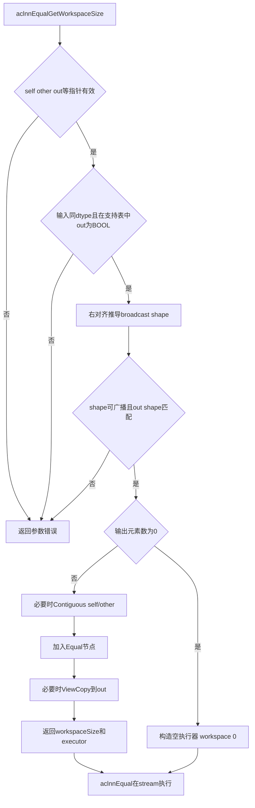
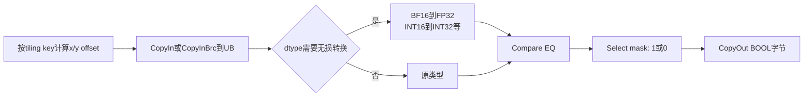

# 需求背景（required）

## 需求来源

本需求来自 CANN 2026 年 8 月社区算子任务，目标是在昇腾 ops-math 开源仓为 aclnnEqual 补齐 Atlas A2/A3 的 Ascend C 实现，使公共 ACLNN 接口在 A2/A3 上与 CPU 逻辑值比较语义一致。与原 TBE 实现的关键区别在于：比较方式从二进制位比较改为与 CPU 一致的逻辑值比较。适配硬件为 Atlas A2 训练系列与 Atlas A3 系列，验收采用 AscendOpTest 工具。

## 背景介绍

### Equal算子实现优化

aclnnEqual 对两个张量做可广播的逐元素逻辑相等比较，输出 BOOL。浮点语义要求：`+0.0 == -0.0` 为 true；任意 NaN 与任何值（含自身）为 false；同号 Infinity 相等、异号不等；普通值按精确 `==` 判断，不引入容差。输出 bit-exact，matched ratio 为 1.0。

本任务复用稳定 `math/equal` 的 `BroadcastSch/BroadcastBaseTiling` 与 Equal DAG，并补齐 A2/A3 支持。设计选择：

1. Host 复用成熟 `BroadcastBaseTiling`，Kernel 复用 `BroadcastSch` 和 Equal DAG；若 arch22 编译栈不能使用 APT 模板，则以相同 tiling 语义实现显式 Ascend C pipeline。
2. 设置多个 tiling key：无广播、标量广播、简单尾轴广播、通用广播。高频路径不执行逐元素多维除模。
3. 比较必须精确：能原生 Compare 的 dtype 直接比较；BF16 必要时无损转 FP32；INT64 必要时拆为两个 32 位字并同时相等。
4. 输出使用 1 字节 BOOL（kernel 内按 `uint8_t/int8_t` 存 0/1）。Compare 生成 mask 后用 Select 转为每元素 0/1，不能把压缩 bit mask 直接当输出。
5. 空输出是合法结果：workspaceSize=0，成功返回，不发射 kernel。

### Equal算子现状分析

| 实现 | 位置/版本 | 评价 |
|---|---|---|
| 稳定 Equal | ops-math commit `01f9e0bf46470e22b96fd5124812801ecf5c9c2b`；`math/equal/op_kernel/equal_apt.cpp`、`arch35/equal_dag.h`、`op_host/arch35/equal_tiling_arch35.cpp` | 已采用 `BroadcastSch/BroadcastBaseTiling`；核心是 `Compare(EQ)+Select(1,0)`，语义正确，是首选参考 |
| experimental Equal | `experimental/math/equal/` | 不能直接交付：infer shape 复制 x1；tiling 只按 x1 长度；kernel 同偏移访问 x1/x2，未实现真实广播；空 tensor 报错；缺 INT16/INT64/BOOL；只注册 ascend910b |
| 内置 TBE Equal | CANN 安装目录 dynamic TBE 实现 | 用于性能和支持面基线；任务明确要求替换其中位比较语义，不能照搬计算方式 |
| CPU/框架 Equal | NumPy/PyTorch 或任务 golden | 用于逻辑值语义与边界 golden，不是 NPU 运行依赖 |

experimental 候选对 FP16/BF16 使用 `Sub -> Abs -> Mins -> Muls` 近似判断是否相等。这会把相邻非相等值误判，减法溢出也会改变结果；其 BF16 分支还按 half 操作。因此本设计不在该算法上打补丁，而是移植稳定实现的精确 `Compare EQ` 路线并补齐 A2/A3 支持。

### Equal算子功能分析

算子功能：对输入张量 self 和 other 逐元素做逻辑值相等比较，支持广播，输出 BOOL 张量 out。

输入：self、other（dtype 一致，ND 格式，支持广播）。

输出：out（BOOL，shape 与广播结果一致）。

支持数据类型：FLOAT16、FLOAT、BFLOAT16、INT8、INT16、INT32、INT64、BOOL（随附 `op.json` 还列出 UINT8）。

支持形状：ND，支持广播。

支持广播：支持。

# 需求分析（required）

## 需求描述

使用 Ascend C 实现 aclnnEqual 的 Atlas A2/A3 arch22 版本，比较方式采用与 CPU 一致的逻辑值比较，支持任务书列出的全部 dtype 与 ND 格式，满足广播泛化与空 tensor 语义；输出 BOOL 与 CPU golden 完全一致（matched ratio = 1.0），性能不低于 TBE 基线 95%。

## 需求拆解

1. 复用 ops-math 公共 ACLNN 接口 aclnnEqualGetWorkspaceSize / aclnnEqual。
2. 支持 FLOAT16、FLOAT、BFLOAT16、INT8、INT16、INT32、INT64、BOOL，并纳入 UINT8。
3. 比较方式采用逻辑值比较（+0.0/-0.0、NaN、±Inf 语义与 CPU 一致）。
4. 支持相同 shape 与可广播 shape（含标量广播），实现广播泛化。
5. 输出 BOOL，每元素显式规范为 0/1。
6. 空输出（含 0 维）作为合法结果，workspaceSize=0 且不发射 kernel。
7. 精度满足 rtol=0、atol=0、matched_ratio=1.0、max_abs_error=0。
8. 所有核参与的大 shape 性能不低于 TBE 基线 95%。
9. 在 Atlas A2/A3 完成编译、功能、精度、性能验证。
10. 提供 AscendOpTest 全场景自测用例与可复现报告。

# 详细设计（required）

## 算子分析

### 数学公式

    out[i] = (broadcast(self)[i] == broadcast(other)[i]) ? true : false

其中 `==` 为逻辑值相等比较（非二进制位比较）：

- `+0.0` 与 `-0.0` 视为相等；
- NaN 与任意值（包括 NaN 本身）视为不相等；
- `+Inf` 与 `+Inf` 相等，`-Inf` 与 `-Inf` 相等，异号 Inf 不相等；
- 整数类型按数值大小直接比较；
- 普通浮点值按精确 `==` 判断，不引入容差。

### 支持数据类型

| 输入 dtype | 实现策略 | 输出 |
|---|---|---|
| FLOAT16 | 原生 `Compare EQ` | BOOL |
| FLOAT32 | 原生 `Compare EQ` | BOOL |
| BFLOAT16 | 原生支持则直接比较；否则无损 Cast 到 FP32 后比较 | BOOL |
| INT8 | 原生比较，或无损 Cast 到 INT16/FP16 | BOOL |
| UINT8 | 本地 `op.json` 明确包含；原生比较或无损 Cast 到 FP16 | BOOL |
| INT16 | 原生比较，或无损 Cast 到 INT32 | BOOL |
| INT32 | 原生 `Compare EQ` | BOOL |
| INT64 | 原生支持则直接；否则高/低 32 位分别比较并 AND | BOOL |
| BOOL | 以 int8 比较合法的 0/1 编码 | BOOL |

两输入 dtype 必须相同，格式为 ND。不主动扩大到 UINT16/UINT32/UINT64/DOUBLE/COMPLEX，避免越过任务范围。

### 支持形状

两个 shape 从末维右对齐。每一维满足 `xDim==yDim`、`xDim==1` 或 `yDim==1`，输出维度为 `max(xDim,yDim)`；否则参数错误。标量 shape `[]` 可广播到任意合法 shape。任何输出维为 0 时，输出元素数为 0，算子成功。

例如：

    x: [2, 1, 4]
    y: [   3, 1]
    补齐后 y: [1, 3, 1]
    out:    [2, 3, 4]

计算复杂度为 O(N)（N 为广播后输出元素数），额外 kernel workspace 为 O(1)。无广播大张量受 GM 带宽限制，通用广播则可能受整数除模和离散访存限制，因而需要按广播模式分流。

## 算子实现

### 实现方案

ACLNN 两段接口：GetWorkspaceSize 完成校验、广播 shape 推导和执行图构建；aclnnEqual 在指定 stream 异步执行。

```cpp
aclnnStatus aclnnEqualGetWorkspaceSize(
    const aclTensor *self, const aclTensor *other, aclTensor *out,
    uint64_t *workspaceSize, aclOpExecutor **executor);

aclnnStatus aclnnEqual(
    void *workspace, uint64_t workspaceSize,
    aclOpExecutor *executor, aclrtStream stream);
```

执行流：



非连续 Tensor 由 ACLNN 层的 `Contiguous` 规范化；若 out 是非连续 view，用 `ViewCopy` 写回。核心 Equal kernel 只处理连续 ND，kernel workspace 为 0；ACLNN 的格式化节点可能使整个执行器需要 workspace，因此 GetWorkspaceSize 不能无条件写 0。

#### 3.2.1 host侧设计

##### 1. Shape推导

从尾维向前右对齐，逐维判断相等或一侧为 1，记录 outDim=max；每次维度乘法使用 `uint64_t` 溢出检查。不得像 experimental 候选一样直接复制 x1 shape。支持 rank 与 GE/ops-math 框架允许的最大 rank 一致；相邻维若具有相同广播模式可合并，降低通用索引维数。

##### 2. TilingKey规划

| key | 条件 | Kernel 索引策略 |
|---:|---|---|
| 0：CONTIGUOUS | x、y、out shape 相同 | 三者相同线性 offset，最高吞吐 |
| 1：SCALAR_X/SCALAR_Y | 任一输入总元素数为 1 | 标量常驻 UB，另一输入连续搬运 |
| 2：SIMPLE_BRC | 广播可归并为 outer/repeat/inner，尤其尾轴广播 | 块搬运 + Duplicate/CopyInBrc，不做每元素坐标反解 |
| 3：GENERAL_BRC | 其他合法广播 | BroadcastSch 或 shape/stride 通用映射 |

稳定实现的 `BroadcastBaseTiling` 已能产生 schedule mode 时，直接将其 mode 编入 tiling key，避免重复维护另一套广播判定。

##### 3. 自定义TilingData备选

如果 arch22 无法复用 `BroadcastBaseTiling`，TilingData 至少包含：`rank,totalLength`、`blockLength,formerNum,tailLength`、`tileLength,tileNum,lastTileLength`、右对齐合并后的 `xShape/yShape/outShape`、`xStride/yStride`（广播维 stride=0）、`simpleOuter,simpleRepeat,simpleInner`、`dtype,path`。数组长度使用仓库统一的 `MAX_DIM_NUM`；Host 检测框架 rank 超限并返回明确错误，而不是截断。

通用路径中，输出线性索引 `linear` 映射为：

    remain = linear
    xOffset = 0; yOffset = 0
    for d = rank-1 .. 0:
        coord = remain % outShape[d]
        remain = remain / outShape[d]
        xOffset += coord * xStride[d]   // broadcast维stride为0
        yOffset += coord * yStride[d]

连续/简单 key 不执行这段循环，这是达到 TBE 95% 的关键。

##### 4. 分核与UB

- `blockDim=min(aivCoreNum, ceil(totalLength/minElementsPerCore))`；大 shape 应让所有 AIV 参与。
- 每核输出区间不重叠，除最后一核外按 32 Byte 输出边界切分，避免两个核写同一 cache line。
- UB 按两个输入、一个 byte 输出、Compare mask、Select 常量和 dtype 转换临时区估算；预留系统空间后选择最大对齐 tile。
- 输入/输出 DataCopy 长度按 32 Byte 对齐，尾块用 DataCopyPad 或掩码写有效元素，不能访问 tensor 边界外。
- double buffer 仅在 UB 容量允许时启用，使 CopyIn、Compute、CopyOut 流水；小 tensor 使用单 tile 单核减少初始化开销。

##### 5. ACLNN侧校验

GetWorkspaceSize 校验顺序：

1. `self/other/out/workspaceSize/executor` 非空。
2. self/other dtype 相同且受支持，out dtype 为 BOOL。
3. 输入/输出维数和每维合法，完成 broadcast infer。
4. out view shape 与推导 shape 完全一致。
5. 构造必要的 `Contiguous(self/other)`。
6. 分配内部 BOOL 连续输出并调用 `Equal`。
7. out 非连续或内部地址不同则 `ViewCopy`。
8. 从 executor 返回真实 workspaceSize。

`aclnnEqual` 校验 executor、workspaceSize 和 workspace；若 executor 需要的 workspace 非零，传入指针不得为空且大小不得不足。执行错误原样返回 ACLNN 状态。

#### 3.2.2 kernel侧设计

##### 1. Pipeline



稳定 APT 路径可直接表达为：

    InputX = CopyInBrc<T>
    Mask   = Compare<uint8_t,T,EQ>(X,Y)
    Out    = Select<uint8_t>(Mask, 1, 0)
    CopyOut(Out)

##### 2. 各dtype精确性

- FP16/FP32：必须使用 EQ compare，不得先相减。硬件比较自然满足 signed zero、NaN、Inf 语义，但需用专项测试在 A2/A3 各验证一次。
- BF16：若 arch22 Compare 不接受 BF16，转为 FP32。所有 BF16 数值均可在 FP32 中精确表示，不改变相等关系；禁止按 half 重解释内存。
- INT8/UINT8：转 FP16 仍然精确；可根据原生指令吞吐选择直接比较或转换。
- INT16：转 INT32 精确。
- INT32：直接比较；禁止转 FP32，因为大于 2^24 后会把不同整数舍入成相同值。
- INT64：若无原生 Compare，将每个 64 位元素拆为 low32/high32；`eq=eqLow AND eqHigh`。
- BOOL：合法 ACL BOOL 为 0/1，以 int8 直接比较。输出始终显式规范为 0/1。

##### 3. 广播Kernel

CONTIGUOUS 直接从每核 base 连续读取。SCALAR 把标量读一次后 Duplicate 到 tile。SIMPLE_BRC 按 `outer/repeat/inner` 搬入连续 inner 段并复用。GENERAL_BRC 优先调用稳定 `BroadcastSch<schMode,OpDag>`；手工备选按 stride 映射 GM offset，并尽可能把最内层连续段聚合为一次搬运。

##### 4. 空张量和尾块

Host 在 `totalLength==0` 时不发射 kernel，输出 shape 正常返回。非空尾 tile 的 vector repeat 和 DataCopy 长度分别计算：vector 用 mask 限制有效元素，CopyOut 只写有效 byte；不得以向上对齐长度覆盖 out 后方内存。

#### 3.2.3 文件组织

任务书要求合入 `experimental/math`，建议在现有目录内替换不完整实现，同时尽量复用稳定组件：

    experimental/math/equal/
      op_host/equal_def.cpp
      op_host/equal_infershape.cpp
      op_host/equal_tiling.cpp
      op_kernel/equal.cpp
      op_kernel/equal.h
      op_kernel/equal_tiling_data.h
      op_kernel/equal_tiling_key.h
      op_api/equal.cpp / equal.h
      tests/ut/op_host/
      tests/ut/op_kernel/

产品注册至少包含 `ascend910b`（A2）和仓库对 A3 使用的 `ascend910_93`/对应 SoC 配置，名称以当前 ops-math 构建系统为准。

## 支持硬件

| 项目 | 结论 |
|---|---|
| Atlas A2 / Ascend 910B | 目标平台；需注册 ascend910b 并验证 arch22 Compare/Cast 能力 |
| Atlas A3 | 目标平台；补齐仓库要求的 A3 SoC 配置，单独编译和功能/性能验证 |
| CANN | 使用 ops-math 当前分支指定版本；任务书未固定 9.0.0 |
| 910B + CANN 9.0.0 | 硬件匹配 A2，但不能据此宣称满足全部任务；需确认该版本具备目标仓 Broadcast/APT 与 BF16/INT64 路径 |

## 算子约束限制

1. self 和 other 的数据类型必须一致，不支持不同 dtype 输入。
2. self 和 other 的 shape 需满足广播规则，否则触发参数校验报错。
3. out 的 shape 必须与广播后结果 shape 一致。
4. out 的数据类型必须为 BOOL。
5. 仅支持 FLOAT16/FLOAT/INT8/INT16/INT32/INT64/BOOL/BFLOAT16（及随附 op.json 的 UINT8）。
6. 输出 BOOL 每元素规范为 0/1，不返回压缩 bit mask。
7. 空输出（含 0 维）为合法结果，不发射 kernel。
8. Device 路径异步执行，读回结果前必须同步 stream。

风险与待确认项：

| 风险/冲突 | 处理方案 |
|---|---|
| arch35 的 APT/Broadcast 模板在 arch22 不可直接编译 | 先做最小编译验证；失败时用本文 TilingData 和四 key 显式实现相同语义 |
| 任务书未列 UINT8，本地 op.json 列出 UINT8 | 实现和测试纳入 UINT8，合入前由任务方确认最终接口表 |
| experimental 候选不支持真广播 | 替换 infer shape、tiling、kernel，增加交错广播差分测试 |
| INT64 误转 FP32/FP16会误判 | 原生 int64 compare 或 high/low 32 位双比较，加入大整数邻值测试 |
| BF16 被按 half 重解释 | 原生 BF16 或无损 BF16->FP32，禁止 reinterpret |
| BOOL Compare mask 与 byte 输出布局不同 | Compare 后 Select 为逐元素 0/1，再 CopyOut |
| 空 tensor 被旧 tiling 判失败 | Host totalLength==0 成功且跳过 kernel |
| GENERAL 广播性能不达 95% | 维度合并、简单模式专用 key、连续内层分段搬运 |

# 可维可测分析

## 精度标准/性能标准

| 验收标准 | 描述 | 标准来源 |
|---|---|---|
| 精度标准 | 输出 BOOL 与 CPU golden 完全一致：rtol=0、atol=0、matched_ratio=1.0、max_abs_error=0 | CANN 生态算子精度标准、任务书 |
| 性能标准 | 所有核参与的大 shape 性能不低于 TBE 基线 95% | 任务书 |
| 内存标准 | kernel workspace 为 0；ACLNN 格式化节点 workspace 按需返回 | 实现设计 |

功能矩阵：

| 类别 | 必测内容 |
|---|---|
| dtype | FLOAT16/FLOAT32/BF16/INT8/UINT8/INT16/INT32/INT64/BOOL 全覆盖 |
| 无广播 | 标量、[1]、[31]/[32]/[33]、[256,256]、两个性能大 shape |
| 标量广播 | x 或 y 分别为 []、[1]；结果全 true、全 false、混合 |
| 简单广播 | [N,1] vs [N,M]、[1,M] vs [N,M]、尾轴和中间轴广播 |
| 通用广播 | [2,1,4] vs [1,3,1]；5D/8D 交错广播；左右次序交换 |
| shape 边界 | 不可广播；输出 shape/dtype 错；含 0 维的空 tensor；shape size 溢出 |
| 浮点语义 | +0/-0、不同 NaN payload、NaN 自身、±Inf、最小正规/非正规、相邻 FP 值 |
| 整数精确性 | INT32 的 2^24 邻值；INT64 的 2^32、2^53、INT64_MIN/MAX 邻值 |
| BOOL | 全 true、全 false、混合 0/1 |
| ACLNN | self/other/out 非连续 view；空指针；workspace 不足；异步 stream |
| 尾块 | 元素数 1、7、31、32、33、255、256、257；用 guard 区检查越界写 |

性能自测 case：

| dtype | shape | 场景 |
|---|---|---|
| FLOAT16 | [1024,4096] | 大 shape、全核 |
| FLOAT16 | [4096,4096] | 大 shape、全核 |
| FLOAT32 | [1024,4096] | 大 shape、全核 |
| INT32 | [1024,4096] | 大 shape、全核 |
| FLOAT16 | [256,256] | 小 shape |

小 shape 若总耗时低于 10 us 且相差不超过 3 us，可按任务要求提供仿真图和启动开销分析，但仍需保证功能完全一致。

性能观测分别覆盖无广播、scalar、simple、general 四条路径，记录 Host tiling 时间、kernel 时间、AIV 利用率、GM 带宽、vector 指令占比和总 workspace。优化优先级：无广播连续路径接近内存带宽上限；标量只读一次并驻留 UB；简单广播复用 UB tile；GENERAL 合并相邻维、内层连续段向量化；INT64 拆分路径两个 compare 和 AND 在 UB 融合。

可维可测：

- Host 日志包含输入 shape/dtype、推导 shape、tiling key、blockDim、tileLength、workspace，不打印数据。
- shape 不可广播时打印从右数第几维及双方维值，便于定位。
- 通过编译期 dtype 分支消除热路径动态 switch；不支持 dtype 在 Host 阶段失败。
- kernel launch/ACLNN 子算子错误均上抛，不以 SUCCESS 掩盖。
- 自测报告按 dtype、广播模式、特殊值、性能分别汇总，附设备、CANN、ops-math commit 和 TBE 基线采集方式。
- 使用 AscendOpTest 执行 equal_testCase，golden 按 NumPy/PyTorch 逻辑 == 生成；与稳定 math/equal 做差分测试，与 experimental 旧实现跑反例证明已修复广播、空 tensor 和近似判等。

## 兼容性分析

| 用途 | 库 |
|---|---|
| 目标实现 | cann/ops-math、Ascend C/ACLNN runtime |
| 主要参考 | 同仓稳定 math/equal 的 BroadcastSch/BroadcastBaseTiling 和 Equal DAG |
| 验收工具 | HIT1920/AscendOpTest |
| CPU golden | NumPy 或 PyTorch Equal；以验收工具实际 golden 为准 |

目标 kernel 运行时不依赖 NumPy/PyTorch，它们只用于生成测试结果。

兼容性结论：接口签名、状态码与异步 stream 语义与既有 ACLNN 约定一致；新增实现替换 experimental/math/equal 的不完整版本，不改动稳定 math/equal 算法；构建仅在 arch22 目标启用新代码，arch35 保持原实现。
