# 【CANN社区任务】SpMV 算子详细设计文档

| 项目 | 内容 |
| --- | --- |
| 任务编号 | `08-SPMV` |
| 任务名称 | 8月社区任务-SpMV算子开发 |
| 提交团队 / 目录 | `hongwei-2026` |
| 文档路径 | `04_tasks/01_community-task-2026/tasklist/08-SPMV/hongwei-2026/docs/design.md` |
| 目标代码仓 | `https://gitcode.com/cann/ops-sparse` |
| 目标代码目录 | `src/spmv` |
| 目标硬件 | Atlas 950PR（`ascend950` / `arch35`） |
| 对标参考 | NVIDIA cuSPARSE `cusparseSpMV` |
| 文档版本 | **v2.1**（目录调整为 8 月任务 `08-SPMV`） |

---

## 文档导读

| 章节 | 内容 | 关键图 |
| --- | --- | --- |
| 一、需求背景 | 来源、CSR/cuSPARSE 对标、难点 | 图 1-1 |
| 二、需求分析 | F1~F10、dtype、边界 | 图 2-1 |
| 三、详细设计 | 接口、分桶混合、Host/Kernel | 图 3-x 全套 |
| 四、可维可测 | 精度/性能/详细测试用例 | 图 4-x |
| 五、交付计划 | 里程碑 | 图 5-1 |

---

# 需求背景（required）

## 需求来源

本需求来源于 2026 年 CANN 社区任务 **「8月社区任务-SpMV算子开发」**（**`08-SPMV`**）。任务要求参考 [cuSPARSE SpMV](https://docs.nvidia.com/cuda/cusparse/#cusparsespmv)，在 **Atlas 950PR** 上使用 **Ascend C** 实现功能一致的稀疏矩阵向量乘（SpMV）算子，验收后合入 `ops-sparse/src/spmv`。

核心验收要求：

1. 与 cuSPARSE SpMV **功能对齐**：CSR 格式、转置/非转置、`alpha`/`beta` 融合、多 dtype 组合、非连续 Tensor。
2. 提供 **三阶段接口**：`GetBufferSize` → `Preprocess`（可选）→ `SpMV`。
3. 精度满足《[生态算子开源精度标准](https://gitcode.com/cann/opbase/blob/master/docs/zh/ops_precision_standard/experimental_standard.md)》。
4. 性能达到任务书标杆的 **≥ 0.5×**（GPU A100 对标）。
5. **确定性计算**：相同输入多次执行结果一致。
6. 稀疏度泛化 **50%~99.9%**；200 条泛化用例全过。

#### 图 1-1 任务定位

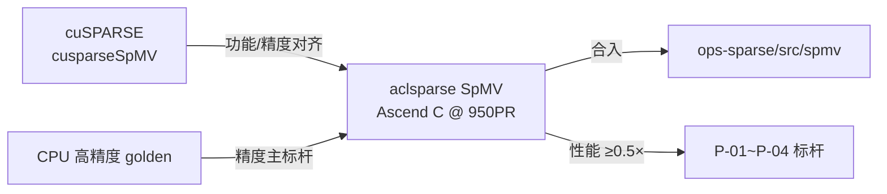

## 背景介绍

### SpMV 算子概述

SpMV（Sparse Matrix-Vector Multiplication）是稀疏线性代数基础算子：

```text
Y = alpha * op(A) * X + beta * Y
```

| 符号 | 含义 |
| --- | --- |
| `A` | CSR 稀疏矩阵（`csrRowPtr`, `csrColInd`, `csrVal`） |
| `X` | 稠密输入向量 |
| `Y` | 输入输出稠密向量（原位累加） |
| `op(A)` | `A`（非转置）或 `A^T`（转置） |
| `alpha`, `beta` | 标量系数（指针，类型与 computeType 一致） |

应用场景：图计算、PageRank、共轭梯度、推荐系统、稀疏神经网络等。

### CSR 格式说明

| 数组 | 长度 | 含义 |
| --- | --- | --- |
| `csrRowPtr` | M+1 | 第 i 行非零元在 `csrVal/csrColInd` 中的起始下标 |
| `csrColInd` | NNZ | 非零元列号 |
| `csrVal` | NNZ | 非零元数值 |

稀疏度定义：$\mathrm{sparsity} = 1 - \mathrm{NNZ}/(M \times K)$。任务书要求支持 **50%~99.9%**。

### cuSPARSE 能力摘要（功能对标）

| 参数 | 含义 | 本任务 |
| --- | --- | --- |
| `matA` | 稀疏矩阵描述符 | CSR，int32 索引 |
| `vecX/vecY` | 稠密向量描述符 | 支持 stride |
| `opA` | NON_TRANSPOSE / TRANSPOSE | 支持 |
| `alpha/beta` | 标量指针 | computeType 一致 |
| `computeType` | 中间计算精度 | fp32 / int32 |
| `externalBuffer` | workspace | 三阶段共享 |
| Preprocess | 可选预处理 | 分桶/CSC 元数据 |

### ops-sparse A2 现有实现（参考）

仓内 `src/spmv` 当前为 **A2** 方案：16 行 row block + padding 到 16×max_nnz + AIV gather + AIC Cube/MMAD。**本任务在 950PR（arch35）上重新设计**，参考工程组织，采用 **分桶混合** 提升不同 row_nnz 分布下的泛化性能，**不得简单照搬 A2 核配置**。

### 实现难点（设计动机）

| 难点 | 说明 | 本设计应对 |
| --- | --- | --- |
| 行长度不均 | row_nnz 从 0 到数万 | Short/Medium/Long 分桶 |
| 间接访存 | `X[colInd]` gather | AIV 批量 gather + 局部性优化 |
| 转置写冲突 | 多行写同一 Y[col] | CSC preprocess 或 atomic fallback |
| Cube padding 浪费 | 16 行 block 内 nnz 差异大 | 按 nnz 相近分组；padding>2× 回退 Short |
| dtype 组合多 | 5 种合法组合 | 模板解耦 input/compute/output |
| 确定性 | 多次结果一致 | 固定归约顺序 / 无竞态 CSC 路径 |

本设计采用 **「Preprocess 分桶分析 + Execute 多路径混合」**：按 `row_nnz` 划分 **Short(1~8) / Medium(9~128) / Long(>128)**，分别走 Vector、Cube/MMAD、Segment+Reduce；转置按规模选择 scatter 或 CSC。

---

# 需求分析（required）

## 需求描述

在 Atlas 950PR 上实现 SpMV：CSR 输入，非转置/转置、`alpha`/`beta` 融合、任务书 dtype 组合、非连续 Tensor、稀疏度 50%~99.9%，三阶段 aclsparse 接口，性能 ≥ 标杆 0.5×，确定性输出，200 泛化用例全过。

## 需求拆解

| 编号 | 模块 | 需求 |
| --- | --- | --- |
| F1 | CSR 解析 | int32 索引；单调性/越界/NNZ 一致性校验 |
| F2 | 非转置 | `Y = alpha * A * X + beta * Y` |
| F3 | 转置 | `Y = alpha * A^T * X + beta * Y` |
| F4 | dtype | 任务书 5 种 A/X/compute/Y 组合 |
| F5 | alpha/beta | {0, 0.5, 1.0, 2.0} 及通用值 |
| F6 | 三阶段 API | GetBufferSize / Preprocess / SpMV |
| F7 | 非连续 Tensor | X/Y stride 寻址 |
| F8 | 稀疏泛化 | 50%~99.9%；空行、长行、NNZ=0 |
| F9 | 确定性 | 同输入同输出，重复 100 次一致 |
| F10 | 性能/测试 | P-01~P-04 ≥0.5×；200 case + 详细 F/Q/B/N |

#### 图 2-1 需求追溯

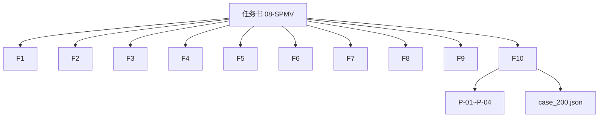

## 支持的数据类型组合（任务书）

| 输入 A、X 类型 | computeType | 输出 Y 类型 | 计算策略 |
| --- | --- | --- | --- |
| float32 | float32 | float32 | 全程 FP32 |
| int8 | int32 | int32 | INT8 乘，INT32 累加 |
| int8 / float16 / bfloat16 | float32 | float32 | 输入提升 FP32，FP32 输出 |
| float16 | float32 | float16 | FP32 累加，cast 写回 FP16 |
| bfloat16 | float32 | bfloat16 | FP32 累加，cast 写回 BF16 |

`alpha`、`beta` 指针类型须与 **computeType** 一致（fp32 或 int32）。

## 任务书原始参数表（底层）

| 参数 | 方向 | dtype | shape | 约束 |
| --- | --- | --- | --- | --- |
| csrRowPtr | 输入 | INT32 | [M+1] | 单调非减，[0,NNZ] |
| csrColInd | 输入 | INT32 | [NNZ] | [0, K-1]（非转置） |
| csrVal | 输入 | FP16/BF16/FP32/INT8 | [NNZ] | 与组合表匹配 |
| x_vec | 输入 | 同上 | [K] 或 [M]（转置） | 可非连续 |
| y_vec | 输入输出 | 同上 | [M] 或 [K] | 可非连续 |
| trans | 属性 | bool | — | True/False |
| alpha/beta | 属性 | FP32（标量） | — | 与 computeType 一致 |
| compute_type | 属性 | INT32/FP32 | — | 枚举合法 |

## 范围边界

**交付**：CSR；非转置/转置；上述 dtype；三阶段 aclsparse；950PR；确定性；200 用例。

**不交付**：COO/ELL 等其它格式（后续扩展）；反向；表外 dtype 组合。

## 外部依赖与版本策略

| 依赖 | 策略 |
| --- | --- |
| CANN / ops-sparse | 以仓指定版本为准，报告记录 commit |
| cuSPARSE | 功能参考；浮点可选双标杆 |
| CPU golden | 高精度 SpMV 参考实现 |

## 评审关注项

1. **任务目录**：必须为 **`08-SPMV`**（8 月任务目录；`05-3-SPMV` 为已下线 5 月任务，勿用）。
2. **aclsparse 命名**：小写前缀，三阶段与 cuSPARSE 语义对齐。
3. **分桶阈值**：Short≤8、Medium≤128、Long>128 是否合适。
4. **转置切换**：NNZ/规模阈值与 `alg` 默认行为。
5. **性能口径**：timed region 是否含 Preprocess；与标杆同机同配置。
6. **确定性**：atomic 路径如何保证或可配置禁用。

---

# 详细设计（required）

## 算子分析

### 数学公式

**非转置**（A: M×K，X: K，Y: M）：

$$
Y_i = \alpha \sum_{p=\mathrm{ptr}_i}^{\mathrm{ptr}_{i+1}-1} V_p \cdot X_{c_p} + \beta \cdot Y_i
$$

**转置**（A: M×K，X: M，Y: K）：

$$
Y_j \leftarrow \beta \cdot Y_j + \alpha \sum_{i:\,(i,j)\in\mathrm{NZ}(A)} V_{ij} \cdot X_i
$$

### 伪代码（非转置）

```text
for row in [0, M):
    acc = 0
    for p in [csrRowPtr[row], csrRowPtr[row+1]):
        col = csrColInd[p]
        val = cast_to_compute(csrVal[p])
        acc += val * cast_to_compute(X[col * strideX])
    Y[row * strideY] = alpha * acc + beta * Y[row * strideY]
```

### 伪代码（转置 scatter）

```text
for col in [0, K): Y[col] = beta * Y[col]
for row in [0, M):
    xVal = X[row]
    for p in [csrRowPtr[row], csrRowPtr[row+1]):
        col = csrColInd[p]
        atomic_add(Y[col], alpha * csrVal[p] * xVal)
```

### 参数校验（Host）

| 条件 | 行为 |
| --- | --- |
| csrRowPtr 非单调 / NNZ 不一致 | 报错 |
| colInd 越界 | 报错 |
| dtype 组合非法 | 报错 |
| shape 与 opA 不匹配 | 报错 |
| workspace 空/过小 / 签名不匹配 | 报错或自动 re-preprocess |
| handle/描述符空指针 | 报错 |

---

## 接口设计

### 句柄与描述符（拟）

```c
aclsparseStatus_t aclsparseCreate(aclsparseHandle_t *handle);
aclsparseStatus_t aclsparseDestroy(aclsparseHandle_t handle);
aclsparseStatus_t aclsparseSetPointerMode(aclsparseHandle_t handle,
    aclsparsePointerMode_t mode);

aclsparseStatus_t aclsparseCreateDnVec(aclsparseDnVecDescr_t *descr,
    int64_t size, void *values, aclDataType valueType);
aclsparseStatus_t aclsparseCreateDnVecEx(aclsparseDnVecDescr_t *descr,
    int64_t size, int64_t stride, void *values, aclDataType valueType);

aclsparseStatus_t aclsparseCreateCsr(aclsparseSpMatDescr_t *descr,
    int64_t rows, int64_t cols, int64_t nnz,
    void *csrRowOffsets, void *csrColInd, void *csrValues,
    aclsparseIndexType_t idxType, aclsparseIndexBase_t idxBase,
    aclDataType valueType);
```

`CreateDnVecEx` 支持 **非连续** 向量（任务书要求）。

### 三阶段 SpMV API（任务书必选）

```c
aclsparseStatus_t aclsparseSpMVGetBufferSize(
    aclsparseHandle_t handle, aclsparseOperation_t opA,
    const void *alpha, aclsparseConstSpMatDescr_t matA,
    aclsparseConstDnVecDescr_t vecX, const void *beta,
    aclsparseDnVecDescr_t vecY, aclDataType computeType,
    aclsparseSpMVAlg_t alg, size_t *bufferSize);

aclsparseStatus_t aclsparseSpMVPreprocess(
    aclsparseHandle_t handle, aclsparseOperation_t opA,
    const void *alpha, aclsparseConstSpMatDescr_t matA,
    aclsparseConstDnVecDescr_t vecX, const void *beta,
    aclsparseDnVecDescr_t vecY, aclDataType computeType,
    aclsparseSpMVAlg_t alg, void *externalBuffer);

aclsparseStatus_t aclsparseSpMV(
    aclsparseHandle_t handle, aclsparseOperation_t opA,
    const void *alpha, aclsparseConstSpMatDescr_t matA,
    aclsparseConstDnVecDescr_t vecX, const void *beta,
    aclsparseDnVecDescr_t vecY, aclDataType computeType,
    aclsparseSpMVAlg_t alg, void *externalBuffer);
```

| 阶段 | 职责 |
| --- | --- |
| GetBufferSize | 校验；估算 workspace（分桶元数据、CSC、partial sum、签名） |
| Preprocess | 分析 CSR；生成 Short/Medium/Long/CSC 元数据；写 signature |
| SpMV | 校验 signature；启动混合 Kernel；写回 Y |

**算法枚举（拟）**：

| alg | 转置行为 |
| --- | --- |
| `ACLSPARSE_SPMV_CSR_ALG1` | 转置：直接 scatter/atomic |
| `ACLSPARSE_SPMV_CSR_ALG2` | 转置：强制 CSC preprocess |
| 默认 | 非转置分桶；转置 NNZ>4096 倾向 CSC |

#### 图 3-1 三阶段调用时序

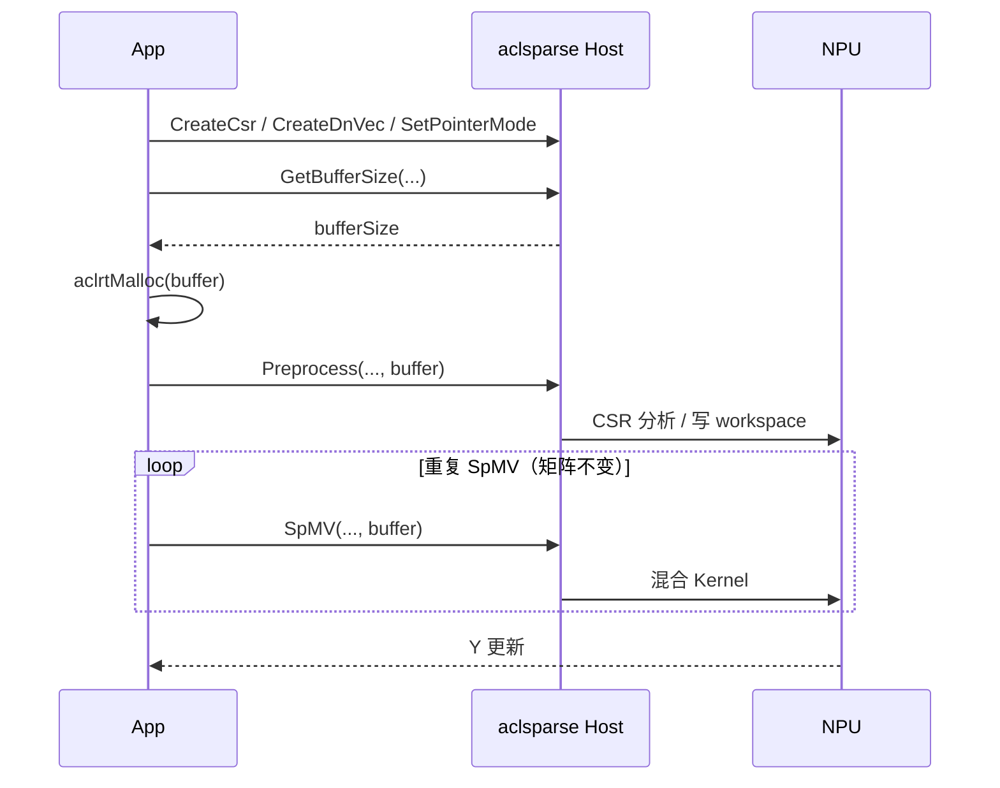

#### 图 3-2 PyTorch/测试层调用（200 用例）

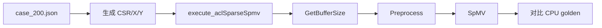

---

## 算子实现

### 总体架构：Preprocess 分桶 + Execute 混合

#### 图 3-3 分层架构

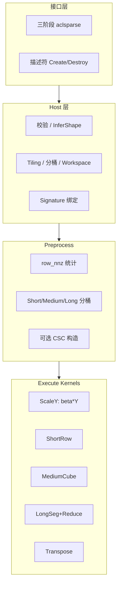

### 分桶策略（核心设计）

Preprocess 计算 `row_nnz[i] = csrRowPtr[i+1] - csrRowPtr[i]`：

| 类型 | row_nnz | 路径 | 理由 |
| --- | --- | --- | --- |
| Empty | 0 | 仅 `Y=beta*Y` | 无 nnz 遍历 |
| **Short** | 1~8 | AIV Vector/SIMT | 避免 Cube padding |
| **Medium** | 9~128 | 16-row block + AIV gather + AIC MMAD | 规则化 CSR |
| **Long** | >128 | segment(512 nnz) + partial + reduce | 消除拖尾 |

**Medium 二次分桶**（降低 padding）：

| bucket | row_nnz 范围 | 16 行 block max_nnz |
| --- | --- | --- |
| B1 | 9~16 | 16 |
| B2 | 17~32 | 32 |
| B3 | 33~64 | 64 |
| B4 | 65~128 | 128 |

**回退规则**：若 `16 * max_nnz_in_block > 2 * sum_real_nnz_in_block`，该 block 中各行改走 **Short 直接路径**。

#### 图 3-4 Preprocess + Execute 总流程

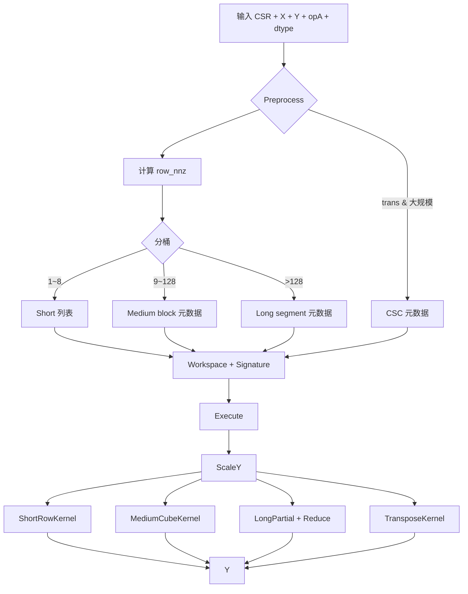

### Short Row 路径

```text
每个 AIV/SIMT work item 处理 1~N 个 short row（N 小）
直接 GM 读 csrVal/colInd，gather X[col]
computeType 累加
Y[row] += alpha * acc  （ScaleY 已做 beta*Y）
```

适合：高稀疏度、大量空行/短行（P-02/P-04 等）。

### Medium Row 路径（16 行 Cube）

```text
Preprocess: 按 bucket 组 16 行 block，记录每行 nnz、padding 后 tile 形状
Execute:
  AIV: 读 colInd，Gather X → UB
  AIC: 加载 padded values + gathered X，INT/FP MMAD → partial [16 x 1]
  AIV: 提取每行结果，alpha 缩放，写 Y（stride 感知）
```

**FP32 Medium** 走 Cube；**FP16/BF16/INT8** 首版 Vector 回退（后续可扩展 Cube 模板）。

#### 图 3-5 Medium AIC/AIV 流水

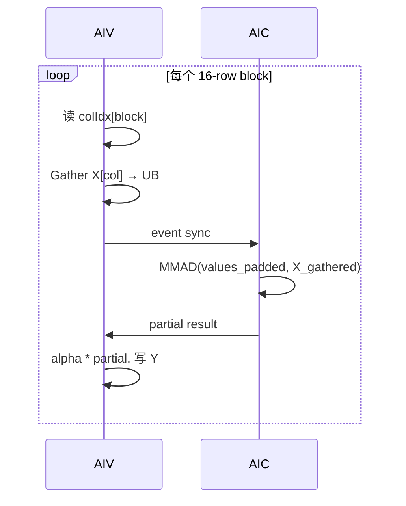

### Long Row 路径

示例：row i 有 4096 nnz → 8 个 segment（每 segment 512 nnz）→ 8 个 partial sum → 归约得 acc。

```text
LongPartialKernel: 各 segment 并行 partial sum → workspace
LongReduceKernel:  按 row id 归约 → Y[row] += alpha * sum
```

row_nnz > 2048 使用 **二级归约** 标记，避免 UB 溢出。

#### 图 3-6 Long Row segment 示意

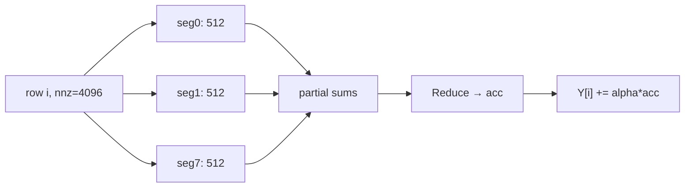

### 转置策略

| 场景 | 策略 | 确定性 |
| --- | --- | --- |
| 小矩阵 / 单次 / ALG1 | DirectTranspose scatter/atomic | 需固定 atomic 顺序或 column bucket |
| 大矩阵 / 重复 / ALG2 | Preprocess 建 CSC，复用非转置 Kernel | 无写冲突，天然确定 |
| 默认 | NNZ>4096 且重复调用 → CSC | 可配置 |

#### 图 3-7 转置路径选择

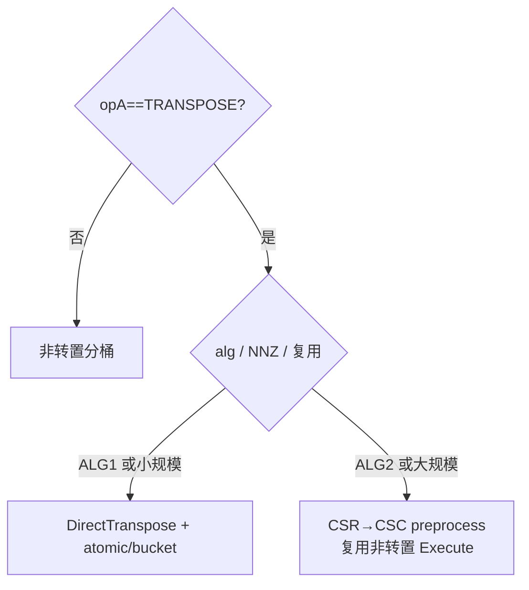

### alpha / beta 分支特化

| 分支 | 行为 |
| --- | --- |
| beta=0 | ScaleY 清零或跳过读旧 Y；写 `Y=alpha*acc` |
| beta=1 | `Y=alpha*acc+Y` 加法特化 |
| alpha=0 | 仅 `Y=beta*Y` |
| 通用 | 完整公式 |

TilingKey 含 `beta_code` / `alpha_code` 减少 Kernel 内分支。

### Host 侧详细设计

#### 图 3-8 Host 流水线

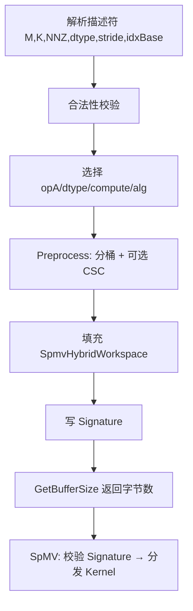

**分核**：

- 非转置：按输出行 / work item 切分；满核优先；`used_cores = min(core_num, effective_rows)`。
- Long row：超长行拆多个 work item。
- 转置 CSC：按 CSC 行（原列）切分。

**TilingKey（示意）**：

```text
tilingKey = opA | input_dtype | compute_dtype | output_dtype
          | beta_code | alpha_code | alg_path | idx_base
```

### Workspace 与 Signature

```text
SpmvHybridWorkspace {
  signature: matA_ptr, M, K, NNZ, dtype, opA, alg, strideX, strideY, idxBase
  short_rows: int32[]
  medium_blocks: MediumBlockMeta[]
  long_segments: LongSegMeta[]
  csc_meta: optional
  partial_buffer_offsets
}
```

Signature 变化时 **自动 re-preprocess**（可在 SpMV 内 lazy 触发）。

### Kernel 侧设计（Ascend C）

统一语义：**SpmvScaleYKernel** 先 `Y=beta*Y`；各路径算 `acc`；最后 `Y+=alpha*acc`（或合并写回）。

| Kernel | 执行单元 | 说明 |
| --- | --- | --- |
| SpmvScaleYKernel | AIV | 全量 Y scale |
| SpmvShortRowKernel | AIV/SIMT | 短行直接 CSR |
| SpmvMediumCubeKernel | AIV+AIC | FP32 Cube |
| SpmvMediumVectorKernel | AIV | 非 FP32 回退 |
| SpmvLongPartialKernel | AIV | segment partial |
| SpmvLongReduceKernel | AIV | 行归约 |
| SpmvDirectTransposeKernel | AIV | scatter/atomic |
| SpmvCscKernel | 同非转置 | CSC 复用 |

#### 图 3-9 存储层次

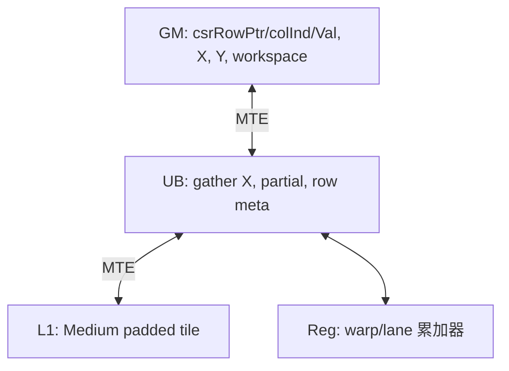

#### 图 3-10 Init / Process（单 Kernel 通用）

```text
Init:
  读 TilingData + workspace 元数据
  绑定 GM 地址；计算本 core work range
  分配 UB 队列
Process:
  CopyIn / Compute / CopyOut 流水
  按 work item 类型跳转 Short/Medium/Long/Transpose
  尾块 drain；event 成对 set/wait
```

### dtype 转换路径

| 阶段 | fp16/bf16/int8 输入 |
| --- | --- |
| 读 csrVal/X | cast → computeType |
| 累加 | computeType（fp32 或 int32） |
| 写 Y | cast → outputType |

### 代码组织（拟合入 ops-sparse）

```text
src/spmv/
├── include/cann_ops_sparse.h
├── spmv_host.cpp
├── spmv_hybrid.h
├── arch35/
│   ├── spmv_hybrid_preprocess.cpp
│   └── spmv_hybrid_kernel.cpp
├── docs/design.md
├── examples/test_aclsparse_spmv.cpp
└── tests/{pytest,st,ut}/
```

---

## 支持硬件

| 支持的芯片版本 | 涉及勾选 |
| --- | --- |
| Atlas 950PR | √ |

## 算子约束限制

1. 主格式 **CSR**；索引 **int32**  
2. 不支持表外 dtype 组合  
3. 转置 scatter 大规模性能受限；重复调用建议 CSC  
4. 确定性：优先 CSC/固定顺序；atomic 路径须文档说明约束  
5. idxBase=1 时 Host 统一转 0-base  
6. 空 batch / M=0 / K=0：按 Host 规范与 UT 固化  

---

# 可维可测分析

## 精度标准 / 性能标准

| 验收标准 | 描述 | 来源 |
| --- | --- | --- |
| 精度（主） | CPU 高精度 golden；生态算子开源精度标准 | 任务书 / opbase |
| 精度（辅-浮点） | 可选 cuSPARSE 双标杆：NPU/GPU 相对 CPU 误差比例 | 200 用例 standard |
| 精度（int8→int32） | 整数路径精确或规定容差；无双标杆兜底 | 任务书 |
| 性能 | P-01~P-04 每项 **≥0.5×** 标杆 | 任务书 |
| 功能 | 200 泛化 + F/Q/B/N 详细用例 | case_200.json |
| 确定性 | 100 次重复完全一致 | 任务书 |

### 单标杆精度（主）

浮点输出采用 MERE/MARE 等指标；FP32 严格阈值；FP16/BF16 按混合容差；int8→int32 验证整数一致性。

### 双标杆（浮点可选）

CPU 为 golden；分别计算 NPU、GPU 相对 CPU 的误差比例，max≤5、mean≤1.5、RMSE≤1.5（与 200 用例 standard 一致）。

### 任务书性能标杆

| 编号 | 矩阵规模 | 稀疏度 | dtype | 标杆耗时 | 达标（≤2× 标杆） |
| --- | --- | --- | --- | --- | --- |
| P-01 | 128×128 | 95% | fp32 | 43.9 us | ≤87.8 us |
| P-02 | 1024×1024 | 99% | fp32 | 46.3 us | ≤92.6 us |
| P-03 | 2048×4096 | 97.5% | fp32 | 45.4 us | ≤90.8 us |
| P-04 | 160220×68750 | 99.9% | fp32 | 193.2 us | ≤386.4 us |

**计时规则**：

1. Atlas 950PR 实机；CANN 与 ops-sparse commit 固定  
2. warmup ≥10；采样 ≥20；报告 **median、P90**  
3. timed region：**SpMV Execute**（Preprocess 单独报告；性能门禁以 Execute 为主，须在报告中说明）  
4. workspace/IO 在 loop 外分配；每次采样前后同步  
5. 与标杆同口径对比；记录原始样本  

#### 图 4-1 验证流水线


## 功能测试矩阵

| 类别 | 覆盖 |
| --- | --- |
| opA | 非转置 / 转置 |
| dtype | 5 种组合分别测 |
| alpha/beta | 0, 0.5, 1.0, 2.0 |
| 稀疏度 | 50%, 80%, 95%, 99%, 99.9% |
| CSR | 空行、单行长行、均匀/长尾 nnz、乱序 col |
| shape | 方阵、宽、高、小、标杆四规格 |
| stride | X/Y 非连续 |
| preprocess | 首次 vs 复用 20 次 |
| 负向 | 非法 CSR/dtype/shape/workspace |

### 详细测试用例设计（26+ 条）

数据生成（任务书）：`csrVal/x/y ~ U(-10,10)`；`alpha/beta ∈ {0,0.5,1.0,2.0}`；稀疏度 50%~99.9%。

| 编号 | 配置 | 检查点 | 预期 |
| --- | --- | --- | --- |
| F-01 | 128×128, 95%, fp32, NT, α=1, β=0 | P-01 shape | CPU golden 通过 |
| F-02 | 1024×1024, 99%, fp32, NT | P-02 | 精度+功能 |
| F-03 | 2048×4096, 97.5%, fp32, NT | P-03 | 精度+功能 |
| F-04 | 160220×68750, 99.9%, fp32, NT | P-04 | 精度+性能 |
| F-05 | F-01, trans=true | 转置 shape/数值 | golden 通过 |
| F-06 | fp16→fp32→fp16 | cast 与写回 | 混合容差 |
| F-07 | bf16→fp32→bf16 | 同上 | 混合容差 |
| F-08 | int8→int32→int32 | 整数累加 | 精确/容差 |
| F-09 | int8→fp32→fp32 | 混合输入 | 浮点容差 |
| F-10 | α=0, β=1 | 边界系数 | Y=β·Y |
| F-11 | α=2, β=0.5 | 通用系数 | 数值正确 |
| F-12 | 含空行 CSR | 空行 | Y=β·Y[row] |
| F-13 | NNZ=0 | 全零 A | 仅 scale Y |
| F-14 | 单行 nnz=5000 | Long 路径 | 与 CPU 一致 |
| F-15 | 90% 行 nnz≤8 | Short 为主 | 与 CPU 一致 |
| F-16 | 90% 行 nnz 9~64 | Medium 为主 | 与 CPU 一致 |
| F-17 | X stride=2, Y stride=3 | 非连续 | 与连续等价 |
| F-18 | Preprocess+SpMV×20 | workspace 复用 | 无污染 |
| F-19 | idxBase=1 | 索引转换 | 与 0-base 等价 |
| F-20 | ALG1 转置小矩阵 | scatter | golden |
| F-21 | ALG2 转置大矩阵 | CSC | golden |
| F-22 | 200 用例全量 | case_200.json | 全过 |
| F-23 | 同用例 100 次 | 确定性 | 逐元素相等 |
| F-24 | beta=0 全路径 | 跳过读 Y | 正确 |
| F-25 | 混合 Short+Medium+Long 同矩阵 | 多路径共存 | 正确 |
| F-26 | HOST/DEVICE alpha/beta | 指针模式 | 正确 |
| Q-01 | 3×3 手算 CSR | 小矩阵 golden | 精确 |
| Q-02 | colInd 含 0 和 K-1 | 边界索引 | 正确 |
| Q-03 | 单行单 nnz | 最小非平凡 | 正确 |
| B-01 | M=1,K=1 | 最小规模 | 无越界 |
| B-02 | 稀疏度 50% vs 99.9% | 极端 nnz | 稳定 |
| B-03 | 尾 block 不足 16 行 | Medium 尾块 | 无污染 |
| B-04 | padding>2× 回退 | 回退 Short | 正确 |
| N-01 | csrRowPtr 非单调 | 校验 | 报错 |
| N-02 | colInd 越界 | 校验 | 报错 |
| N-03 | dtype 非法组合 | 校验 | 报错 |
| N-04 | shape 与 opA 不匹配 | 校验 | 报错 |
| N-05 | workspace NULL/过小 | 校验 | 报错 |
| N-06 | handle/描述符 NULL | 校验 | 报错 |

负向用例须 **真实调用 aclsparse API**，不能只靠测试脚本前置抛错。

## 性能优化方案

1. **分桶混合**：短行不走 Cube；中等行 nnz 相近分组；长行 segment 并行  
2. **Preprocess 复用**：矩阵不变时摊销分析  
3. **转置 CSC**：大规模降 atomic  
4. **Gather 优化**：colInd 局部性排序（可选）  
5. **beta/alpha 特化**：减少分支与 GM 读  
6. **满核与负载均衡**：长行拆分；有效核数自适应  
7. **确定性**：CSC/固定归约顺序  

#### 图 4-2 性能优化闭环

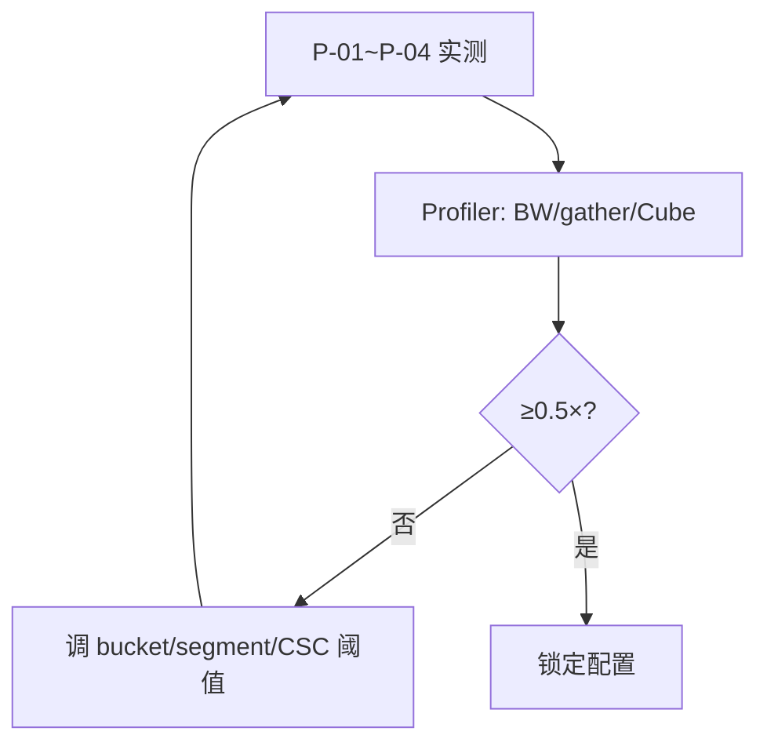

## 风险与对策

| 风险 | 对策 |
| --- | --- |
| Medium padding 过高 | nnz 分组 + 2× 回退 Short |
| 转置 atomic 慢 | CSC preprocess；ALG 选择 |
| 确定性失败 | 优先 CSC；atomic 加 column bucket |
| 大矩阵 workspace 大 | 流式 preprocess；分块 CSC |
| dtype 扩展复杂 | 模板三元组 input/compute/output |

## 可维护性 / 兼容性

1. 路径职责清晰：Short/Medium/Long/Transpose 独立 Kernel，便于单测。  
2. 阈值可配置（tiling 参数），便于调优。  
3. 三阶段 API 与 cuSPARSE 对齐，上层易迁移。  
4. 新算子合入 `ops-sparse/src/spmv`，不影响其它稀疏算子。  

---

# 开发计划（评审通过后）

#### 图 5-1 里程碑

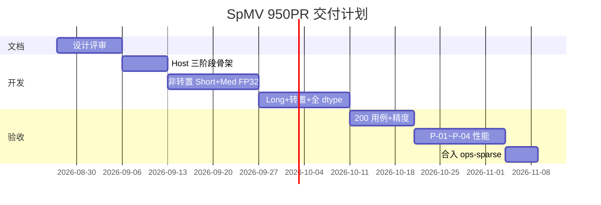

| 阶段 | 工作 |
| --- | --- |
| P0 | 设计文档评审合入 |
| P1 | 描述符 + 三阶段 Host + 校验 |
| P2 | 非转置 Short + Medium(FP32) |
| P3 | Long Row + 转置 + 全 dtype |
| P4 | 200 用例 + F/Q/B/N + 确定性 |
| P5 | P-01~P-04 ≥0.5× + 自测报告 + PR |

---

# 参考资料

1. 任务书 `SpMV_task_doc.md`；测试 `spmv_testCase/case_200.json`  
2. cuSPARSE：https://docs.nvidia.com/cuda/cusparse/#cusparsespmv  
3. ops-sparse：https://gitcode.com/cann/ops-sparse/tree/master/src/spmv  
4. Ascend C 算子开发文档  
5. 精度标准：opbase `experimental_standard.md`  
6. 设计模板：`cann-competitions/.../resources/design_template.md`  

---

# 修订记录

| 版本 | 日期 | 说明 |
| --- | --- | --- |
| v1.0 | 2026-08-27 | 初稿：分桶混合 + 三阶段接口 |
| v2.0 | 2026-08-27 | 详细版：补描述符 API、Workspace/Signature、Short/Medium/Long/转置详设、10+ 流程图、26+ 测试用例、双标杆精度、性能/风险/里程碑 |
