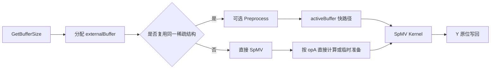
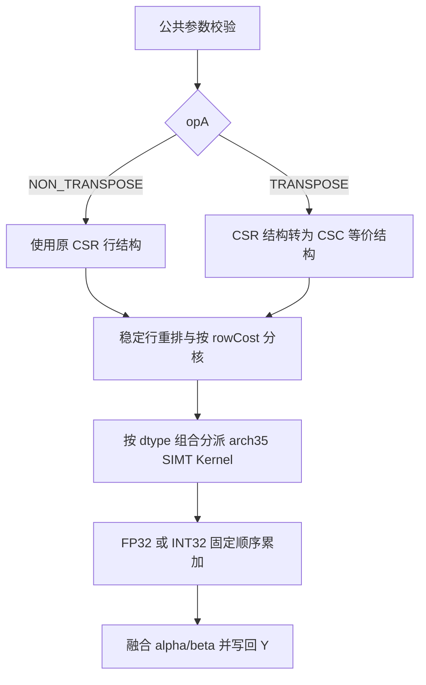

# 需求背景（required）

## 需求来源

本需求来自 CANN 社区 SpMV 算子开发任务。任务要求参考 cuSPARSE SpMV，在昇腾 NPU 上使用 Ascend C 实现 CSR 稀疏矩阵与稠密向量乘法，并以 `aclsparse` 风格提供查询 workspace、可选预处理和执行三个阶段的接口。

目标计算为：

$$
Y = \alpha \cdot op(A) \cdot X + \beta \cdot Y
$$

其中输入稀疏矩阵 $A$ 使用 CSR（Compressed Sparse Row）格式：

- `opA == ACL_SPARSE_OP_NON_TRANSPOSE` 时，$op(A)=A$；
- `opA == ACL_SPARSE_OP_TRANSPOSE` 时，$op(A)=A^T$；
- $X$ 为只读稠密向量，$Y$ 既是输入也是输出；
- 任务书将 $\alpha$、$\beta$ 统一定义为 FLOAT32 标量；其中 INT8/INT32/INT32 组合的缩放、舍入和溢出语义存在歧义，列为编码前阻塞确认项。

需求来源及约束以本地任务书 `SPMV算子官方/SpMV_task_doc.md` 为准，目标代码仓为 `ops-sparse`，目标硬件为 Ascend 950PR。

## 背景介绍

### SpMV 的应用背景

SpMV 是图计算、迭代式线性方程组、科学计算和稀疏神经网络中的基础算子。与稠密矩阵向量乘不同，SpMV 的主要开销通常来自 CSR 索引读取、非连续的 $X$ 向量访问以及不同行非零元素数不均衡。算术强度较低，因此实现重点是减少无效数据搬运、均衡各核负载，并保证混合精度和转置计算的正确性。

CSR 矩阵 $A\in\mathbb{R}^{M\times K}$ 由三个一维数组表示：

| 数组 | 数据类型 | 长度 | 含义 |
| --- | --- | ---: | --- |
| `csrRowPtr` | INT32 | `M + 1` | 第 `i` 行数据位于区间 `[csrRowPtr[i], csrRowPtr[i+1])` |
| `csrColInd` | INT32 | `NNZ` | 每个非零元素对应的列索引 |
| `csrVal` | FLOAT32/FLOAT16/BFLOAT16/INT8 | `NNZ` | 非零元素值 |

本设计采用 0-based 索引，满足：

$$
csrRowPtr[0]=0,\quad csrRowPtr[M]=NNZ
$$

并要求 `csrRowPtr` 非递减，`csrColInd[p]` 位于 `[0, K)`。

### 当前代码基线分析

本文代码审查基线为 `ops-sparse` master commit `48acd66197f8ff1e8116433560637b13f24e89d3`（2026-08-25，审查时工作树干净）。当前仓库已存在标准 SpMV 的 arch22 实现和另一个独立的 arch35 `SpMVOp` 实现，但均不能直接作为本任务的 Ascend 950PR 标准 SpMV 交付：

| 项目 | 当前状态 | 与本任务的差距 |
| --- | --- | --- |
| `sparse/spmv/arch22` | 实现 `aclsparseSpMV`，用于 A2/A3 | Ascend 950 构建不收集 arch22；其整数路径为 A/X/Y 全 INT32，而非任务要求的 A/X=INT8、compute/Y=INT32，且当前标准 SpMV 未实现 DEVICE pointer mode |
| `aclsparseSpMVGetBufferSize` | 头文件中有声明 | 当前无函数定义，调用会链接失败 |
| `aclsparseSpMVPreprocess` | 头文件中有声明 | 当前无函数定义，调用会链接失败 |
| arch22 转置路径 | 对同一输出元素执行跨核原子加 | 浮点累加顺序可能变化，存在不满足任务书“相同输入重复执行结果一致”要求的风险 |
| arch22 Host | 执行前将 `csrRowPtr` 拷回 Host 并同步 | 引入同步和 D2H 开销，不适合目标性能路径 |
| `sparse/spmv_op/arch35` | 独立输出 `Z`、七个 API、仅 FP32 非转置 | API、数据类型、转置语义和生命周期均不同，不能替代标准 SpMV |

因此，本设计在不改变 arch22 既有行为的前提下，新增 `sparse/spmv/arch35`，复用仓内描述符、handle、日志、构建和 CSR 转 CSC 的工程经验，实现任务书规定的三阶段标准 SpMV。仓库声明仅支持 CANN 9.0.0 及以后版本；最终开发和自测必须锁定具体 toolkit/ops 配套版本并记录，不能只写“最新版本”。

# 需求分析（required）

## 需求描述

在 Ascend 950PR 上实现 CSR 格式 SpMV，公开接口保持任务书和 `include/cann_ops_sparse.h` 中的函数原型不变：

```c
aclsparseStatus_t aclsparseSpMVGetBufferSize(
    aclsparseHandle_t handle,
    aclsparseOperation_t opA,
    const void *alpha,
    aclsparseConstSpMatDescr_t matA,
    aclsparseConstDnVecDescr_t vecX,
    const void *beta,
    aclsparseDnVecDescr_t vecY,
    aclDataType computeType,
    aclsparseSpMVAlg_t alg,
    size_t *bufferSize);

aclsparseStatus_t aclsparseSpMVPreprocess(
    aclsparseHandle_t handle,
    aclsparseOperation_t opA,
    const void *alpha,
    aclsparseConstSpMatDescr_t matA,
    aclsparseConstDnVecDescr_t vecX,
    const void *beta,
    aclsparseDnVecDescr_t vecY,
    aclDataType computeType,
    aclsparseSpMVAlg_t alg,
    void *externalBuffer);

aclsparseStatus_t aclsparseSpMV(
    aclsparseHandle_t handle,
    aclsparseOperation_t opA,
    const void *alpha,
    aclsparseConstSpMatDescr_t matA,
    aclsparseConstDnVecDescr_t vecX,
    const void *beta,
    aclsparseDnVecDescr_t vecY,
    aclDataType computeType,
    aclsparseSpMVAlg_t alg,
    void *externalBuffer);
```

三个阶段的职责如下：

| 阶段 | 是否必选 | 职责 |
| --- | :---: | --- |
| `GetBufferSize` | 是 | 校验 Host 可见的元数据并返回与 `opA`、shape、dtype 对应的 workspace 字节数 |
| `Preprocess` | 否 | 校验 CSR 内容、生成负载均衡表；转置时生成确定性 CSC 结构；将当前 buffer 标记为 `matA` 的 active buffer |
| `SpMV` | 是 | active buffer 命中时直接执行；未命中且非转置时直接按连续 CSR 行计算，未命中且转置时在当前 buffer 中临时构建 CSC 等价结构后计算；不同 buffer 的隐式路径不替换既有 active，同地址签名失配则先使旧 active 失效 |

### 输入输出规格

设描述符中的原始矩阵 $A$ 始终为 $M\times K$。任务书“转置时矩阵维度为 `K×M`”在本设计中解释为 $op(A)=A^T$ 的维度，而不是改变输入 CSR 描述符中 $A$ 的维度。

| `opA` | `op(A)` shape | `vecX` 长度 | `vecY` 长度 |
| --- | --- | ---: | ---: |
| `ACL_SPARSE_OP_NON_TRANSPOSE` | `M × K` | `K` | `M` |
| `ACL_SPARSE_OP_TRANSPOSE` | `K × M` | `M` | `K` |

支持的数据类型组合严格按组合列匹配，不允许 A 与 X 任意混搭：

| 组合 ID | `csrVal` / X | `computeType` | Y | `alpha` / `beta` |
| ---: | --- | --- | --- | --- |
| 0 | FLOAT32 | FLOAT32 | FLOAT32 | FLOAT32 |
| 1 | INT8 | INT32 | INT32 | FLOAT32（任务书；整数输出语义待确认） |
| 2 | INT8 | FLOAT32 | FLOAT32 | FLOAT32 |
| 3 | FLOAT16 | FLOAT32 | FLOAT32 | FLOAT32 |
| 4 | BFLOAT16 | FLOAT32 | FLOAT32 | FLOAT32 |
| 5 | FLOAT16 | FLOAT32 | FLOAT16 | FLOAT32 |
| 6 | BFLOAT16 | FLOAT32 | BFLOAT16 | FLOAT32 |

### 参数和内存位置

| 参数 | 方向 | 内存位置 | 设计约束 |
| --- | --- | --- | --- |
| `handle` | 输入 | Host | 非空；未显式设置 stream 时使用 Runtime 默认流 |
| `opA` | 输入 | Host | 仅支持 NON_TRANSPOSE、TRANSPOSE |
| `alpha`、`beta` | 输入 | Host/Device | 非空；位置由 `aclsparseSetPointerMode` 决定；按任务书为 FLOAT32，INT32 compute 组合的最终解释待确认 |
| `matA` | 输入 | Host 描述符 | 非空，仅 CSR、INT32 索引、0-based；数据数组位于 Device |
| `vecX` | 输入 | Host 描述符 | 非空，数据位于 Device，dtype 和长度符合组合表 |
| `vecY` | 输入输出 | Host 描述符 | 非空，数据位于 Device，支持读取原值并覆盖写回 |
| `alg` | 输入 | Host | 首版仅支持 `ACL_SPARSE_SPMV_ALG_DEFAULT` |
| `bufferSize` | 输出 | Host | 非空 |
| `externalBuffer` | 输入 | Device | 非空、64 B 对齐、容量至少为查询值；显式预处理后生命周期覆盖整个 active 状态及所有关联 stream 完成 |

`externalBuffer` 是不携带容量信息的裸指针，API 只能校验是否为空，不能在 Host 侧证明实际分配大小；容量不小于 `GetBufferSize` 返回值是调用方前置条件。

### 边界、空指针与短路语义

三个 API 始终先校验 Host 可见的元数据、描述符和标量指针。`GetBufferSize` 不读取 Device 数组；`Preprocess` 和 active 未命中的 `SpMV` 即使最终没有数值计算，也要校验 Device CSR 结构，以满足非法值报错要求。active 命中时复用此前已验证的结构。指针规则为：

- `csrRowPtr` 始终非空且逻辑长度为 `M+1`；即使 `M==0` 也提供一个值为 0 的元素。
- `csrColInd`、`csrVal` 在 `NNZ>0` 时非空，`NNZ==0` 时允许为空。
- X/Y 数据指针仅在各自逻辑长度大于 0 时要求非空；长度为 0 时允许为空。
- `alpha`、`beta` 始终非空；`Preprocess`/`SpMV` 的 `externalBuffer` 始终提供查询所得的至少 64 B、64 B 对齐空间，用于 header/error flag 和边界结构校验。

| 规格 | 强制结构条件 | NON_TRANSPOSE 的 X/Y 与结果 | TRANSPOSE 的 X/Y 与结果 |
| --- | --- | --- | --- |
| `M>0, K>0, NNZ>0` | 正常 CSR | X=`K`、Y=`M`，按公式计算 | X=`M`、Y=`K`，按公式计算 |
| `M>0, K>0, NNZ==0` | `rowPtr[0..M]` 全为 0 | X=`K`、Y=`M`，`Y=beta*Y` | X=`M`、Y=`K`，`Y=beta*Y` |
| `M==0, K>0` | `NNZ==0`、`rowPtr[0]==0` | X=`K`、Y=0，无数值写回 | X=0、Y=`K`，`Y=beta*Y` |
| `M>0, K==0` | `NNZ==0`、`rowPtr[0..M]` 全为 0 | X=0、Y=`M`，`Y=beta*Y` | X=`M`、Y=0，无数值写回 |
| `M==0, K==0` | `NNZ==0`、`rowPtr[0]==0` | X=0、Y=0 | X=0、Y=0 |

数值计算的访存短路与结构校验分开定义：`NNZ==0` 时校验只读取 row pointer，计算不读 column index、values 和 X；Host pointer mode 的 `alpha==0` 在结构校验后直接走 BetaOnly，计算不读 values/X；Device pointer mode 的标量只能在 Kernel 内判定，inactive 转置路径仍可能先读取 CSR 结构生成临时 CSC，不承诺完全不读 row/column index。`beta==0` 时计算 Kernel 不读取 Y 原值；`beta==1` 且稀疏乘积为空时保留 Y。

允许同一 CSR 行内列索引无序和重复；重复位置按其在存储数组中的固定顺序参与累加。`vecX` 与 `vecY` 不允许共享 Device 数据区；`vecY` 的“原位”仅指同一 Y 缓冲区先读后写，CSR 三数组也不得与 X/Y 重叠。INT8/INT32/INT32 组合在标量类型及取整语义确认前不定义最终结果；若最终采用整数标量，则每个乘积、固定顺序的每个部分和、两个缩放项及最终和都必须可由选定中间类型表示；若采用 FLOAT32 标量，还须明确中间精度、取整和溢出规则。

## 需求拆解

1. 新增标准 SpMV 的 arch35 Host、tiling、预处理和 Kernel 实现，保持 arch22 代码不变。
2. 实现三个公开 API，并保证 active buffer 生命周期与 cuSPARSE 语义一致。
3. 精确校验 7 组 dtype、CSR 格式、INT32/0-based 索引、shape、枚举和必需指针。
4. 非转置采用“一个输出行由一个固定线程负责”的确定性行并行算法。
5. 转置预处理为 CSC 等价结构，再使用相同的行并行算法，避免跨线程原子累加。
6. 预处理按行 NNZ 构造稳定重排，并按 `max(rowNnz,1)` 成本生成分核边界，降低长行和大量空行造成的负载倾斜。
7. 支持 Host/Device pointer mode、Y 原位读写、空规模和 `alpha`/`beta` 快路径。
8. 覆盖任务书 200 个泛化用例、7 组 dtype、转置/非转置、稀疏度、确定性和异常测试。
9. 在 Ascend 950PR 上完成精度和性能实测。

# 详细设计（required）

## 算子分析

### 数学公式

非转置计算为：

$$
Y_i = \alpha \sum_{p=csrRowPtr[i]}^{csrRowPtr[i+1]-1}
csrVal_p \cdot X_{csrColInd_p} + \beta Y_i,\quad 0\le i<M
$$

转置计算为：

$$
Y_j = \alpha \sum_{i=0}^{M-1}\sum_{p=csrRowPtr[i]}^{csrRowPtr[i+1]-1}
[csrColInd_p=j]\cdot csrVal_p\cdot X_i + \beta Y_j,\quad 0\le j<K
$$

直接按 CSR 行并行实现转置时，多行会同时更新同一个 $Y_j$。浮点原子加的到达顺序不固定，不能满足任务书的确定性要求。因此转置路径先构造以原列为“行”的 CSC 等价结构，使每个输出元素仍只由一个线程写入。

### 支持数据类型

支持范围以“输入输出规格”的 7 组组合表为唯一准入表，A 与 X 不做笛卡尔积混配；FLOAT32 compute 覆盖 FLOAT32、FLOAT16、BFLOAT16 和 INT8 输入，INT32 compute 仅覆盖任务书的 INT8 输入/INT32 输出组合。后者的标量和写回语义在阻塞项关闭前不进入最终发布规格。

### 支持形状

输入 CSR 描述符始终表示 `M×K`，转置只改变 `op(A)` 以及 X/Y 长度。首版支持非负 `M/K/NNZ` 到 `INT32_MAX`，包括空行、空列、矩形矩阵和零 NNZ；所有退化组合按前述真值表处理。接口不支持 batch 或二维稠密矩阵。

### 精度策略

- FLOAT16/BFLOAT16 输入以及 INT8/FLOAT32 组合在寄存器中转换为 FP32 后计算，FP32 Y 直接写回。
- FLOAT16/BFLOAT16 输出在完成 FP32 的 `alpha * dot + beta * y` 后，仅在最终写回时执行一次 round-to-nearest-even 转换。
- FP32 点积按预处理后每行的固定元素顺序使用 FMA 累加；同一输入多次执行的操作顺序不变。
- INT8 输入、INT32 compute 的点积先扩展为 INT32 并固定顺序累加；`alpha/beta` 缩放和 INT32 写回策略待阻塞规格确认后补充，不能在实现中隐式截断 FLOAT32。
- 不采用转置原子加，也不让多个线程对同一输出做非固定顺序归并。

### 确定性定义

任务书只要求“同一个计算相同输入多次执行时输出结果相同”。为提供可自动判定且不弱于原要求的工程门槛，本设计将同一 SoC、同一 CANN/算子版本、相同输入数据、描述符、stream 配置和 `alg` 下的结果收紧为按字节完全一致；这是本设计加严的自测标准，不反向声称任务书原文写了 bit-wise。设计通过以下措施保证：

1. 每个输出行只由一个 SIMT 线程计算和写回；
2. 行内非零元素按 CSR/预处理 CSC 中的固定顺序累加；
3. 稳定预处理对相同行长度使用原始行号作为次序；
4. 转置路径不使用对 Y 的原子加；
5. 相同 dtype 组合使用固定的模板实例和舍入模式。

## 算子实现

### 实现方案





### 工程结构

计划新增或更新以下文件：

```text
sparse/spmv/
├── README.md                         # 更新 Ascend 950 支持、接口和约束
├── arch22/                           # 既有 A2/A3 实现，不修改行为
└── arch35/
    ├── spmv.h                        # Host 公共校验、workspace 布局和类型 ID
    ├── spmv_host.cpp                 # 三阶段 API、active buffer 和 kernel launch
    ├── spmv_tiling_data.h            # Host/Kernel 共用 tiling 数据
    ├── spmv_kernel.h                 # 计算 kernel 启动声明
    ├── spmv_kernel.cpp               # arch35 SIMT dtype 分派与计算
    ├── spmv_preprocess_kernel.h      # 预处理 kernel 启动声明
    └── spmv_preprocess_kernel.cpp    # CSR 校验、稳定重排、CSR→CSC 结构转换

sparse/common/
├── aclsparse_descr_internal.h         # 增加私有 SpmvActiveMeta
└── aclsparse_descr.cpp                # CsrSetPointers/values 更新时的缓存保留与失效

sparse/spmm/
├── arch22/spmm_host.cpp                # 同址写 workspace 前反向清除 SpMV active
└── arch35/spmm_host.cpp                # 同址写 workspace 前反向清除 SpMV active

sparse/sddmm/arch35/
└── sddmm_host.cpp                      # 同址写 workspace 前反向清除 SpMV active

include/
└── cann_ops_sparse.h                   # 补齐 SpMV 支持规格、buffer 和异步生命周期注释

test/spmv/
├── CMakeLists.txt                     # 改用 ops_sparse_add_gtest_tests(spmv ${OPS_SPARSE})
├── README.md
├── spmv_param.h
├── spmv_golden.h
├── tools/convert_official_cases.py    # 将任务书 JSON 确定性转换并校验为测试 CSV
└── arch35/
    ├── spmv_npu_wrapper.h
    ├── spmv_test.cpp
    └── spmv_test.csv
```

### Host 侧设计

#### 公共参数校验

三个 API 共用 `ValidateSpmvCommon`，并根据阶段补充 buffer 相关校验。校验顺序固定为：

1. `handle`、输出指针和描述符非空；handle 中的空 stream 按 Runtime 默认流处理；
2. `opA`、`alg`、`computeType` 枚举合法；
3. `matA` 为 CSR，row offset/column index 均为 INT32，index base 为 ZERO；
4. `M`、`K`、`NNZ` 位于 `[0, INT32_MAX]`，且 `M+1`、`K+1`、乘法、加法和 workspace 对齐均经 checked size 计算；
5. X/Y 长度与转置状态精确匹配；
6. `csrVal`、X、Y 和 `computeType` 命中 7 个合法组合之一；
7. 按空规模语义校验 CSR/X/Y Device 指针；
8. `alpha`、`beta` 非空且 pointer mode 合法；
9. `Preprocess`/`SpMV` 在所需 workspace 非 0 时校验 `externalBuffer`。

Host 可见的非法参数立即返回错误。CSR 数组内容位于 Device，预处理阶段先把 workspace 中的 32-bit error flag 清零，再由校验 Kernel 检查首尾 row pointer、单调性和列索引范围；随后回读该标志并等待校验 stream 完成。只有返回值为成功时才能继续构造重排/CSC 结构及登记 active 元数据，校验失败时不得留下半有效 header。显式 `Preprocess` 的结构构造可继续在同一 stream 异步下发；Host 元数据同时记录该 stream，后续同流执行依赖顺序性，跨流使用前由调用方通过 event/stream 同步建立依赖。active 热执行不再同步校验。

| 场景 | 返回值 |
| --- | --- |
| `handle == nullptr` | `ACL_SPARSE_STATUS_HANDLE_IS_NULLPTR` |
| 空描述符、空必需指针、负 shape 或 CSR 内容非法 | `ACL_SPARSE_STATUS_INVALID_VALUE` |
| 超过首版 INT32 上限、不支持的格式/index 类型/dtype 组合/`opA`/`alg` | `ACL_SPARSE_STATUS_NOT_SUPPORTED` |
| 同步发生的 Runtime memcpy/memset、stream sync、预处理校验或可检查的 launch 失败 | `ACL_SPARSE_STATUS_EXECUTION_FAILED` |
| 平台信息或内部状态异常 | `ACL_SPARSE_STATUS_INTERNAL_ERROR` |

主计算在 stream 上异步执行时，设备侧执行错误通常不能在 `aclsparseSpMV` 返回前可靠映射；除非实现提供可查询的 launch 状态，这类错误由调用方在后续 `aclrtSynchronizeStream`/event 同步时获得。

#### Tiling 数据

Host 侧不再把完整 `csrRowPtr` D2H。仅使用描述符元数据和平台信息构造固定大小的 `SpmvTilingData`，按值传给 Kernel。因 row pointer/column index、`cscRowInd`、`csrPos` 和 tiling 字段均为 32 bit，首版限制 `M`、`K`、`NNZ <= INT32_MAX`；`M+1`/`K+1` 只在 `size_t` 中计算并做溢出检查：

| 字段 | 类型 | 含义 |
| --- | --- | --- |
| `rows`、`cols`、`nnz` | `uint32_t` | 原始 CSR 规格 |
| `outputRows` | `uint32_t` | 非转置为 M，转置为 K |
| `rowsPerBlock` | `uint32_t` | 未预处理时每个 AIV 核负责的逻辑行数 |
| `numBlocks` | `uint32_t` | 实际使用 AIV 核数 |
| `typeId` | `uint32_t` | 7 个 dtype 组合 ID |
| `trans` | `uint32_t` | 0 表示 CSR，1 表示预处理 CSC 等价结构 |
| `useReorder` | `uint32_t` | 是否读取 `rowOrder`/`binEdge` |
| `pointerMode` | `uint32_t` | Host 或 Device 标量模式 |
| `alpha`、`beta` | 32-bit union | Host pointer mode 下的标量位模式；当前按任务书存 FLOAT32，INT32 compute 组合待规格冻结 |
| `alphaPtr`、`betaPtr` | `uint64_t` | Device pointer mode 下的 GM 地址 |

`numBlocks=B` 动态取 `min(AIVCoreNum, ceil(outputRows / 128))`，空输出为 0 且 Host 不 launch。inactive 非重排路径令 `rowsPerBlock=ceil(R/B)`；active `binEdge` 路径由预处理给出每核逻辑行区间。每核 SIMT 线程数取 `min(128, AlignUp32(max(1, rowEnd-rowStart)))`，线程通过 grid-stride 覆盖本区间。

DAV-3510 为 split AIC/AIV core，`asc_vf_call` 通过 `async_invoke` 从外层核派发 VF。只要 Host 已 launch `B` 个 outer block，每个 block 都必须恰好调用一次 `asc_vf_call`；即使预处理产生空 bin，也不得在外层提前 return。空 bin 使用按 warp 对齐的 dummy 线程，内层根据 `rowStart==rowEnd` 不访问内存。该规则与仓内 `spmm/arch35/spmm_kernel.cpp` 的已验证规避方式一致，可防止 cube/vector 握手死锁。

#### 类型分派

Host 将 7 个合法组合映射到 `typeId=0..6`。`trans` 和 `useReorder` 作为运行时分支，不增加重复的公开接口；Kernel 侧只实例化合法模板，不为未知 dtype 使用默认回退，避免把非法类型误解释为 FLOAT32。

#### Workspace 布局

`externalBuffer` 基址及表中的顶层分区起点均按 64 字节对齐；scratch 内部的连续 stripe 子段按 4 字节元素对齐。非 64 B 对齐基址返回 `INVALID_VALUE`，从而不需要用隐式前移消耗调用方未查询的容量。设输出行数 `R = M`（非转置）或 `R = K`（转置），使用核数为 `B`。所有合法规格的 `GetBufferSize` 至少返回 64 B header/error flag，以便在空输出和 `NNZ==0` 场景仍能校验 CSR；`NNZ==0` 时总量就是 64 B，下表其余分区仅适用于 `NNZ>0`：

| 分区 | 非转置 | 转置 | 用途 |
| --- | ---: | ---: | --- |
| header/error flag | 64 B | 64 B | magic、版本、错误码和预处理元数据 |
| `rowOrder` | `4R` | `4R` | 稳定重排后的原始输出行号 |
| `rowNnz` | `4R` | `4R` | 每个输出行的 NNZ |
| `tmpOrder` | `4R` | `4R` | 稳定分桶临时区 |
| `tmpNnz` | `4R` | `4R` | 前缀和/分核临时区 |
| `binEdge` | `4(B+1)` | `4(B+1)` | 每个 AIV 核在 `rowOrder` 中的起止位置 |
| `cscColPtr` | 0 | `4(K+1)` | $A^T$ 每个输出行的偏移 |
| `cscRowInd` | 0 | `4NNZ` | $A^T$ 计算时的 X 索引 |
| `csrPos` | 0 | `4NNZ` | CSC 位置到原 `csrVal` 位置的映射 |
| CSR→CSC scratch | 0 | `4(K+1)(1+S)` | `colCount` 1 段 + `S` 段 stripe histogram/cursor |

转置且 `NNZ>0` 时，沿用仓内确定性 `csr2csc_ex2` 的约束，令：

$$
P=4(K+1),\quad
S=\max\left(1,\min\left(\left\lceil\frac{NNZ}{256}\right\rceil, AIV,
\max\left(1,\left\lfloor\frac{16\,MiB}{P}\right\rfloor\right)\right)\right),\quad
stripeSize=\left\lceil\frac{NNZ}{S}\right\rceil.
$$

其中 `S` 为 stripe 数，scratch 有一个 `P` 字节 `colCount` 段和 `S` 个 `P` 字节 histogram/cursor 段；当单段本身超过 16 MiB 时仍保留一个 stripe，16 MiB 仅限制多 stripe 总量而不是拒绝合法 K。`NNZ==0` 时 `S=0`，不分配 CSC 结果和 scratch，仅保留 64 B 校验区。

令 `A64(x)=AlignUp(x,64)`，`H=64`，则非空分区的总量由同一 `SpmvWorkspaceLayout` 按以下可复核方式计算：

$$
W_{N}=H+4\cdot A64(4R)+A64(4(B+1)),
$$

$$
W_{T}=W_N+A64(4(K+1))+2A64(4NNZ)+A64(4(K+1)(1+S)).
$$

公式中的每个 cast、`+1`、乘法、加法和 `A64` 都使用 checked `size_t` 运算；任何溢出均在 `GetBufferSize` 返回错误。查询、预处理和执行只能调用这一份布局函数，并用单元测试逐段验证 offset/size 不重叠。转置预处理不复制 `csrVal`，而保存 `csrPos`；因此仅更新 values 时仍可复用 active buffer。

#### Active buffer 生命周期

当前 `aclsparseSpMatDescr::activeBuffer` 也被 SpMM/SDDMM 等路径使用，单凭一个裸指针不能证明其中保存的是 SpMV 数据。本设计在内部描述符增加不公开的 `SpmvActiveMeta`，至少记录 `spmvActiveBuffer`、`opA`、`alg`、typeId、M/K/NNZ、row pointer 地址、column index 地址和构造 stream；不改变公共 C API 或描述符句柄 ABI。该 Host 元数据只能证明“库记录的所有权”，无法探测调用方或另一描述符私下覆写同一裸 buffer，因此还必须遵守下面的内容不变契约。

- 显式 `Preprocess` 入口先清除该描述符旧的 SpMV active 元数据，再校验并重建；任一阶段失败均保持 inactive，不能回退到可能已经陈旧的旧缓存。
- `Preprocess(matA, bufferA)` 完成同步校验并成功下发结构构造后，更新 `SpmvActiveMeta`，记录构造 stream，`bufferA` 成为该矩阵唯一的 SpMV active buffer；同流执行由 stream 顺序保证数据就绪。
- 后续 `SpMV` 只有在 buffer 指针和全部结构元数据均匹配时才走快路径；这防止描述符内共享 `activeBuffer` 字段造成的误命中，但不声称能检测库外覆写。
- 使用不同 buffer 总是允许：非转置直接按连续 CSR 行计算，不构造重排；转置在该 buffer 内临时生成 CSC 等价结构后计算。两种 inactive 路径均不替换既有显式 active buffer。
- 若传入地址恰好等于 `spmvActiveBuffer`，但 `opA/alg/typeId/shape/结构指针` 签名不匹配，则 inactive 校验/准备会写坏旧 header 或结构；Host 必须先清除旧 active 元数据，再执行 fallback，且隐式执行后保持 inactive。
- 再次以 `bufferB` 调用 `Preprocess` 后，`bufferB` 成为唯一 SpMV active buffer，`bufferA` 失活。
- 在通过同 stream 顺序或 event 建立依赖、且不与未完成访问并发的前提下，后续调用可更换 `alpha`、`beta`、X、Y 和 `csrVal`；M/K/NNZ、row/column 结构、`opA`、dtype 组合或 alg 变化不得命中原 active。
- 每次 Preprocess/SpMV 捕获的 `csrRowPtr/csrColInd/csrVal/X/Y` 及 Device 标量必须持续有效，输入不得修改，Y 不得被并发访问，直至关联 stream 完成。row/column 的地址或内容在 active 期间保持不变；如需原地改结构，先等待全部访问完成，下一次只能显式 Preprocess（其入口先使旧 active 失效）而不能直接 SpMV。
- `aclsparseCsrSetPointers` 会比较替换前后的 row/column 指针：结构指针变化时在同一次 setter 操作内清除 `SpmvActiveMeta`、通用 `activeBuffer` 及相关算子 side record；下一次 SpMV 仍须按 inactive 路径成功执行，而不是要求调用者必须重新 Preprocess。仅 values 指针变化（包括 `aclsparseSpMatSetValues`）才保留两类结构预处理结果，并回归 SpMM/SDDMM。
- 在 `aclsparse_descr.cpp` 提供统一的 `InvalidateSpmvActiveOnWorkspaceWrite(descr, buffer)`：同一描述符的 SpMM、SDDMM 及其他会写 workspace 的预处理路径，只要将写入地址与 `spmvActiveBuffer` 相同，就必须在下发前清除 SpMV 元数据；对应路径全部增加回归测试。
- 失效必须双向：任何 SpMV 校验、临时准备或 Preprocess 在写 `externalBuffer` 前，若通用 `matA->activeBuffer == externalBuffer`，先将通用 active 清空，防止旧 SpMM/SDDMM 缓存随后误命中；写入不同地址时两类缓存可并存。反向失效由上一条统一 helper 完成。
- 从 SpMV Preprocess 成功到该描述符的 SpMV active 状态失效期间，`spmvActiveBuffer` 的分配和内容必须持续有效并由该 `matA`/SpMV 独占；不得写入、释放，或供其他描述符、算子和自定义 Kernel 复用。只有另一 buffer 成功 Preprocess、结构指针变化、同地址库内 workspace 写入钩子或描述符销毁使旧状态失效，并等待所有关联 stream 完成后，旧 buffer 才可释放/复用。跨描述符共用裸地址无法由当前 ABI 自动检测，违反此契约的结果未定义；若产品要求自动防护，需另行设计线程安全的 buffer→owner/generation 注册表，不在首版热路径引入。
- 同一描述符的 `Preprocess` 会修改 Host 内部状态，不支持多个 Host 线程无锁并发修改。
- 预处理与执行切换 stream 时，调用者必须用 event 或 stream 同步保证预处理已完成。

### Preprocess 设计

#### CSR 内容校验

校验 Kernel 并行检查：

- `csrRowPtr[0] == 0`、`csrRowPtr[M] == NNZ`；
- 对所有行有 `0 <= rowPtr[i] <= rowPtr[i+1] <= NNZ`；
- 对所有非零元素有 `0 <= csrColInd[p] < K`。

下发校验 Kernel 前先把 error flag 清零；每个线程只写局部错误 bit，通过原子 OR 汇总。Host 只回读该 4 字节标志，并等待校验 stream 完成后再决定是否构造结构。该同步发生在每次显式 Preprocess 和每次 inactive SpMV 中，不进入 active buffer 热路径。

#### 稳定行重排与分核

预处理按行 NNZ 将输出行稳定分入 `{0, 1~4, 5~16, 17~64, 65~256, >256}` 六个桶，桶内保持原行号顺序。分核不能只累计 NNZ，因为空行仍要处理 `beta*Y`；每行采用 `rowCost=max(rowNnz,1)`，按累计 cost 生成 `binEdge[B+1]`，并在切边时为每个剩余 block 至少保留一行（`B<=R`）。这会把集中在 0-NNZ 桶的空行分散到多个核；整矩阵 `NNZ==0` 则直接走 BetaOnly，不生成重排。

重排只改变不同行的执行次序，不改变任一行内部非零元素顺序，也不改变输出地址，因此不影响精度和确定性。未调用预处理时，Kernel 按连续行号均分，功能完全一致但负载均衡可能较差。

#### 转置结构生成

转置预处理采用四步 Device 流程：

1. 先将 `colCount` 和 stripe histogram 清零，再按 `csrColInd` 统计每列 NNZ；
2. 对列计数做确定性前缀和，生成 `cscColPtr[K+1]`；
3. 将 CSR 源位置按递增的 `p` 划分为固定连续 stripe；对每个 `(stripe, col)` 先做 histogram，再对同一列按 stripe 编号做前缀和，给各 stripe 分配互不重叠的目标区间；每个 stripe 内由唯一写者按 `p` 递增顺序写 `cscRowInd` 和 `csrPos=p`。原子操作至多参与计数而不决定最终元素次序，因此同一列中的元素顺序固定为原 CSR 源位置递增；
4. 基于 `cscColPtr` 生成转置输出行的稳定重排和 `binEdge`。

第 4 步只用于显式 Preprocess；inactive 转置执行为减少一次性成本，只生成前三步的临时 CSC 并按连续输出行分核，不把临时结果登记为 active。

执行转置时，对第 `j` 个输出行遍历 `[cscColPtr[j], cscColPtr[j+1])`，X 索引取 `cscRowInd[p]`，矩阵值取 `csrVal[csrPos[p]]`。这样既不复制可变 values，也不对 Y 做原子加。

### Kernel 侧设计

#### 非转置主 Kernel

arch35 使用 Ascend C SIMT VF。每个 SIMT 线程通过 grid-stride 处理一个或多个完整输出行：

```text
row = rowOrder[logicalRow] 或 logicalRow
start = csrRowPtr[row]
end   = csrRowPtr[row + 1]
acc   = 0
for p in [start, end):
    col = csrColInd[p]
    acc = fma_or_integer_madd(cast(csrVal[p]), cast(X[col]), acc)
yOld = (beta == 0) ? 0 : cast(Y[row])
Y[row] = cast_out(alpha * acc + beta * yOld)
```

随机读取 X 是 SpMV 的固有访存模式。Kernel 不将整行搬入 UB，不再受 arch22“单行 NNZ 必须装入 UB”的限制，也避免逐元素 `SetValue` 到 UB。CSR row pointer、column index、value 和 X 均从 GM 按需读取，标量累加保存在寄存器。

#### 转置主 Kernel

转置路径复用同一计算骨架，只替换三个数据源：

```text
start = cscColPtr[row]
end   = cscColPtr[row + 1]
xIndex = cscRowInd[p]
value  = csrVal[csrPos[p]]
```

一个线程独占一个 Y 元素，不需要 `SetAtomicAdd`，因此 FP32、FP16/BFLOAT16 输出和 INT32 路径均可确定性执行。

#### 特殊分支

- inactive CSR 结构校验成功后，`NNZ == 0` 或 Host pointer mode 下 `alpha == 0`：下发 BetaOnly Kernel，连续处理 Y；active 命中时可直接进入该分支；
- Device pointer mode 下由主 Kernel 读取 `alpha`；若为 0，各线程跳过 CSR/X 访问，仅执行 beta 分支；
- `beta == 0`：主 Kernel 跳过 Y 读；
- Host pointer mode 下 `beta == 1 && (alpha == 0 || NNZ == 0)`：不下发 Kernel；
- `outputRows == 0`：仍先完成 Host 校验以及 inactive CSR 内容校验/active 签名检查，随后不下发数值计算 Kernel；
- Device pointer mode 下由 Kernel 只读取一次 `alpha`/`beta` 到每个核的寄存器。

### 性能优化方案

1. **SIMT 行并行**：利用 arch35 对不规则索引和标量循环的支持，避免 arch22 UB 行缓存和逐元素 UB 填充。
2. **预处理负载均衡**：按行 NNZ 稳定分桶，再按 `max(rowNnz,1)` 成本分核，兼顾非零乘加和空行的 Y 读写。
3. **转置去原子化**：预处理为 CSC 等价结构，热执行阶段每个输出单写；重复执行时摊薄预处理成本。
4. **values 可更新**：保存 `csrPos` 而非复制 values，矩阵数值变化不触发结构重建。
5. **标量短路**：`alpha==0`、`beta==0/1` 和空矩阵分别省略无效 GM 读写与乘法。
6. **动态核数**：小 shape 不盲目满核，减少空核和调度开销；大 shape 使用全部可用 AIV 核。
7. **合法组合静态实例化**：只生成 7 组模板，避免 Kernel 内部通用 dtype 转换和无效分支。
8. **热路径无 Host 同步**：显式预处理后，SpMV 仅下发计算 Kernel；性能统计区分冷启动和 active buffer 热执行。

若 profiling 显示极长单行成为瓶颈，后续可为 `NNZ(row) > 256` 增加固定线程组协作和固定树形归并 tiling key。该方案必须先验证混合精度、确定性和收益，首版不引入动态原子归并。

## 支持硬件

| 支持的芯片版本 | 本设计状态 |
| --- | --- |
| Ascend 950PR（ascend950 / arch35 / DAV-3510） | 目标支持 |
| Atlas A2/A3（arch22） | 保留仓库既有实现 |

## 算子约束限制

- 首版只支持 CSR、INT32 row offset/column index、0-based index。
- 首版限制 `M`、`K`、`NNZ <= INT32_MAX`；`M+1`、`K+1` 和所有 workspace 字节只在 checked `size_t` 中计算。
- 首版只支持 `ACL_SPARSE_SPMV_ALG_DEFAULT`，不支持共轭转置。
- X/Y 长度采用精确匹配；不支持 batch 和二维稠密向量。
- aclsparse 描述符当前没有 stride；非连续 Tensor 支持在上层物化适配或扩展描述符二选一落地前仍是阻塞缺口。
- 每个稀疏矩阵描述符的 SpMV active buffer 有且仅有一个；更换稀疏结构会使其失效，但调用者可选择重新预处理，也可直接调用 SpMV 走 inactive 路径。
- Host pointer mode 的 `alpha`/`beta` 在 API 返回前读取；Device pointer mode 的标量在 Kernel 执行时读取，调用者必须保证其生命周期覆盖 stream 完成。
- 每次异步调用捕获的 CSR 三数组、X/Y 和 Device 标量在关联 stream 完成前保持有效；输入不得并发修改，Y 不得被并发读写。结构内容在 active 期间不得原地修改后直接复用。
- INT8/INT32/INT32 的标量、舍入和溢出语义需在编码前冻结；本文不承诺尚未定义的饱和行为。
- 从 Preprocess 成功到 SpMV active 状态明确失效期间，`externalBuffer` 必须持续有效且由该描述符/SpMV 独占；状态失效并等待全部关联 stream 完成后才可释放或复用。

# 可维可测分析

## 精度标准/性能标准

| 验收标准 | 描述 | 标准来源 |
| --- | --- | --- |
| 精度标准 | 按生态算子开源精度标准的混合容差执行；平台用例配置双标杆时同时报告双标杆指标；INT32 无溢出场景逐元素精确一致 | 任务书及 [生态算子开源精度标准](https://gitcode.com/cann/opbase/blob/master/docs/zh/ops_precision_standard/experimental_standard.md) |
| 确定性标准 | 相同输入连续执行至少 100 次，输出逐 bit 一致，转置和非转置均覆盖 | 本设计加严的自动化门槛；任务书原要求为相同输入重复执行结果一致 |
| 性能标准 | 整体性能达到任务书所述 0.5 倍标杆水平；统一 shape、dtype、稀疏结构、预处理状态和计时口径 | 本地任务书性能表 |

按文档生成时的生态精度标准，浮点输出首先使用以下混合容差；验收时若标准版本更新，以验收环境固定版本为准：

| 输出 dtype | rtol | atol | `required_matched_ratio` | `max_abs_error_limit` |
| --- | ---: | ---: | ---: | --- |
| FLOAT16 | `2^-9`（1.95e-3） | `2^-9`（1.95e-3） | 0.99 | 1e-1 或 32 ULP |
| BFLOAT16 | `2^-6`（1.56e-2） | `2^-6`（1.56e-2） | 0.99 | 1e0 或 32 ULP |
| FLOAT32 | `2^-10`（9.77e-4） | `2^-16`（1.53e-5） | 0.99 | 1e-2 或 32 ULP |

任务书没有明确“0.5 倍”的吞吐/耗时换算口径，也没有给出标杆表的调用阶段和计时范围。暂按 `标杆耗时 / NPU耗时 >= 0.5` 记录，即 NPU 耗时不高于标杆的 2 倍；正式验收前需确认。不得把该暂定解释写成已达标结果。

| Shape | 稀疏度 | dtype | 标杆耗时 | 暂定 0.5× 吞吐对应的 NPU 耗时上限 | 实测 |
| --- | ---: | --- | ---: | ---: | --- |
| `128 × 128` | 95% | FLOAT32 | 43.9 μs | 87.8 μs | 待 Ascend 950PR 实测 |
| `1024 × 1024` | 99% | FLOAT32 | 46.3 μs | 92.6 μs | 待 Ascend 950PR 实测 |
| `2048 × 4096` | 97.5% | FLOAT32 | 45.4 μs | 90.8 μs | 待 Ascend 950PR 实测 |
| `160220 × 68750` | 99.9% | FLOAT32 | 193.2 μs | 386.4 μs | 待 Ascend 950PR 实测 |

达标主表必须先与任务方确认标杆的完整调用序列，并使用完全相同的范围。若标杆为三阶段接口的热执行，统一口径为：预先分配 buffer，显式 `Preprocess` 一次并同步（不计入主表），在同一 stream 的开始/结束 event 之间调用 stage-3 `aclsparseSpMV`，结束 event 同步后取 elapsed；该时间包含一次 SpMV 内部的所有 Kernel 和 launch。msprof 的单个主 Kernel 时长只用于诊断，不能替代 API stage-3 达标数据。若标杆实际包含预处理、数据复位或其他阶段，则必须按相同范围重测，不能沿用热执行上限。

另外分别报告：

- `Tpre`：显式 Preprocess（含必要 CSR 校验）时间；
- 冷路径：未命中 active 时的校验、临时准备和 SpMV 总时间；
- 热路径：上述 stage-3 event elapsed 的 P50、平均值和 P95；
- 对结构复用 `N` 次时的摊销值 `Tpre/N + Tspmv`；
- 实际 Kernel 名、AiCore/AIV 路由和分 Kernel msprof 时长；
- 预热/正式迭代次数、同步位置、原始 CSR、NNZ 取整、随机 seed，以及 Y 恢复是否计时。

## 测试设计

### 功能和精度用例

| 维度 | 覆盖内容 |
| --- | --- |
| dtype | 7 个合法组合全部覆盖；每个非法相邻组合至少 1 例 |
| shape | 方阵、M<K、M>K、单行、单列、空输出、NNZ=0、含空行、长行 |
| opA | NON_TRANSPOSE、TRANSPOSE |
| 稀疏度 | 50%～99.9%，含任务书 4 个固定性能 shape |
| 标量 | `alpha/beta ∈ {0, 0.5, 1, 2}` 全组合；补充负值和大于 1 的随机值 |
| 数值分布 | 覆盖任务书 `(-10, 10)` 均匀分布，并补充精度标准要求的 `[-5, 5]` 均匀分布、正态分布及 NaN/±Inf 特殊场景 |
| CSR 结构 | 排序/未排序列索引、重复列索引、首尾空行、结构复用后仅 values 更新 |
| workspace | 显式 Preprocess、跳过 Preprocess、active/inactive buffer、切换 buffer |
| pointer mode | HOST、DEVICE |
| Tensor 布局 | 待契约冻结后，必须从实际对外适配入口构造非连续 CSR/X/Y；验证 gather、SpMV、Y scatter 回原视图及同流异步语义，不能只在测试内部预先物化 |
| layout | 任务方确认“行优先/列优先”在 CSR+一维向量接口中的映射后覆盖 ROW/COL；确认前列为阻塞项，不虚构公开 order 属性 |

### 异常用例

- null handle/描述符/输出指针/必需 Device 指针；同时验证空 stream 按默认流执行；
- 非 CSR、非 INT32 索引、1-based、非法 opA/alg/computeType；
- X/Y 长度不匹配和 7 组之外的 dtype 组合；
- `csrRowPtr[0] != 0`、首尾不匹配、非单调、越界；
- `csrColInd < 0` 或 `csrColInd >= K`；
- `bufferSize` 计算溢出、所需 workspace 非 0 时 `externalBuffer` 为空；实际容量由调用方保证；
- active buffer 后替换结构指针：断言元数据立即失效，随后不重新预处理而直接调用 SpMV 仍通过 inactive 路径得到正确结果，且绝不读取旧结构缓存。
- 三阶段对公共参数的错误分类一致；覆盖 active 签名 mismatch、inactive 调用不替换既有 active、仅 values 更新保留 active、其他算子写同地址使其失效、Device 标量 `alpha=0/beta=1`、error flag 每次清零、INT32 最大边界和所有 AlignUp 溢出。
- stream 用例验证同流无需额外同步，以及跨流先 `record event`/`wait event` 后结果正确；未建立依赖的跨流访问属于调用方数据竞态，Host 无法可靠探测，不执行竞态型负例也不承诺返回错误。
- 增加 SpMM→SpMV→SpMM 与 SDDMM→SpMV→SDDMM 的同描述符/同 buffer 序列，以及反向 SpMV→其他 Preprocess→SpMV 序列，验证通用 `activeBuffer` 和 `SpmvActiveMeta` 双向失效，不读取被覆写的 workspace。
- 覆盖可检测的部分内存区重叠和非 64 B 对齐 buffer；同一描述符并发 Preprocess 属于不支持的调用方竞态，不把未设计锁/原子状态的行为写成“可靠拒绝”用例。裸指针实际容量不足不可由本 API 安全探测，不构造越界型负例。

### 确定性用例

对每个 dtype 组合、两种 `opA`、多种稀疏度分别固定输入、Y 初值和 stream，并至少执行以下三组各 100 次：

1. 显式 Preprocess 一次后，复用同一 active buffer 热执行；
2. 每轮清空/重新初始化 buffer、重新 Preprocess、同步后执行；
3. 每轮使用 inactive buffer 直接 SpMV，使转置结构每次重新生成且不改变既有 active。

每一轮都先在同一 stream 上把完全相同的 Y 初值恢复到 Device，再按序调用 SpMV，完成同步后才 `memcmp` 完整 Y；至少包含一组 `beta!=0`，否则不能证明 Y 作为输入时的重复确定性。Y 恢复只属于正确性夹具，不计入性能。转置输入专门包含同列重复项、无序列索引和跨 stripe 的源位置；白盒测试同时比较 workspace 中 `cscColPtr/cscRowInd/csrPos` 的固定顺序，并确认 profiler 中没有对 Y 的原子累加路径，从而同时验证“预处理确定性”和“热计算确定性”。

### 性能调优与验收步骤

1. 在 Ascend 950PR 环境执行 `bash build.sh --soc=ascend950 --ops=spmv --run`，并从配置日志、`build/test/spmv/spmv_test`、CSV 部署结果和实际运行日志确认 `test/spmv/arch35` 参数化用例已执行。
2. 先通过全量功能、异常、精度和确定性测试，再开始性能调优。
3. 使用相同 CSR 数据、X/Y、dtype、alpha/beta 和同步位置对比标杆。
4. 用 msprof 分别记录 Preprocess、BetaOnly 和主 SpMV Kernel，确认执行于 AiCore/AIV。
5. 观察各核时长、GM 带宽、长尾核和随机 X 访存；根据数据调整桶边界、核数和行分配。
6. 在设计文档和自测报告中回填真实环境、CANN 版本、性能结果和截图，不填写无实测依据的加速比。

## 兼容性分析

- 公共函数原型不变，现有调用方无需修改 API。
- 新增 arch35 目录后，Ascend 950 构建获得标准 SpMV 符号；arch22 仍编译原实现，避免改变 A2/A3 精度和性能行为。
- `SpMVOp` 是独立实验 API，不复用其公开描述符/plan，不改变其行为；仅参考其 arch35 SIMT、pointer mode 和 workspace 编码方式。
- SpMV 使用描述符内新增的私有 `SpmvActiveMeta` 记录本描述符的 SpMV 预处理状态；`CsrSetPointers`、`SpMatSetValues` 和所有同描述符 workspace 写路径统一执行保留/失效规则，并回归其他使用结构缓存的算子。跨描述符同址复用仍由 active buffer 独占契约约束。
- `test/spmv/CMakeLists.txt` 从现有 `ops_sparse_add_test` 切换到 `ops_sparse_add_gtest_tests(spmv ${OPS_SPARSE})`，并由配置日志、测试二进制/CSV 产物及 `build.sh --run` 日志确认用例已发现和执行；当前宏不注册 CTest。

## 可维护性分析

- Host 查询、预处理和执行共用一套参数校验及 `SpmvWorkspaceLayout`，减少阶段间规格漂移。
- 7 个 dtype 组合由单一表驱动 Host 校验、typeId 和 Kernel 实例，新增类型时可统一修改。
- 非转置和转置复用一个行计算骨架，差异收敛到索引/值访问器。
- 所有 workspace 偏移由结构体集中计算，使用 64 字节对齐和安全加法/乘法函数。
- 日志统一使用仓库 `OP_LOG*` 接口；Kernel 不打印，不在热路径同步。
- README、测试矩阵、自测报告和本设计中的支持规格需随代码同步更新。

## 参考资料

1. 本地任务书：`SPMV算子官方/SpMV_task_doc.md`
2. 当前标准 SpMV：`code/ops-sparse/sparse/spmv/`
3. arch35 SIMT 参考：`code/ops-sparse/sparse/spmv_op/arch35/`
4. CSR→CSC 参考：`code/ops-sparse/sparse/csr2csc_ex2/arch35/`
5. [cuSPARSE SpMV 官方文档](https://docs.nvidia.com/cuda/cusparse/)
6. [任务书指定的社区算子设计文档模板](https://gitcode.com/cann/cann-competitions/blob/master/04_tasks/01_community-task-2026/resources/design_template.md)
7. [当前可访问的社区任务模板镜像](https://gitcode.com/cann/cann-ops-competitions/blob/master/04_tasks/01_community-task-2026/resources/design_template.md)
