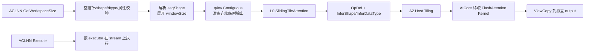
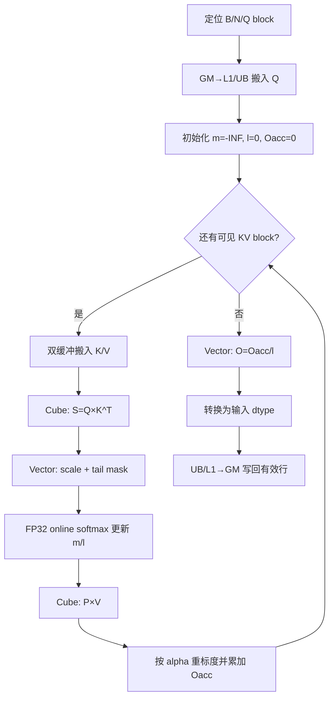

# SlidingTileAttention 算子设计文档

| 项目 | 内容 |
| --- | --- |
| 文档版本 | V0.1 |
| 文档状态 | 正式版 |
| 编制日期 | 2026-08-26 |
| 目标硬件 | Atlas A2 系列（`ascend910b`） |
| 软件基线 | CANN 9.0.0 及以上 |
| 参考实现 | FastVideo `4ddcdf541f32b63b5c684016c903658e2e2b6f67` |
| 本地代码基线 | `ops-transformer` `master@8dcf6714c4c2e725d69462edf396b01637312e7f` |

> **文档定位**：截至上述代码基线，`ops-transformer` 中尚不存在
> `SlidingTileAttention`/`sliding_tile_attention` 的目录、符号或 Git 历史实现，工作树为干净状态。
> 因此本文中的 ACLNN、Host、Tiling、Kernel、SoC 注册和性能优化均为**拟实现设计**，不是对现有代码的
> 反向说明；文中不填写未经 910B3 实测的数据。

## 修订记录

| 版本 | 日期 | 修改说明 |
| --- | --- | --- |
| V0.1 | 2026-08-26 | 基于任务书、官方模板、固定版本 FastVideo、ATK 附件及当前仓库基线形成初版设计 |

# 需求背景（required）

## 需求来源

本任务来源于 CANN 社区任务 `04-1-SlidingTileAttention`。任务要求参考 FastVideo 的
`sliding_tile_attention`，在昇腾 NPU 上使用 Ascend C 开发功能一致的 ACLNN 算子，支持
FLOAT16、BFLOAT16 和 BNSD 布局，适配 A2 系列产品，并完成精度、确定性和性能验收。

本设计的输入依据如下：

1. 本地《SlidingTileAttention 算子开发任务书》及随附 ATK 测试资产；
2. FastVideo 固定提交中的 Python 包装、Triton kernel 和 CUDA/ThunderKittens kernel；
3. `ops-transformer` 当前 experimental attention 工程组织、A2 注册和构建方式；
4. CANN 社区任务 2026 官方 `design_template.md`。

## 背景介绍

### SlidingTileAttention 功能背景

SlidingTileAttention（下文简称 STA）面向视频扩散模型中的超长视频 token 序列。完整全局注意力的
计算量和 score 存储量随序列长度呈平方增长；STA 将 image token 划分为三维逻辑 tile，仅计算
query tile 周围的局部 KV tile，同时保留 text token 的全局可见性，从而将大量无效的远距离
image-image 注意力块直接跳过。

输入、输出均采用 BNSD 逻辑布局：

\[
Q,K,V,O\in\mathbb{R}^{B\times N\times S\times D},\qquad
\mathrm{scale}=\frac{1}{\sqrt D}
\]

其中，`B` 为 batch，`N` 为 head 数，`S` 为序列容量，`D` 为 head dimension。

### FastVideo 固定版本现状分析

固定版本 FastVideo 包含两条路径：

- Python 包装在 C++ 扩展不可用时调用 Triton 实现；
- C++ 扩展路径逐 batch/head 调用 GPU kernel，最后单独计算 text query 的全局注意力。

源码实际行为可归纳为：

| 项目 | FastVideo 固定版本行为 |
| --- | --- |
| image/text 排布 | image 在前，text/padding capacity 在序列尾部 |
| 基础 tile | `6×8×8=384` 个 token |
| `window_size` 单位 | 三维逻辑 tile 数，不是单 token 半径 |
| image query | 关注 clamp 后的局部 image tile 窗口；有 text 时再关注全部有效 text KV |
| text/tail query | 关注全部 image KV 和全部有效 text KV |
| 边界窗口 | 移动窗口中心，在网格允许时保持窗口大小，不简单截短窗口 |
| softmax | KV block 流式遍历，维护 FP32 running max、denominator 和 output accumulator |
| padding | `has_text=true` 时按 384 对齐，计算完成后裁回调用前的 `S` |
| 已显式覆盖的 canvas | `30x48x80`、`36x48x48`、`18x48x80` |

三种基准 canvas 的 tile 网格如下：

| `seq_shape` | image token 数 | tile 网格 | tile 数 |
| --- | ---: | ---: | ---: |
| `30x48x80` | 115200 | `5×6×10` | 300 |
| `36x48x48` | 82944 | `6×6×6` | 216 |
| `18x48x80` | 69120 | `3×6×10` | 180 |

### 当前代码基线分析

本地 `ops-transformer` 的 `master@8dcf6714c` 中：

- 不存在 `experimental/attention/sliding_tile_attention`；
- 不存在 `aclnnSlidingTileAttention`、OpDef、InferShape、Tiling 或 AICore kernel；
- 不存在该算子的 README、examples、tests、SoC 配置或 NPU 自测结果；
- `experimental/attention/CMakeLists.txt` 已具备自动遍历新增子目录的能力，可作为后续工程接入点。

因此，本任务属于新增 experimental attention 算子，不涉及修改既有 STA 行为或兼容已有 NPU 实现。

# 需求分析（required）

## 需求描述

在 Atlas A2 上新增 ACLNN 工程化算子 `SlidingTileAttention`。算子以规则三维 tile 稀疏结构执行
FlashAttention 式在线 softmax，支持：

- q/k/v/output 为 FLOAT16 或 BFLOAT16；
- BNSD `[B,N,S,D]`；
- 单窗口向全部 head 广播，或逐 head 独立窗口；
- image 局部 tile attention；
- 可选 text KV 全局可见和 text/tail query 全局 attention；
- 非连续输入；
- 确定性计算；
- A2 `ascend910b` 动态编译、安装和 ACLNN 调用。

## 需求拆解

1. **接口契约**：保持任务书给出的两阶段 ACLNN 原型，不把 `seqShape` 擅自改成整数枚举，也不把
   `windowSize` 的公开类型改成单个展平数组。
2. **参数校验**：覆盖空指针、dtype、shape、窗口、字符串解析、容量、乘法溢出和输出独立性。
3. **功能语义**：按固定版本 FastVideo/随附 ATK oracle 的 image-first、text-tail、tile-window
   语义实现；任务书文字冲突必须在代码冻结前由任务方确认。
4. **数值精度**：QK/PV 使用输入 dtype 参与 Cube 计算，score、softmax 状态和输出累加使用 FP32。
5. **内存设计**：不落完整 `S×S` score/mask，不物理构造按 384 补齐后的 q/k/v。
6. **并行设计**：一个输出 query block 只由一个逻辑 C/V 计算组拥有，不跨计算组拆分规约，也不使用
   跨组 atomic reduction；组内 AIC/AIV 通过固定同步协议协作。
7. **性能设计**：利用 `384=6×64=3×128`，按 Q block 和 KV block 做规则块稀疏计算，跳过不可见
   KV tile，并重叠 MTE、Cube 和 Vector 流水。
8. **工程交付**：补齐 op_api、op_host、op_kernel、A2 注册、构建配置、UT/ST、ATK 和性能用例。

## 算子公开接口

```cpp
aclnnStatus aclnnSlidingTileAttentionGetWorkspaceSize(
    const aclTensor          *q,
    const aclTensor          *k,
    const aclTensor          *v,
    aclTensor                *output,
    const aclIntArray *const *windowSize,
    uint64_t                  windowSizeLen,
    int64_t                   textLength,
    bool                      hasText,
    const char               *seqShape,
    uint64_t                 *workspaceSize,
    aclOpExecutor           **executor);

aclnnStatus aclnnSlidingTileAttention(
    void          *workspace,
    uint64_t       workspaceSize,
    aclOpExecutor *executor,
    aclrtStream    stream);
```

### 参数契约

| 参数 | I/O | 设计契约 |
| --- | --- | --- |
| `q` | 输入 | 4D BNSD `[B,N,S,D]`，FLOAT16/BFLOAT16，所有维度大于 0 |
| `k` | 输入 | shape、dtype 与 q 完全相同，不支持 broadcast |
| `v` | 输入 | shape、dtype 与 q 完全相同，不支持 broadcast |
| `output` | 独立输出 | shape、dtype 与 q 完全相同；不与 q/k/v 复用存储 |
| `windowSize` | 属性 | 外层长度为 1 或 N；每个元素是长度为 3 的 `(Kt,Kh,Kw)` |
| `windowSizeLen` | 属性 | `windowSize` 外层元素数，只能为 1 或 N |
| `textLength` | 属性 | 有效 text KV 数；`hasText=false` 时按 0 处理 |
| `hasText` | 属性 | 是否启用 text-tail 与 text 全局路径 |
| `seqShape` | 属性 | 严格格式 `T x H x W`，实际字符串不含空格，如 `30x48x80` |
| `workspaceSize` | 输出 | ACLNN executor、连续化、临时输出、内部元数据和 Matmul 所需 workspace 大小 |
| `executor` | 输出 | 第一阶段生成的执行器 |
| `workspace` | 输入 | 第二阶段执行所需 workspace；大小为 0 时允许为 `nullptr` |
| `stream` | 输入 | ACL Runtime stream |

## 采用的功能语义

### 序列分段

令：

\[
I=T\times H\times W,\quad
L=\begin{cases}\text{textLength},&\text{hasText}=true\\0,&\text{hasText}=false\end{cases},\quad
C=S-I
\]

本设计采用与 FastVideo/ATK oracle 一致的分段：

- image 区间：`[0, I)`；
- tail capacity：`[I, S)`；
- 有效 text KV：`[I, I+L)`；
- tail 中 `[I+L,S)` 为 padding/capacity token，不作为 KV 被 softmax 看到；
- tail 内所有实际存在的 query 行 `[I,S)` 均执行全局 attention，以保证 output 的每一行都有确定值。

`hasText=false` 时要求 `S=I`。`hasText=true` 时要求 `S>=I+L`。

### Tile 组织与窗口

基础 tile 为 `(tileT,tileH,tileW)=(6,8,8)`。FastVideo 三个标准 canvas 均可被基础 tile 整除，
每个 tile 固定包含 384 个连续 token，并按 tile 坐标 `(tt,th,tw)` 的字典序存放。

为覆盖任务书提出的通用 `axbxc`，本文把 FastVideo 的存储规则唯一扩展为**紧凑 tile-major**，不是
普通 `(t,h,w)` row-major。令：

\[
G_t=\lceil T/6\rceil,\quad G_h=\lceil H/8\rceil,\quad G_w=\lceil W/8\rceil
\]

对 tile `(tt,th,tw)`，定义 `t0=6tt`、`h0=8th`、`w0=8tw`，以及：

\[
v_t=\min(6,T-t_0),\quad v_h=\min(8,H-h_0),\quad v_w=\min(8,W-w_0)
\]

前置 token 数和 tile 内局部索引分别为：

\[
\mathrm{tileBase}=t_0HW+v_t h_0W+v_t v_h w_0
\]

\[
\mathrm{local}(lt,lh,lw)=(lt\cdot v_h+lh)\cdot v_w+lw
\]

因此序列偏移为 `tileBase+local`，该 tile 的有效 token 数为 `tileValid=v_t*v_h*v_w`。标准满 tile
退化为 `tileBase=((tt*G_h+th)*G_w+tw)*384`。通用路径的 Q/KV 子块数分别为
`ceil(tileValid/Br)` 和 `ceil(tileValid/Bc)`，最后一块按 `tileValid` 做 mask；只有标准满 tile 才固定
枚举 6 个 64-token Q block 和 3 个 128-token KV block。任务由 Host 直接携带 tile 坐标和子块号，
kernel 不从任意序列下标反推坐标，也不建立大型逐 token 索引表。该泛化规则必须用独立 CPU FP32
golden 验证；FastVideo 固定版本本身只覆盖三个标准 canvas。

对第 n 个 head，窗口为 `(Kt,Kh,Kw)`，单位均为 tile。每一维网格大小记为 `G`、窗口大小为 `K`、
query tile 坐标为 `q`，边界采用：

```text
effectiveK = min(K, G)
start      = clamp(q - floor(K / 2), 0, G - effectiveK)
end        = start + effectiveK              // 左闭右开
```

因此窗口在边界处向内平移；当窗口大于网格时退化为该维全局可见。

### 可见集合与输出

对 image query `i`，其可见 KV 集合为：

\[
\mathcal{V}_{img}(i,n)=\mathcal{W}_{tile}(i,n)\cup
\begin{cases}
[I,I+L),&\text{hasText}=true\\
\varnothing,&\text{hasText}=false
\end{cases}
\]

对 tail query `i∈[I,S)`：

\[
\mathcal{V}_{tail}(i)=[0,I)\cup[I,I+L)
\]

最终：

\[
s_{ij}=\frac{Q_iK_j^T}{\sqrt D},\qquad
p_{ij}=\frac{e^{s_{ij}}}{\sum_{r\in\mathcal V(i)}e^{s_{ir}}},\qquad
O_i=\sum_{j\in\mathcal V(i)}p_{ij}V_j
\]

窗口外 image KV、无效 text/padding KV 不参与 max、denominator 或 PV 累加。

### 384 对齐的等价处理

FastVideo 会把 `S` 补齐到 384 的倍数后再裁剪。本设计不在 GM 中复制 q/k/v：

- query block 中 `qIndex>=S` 的行通过 mask 跳过读取和写回；
- text KV 仅允许 `keyIndex<I+L`；
- 补齐产生的临时 query 行不会返回，因此无需真实计算；
- `[I,S)` 内已经存在的 tail query 仍按全局路径计算。

该方式在 `[0,S)` 的有效输出范围与“物理 padding 后裁剪”等价，同时减少 workspace 和拷贝开销。

## 参数校验与异常行为

`GetWorkspaceSize` 依次执行以下校验，失败时返回参数错误，不创建可执行 executor：

1. q/k/v/output/windowSize/seqShape/workspaceSize/executor 均非空；
2. q/k/v/output 均为 4 维，B/N/S/D 均大于 0；
3. q/k/v/output shape 完全相同；
4. q/k/v/output dtype 完全相同，且仅为 FLOAT16 或 BFLOAT16；
5. 不允许 q/k/v 之间通过 broadcast 形成 shape；output 为独立输出；
6. `seqShape` 严格匹配 `^[1-9][0-9]*x[1-9][0-9]*x[1-9][0-9]*$`；
7. T、H、W 及 `T*H*W` 的计算做 int64 溢出检查；
8. `windowSizeLen` 为 1 或 N，每个 `aclIntArray` 非空且长度为 3；
9. 每个窗口分量为正奇数；窗口大于 tile 网格合法，按全维可见处理；
10. 无论 `hasText` 取值，先要求 `textLength>=0`；
11. `hasText=false` 时允许调用方传入非负值但内部归一化为 0，并要求 `S=I`；
12. `hasText=true` 时要求 `textLength<=S-I`；
13. q/k/v 非连续时由 ACLNN 层连续化，不作为非法输入；
14. 计算元素数、字节数、workspace 时全部做无符号溢出检查。

## 任务书、参考实现与 ATK 的口径差异

以下项目在实现冻结前必须由任务方确认；本文为形成可执行方案，暂以“FastVideo 固定版本 + 随附 ATK
oracle”作为优先验收真值。

| P0 项 | 任务书文字 | FastVideo/ATK 实际 | 本设计暂定 |
| --- | --- | --- | --- |
| text 位置 | text 在前，`j<textLength` | image 在前，text 从 `imgSeqLen` 开始 | image-first/text-tail |
| window 单位 | 描述为逐 token 三维距离 | 固定 6×8×8 tile，窗口单位为 tile | tile 窗口 |
| 边界窗口 | 距离条件自然截短 | clamp 窗口中心，尽量保持窗口大小 | clamp/平移 |
| `S` | 一处写等于，一处写大于等于 | ATK 使用 `S=image+capacity`，`textLength<=capacity` | 有 text 时使用 `>=` |
| `textLength` | 参数表写正数 | 无 text 用例为 0，生成器理论可生成有 text 且 0 | 允许 0 |
| `seqShape` 类型 | C API 为字符串 | ATK JSON 编成 int64 1/2/3 | 公开 API 保持字符串；修复 ATK 适配 |
| canvas 泛化 | 暗示任意 `axbxc` | FastVideo/ATK 仅三种 | 三种走快路径，其他走通用边界 tile 路径 |
| 窗口广播 | 长度 1 或 N | 随机 ATK 仅覆盖单窗口广播 | 两种均实现并补测 per-head |
| 0.8 倍性能口径 | 未明确按耗时还是吞吐换算 | 只有 A100 profiler 聚合值 | 暂按吞吐达到 0.8 倍换算，并请求确认 |

# 详细设计（required）

## 算子分析

### 支持数据类型

OpDef 只注册按索引严格配对的两组 dtype 组合：

| 组合 | q | k | v | output | 中间计算 |
| ---: | --- | --- | --- | --- | --- |
| 0 | FLOAT16 | FLOAT16 | FLOAT16 | FLOAT16 | FP32 |
| 1 | BFLOAT16 | BFLOAT16 | BFLOAT16 | BFLOAT16 | FP32 |

不允许 q/k/v 使用不同 dtype。FP16/BF16 均不需要 ACLNN 层 cast；kernel 模板直接接收对应输入类型，
QK score、online softmax 状态和 O accumulator 使用 FP32，写回前转换成输入 dtype。

### 支持形状

- 公开布局：BNSD `[B,N,S,D]`；
- B、N、S、D 均为正整数；
- q/k/v/output shape 完全一致；
- D 的通用路径按 16 列分片，最后一片零填充/掩码；D=16/32/64 为随附 ATK 已生成范围，D=64 为
  性能快路径；
- 标准 canvas `30x48x80`、`36x48x48`、`18x48x80` 使用固定满 tile 快路径；
- 其他正整数 canvas 使用边界 tile 通用路径，性能不做预先承诺。

### 计算复杂度

令 `R_n` 为 head n 对一个 image query tile 实际保留的 image KV tile 数，`Q=I/384` 为标准
canvas 的 query tile 数，则 image 路径的主计算量近似为：

\[
\mathrm{FLOPs}_{img}\approx
4\,B\sum_{n=0}^{N-1}Q\cdot384\cdot(R_n\cdot384+L)\cdot D
\]

其中系数 4 来自 QK 和 PV 各一次乘加。text/tail query 的主计算量近似为：

\[
\mathrm{FLOPs}_{tail}\approx4\,B\,N\,C\,(I+L)D
\]

相比 dense attention，STA 的收益来自 `R_n` 远小于全部 tile 数时完全跳过不可见 KV tile。

## 算子实现

### 总体架构



`GetWorkspaceSize` 完成所有需要读取 host 属性的工作并把属性深拷贝进 executor；第二阶段只验证
workspace 大小并在指定 stream 上执行，不能持有调用方栈上 `windowSize` 或 `seqShape` 的悬空指针。

### 预期工程目录

```text
experimental/attention/sliding_tile_attention/
├── CMakeLists.txt
├── README.md
├── docs/
│   └── aclnnSlidingTileAttention.md
├── examples/
├── op_host/
│   ├── CMakeLists.txt
│   ├── sliding_tile_attention_def.cpp
│   ├── sliding_tile_attention_infershape.cpp
│   ├── sliding_tile_attention_tiling.h
│   ├── sliding_tile_attention_tiling.cpp
│   ├── op_api/
│   │   ├── aclnn_sliding_tile_attention.h
│   │   ├── aclnn_sliding_tile_attention.cpp
│   │   ├── sliding_tile_attention.h
│   │   └── sliding_tile_attention.cpp
│   └── config/
│       └── ascend910b/
├── op_kernel/
│   ├── sliding_tile_attention.cpp
│   ├── sliding_tile_attention.h
│   └── sliding_tile_attention_tiling_data.h
└── tests/
    ├── ut/
    └── st/
```

具体文件名以仓库生成器和同类 experimental attention 算子的最终规范为准。

### ACLNN 与 L0 设计

`aclnnSlidingTileAttentionGetWorkspaceSize` 的拟调用流程：

1. 执行公开参数校验；
2. 解析 `seqShape` 得到 T/H/W/I；
3. 将 `windowSize` 长度 1 广播到 N，或复制 N 组窗口；
4. 构造唯一内部元数据 `staMeta`，布局为
   `[N,T,H,W,effectiveTextLength,hasText,w0t,w0h,w0w,...,w(N-1)t,w(N-1)h,w(N-1)w]`，
   dtype 为 INT64，shape 为 `[6+3*N]`；
5. 用 `executor->AllocIntArray` 深拷贝 `staMeta`，由 executor arena 管理其生命周期；
6. 对 q/k/v 调用连续化，若 output 非连续则创建连续临时输出；
7. 调用唯一内部 L0 契约
   `l0op::SlidingTileAttention(q, k, v, const aclIntArray *staMeta, executor)`；
8. L0 只执行 `ConvertToTensor(staMeta, DT_INT64)`、infer 和 AICore launcher；
9. 必要时把临时结果 ViewCopy 到用户 output；
10. 返回 executor 汇总的 workspace 大小。

该路径复用仓内 `StemOamPrepVarlenQ` 的 `aclIntArray → ValueDepend Tensor → Host Tiling/kernel` 模式。
同一个 `staMeta` tensor 既由 Host Tiling 通过 `GetInputTensor()->GetData<int64_t>()` 读取，也作为 kernel
GM 入参；不存在第二套窗口或序列属性真值源。executor 必须持有 IntArray、tensor 描述和设备侧常量，
直到第二阶段执行完成，绝不能保留调用方嵌套数组、局部 vector 或 `seqShape` 字符串的地址。

### OpDef 与推导设计

唯一内部 OpDef 契约为 `SlidingTileAttention(q,k,v,staMeta)->output`，不再重复注册窗口、T/H/W、
`textLength` 或 `hasText` 属性：

- `staMeta`：REQUIRED、DT_INT64、ND、`AutoContiguous()`、`ValueDepend(REQUIRED)`；
- shape 必须为 `[6+3*N]`，header N 必须等于 q 的 head 数，header 的 `hasText` 只能为 0/1；
- 两组 dtype 组合中 meta 的 dtype 列表均写成 `{DT_INT64, DT_INT64}`；
- Host 再次验证 header、窗口正奇数、容量及所有乘加溢出，防止绕过 ACLNN 直接调用 L0。

- `InferShape`：output 的 storage/origin shape 均复制 q；
- `InferDataType`：output dtype 复制 q；
- format：两组组合均使用 ND 存储格式，逻辑维序固定解释为 BNSD；
- AICore 注册：只添加 `ascend910b`；
- 不注册 AiCPU fallback，避免验收时静默走 CPU 路径。

### Host 侧 Tiling 设计

#### Tiling 输入信息

Host 从上下文取得：

- B/N/S/D、dtype、storage shape；
- 通过 value-dependent `staMeta` 取得 T/H/W/I、tail capacity C、有效 text 长度 L 和每个 head 的
  `(Kt,Kh,Kw)`；
- A2 AICore 数、UB/L1 大小和 Matmul tiling 能力；
- 输入地址连续性已由 ACLNN 层归一化。

#### 逻辑 tile 与块划分

标准性能路径采用：

- 逻辑视频 tile：384 token；
- Q block：优先 `Br=64`，一个逻辑 tile 对应 6 个 Q block；
- KV block：优先 `Bc=128`，一个逻辑 tile 对应 3 个 KV block；
- D=64 时 `Q[64,64] × Kᵀ[64,128]`，随后 `P[64,128] × V[128,64]`。

`Br/Bc` 不是公开约束。Host 根据 D、UB、双缓冲和 Matmul tiling 重新选择：

```text
ubNeed = qBuf
       + 2 * (kBuf + vBuf)
       + 2 * vectorScoreSliceBuf
       + 2 * vectorProbabilitySliceBuf
       + softmaxStateBuf
       + safetyReserve
```

完整 QK score 和 PV partial 通过每组 GM ping-pong workspace 在 AIC/AIV 间交换，AIV 每次只把 16 或
32 行 score slice 搬入 UB 做 softmax，避免要求 UB 同时容纳完整 `Br×Bc` FP32 score。只有
`ubNeed<=availableUb` 才采用候选配置。D 较小可尝试 `Br=128`；D 较大则减小 Br 或沿 D 分段。
所有候选必须通过编译、精度和 msprof 后才能固化，本文不把候选值描述为已实测最优值。

#### 可见 KV 枚举

规则窗口不生成 `QBlock×KVBlock` 的大型稀疏索引表。kernel 根据 query tile 坐标、head 窗口和网格
范围直接按 `(t,h,w,subBlock)` 字典序枚举 KV：

1. 枚举 clamp 后的 image tile 窗口；
2. 标准满 image tile 枚举 3 个 128-token KV block；通用边界 tile 枚举
   `ceil(tileValid/kvBlockSize)` 个 block；
3. `hasText=true` 时追加 `[I,I+L)` 的 KV block，最后一块做 tail mask；
4. tail query 路径枚举全部 image tile，再枚举有效 text KV。

这样既避免数 MB 级元数据上传，也保证每次运行的 KV 累加顺序固定。

#### 分核策略

基本任务为 `(batch, head, queryBlock)`，每个任务分配给一个逻辑 C/V 计算组，并且只由该组写一个
output query block。

- Host 估算每个 head 的 `visibleKvBlocks`，将不同窗口的任务按预计 FLOPs 做代价前缀和；
- 按累计代价而不是只按任务个数切分到实际 C/V 计算组数；
- 每个逻辑组处理一个确定的连续任务区间，任务不足时减少实际逻辑组数；
- 标准性能场景中逐 head 窗口差异很大，代价切分用于避免大窗口 head 集中到少数核；
- 分核只改变独立输出块的调度，不改变单个输出行内的 KV 累加顺序。

#### TilingKey 规划

dtype 由编译期 `ORIG_DTYPE_Q` 分发；运行时 tiling key 只编码会改变 kernel 热路径的语义：

```text
bit 0: hasText
bit 1: genericEdgeTile（T/H/W 至少一维不能被 6/8/8 整除）
```

得到 0～3 共 4 个逻辑 key。单窗口已在 ACLNN 层广播为 N 组，kernel 始终按 head 从 `staMeta`
读取三元组，因此广播/per-head 不再产生热路径或 tiling key。Host 只能选择已经编译注册的 key；
未实现组合必须在 launch 前返回错误，kernel 不设置会静默空跑的默认分支。

#### TilingData

拟议字段如下，实际类型需通过 `REGISTER_TILING_DATA_CLASS` 与 host/kernel 对齐：

```cpp
constexpr uint32_t STA_MAX_GROUP_NUM = 25;      // A2/FIA 固定核槽容量
constexpr uint32_t STA_GROUP_END_CAP = 26;

struct StaTaskCursor {
    uint32_t batch;
    uint32_t head;
    uint32_t region;       // 0=image, 1=tail
    uint32_t tileT;
    uint32_t tileH;
    uint32_t tileW;
    uint32_t qSubBlock;
};

struct SlidingTileAttentionTilingData {
    uint32_t batch;
    uint32_t headNum;
    uint64_t seqLen;
    uint32_t headDim;
    uint32_t headDimAlign;

    uint32_t canvasT;
    uint32_t canvasH;
    uint32_t canvasW;
    uint64_t imageSeqLen;
    uint64_t textLength;
    uint64_t tailCapacity;

    uint32_t tileT;
    uint32_t tileH;
    uint32_t tileW;
    uint32_t tileNumT;
    uint32_t tileNumH;
    uint32_t tileNumW;

    uint32_t qBlockSize;
    uint32_t kvBlockSize;
    uint32_t dChunkSize;
    uint32_t vectorRowSlice;
    uint32_t usedAicNum;
    uint32_t usedAivNum;
    uint32_t groupNum;
    uint32_t blockDim;
    uint64_t totalTaskNum;
    uint64_t totalTaskCost;
    uint64_t groupTaskEnd[STA_GROUP_END_CAP];  // exclusive；未用项填 totalTaskNum
    StaTaskCursor groupStart[STA_MAX_GROUP_NUM];

    uint64_t libapiWorkspaceSize;
    uint64_t perGroupWorkspaceStride;
    uint64_t scoreOffset;
    uint64_t probabilityOffset;
    uint64_t pvOffset;
    uint64_t accumulatorOffset;
    uint64_t rowStatsOffset;
    uint64_t workspaceSize;
    float scale;
};
```

逐 head 窗口只存在于动态长度 `staMeta`，不放入固定 TilingData，因此不对 N 添加任务书未声明的
上限。代价分核按 `batch→region/image tile(t,h,w)→qSubBlock→head` 定义规范任务序，令
`cost(task)=validQRows*visibleKvTokens`（公共因子 `4*D` 可约去）。Host 两遍扫描而不保存逐任务表：
第一遍求总成本，第二遍以累计成本的 `1/G,2/G,...` 分位点确定 exclusive `groupTaskEnd`，同时保证
每组至少一个任务、后续组仍有任务；最后一项必须等于 `totalTaskNum`，未用项也填该值。

标准满 tile 可直接由 task ordinal 解码；通用边界路径为每组额外保存一个 `groupStart`，随后按同一
有限状态机递增到 `groupTaskEnd`。25/26 槽复用仓内 A2 FIA 的固定核边界容量，实际 `groupNum` 仍由
平台查询且不得超过该容量。Host 必须校验 tiling data 不超过 raw buffer capacity。这样无需逐任务表，
也不会出现“Host 已分核但 kernel 无法还原边界”的歧义。

#### Workspace 规划

workspace 可能包括：

- q/k/v 非连续输入的连续化副本；
- 非连续 output 的连续临时 tensor；
- executor 持有的 `staMeta` 常量 tensor 和 TilingData 中的小型分核 cursor；
- Ascend C Matmul/Cube 系统 workspace；
- 每个逻辑计算组的 QK score、probability、PV partial ping-pong 槽和 FP32 output accumulator；
- 如通用边界 tile 路径需要的轻量偏移元数据。

核心 STA kernel 不申请完整 `S×S` score、dense mask、百万级 SABI 或物理 padding workspace；只保留
当前 KV block 所需的每组流水槽。最终大小由 executor 统一返回，调用者必须按返回值分配，不能硬编码。

### Kernel 侧设计

#### Kernel 入口与模板分发

入口根据 `ORIG_DTYPE_Q` 分发 `half`/`bfloat16_t` 模板，根据 tiling key 选择 no-text/text 和标准/
边界 tile 路径。A2 使用 `__CCE_AICORE__ == 220` 对应的 arch22 实现，代码不得解析
A5/arch35 专用 API。

#### A2 C/V 协同与 per-group workspace

A2 attention 快路径复用仓内 FIA 的 `KERNEL_TYPE_MIX_AIC_1_2` 映射。Host 运行时查询 AIC、AIV、
UB、L1、L0C 资源，不硬编码实际使用核数：

```text
G       = min(platformAicNum, floor(platformAivNum / 2), totalTaskNum)
usedAic = G
usedAiv = 2 * G
blockDim = platform.CalcTschBlockDim(usedAiv, usedAic, usedAiv)
```

kernel 侧 AIC 的 `groupId=GetBlockIdx()`；AIV 使用
`groupId=GetBlockIdx()/2`、`subVecId=GetBlockIdx()%2`。两个 AIV 固定按 16 行对齐拆分 Br：

```text
v0Rows = Br <= 16 ? Br : ceil(ceil(Br / 16) / 2) * 16
AIV0 rows = [0, v0Rows)
AIV1 rows = [v0Rows, Br)
```

即使尾部 Q block 使某个 AIV 的有效行数为 0，该 AIV 也必须参与全部跨核握手，不能提前退出。每组
职责为：AIC 执行 `Q×Kᵀ`；两个 AIV 各自对固定行片执行 scale、mask、online softmax；AIC 等两片
probability 完成后执行 `P×V`；两个 AIV 各自更新本行片的 m/l/Oacc，最终也各自归一化、cast、写回，
不存在跨 AIV 行规约或“指定单个 AIV 汇聚整块”。

跨核同步只使用 arch22 的 `CrossCoreSetFlag/CrossCoreWaitFlag`、`SYNC_MODE2=2`，不使用 GM flag。
为 ping/pong 独占 8 个逻辑 flag ID：

```text
scoreReady[2] = {6, 7}    // AIC 广播给两个 AIV
probReady [2] = {8, 9}    // 两个 AIV 汇合到 AIC
pvReady   [2] = {10, 11}  // AIC 广播给两个 AIV
pvFree    [2] = {12, 13}  // 两个 AIV 汇合到 AIC
```

对第 r 个 KV block，`p=r&1`：

```text
AIC:
  if r >= 2: CrossCoreWaitFlag(pvFree[p])
  MM1 写 score[p]
  CrossCoreSetFlag<MODE2, PIPE_FIX>(scoreReady[p])
  CrossCoreWaitFlag(probReady[p])
  MM2 读 prob[p]、写 pv[p]
  CrossCoreSetFlag<MODE2, PIPE_FIX>(pvReady[p])

每个 AIV:
  CrossCoreWaitFlag(scoreReady[p])
  处理自己的 score 行并以 MTE3 写 prob[p] 的不相交行
  CrossCoreSetFlag<MODE2, PIPE_MTE3>(probReady[p])
  CrossCoreWaitFlag(pvReady[p])
  MTE2 读取自己的 pv 行，更新 m/l/Oacc
  CrossCoreSetFlag<MODE2, PIPE_MTE2>(pvFree[p])
```

MODE2 下两个 AIV 对同一 ready/free flag 发信号，AIC 的一次 wait 构成 1C:2V 组屏障。任务结束前
AIC 必须消费最后一至两个未消费的 `pvFree` token，之后才进入下一任务。CrossCore flag 同时建立
GM 写后读次序，`syncAreaBytes=0`；不得再额外申请或初始化 GM 同步区。

每个计算组的 workspace 上界按实际 `Br/Bc/D` 计算：

```text
scoreSlot = Align512(Br * Bc * sizeof(float))
probSlot  = Align512(Br * Bc * sizeof(input_dtype))
pvCols    = min(D, dChunkSize)              // D=64 快路径中 dChunkSize=D
pvSlot    = Align512(Br * pvCols * sizeof(float))
accSlot   = Align512(Br * D  * sizeof(float))
rowStats  = Align512(Br * 2  * sizeof(float))

perGroupStride = Align512(2 * scoreSlot
                        + 2 * probSlot
                        + 2 * pvSlot
                        + accSlot
                        + rowStats)

kernelWorkspace = Align512(libapiWorkspace) + G * perGroupStride
```

例如 Br=64、Bc=128、D=64、2-byte 输入时，上式为 147,968 B/组；若 G=24，则组流水槽合计
3,551,232 B，尚需加 `libapiWorkspace`。ACLNN 对外返回值还要合并 q/k/v 连续化、临时 output 和
内部 meta 所需空间。所有乘法、加法和 512B 对齐均使用 uint64 并检查溢出。生命周期分析允许复用
槽位时可以缩减该上界，但 Host 与 Kernel 必须使用同一 offset/stride 计算。

```text
totalWorkspace = qContiguousBytes + kContiguousBytes + vContiguousBytes
               + tempOutputBytes + internalMetaBytes
               + kernelWorkspace
```

#### D 维通用分片

D 不要求调用方预先对齐。QK 对 D 按 `dChunkSize`（16 的倍数）分片，尾片零填充，并在 L0C/FP32
score 上按固定 dChunk 顺序累加：

```text
score = 0
for d0 in [0, D), step dChunkSize:
    score += Q[:, d0:d1] * K[:, d0:d1]^T
```

PV 以 D 为输出列维做相同分片，每个 dChunk 读取 `P×V[:,d0:d1]`，用同一 `alpha` 更新对应的 GM
Oacc 列，尾片只写有效 D 列。若 `Br×D` accumulator 不能驻留 UB，则按上述 per-group GM 槽常驻；
Host 可依次缩小 Br、vectorRowSlice、dChunkSize，直到 Matmul/UB/L1 约束满足。所有候选均失败时由
Host Tiling 返回不支持错误，而不是启动空 kernel。D=64 仍使用不分片快路径。

#### 单个 query block 的处理流程



#### Online Softmax

对第 r 个 KV block，score 为 `S_r`，逐行维护：

\[
m_0=-\infty,\quad l_0=0,\quad O_0=0
\]

\[
\hat m_r=\max(S_r),\qquad m_r=\max(m_{r-1},\hat m_r)
\]

\[
\alpha_r=e^{m_{r-1}-m_r},\qquad P_r=e^{S_r-m_r}
\]

\[
l_r=\alpha_r l_{r-1}+\sum P_r
\]

\[
O_r=\alpha_r O_{r-1}+P_rV_r
\]

遍历结束后输出 `O_r/l_r`。实现可使用 `exp2(x·log2(e))`，但 scale、mask、max、sum、alpha、
denominator 和 accumulator 均保留 FP32。尾部 mask 必须在 row max 前写为 `-INF`。

#### image query 路径

1. 从 Host 下发的 task cursor/标准路径 task ordinal 取得逻辑 image tile 坐标和 qSubBlock；
2. 读取当前 head 窗口，计算三维 `[start,end)`；
3. 按固定字典序流式计算窗口内 image KV；
4. `hasText=true` 时继续流式计算有效 text KV；
5. 标准 canvas 走无边界 tile 分支，通用 canvas 对不足 384 的边界 tile 做有效 token mask。

#### tail query 路径

`hasText=true` 时，对 `[I,S)` 中每个实际 query 行：

1. 流式遍历全部 image KV；
2. 流式遍历 `[I,I+L)` 有效 text KV；
3. 不把 `[I+L,S)` padding/capacity token 当作 KV；
4. 对 `qIndex>=S` 的临时对齐行不读、不写。

#### 数据搬运与流水

- D=64 快路径的 Q 在处理全部可见 KV 期间驻留片上；D 通用路径按固定 dChunk 重载并累加；
- K/V 使用双缓冲，MTE2 预取下一 KV block；
- Cube 执行 QK/PV，Vector 对每组 GM score/PV 槽分片执行 scale、mask、max/sum、exp 和重标度；
- 使用事件同步保证 MTE2→Cube/Vector→MTE3 依赖；
- 连续满块使用对齐 DataCopy，边界块使用 DataCopyPad/tail mask；
- score/probability/PV 只写当前 KV block 对应的每组 GM ping-pong 槽，不形成完整 `S×S` score 或
  dense mask；不同计算组之间不做全局同步。

#### 确定性设计

相同输入多次运行结果一致的约束如下：

- 一个 query block 只由一个逻辑 C/V 计算组处理，两个 AIV 只写各自固定且不相交的有效行；
- 不使用跨核 atomic add；
- KV tile、KV sub-block 和 text block 的遍历顺序固定；
- 两个 AIV 的行切片归属及每个 row max/row sum 的向量归约树固定；
- core 调度变化不会改变单行规约顺序；
- padding/tail 初始化值固定；
- 所有未写回行都通过显式 mask 排除，不依赖未初始化 UB/GM 数据。

### Host/Kernel 伪代码

```text
for task in tasks_owned_by_this_logical_group:
    b, n, qBlock = decode(task)
    qRows = load_valid_q_rows(b, n, qBlock)
    m = -inf; l = 0; outAcc = 0

    if qBlock belongs to image:
        for kvTile in clamped_window(qTile, window[n]):
            for kvBlock in kvTile, ascending:
                m, l, outAcc = online_attention_update(qRows, kvBlock)
        if hasText:
            for kvBlock in valid_text_range, ascending:
                m, l, outAcc = online_attention_update(qRows, kvBlock)
    else:
        for kvBlock in all_image_blocks, ascending:
            m, l, outAcc = online_attention_update(qRows, kvBlock)
        for kvBlock in valid_text_range, ascending:
            m, l, outAcc = online_attention_update(qRows, kvBlock)

    store_valid_rows(outAcc / l)
```

## 支持硬件

| 支持的芯片版本 | 配置名 | 设计状态 |
| --- | --- | --- |
| Atlas 800I/T A2、Atlas A2 训练系列 | `ascend910b` | 本任务目标，待实现/实测 |
| A3 | `ascend910_93` | 非本任务范围 |
| A5 | `ascend950` | 非本任务范围 |

预期构建命令：

```bash
bash build.sh --pkg --experimental \
  --soc=ascend910b \
  --ops=sliding_tile_attention
```

`ENABLE_EXPERIMENTAL` 默认关闭，交付和复现说明必须显式带 `--experimental`。

## 算子约束限制

1. 仅支持 BNSD 逻辑维序和 FLOAT16/BFLOAT16；
2. q/k/v/output 必须同 shape、同 dtype，不支持 broadcast；
3. `windowSizeLen` 仅为 1 或 N，每个窗口必须是 3 个正奇数；
4. `seqShape` 必须是三个正十进制整数用小写 `x` 连接；
5. 本设计按 FastVideo 的 tile-major image 序列解释位置；若任务方最终要求普通逐 token row-major
   邻域，必须在实现前修改可见集合和 golden；
6. 标准三个 canvas 为性能快路径；通用 canvas 只承诺正确性，待实测后再声明性能；
7. `hasText=false` 时 `S=T*H*W`；`hasText=true` 时 `S>=T*H*W+textLength`；
8. 只适配 A2 `ascend910b`，不声明 A3/A5 支持；
9. 当前代码基线无实现，所有约束需在 ACLNN UT、Host UT、AICore ST 和 ATK 中落地验证。

# 可维可测分析

## 精度标准/性能标准

### 精度标准

| 输出 dtype | rtol | atol | required matched ratio | max abs error limit |
| --- | ---: | ---: | ---: | ---: |
| FLOAT16 | `2^-9`（约 `1.95e-3`） | `2^-9`（约 `1.95e-3`） | 0.99 | `1e-1` 或 `32×ULP` |
| BFLOAT16 | `2^-6`（约 `1.56e-2`） | `2^-6`（约 `1.56e-2`） | 0.99 | `1e0` 或 `32×ULP` |

单 case 同时满足 `matched_ratio>=required_matched_ratio` 和
`max_abs_error<=max_abs_error_limit` 才判定通过。报告必须给出公式、统计值和失败元素数，不能只写
`compare passed`。

### 性能标准与目标换算

按“910B3 吞吐达到 A100 的 0.8 倍”解释：

\[
T_{NPU}\le\frac{T_{A100}}{0.8}
\]

| Case | B/N/D | image / text | window | A100 平均时间 | 暂定 910B3 上限 |
| --- | --- | --- | --- | ---: | ---: |
| P1 | 1/8/64 | `30×48×80` / 128 | 8 个 head 各异 | 524.79 μs | 655.9875 μs |
| P2 | 1/8/64 | `36×48×48` / 0 | `(3,3,3)×8` | 4618 μs | 5772.5 μs |

FP16、BF16 必须分别测量，形成至少 4 条正式记录。若验收方实际把“0.8 倍”定义为 NPU 耗时不超过
`0.8×A100`，则两个上限将分别为 419.832 μs 和 3694.4 μs；该口径必须在性能冻结前确认。

任务书的 `Calls/Total/Avg` 可能是 profiler 的细粒度调用聚合，不一定等于一次完整 STA forward。
NPU 测量前还需确认比较的是单个 AICore kernel、完整 ACLNN 调用，还是逐 head/逐阶段子 kernel。

### 性能优化方案

1. **真跳稀疏块**：只枚举窗口内 KV tile，不生成 dense mask 后再计算；
2. **384 对齐分块**：利用 384 同时是 64 和 128 的整数倍，消除标准 canvas 的 mixed tile；
3. **Q 复用**：D=64 快路径让一个 Q block 在遍历所有可见 KV 时驻留片上，通用 D 路径复用当前
   dChunk；
4. **K/V 双缓冲**：重叠 GM→L1/UB 搬运与当前 block 的 Cube/Vector 计算；
5. **在线 softmax**：不落完整 `S×S` score，只保留当前 KV block 的流水槽，降低 GM 带宽与
   workspace；
6. **代价分核**：按每 head 可见 KV block 数均衡异构窗口；
7. **编译期分发**：dtype 和主要路径模板化，避免内层动态分支；
8. **标准 canvas 快路径**：消除边界 tile 偏移与通用 mask 开销；
9. **text tail mask**：只对最后一个 text KV block 做元素级 mask；
10. **不物理 padding**：避免 q/k/v 拼接、复制和裁剪的附加 kernel。

### 性能测量方法

性能报告必须固定：

- 设备型号为 910B3、CANN 版本、驱动/固件版本；
- B/N/S/D、dtype、window、textLength、hasText、seqShape；
- warmup 次数、正式循环次数、stream 和同步位置；
- 首次加载时间与热启动时间分开；
- 完整 ACLNN 延迟与目标 AICore kernel 延迟分开；
- msprof 中确认执行路径含 `AiCore`，不存在 AiCPU fallback；
- 报告平均值、P50、P90、最小值、标准差；
- 加速比按相同口径计算，不能混用单 kernel 与端到端时间。

## 精度与确定性测试设计

### Golden

1. 三个 FastVideo 标准 canvas 使用固定提交的 A100 FastVideo 作为主 golden；
2. GPU oracle 按随附 `exe.py` 的做法把输入提升到 FP32，降低 golden 自身舍入误差；
3. 通用 `axbxc`、长度 1 广播和边界 tile 使用独立 PyTorch/NumPy FP32 reference；
4. CPU reference 必须按本文冻结后的 tile-major、clamp、image-first/text-tail 语义实现；
5. 若任务方确认任务书逐 token/text-prefix 语义优先，golden 与本文对应章节同步修改后再开发。

### 功能矩阵

| 维度 | 覆盖 |
| --- | --- |
| dtype | FP16、BF16 |
| canvas | 三个标准 canvas；至少 3 个小型通用/边界 canvas |
| B/N/D | 随附用例范围 B/N=1～16、D=16/32/64；另测 D 非 16 对齐尾列 |
| text | hasText=false；hasText=true 且 L=0/1/127/128/239/容量上限 |
| S 容量 | `S=I+L`；`S>I+L`；对齐和非 384 对齐 |
| window | 长度 1 广播；长度 N 且各 head 不同；窗口 1；窗口等于/大于网格 |
| 边界 | 第一个/最后一个 t/h/w tile；不足 384 的边界 tile |
| 连续性 | q/k/v 分别构造非连续 BNSD view；output 非连续 |
| 数值 | 正态分布、较大正负值、全零、相同 score、极端 softmax 差值 |
| 确定性 | 同输入同 stream 重复至少 100 次，逐元素/逐字节一致 |

### 非法参数矩阵

覆盖空指针、非 4D、零维度、q/k/v shape 不一致、dtype 不一致、不支持 dtype、window 外层长度非法、
内层不是 3、窗口为 0/负数/偶数、非法 `seqShape`、乘法溢出、S 过小、无 text 时 S 不等于 I、
textLength 为负或超过容量、output shape/dtype 不一致以及 workspace 不足。

## 兼容性分析

本算子为 `experimental/attention` 下的新增算子，不修改既有算子和公共 ABI，不涉及旧版本行为兼容。
当前只注册 A2 `ascend910b`；A3/A5 若后续扩展，应新增独立 Host Tiling、kernel 路径、动态二进制
配置和完整回归，不允许复用 A2 结论直接宣称支持。

## 参考资料

1. [FastVideo `sliding_tile_attention` Python 包装](https://github.com/hao-ai-lab/FastVideo/blob/4ddcdf541f32b63b5c684016c903658e2e2b6f67/fastvideo-kernel/python/fastvideo_kernel/ops.py)
2. [FastVideo STA Triton kernel](https://github.com/hao-ai-lab/FastVideo/blob/4ddcdf541f32b63b5c684016c903658e2e2b6f67/fastvideo-kernel/python/fastvideo_kernel/triton_kernels/st_attn_triton.py)
3. [FastVideo STA CUDA/ThunderKittens kernel](https://github.com/hao-ai-lab/FastVideo/blob/4ddcdf541f32b63b5c684016c903658e2e2b6f67/fastvideo-kernel/csrc/attention/st_attn_h100.cu)
4. [CANN 社区任务 2026 算子设计文档模板](https://gitcode.com/cann/cann-ops-competitions/blob/master/04_tasks/01_community-task-2026/resources/design_template.md)
5. [CANN 生态算子开源精度标准](https://gitcode.com/cann/opbase/blob/master/docs/zh/ops_precision_standard/experimental_standard.md)
6. [ATK](https://gitcode.com/AscendTest/ATK)
7. [仓内 ValueDepend meta 注册模式](../ops-transformer/attention/stem_oam_prep_varlen_q/op_host/stem_oam_prep_varlen_q_def.cpp)
8. [仓内 ValueDepend meta Host 取值模式](../ops-transformer/attention/stem_oam_prep_varlen_q/op_host/arch35/stem_oam_prep_varlen_q_tiling.cpp)
9. [仓内 A2 FIA 核数、blockDim 与 workspace 模式](../ops-transformer/attention/fused_infer_attention_score/op_host/arch22/fia_tiling_nonquant.cpp)
10. [仓内 A2 FIA C/V 核索引映射](../ops-transformer/attention/fused_infer_attention_score/op_kernel/arch22/fia_kernel_nonquant.h)
11. 本地任务书：`../SlidingTileAttention算子开发（A2）官方/SlidingTileAttention算子开发任务书.md`
12. 本地 ATK 资产：`../SlidingTileAttention算子开发（A2）官方/slidingTileAttention_testCase/`
13. 目标代码仓：`../ops-transformer/`
