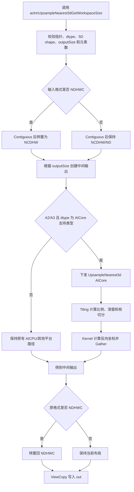
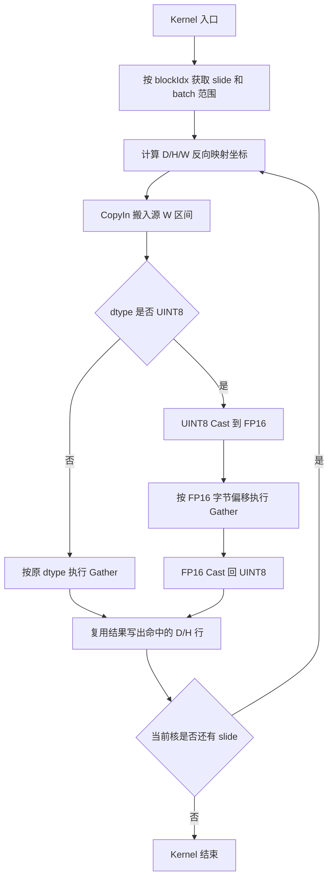

# UpsampleNearest3d算子设计方案

## 需求背景（required）

### 需求来源

现有 `aclnnUpsampleNearest3d` 在 Atlas A2/A3 上的 Ascend C 路径支持 `FLOAT32`、`FLOAT16`、`BFLOAT16`，但 `UINT8` 会在 aclnn 校验阶段被拒绝或无法进入对应的 AICore Kernel。2026 年 8 月社区任务要求在 `ops-cv/image/upsample_nearest3d` 现有实现基础上新增 `UINT8` 支持，并将开发结果提交至 `experimental/image/upsample_nearest3d`。

本次开发不改变原有接口和最近邻插值语义，仅扩展 Atlas A2 训练系列产品和 Atlas A3 系列产品上的 `UINT8` AICore 能力，并同步补充算子文档、配置和测试。

### 背景介绍

UpsampleNearest3d 对 5 维张量的 D、H、W 三个空间轴执行最近邻采样。NCDHW 逻辑布局下，输入为 `[N, C, D, H, W]`，输出为 `[N, C, D_out, H_out, W_out]`。

令某空间轴的输入长度为 `I`、输出长度为 `O`。Kernel 使用的反向映射比例为：

$$
r = \begin{cases}
1 / s, & \text{显式 scale } s > 0 \\
I / O, & \text{未显式指定合法 scale}
\end{cases}
$$

输出坐标映射到输入坐标：

$$
i_{src} = \min(\lfloor i_{dst} \cdot r \rfloor, I - 1)
$$

因此：

$$
out[n,c,d_o,h_o,w_o] = self[n,c,d_i,h_i,w_i]
$$

其中 `d_i`、`h_i`、`w_i` 分别按上述公式计算。显式 scale 描述输出相对输入的倍率，输出长度为 `floor(I * s)`；反向取样时使用其倒数。最近邻计算只复制被选中的输入值，不计算插值权重。

## 需求分析（required）

### 需求描述

在原有 UpsampleNearest3d 工程上扩展 `UINT8`，同时保持已有 `FLOAT32`、`FLOAT16`、`BFLOAT16`、`DOUBLE` 能力及 aclnn 接口不变。新增路径必须支持泛化 shape、两种缩放模式、NCDHW/NDHWC/ND 格式、非连续 Tensor 和确定性计算。

### 算子原型

```cpp
aclnnStatus aclnnUpsampleNearest3dGetWorkspaceSize(
    const aclTensor *self,
    const aclIntArray *outputSize,
    double scalesD,
    double scalesH,
    double scalesW,
    aclTensor *out,
    uint64_t *workspaceSize,
    aclOpExecutor **executor);

aclnnStatus aclnnUpsampleNearest3d(
    void *workspace,
    uint64_t workspaceSize,
    aclOpExecutor *executor,
    aclrtStream stream);
```

| 参数名 | 输入/输出/属性 | 是否必选 | 描述 | 使用说明 | 数据类型 | 数据格式 | 维度(shape) | 非连续 Tensor |
| --- | --- | --- | --- | --- | --- | --- | --- | --- |
| `self` | 输入 | 必选 | 待上采样张量。 | 不支持空 Tensor；各维均 `<= 2^31-1`；C/D/H/W 均大于 0；元素总数不超过 `INT32_MAX`。 | `FLOAT32`、`FLOAT16`、`BFLOAT16`、`DOUBLE`、`UINT8` | NCDHW、NDHWC、ND | 5 维；NCDHW/ND 逻辑 shape 为 `[N,C,D,H,W]`。 | 支持 |
| `outputSize` | 输入 | 必选 | 输出空间尺寸。 | size 必须为 3，依次为 `[D_out,H_out,W_out]`，每项范围 `[1,2^31-1]`。在 aclnn 接口中始终用于确定和校验输出 shape。 | `INT64` 数组 | - | size=3 | - |
| `scalesD` | 输入 | 必选 | D 轴输出倍率。 | outputSize 模式下三个 scale 必须同时为 0；scale 模式下三个 scale 必须同时为有限正数。 | `DOUBLE` | - | - | - |
| `scalesH` | 输入 | 必选 | H 轴输出倍率。 | 同 `scalesD`。 | `DOUBLE` | - | - | - |
| `scalesW` | 输入 | 必选 | W 轴输出倍率。 | 同 `scalesD`。 | `DOUBLE` | - | - | - |
| `out` | 输出 | 必选 | 最近邻上采样结果。 | dtype、数据格式与 `self` 一致；N、C 轴与 `self` 一致；不支持空 Tensor；元素总数不超过 `INT32_MAX`。 | 与 `self` 一致 | 与 `self` 一致 | 5 维 | 支持 |

说明：任务中的两种模式通过 scale 三元组区分。三个 scale 均为 0 时使用 `outputSize` 推导反向映射比例；三个 scale 均为有限正数时使用显式 scale。部分为 0、负数、NaN 和无穷大均为非法输入。`outputSize` 在两种模式下均承载最终输出尺寸，二者不允许表达相互矛盾的输出 shape。

### 需求拆解

1. A2/A3 的 aclnn 参数校验允许 `UINT8`，并要求 `self`、`out` dtype 一致。
1. A2/A3 的算子定义、二进制编译配置和 tiling 模板增加 `UINT8` 实例。
1. Kernel 对 `UINT8` 使用与原路径相同的多核切分、坐标计算和 GM 搬运逻辑。
1. DAV_2201 的 Gather 计算通过 FP16 桥接：UINT8 搬入后转为 FP16、执行 Gather、再转回 UINT8。`[0,255]` 内整数在 FP16 中均可精确表示，转换不改变值。
1. `FLOAT32`、`FLOAT16`、`BFLOAT16` 原有 AICore 行为保持不变；`DOUBLE` 保持原有 AICPU 路径。
1. NCDHW 和 ND 直接按 NCDHW 逻辑处理；NDHWC 由 aclnn 层转置到 NCDHW，计算后转回 NDHWC。
1. 非连续输入先执行 `Contiguous`，非连续输出通过 `ViewCopy` 写回。
1. 所有输出元素由唯一输入坐标确定，无原子累加和随机过程，满足确定性要求。

## 详细设计（required）

### 算子分析

#### 数据类型处理

| 输入 dtype | 执行路径 | Gather 计算类型 | 输出 dtype |
| --- | --- | --- | --- |
| FLOAT32 | AICore | FLOAT32 | FLOAT32 |
| FLOAT16 | AICore | FLOAT16 | FLOAT16 |
| BFLOAT16 | AICore | BFLOAT16 | BFLOAT16 |
| UINT8 | AICore | FLOAT16 精确桥接 | UINT8 |
| DOUBLE | 保持原有 AICPU 路径 | DOUBLE | DOUBLE |

UINT8 桥接过程为：

```text
GM UINT8 -> UB UINT8 -> Cast(FP16) -> Gather(FP16) -> Cast(UINT8) -> GM UINT8
```

FP16 可精确表示 0 到 2048 的所有整数，故 `UINT8 -> FP16 -> UINT8` 对任务书规定的 `[0,255]` 全值域是无损转换。转换仅服务于硬件向量 Gather，不改变坐标和插值语义。

#### 数据格式

- NCDHW：直接进入 UpsampleNearest3d AICore Kernel。
- ND：按 NCDHW 逻辑解释 5 维 shape，直接进入 Kernel。
- NDHWC：aclnn 层先按 `[0,4,1,2,3]` 转为 NCDHW，计算后按 `[0,2,3,4,1]` 转回 NDHWC。

#### 输出尺寸和比例

- `outputSize=[D_out,H_out,W_out]` 决定并校验 `out` 的空间 shape。
- `scalesD/scalesH/scalesW` 均大于 0 时，Host 将其倒数传给 DAV_2201 Kernel。
- 三个 scale 均为 0 时，Tiling 使用 `D/D_out`、`H/H_out`、`W/W_out`。
- Kernel 对每个轴执行 `min(floor(dstIndex * reverseScale), inputSize - 1)`，避免末端坐标越界。

#### 总体流程图



图 1 UpsampleNearest3d Host 到 Kernel 总体流程

### 算子实现

#### Host 侧设计

1. aclnn 校验：A2/A3 的支持列表加入 `DT_UINT8`，继续校验输入输出 dtype 一致。
1. L0 路由：DAV_2201 AICore 支持列表加入 `DT_UINT8`，避免 UINT8 回退到 AICPU。
1. OpDef：A2/A3 默认配置的输入输出 dtype 列表加入 `DT_UINT8`，格式仍为 ND。
1. Tiling key：新增 UINT8 模板枚举；当输入为 `DT_UINT8` 时生成 UINT8/UINT8 组合 key。
1. Binary config：ascend910b、ascend910_93 增加 UINT8 编译实例。
1. Shape/format/非连续处理沿用原 aclnn 逻辑，不因 dtype 分叉。

Tiling 的空间切分保持原实现：将 N、C 合并为 `batches`，D/H/W 采用滑窗；根据输出 W 方向的反向比例选择 256/768/1536/2048 的窗口长度，再结合 AIV 核数分配完整 slide 和尾 slide。仅当 D/H 输入输出均为 1、`W_out <= 64`、反向倍率不超过 80 且 `W_out` 能整除 64 时启用小 W 打包快路径；其余宽度进入通用路径，避免行间出现不足 32 字节的非法搬运步长。

#### Kernel 侧设计

Kernel 保持 `UpsampleNearest3dND<T>` 泛型结构，并增加 `T=uint8_t` 实例。

1. `Init`：解析 tiling，初始化坐标、偏移、输入输出队列。UINT8 额外申请与当前输入/输出 tile 容量匹配的 FP16 source/destination bridge buffer；固定 tile 上限下总 UB 占用不超过 DAV_2201 的可用容量。
1. `CalculateSrcIndexTensor`：使用 FP32 计算输出坐标对应的输入坐标，并执行 floor 和上界裁剪。
1. `CalculateGatherOffsetW`：普通 dtype 按 `sizeof(T)` 生成字节偏移；UINT8 桥接路径按 `sizeof(half)` 生成 Gather 偏移。
1. `CopyIn`：按原 dtype 从 GM 搬入 UB；UINT8 不在 GM 搬运阶段扩宽。
1. `Gather`：普通 dtype 沿用原 Gather。UINT8 先无损 cast 到 FP16，在 FP16 buffer 中 Gather，再按 `CAST_RINT` 转回 UINT8。
1. `CopyOut`：按原 dtype 写回 GM。D/H 方向命中同一输入位置的多个输出行仍复用同一个 W 方向 Gather 结果。

#### Kernel 计算流程图



图 2 UINT8 Kernel 计算流程

### 支持硬件

| 支持的芯片版本 | 涉及勾选 |
| --- | --- |
| Atlas A2 训练系列产品 | √ |
| Atlas A3 系列产品 | √ |

### 支持软件版本

| 软件 | 版本 |
| --- | --- |
| CANN | 算子开源仓指定版本 |

### 算子约束限制

- `self`、`out` 均为 5 维 Tensor，不支持空 Tensor。
- `self` 支持 `FLOAT32`、`FLOAT16`、`BFLOAT16`、`DOUBLE`、`UINT8`；`out` dtype 必须与 `self` 一致。
- 支持 NCDHW、NDHWC、ND；`out` 数据格式必须与 `self` 一致，ND 默认按 NCDHW 处理。
- `self` 的 C/D/H/W 和 `out` 的 D/H/W 必须大于 0；每个维度不超过 `2^31-1`。
- 输入和输出 Tensor 的元素总数均不超过 `INT32_MAX`。
- 输入和输出 shape 的 N、C 轴必须一致；NDHWC 下 C 为最后一轴。
- `outputSize` 的 size 必须为 3，各元素范围为 `[1,2^31-1]`。
- outputSize 模式和 scales 模式使用其一：三个 scale 必须同时为 0 或同时为有限正数；前者按 outputSize 推导比例，后者使用显式 scale。`outputSize` 始终与最终输出空间尺寸一致。
- `scalesD`、`scalesH`、`scalesW` 在 scales 模式下取值范围为有限的 `(0,+∞)`；部分为 0、负数、NaN 和无穷大均不支持。
- `self` 和 `out` 均支持非连续 Tensor。
- UINT8 输入值域为 `[0,255]`，最近邻计算不进行饱和以外的数值运算，输出值来自输入原值。
- 算子不使用随机数和原子累加，相同输入和属性多次执行结果一致。

## 可维可测分析

### 精度标准/性能标准

| 验收标准 | 描述（不涉及说明原因） | 标准来源 |
| --- | --- | --- |
| 精度标准 | 与 CPU/PyTorch `interpolate(..., mode='nearest')` 参考结果一致；UINT8 要求逐元素完全一致；其他 dtype 满足 AscendOpTest 默认阈值。 | 社区任务书 |
| 性能标准 | UINT8 相对相同 shape、相同倍率的 FP16 基线性能劣化不超过 5%。 | 社区任务书 |
| 确定性 | 相同输入、shape、格式和缩放参数多次运行输出一致。 | 社区任务书 |

### 测试覆盖

1. dtype：`FLOAT32`、`FLOAT16`、`BFLOAT16`、`DOUBLE`、`UINT8`，重点覆盖 UINT8 的随机值及 0/255 边界值。
1. 模式：outputSize 模式和 scales 模式；scale 覆盖 0.5、1、2、3、4。
1. 格式：NCDHW、NDHWC、ND。
1. 内存布局：连续输入输出、非连续输入、非连续输出。
1. shape：最小合法 shape、D/H/W 含 1、各轴不同倍率、下采样和上采样、较大输出；UINT8 Kernel 同时覆盖通用路径、小 W 打包路径和不能整除 64 的 W 通用回退路径。
1. 性能：任务书指定的三组 UINT8 2 倍上采样，与 `[1,3,64,64,64] -> [128,128,128]` FP16 基线在同一硬件比较。
1. 异常：非 5D、空 Tensor、dtype/format 不一致、N/C 不一致、outputSize 长度或取值非法、元素数超限。

### 兼容性分析

本改动只扩展 A2/A3 上的 UINT8 注册、路由和 Kernel 实例，不修改已有 dtype 的 tiling key、公式、内存布局或接口参数顺序。DOUBLE 保持原 AICPU 路由，其他硬件的支持范围保持原状，因此对已有调用兼容。
