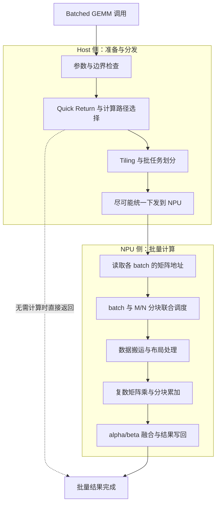

# aclblasCgemmBatched 算子技术设计文档

# 需求背景

## 需求来源

本任务来自 CANN 2026 年 8 月社区任务，要求在 Ascend 950PR 上使用 Ascend C 编程语言开发单精度复数批量通用矩阵乘 `aclblasCgemmBatched`。并提交到 `ops-blas` 开源仓。

## 背景介绍

### aclblasCgemmBatched 算子功能

`aclblasCgemmBatched` 是 BLAS Level-3 单精度复数批量矩阵乘接口。对每个批次 `i in [0,batchCount)` 执行：

```text
C[i] = alpha * op(A[i]) * op(B[i]) + beta * C[i]
```

其中：
 
- α、β为单精度复数标量（complex64）
- A、B、C为单精度复数矩阵，列主序（Column-Major）存储
- op(A)为m×k矩阵，op(B)为k×n矩阵，C为m×n矩阵


### aclblasCgemmBatched算子功能分析

通过对 cuBLAS `cublasCgemmBatched` 接口进行分析，本算子需要对每个批次 `i∈[0,batchCount)` 完成 `C[i] = alpha·op(A[i])·op(B[i]) + beta·C[i]`，并支持如下能力：

| 参数       | 参数含义                  | 参数类别     | 支持数据类型      | 约束                  |
| ---------- | ------------------------- | ------------ | ----------------- | --------------------- |
| handle     | 库上下文句柄              | handle       | `aclblasHandle_t` | 非空                  |
| transa     | 矩阵 A 操作类型           | enum         | N/T/C             | 必选                  |
| transb     | 矩阵 B 操作类型           | enum         | N/T/C             | 必选                  |
| m          | op(A) 和 C 的行数         | int          | int32             | ≥0                    |
| n          | op(B) 和 C 的列数         | int          | int32             | ≥0                    |
| k          | op(A) 列数/op(B) 行数     | int          | int32             | ≥0                    |
| alpha      | 全 batch 共用的复数标量   | scalar       | complex64         | 非空 Host 指针        |
| Aarray     | 输入矩阵 A 的指针数组     | tensor array | complex64         | Device 内存           |
| lda        | 矩阵 A 前导维度           | int          | int32             | 满足转置对应约束      |
| Barray     | 输入矩阵 B 的指针数组     | tensor array | complex64         | Device 内存           |
| ldb        | 矩阵 B 前导维度           | int          | int32             | 满足转置对应约束      |
| beta       | 全 batch 共用的复数标量   | scalar       | complex64         | 非空 Host 指针        |
| Carray     | 输入输出矩阵 C 的指针数组 | tensor array | complex64         | Device 内存，原地覆写 |
| ldc        | 矩阵 C 前导维度           | int          | int32             | ≥max(1,m)             |
| batchCount | 批处理矩阵组数量          | int          | int32             | ≥0                    |

所有矩阵采用 Column-Major；各 batch 共享 m/n/k、转置模式和 leading dimension，但矩阵地址可以不连续。转置语义如下：

- `transa=ACLBLAS_OP_N`：`op(A)=A`；
- `transa=ACLBLAS_OP_T`：`op(A)=A^T`，只转置、不共轭；
- `transa=ACLBLAS_OP_C`：`op(A)=A^H`，执行共轭转置；
- `transb` 对 `op(B)` 的语义相同。

### aclblasCgemmBatched 算子现状分析

根据任务书，当前 ops-blas 开源仓已在 `include/cann_ops_blas.h` 第 433～438 行声明 `aclblasCgemmBatched` 接口，但尚未提供 Ascend 950PR（arch35）平台的 Ascend C 实现。

本次开发目标：在 `blas/gemm_batched/arch35/` 目录下实现该算子的 Kernel 直调版本。

# 需求分析

## 需求描述

使用 Ascend C 编程语言实现 `aclblasCgemmBatched` 算子，支持 complex64 数据类型及 Device pointer-array 批处理，实现单精度复数批量通用矩阵乘功能，与 cuBLAS `cublasCgemmBatched` 的核心功能和参数语义对齐。

## 需求拆解

- 支持 complex64 数据类型，实部和虚部均为 float32；
- 支持 `transa/transb=N/T/C` 九种组合；
- 支持 Column-Major 和 `lda/ldb/ldc` padding；
- 支持 Device 侧 `Aarray/Barray/Carray` 指针数组及 1～1024 batch；
- 支持各批次地址不连续，但所有批次共享 shape、转置模式和 leading dimension；
- 实现 `m=0`、`n=0`、`batchCount=0` no-op，以及 `k=0` 或 `alpha=(0,0)` 时的 `C[i]=beta*C[i]`；
- 完成全部参数合法性校验，并保证 `beta=(0,0)` 时不读取旧 C；
- 精度满足 `rtol=9.77e-4、atol=1.53e-5、matched_ratio≥0.99`；
- 性能达到任务书规定的三组标杆耗时。

## 使能方式

使能路径说明：

- 接口声明：复用 ops-blas 仓 `include/cann_ops_blas.h` 第 433～438 行的已有声明，禁止定义 Ascend 950PR 私有接口。
- 算子实现目录：`blas/gemm_batched/arch35/`。
    - `gemm_batched_host.cpp`：Host 入口、参数校验、Tiling、workspace 和 Kernel Launch；
    - `gemm_batched_kernel.cpp`：Device 侧 Pack、复数 GEMM、Epilogue 和 Scale/Zero Kernel；
    - `gemm_batched_kernel.h`：Kernel 与 launcher 声明；
    - `gemm_batched_tiling_data.h`：Host/Kernel 共用的 Tiling 数据结构。
- 测试代码目录：`test/gemm/gemm_batched/arch35/`，包含 GTest 入口、`gemm_batched_test.csv` 和 NPU 调用封装。
- 编译集成：通过 ops-blas 的 `build.sh` 统一构建，由 CMake 选择 arch35 实现。

调用流程：

```text
用户代码 → #include "cann_ops_blas.h"
         → aclblasCreate(&handle)
         → aclblasSetStream(handle, stream)
         → 准备各批次矩阵及 Device 侧 Aarray/Barray/Carray
         → aclblasCgemmBatched(handle, transa, transb, m, n, k,
                              &alpha, Aarray, lda, Barray, ldb,
                              &beta, Carray, ldc, batchCount)
         → aclrtSynchronizeStream(stream)
         → aclblasDestroy(handle)
```

环境依赖：Ascend 950PR、CANN 9.1.0、asc-devkit ≥ 9.1；Cube Kernel 使用 tensor API。

# 详细设计（required）

## 算子分析

### 数学公式

对每个批次 `i∈[0,batchCount)`：

```text
C[i] = alpha * op(A[i]) * op(B[i]) + beta * C[i]
```

设复数元素 `a=(aReal,aImag)`、`b=(bReal,bImag)`，则：

```text
a * b = (aReal*bReal - aImag*bImag,
         aReal*bImag + aImag*bReal)
```

共轭转置时虚部取反：`conj(a)=(aReal,-aImag)`。

### 支持数据类型

complex64（实部 float32 + 虚部 float32）。`alpha/beta` 为 Host 侧复数标量，A/B/C 为 Device 侧复数矩阵。

### 支持形状

- op(A)：m × k
- op(B)：k × n
- C：m × n

### 支持参数组合

`transa(N/T/C) × transb(N/T/C)` 共 9 种组合，全部支持；batch 为 uniform pointer-array 模式，不支持 Grouped Batched。

## 算子实现

### 实现方案

#### 整体架构

采用 Ascend C Kernel 直调方式。Host 侧完成参数校验、Quick Return、Tiling 和 Kernel Launch；Device 侧从 pointer-array 读取各批次矩阵地址，并在同一次下发中完成批量计算。



#### 复数矩阵乘拆解策略

Cube 单元执行实数 MatMul，因此将每个批次的复数 GEMM 拆为 4 次 FP32 GEMM：

```text
A = AReal + j*AImag
B = BReal + j*BImag

PReal = AReal*BReal - AImag*BImag
PImag = AReal*BImag + AImag*BReal
```

最终输出：

```text
CNewReal = alphaReal*PReal - alphaImag*PImag
         + betaReal*COldReal - betaImag*COldImag

CNewImag = alphaReal*PImag + alphaImag*PReal
         + betaReal*COldImag + betaImag*COldReal
```

N 模式直接使用实部和虚部，T 模式转置实部和虚部，C 模式转置并对虚部取反。所有 batch 共用该计算逻辑，仅矩阵首地址不同。

#### host侧设计

##### 1. 参数检查

按以下优先级检查：

1. `handle==nullptr`：返回 `ACLBLAS_STATUS_HANDLE_IS_NULLPTR`；
2. transa/transb 不属于 N/T/C：返回 `ACLBLAS_STATUS_INVALID_VALUE`；
3. m/n/k/batchCount 小于 0：返回 `ACLBLAS_STATUS_INVALID_VALUE`；
4. alpha 或 beta 为空：返回 `ACLBLAS_STATUS_INVALID_VALUE`；
5. lda/ldb/ldc 不满足约束：返回 `ACLBLAS_STATUS_INVALID_VALUE`；
6. batchCount>0 且 Aarray/Barray/Carray 顶层指针为空：返回 `ACLBLAS_STATUS_INVALID_VALUE`。

##### 2. Quick Return逻辑

- `m=0`、`n=0` 或 `batchCount=0`：直接返回 `ACLBLAS_STATUS_SUCCESS`；
- `k=0` 或 `alpha=(0,0)`：对每个 C[i] 执行 `C[i]=beta*C[i]`；
    - `beta=(0,0)`：C[i] 置零且不读取旧值；
    - `beta=(1,0)`：直接返回；
    - 其他 beta：逐元素执行复数缩放。

##### 3. Tiling策略

根据 Ascend 950PR 的 L1、L0A、L0B 和 L0C 容量确定 tileM、tileN、tileK，并增加 batch 维度。主要考虑：

- complex64 每个元素 8 字节，解交织后实部/虚部分量各为 float32；
- 片上空间需容纳 A/B 的实部、虚部以及输出累加块；
- Cube 数据满足 16 字节及目标 tensor API 的对齐要求；
- TilingData 保存 m/n/k、ld、batchCount、转置模式、alpha/beta 和 tile 数量。

##### 4. 分核策略

输出按 `(batch, M-tile, N-tile)` 三维划分，并展平为线性任务：

```text
tilesPerBatch = ceilDiv(m,tileM) * ceilDiv(n,tileN)
totalTiles    = batchCount * tilesPerBatch
batchIndex    = tileId / tilesPerBatch
tileIndex     = tileId % tilesPerBatch
```

小矩阵大 batch 优先沿 batch 维铺满 AI Core；大矩阵小 batch 主要沿 M/N 分块；K 方向在单个输出块内累加。不得假设相邻 batch 的矩阵地址连续。

##### 5. 数据布局转换

输入为列主序 complex64 交织布局 `(real,imag)`。Kernel 先从 `Aarray[batchIndex]`、`Barray[batchIndex]` 读取 64 位 Device 地址，再按 lda/ldb 搬入当前 tile并解交织为实部、虚部；C 模式在搬入时对虚部取反。C 按 ldc 写回，padding 区域保持不变。

#### kernel侧设计

Kernel 分为 Init 和 Process 两个阶段；Process 内包含 CopyIn、Compute、CopyOut，并采用流水并行。

##### 1. Init阶段

- 读取 Tiling 参数并计算当前 Core 的任务范围；
- 将线性任务号解析为 batchIndex、mTileIndex、nTileIndex；
- 初始化 LocalTensor、Queue 和同步事件。

##### 2. Process阶段

每个 Core 循环处理分配到的输出块。每个输出块拥有唯一写回者，K 方向按 tileK 分段累加，完成后再融合 alpha、beta 并写回对应 C[i]。

##### 3. CopyIn阶段

- 从 Aarray/Barray/Carray 读取当前 batch 的 64 位矩阵地址；
- 按 Column-Major 和 lda/ldb 搬入 A、B tile，并解交织实部和虚部；
- 处理 N/T/C 寻址、边界 tile 和 padding；
- 仅当 `beta!=(0,0)` 时读取旧 C。

##### 4. Compute阶段

Cube 依次计算 `Ar×Br`、`Ai×Bi`、`Ar×Bi`、`Ai×Br`，Vector 单元完成实虚部加减及 alpha/beta 融合。不同 batch 计算相互独立，可由不同 Core 并行执行。

##### 5. 转置与共轭处理

| 操作模式 | 实部来源 | 虚部来源         |
| -------- | -------- | ---------------- |
| N        | 原序实部 | 原序虚部         |
| T        | 转置实部 | 转置虚部         |
| C        | 转置实部 | 转置后取负的虚部 |

transb 对 B 的处理方式相同。转置通过 CopyIn 寻址或 Cube MatMul transpose 属性实现，共轭通过虚部取反实现。

##### 6. CopyOut阶段

将输出实部和虚部重新交织为 complex64，经 `Carray[batchIndex]` 写回 C[i] 的 m×n 逻辑区域。不同 C[i] 不得重叠，ldc padding 不得改写。

##### 7. 流水线优化

采用 Double Buffer，使当前 K 分块计算时预取下一分块，并将 CopyIn、Cube Compute、Vector 融合和 CopyOut 尽量重叠。批量场景使用一次联合下发处理多个 batch，降低小矩阵逐批 Launch 开销。

undefined undefined

| 支持的芯片版本 | 是否支持 |
| -------------- | -------- |
| Ascend 950PR   | √        |

## 算子约束限制

1. 仅支持 complex64（单精度复数）数据类型。
2. 矩阵存储格式为列主序（Column-Major），与 cuBLAS 一致。
3. `transa/transb` 仅支持 N（不转置）、T（转置）、C（共轭转置）。
4. 前导维度须满足：transa=N 时 `lda≥max(1,m)`，transa=T/C 时 `lda≥max(1,k)`；transb=N 时 `ldb≥max(1,k)`，transb=T/C 时 `ldb≥max(1,n)`；`ldc≥max(1,m)`。
5. `Aarray/Barray/Carray` 为 Device 侧指针数组，各 batch 地址可以不连续，但共享 m/n/k、转置模式和 leading dimension。
6. `batchCount` 取值不小于 0；`m=0`、`n=0` 或 `batchCount=0` 时成功返回且不执行计算。
7. 算子通过 handle 绑定 stream 异步执行，读回 Device 结果前须同步 stream。
8. 依赖 asc-devkit≥9.1（`ASC_DEVKIT_MAJOR≥9` 且 `ASC_DEVKIT_MINOR>0`）。
9. C 矩阵原地覆写，不同 `C[i]` 不得重叠；当 `beta=(0,0)` 时旧 C 无需初始化且不得读取。
10. 仅支持 ld 表达的列间 padding，不支持额外 stride、Tensor view、Grouped Batched 或 batch 内不同规格。
11. 不要求确定性计算，不允许回退至 Host/CPU 或其他 backend。

# 可维可测分析

## 精度标准/性能标准

| 验收标准 | 描述                                                                                                                                                                                                 | 标准来源                     |
| -------- | ---------------------------------------------------------------------------------------------------------------------------------------------------------------------------------------------------- | ---------------------------- |
| 精度标准 | 各 batch 的实部/虚部分别按 FLOAT32 比对：`rtol=9.77e-4`、`atol=1.53e-5`、`matched_ratio≥0.99`、`max_abs_error≤1e-2` 或满足 32 ULP；golden 由 CBLAS `cgemm` 逐批生成；`alpha=(0,0)` 时执行 EXACT 校验 | 生态算子开源精度标准、任务书 |
| 性能标准 | NN、`alpha=(1,0)`、`beta=(0,0)`：256³×batch32≤36.58us，512³×batch16≤135.02us，1024³×batch8≤523.61us；warmup 后超过 50 次有效采样取平均值                                                             | 任务书要求                   |

## 兼容性分析

本次为新增 Ascend 950PR（arch35）平台实现，不修改其他产品线已有实现，不涉及历史版本兼容性问题。

接口复用 ops-blas 仓 `include/cann_ops_blas.h` 第 433～438 行已有的 `aclblasCgemmBatched` 声明，与其他产品线共用同一 API，无需定义私有接口，便于用户从 cuBLAS `cublasCgemmBatched` 迁移。
