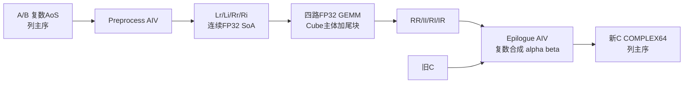
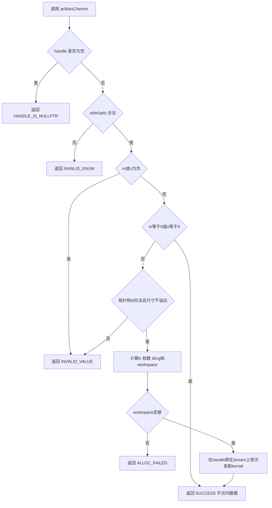
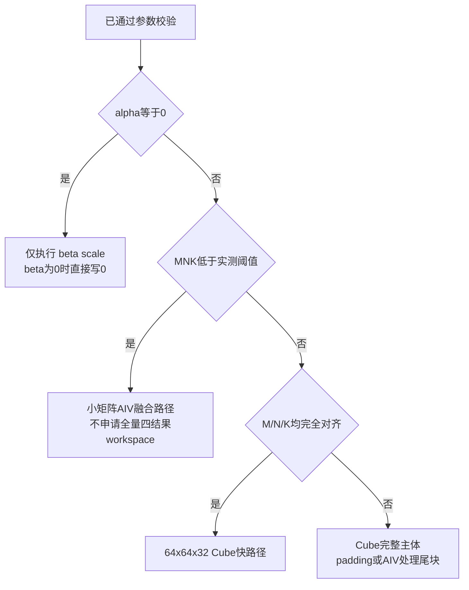

# 需求背景（required）

## 需求来源

本需求来自 CANN 2026 年 8 月社区算子任务（第 28 号，8月社区任务-aclblasChemm算子开发（A2/A3）），目标是在昇腾 ops-blas 开源仓为 aclblasChemm 补齐 Atlas A2/A3 的 arch22 实现，使公共 BLAS 接口在 A2/A3 上与 Netlib CHEMM、cuBLAS cublasChemm 的参数语义和异常行为一致。验收基线为 Atlas 800T/800I A2（Ascend 910B3）、CANN 9.1.0。

## 背景介绍

### aclblasChemm算子实现优化

aclblasChemm 实现单精度复数 Hermitian 矩阵乘。它与 Netlib BLAS `CHEMM`、cuBLAS `cublasChemm` 的参数语义一致：

    side = LEFT : C = alpha * A * B + beta * C, A 为 m x m
    side = RIGHT: C = alpha * B * A + beta * C, A 为 n x n

`A` 满足 `A = A^H`，只读取 `uplo` 指定的一个三角；对角元素虚部按 0 处理。`A/B/C` 都是 COMPLEX64，外部存储契约是 BLAS 列主序，物理地址必须使用 `row + col * ld`。

本任务的价值不只是补齐 API。复数矩阵乘若全部在 Vector Core 上标量累加，无法满足 1024、2048 方阵性能指标；设计需把复数运算分解为可由 Cube 执行的实数矩阵乘，同时正确处理 Hermitian 展开、列主序、非对齐尾块和复数后处理。

调研结论：

1. 算法采用“四次 FP32 GEMM + 复数后处理”，复用现有候选实现的总体架构。
2. 对外严格保持列主序；预处理时转换为内部连续 SoA 布局，避免让 Cube 直接理解带 `ld` 的复数 AoS。
3. 不采用 Gauss 三乘法。三乘法虽少一次 GEMM，但会引入额外加减和更强消减，较难满足 COMPLEX64 的精度与 `max_abs_error` 要求。
4. 整块交给 Cube；尾块采用 padding 或 Cube 主体加 AIV 尾块，不能因一个维度不对齐就让整个问题退化为 O(MNK) 的 AIV 标量实现。
5. 当前仓库目录已经是 `blas/hemm/arch22`，任务书却写 `blas/symm/`。实现建议跟随主仓最新目录 `hemm`，提交前请维护者确认最终落点。

### aclblasChemm算子现状分析

| 来源 | 位置/版本 | 可复用内容 | 不能直接照搬的部分 |
|---|---|---|---|
| ops-blas 主仓 | commit `003629ee096691d32a95d73e9e218c0c6976152e`，2026-08-25；`blas/hemm/arch22/` | Host 直调结构、复数拆分、Hermitian 展开、四 GEMM、64x64x32 Cube tile、epilogue、补偿重算 | 候选代码按 `row*ld+col` 访问外部矩阵；Host 校验 `ldb/ldc>=n`；非法枚举返回 `INVALID_VALUE`，均与任务契约冲突 |
| Netlib BLAS | `chemm.f` | 权威参数语义、列主序前导维、三角读取、对角虚部忽略、quick return | 标量 Fortran 实现仅作为语义/golden，不适合作为 NPU 性能实现 |
| NVIDIA cuBLAS | `cublas<t>hemm` | API 行为和 side/uplo 对照 | CUDA kernel 不开源，不能作为代码依赖 |
| ops-blas 相邻 GEMM/SYMM | 主仓公共 handle、workspace、日志和测试框架 | stream、workspace、状态码、构建与测试组织 | 需按本算子的 COMPLEX64 和 Hermitian 语义定制 |

### aclblasChemm算子功能分析

算子功能：计算 COMPLEX64 Hermitian 矩阵乘 `C = alpha * op(A) * B + beta * C`（LEFT）或 `C = alpha * B * op(A) + beta * C`（RIGHT），A 只读取 uplo 指定三角、对角虚部视为 0。

输入：handle、side、uplo、m、n、alpha、A、lda、B、ldb、beta、C、ldc。

输出：原地更新 C。

支持数据类型：COMPLEX64（alpha/beta/A/B/C 均为 COMPLEX64）。

支持形状：m、n 为任意非负整数；A 在 LEFT 时为 m×m、RIGHT 时为 n×n，B/C 为 m×n，列主序。

支持广播：不涉及 batch 和 broadcast。

# 需求分析（required）

## 需求描述

使用 Ascend C 为 aclblasChemm 实现 Atlas A2/A3 对应的 arch22 Host 与 Kernel，采用“四次 FP32 GEMM + 复数后处理”把 COMPLEX64 Hermitian 矩阵乘映射到 Cube，保持列主序与 Netlib/cuBLAS 参数语义，补齐非对齐尾块、workspace 和精度保护；在 910B3 / CANN 9.1.0 上满足精度与三条性能门槛。

## 需求拆解

1. 复用 include/cann_ops_blas.h 中已有的 aclblasChemm 公共接口。
2. 支持 side=LEFT/RIGHT、uplo=UPPER/LOWER 四种组合。
3. 支持 COMPLEX64 输入输出，A 为 Hermitian 且只读指定三角。
4. 保持 BLAS 列主序，外部访问一律 `row + col * ld`。
5. 采用四次 FP32 GEMM（RR/II/RI/IR）+ 复数 epilogue，保证 Cube 性能。
6. 处理非对齐尾块、padding 与 leading dimension，不越界访问。
7. 支持 quick return（m/n=0、alpha=0 快路径）与 workspace 校验。
8. 非法枚举返回 INVALID_ENUM，负维度返回 INVALID_VALUE。
9. 在 910B3 / CANN 9.1.0 满足 rtol/atol/matched ratio/max abs error 精度门槛。
10. 满足三条性能硬指标，并提供完整 CSV/GTest 与可复现报告。

# 详细设计（required）

## 算子分析

### 数学公式

    side = LEFT : C = alpha * A * B + beta * C, A 为 m x m
    side = RIGHT: C = alpha * B * A + beta * C, A 为 n x n

令参与乘法的左、右操作数为 L、R：LEFT 时 L=A,R=B，RIGHT 时 L=B,R=A。将复数拆为：

    L = Lr + jLi, R = Rr + jRi
    P = L * R
    Pr = Lr*Rr - Li*Ri = RR - II
    Pi = Lr*Ri + Li*Rr = RI + IR

对每个输出元素再计算：

    out.real = alpha.real*Pr - alpha.imag*Pi + beta.real*C.real - beta.imag*C.imag
    out.imag = alpha.real*Pi + alpha.imag*Pr + beta.real*C.imag + beta.imag*C.real

四个 GEMM 均为 FP32。内部逻辑尺寸统一为 `L[M,K] * R[K,N]`，LEFT 的 K=M，RIGHT 的 K=N。计算复杂度约为 4 次实数 GEMM，即 8MNK 次实数乘加量级；大矩阵属于 Cube 计算受限，小矩阵由 launch、预处理和后处理固定开销主导，故必须设置两类路径。

### 支持数据类型

仅支持 COMPLEX64。alpha/beta/A/B/C 均为 `aclblasComplex`（实部/虚部各 FLOAT32）。接口类型固定，不存在 dtype 枚举和混合精度组合。

### 支持形状

- m、n 为非负整数；任一为 0 时 quick return 成功。
- A：side=LEFT 时 m×m，RIGHT 时 n×n；只读取 uplo 指定三角。
- B、C：m×n，列主序；C 原地覆写。
- `lda >= max(1, side==LEFT ? m : n)`；`ldb >= max(1,m)`、`ldc >= max(1,m)`（不是 n）。
- A、B、C 不支持除 BLAS 前导维以外的任意 stride；不涉及 batch 和 broadcast。

尺寸、前导维以及中间元素个数在转换为 `uint32_t/size_t` 前必须做溢出检查。

## 算子实现

### 实现方案

总体架构分三段：Preprocess（AIV 做 AoS→SoA 与 Hermitian 展开）→ 四路 FP32 GEMM（Cube）→ Epilogue（AIV 做复数合成与 alpha/beta）。

阶段之间在同一 stream 顺序发射；需要时执行数据缓存 clean/invalidate，保证 AIV 写 workspace 对 AIC 可见、AIC 写结果对 epilogue 可见。

Host 校验顺序固定为 handle、枚举、尺寸、quick return、数据指针、leading dimension、范围/workspace，保证负向用例返回稳定且 quick return 不误判空数据指针。

#### 3.2.1 host侧设计

##### 1. 参数校验与调用流程

##### 2. TilingData

在现有 `ChemmMmadTiling` 上补充路径和尾块信息；所有字段保持 POD，可值传 kernel。

| 字段 | 类型 | 含义 |
|---|---|---|
| `m,n,k` | `uint32_t` | 内部 GEMM 的 M/N/K |
| `sideMode,uploMode` | `uint32_t` | Hermitian 矩阵位置与有效三角 |
| `lda,ldb,ldc` | `uint32_t` | 外部列主序前导维 |
| `alphaReal/Imag` | `float` | alpha |
| `betaReal/Imag` | `float` | beta |
| `aivCoreNum,aicCoreNum` | `uint32_t` | preprocess/epilogue 与 Cube 核数 |
| `baseM,baseN,baseK` | `uint32_t` | 建议初值 64/64/32，调优后固化 |
| `fullM/fullN/fullK` | `uint32_t` | 完整 tile 范围 |
| `tailM/tailN/tailK` | `uint32_t` | 非对齐尾部 |
| `path` | `uint32_t` | quick-scale、small-AIV、cube-hybrid |
| `workspaceBytes` | `uint64_t` | 需求大小，便于日志和边界核对 |

##### 3. 路径选择

小矩阵阈值不能凭经验永久写死，应以 910B3 上 1、2、3、5、8、16、32、48、64 等尺寸 benchmark 的交点确定。初始建议 `MNK < 64^3` 走融合 AIV，再依据 profiling 调整。

##### 4. Workspace

基础 Cube 方案所需 float 元素数：

    2*M*K + 2*K*N + 4*M*N
    bytes = align32(elements * sizeof(float))

布局按 32 Byte 对齐依次为 `Lr,Li,Rr,Ri,RR,II,RI,IR`。计算每个乘法和加法前检查 `uint64_t` 溢出，再验证 `size_t` 可表示并与 handle 有效 workspace 比较。

| 方阵 | workspace |
|---|---:|
| 1024 x 1024 | 32 MiB |
| 2048 x 2048 | 128 MiB |

ops-blas handle 的默认 workspace 为 32 MiB，因此 2048 性能 case 必须通过 `aclblasSetWorkspace` 配置至少 128 MiB；否则应返回 `ACLBLAS_STATUS_ALLOC_FAILED`，不能越界。后续优化可用双/三缓冲分块 GEMM 降低全量 workspace，但不作为首版正确性依赖。

##### 5. 分核

- Preprocess：按内部矩阵的行块或连续元素块分给 AIV，边界用 `min` 截断；避免多个核写同一 32 Byte cache line。无法保证时退为单核，而不是产生写冲突。
- Cube：tile 数为 `ceil(M/64)*ceil(N/64)`，`blockDim=min(aicCoreNum,tileCount)`；tile 按 `tileId = blockIdx + loop*blockDim` 轮转。
- Epilogue：按 `M*N` 个复数连续输出块分核。外部 C 是列主序，若内部结果是行主序，写回地址必须显式换算为 `row + col*ldc`。

#### 3.2.2 kernel侧设计

##### 1. Preprocess

目标是生成内部 `L[M,K]`、`R[K,N]` 的实/虚 SoA。所有外部访问使用列主序 `offset = row + col * ld`。

读取 Hermitian 元素 `H(row,col)`：

    UPPER:
      row <= col: A[row + col*lda]
      row >  col: conj(A[col + row*lda])
    LOWER:
      row >= col: A[row + col*lda]
      row <  col: conj(A[col + row*lda])
    row == col: imag强制为0，不读取/传播输入对角虚部

LEFT 时将展开后的 A 写入 L、B 写入 R；RIGHT 时 B 写入 L、展开后的 A 写入 R。内部布局统一为逻辑 row-major 连续数组 `row*logicalCols+col`，这是内部实现细节，不能反向改变 API 的列主序契约。CopyIn 采用 32 Byte 对齐块，非对齐首尾元素使用 DataCopyPad 或受控标量路径。

##### 2. 四路 GEMM

每个 `M x N` tile 依次或流水执行：

    RR = Lr x Rr
    II = Li x Ri
    RI = Lr x Ri
    IR = Li x Rr

- 默认基本块 `baseM=64, baseN=64, baseK=32`，K 方向循环累加 FP32。
- 使用 `Mmad`/Matmul 高阶 API，L1/L0A/L0B/L0C 做双缓冲，搬运下一 K tile 与当前计算重叠。
- `tailK` 用 0 padding，`tailM/tailN` 只写有效区；绝不读取输入 leading dimension 外的地址。
- 若目标 arch22 的 Matmul API 无法对某类尾块直接 padding，则完整主体留在 Cube，只将 `M-tailM`、`N-tailN` 边条及角块交 AIV，避免全量 fallback。
- 4 个结果可分批复用 L0C，但首版保留 GM 中四张结果，优先保证实现可验证。

##### 3. Epilogue 与精度保护

每个 AIV 核处理一段有效输出：

1. 载入 `RR/II/RI/IR`，计算 `Pr=RR-II`、`Pi=RI+IR`。
2. 计算 `alpha*P`。
3. `beta==(0,0)` 时不载入旧 C；否则从 `row+col*ldc` 载入并计算 `beta*C`。
4. 合成 COMPLEX64，以列主序写回。

四个大项发生严重消减时，FP32 Cube 的累计误差可能被放大。可复用候选实现的 double-float（hi/lo 两个 FP32）补偿，仅对满足下式的元素重算 epilogue，不全量使用高成本路径：

    abs(result) < cancellationThreshold * sum(abs(terms))

阈值通过 `chemm_test.csv` 的随机、纯虚、反号大值用例校准。NaN/Inf 按 IEEE 运算自然传播，补偿分支不得把非有限结果错误改写为有限数。

##### 4. 快速路径

- `alpha==(0,0)`：不读取 A/B，不执行 preprocess/GEMM，仅计算 `C=beta*C`。
- `alpha==0 && beta==1`：成功返回，不发射 kernel。
- `alpha==0 && beta==0`：写零，不读取旧 C。
- 不能对一般 `beta==0` 直接 quick return，因为仍需写 `alpha*op(A)*B`。

#### 3.2.3 文件组织

    blas/hemm/arch22/
      chemm_host.cpp          # API、校验、tiling、workspace、launch
      chemm_kernel.h          # host到kernel的直调声明
      chemm_kernel.cpp        # preprocess、GEMM、epilogue
      chemm_tiling_data.h     # tiling结构和workspace计算
    test/chemm/arch22/        # 或按仓库评审意见放 test/symm/chemm/arch22
      test_aclblas_chemm.cpp
      chemm_test.csv
      CMakeLists.txt

## 支持硬件

| 项目 | 结论 |
|---|---|
| Atlas A2（910B/910B3） | 目标支持，arch22；验收性能设备为 910B3 |
| Atlas A3 | 任务要求支持，沿用 arch22 产品注册并单独编译/功能验证 |
| CANN 9.1.0 | Chemm 任务书明确验收版本 |
| CANN 9.0.0 | 不能作为“满足验收”的环境；可能缺少目标仓对应 API/构建能力，必须升级或另做兼容验证 |

## 算子约束限制

1. 仅支持 COMPLEX64；不支持其他 dtype 和混合精度。
2. side 仅 LEFT/RIGHT，uplo 仅 UPPER/LOWER；非法枚举返回 `ACLBLAS_STATUS_INVALID_ENUM`。
3. m、n 为负返回 `ACLBLAS_STATUS_INVALID_VALUE`；任一为 0 时 quick return 成功。
4. A 只读取 uplo 指定三角，未指定三角即使填 NaN 也不能污染结果。
5. A 的对角虚部始终视为 0。
6. `ldb/ldc >= max(1,m)`（不是 n）；`lda >= max(1, side==LEFT ? m : n)`。
7. A、B、C 不支持除 BLAS 前导维以外的任意 stride，不涉及 batch/broadcast。
8. Device 路径异步执行，读回结果前必须同步 stream；2048 case 需配置至少 128 MiB workspace。

风险与待确认项：

| 风险/冲突 | 处理方案 |
|---|---|
| 任务书目录 `blas/symm` 与主仓 `blas/hemm` 不一致 | 设计按最新主仓 `hemm`；提 PR 前请维护者确认目录 |
| 现有候选实现外部访问实际为行主序 | 全面改为 `row+col*ld`，增加非方阵和 padding 哨兵测试 |
| 候选 Host 使用 `ldb/ldc>=n` | 修正为 `>=m`，覆盖 m/n 不相等负向用例 |
| 候选非法枚举返回 `INVALID_VALUE` | 修正为任务书要求的 `INVALID_ENUM` |
| 2048 case 超出默认 32 MiB workspace | 测试显式设置至少 128 MiB；文档和 README 说明 |
| 非对齐尺寸全量 AIV 性能差 | 采用 Cube 主体+padding/tail，不允许全量降级 |
| double-float 补偿影响性能 | 只对消减元素启用，以精度用例统计触发比例 |

不变量：

1. 只读取 uplo 指定三角，未指定三角填充为 NaN 时也不能污染结果。
2. A 的对角虚部始终视为 0。
3. padding 区不参与计算，C 的 `ldc-m` 行间 padding 不被改写。
4. `m=0` 或 `n=0` 不解引用 alpha/beta/A/B/C。
5. 同一输入、同一硬件、同一 tiling 的输出确定；不依赖原子累加顺序。

# 可维可测分析

## 精度标准/性能标准

| 验收标准 | 描述 | 标准来源 |
|---|---|---|
| 精度标准 | golden 用 Netlib/cblas `cblas_chemm`；实部虚部分别按 FLOAT32：rtol=2^-10、atol=2^-16、matched ratio>=0.99、max abs error<=1e-2 或 32 ULP | CANN 生态算子精度标准、任务书 |
| 性能标准 | 三条固定 case：1024 左侧 779.63 us、2048 左侧 3525.22 us、1024 右侧 530.71 us（910B3 平均） | 任务书 |
| 内存标准 | workspace 按 `2*M*K + 2*K*N + 4*M*N` 计算并 32 Byte 对齐 | 实现设计 |

测试矩阵：

| 类别 | 必测内容 |
|---|---|
| 基本功能 | LEFT/RIGHT 与 UPPER/LOWER 四组合；m/n 为 1、2、3、8、64 |
| 泛化尺寸 | 方阵、m远大于n、n远大于m；63/64/65、127/128/129、1023/1024/1025 |
| leading dimension | `lda/ldb/ldc` 取最小值和带 padding 值；padding 置哨兵并验证未改写 |
| Hermitian | 无效三角填 NaN；对角虚部填非零；共轭元素、纯实、纯虚 |
| 标量 | alpha/beta 为 0、1、纯虚、负值、大值；alpha=0 的三条快路径 |
| 特殊值 | B/C 中 NaN、+Inf、-Inf、+0/-0；与 cblas 的分类结果一致 |
| 负向 | 空 handle、非法枚举、负维度、空指针、非法 ld、尺寸/workspace 溢出 |
| 性能 | 任务书三个固定 case，warmup 后有效采样大于 50 次 |

性能计时只包围异步执行对应的 stream 区间，先 warmup，再采样至少 51 次；记录平均值、P50/P90、workspace、AIC/AIV 利用率和各阶段时间。若未达标，按 preprocess、4 GEMM、epilogue 分段定位：GEMM 占比高时检查 Cube tile、L1/L0 双缓冲、四路输入复用和 AIC 利用率；preprocess 高时向量化 AoS→SoA 与共轭展开；epilogue 高时融合四结果合成、alpha/beta 和写回，beta=0 禁止无效读 C；尾块性能断崖时确认没有整问题 AIV fallback。

可维可测：

- Host 日志输出 side/uplo/M/N/K、路径、核数和 `required/available workspace`，不打印数据。
- kernel 侧不在热路径打印；调试构建可用阶段完成标记定位 cache 可见性问题。
- Tiling 单元测试覆盖每个路径、边界、核数上限、workspace 溢出。
- 测试报告分别列功能、精度、性能和内存；性能报告注明设备 SKU、CANN、频率策略与 commit。
- API 返回 kernel launch 错误，不能无条件返回 SUCCESS。

## 兼容性分析

| 用途 | 库 |
|---|---|
| 目标代码 | `cann/ops-blas` |
| golden | Netlib BLAS 的 CBLAS（`cblas_chemm`，常见实现可用 OpenBLAS） |
| API 对照 | Netlib BLAS、NVIDIA cuBLAS 文档；cuBLAS 不是构建依赖 |
| 测试 | ops-blas 自带 GTest/CSV 框架 |

运行时实现不依赖第三方数学库，只依赖 `ops-blas`、Ascend C/ACL runtime。

兼容性结论：接口签名、参数顺序、状态码与 stream 语义与既有 ops-blas 约定一致；新增 arch22 文件、不改动 arch35 算法；列主序与 leading dimension 契约与 Netlib/cuBLAS 对齐；路径与 workspace 优化不改变数学分支和输出编码。
