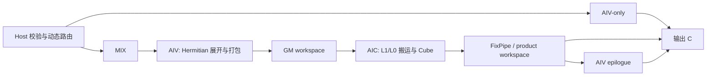

# 需求背景（required）

## 需求来源

本需求来自 CANN 社区任务“8 月社区任务-aclblasChemm 算子开发”。任务要求在 `ops-blas` 中补齐 `aclblasChemm` 的 arch22 实现，算子代码位于 `blas/symm/arch22/`，测试代码位于 `test/symm/chemm/arch22/`，公共接口沿用 `include/cann_ops_blas.h` 中的既有声明。

## 背景介绍

### aclblasChemm 算子实现优化

`aclblasChemm` 用于单精度复数 Hermitian 矩阵乘：

```text
side = LEFT : C = alpha * A * B + beta * C
side = RIGHT: C = alpha * B * A + beta * C
```

其中 A 为 Hermitian 矩阵。接口只读取 `uplo` 指定的三角区域，另一半由共轭对称关系得到，对角元素的虚部按 0 处理。A、B、C 均采用 column-major COMPLEX64 布局。

### aclblasChemm 算子现状分析

公共接口和工程框架已具备，arch22 需要补充 Host、Kernel 和测试实现。主要难点如下：

1. 外部数据为复数交错布局和列主序，Cube 计算前需要完成 Hermitian 展开及实虚部打包。
2. 输入包含极小矩阵、常规矩阵和窄高矩阵，需要按问题规模及片上容量动态选择执行路径。
3. MIX 路径中的 AIC/AIV 通过 GM workspace 交换数据，需要减少搬运和同步空泡。
4. 非对齐尾块、leading dimension、三角读取和对角虚部需要严格满足 BLAS 语义。

### aclblasChemm 算子功能分析

| 项目 | 支持能力 |
| --- | --- |
| 数据类型 | COMPLEX64 |
| side | LEFT、RIGHT |
| uplo | UPPER、LOWER |
| 数据布局 | column-major，支持合法 lda/ldb/ldc |
| Hermitian 语义 | 读取指定三角；非对角共轭；对角虚部为 0 |
| 标量 | FP32 复数 alpha、beta |
| 形状 | m、n 为运行时非负整数；零维为合法 no-op |

# 需求分析（required）

## 需求描述

使用 Ascend C 实现 `aclblasChemm`，支持 LEFT/RIGHT、UPPER/LOWER、column-major、Hermitian 语义、leading dimension 和任务范围内的泛化输入，并满足任务书规定的精度与性能要求。

## 需求拆解

1. 完成参数校验、quick return、workspace 申请和异步 kernel 发射。
2. 为小规模问题提供低启动开销的 AIV 路径。
3. 为通用问题提供 AIC Cube 与 AIV 协同的 MIX 路径。
4. 为窄高问题提供提高 Cube 有效利用率的专用数据流。
5. 根据形状、系数、核数和片上容量动态计算 tiling、blockDim 与 workspace。
6. 覆盖任务书要求的正确性、性能和异常输入验证。

# 详细设计（required）

## 算子分析

### 数学公式

令参与乘法的左右操作数为 L、R：LEFT 时 `L=A,R=B`，RIGHT 时 `L=B,R=A`。

```text
L = Lr + i*Li
R = Rr + i*Ri
P.real = Lr*Rr - Li*Ri
P.imag = Lr*Ri + Li*Rr
C = alpha*P + beta*C
```

Hermitian 元素读取规则为：

```text
UPPER: row <= col 读取 A(row,col)，否则读取 conj(A(col,row))
LOWER: row >= col 读取 A(row,col)，否则读取 conj(A(col,row))
row == col: imag = 0
```

### 支持数据类型

仅支持 `aclblasComplex`（COMPLEX64）。A、B、C 的实部和虚部均为 FLOAT32，内部 Cube 累加与 AIV 向量计算使用 FLOAT32。

### 支持形状

- `m,n >= 0`；任一为 0 时返回成功且不访问矩阵数据。
- LEFT：A 为 m×m；RIGHT：A 为 n×n；B、C 均为 m×n。
- `lda >= max(1, side==LEFT ? m : n)`，`ldb >= max(1,m)`，`ldc >= max(1,m)`。
- 支持非对齐矩形和合法 leading dimension padding。
- 不支持 batch、broadcast 及 leading dimension 之外的任意 stride。

## 算子实现

### 实现方案

Host 根据输入几何、系数特征、核数和片上容量动态选择执行路径。整体数据流如下：



#### 3.2.1 host 侧设计

##### 参数校验

按 handle、枚举、维度、zero-size、leading dimension、指针和尺寸溢出的顺序进行校验。`alpha=0,beta=1` 时直接返回，不发射 kernel。

##### 路由与分核

| 路径 | 选择依据 | 分核原则 |
| --- | --- | --- |
| AIV | 小规模、低网格、simple coefficient | 输出 tile 独占写回，核数不超过 tile 数 |
| 通用 MIX | AIV 收益不足的通用输入 | 按输出 tile 网格分配 AIC group |
| panel MIX | 窄输出且稳定操作数可驻留 | 限制 group 数，增加单核复用 |
| narrow MIX | RIGHT 窄 Hermitian 维度 | 按连续行块切分，选择 stream、resident 或 staged 模式 |

blockDim 由有效 tile 数、可用 AIC/AIV 核数和单核工作量共同确定，避免工作过度切碎。

##### 数据分块与 workspace

- 通用 Cube tile 采用 M/N/K 分块，完整块和尾块共用统一几何描述。
- UB 用于复数拆分、Hermitian 展开、mask 和系数合成。
- L1 用于缓存可复用操作数，L0A/L0B 承载 Cube 输入，L0C 使用 ping-pong。
- GM workspace 保存 AIV 打包输入、复用缓存和 AIC/AIV 交换结果。
- workspace 大小使用无符号宽整数逐项检查乘加溢出后计算。

##### Tiling 数据

Tiling 数据传递矩阵维度、leading dimension、side/uplo、系数路径、tile 几何、分核参数和 workspace 偏移。有限的布局组合由模板实例化，运行时尺寸和路由保持动态。

#### 3.2.2 kernel 侧设计

##### AIV 路径

AIV 以输出 tile 分核，使用连续 DMA、vector mask 和 repeat 完成 Hermitian 读取、复数乘加、系数处理与尾块写回。每个输出 tile 仅由一个核写回，避免核间归约。

##### 通用 MIX 路径

一个 MIX block 由 AIC 和 AIV 协同完成：AIV 将列主序复数块打包为 Cube 所需的 FLOAT32 布局并写入 workspace；AIC 经 GM→L1→L0A/L0B 完成 MMAD；简单系数和完整块优先由 FixPipe 直接写回，通用系数或尾块由 AIV 完成 epilogue。输入和结果使用多槽缓冲，使预处理、Cube 和写回重叠。

##### 窄高路径

窄高路径扩大单次行方向工作块并让 Hermitian 操作数驻留。resident 模式在容量允许时缓存本核输入；stream 模式使用环形缓冲连续推进；staged 模式先由 AIV 批量预处理连续行段，再由 AIC 连续完成 Cube 与 FixPipe 写回，以减少细粒度跨核同步。

所有同步只用于真实的数据依赖，事件按流水和缓冲槽配对使用，不引入全流水 barrier。

## 支持硬件

| 支持的芯片版本 | 涉及勾选 |
| --- | --- |
| Atlas A2 | √ |

## 算子约束限制

1. 仅支持 COMPLEX64。
2. alpha、beta 为 Host 指针，A、B、C 为 Device 指针。
3. C 为输出地址；beta=0 时不读取 C 原值。
4. 只读取 uplo 指定三角，对角虚部按 0 处理，C padding 不写入。
5. 不支持 batch、broadcast 和 leading dimension 之外的任意 stride。

# 可维可测分析

## 精度标准/性能标准

| 验收标准 | 描述 | 标准来源 |
| --- | --- | --- |
| 精度标准 | 任务书全部功能、异常及精度用例通过 | 任务书 |
| 性能标准 | 任务书全部性能用例逐点满足 GPU 基线比例要求 | 任务书 |

## 兼容性分析

| 项目 | 说明 |
| --- | --- |
| 公共接口 | 沿用 `include/cann_ops_blas.h` 的 `aclblasChemm` 声明 |
| 参数语义 | 与 CHEMM 的 LEFT/RIGHT、UPPER/LOWER、column-major 和 Hermitian 语义一致 |
| 工程目录 | Host/Kernel 位于 `blas/symm/arch22/`，测试位于 `test/symm/chemm/arch22/` |
| 其他产品线 | 不修改其他架构实现，公共声明保持兼容 |
